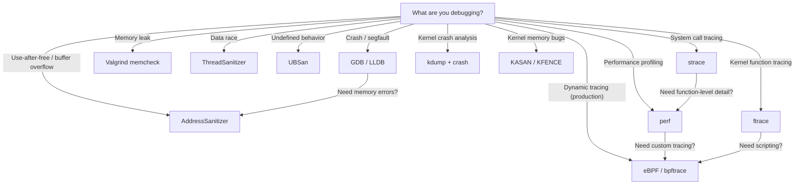

# Debugging Overview

Linux provides a rich ecosystem of debugging tools, from traditional debuggers and tracers to
modern eBPF-based observability platforms. Choosing the right tool depends on what you're
debugging — a userspace crash, a kernel hang, a performance bottleneck, or a memory leak.

## Introduction

Debugging on Linux spans multiple domains:

- **Debuggers** — interactive inspection of program state (GDB, LLDB)
- **Tracers** — observe system calls, function calls, and events (strace, ltrace, ftrace)
- **Profilers** — measure where time is spent (perf, gprof)
- **Dynamic tracing** — instrument running code without recompilation (eBPF, SystemTap)
- **Memory debugging** — detect leaks, use-after-free, races (Valgrind, sanitizers)
- **Kernel debugging** — crash dumps, kernel tracing (kdump, ftrace, KASAN)

## Tool Selection Guide



## GDB — The GNU Debugger

GDB is the standard debugger for Linux. It supports C, C++, Rust, Go, and many other languages.

### Basic Usage

```bash
# Compile with debug info
gcc -g -O0 -o myapp myapp.c

# Run under GDB
gdb ./myapp

# Inside GDB
(gdb) break main              # Set breakpoint
(gdb) run arg1 arg2           # Run with arguments
(gdb) next                    # Step over
(gdb) step                    # Step into
(gdb) continue                # Continue execution
(gdb) print variable          # Print value
(gdb) backtrace               # Show call stack
(gdb) info locals             # Show local variables
(gdb) watch variable          # Break on variable change
(gdb) display variable        # Auto-print on each stop
```

### Debugging a Core Dump

```bash
# Enable core dumps
ulimit -c unlimited

# Run program (generates core on crash)
./myapp
# Segmentation fault (core dumped)

# Analyze core
gdb ./myapp core
(gdb) bt
# #0  0x0000555555555149 in process_data (ptr=0x0) at myapp.c:42
# #1  0x00005555555551bb in main () at myapp.c:67
(gdb) frame 0
(gdb) print ptr
# $1 = 0x0
```

### Remote Debugging

```bash
# On target (e.g., embedded device)
gdbserver :1234 ./myapp

# On host
gdb ./myapp
(gdb) target remote 192.168.1.100:1234
(gdb) break main
(gdb) continue
```

### GDB with Docker/Containers

```bash
# Run container with ptrace capability
docker run --cap-add=SYS_PTRACE --security-opt seccomp=unconfined -it myapp

# Or attach from host
docker exec -it <container> gdb -p $(pgrep myapp)
```

## strace — System Call Tracer

strace intercepts and displays system calls made by a process. It's the first tool to reach
for when a program fails mysteriously.

### Common Usage

```bash
# Trace all system calls
strace ./myapp

# Trace specific syscalls
strace -e trace=open,read,write ./myapp

# Trace file operations
strace -e trace=file ./myapp

# Trace network operations
strace -e trace=network ./myapp

# Trace process management
strace -e trace=process ./myapp

# Show timestamps
strace -t ./myapp

# Show time spent in each syscall
strace -T ./myapp

# Show syscall counts (summary)
strace -c ./myapp
# % time     seconds  usecs/call     calls    errors syscall
# ------ ----------- ----------- --------- --------- -------
#  45.00    0.045000          45      1000           read
#  30.00    0.030000          30      1000           write
#  15.00    0.015000        1500        10           open
#  10.00    0.010000          10      1000           close

# Attach to running process
strace -p $(pidof nginx)

# Follow child processes
strace -f ./myapp

# Output to file
strace -o trace.log ./myapp

# Limit string size in output
strace -s 1024 ./myapp
```

### Diagnosing "File Not Found"

```bash
strace -e trace=openat ./myapp 2>&1 | grep -i "no such"
# openat(AT_FDCWD, "/lib/libfoo.so", O_RDONLY) = -1 ENOENT (No such file or directory)
# openat(AT_FDCWD, "/usr/lib/libfoo.so", O_RDONLY) = -1 ENOENT
# openat(AT_FDCWD, "/usr/local/lib/libfoo.so", O_RDONLY) = 3
```

### Diagnosing Permission Denied

```bash
strace -e trace=openat,access ./myapp 2>&1 | grep -i "denied\|perm"
# openat(AT_FDCWD, "/etc/secret.conf", O_RDONLY) = -1 EACCES (Permission denied)
```

## perf — Performance Profiler

perf is the standard Linux profiling tool. It uses hardware performance counters and kernel
tracing to measure CPU usage, cache misses, branch mispredictions, and more.

### Basic Profiling

```bash
# Record CPU profile
perf record -g ./myapp

# View report
perf report

# Record system-wide (requires root)
sudo perf record -a -g sleep 10

# Profile specific process
perf record -p $(pidof myapp) -g sleep 5

# Real-time top-like view
sudo perf top
```

### Event Counting

```bash
# Count hardware events
perf stat ./myapp
#  Performance counter stats for './myapp':
#
#          1,234.56 msec  task-clock
#                15      context-switches
#                 2      cpu-migrations
#           123,456      page-faults
#     4,567,890,123      cycles
#     2,345,678,901      instructions    # 0.51 insn per cycle
#       456,789,012      branches
#        12,345,678      branch-misses   # 2.71% of branches

# Count specific events
perf stat -e cache-misses,cache-references,L1-dcache-load-misses ./myapp

# Tracepoint events
perf stat -e syscalls:sys_enter_read ./myapp
```

### Flame Graphs

```bash
# Record with call graph
perf record -g -F 99 ./myapp

# Generate flame graph (using Brendan Gregg's scripts)
git clone https://github.com/brendangregg/FlameGraph.git
perf script | FlameGraph/stackcollapse-perf.pl | FlameGraph/flamegraph.pl > flame.svg
```

## ftrace — Kernel Function Tracer

ftrace is the kernel's built-in tracing framework. It can trace kernel functions, measure
latency, and track scheduling without any external tools.

### Usage via tracefs

```bash
# Mount tracefs (usually auto-mounted)
sudo mount -t tracefs none /sys/kernel/tracing

# Available tracers
cat /sys/kernel/tracing/available_tracers
# nop function function_graph

# Trace all kernel functions
sudo sh -c 'echo function > /sys/kernel/tracing/current_tracer'
sudo sh -c 'echo 1 > /sys/kernel/tracing/tracing_on'
sleep 1
sudo sh -c 'echo 0 > /sys/kernel/tracing/tracing_on'
cat /sys/kernel/tracing/trace | head -20

# Trace specific functions
sudo sh -c 'echo "do_sys_open" > /sys/kernel/tracing/set_ftrace_filter'
sudo sh -c 'echo function > /sys/kernel/tracing/current_tracer'

# Function graph tracer (shows call graph with timing)
sudo sh -c 'echo function_graph > /sys/kernel/tracing/current_tracer'
sudo sh -c 'echo do_sys_open > /sys/kernel/tracing/set_graph_function'
cat /sys/kernel/tracing/trace_pipe
#  0)               |  do_sys_open() {
#  0)   0.542 us    |    getname();
#  0)               |    do_filp_open() {
#  0)   0.125 us    |      path_init();
#  0)   0.208 us    |      link_path_walk();
#  0)   0.083 us    |      do_last();
#  0)   0.042 us    |      namei();
#  0)   1.234 us    |    }
#  0)   2.125 us    |  }
```

### trace-cmd (ftrace Frontend)

```bash
# Install
sudo apt install trace-cmd

# Record kernel function trace
sudo trace-cmd record -p function_graph -g do_sys_open
sudo trace-cmd report | head -50

# Trace specific events
sudo trace-cmd record -e sched_switch sleep 1
sudo trace-cmd report

# Trace with filters
sudo trace-cmd record -e sched_switch --filter 'prev_comm == "myapp"' sleep 1
```

## eBPF — Extended Berkeley Packet Filter

eBPF is the modern approach to dynamic kernel tracing. It allows safe, efficient programs
to run in the kernel, attached to tracepoints, kprobes, and other hook points.

### bpftrace

```bash
# Install
sudo apt install bpftrace

# Trace syscalls by process
sudo bpftrace -e 'tracepoint:syscalls:sys_enter_* { @[probe] = count(); }'

# Trace opens by filename
sudo bpftrace -e 'tracepoint:syscalls:sys_enter_openat { printf("%s %s\n", comm, str(args->filename)); }'

# Histogram of read sizes
sudo bpftrace -e 'tracepoint:syscalls:sys_exit_read /args->ret > 0/ { @bytes = hist(args->ret); }'

# Trace process execution
sudo bpftrace -e 'tracepoint:syscalls:sys_enter_execve { printf("%s -> %s\n", comm, str(args->filename)); }'

# Count function calls
sudo bpftrace -e 'kprobe:do_sys_open { @[comm] = count(); }'

# Latency histogram
sudo bpftrace -e 'kprobe:do_sys_open /retval == 0/ { @latency = hist(nsecs - @start[tid]); } kretprobe:do_sys_open { @start[tid] = nsecs; }'
```

### BCC Tools

```bash
# Install BCC tools
sudo apt install bpfcc-tools

# Run latency for opens
sudo opensnoop-bpfcc

# Trace block I/O
sudo biosnoop-bpfcc

# Profile CPU
sudo profile-bpfcc -F 99 10

# Trace TCP connections
sudo tcpconnect-bpfcc

# Show file I/O latency
sudo fileslower-bpfcc 10

# Trace page cache hits/misses
sudo cachestat-bpfcc
```

### libbpf / BPF CO-RE

For production use, eBPF programs are typically written in C using libbpf:

```c
// minimal.bpf.c
#include <vmlinux.h>
#include <bpf/bpf_helpers.h>

SEC("tracepoint/syscalls/sys_enter_write")
int trace_write(struct trace_event_raw_sys_enter *ctx) {
    u32 pid = bpf_get_current_pid_tgid() >> 32;
    bpf_printk("write from pid %d", pid);
    return 0;
}

char LICENSE[] SEC("license") = "GPL";
```

```bash
# Build with clang
clang -O2 -target bpf -g -c minimal.bpf.c -o minimal.bpf.o
```

## LLDB

LLDB is the LLVM debugger, often preferred for Rust and Swift:

```bash
# Debug a Rust program
rustc -g myapp.rs
lldb ./myapp

(lldb) break set --name main
(lldb) run
(lldb) frame variable
(lldb) next
(lldb) thread backtrace
```

## When to Use Which Tool

| Scenario                          | Primary Tool         | Secondary Tool       |
|-----------------------------------|----------------------|----------------------|
| Segfault / crash                  | GDB                  | strace, ASan         |
| Memory leak                       | Valgrind memcheck    | ASan (leak detector) |
| Use-after-free                    | ASan                 | Valgrind             |
| Data race                         | TSan                 | eBPF / bpftrace      |
| Performance bottleneck            | perf                 | eBPF, ftrace         |
| "Why does this file not open?"    | strace               | eBPF                 |
| Kernel hang                       | ftrace               | SysRq                |
| Kernel crash                      | kdump + crash        | KASAN                |
| Production observability          | eBPF / bpftrace      | ftrace               |
| System call audit                 | strace / auditd      | eBPF                 |
| Network debugging                 | tcpdump / ss         | eBPF                 |
| Undefined behavior                | UBSan                | Valgrind             |
| Lock contention                   | perf + ftrace        | bpftrace             |
| Scheduling latency                | ftrace / perf        | eBPF                 |

## Tool Availability by Environment

| Tool         | Userspace | Kernel | Requires Root | Requires Debug Symbols |
|--------------|-----------|--------|---------------|------------------------|
| GDB          | ✅        | ❌     | No*           | Recommended            |
| strace       | ✅        | ❌     | No*           | No                     |
| perf         | ✅        | ✅     | Partial       | Recommended            |
| ftrace       | ❌        | ✅     | Yes           | No                     |
| eBPF         | ✅        | ✅     | Yes           | For symbols            |
| Valgrind     | ✅        | ❌     | No            | No                     |
| Sanitizers   | ✅        | ❌     | No            | No (compile-time)      |
| SystemTap    | ✅        | ✅     | Yes           | For kernel             |
| kdump        | ❌        | ✅     | Yes           | Yes                    |

* `ptrace` YAMA scope may require `CAP_SYS_PTRACE`

## Kernel Development Tools (from docs.kernel.org)

The kernel documentation at `docs.kernel.org/dev-tools/index.html` provides a comprehensive index of development tools specifically for kernel development. These tools span static analysis, dynamic analysis, code coverage, and testing frameworks.

### Static Analysis Tools

| Tool | Purpose |
|------|--------|
| **Sparse** | Type checking for kernel-specific annotations (`__user`, `__kernel`, `__iomem`) |
| **Coccinelle** | Semantic code matching and transformation ("semantic patches") |
| **Checkpatch** | Coding style and formatting checker |
| **clang-format** | Automatic code formatting according to kernel style |
| **UAPI Checker** | Validates userspace API header consistency |

### Dynamic Analysis / Sanitizers

| Tool | Detects |
|------|--------|
| **KASAN** (Kernel Address Sanitizer) | Use-after-free, buffer overflows, out-of-bounds access |
| **KMSAN** (Kernel Memory Sanitizer) | Uninitialized memory reads |
| **UBSAN** (Undefined Behavior Sanitizer) | Integer overflow, null deref, alignment issues |
| **KCSAN** (Kernel Concurrency Sanitizer) | Data races between concurrent threads |
| **KFENCE** (Kernel Electric-Fence) | Low-overhead use-after-free and out-of-bounds detection |
| **kmemleak** | Kernel memory leaks |

### Testing Frameworks

| Framework | Description |
|-----------|-------------|
| **KUnit** | In-kernel unit testing framework (runs tests in a lightweight UML or real kernel) |
| **kselftest** | Self-test suite for kernel features, runs from user space |
| **KTAP** | Kernel Test Any Protocol — standardized test output format |
| **Lock Torture** | Stress tests for locking primitives |

### Code Coverage

- **KCOV**: Code coverage collection for fuzzing (used by syzkaller)
- **gcov**: GCC-based code coverage for the kernel

### Profiling and Optimization

- **AutoFDO**: Automatic Feedback-Directed Optimization using profiling data
- **Propeller**: Profile-guided binary optimization
- **GPIO Sloppy Logic Analyzer**: DIY logic analyzer using GPIO pins

### Containerized Builds

The kernel supports building inside containers for reproducible build environments, with configuration for user ID mapping and environment variables.

## References

- [GDB Manual](https://sourceware.org/gdb/documentation/) — official docs
- [strace(1) man page](https://man7.org/linux/man-pages/man1/strace.1.html)
- [perf Tutorial](https://perf.wiki.kernel.org/index.php/Tutorial) — kernel wiki
- [ftrace Documentation](https://www.kernel.org/doc/html/latest/trace/ftrace.html) — kernel docs
- [eBPF Documentation](https://ebpf.io/docs/) — ebpf.io
- [bpftrace Reference Guide](https://github.com/bpftrace/bpftrace/blob/master/docs/reference_guide.md)
- [Brendan Gregg's Linux Performance](https://www.brendangregg.com/linuxperf.html) — comprehensive tools map
- [LWN: Tracing the kernel](https://lwn.net/Articles/tracing/) — overview articles
- [kernel.org: Debugging](https://www.kernel.org/doc/html/latest/dev-tools/gdb-kernel-debugging.html) — kernel debugging with GDB
- [Kernel Development Tools](https://docs.kernel.org/dev-tools/index.html) — Official index of kernel dev tools

## Related Topics

- [Crash Dumps](./crash-dump.md) — kernel crash analysis
- [Sanitizers](./sanitizers.md) — compile-time memory safety tools
- [Valgrind](./valgrind.md) — dynamic binary analysis
- [SystemTap](./systemtap.md) — kernel and userspace tracing
