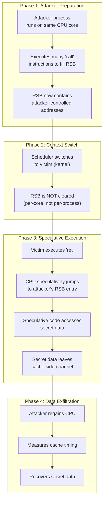
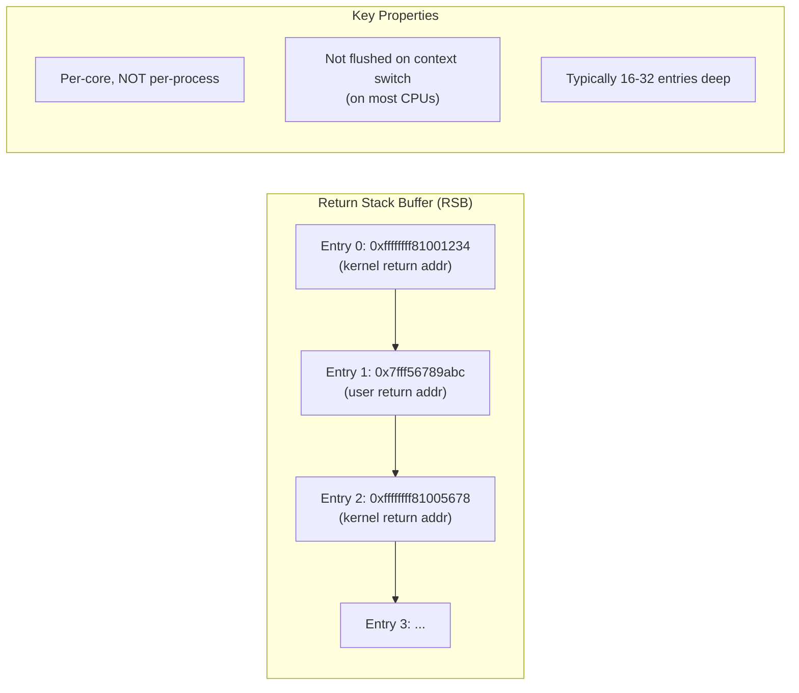
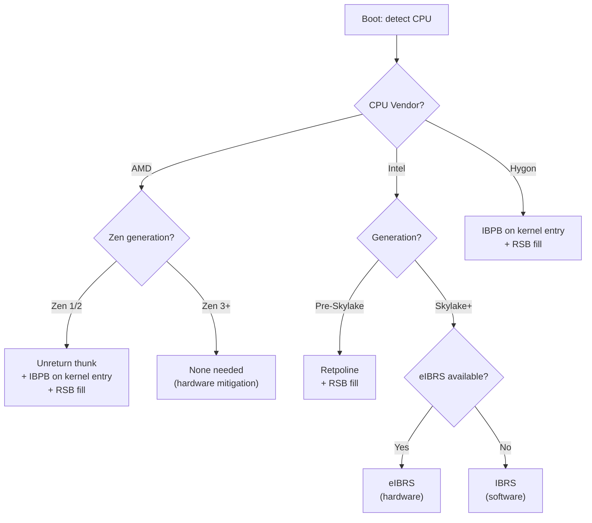
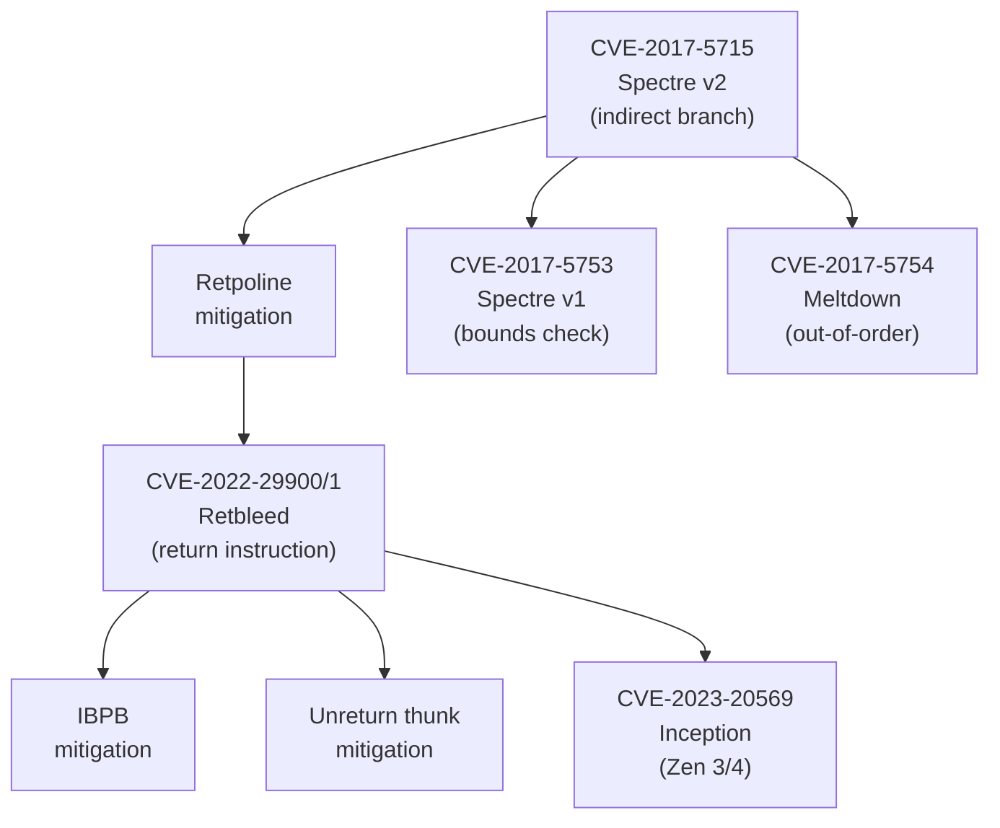

# Retbleed

## Introduction

Retbleed is a class of speculative execution vulnerabilities that exploit **return instructions** to leak data across security boundaries. It was disclosed in July 2022 by researchers at ETH Zurich (Johannes Wikner and Kaveh Razavi) and affects AMD and Intel processors.

Retbleed is particularly significant because it **bypasses retpoline**, the standard Spectre-v2 mitigation that was deployed across the industry since 2018. On AMD processors, retpoline actually *amplifies* the vulnerability by converting indirect branches into the very instruction (`ret`) that is vulnerable.

## The Attack: Step by Step



## Background: Speculative Execution and Returns

### Branch Prediction

Modern CPUs execute instructions **speculatively** — they guess the outcome of branches and begin executing the predicted path before the result is known. If the guess is wrong, the speculative results are discarded, but side effects on the cache remain, enabling information leakage.

| Branch Type | Predictor | Speculation Target |
|---|---|---|
| **Conditional branch** | Conditional predictor | `if/else` paths |
| **Indirect branch** | Branch Target Buffer (BTB) | `call *reg`, `jmp *reg` |
| **Return** | Return Stack Buffer (RSB) / RAS | Address after `call` |

### The Return Stack Buffer (RSB)

The RSB (also called RAS — Return Address Stack) is a small hardware stack that predicts return addresses. When a `call` instruction executes, the return address is pushed onto the RSB. When a `ret` instruction executes, the CPU pops the predicted address from the RSB and speculatively jumps there.



### Why Returns Are Special

`ret` instructions use the RSB to predict the return target. The RSB is **per-core**, not per-process. A context switch does not automatically clear the RSB (on most CPUs). An attacker can pre-fill the RSB with gadget addresses before yielding the CPU.

### Gadgets

The attacker needs **gadgets** — short code sequences ending in `ret` that:

1. Load a secret value into a register
2. Use that register as an address for a memory access
3. The memory access modifies the cache

Example kernel gadget (simplified):

```asm
mov rax, [rdi]       ; load secret
mov rbx, [rax * 8]   ; cache-dependent access (encode secret in cache)
ret
```

## The Retbleed Attack in Detail

### 1. RSB Poisoning

```
Attacker process:
  1. Fills the RSB with attacker-controlled addresses
     (by executing many 'call' instructions with controlled targets)
  2. Triggers a context switch to the victim (kernel or another process)
```

### 2. Speculative Execution

```
Victim process:
  3. Executes a 'ret' instruction
  4. CPU speculatively jumps to the attacker's RSB entry
  5. Speculative code accesses secret data
  6. Secret data leaves a cache trace (side channel)
```

### 3. Data Recovery

```
Attacker process:
  7. Re-gains execution
  8. Measures cache timing to recover the secret
     (Flush+Reload or Prime+Probe technique)
```

### Why Retpoline Fails on AMD

**Retpoline** (return trampoline) was the original Spectre-v2 mitigation for indirect branches. It replaces indirect jumps with a `ret`-based sequence:

```asm
; Retpoline gadget (standard Spectre-v2 mitigation)
call .setup
.pause: lfence
       jmp .pause
.setup:
       mov [rsp], %rdi   ; target address
       ret                ; jumps to %rdi, but RSB is safe
```

On AMD CPUs, `ret` instructions are predicted using a **perceptron** (not a simple table), making them vulnerable to sophisticated training attacks. Retpoline converts indirect branch attacks into return attacks — **amplifying** the vulnerability on AMD.

## Affected Processors

### AMD Processors

| Family | Architecture | Vulnerable | Notes |
|---|---|---|---|
| Family 17h | Zen 1 | **Yes** | AMD recommends IBPB on every kernel entry |
| Family 17h, rev A | Zen 1+ | **Yes** | Same as Zen 1 |
| Family 18h | Zen 2 | **Yes** | IBPB recommended |
| Family 19h | Zen 3 | **No** (hardware mitigation) | IBRS/SBRS present |
| Family 19h, rev 21+ | Zen 3+ | **No** | Hardware mitigation |
| Family 17h (Hygon) | Hygon Dhyana | **Yes** | AMD derivative, same mitigation |

### Intel Processors

| Generation | Architecture | Vulnerable | Notes |
|---|---|---|---|
| Pre-Skylake (6th gen) | Broadwell, Haswell | **Yes** (limited) | Retpoline works |
| Skylake (6th gen) | Skylake | **Yes** | Retpoline insufficient; needs IBRS |
| Kaby Lake (7th gen) | Kaby Lake | **Yes** | Same as Skylake |
| Coffee Lake (8th-9th gen) | Coffee Lake | **Yes** | Same as Skylake |
| Ice Lake (10th gen) | Ice Lake | **Yes** | eIBRS available |
| Tiger Lake (11th gen) | Tiger Lake | **Yes** | eIBRS available |
| Alder Lake (12th gen+) | Golden Cove+ | **No** (hardware) | IBRS/eIBRS effective |

### Checking Your CPU

```bash
# Check CPU model
lscpu | grep "Model name"
# Model name: Intel(R) Core(TM) i7-8700K CPU @ 3.70GHz

# Check CPU family/model
cat /proc/cpuinfo | grep -E "cpu family|model" | head -2
# cpu family  : 6
# model       : 158

# Check if CPU supports IBRS/IBPB/STIBP
grep -E "ibrs|ibpb|stibp" /proc/cpuinfo | head -3
# bugs        : cpu_meltdown spectre_v1 spectre_v2 spec_store_bypass ...
# flags       : ... ibrs ibpb stibp ...

# Check vulnerability status
grep . /sys/devices/system/cpu/vulnerabilities/retbleed
# "Mitigation: untrained return thunk; IBPB disabled; PBRSB-eIBRS Not affected"
```

## Mitigations

### 1. Retpoline (Intel Pre-Skylake)

For older Intel CPUs where `ret` is not vulnerable:

```asm
; Retpoline gadget
call .setup
.pause: lfence
       jmp .pause
.setup:
       mov [rsp], %rdi   ; target address
       ret                ; jumps to %rdi, but RSB is safe
```

The `lfence` loop prevents speculative execution past the `call`.

### 2. IBRS / eIBRS (Intel)

**Indirect Branch Restricted Speculation** (IBRS) is a hardware feature (MSR bit) that restricts speculation:

- **IBRS** (v1): requires MSR write on every kernel entry (slow)
- **eIBRS** (enhanced, v2): automatically restricts speculation when entering ring 0 (much faster)

```c
// IBRS MSR write (x86)
#define MSR_IA32_SPEC_CTRL     0x00000048
#define SPEC_CTRL_IBRS         (1 << 0)

static inline void ibrs_enable(void)
{
    wrmsrl(MSR_IA32_SPEC_CTRL, SPEC_CTRL_IBRS);
}

static inline void ibrs_disable(void)
{
    wrmsrl(MSR_IA32_SPEC_CTRL, 0);
}
```

### 3. IBPB (AMD)

**Indirect Branch Prediction Barrier** (IBPB) flushes the entire branch prediction state on context switch. It is expensive (~2-5 µs per switch) but effective.

```c
#define MSR_IA32_PRED_CMD      0x00000049
#define SPEC_CTRL_IBPB         (1 << 0)

static inline void indirect_branch_prediction_barrier(void)
{
    wrmsrl(MSR_IA32_PRED_CMD, SPEC_CTRL_IBPB);
}
```

### 4. RSB Fill (All CPUs)

On context switch, fill the RSB with safe addresses:

```c
static void __always_inline fill_rsb(void)
{
    asm volatile (
        ".rept 32\n\t"
        "call .+4\n\t"    /* push a safe address onto RSB */
        ".rept 5\n\t"
        "nop\n\t"
        ".endr\n\t"
        "add $4, %%rsp\n\t"
        ".endr\n\t"
        : : : "memory"
    );
}
```

### 5. Unreturn Thunk (AMD)

The kernel replaces `ret` instructions with a safe alternative sequence that uses an `lfence` to prevent speculative execution:

```asm
; Unreturn thunk
jmp *%rsp              ; instead of ret
lfence                 ; barrier
```

### Combined Strategy (Linux 5.19+)



## Kernel Configuration

### Boot Parameter

```
retbleed=<mode>
```

| Mode | Effect |
|---|---|
| `auto` | Kernel chooses based on CPU (default) |
| `off` | Disable mitigation (**dangerous**) |
| `auto,nosmt` | Like auto, but also disable SMT/Hyper-Threading |
| `ibpb` | Force IBPB on AMD |
| `ibrs` | Force IBRS on Intel |
| `retpoline` | Force retpoline |
| `unret` | Force unreturn thunk (RSB stuffing) |

```bash
# Check current boot parameters
cat /proc/cmdline | tr ' ' '\n' | grep retbleed
# retbleed=auto

# Set at boot (GRUB)
# Edit /etc/default/grub:
GRUB_CMDLINE_LINUX="retbleed=auto"
sudo update-grub
```

### Checking Current Mitigation

```bash
# Check CPU vulnerability status
grep . /sys/devices/system/cpu/vulnerabilities/retbleed

# Output examples:
# "Mitigation: untrained return thunk; IBPB disabled; PBRSB-eIBRS Not affected"
# "Mitigation: IBRS; IBPB conditional; RSB filling; PBRSB-eIBRS Not affected"
# "Vulnerable: Retpoline usage is not safe; IBPB disabled"
# "Not affected"

# Check all CPU vulnerabilities
grep . /sys/devices/system/cpu/vulnerabilities/*
# /sys/devices/system/cpu/vulnerabilities/retbleed: Mitigation: ...
# /sys/devices/system/cpu/vulnerabilities/spectre_v1: Mitigation: ...
# /sys/devices/system/cpu/vulnerabilities/spectre_v2: Mitigation: ...
# /sys/devices/system/cpu/vulnerabilities/meltdown: Mitigation: ...
```

### Compile-Time Options

```
CONFIG_RETPOLINE=y              # Retpoline support
CONFIG_MITIGATION_RETPOLINE=y   # Enable retpoline (5.19+ naming)
CONFIG_CPU_MITIGATIONS=y        # General mitigation framework
CONFIG_CPU_SRSO=y               # Speculative Return Stack Overflow (AMD)
CONFIG_SLS=y                    # Straight-Line Speculation mitigations
```

```bash
# Check current kernel config
grep -E "RETPOLINE|MITIGATION|CPU_MIT" /boot/config-$(uname -r)
# CONFIG_RETPOLINE=y
# CONFIG_MITIGATION_RETPOLINE=y
# CONFIG_CPU_MITIGATIONS=y
```

## Performance Impact

### Overhead by Mitigation

| Mitigation | Overhead | Workload |
|---|---|---|
| IBPB (AMD) | 2-5% | General computing |
| IBPB (AMD, syscalls) | 5-15% | Syscall-heavy workloads |
| eIBRS (Intel) | 1-3% | General computing |
| Retpoline | 2-5% | Branch-heavy code |
| SMT disabled | 20-40% | Multi-threaded workloads |
| Unreturn thunk | 3-8% | Return-heavy code paths |

### Measuring Overhead

```bash
# Baseline (before mitigation)
# Add retbleed=off to boot parameters (DANGEROUS - benchmark only)
perf stat -e instructions,cycles -- ./workload

# With mitigation enabled
perf stat -e instructions,cycles -- ./workload

# Compare IPC (instructions per cycle) and wall time
# IPC drop indicates mitigation overhead

# Detailed branch statistics
perf stat -e branch-instructions,branch-misses,branches -- ./workload
```

### Workload-Specific Impact

```
┌─────────────────────────────────────────────────────────────┐
│              Retbleed Mitigation Performance Impact          │
├─────────────────────┬──────────┬──────────┬────────────────┤
│ Workload            │ IBPB     │ eIBRS    │ SMT disabled   │
├─────────────────────┼──────────┼──────────┼────────────────┤
│ Web server (nginx)  │ 2-3%     │ 1-2%     │ 15-25%         │
│ Database (MySQL)    │ 5-10%    │ 2-4%     │ 20-35%         │
│ Compilation (gcc)   │ 3-5%     │ 1-3%     │ 25-40%         │
│ HPC (scientific)    │ 2-4%     │ 1-2%     │ 30-50%         │
│ Syscall-intensive   │ 8-15%    │ 3-5%     │ 20-30%         │
│ I/O-bound           │ 1-3%     │ 1-2%     │ 10-20%         │
└─────────────────────┴──────────┴──────────┴────────────────┘
```

### Reducing Overhead

- **Use CPUs with hardware mitigations** (Zen 3+, Alder Lake+)
- **Gaming/desktop**: `retbleed=off` may be acceptable (no multi-tenant risk)
- **Server/cloud**: always enable full mitigations
- **Consider disabling SMT** only if the workload is security-critical and single-threaded

## Real-World Troubleshooting

### Scenario 1: Verifying Mitigation Status

```bash
# Check all vulnerability mitigations
echo "=== CPU Vulnerability Status ==="
for f in /sys/devices/system/cpu/vulnerabilities/*; do
    echo "$(basename $f): $(cat $f)"
done

# Check retbleed specifically
cat /sys/devices/system/cpu/vulnerabilities/retbleed
# Mitigation: untrained return thunk; IBPB disabled; PBRSB-eIBRS Not affected

# Check if mitigation is active
dmesg | grep -i retbleed
# [    0.000000] retbleed: mitigation: untrained return thunk

# Check kernel command line
cat /proc/cmdline | tr ' ' '\n' | grep -E "retbleed|ibpb|ibrs|retpoline"
```

### Scenario 2: Performance Regression After Kernel Update

```bash
# If performance dropped after a kernel update, check if retbleed mitigation is the cause

# 1. Benchmark with current (mitigated) kernel
time ./benchmark_workload
# real    0m12.345s

# 2. Temporarily disable mitigation (DANGEROUS - test only)
# Add retbleed=off to boot parameters, reboot
# Run benchmark again
time ./benchmark_workload
# real    0m10.567s

# 3. Calculate overhead
# Overhead = (12.345 - 10.567) / 10.567 * 100 = 16.8%

# 4. If overhead is unacceptable, consider:
#    - Upgrading to a CPU with hardware mitigations
#    - Using retbleed=auto,nosmt if SMT is not needed
#    - Accepting the risk in a trusted environment (retbleed=off)
```

### Scenario 3: VM Performance Issues

```bash
# Check host mitigation status
grep . /sys/devices/system/cpu/vulnerabilities/retbleed

# Check if guest sees the vulnerability
# Inside VM:
grep . /sys/devices/system/cpu/vulnerabilities/retbleed

# For QEMU/KVM, check if host mitigations are passed through
qemu-system-x86_64 -cpu host,+ibpb,+ibrs,+stibp ...

# Check for nested virtualization impact
cat /sys/module/kvm_amd/parameters/nested
# Y or N
```

### Scenario 4: Building a Custom Kernel with Specific Mitigations

```bash
# 1. Get kernel source
apt install linux-source
cd /usr/src/linux-source-$(uname -r | cut -d- -f1)

# 2. Configure mitigations
scripts/config --enable CONFIG_CPU_MITIGATIONS
scripts/config --enable CONFIG_RETPOLINE
scripts/config --enable CONFIG_MITIGATION_RETPOLINE
scripts/config --enable CONFIG_CPU_SRSO
scripts/config --disable CONFIG_RETHUNK  # if you don't want unreturn

# 3. Build
make -j$(nproc)
make modules_install
make install

# 4. Verify
grep -E "RETPOLINE|MITIGATION" /boot/config-$(uname -r)
```

## Related Vulnerabilities

| CVE | Name | Year | Mechanism | Affected |
|---|---|---|---|---|
| CVE-2017-5715 | Spectre v2 | 2018 | Indirect branch predictor | Intel, AMD, ARM |
| CVE-2017-5753 | Spectre v1 | 2018 | Bounds check bypass | Intel, AMD, ARM |
| CVE-2017-5754 | Meltdown | 2018 | Out-of-order execution | Intel |
| CVE-2022-29900 | Retbleed (AMD) | 2022 | Return instruction speculation | AMD Zen 1/2 |
| CVE-2022-29901 | Retbleed (Intel) | 2022 | Return instruction speculation | Intel Skylake+ |
| CVE-2023-20569 | Inception (AMD) | 2023 | Return address speculation | AMD Zen 3/4 |
| CVE-2022-26373 | Retbleed (Intel) | 2022 | Return-based prediction | Intel |
| CVE-2023-33951 | GhostRace | 2024 | Speculative race conditions | Intel, AMD |
| CVE-2024-2193 | Speculative Return Stack Overflow | 2024 | RSB overflow | AMD |



## The Story Behind Retbleed

The ETH Zurich researchers discovered that:

1. On AMD, `ret` instructions are predicted using a **perceptron** (not a simple table), making them vulnerable to sophisticated training attacks.
2. Retpoline, the standard Spectre-v2 mitigation, converts indirect jumps into `ret` instructions — **amplifying** the vulnerability on AMD.
3. The RSB can be poisoned through a **return address stack buffer speculation attack** (PBRSB), which is a variant of Retbleed.

The disclosure was coordinated with AMD, Intel, and the Linux kernel security team. Patches were merged in Linux 5.19-rc7 (July 2022).

## Kernel Source References

The Retbleed mitigation code is primarily in:

```bash
# Main mitigation logic
arch/x86/kernel/cpu/bugs.c          # CPU vulnerability handling
arch/x86/kernel/cpu/common.c        # CPU feature detection
arch/x86/include/asm/nospec-branch.h # Retpoline/unreturn thunks
arch/x86/lib/retpoline.S            # Assembly thunks

# Boot parameter handling
arch/x86/kernel/cpu/bugs.c          # retbleed= parsing

# RSB filling
arch/x86/kernel/cpu/bugs.c          # fill_rsb() implementation

# IBPB/IBRS MSR handling
arch/x86/kernel/cpu/common.c        # MSR writes
```

## References

- **Retbleed paper**: [retbleed.com](https://comsec.ethz.ch/retbleed/)
- **LWN: Retbleed**: [lwn.net/Articles/902433/](https://lwn.net/Articles/902433/)
- **LWN: Retbleed mitigations**: [lwn.net/Articles/903015/](https://lwn.net/Articles/903015/)
- **AMD whitepaper**: "Software Techniques for Managing Speculation"
- **Intel whitepaper**: "Retpoline: A Branch Target Injection Mitigation"
- **Kernel documentation**: `Documentation/admin-guide/hw-vuln/retbleed.rst`
- **Source**: `arch/x86/kernel/cpu/bugs.c`

## Further Reading

- [The Linux Kernel Documentation](https://docs.kernel.org/)
- [LWN.net - Linux and free software news](https://lwn.net/)
- [GNU Project Documentation](https://www.gnu.org/doc/doc.html)
- [GNU Manuals](https://www.gnu.org/manual/manual.html)
- [Free Software Directory](https://directory.fsf.org/wiki/Main_Page)
- [Planet GNU](https://planet.gnu.org/)
- [Free Software Books](https://www.gnu.org/doc/other-free-books.html)

- <https://comsec.ethz.ch/retbleed/> — Original Retbleed research paper
- <https://www.kernel.org/doc/html/latest/admin-guide/hw-vuln/retbleed.html> — Kernel documentation
- <https://access.redhat.com/solutions/retbleed> — Red Hat Retbleed guide
- <https://github.com/speed47/spectre-meltdown-checker> — Vulnerability checker script

## Cross-References

- [Spectre](./spectre.md) — The original speculative execution attack
- [Meltdown](./meltdown.md) — Related kernel memory leak
- [KPTI](./kpti.md) — Kernel page-table isolation
- [Branch Prediction](../arch/x86/branch-prediction.md) — CPU branch predictors
- [SMT/Hyperthreading](../arch/x86/smt.md) — Related to speculation risks
- [Inception](./inception.md) — AMD-specific Retbleed variant
