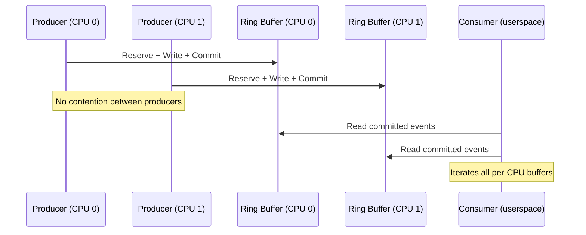
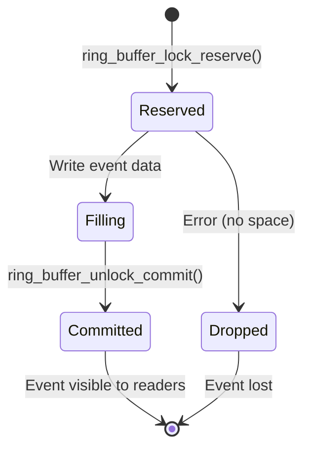

# Ring Buffer — Lockless Implementation in the Linux Kernel

## Overview

The Linux kernel's **ring buffer** (also called the **trace ring buffer** or
`trace_buffer`) is a high-performance, lockless data structure used primarily
by the ftrace and perf subsystems for recording events with minimal overhead.
It implements a producer-consumer pattern where producers (kernel events) write
data without taking locks, and consumers (userspace readers) read completed data
at their own pace.

The ring buffer design is central to Linux tracing infrastructure, enabling
millions of events per second to be recorded with negligible impact on system
performance.

## Historical Context

The ring buffer has evolved significantly:

- **Linux 2.6.28** (2008): Initial lockless ring buffer by Steven Rostedt,
  replacing the earlier locked implementation
- **Linux 2.6.30**: Major improvements to the sub-buffer architecture
- **Linux 3.x–4.x**: Performance optimizations, splice support, per-CPU buffers
- **Linux 5.x+**: Integration with BPF, further lockless improvements

## Architecture

### Core Design Principles

1. **Lockless producers**: writers never take locks; they use per-CPU buffers
   and atomic operations
2. **Sub-buffer organization**: the ring is divided into pages (sub-buffers)
   that are committed atomically
3. **Reserve-commit pattern**: producers reserve space, fill it, then commit
4. **Reader isolation**: readers see only committed data; uncommitted writes
   are invisible

### Ring Buffer Layout

```
                    Producer (per-CPU)
                         │
                         ▼
+--------+--------+--------+--------+--------+--------+
|  Page 0|  Page 1|  Page 2|  Page 3|  Page 4|  Page 5|
| (done) | (done) | (fill) | (empty)| (empty)| (empty)|
+--------+--------+--------+--------+--------+--------+
    ▲                   ▲
    │                   │
 Reader head        Writer head
```

Each page is a **sub-buffer** containing:

- **Page header**: metadata (commit count, timestamps, overwrite flag)
- **Events**: variable-length event records
- **Padding**: alignment to event boundaries

### Per-CPU Buffers

Each CPU has its own ring buffer instance, eliminating producer contention:

```c
struct ring_buffer {
    struct ring_buffer_per_cpu **buffers;  /* per-CPU array */
    int cpus;                              /* number of CPUs */
    /* ... flags, stats ... */
};
```

This design means:

- No locks between CPUs for writes
- Writers are always on the local CPU (preemption disabled during reserve/commit)
- Readers must iterate across all per-CPU buffers

## The Reserve-Commit Pattern

### Writing an Event

The write path follows a three-phase pattern:

```c
/* 1. Reserve: claim space in the ring buffer */
struct ring_buffer_event *event;
event = ring_buffer_lock_reserve(buffer, length);

/* 2. Fill: write event data into reserved space */
void *data = ring_buffer_event_data(event);
memcpy(data, payload, length);

/* 3. Commit: make the event visible to readers */
ring_buffer_unlock_commit(buffer, event);
```

### Reserve Phase

```c
struct ring_buffer_event *
ring_buffer_lock_reserve(struct ring_buffer *buffer, unsigned long length)
{
    struct ring_buffer_per_cpu *cpu_buffer;
    struct ring_buffer_event *event;
    unsigned long flags;

    local_irq_save(flags);          /* Prevent preemption/interrupts */
    cpu_buffer = buffer->buffers[raw_smp_processor_id()];
    event = __ring_buffer_alloc(cpu_buffer, length, &flags);
    return event;
}
```

The allocation:

1. Calculates the total event size (header + data + padding)
2. Checks if there's space in the current sub-buffer
3. If not, moves to the next sub-buffer (advancing the write head)
4. Returns a pointer to the reserved space

### Commit Phase

```c
void ring_buffer_unlock_commit(struct ring_buffer *buffer,
                               struct ring_buffer_event *event)
{
    /* Update the event header with final timestamp */
    /* Update the sub-buffer's commit count */
    /* The event is now visible to readers */
    local_irq_restore(flags);
}
```

### Atomicity

An event becomes visible to readers only when committed. The commit is atomic
with respect to the sub-buffer boundary — a reader never sees a partially
written event.

## Event Format

Each event in the ring buffer has a fixed header:

```c
struct ring_buffer_event {
    u32 type_len:5;    /* Type or length (see below) */
    u32 time_delta:27; /* Delta from previous event timestamp */
    u32 cpu:5;         /* CPU that generated the event */
    u32 preempt_count:8; /* Preemption count at event time */
    u32 pid:19;        /* PID of the generating task */
    /* Optional: type-specific data follows */
};
```

### Event Types

| Type          | type_len Value | Description                          |
|---------------|----------------|--------------------------------------|
| `RINGBUF_TYPE_PADDING` | 0   | Padding to align to next event       |
| `RINGBUF_TYPE_TIME_EXTEND` | 1 | Extended timestamp (32-bit delta)  |
| `RINGBUF_TYPE_TIME_STAMP` | 2 | Full 64-bit timestamp              |
| `RINGBUF_TYPE_DATA_TYPE_LEN_SHIFT` | 3–31 | Data event with length = type_len |
| `RINGBUF_TYPE_DATA`  | 0 (with explicit length) | Data event, length in next word |

### Timestamp Handling

Timestamps use a delta encoding scheme:

- The first event in a sub-buffer has a full 64-bit timestamp
- Subsequent events store a 27-bit delta from the previous event
- If the delta exceeds 27 bits, a `TIME_EXTEND` event is inserted

This minimizes per-event overhead while maintaining microsecond precision.

## Sub-Buffers

### Page-Based Organization

Each sub-buffer is typically one page (4 KiB), though configurable:

```c
#define BUF_PAGE_SIZE 4096

struct buffer_page {
    struct list_head list;       /* List node in the page list */
    struct page *page;           /* The actual data page */
    unsigned write;              /* Write offset within page */
    unsigned entries;            /* Number of committed entries */
    unsigned long real_end;      /* Actual end of usable data */
};
```

### Sub-Buffer States

Each sub-buffer is in one of three states:

1. **Writing**: the current target for new events (write head points here)
2. **Committed**: contains only committed events (safe for readers)
3. **Overwrite**: old data that may be overwritten if the reader is too slow
   (in overwrite mode)

### Commit Count

The sub-buffer header maintains a **commit count** that tracks how many bytes
have been committed. Readers use this to determine how much data is safe to
read:

```c
unsigned commit = local_read(&bpage->commit);
/* Read up to 'commit' bytes — everything beyond is still being written */
```

## Reader Implementation

### Iterating Events

```c
struct ring_buffer_iter *
ring_buffer_read_start(struct ring_buffer *buffer, int cpu);

struct ring_buffer_event *
ring_buffer_iter_peek(struct ring_buffer_iter *iter, u64 *ts);

void ring_buffer_read_finish(struct ring_buffer_iter *iter);
```

A reader:

1. Creates a per-CPU iterator
2. Reads events sequentially, respecting the commit boundary
3. Advances the reader head after consuming events
4. Released events become eligible for overwrite (in overwrite mode)

### Reader Locking

Readers take a lightweight spinlock per per-CPU buffer:

```c
raw_spin_lock_irqsave(&cpu_buffer->reader_lock, flags);
/* Read events */
raw_spin_unlock_irqrestore(&cpu_buffer->reader_lock, flags);
```

This lock only serializes multiple readers on the same CPU; it does not
block producers.

### Splice Support

The ring buffer supports `splice()` for efficient data transfer to userspace
without copying:

```c
int pipe[2];
pipe(pipe);
splice(ring_buffer_fd, NULL, pipe[1], NULL, 4096, SPLICE_F_MOVE);
```

## Overwrite vs. Producer Mode

### Producer Mode (Default)

- Writing stops when the ring buffer is full
- Events are lost if the buffer is full (reported via `overrun` counter)
- Guarantees readers see all events (none are overwritten)
- Best for: event logging where completeness matters

### Overwrite Mode

- Writing continues even when the ring buffer is full
- Oldest unread events are overwritten
- Readers see a sliding window of the most recent events
- Best for: monitoring, profiling, real-time analysis

```c
/* Switch to overwrite mode */
ring_buffer_overwrite_mode(buffer);

/* Check for overwritten events */
unsigned long overruns = ring_buffer_overruns(cpu_buffer);
```

## perf Ring Buffer

The perf subsystem uses its own ring buffer implementation, separate from the
ftrace ring buffer but with similar design principles:

### perf mmap Ring Buffer

```c
/* Map the perf ring buffer */
struct perf_event_mmap_page *mmap_page;
mmap_page = mmap(NULL, (page_count + 1) * page_size,
                 PROT_READ | PROT_WRITE, MAP_SHARED, perf_fd, 0);

/* The ring buffer follows the mmap_page */
void *ring_base = (void *)mmap_page + page_size;
```

### perf Ring Buffer Layout

```
+-------------------+
| mmap_page (header)|  ← metadata, head/tail pointers
+-------------------+
|   Ring data       |  ← circular buffer of perf_event records
|   (variable size) |
+-------------------+
```

### perf Event Types

| Event               | Description                              |
|----------------------|------------------------------------------|
| `PERF_RECORD_SAMPLE` | Sampled counter value + register state   |
| `PERF_RECORD_MMAP`   | Memory mapping event                     |
| `PERF_RECORD_COMM`   | Process name change                      |
| `PERF_RECORD_EXIT`   | Process exit                             |
| `PERF_RECORD_FORK`   | Process fork                             |
| `PERF_RECORD_LOST`   | Events lost due to buffer overflow       |
| `PERF_RECORD_SWITCH` | Context switch event                     |

### perf Lockless Design

The perf ring buffer uses a similar lockless design:

- **Writer** (kernel): updates `data_head` after writing events
- **Reader** (userspace): reads `data_tail` to know how much has been consumed
- **Memory barriers**: `smp_wmb()` after write, `smp_rmb()` before read

```c
/* Kernel writes an event */
write_event_to_ring(...);
smp_wmb();                    /* Ensure event data is visible before head update */
WRITE_ONCE(mmap_page->data_head, new_head);

/* Userspace reads */
u64 head = READ_ONCE(mmap_page->data_head);
smp_rmb();                    /* Ensure head is read before event data */
/* Process events from data_tail to head */
smp_mb();                     /* Ensure all reads complete before updating tail */
WRITE_ONCE(mmap_page->data_tail, new_tail);
```

## Lockless Techniques

### Atomic Operations

The ring buffer avoids locks through:

- **Per-CPU buffers**: producers never contend with each other
- **Local IRQ disable**: prevents preemption during reserve-commit sequences
- **Commit count atomics**: `local_read()`/`local_write()` for sub-buffer
  commit tracking
- **Memory barriers**: ensure ordering between data writes and visibility
  updates

### The "Slow Path" vs. "Fast Path"

**Fast path** (no contention):
1. Disable IRQs locally
2. Allocate space in current sub-buffer
3. Write event
4. Commit
5. Enable IRQs

**Slow path** (sub-buffer full):
1. Allocate new sub-buffer
2. Link it into the page list
3. Update write head
4. Proceed with fast path

### Reader vs. Producer Race

A subtle race exists when a reader catches up to the writer:

- The reader checks the commit count before reading
- If the commit count indicates data is still being written, the reader waits
- The writer updates the commit count atomically after writing all event data

This ensures readers never see partially written events without requiring
reader-writer locks.

## Integration with ftrace

ftrace is the primary consumer of the kernel ring buffer:

```bash
# Enable tracing
echo 1 > /sys/kernel/debug/tracing/tracing_on

# Set buffer size (per-CPU, in pages)
echo 8192 > /sys/kernel/debug/tracing/buffer_size_kb

# Read events
cat /sys/kernel/debug/tracing/trace_pipe
```

### ftrace Event Recording

When a tracepoint fires:

```c
/* Simplified ftrace tracepoint handler */
static inline void trace_event_template(...) {
    struct ring_buffer_event *event;
    struct trace_entry *entry;

    event = trace_buffer_lock_reserve(tr->trace_buffer.buffer,
                                      sizeof(*entry), ...);
    if (!event)
        return;  /* Buffer full or allocation failed */

    entry = ring_buffer_event_data(event);
    /* Fill entry fields from tracepoint arguments */

    ring_buffer_unlock_commit(tr->trace_buffer.buffer, event);
}
```

### Per-CPU Buffer Configuration

```bash
# Set per-CPU buffer sizes individually
echo 4096 > /sys/kernel/debug/tracing/per_cpu/cpu0/buffer_size_kb
echo 8192 > /sys/kernel/debug/tracing/per_cpu/cpu1/buffer_size_kb

# Check current usage
cat /sys/kernel/debug/tracing/per_cpu/cpu0/entries
```

## BPF and Ring Buffer

### BPF Ring Buffer (bpf_ringbuf)

Linux 5.8 introduced a dedicated BPF ring buffer (`bpf_ringbuf`) that shares
the lockless design philosophy but is optimized for BPF program use:

```c
/* BPF program writing to ring buffer */
struct event *e;
e = bpf_ringbuf_reserve(&ringbuf, sizeof(*e), 0);
if (!e)
    return;
e->pid = bpf_get_current_pid_tgid();
e->ts = bpf_ktime_get_ns();
bpf_ringbuf_submit(e, 0);
```

### BPF Ring Buffer vs. perf Buffer

| Feature          | perf buffer (`BPF_MAP_TYPE_PERF_EVENT_ARRAY`) | BPF ring buffer (`BPF_MAP_TYPE_RINGBUF`) |
|------------------|-----------------------------------------------|------------------------------------------|
| Per-CPU          | Yes (one buffer per CPU)                      | No (shared across CPUs)                  |
| Variable-size    | No (fixed-size events)                        | Yes (variable-size records)              |
| Reservation      | No                                            | Yes (`bpf_ringbuf_reserve/submit`)       |
| Efficiency       | Good for per-CPU workloads                    | Better for global event ordering         |
| Memory           | Per-CPU × size                                | Single shared buffer                     |

## Performance Characteristics

### Throughput

The ring buffer can handle:

- **ftrace ring buffer**: millions of events per second across all CPUs
- **perf ring buffer**: hundreds of thousands of samples per second
- **BPF ring buffer**: millions of events per second (depending on event size)

### Latency

- **Write latency**: typically < 100 ns per event (lockless fast path)
- **Read latency**: depends on reader implementation; splice is fastest
- **Buffer full**: drops are instantaneous (no blocking)

### Memory Overhead

- Per-CPU buffer: configurable, typically 1–8 MiB per CPU
- Per-event overhead: 8–16 bytes (header) + alignment padding
- perf mmap overhead: one page per CPU + ring data pages

## Monitoring and Debugging

### ftrace Statistics

```bash
# Per-CPU buffer stats
cat /sys/kernel/debug/tracing/per_cpu/cpu0/stats
# entries: 12345
# overrun: 0
# commit overrun: 0
# bytes: 1234567
# oldest event ts: 1234567890.123456
# now ts: 1234567900.123456
# dropped events: 0
# read events: 12345
```

### perf Statistics

```bash
# perf report with buffer statistics
perf record -e cycles --stat
perf report --header
```

### Common Issues

1. **Buffer overruns**: increase `buffer_size_kb` or reduce event rate
2. **Lost events**: check `dropped events` in stats; consider overwrite mode
3. **High memory usage**: reduce buffer size or number of enabled events
4. **Reader starvation**: if readers are slow, events accumulate; use overwrite
   mode or increase read frequency

## Comparison with Other Ring Buffer Implementations

| Implementation    | Lockless | Per-CPU | Variable Events | Use Case         |
|-------------------|----------|---------|-----------------|------------------|
| ftrace ring buffer| Yes      | Yes     | Yes             | Kernel tracing   |
| perf ring buffer  | Yes      | Yes     | Yes (variable)  | Performance analysis|
| BPF ring buffer   | Yes      | No      | Yes             | BPF programs     |
| AF_PACKET V3      | Semi     | Yes     | Yes             | Packet capture   |
| io_uring          | Yes      | No      | Yes             | Async I/O        |

## See Also

- [AF_PACKET](../kernel/networking/af-packet.md) — packet capture ring buffers
- [Bcachefs](../kernel/filesystems/bcachefs.md) — log-structured filesystem
  using similar buffer concepts
- [Page Table Isolation](../performance/page-table-isolation.md) — performance
  impact on ring buffer operations
- [Kernel Lockdown](../security/lockdown.md) — restrictions on ring buffer
  access via debugfs/tracefs

## Further Reading

- **Kernel source**: `kernel/trace/ring_buffer.c`, `kernel/trace/ring_buffer_benchmark.c`
- **Documentation**: `Documentation/trace/ring-buffer-design.rst`
- **LWN article**: ["The lockless ring buffer"](https://lwn.net/Articles/343864/) —
  Steven Rostedt's design explanation
- **LWN article**: ["A new ring buffer design for BPF"](https://lwn.net/Articles/811631/) —
  BPF ring buffer introduction
- **Steven Rostedt's talk**: "Learning the Linux Kernel with tracing" —
  comprehensive ring buffer internals
- **perf wiki**: https://perf.wiki.kernel.org/ — perf ring buffer architecture
- **commit 58f3bb0**: "ring_buffer: new lockless ring buffer" — original

## Ring Buffer Design Patterns

### Producer-Consumer Pattern

The ring buffer implements a classic producer-consumer pattern with important
kernel-specific optimizations:



### The Reserve-Commit Pattern in Detail

The three-phase write pattern ensures lockless consistency:



**Why three phases?**

1. **Reserve**: Atomically claim space. If the buffer is full, fail immediately.
2. **Fill**: Write data without holding locks (producer owns the reserved space).
3. **Commit**: Atomically mark the event as complete. Only committed events are
   visible to readers.

This prevents readers from seeing partially written events, which is critical
for lockless operation.

### Memory Ordering

The ring buffer relies on specific memory ordering guarantees:

```c
/* Producer side */
write_event_data(event);         /* 1. Write data */
smp_wmb();                        /* 2. Write barrier: data before commit */
commit_event(event);              /* 3. Update commit count */

/* Consumer side */
commit = read_commit_count();     /* 1. Read commit count */
smp_rmb();                        /* 2. Read barrier: commit before data */
read_event_data(event);           /* 3. Read event data */
```

Without these barriers, the CPU or compiler could reorder operations, causing
the reader to see stale or partial data.

## Ring Buffer Sizing and Tuning

### Choosing Buffer Size

The ring buffer size affects both memory usage and event loss rate:

```bash
# Default buffer size (per CPU)
cat /sys/kernel/debug/tracing/buffer_size_kb
# 1408 (1.4 MB per CPU)

# Calculate total memory usage
TOTAL = buffer_size_kb × num_cpus × 2  (ftrace + perf buffers)

# Size recommendations by use case:
# - General tracing: 1408-4096 KB per CPU
# - High-frequency events: 8192-16384 KB per CPU
# - Production monitoring: 4096-8192 KB per CPU
# - Memory-constrained: 256-512 KB per CPU
```

### Sizing Formula

```
buffer_size_kb = (event_rate × event_size × retention_time) / num_cpus / 1024

Where:
  event_rate: events per second (system-wide)
  event_size: average bytes per event (typically 32-128)
  retention_time: seconds of data to retain
  num_cpus: number of CPUs
```

**Example:**
- 100,000 events/second system-wide
- 64 bytes per event average
- 5 seconds retention
- 8 CPUs

```
buffer_size = (100000 × 64 × 5) / 8 / 1024 = 3906 KB ≈ 4096 KB per CPU
```

### Dynamic Buffer Resize

```bash
# Resize while tracing is active
echo 8192 > /sys/kernel/debug/tracing/buffer_size_kb

# Resize per-CPU buffers independently
echo 4096 > /sys/kernel/debug/tracing/per_cpu/cpu0/buffer_size_kb
echo 8192 > /sys/kernel/debug/tracing/per_cpu/cpu1/buffer_size_kb

# Check current usage vs capacity
for cpu in /sys/kernel/debug/tracing/per_cpu/cpu*; do
    echo "$(basename $cpu): $(cat $cpu/entries) entries, $(cat $cpu/stats | grep bytes) bytes"
done
```

## Ring Buffer Event Loss Handling

### Detecting Event Loss

```bash
# Check for dropped events
cat /sys/kernel/debug/tracing/per_cpu/cpu0/stats
# dropped events: 42
# overrun: 0
# commit overrun: 0

# Watch for drops in real-time
watch -n 1 'grep -E "dropped|overrun" /sys/kernel/debug/tracing/per_cpu/*/stats'

# In perf:
perf record -e cycles --stat  # Shows lost events in header
```

### Overrun vs. No-Overrun Mode

```bash
# No-overrun mode (default): stop recording when buffer is full
echo 0 > /sys/kernel/debug/tracing/tracing_on  # Events dropped silently

# Overrun mode: overwrite oldest events
echo 1 > /sys/kernel/debug/tracing/options/overwrite
# Old events are lost, but tracing continues

# Check current mode
cat /sys/kernel/debug/tracing/options/overwrite
# 1 = overwrite mode
# 0 = no-overrun mode
```

### Strategies for Avoiding Event Loss

1. **Increase buffer size**: Most direct solution
2. **Reduce event rate**: Use filters to only record relevant events
3. **Use overwrite mode**: Accept losing old events to keep tracing
4. **Read faster**: Use `splice()` or `read()` with larger buffers
5. **Use per-event filtering**: Reduce noise at the source

```bash
# Filter events at the source (reduce rate)
echo 'pid == 1234' > /sys/kernel/debug/tracing/events/sched/sched_switch/filter

# Enable only specific events
echo 1 > /sys/kernel/debug/tracing/events/sched/sched_switch/enable
echo 1 > /sys/kernel/debug/tracing/events/block/block_rq_issue/enable
```

## Ring Buffer and splice()

`splice()` enables zero-copy data transfer from the ring buffer to userspace:

```c
#include <fcntl.h>
#include <unistd.h>
#include <stdio.h>

int main(void)
{
    int pipefd[2];
    int trace_fd;
    
    pipe(pipefd);
    trace_fd = open("/sys/kernel/debug/tracing/trace_pipe_raw", O_RDONLY);
    
    /* Zero-copy: kernel ring buffer → pipe → userspace */
    while (1) {
        ssize_t n = splice(trace_fd, NULL, pipefd[1], NULL,
                          4096, SPLICE_F_MOVE);
        if (n <= 0) break;
        
        /* Read from pipe */
        char buf[4096];
        n = read(pipefd[0], buf, sizeof(buf));
        /* Process raw events */
    }
    
    close(trace_fd);
    close(pipefd[0]);
    close(pipefd[1]);
    return 0;
}
```

### splice() vs. read() Performance

| Method | Overhead | Use Case |
|--------|----------|----------|
| `read()` | Medium (copy) | Simple, one-at-a-time reading |
| `splice()` | Low (zero-copy) | High-throughput, bulk reading |
| `mmap()` | Very low | Direct buffer access (perf) |

## Ring Buffer Internal Data Structures

### Core Structures

```c
/* Top-level ring buffer */
struct ring_buffer {
    struct ring_buffer_per_cpu **buffers;  /* Per-CPU array */
    unsigned long flags;                    /* RB_FL_OVERWRITE, etc. */
    int cpus;                              /* Number of CPUs */
    atomic_t record_disabled;              /* Disable recording */
    cpumask_var_t cpumask;                 /* Which CPUs have buffers */
};

/* Per-CPU buffer */
struct ring_buffer_per_cpu {
    struct ring_buffer *buffer;            /* Parent ring buffer */
    raw_spinlock_t reader_lock;            /* Serializes readers */
    struct lock_class_key reader_lock_key;
    struct list_head *pages;               /* List of sub-buffers */
    struct buffer_page *head_page;         /* Current write page */
    struct buffer_page *tail_page;         /* Oldest unread page */
    struct buffer_page *reader_page;       /* Current read position */
    unsigned long lost_events;             /* Count of lost events */
    unsigned long last_overrun;            /* Last overrun timestamp */
    local_t entries_bytes;                 /* Total bytes committed */
    local_t overrun;                       /* Overrun count */
};

/* Sub-buffer (one page) */
struct buffer_page {
    struct list_head list;                 /* List node */
    local_t write;                         /* Write offset */
    unsigned read;                         /* Read offset */
    local_t entries;                       /* Number of entries */
    unsigned long real_end;                /* Usable data end */
    struct buffer_data_page page;          /* Actual data */
};
```

### Memory Layout of a Sub-Buffer

```
+-----------------------------------+
| Sub-buffer header (16 bytes)      |
|  - commit count                   |
|  - page flags                     |
+-----------------------------------+
| Event 1 (header + data + pad)     |
+-----------------------------------+
| Event 2 (header + data + pad)     |
+-----------------------------------+
| Event 3 (header + data + pad)     |
+-----------------------------------+
| ...                               |
+-----------------------------------+
| Padding (to page boundary)        |
+-----------------------------------+
```

## Ring Buffer Benchmarks

### Measuring Write Throughput

```bash
# Use the kernel's built-in ring buffer benchmark
modprobe ring_buffer_benchmark producer=4 consumer=2 iterations=1000000

# Check results
dmesg | tail -20
# ring_buffer-benchmark: Time: 1234567 ns
# ring_buffer-benchmark: Entries: 1000000
# ring_buffer-benchmark: Overruns: 0

# Per-CPU vs. global buffer comparison
modprobe ring_buffer_benchmark producer=8 consumer=1 iterations=1000000
```

### Write Latency Characteristics

| Event Size | Typical Write Latency | Throughput |
|------------|---------------------|------------|
| 8 bytes | ~50 ns | ~20M events/sec/CPU |
| 64 bytes | ~80 ns | ~12M events/sec/CPU |
| 256 bytes | ~120 ns | ~8M events/sec/CPU |
| 4096 bytes | ~300 ns | ~3M events/sec/CPU |

These numbers vary by CPU architecture and memory subsystem.

## Ring Buffer in Modern Kernel Versions

### Linux 5.x+ Changes

- **BPF ring buffer** (5.8): New shared ring buffer optimized for BPF programs
- **Improved splice** (5.10): Better zero-copy performance
- **Ring buffer events** (5.14): New event format for better BPF integration

### Linux 6.x+ Changes

- **Per-CPU BPF ring buffer** (6.0): Per-CPU variant of BPF ring buffer
- **Improved overwrite mode** (6.2): Better handling of overwrites
- **Ring buffer statistics** (6.5): Enhanced monitoring capabilities

## Comparison with User-Space Ring Buffers

| Implementation | Context | Lockless | Cache-Line Padded | Use Case |
|----------------|---------|----------|-------------------|----------|
| Kernel ring buffer | Kernel | Yes | Yes | ftrace, perf |
| BPF ring buffer | Kernel | Yes | Yes | eBPF programs |
| io_uring SQ/CQ | Kernel↔User | Yes | Yes | Async I/O |
| SPDK ring buffer | User-space | Yes | Yes | NVMe I/O |
| DPDK ring buffer | User-space | Yes | Yes | Packet I/O |
| lockfree crate | User-space | Yes | Varies | Rust applications |
  lockless implementation
