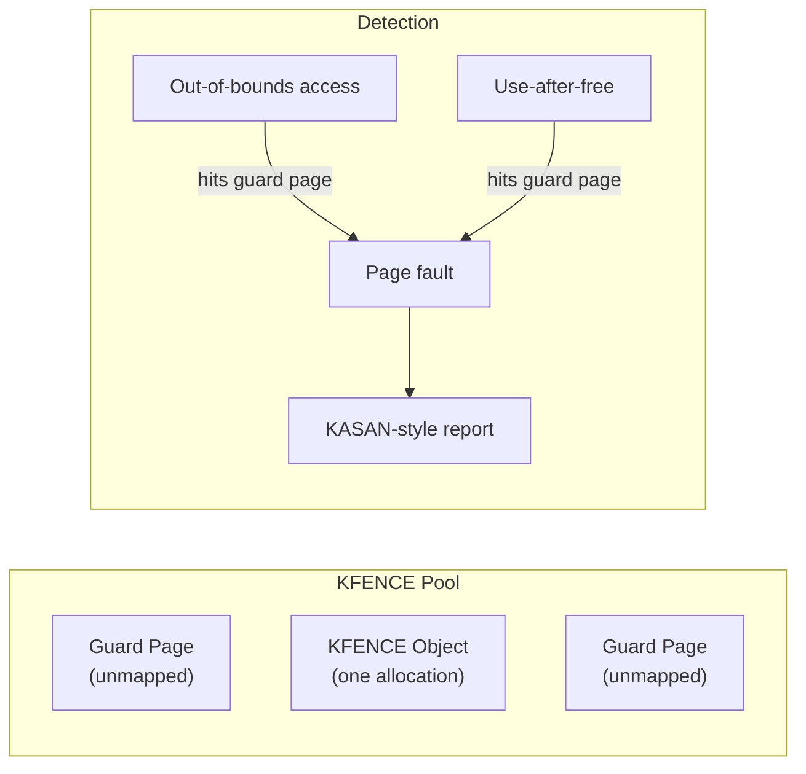
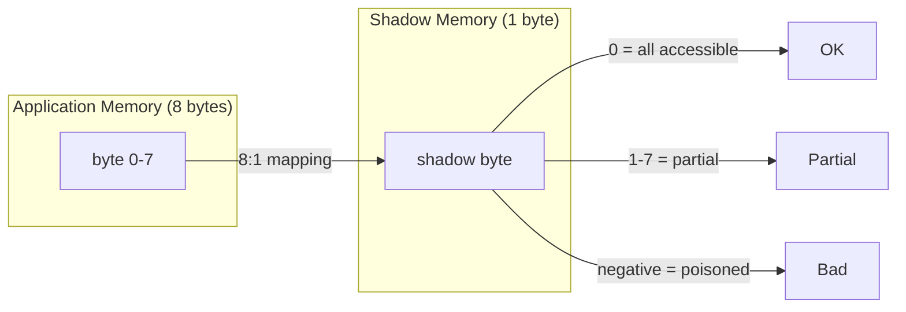

# Sanitizers

Sanitizers are compile-time instrumentation tools that detect memory errors, data races,
undefined behavior, and other bugs at runtime. They are available as compiler flags in
GCC and Clang, and provide much faster detection than binary analysis tools like Valgrind.

## Introduction

Sanitizers work by instrumenting code at compile time — adding checks around every memory
access, pointer arithmetic, and thread synchronization. They are developed primarily by
Google and integrated into LLVM and GCC.

| Sanitizer | Detects                              | Overhead    | Available in  |
|-----------|--------------------------------------|-------------|---------------|
| ASan      | Buffer overflow, use-after-free      | ~2× CPU     | GCC, Clang    |
| MSan      | Uninitialized memory reads           | ~3× CPU     | Clang only    |
| TSan      | Data races                           | ~5-15× CPU  | GCC, Clang    |
| UBSan     | Undefined behavior                   | ~1.2× CPU   | GCC, Clang    |
| KASAN     | Kernel memory errors                 | ~2-3× CPU   | GCC, Clang    |
| KCSAN     | Kernel data races                    | ~2-5× CPU   | GCC, Clang    |
| KFENCE    | Kernel memory errors (low overhead)  | ~1% CPU     | GCC, Clang    |

## AddressSanitizer (ASan)

ASan detects:

- Heap buffer overflow / underflow
- Stack buffer overflow
- Use-after-free
- Use-after-return
- Use-after-scope
- Double-free
- Memory leaks (with leak sanitizer)

### Usage

```bash
# Compile with ASan
gcc -fsanitize=address -fno-omit-frame-pointer -g -O1 -o myapp myapp.c

# Or with Clang
clang -fsanitize=address -fno-omit-frame-pointer -g -O1 -o myapp myapp.c

# Run
./myapp
```

### Example: Heap Buffer Overflow

```c
// overflow.c
#include <stdlib.h>
#include <string.h>

int main() {
    char *buf = malloc(10);
    strcpy(buf, "this string is way too long for the buffer"); // overflow!
    free(buf);
    return 0;
}
```

```bash
gcc -fsanitize=address -g -o overflow overflow.c
./overflow
```

Output:

```
=================================================================
==12345==ERROR: AddressSanitizer: heap-buffer-overflow on address 0x60200000001a
    at 0x4c4a8a in __asan_memcpy (/home/user/overflow+0x4c4a8a)
    at 0x4e2b2d in main /home/user/overflow.c:7
  0x60200000001a is located 0 bytes to the right of 10-byte region [0x602000000010,0x60200000001a)
  allocated by thread T0 here:
    at 0x4c3a76 in malloc (/home/user/overflow+0x4c3a76)
    at 0x4e2ae0 in main /home/user/overflow.c:6

SUMMARY: AddressSanitizer: heap-buffer-overflow /home/user/overflow.c:7 in main
Shadow bytes around the buggy address:
  0x0c047fffffffd8: 00 00 00 00 00 00 00 00 00 00 00 00 00 00 00 00
=>0x0c047fffffffe0: 00 00[02]fa fa fa fa fa fa fa fa fa fa fa fa fa
  0x0c047ffffffff0: fa fa fa fa fa fa fa fa fa fa fa fa fa fa fa fa
```

### Example: Use-After-Free

```c
// uaf.c
#include <stdlib.h>

int main() {
    int *p = malloc(sizeof(int));
    *p = 42;
    free(p);
    return *p;  // use-after-free
}
```

```bash
gcc -fsanitize=address -g -o uaf uaf.c
./uaf
```

Output:

```
=================================================================
==12346==ERROR: AddressSanitizer: heap-use-after-free on address 0x602000000010
READ of size 4 at 0x602000000010 thread T0
    at 0x4e2b20 in main /home/user/uaf.c:7
0x602000000010 is located 0 bytes inside of 4-byte region [0x602000000010,0x602000000014)
freed by thread T0 here:
    at 0x4c3e76 in free (/home/user/uaf+0x4c3e76)
    at 0x4e2b10 in main /home/user/uaf.c:6
previously allocated by thread T0 here:
    at 0x4c3a76 in malloc (/home/user/uaf+0x4c3a76)
    at 0x4e2ae0 in main /home/user/uaf.c:4
```

### ASan Runtime Options

```bash
# Detect memory leaks
ASAN_OPTIONS=detect_leaks=1 ./myapp

# Abort on first error (default)
ASAN_OPTIONS=abort_on_error=1 ./myapp

# Print suppression list
ASAN_OPTIONS=print_suppressions=1 ./myapp

# Use suppression file
LSAN_OPTIONS=suppressions=lsan.supp ./myapp

# Show more context in stack traces
ASAN_OPTIONS=fast_unwind_on_malloc=0 ./myapp

# Detect stack use-after-return
ASAN_OPTIONS=detect_stack_use_after_return=1 ./myapp
```

### ASan Suppression File

```bash
# lsan.supp
leak:libsome_legacy.so
leak:third_party_library_init
leak:*cached_session*
```

### ASan with Docker

```bash
docker run --cap-add=SYS_PTRACE --security-opt seccomp=unconfined \
    -v $(pwd)/asan-build:/app asan-app /app/myapp
```

## MemorySanitizer (MSan)

MSan detects reads of uninitialized memory. It is Clang-only.

```c
// uninit.c
#include <stdio.h>

int main() {
    int x;  // uninitialized
    if (x > 0) {  // MSan catches this
        printf("positive\n");
    }
    return 0;
}
```

```bash
clang -fsanitize=memory -fno-omit-frame-pointer -g -O1 -o uninit uninit.c
./uninit
```

Output:

```
==12347==WARNING: MemorySanitizer: use-of-uninitialized-value
    at 0x4e2b20 in main /home/user/uninit.c:6
  Uninitialized value was stored to memory at
    at 0x4e2ae0 in main /home/user/uninit.c:5
  Uninitialized value was created by an allocation of 'x' in the stack frame
    at 0x4e2ac0 in main /home/user/uninit.c:4
```

### MSan Limitations

- Clang-only (no GCC support)
- All libraries must also be instrumented (or MSan-interceptors used)
- Higher overhead than ASan

## ThreadSanitizer (TSan)

TSan detects data races — unsynchronized access to shared memory from multiple threads.

```c
// race.c
#include <pthread.h>

int shared = 0;

void *writer(void *arg) {
    shared = 42;  // No synchronization!
    return NULL;
}

int main() {
    pthread_t t;
    pthread_create(&t, NULL, writer, NULL);
    shared = 1;  // Race with writer thread!
    pthread_join(t, NULL);
    return 0;
}
```

```bash
gcc -fsanitize=thread -g -O1 -o race race.c -lpthread
./race
```

Output:

```
==================
WARNING: ThreadSanitizer: data race (pid=12348)
  Write of size 4 at 0x55d7a8 by thread T1:
    #0 writer /home/user/race.c:6

  Previous write of size 4 at 0x55d7a8 by main thread:
    #0 main /home/user/race.c:12

  Location is global 'shared' at 0x55d7a8

  Thread T1 (tid=12350, running) created by main thread at:
    #0 pthread_create <null>
    #1 main /home/user/race.c:11

  Mutexes locked by main thread: none
==================
ThreadSanitizer: reported 1 warnings
```

### TSan Annotations

For intentional races (e.g., double-checked locking):

```c
#include <sanitizer/tsan_interface.h>

// Mark intentional race as benign
__tsan_acquire(&flag);
__tsan_release(&flag);
```

## UndefinedBehaviorSanitizer (UBSan)

UBSan detects undefined behavior in C/C++:

```bash
gcc -fsanitize=undefined -g -o ub ub.c
./ub
```

Detected behaviors:

- Signed integer overflow
- Null pointer dereference
- Misaligned pointer access
- Integer divide by zero
- Out-of-bounds array indexing (with `-fsanitize=bounds`)
- Use of misaligned pointer
- VLA bound not positive
- Shift exponent too large
- Invalid bool load
- Invalid enum value
- Invalid float-to-int conversion

### UBSan with Trap

```bash
# Trap (abort) instead of printing message
gcc -fsanitize=undefined -fsanitize-undefined-trap-on-error -g -o ub ub.c
```

## KASAN — Kernel AddressSanitizer

KASAN applies ASan's principles to the Linux kernel. It detects:

- Out-of-bounds slab object access
- Use-after-free in kernel slab objects
- Global buffer overflows
- Stack buffer overflows in kernel code

### Kernel Configuration

```
CONFIG_KASAN=y
CONFIG_KASAN_GENERIC=y          # Generic KASAN (full instrumentation)
# OR
CONFIG_KASAN_SW_TAGS=y          # Software tag-based (ARM64)
# OR
CONFIG_KASAN_HW_TAGS=y          # Hardware tag-based (ARM MTE)

CONFIG_KASAN_INLINE=y           # Inline checks (faster, larger binary)
# OR
CONFIG_KASAN_OUTLINE=y          # Function calls (smaller binary, slower)

CONFIG_STACKTRACE=y             # For stack traces
CONFIG_SLUB_DEBUG=y             # For slab debugging
```

### Runtime Usage

```bash
# Boot kernel with KASAN
# Add to kernel command line:
# kasan=on kasan_multi_shot

# Check for KASAN reports in dmesg
dmesg | grep -A 20 "BUG: KASAN"
```

### KASAN Report Example

```
==================================================================
BUG: KASAN: slab-out-of-bounds in kmalloc_oob_right+0x6d/0xf1 [test_kasan]
Write of size 1 at addr ffff8880692b2fff by task insmod/3139

CPU: 0 PID: 3139 Comm: insmod Not tainted 6.1.0 #1
Hardware name: QEMU Standard PC
Call Trace:
 dump_stack_lvl+0x55/0x6d
 print_report+0x164/0x497
 kasan_report+0xbb/0xf0
 kmalloc_oob_right+0x6d/0xf1 [test_kasan]
 do_one_initcall+0x66/0x3a0
 ...
```

### KASAN Test Module

```bash
# Load the test module
sudo modprobe test_kasan

# Or build from kernel source
cd /usr/src/linux
make M=lib/test_kasan
sudo insmod lib/test_kasan.ko

# Check dmesg for KASAN reports
dmesg | grep KASAN
```

## KCSAN — Kernel Concurrency Sanitizer

KCSAN detects data races in the kernel.

### Configuration

```
CONFIG_KCSAN=y
CONFIG_KCSAN_STRICT=y            # Stricter checking
CONFIG_KCSAN_REPORT_ONCE_IN_MS=5000  # Rate limit reports
```

### KCSAN Report

```
==================================================================
BUG: KCSAN: data-race in tcp_sendmsg / tcp_recvmsg

write to 0xffff888012345678 of 4 bytes by task 1234 on cpu 0:
 tcp_sendmsg+0x123/0x456 net/ipv4/tcp.c:1234

read to 0xffff888012345678 of 4 bytes by task 5678 on cpu 1:
 tcp_recvmsg+0x456/0x789 net/ipv4/tcp.c:5678

Reported by Kernel Concurrency Sanitizer on:
CPU: 1 PID: 5678 Comm: nginx Not tainted 6.1.0 #1
```

## KFENCE — Kernel Electric-Fence

KFENCE is a low-overhead kernel memory error detector, designed for production use:

### Configuration

```
CONFIG_KFENCE=y
CONFIG_KFENCE_NUM_OBJECTS=255     # Number of guarded objects
CONFIG_KFENCE_STRESS_TEST_FAULTS=0
```

Boot parameter:

```
kfence.sample_interval=100   # Sample every 100ms (default)
```

### How KFENCE Works



KFENCE places a small number of allocations between guard pages. Any out-of-bounds access
triggers a page fault with a detailed report. Since only ~0.01% of allocations are sampled,
the overhead is negligible (~1%).

### KFENCE Report

```
==================================================================
BUG: KFENCE: out-of-bounds write in kmalloc_oob+0x45/0x90

Out-of-bounds write at 0xffffffff81234568 (1B right of kmalloc-16):
 kmalloc_oob+0x45/0x90
 do_one_initcall+0x66/0x3a0

Allocated by task 1234:
 kmalloc_trace+0x37/0x80
 kmalloc_oob+0x20/0x90
 do_one_initcall+0x66/0x3a0

Freed by task 5678:
 kfree+0xa0/0x200
 cleanup+0x10/0x30
```

## Comparison: ASan vs Valgrind vs KFENCE

| Aspect              | ASan                      | Valgrind memcheck          | KFENCE                    |
|---------------------|---------------------------|----------------------------|---------------------------|
| **Type**            | Compile-time              | Binary recompilation       | Kernel sampling           |
| **Speed overhead**  | ~2×                       | ~10-50×                    | ~1%                       |
| **Memory overhead** | ~3×                       | ~10-20×                    | Fixed (small pool)        |
| **Scope**           | Userspace                 | Userspace                  | Kernel                    |
| **Detection**       | Exact                     | Exact                      | Probabilistic (sampling)  |
| **Production use**  | Testing only              | Testing only               | ✅ Yes (low overhead)     |
| **Compiler**        | GCC, Clang                | Any (binary analysis)      | GCC, Clang (kernel)       |

## Best Practices

### Development / CI

```bash
# Run tests with all sanitizers
CFLAGS="-fsanitize=address,undefined -fno-omit-frame-pointer -g"
make check CFLAGS="$CFLAGS"

# Run with TSan separately (incompatible with ASan)
CFLAGS="-fsanitize=thread -g"
make check CFLAGS="$CFLAGS"
```

### Docker CI Pipeline

```dockerfile
FROM ubuntu:22.04
RUN apt-get update && apt-get install -y gcc clang

# Build with ASan
RUN gcc -fsanitize=address,undefined -g -O1 -o /app/myapp /src/*.c

# Run with leak detection
ENV ASAN_OPTIONS=detect_leaks=1:halt_on_error=1
CMD ["/app/myapp"]
```

### Selective Suppression

```c
// Disable ASan for a specific function (e.g., performance-critical)
__attribute__((no_sanitize("address")))
void fast_memcpy(void *dst, const void *src, size_t n) {
    // Intentionally uses optimized code that ASan flags incorrectly
}

// Disable UBSan for a specific function
__attribute__((no_sanitize("undefined")))
int intentional_wraparound(int a, int b) {
    return a + b;  // May overflow intentionally
}
```

## References

- [AddressSanitizer](https://github.com/google/sanitizers/wiki/AddressSanitizer) — wiki
- [MemorySanitizer](https://github.com/google/sanitizers/wiki/MemorySanitizer) — wiki
- [ThreadSanitizer](https://github.com/google/sanitizers/wiki/ThreadSanitizerCppManual) — wiki
- [UndefinedBehaviorSanitizer](https://clang.llvm.org/docs/UndefinedBehaviorSanitizer.html) — Clang docs
- [KASAN Documentation](https://www.kernel.org/doc/html/latest/dev-tools/kasan.html) — kernel docs
- [KCSAN Documentation](https://www.kernel.org/doc/html/latest/dev-tools/kcsan.html) — kernel docs
- [KFENCE Documentation](https://www.kernel.org/doc/html/latest/dev-tools/kfence.html) — kernel docs
- [LWN: KFENCE](https://lwn.net/Articles/836411/) — low-overhead kernel memory debugging
- [LWN: KCSAN](https://lwn.net/Articles/802128/) — kernel data race detection
- [Google Sanitizers GitHub](https://github.com/google/sanitizers) — source code

## Related Topics

- [Valgrind](./valgrind.md) — alternative binary analysis approach
- [Debugging Overview](./overview.md) — tool selection guide
- [Crash Dumps](./crash-dump.md) — kernel crash analysis
- [SystemTap](./systemtap.md) — dynamic kernel tracing

## ASan Internals: Shadow Memory

ASan works by reserving a portion of the virtual address space as **shadow memory**. Every 8 bytes of application memory are mapped to 1 byte of shadow memory that records whether those bytes are accessible.



```c
// Shadow byte encoding:
// 0: all 8 bytes are accessible
// 1-7: first N bytes are accessible (for unaligned accesses)
// negative: entire region is poisoned (redzone, freed memory)
//   -1: heap redzone
//   -2: freed memory
//   -3: stack redzone
//   -5: stack use-after-return
```

### Memory Layout with ASan

```bash
# With ASan enabled, the address space layout changes:
cat /proc/$(pidof asan_app)/maps | head -20
# Lots of reserved ranges for shadow memory
# Typical overhead: ~3x virtual memory, ~2x RSS
```

## UBSan: Undefined Behaviors Detected

UBSan catches a wide range of C/C++ undefined behaviors:

```c
// Signed integer overflow
int x = INT_MAX;
x++;  // UBSan: signed integer overflow

// Null pointer dereference
int *p = NULL;
*p = 42;  // UBSan: null pointer dereference

// Misaligned access
char buf[10];
int *p = (int *)(buf + 1);  // Misaligned
*p = 42;  // UBSan: misaligned address

// Division by zero
int a = 1, b = 0;
int c = a / b;  // UBSan: division by zero

// Shift overflow
int x = 1 << 32;  // UBSan: shift exponent 32 >= width 32

// Invalid enum
enum Color { RED, GREEN, BLUE };
enum Color c = (enum Color)42;  // UBSan: invalid enum value

// Out-of-bounds array (with -fsanitize=bounds)
int arr[5];
arr[10] = 42;  // UBSan: array index out of bounds
```

### UBSan Runtime Options

```bash
# Print full backtrace on each error
UBSAN_OPTIONS=print_stacktrace=1 ./myapp

# Halt on first error
UBSAN_OPTIONS=halt_on_error=1 ./myapp

# Continue after errors (default)
UBSAN_OPTIONS=halt_on_error=0 ./myapp

# Suppress specific checks
# Compile with: -fno-sanitize-recover=all (abort on error)
# Or: -fno-sanitize=signed-integer-overflow (disable specific check)
```

## Combining Sanitizers

### ASan + UBSan

```bash
# These are compatible and commonly combined
gcc -fsanitize=address,undefined -fno-omit-frame-pointer -g -O1 -o myapp myapp.c

# CMake example
set(CMAKE_C_FLAGS "${CMAKE_C_FLAGS} -fsanitize=address,undefined -fno-omit-frame-pointer")
set(CMAKE_CXX_FLAGS "${CMAKE_CXX_FLAGS} -fsanitize=address,undefined -fno-omit-frame-pointer")
set(CMAKE_LINKER_FLAGS "${CMAKE_LINKER_FLAGS} -fsanitize=address,undefined")
```

### TSan + UBSan

```bash
# Also compatible
gcc -fsanitize=thread,undefined -g -O1 -o myapp myapp.c -lpthread
```

### Incompatible Combinations

```bash
# ASan and TSan are NOT compatible — use them separately
# ASan and MSan are NOT compatible
# MSan and TSan are NOT compatible

# Run tests with each separately:
# 1. ASan + UBSan: memory errors and UB
# 2. TSan + UBSan: data races and UB
# 3. MSan: uninitialized memory (Clang only)
```

## Sanitizers in CMake Projects

```cmake
# CMakeLists.txt
option(ENABLE_ASAN "Enable AddressSanitizer" OFF)
option(ENABLE_TSAN "Enable ThreadSanitizer" OFF)
option(ENABLE_UBSAN "Enable UndefinedBehaviorSanitizer" OFF)
option(ENABLE_MSAN "Enable MemorySanitizer" OFF)

if(ENABLE_ASAN)
    add_compile_options(-fsanitize=address -fno-omit-frame-pointer)
    add_link_options(-fsanitize=address)
endif()

if(ENABLE_TSAN)
    add_compile_options(-fsanitize=thread -fno-omit-frame-pointer)
    add_link_options(-fsanitize=thread)
endif()

if(ENABLE_UBSAN)
    add_compile_options(-fsanitize=undefined -fno-omit-frame-pointer)
    add_link_options(-fsanitize=undefined)
endif()

if(ENABLE_MSAN)
    add_compile_options(-fsanitize=memory -fno-omit-frame-pointer)
    add_link_options(-fsanitize=memory)
endif()
```

```bash
# Build with ASan
cmake -DENABLE_ASAN=ON -DCMAKE_BUILD_TYPE=Debug ..
make -j$(nproc)
```

## Sanitizers in Rust

Rust has its own sanitizer support:

```bash
# AddressSanitizer
RUSTFLAGS="-Zsanitizer=address" cargo build

# ThreadSanitizer
RUSTFLAGS="-Zsanitizer=thread" cargo build

# MemorySanitizer
RUSTFLAGS="-Zsanitizer=memory" cargo build

# LeakSanitizer (with ASan)
RUSTFLAGS="-Zsanitizer=leak" cargo build

# Run tests with sanitizers
cargo test -Zbuild-std --target x86_64-unknown-linux-gnu
```

## LeakSanitizer (LSan)

LSan is integrated into ASan (enabled by default on Linux) but can also be used standalone:

```bash
# Standalone LSan
gcc -fsanitize=leak -g -o myapp myapp.c

# ASan with leak detection (default on Linux)
ASAN_OPTIONS=detect_leaks=1 ./myapp

# Disable leak detection
ASAN_OPTIONS=detect_leaks=0 ./myapp

# Suppression file for known leaks
# /etc/lsan.supp
leak:libsome_legacy.so
leak:third_party_init
```

### LSan Report Example

```
=================================================================
==12345==ERROR: LeakSanitizer: detected memory leaks

Direct leak of 1024 byte(s) in 1 object(s) allocated from:
    #0 0x4c3a76 in malloc (/home/user/myapp+0x4c3a76)
    #1 0x4e2ae0 in process_request /home/user/server.c:45
    #2 0x4e3000 in handle_connection /home/user/server.c:120

Indirect leak of 256 byte(s) in 4 object(s) allocated from:
    #0 0x4c3a76 in malloc (/home/user/myapp+0x4c3a76)
    #1 0x4e2c00 in create_buffer /home/user/utils.c:30

SUMMARY: AddressSanitizer: 1280 byte(s) leaked in 5 allocation(s).
```

## Kernel Sanitizer Configuration for Distributions

```bash
# Fedora/RHEL: pre-built debug kernels with KASAN
sudo dnf install kernel-debug
sudo dnf install kernel-debug-debuginfo

# Boot the debug kernel
# Select kernel-debug from GRUB menu

# Ubuntu: custom kernel with KASAN
# Enable in .config:
CONFIG_KASAN=y
CONFIG_KASAN_GENERIC=y
CONFIG_KASAN_INLINE=y
CONFIG_STACKTRACE=y
CONFIG_SLUB_DEBUG=y

# Build
make -j$(nproc) deb-pkg
sudo dpkg -i ../linux-image-*.deb

# Verify KASAN is active
cat /proc/config.gz | gunzip | grep KASAN
# CONFIG_KASAN=y
```

## Sanitizer Performance Benchmarks

```bash
# Measure overhead
# Baseline
time ./myapp > /dev/null
# real    0m10.000s

# With ASan
time ./myapp_asan > /dev/null
# real    0m20.000s  (~2x)

# With TSan
time ./myapp_tsan > /dev/null
# real    0m50.000s  (~5x)

# With MSan
time ./myapp_msan > /dev/null
# real    0m30.000s  (~3x)

# With UBSan
time ./myapp_ubsan > /dev/null
# real    0m12.000s  (~1.2x)

# With Valgrind (for comparison)
time valgrind ./myapp > /dev/null
# real    1m00.000s  (~6x)
```

## Troubleshooting Sanitizer Issues

```bash
# "ASAN_OPTIONS" not working
export ASAN_OPTIONS=detect_leaks=1
./myapp  # Must be set before running

# Missing symbolization
# Install debug symbols
apt install myapp-dbg  # Debian/Ubuntu

# Set symbolizer path
export ASAN_SYMBOLIZER_PATH=/usr/bin/llvm-symbolizer

# TSan: too many mutexes (limit 64k)
TSAN_OPTIONS=max_history_size=10000

# MSan: instrumenting system libraries
# Rebuild all dependencies with MSan
# Or use MSAN_OPTIONS=intercept_tls_get_addr=0

# KASAN: performance too slow
# Use KFENCE for production (sampling-based, ~1% overhead)
# Or use KASAN_SW_TAGS on ARM64 (hardware-assisted)
```
