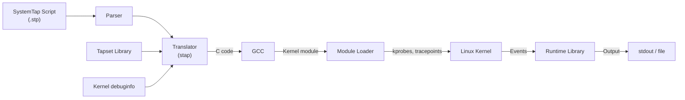

# SystemTap

SystemTap is a scripting language and tool for dynamically instrumenting Linux kernel and
userspace code. It allows administrators and developers to extract, filter, and summarize
data from running systems without recompilation or rebooting.

## Introduction

SystemTap translates scripts into C code, compiles them into kernel modules, and loads them
to collect data via kprobes, tracepoints, uprobes, and other kernel instrumentation points.
It provides a powerful scripting language with variables, conditionals, loops, and associative
arrays.

Key capabilities:

- Trace kernel function calls and returns
- Probe userspace function entry/exit
- Monitor system calls
- Measure function latency
- Aggregate statistics
- Access kernel data structures
- Generate histograms and summary reports

## Architecture



## Installation

```bash
# Debian/Ubuntu
sudo apt install systemtap systemtap-runtime
sudo apt install linux-image-$(uname -r)-dbg   # Debug symbols

# Fedora/RHEL
sudo dnf install systemtap systemtap-runtime
sudo dnf install kernel-debuginfo-$(uname -r) kernel-debuginfo-common-$(uname -r)

# Verify installation
stap --version
# SystemTap translator/driver
# version 4.9/0.170

# Test with a simple script
sudo stap -e 'probe begin { print("hello\n") exit() }'
# hello
```

## Basic Script Structure

### Hello World

```bash
# hello.stp
probe begin {
    printf("SystemTap started at %d\n", gettimeofday_s())
}

probe end {
    printf("SystemTap ended\n")
}
```

```bash
sudo stap hello.stp
# SystemTap started at 1705312200
# ^C
# SystemTap ended
```

### Probe Points

Probe points define when and where instrumentation fires:

```bash
# Kernel function probes
probe kernel.function("do_sys_open") { ... }
probe kernel.function("do_sys_open").return { ... }

# Kernel tracepoints
probe kernel.tracepoint("syscalls:sys_enter_read") { ... }
probe kernel.tracepoint("sched:sched_switch") { ... }

# Process probes (userspace)
probe process("/usr/bin/myapp").function("main") { ... }
probe process("/usr/bin/myapp").function("main").return { ... }

# System call probes
probe syscall.open { ... }
probe syscall.open.return { ... }

# Timer probes
probe timer.ms(100) { ... }     # Every 100ms
probe timer.s(1) { ... }        # Every second
probe timer.us(10) { ... }      # Every 10 microseconds

# Begin/end
probe begin { ... }             # Script start
probe end { ... }               # Script end
```

## Common Patterns

### Counting System Calls

```bash
# syscalls.stp
probe syscall.* {
    calls[execname(), name()] <<< 1
}

probe end {
    printf("\n%-25s %-25s %s\n", "PROCESS", "SYSCALL", "COUNT")
    printf("%-25s %-25s %s\n", "-------", "-------", "-----")
    foreach ([proc, sc] in calls+) {
        printf("%-25s %-25s %d\n", proc, sc, @count(calls[proc, sc]))
    }
}
```

```bash
sudo stap syscalls.stp
# Press Ctrl+C after a few seconds

# PROCESS                   SYSCALL                   COUNT
# -------                   -------                   -----
# nginx                     read                      1234
# nginx                     write                     987
# bash                      read                      56
# bash                      write                     45
```

### Measuring Function Latency

```bash
# latency.stp
probe kernel.function("vfs_read") {
   [tid()] = gettimeofday_us()
}

probe kernel.function("vfs_read").return {
    if (tid() in start) {
        latency = gettimeofday_us() - start[tid()]
        @us("vfs_read latency (µs)", latency)
    }
}

probe end {
    // Print statistics
    printf("\nVFS Read Latency Statistics:\n")
    // Print a histogram
}
```

### Tracing Process Creation

```bash
# execs.stp
probe syscall.execve {
    printf("%-8d %-16s %s\n", pid(), execname(), cmdline_str())
}
```

```bash
sudo stap execs.stp
# PID      PROCESS          COMMAND
# 12345    bash             ls -la /tmp
# 12346    bash             cat /etc/hostname
# 12347    nginx            nginx -g daemon off;
```

### Top-Like System Monitor

```bash
# top.stp
global cpu_time

probe timer.s(1) {
    printf("\033[2J\033[H")  # Clear screen
    printf("%-8s %-16s %8s\n", "PID", "PROCESS", "CPU(ms)")
    printf("%-8s %-16s %8s\n", "---", "-------", "-------")
    foreach ([pid, name] in cpu_time- limit 20) {
        printf("%-8d %-16s %8d\n", pid, name, cpu_time[pid, name])
    }
    delete cpu_time
}

probe scheduler.cpu_on {
    cpu_time[pid(), execname()] += 1
}
```

### Network Connection Tracer

```bash
# netconnect.stp
probe tcp.sendmsg {
    printf("%-16s pid=%-6d src=%s:%d dst=%s:%d bytes=%d\n",
        execname(), pid(),
        saddr, sport,
        daddr, dport,
        size)
}
```

## Tapsets

Tapsets are reusable libraries of probe point aliases and helper functions. They live in
`/usr/share/systemtap/tapset/`.

### Using Tapset Aliases

```bash
# These are convenience aliases defined in tapsets
probe begin { printf("Starting...\n") }

# Uses the 'procfs' tapset
probe procfs.read { printf("procfs read: %s\n", name) }

# Uses the 'syscall' tapset aliases
probe syscall.open { printf("open: %s\n", argstr) }

# Uses the 'scheduler' tapset
probe scheduler.process_exec { printf("exec: %s\n", execname()) }
```

### Available Tapsets

| Tapset File       | Description                              |
|-------------------|------------------------------------------|
| `syscall.stp`     | System call probes and helpers           |
| `scheduler.stp`   | Process scheduling events                |
| `io.stp`          | Block I/O events                         |
| `netfilter.stp`   | Netfilter/iptables events                |
| `vm.stp`          | Virtual memory events                    |
| `diskdev.stp`     | Disk device events                       |
| `signal.stp`      | Signal delivery events                   |
| `process.stp`     | Process lifecycle events                 |
| `socket.stp`      | Socket events                            |

### Writing Custom Tapsets

```bash
# /usr/share/systemtap/tapset/custom/mylib.stp
function log_syscall:string(proc:string, sc:string, argstr:string) {
    return sprintf("%-16s %-16s %s", proc, sc, argstr)
}

probe my.sc_return {
    log_syscall(execname(), name, retstr)
}
```

## Probe Arguments

```bash
# Kernel function arguments
probe kernel.function("do_sys_open") {
    printf("dfd=%d filename=%s flags=%x mode=%x\n",
        $dfd, $filename, $flags, $mode)
}

# Return value
probe kernel.function("do_sys_open").return {
    printf("returned: %d\n", $return)
}

# Syscall arguments
probe syscall.open {
    printf("pathname=%s flags=%o mode=%o\n",
        pathname, flags, mode)
}

# Process context
probe syscall.read {
    printf("fd=%d buf=%p count=%d\n", argstr)
}

# Struct member access
probe kernel.function("vfs_read") {
    printf("file=%p pos=%d\n", $file, $file->f_pos)
}
```

## Aggregation and Statistics

```bash
# Aggregate with <<< operator
probe syscall.read {
    reads[execname()] <<< $count
}

probe end {
    // Print statistics
    foreach ([proc] in reads) {
        printf("%-16s: count=%d sum=%d avg=%d min=%d max=%d\n",
            proc,
            @count(reads[proc]),
            @sum(reads[proc]),
            @avg(reads[proc]),
            @min(reads[proc]),
            @max(reads[proc]))
    }
}

# Histograms
probe syscall.read {
    @hist_log($count)
}

probe end {
    // Prints a logarithmic histogram
    // @hist_linear() for linear histograms
}
```

## Advanced Examples

### Disk I/O Latency

```bash
# iolatency.stp
global start

probe ioblock.request {
    start[tid(), devname, sector] = gettimeofday_us()
}

probe ioblock.request {
    if ([tid(), devname, sector] in start) {
        delta = gettimeofday_us() - start[tid(), devname, sector]
        @hist_log(delta)
        delete start[tid(), devname, sector]
    }
}
```

### Function Call Graph

```bash
# callgraph.stp
global depth

probe kernel.function("*@fs/*.c").call {
    if (pid() == target()) {
        printf("%*s%s\n", depth*2, "", probefunc())
        depth++
    }
}

probe kernel.function("*@fs/*.c").return {
    if (pid() == target()) {
        depth--
    }
}
```

```bash
# Trace PID 1234
sudo stap callgraph.stp -x 1234
```

### Lock Contention

```bash
# lockstat.stp
global lock_start, contention

probe kernel.function("mutex_lock") {
    lock_start[tid()] = gettimeofday_us()
}

probe kernel.function("mutex_lock").return {
    if (tid() in lock_start) {
        delta = gettimeofday_us() - lock_start[tid()]
        contention[caller()] <<< delta
        delete lock_start[tid()]
    }
}

probe end {
    printf("\nMutex contention (µs):\n")
    foreach ([func] in contention+) {
        printf("%-40s avg=%d max=%d count=%d\n",
            func, @avg(contention[func]),
            @max(contention[func]),
            @count(contention[func]))
    }
}
```

## SystemTap vs eBPF / bpftrace

| Aspect                | SystemTap                          | eBPF / bpftrace                     |
|-----------------------|------------------------------------|-------------------------------------|
| **Language**          | Custom scripting language          | C (libbpf) or awk-like (bpftrace)  |
| **Compilation**       | Builds kernel module               | JIT-compiled in kernel              |
| **Safety**            | Module can crash kernel if buggy   | Verified by kernel, cannot crash    |
| **Startup time**      | Slow (compilation)                 | Fast (JIT)                          |
| **Kernel integration**| kprobes, tracepoints, uprobes      | kprobes, tracepoints, uprobes, XDP  |
| **Maintained by**     | Red Hat / community                | Linux kernel community              |
| **Upstream status**   | Separate project                   | In-tree kernel feature              |
| **Overhead**          | Moderate (module-based)            | Low (verified JIT)                  |
| **Distribution**      | Most distros have packages         | Kernel 4.4+ (better 5.x+)          |
| **Ecosystem**         | Tapset library                     | BCC tools, bpftrace, libbpf        |

### Equivalent bpftrace One-Liners

SystemTap:
```bash
sudo stap -e 'probe syscall.open { printf("%s %s\n", execname(), argstr) }'
```

bpftrace:
```bash
sudo bpftrace -e 'tracepoint:syscalls:sys_enter_openat { printf("%s %s\n", comm, str(args->filename)); }'
```

SystemTap:
```bash
sudo stap -e 'global reads; probe syscall.read { reads[execname()] <<< $count } probe end { foreach ([p] in reads+) printf("%s: %d\n", p, @sum(reads[p])) }'
```

bpftrace:
```bash
sudo bpftrace -e 'tracepoint:syscalls:sys_exit_read /args->ret > 0/ { @bytes[comm] = sum(args->ret); }'
```

## Running SystemTap Scripts

### As a Service

```bash
# Compile to module
sudo stap -v -p4 -m myprobe myprobe.stp

# Load module
sudo insmod myprobe.ko

# Check output
cat /proc/systemtap/myprobe

# Unload
sudo rmmod myprobe
```

### With Target Process

```bash
# Trace a specific process
sudo stap myprobe.stp -x $(pidof myapp)

# Trace with command line
sudo stap myprobe.stp -c "./myapp arg1 arg2"
```

### Remote Execution

```bash
# On target (pre-compiled)
staprun -o /tmp/output.log myprobe.ko

# On host (cross-compile and transfer)
stap -r remote_kernel_version -e '...' -m myprobe
scp myprobe.ko target:/tmp/
ssh target staprun /tmp/myprobe.ko
```

## Error Handling and Safety

### Checking Script Syntax

```bash
# Parse only (no execution)
sudo stap -p1 myprobe.stp

# Translate only (generate C, no compile)
sudo stap -p2 myprobe.stp

# Compile only (no load)
sudo stap -p3 myprobe.stp

# Full check with verbose output
sudo stap -v myprobe.stp
```

### Safety Limits

```bash
# /etc/systemtap/stap-server.conf
# Or command-line options:

# Maximum number of probes
sudo stap -DMAXSKIPPED=1000 myprobe.stp

# Timeout (seconds)
sudo stap -t 10 myprobe.stp

# Action frequency limit
sudo stap -DINTERRUPTIBLE=1 myprobe.stp
```

## References

- [SystemTap Official Site](https://sourceware.org/systemtap/) — documentation
- [SystemTap Language Reference](https://sourceware.org/systemtap/langref/) — complete language spec
- [SystemTap Tapset Reference](https://sourceware.org/systemtap/tapsets/) — built-in tapsets
- [SystemTap Beginner's Guide](https://sourceware.org/systemtap/SystemTap_Beginners_Guide/) — Red Hat guide
- [man7.org: stap(1)](https://man7.org/linux/man-pages/man1/stap.1.html) — man page
- [LWN: SystemTap](https://lwn.net/Articles/SystemTap/) — articles
- [eBPF vs SystemTap](https://ebpf.io/what-is-ebpf/) — comparison perspective

## Related Topics

- [Debugging Overview](./overview.md) — tool selection guide
- [eBPF](./overview.md#ebpf) — modern alternative
- [Valgrind](./valgrind.md) — binary analysis
- [Sanitizers](./sanitizers.md) — compile-time instrumentation
- [perf](./overview.md#perf) — performance profiling
