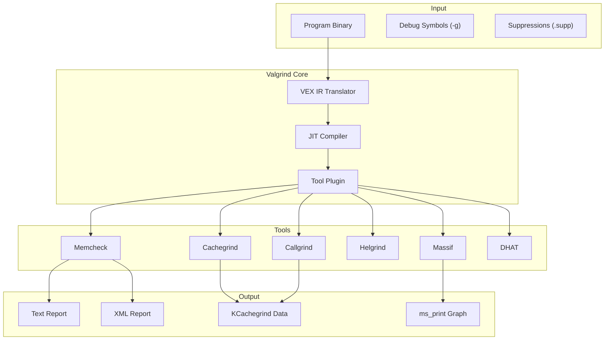

# Valgrind

Valgrind is a powerful instrumentation framework for building dynamic analysis tools. Its
most well-known tool, Memcheck, detects memory errors in C and C++ programs. Valgrind works
by running programs on a synthetic CPU, requiring no recompilation — only debug symbols for
useful output.

## Introduction

Valgrind (Old Norse: "the valley of the spear") was created by Julian Seward in 2000. It
translates programs into an intermediate representation (VEX IR) and instruments them before
execution. This allows it to detect bugs that are invisible to compilers and difficult to
reproduce in testing.

Available tools:

| Tool        | Purpose                                  |
|-------------|------------------------------------------|
| **memcheck** | Memory error detection                   |
| **cachegrind** | Cache and branch prediction profiling |
| **callgrind**  | Call graph profiling                 |
| **helgrind**   | Thread error detection (pthreads)    |
| **drd**        | Thread error detection (alternative) |
| **massif**     | Heap profiler                        |
| **dhat**       | Dynamic heap analysis tool           |
| **sgcheck**    | Stack and global array overflow      |

## Installation

```bash
# Debian/Ubuntu
sudo apt install valgrind

# Fedora/RHEL
sudo dnf install valgrind

# Arch Linux
sudo pacman -S valgrind

# Verify
valgrind --version
# valgrind-3.21.0

# For best results, compile with debug info and no optimization
gcc -g -O0 -o myapp myapp.c
```

## Memcheck — Memory Error Detector

Memcheck is Valgrind's flagship tool. It detects:

- Use of uninitialized memory
- Reading/writing past the end of malloc'd blocks (heap overflow/underflow)
- Reading/writing after `free()` (use-after-free)
- Memory leaks (blocks not freed on exit)
- Double-free
- Mismatched `malloc`/`free` or `new`/`delete`
- Overlapping `memcpy`/`strcpy` source and destination

### Basic Usage

```bash
valgrind --tool=memcheck ./myapp

# With leak check
valgrind --tool=memcheck --leak-check=full ./myapp

# Show reachable blocks too
valgrind --tool=memcheck --leak-check=full --show-reachable=yes ./myapp

# Track origins of uninitialized values
valgrind --tool=memcheck --track-origins=yes ./myapp

# With children processes
valgrind --tool=memcheck --trace-children=yes ./myapp
```

### Example: Uninitialized Memory

```c
// uninit.c
#include <stdio.h>

int main() {
    int x;
    if (x > 0) {    // Using uninitialized value
        printf("positive\n");
    }
    return 0;
}
```

```bash
gcc -g -O0 -o uninit uninit.c
valgrind --tool=memcheck --track-origins=yes ./uninit
```

Output:

```
==12345== Memcheck, a memory error detector
==12345== Command: ./uninit
==12345==
==12345== Conditional jump or move depends on uninitialised value(s)
==12345==    at 0x401156: main (uninit.c:6)
==12345==  Uninitialised value was created by a stack allocation
==12345==    at 0x401145: main (uninit.c:4)
==12345==
==12345==
==12345== HEAP SUMMARY:
==12345==     in use at exit: 0 bytes in 0 blocks
==12345==   total heap usage: 0 allocs, 0 frees, 0 bytes allocated
==12345==
==12345== All heap blocks were freed -- no leaks are possible
==12345==
==12345== For lists of detected and suppressed errors, rerun with: -v
==12345== ERROR SUMMARY: 1 errors from 1 contexts
```

### Example: Heap Buffer Overflow

```c
// overflow.c
#include <stdlib.h>
#include <string.h>

int main() {
    char *p = malloc(10);
    strcpy(p, "this is a very long string");  // overflow
    free(p);
    return 0;
}
```

```bash
valgrind --tool=memcheck ./overflow
```

Output:

```
==12346== Invalid write of size 1
==12346==    at 0x4C3ABCD: strcpy (vg_replace_strmem.c:520)
==12346==    by 0x40116E: main (overflow.c:7)
==12346==  Address 0x523404a is 0 bytes after a block of size 10 alloc'd
==12346==    at 0x4C3A7A8: malloc (vg_replace_malloc.c:380)
==12346==    by 0x401155: main (overflow.c:6)
```

### Example: Memory Leak

```c
// leak.c
#include <stdlib.h>

int main() {
    char *p = malloc(100);
    // Forgot to free p
    return 0;
}
```

```bash
valgrind --tool=memcheck --leak-check=full ./leak
```

Output:

```
==12347== HEAP SUMMARY:
==12347==     in use at exit: 100 bytes in 1 blocks
==12347==   total heap usage: 1 allocs, 0 frees, 100 bytes allocated
==12347==
==12347== 100 bytes in 1 blocks are definitely lost in loss record 1 of 1
==12347==    at 0x4C3A7A8: malloc (vg_replace_malloc.c:380)
==12347==    by 0x401145: main (leak.c:5)
==12347==
==12347== LEAK SUMMARY:
==12347==    definitely lost: 100 bytes in 1 blocks
==12347==    indirectly lost: 0 bytes in 0 blocks
==12347==      possibly lost: 0 bytes in 0 blocks
==12347==    still reachable: 0 bytes in 0 blocks
==12347==         suppressed: 0 bytes in 0 blocks
```

### Leak Categories

| Category            | Meaning                                          |
|---------------------|--------------------------------------------------|
| **definitely lost** | No pointer to the block exists                   |
| **indirectly lost** | Lost because the block pointing to it was lost   |
| **possibly lost**   | Interior pointer only (may be intentional)        |
| **still reachable** | Pointer exists on exit (not a bug per se)         |
| **suppressed**      | Matched a suppression rule                        |

### Memcheck Options

```bash
# Full options
valgrind --tool=memcheck \
    --leak-check=full \
    --show-leak-kinds=all \
    --track-origins=yes \
    --verbose \
    --log-file=valgrind.log \
    ./myapp

# Show freed block allocation context
valgrind --tool=memcheck --show-reachable=yes --freelist-vol=100000000 ./myapp

# Run children
valgrind --trace-children=yes --child-silent-after-fork=yes ./myapp

# XML output (for CI integration)
valgrind --tool=memcheck --xml=yes --xml-file=valgrind.xml ./myapp
```

## Suppression Files

Suppress known errors or third-party library issues:

```bash
# Generate suppressions automatically
valgrind --tool=memcheck --gen-suppressions=all ./myapp

# Use a suppression file
valgrind --tool=memcheck --suppressions=my.supp ./myapp
```

### Suppression File Format

```bash
# my.supp
{
   libfoo_leak
   Memcheck:Leak
   match-leak-kinds: definite
   fun:malloc
   fun:libfoo_init
   ...
   fun:_dl_init
}

{
   libbar_uninitialized
   Memcheck:Value1
   fun:libbar_process
   ...
   fun:main
}

# Ignore all errors in a specific library
{
   libbar_any
   Memcheck:*
   ...
   fun:*libbar*
}
```

### Common Suppression Patterns

```bash
# Suppress glibc internal leaks
{
   glibc_internal
   Memcheck:Leak
   match-leak-kinds: reachable
   fun:calloc
   ...
   fun:__libc_start_main
}

# Suppress Python interpreter leaks
{
   python_leak
   Memcheck:Leak
   match-leak-kinds: definite
   fun:malloc
   fun:PyMem_*
   ...
}
```

## Cachegrind — Cache Profiler

Cachegrind simulates the CPU cache hierarchy and counts cache misses:

```bash
valgrind --tool=cachegrind ./myapp
```

Output:

```
==12348== Cachegrind, a cache and branch-prediction profiler
==12348== I1 cache: 32768 B, 64 B, 8-way associative
==12348== D1 cache: 32768 B, 64 B, 8-way associative
==12348== LL cache: 8388608 B, 64 B, 16-way associative
==12348==
==12348== Command: ./myapp
==12348==
==12348==
==12348== I   refs:      1,234,567,890
==12348== I1  misses:        1,234,567
==12348== LLi misses:           12,345
==12348== I1  miss rate:         0.10%
==12348== LLi miss rate:         0.00%
==12348==
==12348== D   refs:        456,789,012
==12348== D1  misses:       12,345,678
==12348== LLd misses:        1,234,567
==12348== D1  miss rate:         2.70%
==12348== LLd miss rate:         0.27%
==12348==
==12348== LL refs:          13,580,245
==12348== LL misses:         1,246,912
==12348== LL miss rate:          0.08%
```

### Visualizing Cachegrind Output

```bash
# Generate annotated source
cg_annotate cachegrind.out.12348

# Generate call graph
cg_annotate --auto=yes cachegrind.out.12348 > cg_annotate.txt

# Use KCachegrind for graphical visualization
kcachegrind cachegrind.out.12348
```

## Callgrind — Call Graph Profiler

Callgrind extends Cachegrind with call graph information:

```bash
valgrind --tool=callgrind ./myapp
```

Output:

```
==12349== Callgrind, a call-graph generating cache profiler
==12349== Events: Ir
==12349== Collected : 1234567890
==12349==
==12349== I   refs:      1,234,567,890
```

### Analyzing Callgrind Output

```bash
# Generate call graph image
callgrind_annotate callgrind.out.12349

# Visualize with KCachegrind
kcachegrind callgrind.out.12349

# Convert to callgrind format for tools
callgrind_annotate --auto=yes callgrind.out.12349 > callgrind.txt
```

### Callgrind Control During Execution

```c
#include <valgrind/callgrind.h>

// Start/stop instrumentation
CALLGRIND_TOGGLE_COLLECT  // Toggle collection on/off
CALLGRIND_ZERO_STATS      // Reset counters
CALLGRIND_DUMP_STATS      // Dump current stats
```

## Helgrind — Thread Error Detector

Helgrind detects threading errors in programs using pthreads:

```bash
valgrind --tool=helgrind ./myapp
```

Detected errors:

- Misuse of POSIX pthreads API
- Deadlocks (lock ordering violations)
- Data races (unsynchronized shared memory access)

### Example: Data Race

```c
// race.c
#include <pthread.h>

int counter = 0;

void *increment(void *arg) {
    for (int i = 0; i < 10000; i++)
        counter++;  // Race!
    return NULL;
}

int main() {
    pthread_t t1, t2;
    pthread_create(&t1, NULL, increment, NULL);
    pthread_create(&t2, NULL, increment, NULL);
    pthread_join(t1, NULL);
    pthread_join(t2, NULL);
    return 0;
}
```

```bash
gcc -g -pthread -o race race.c
valgrind --tool=helgrind ./race
```

Output:

```
==12350== Possible data race during read of size 4 at 0x601040 by thread #1
==12350== Locks held: none
==12350==    at 0x400823: increment (race.c:7)
==12350==
==12350== This conflicts with a previous write of size 4 by thread #2
==12350== Locks held: none
==12350==    at 0x400823: increment (race.c:7)
```

## Massif — Heap Profiler

Massif profiles heap memory usage over time:

```bash
valgrind --tool=massif ./myapp
ms_print massif.out.12351
```

Output:

```
    MB
35.67^                         #.....................................
     |                         #                                    :
     |                         #                                    :
     |                        ##                                    :
     |                        ##                                    :
     |                       ###                                    :
     |                      ####                                    :
     |                     #####                                    :
     |                    ######                                    :
     |                   #######                                    :
     |                  ########                                    :
     |                 #########                                    :
     |                ##########                                    :
     |               ###########                                    :
     |              ############                                    :
     |             #############                                    :
     |            ##############                                    :
     |           ###############                                    :
     |          ################                                    :
     |         #################                                    :
     +-----------------------------------------------------------...Mi
     0                                                        1.275
```

### Massif Options

```bash
# Profile with page-level granularity
valgrind --tool=massif --pages-as-heap=yes ./myapp

# Include stack profiling
valgrind --tool=massif --stacks=yes ./myapp

# Threshold for detailed snapshot
valgrind --tool=massif --threshold=0.5 ./myapp

# Output file name
valgrind --tool=massif --massif-out-file=massif.log ./myapp
```

## DHAT — Dynamic Heap Analysis Tool

DHAT analyzes how heap allocations are used:

```bash
valgrind --tool=dhat ./myapp
```

Output:

```
==12352== DHAT, a dynamic heap analysis tool
==12352==
==12352== Total:     1,234,567 bytes in 5,678 allocations
==12352== At t-gmax: 456,789 bytes in 1,234 allocations
==12352== At t-end:  0 bytes in 0 allocations
==12352==
==12352== Max:       12,345 bytes in 1 allocation
==12352==            at 0x4C3A7A8: malloc
==12352==            by 0x401155: main (myapp.c:42)
```

## Valgrind vs Sanitizers

| Aspect              | Valgrind                           | ASan / MSan / TSan               |
|---------------------|------------------------------------|-----------------------------------|
| **How it works**    | Binary recompilation (JIT)         | Compile-time instrumentation      |
| **Recompile needed**| No (works on any binary)           | Yes (must rebuild)                |
| **Speed overhead**  | 10-50×                             | 1.2-5×                            |
| **Memory overhead** | 10-20×                             | 2-3×                              |
| **Detection types** | Memcheck: memory errors            | ASan: memory, TSan: races, etc.  |
| **Kernel support**  | Userspace only                     | KASAN: kernel                     |
| **Language support**| C, C++, Fortran, etc.              | C, C++, Rust                      |
| **CI integration**  | Easy (no rebuild)                  | Easy (rebuild with flags)         |
| **Best for**        | Testing third-party binaries       | Development / CI                  |

### When to Use Valgrind

- Testing pre-compiled binaries without source
- Profiling cache behavior and call graphs
- Analyzing heap usage patterns over time
- Detecting pthread API misuse (Helgrind)
- When recompilation is not possible

### When to Use Sanitizers

- Active development (compile-time flags)
- Need lower overhead for CI pipelines
- Kernel memory debugging (KASAN)
- Data race detection (TSan is faster than Helgrind)
- Need to instrument specific functions

## Valgrind with Containers

```bash
# Run Valgrind inside a container
docker run --rm -v $(pwd)/myapp:/app -it ubuntu:22.04 bash -c "
    apt update && apt install -y valgrind &&
    valgrind --tool=memcheck --leak-check=full /app/myapp
"

# Or use a pre-built Valgrind image
docker run --rm -v $(pwd)/myapp:/app -it valgrind/valgrind \
    valgrind --leak-check=full /app/myapp
```

## Valgrind with Shared Libraries

```bash
# Valgrind works with shared libraries automatically
valgrind --tool=memcheck --trace-children=yes ./myapp

# For libraries loaded via dlopen()
valgrind --tool=memcheck --soname-synonyms=somalloc=* ./myapp
```

## Writing Valgrind Client Requests

```c
#include <valgrind/memcheck.h>

// Mark memory as defined (for intentional uninitialized reads)
VALGRIND_MAKE_MEM_DEFINED(ptr, size);

// Mark memory as no-access
VALGRIND_MAKE_MEM_NOACCESS(ptr, size);

// Check if Valgrind is running
if (RUNNING_ON_VALGRIND) {
    // Slower path for Valgrind
}

// Create a memory pool and track it
VALGRIND_CREATE_MEMPOOL(pool, redzone_bytes, is_zeroed);
VALGRIND_MEMPOOL_ALLOC(pool, addr, size);
VALGRIND_MEMPOOL_FREE(pool, addr);
VALGRIND_DESTROY_MEMPOOL(pool);
```

## CI Integration

```bash
#!/bin/bash
# ci-valgrind.sh
set -e

valgrind --tool=memcheck \
    --leak-check=full \
    --error-exitcode=1 \
    --xml=yes \
    --xml-file=valgrind.xml \
    --suppressions=ci.supp \
    ./test_suite

echo "Valgrind check passed!"
```

```yaml
# GitHub Actions example
jobs:
  valgrind:
    runs-on: ubuntu-latest
    steps:
      - uses: actions/checkout@v4
      - run: sudo apt install -y valgrind
      - run: make CFLAGS="-g -O0"
      - run: valgrind --tool=memcheck --leak-check=full --error-exitcode=1 ./tests
```

## Architecture Diagram



## References

- [Valgrind Documentation](https://valgrind.org/docs/manual/) — official manuals
- [Valgrind User Manual](https://valgrind.org/docs/manual/manual.html) — complete reference
- [Memcheck Quick Start](https://valgrind.org/docs/manual/quick-start.html)
- [Valgrind Bug Tracker](https://bugs.kde.org/buglist.cgi?product=valgrind)
- [man7.org: valgrind(1)](https://man7.org/linux/man-pages/man1/valgrind.1.html)
- [LWN: Valgrind](https://lwn.net/Articles/Valgrind/) — articles
- [KCachegrind](https://kcachegrind.github.io/) — visualization tool
- [Julian Seward's original paper](https://valgrind.org/docs/valgrind-2002.pdf) — design paper

## Related Topics

- [Sanitizers](./sanitizers.md) — compile-time alternative
- [Debugging Overview](./overview.md) — tool selection guide
- [GDB](./overview.md#gdb) — interactive debugging
- [perf](./overview.md#perf) — performance profiling
- [SystemTap](./systemtap.md) — dynamic kernel tracing
