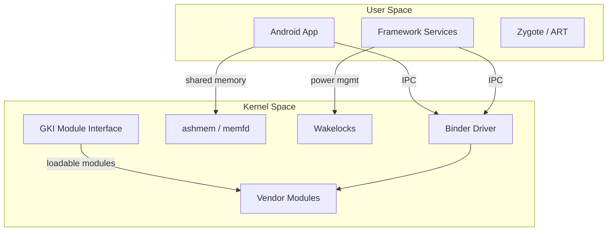
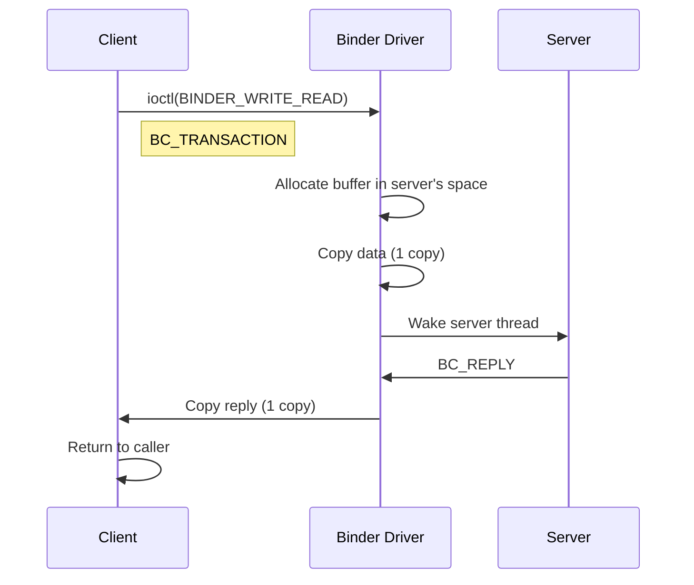
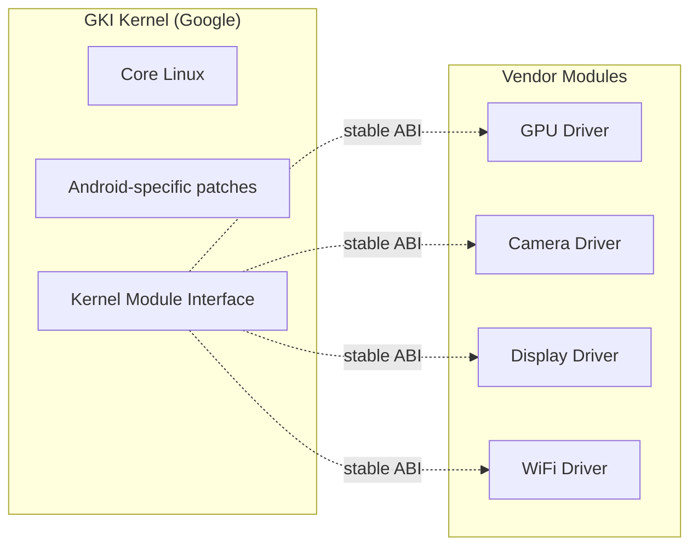

# Android Kernel Internals

Android runs a modified Linux kernel with subsystems that do not exist in
mainline. This chapter covers the four pillars of Android-specific kernel
infrastructure: **Binder IPC**, **Anonymous Shared Memory (ashmem)**,
**wakelocks**, and the **Generic Kernel Image (GKI)**. Understanding these
components is essential for anyone porting Android to new hardware or
debugging system-level performance issues.

---

## 1. Architecture Overview



---

## 2. Binder IPC

### 2.1 What Is Binder?

Binder is Android's primary inter-process communication (IPC) mechanism. It is
a character device (`/dev/binder`) that implements a custom RPC protocol on top
of a kernel driver. Every Android system service—Activity Manager, Window
Manager, SurfaceFlinger—communicates via Binder.

### 2.2 Why Not POSIX IPC?

| Feature | POSIX (pipes/sockets/shared mem) | Binder |
|---------|-----------------------------------|--------|
| Copy operations | 2 (sender → kernel → receiver) | 1 (kernel maps pages) |
| Object references | Not natively supported | Marshalled object handles |
| Security | Manual credential passing | UID/PID per-transaction |
| Thread model | Fork / pthread | Thread pool per process |

Binder achieves **one-copy IPC** by mapping pages from the sender's address
space directly into the receiver's.

### 2.3 Kernel Driver Internals

The Binder driver lives in `drivers/android/binder.c`. Key data structures:

```c
/* Simplified — actual kernel struct is more complex */
struct binder_proc {
    struct list_head threads;       /* binder_thread list */
    struct list_head nodes;         /* binder_node list */
    struct rb_root refs_by_desc;    /* binder_ref by descriptor */
    struct rb_root refs_by_node;    /* binder_ref by node */
    struct task_struct *tsk;        /* owning task */
    pid_t pid;
};

struct binder_thread {
    struct binder_proc *proc;
    struct rb_node rb_node;
    int looper;                     /* state flags */
    struct binder_transaction *transaction_stack;
    struct list_head todo;          /* pending work items */
};
```

#### Transaction Flow



### 2.4 ioctl Commands

```bash
# Key ioctl numbers (defined in binder.h)
BINDER_SET_CONTEXT_MGR   # Register as context manager (servicemanager)
BINDER_WRITE_READ        # Main transaction ioctl
BINDER_SET_MAX_THREADS   # Set thread pool size
BINDER_VERSION           # Query driver version
```

### 2.5 The servicemanager

The `servicemanager` process registers as the context manager and acts as the
name server. Clients look up services by name:

```cpp
// C++ client example
sp<IServiceManager> sm = defaultManager();
sp<IBinder> binder = sm->getService(String16("activity"));
```

### 2.6 HwBinder and VNDK Binder

Android 8.0+ splits Binder into three domains:

| Domain | Device Node | Purpose |
|--------|-------------|---------|
| Framework Binder | `/dev/binder` | App ↔ system services |
| HwBinder | `/dev/hwbinder` | HAL ↔ vendor processes |
| VndBinder | `/dev/vndbinder` | Vendor ↔ vendor |

This separation enforces the Treble architecture, preventing vendor code from
directly calling framework services.

---

## 3. Anonymous Shared Memory (ashmem)

### 3.1 Overview

`ashmem` is Android's shared memory subsystem. In modern kernels (5.x+), it is
backed by `memfd_create()` for mainline compatibility.

```bash
# ashmem character device
ls -la /dev/ashmem
```

### 3.2 Key Features

- **Pinning / unpinning** — pages can be marked as pinned (non-evictable) or
  unpinned (can be reclaimed under memory pressure)
- **Purging** — the kernel can reclaim unpinned pages when the system is low on
  memory, a feature not available in POSIX shared memory
- **Sealing** — similar to `F_SEAL_*` on memfd, prevents further modifications

### 3.3 Usage from User Space

```c
#include <linux/ashmem.h>
#include <sys/ioctl.h>
#include <sys/mman.h>

int fd = open("/dev/ashmem", O_RDWR);
ioctl(fd, ASHMEM_SET_NAME, "my_shared_region");
ioctl(fd, ASHMEM_SET_SIZE, 4096);

void *ptr = mmap(NULL, 4096, PROT_READ | PROT_WRITE, MAP_SHARED, fd, 0);
// Use ptr for shared data
```

### 3.4 Migration to memfd

Android 12+ encourages `memfd_create()` for new code:

```c
#include <sys/memfd.h>

int fd = memfd_create("my_region", MFD_ALLOW_SEALING);
ftruncate(fd, 4096);
void *ptr = mmap(NULL, 4096, PROT_READ | PROT_WRITE, MAP_SHARED, fd, 0);
```

The kernel's `shmem.c` provides the backing for both mechanisms.

---

## 4. Wakelocks

### 4.1 Concept

Wakelocks prevent the CPU from entering deep sleep states. Android uses them
to keep the device awake during critical operations (e.g., receiving a push
notification, playing audio).

### 4.2 Kernel Wakelocks

The kernel exposes wakelocks via `/sys/power/wake_lock` and
`/sys/power/wake_unlock`:

```bash
# Acquire a kernel wakelock
echo "my_lock" > /sys/power/wake_lock

# Release it
echo "my_lock" > /sys/power/wake_unlock

# List active wakelocks
cat /sys/power/wake_lock
```

### 4.3 Wake Sources (Modern Kernels)

In Linux 4.x+, the kernel renamed "wakelocks" to **wake sources**. The user-space
interface remains, but internally:

```c
/* Modern kernel */
struct wakeup_source {
    struct wakeup_source *ws;
    ktime_t total_time;
    ktime_t max_time;
    unsigned long event_count;
    unsigned long active_count;
};
```

### 4.4 User-Space Power Management

Android's `PowerManager` service translates app requests into kernel wakelocks:

```java
PowerManager pm = (PowerManager) getSystemService(POWER_SERVICE);
PowerManager.WakeLock wl = pm.newWakeLock(
    PowerManager.PARTIAL_WAKE_LOCK, "myapp:mytag");
wl.acquire();
// ... do work ...
wl.release();
```

### 4.5 Debugging Wakelocks

```bash
# Dumpsys shows user-space and kernel wakelocks
dumpsys power | grep -A 20 "Wake Locks"

# Battery historian for visual analysis
bugreport > bugreport.zip
# Upload to https://bathist.ef.lc/
```

---

## 5. Generic Kernel Image (GKI)

### 5.1 The Problem

Before GKI, every Android device shipped a custom kernel fork. Vendors modified
hundreds of files, making kernel updates nearly impossible. Security patches
took months to propagate.

### 5.2 GKI Architecture

GKI (Android 11+) separates the kernel into:

| Component | Owner | Update Path |
|-----------|-------|-------------|
| GKI kernel | Google | OTA via Google Play system updates |
| Vendor modules | SoC vendor | Shipped with vendor image |
| System-specific code | OEM | Removed from kernel |



### 5.3 Kernel Module Interface (KMI)

GKI guarantees a stable KMI — a list of exported symbols that vendor modules
can depend on. This list is frozen for each GKI version.

```bash
# View the KMI symbol list
cat /proc/kallsyms | grep -E "EXPORT_SYMBOL"

# Check if a module uses only KMI symbols
modprobe --show-depends my_vendor_module.ko
```

### 5.4 Building GKI

```bash
# Clone GKI kernel
git clone https://android.googlesource.com/kernel/common -b android-gki-5.10

# Build
export ARCH=arm64
make gki_defconfig
make -j$(nproc)

# Output: out/arch/arm64/boot/Image.gz
```

### 5.5 Vendor Module Development

```makefile
# Kbuild for a vendor module
obj-m += my_camera_driver.o
my_camera_driver-objs := camera_core.o camera_isp.o

# Must link against GKI-exported symbols only
```

```bash
# Build vendor module against GKI headers
make -C /path/to/gki/kernel M=$(pwd) modules
```

### 5.6 GKI Versioning

| GKI Version | Kernel Branch | Android Version |
|-------------|---------------|-----------------|
| GKI 1.0 | android-5.4 | Android 11 |
| GKI 2.0 | android-5.10, 5.15 | Android 12–13 |
| GKI 2.0+ | android-6.1, 6.6 | Android 14–15 |

---

## 6. Android Kernel Modules

### 6.1 Loadable Modules

Android devices use kernel modules extensively for hardware drivers:

```bash
# List loaded modules
lsmod

# Module configuration
cat /vendor/lib/modules/modules.load
```

### 6.2 Module Loading Order

Android uses a `modules.load` file to specify boot-time module loading order:

```
# /vendor/lib/modules/modules.load
vendor/lib/modules/mtk-scp.ko
vendor/lib/modules/mtk-adsp.ko
vendor/lib/modules/mtk-snd-common.ko
```

### 6.3 Module Signing

GKI requires vendor modules to be signed:

```bash
# Sign a module
scripts/sign-file sha256 certs/signing_key.pem \
    certs/signing_key.x509 my_module.ko
```

---

## 7. Device Tree Overlays for Android

Android devices use device tree blobs (DTBs) to describe hardware. GKI
separates the base DTB from vendor overlays:

```dts
/* Vendor overlay example */
/ {
    fragment@0 {
        target = <&i2c3>;
        __overlay__ {
            #address-cells = <1>;
            #size-cells = <0>;
            touchscreen@38 {
                compatible = "vendor,ts-controller";
                reg = <0x38>;
                interrupt-parent = <&gpio>;
                interrupts = <12 0>;
            };
        };
    };
};
```

---

## 8. Debugging Android Kernel Issues

### 8.1 Common Tools

```bash
# Kernel log
dmesg | grep -i binder
dmesg | grep -i ashmem

# Binder debug
cat /sys/kernel/debug/binder/state
cat /sys/kernel/debug/binder/transactions
cat /sys/kernel/debug/binder/stats

# Power debugging
cat /sys/kernel/debug/wakeup_sources
dumpsys batterystats
```

### 8.2 Systrace / Perfetto

```bash
# System-level tracing
perfetto -c /data/misc/perfetto-configs/config.pbtx -o trace.pb
# View at https://ui.perfetto.dev/
```

---

## Further Reading

- [Android Binder IPC Mechanism — docs.kernel.org](https://docs.kernel.org/driver-api/binder.html)
- [Binder Driver Source — kernel.org](https://android.googlesource.com/kernel/common/+/refs/heads/android-mainline/drivers/android/)
- [GKI Documentation — source.android.com](https://source.android.com/docs/core/architecture/kernel/generic-kernel-image)
- [Android Kernel Module Interface](https://source.android.com/docs/core/architecture/kernel/module-interface)
- [ashmem and memfd — LWN.net](https://lwn.net/Articles/833419/)
- [Wakelocks and Android Power Management — LWN.net](https://lwn.net/Articles/479941/)
- [Android Treble Architecture](https://source.android.com/docs/core/architecture)
- [Perfetto System Profiling](https://perfetto.dev/)
- [binder(4) man page](https://man7.org/linux/man-pages/man4/binder.4.html)
