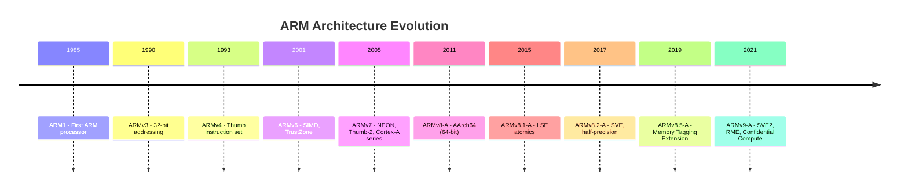
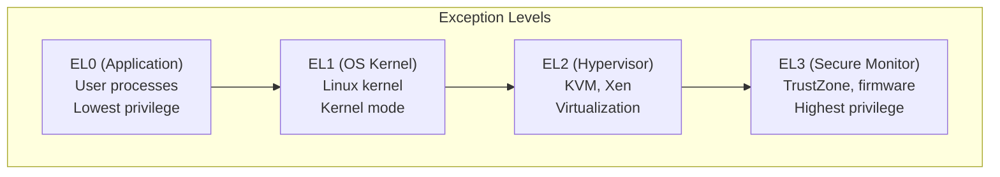
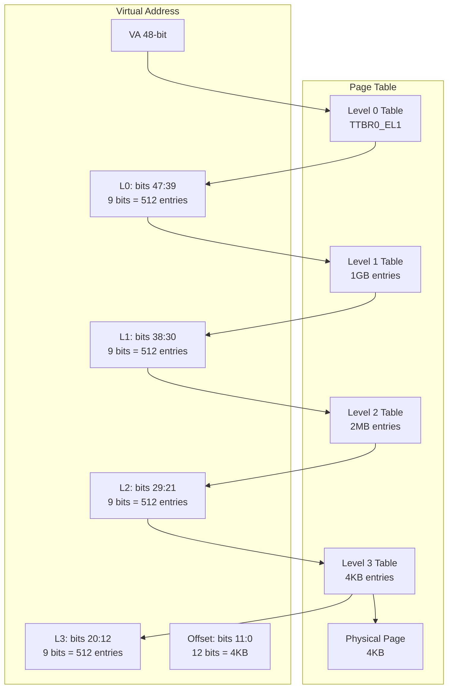
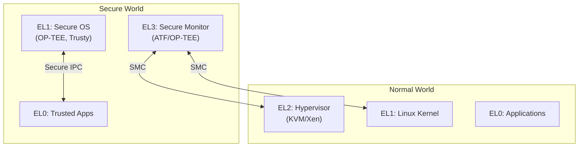
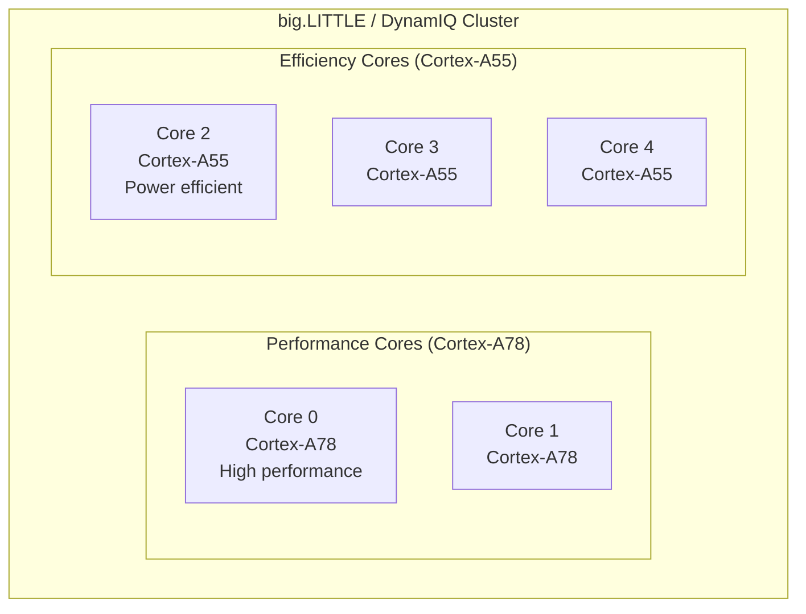

# ARM Architecture

## Introduction

ARM (Advanced RISC Machine) is the most widely used processor architecture in the world. ARM processors power virtually all smartphones, tablets, and a growing share of servers, laptops, embedded systems, and IoT devices. Unlike x86, ARM uses a Reduced Instruction Set Computer (RISC) design philosophy — simpler instructions, fixed-length encoding, and a load/store architecture.

This chapter covers the ARM architecture relevant to Linux: AArch64 (64-bit), exception levels, memory model, NEON SIMD, TrustZone security, and the big.LITTLE heterogeneous multiprocessing design.

## ARM Architecture Versions



### ARMv8-A Overview

ARMv8-A introduced the 64-bit AArch64 execution state while maintaining backward compatibility with 32-bit AArch32:

| Feature | AArch32 (ARMv7) | AArch64 (ARMv8-A) |
|---------|----------------|-------------------|
| Registers | 16 × 32-bit (R0-R15) | 31 × 64-bit (X0-X30) |
| Program counter | R15 | PC (not directly accessible) |
| Stack pointer | SP (R13) | SP (dedicated) |
| Link register | LR (R14) | LR (X30) |
| SIMD | NEON (128-bit) | NEON (128-bit), SVE (scalable) |
| Address space | 32-bit (4 GB) | 48/52-bit (256 TB / 4 PB) |
| Privilege levels | User, FIQ, IRQ, SVC, Abort, Undef, System | EL0-EL3 |
| Page sizes | 4 KB, 64 KB, 1 MB (sections) | 4 KB, 16 KB, 64 KB |
| Exception handling | Complex (banked registers) | Simplified |

## Exception Levels

ARMv8-A defines four exception levels (EL0-EL3), each with increasing privilege:


### Exception Level Mapping

| Exception Level | Typical Use | Linux Use | Examples |
|----------------|-------------|-----------|----------|
| **EL3** | Secure Monitor | ARM Trusted Firmware (ATF/TF-A) | PSCI, Secure boot |
| **EL2** | Hypervisor | KVM hypervisor module | Virtualization |
| **EL1** | OS Kernel | Linux kernel | Kernel mode |
| **EL0** | Application | User-space processes | Applications, libraries |

```bash
# Check current exception level (from kernel)
# Reading CurrentEL register
cat /proc/cpuinfo | head -20
# processor       : 0
# BogoMIPS        : 48.00
# Features        : fp asimd evtstrm aes pmull sha1 sha2 crc32 cpuid

# Kernel runs at EL1
# KVM runs at EL2
# ATF runs at EL3

# Exception level transitions:
# EL0 → EL1: System call (SVC instruction)
# EL1 → EL2: Trap (if configured)
# EL2 → EL3: Secure Monitor Call (SMC instruction)
```

### Exception Handling in AArch64

```asm
/* AArch64 exception vectors */
/* Vector table is 128-byte aligned, 16 entries × 128 bytes */

/* Vector table layout:
 * 0x000: Synchronous, from current EL with SP0
 * 0x080: IRQ, from current EL with SP0
 * 0x100: FIQ, from current EL with SP0
 * 0x180: SError, from current EL with SP0
 * 0x200: Synchronous, from current EL with SPx
 * 0x280: IRQ, from current EL with SPx
 * 0x300: FIQ, from current EL with SPx
 * 0x380: SError, from current EL with SPx
 * 0x400: Synchronous, from lower EL (AArch64)
 * 0x480: IRQ, from lower EL (AArch64)
 * 0x500: FIQ, from lower EL (AArch64)
 * 0x580: SError, from lower EL (AArch64)
 * 0x600: Synchronous, from lower EL (AArch32)
 * 0x680: IRQ, from lower EL (AArch32)
 * 0x700: FIQ, from lower EL (AAArch32)
 * 0x780: SError, from lower EL (AAArch32)
 */

.align 12
vector_table:
    /* Synchronous from EL0 (system call) */
    b el0_sync_handler
    .align 7
    /* IRQ from EL0 */
    b el0_irq_handler
    .align 7
    /* Synchronous from EL1 (kernel trap) */
    b el1_sync_handler
    .align 7
    /* IRQ from EL1 */
    b el1_irq_handler
```

## Registers

### General-Purpose Registers

```bash
# AArch64 has 31 general-purpose 64-bit registers
# X0-X30: 64-bit views
# W0-W30: 32-bit views (lower 32 bits of X0-X30)

# Register conventions (AAPCS64):
# X0-X7:   Arguments and return values
# X8:      Indirect result location
# X9-X15:  Temporary registers (caller-saved)
# X16-X17: IP0/IP1 (intra-procedure call, PLT)
# X18:     Platform register (reserved by OS/ABI)
# X19-X28: Callee-saved registers
# X29:     Frame pointer (FP)
# X30:     Link register (LR)
# SP:      Stack pointer
# PC:      Program counter (not directly accessible)
# PSTATE:  Processor state (NZCV, DAIF, etc.)
```

### System Registers

```bash
# Key system registers in AArch64
# SCTLR_EL1: System Control Register (MMU, caches, alignment)
# TCR_EL1: Translation Control Register (page table config)
# TTBR0_EL1, TTBR1_EL1: Translation Table Base Registers
# VBAR_EL1: Vector Base Address Register
# ESR_EL1: Exception Syndrome Register
# FAR_EL1: Fault Address Register
# DAIF: Debug, SError, IRQ, FIQ mask bits
# CurrentEL: Current Exception Level
# SPSR_EL1: Saved Program Status Register
# ELR_EL1: Exception Link Register
# CNTFRQ_EL0: Counter Frequency Register

# Read CurrentEL from kernel
# mrs x0, CurrentEL
# x0 = 4 (EL1), 8 (EL2), etc.
```

## Memory Model

### Virtual Memory

```bash
# AArch64 virtual address space (48-bit):
# 0x0000_0000_0000_0000 — 0x0000_FFFF_FFFF_FFFF: User space (lower VA)
# 0xFFFF_0000_0000_0000 — 0xFFFF_FFFF_FFFF_FFFF: Kernel space (upper VA)

# Linux uses two translation table base registers:
# TTBR0_EL1: User space page tables
# TTBR1_EL1: Kernel space page tables

# Page sizes: 4 KB, 16 KB, 64 KB
# Linux uses 4 KB pages by default on ARM64

# Translation levels (4KB pages, 48-bit VA):
# Level 0: 512 GB per entry (1 entry for 48-bit VA)
# Level 1: 1 GB per entry (512 entries)
# Level 2: 2 MB per entry (512 entries per L1)
# Level 3: 4 KB per entry (512 entries per L2)
```

### Translation Tables


### Memory Types and Attributes

```bash
# ARM memory types:
# Normal memory: Cachable, used for code and data
# Device memory: Non-cachable, for memory-mapped I/O

# Cacheability attributes (MAIR_EL1):
# Attr0: Device-nGnRnE (most restrictive device memory)
# Attr1: Device-nGnRE
# Attr2: Device-GRE
# Attr3: Normal NC (non-cacheable)
# Attr4: Normal WT (write-through)
# Attr5: Normal WB (write-back)

# Linux memory attributes:
# __io(vaddr)    — Device memory (uncached)
# __mem(vaddr)   — Normal memory (cached)
```

## Cache Architecture

```bash
# ARM cache hierarchy
# L1: Split I-cache (instruction) and D-cache (data), per core
# L2: Unified, per core or shared (implementation defined)
# L3: Shared among all cores (some SoCs)

# Cache line size: typically 64 bytes
getconf LEVEL1_DCACHE_LINESIZE
# 64

# Cache sizes
getconf LEVEL1_DCACHE_SIZE
# 32768  (32KB)
getconf LEVEL2_CACHE_SIZE
# 262144 (256KB)

# Cache operations (from kernel):
# dc civac, <addr>  — Clean and Invalidate by VA to PoC
# dc cvac, <addr>   — Clean by VA to PoC
# dc ivac, <addr>   — Invalidate by VA to PoC
# ic iallu          — Invalidate all instruction caches

# Linux cache management API:
# __flush_dcache_area(addr, size)
# __invalidate_icache_all()
```

## NEON (Advanced SIMD)

NEON is ARM's SIMD (Single Instruction, Multiple Data) extension, providing 128-bit vector operations:

```bash
# NEON registers:
# V0-V31: 128-bit vector registers
# Can be viewed as:
# 16 × 8-bit lanes (16B)
# 8 × 16-bit lanes (8H)
# 4 × 32-bit lanes (4S)
# 2 × 64-bit lanes (2D)
# 1 × 128-bit (1Q)

# NEON features:
# Integer and floating-point operations
# Saturating arithmetic
# Table lookups (TBL/TBX)
# Polynomial multiplication (for crypto)
```

```c
/* NEON intrinsics example: vector addition */
#include <arm_neon.h>

void add_vectors(float *a, float *b, float *result, int n) {
    for (int i = 0; i < n; i += 4) {
        float32x4_t va = vld1q_f32(&a[i]);
        float32x4_t vb = vld1q_f32(&b[i]);
        float32x4_t vr = vaddq_f32(va, vb);
        vst1q_f32(&result[i], vr);
    }
}

/* NEON image processing: grayscale conversion */
void rgb_to_gray(uint8_t *rgb, uint8_t *gray, int pixels) {
    /* Fixed-point weights: 0.299*256=77, 0.587*256=150, 0.114*256=29 */
    uint8x8_t r_weight = vdup_n_u8(77);
    uint8x8_t g_weight = vdup_n_u8(150);
    uint8x8_t b_weight = vdup_n_u8(29);
    
    for (int i = 0; i < pixels; i += 8) {
        uint8x8x3_t pixel = vld3_u8(&rgb[i * 3]);
        uint16x8_t sum = vmull_u8(pixel.val[0], r_weight);
        sum = vmlal_u8(sum, pixel.val[1], g_weight);
        sum = vmlal_u8(sum, pixel.val[2], b_weight);
        vst1_u8(&gray[i], vshrn_n_u16(sum, 8));
    }
}
```

```bash
# Check NEON support
cat /proc/cpuinfo | grep -i neon
# Features: ... asimd evtstrm aes pmull sha1 sha2 crc32 ...

# Compile with NEON
aarch64-linux-gnu-gcc -O2 -march=armv8-a+simd -o app app.c

# Auto-vectorization
aarch64-linux-gnu-gcc -O2 -march=armv8-a -ftree-vectorize -fopt-info-vec app.c
```

### SVE (Scalable Vector Extension)

```bash
# SVE extends NEON with scalable vector lengths (128-2048 bits)
# SVE2 is part of ARMv9-A

# SVE register:
# Z0-Z31: Scalable vector registers (128-2048 bits)
# P0-P15: Predicate registers (one bit per vector element)

# Check SVE support
cat /proc/cpuinfo | grep -i sve
# svei8mm svebf16 i8mm bf16

# SVE intrinsics
#include <arm_sve.h>

void sve_add(float *a, float *b, float *c, int n) {
    for (int i = 0; i < n; i += svcntw()) {
        svbool_t pred = svwhilelt_b32(i, n);
        svfloat32_t va = svld1(pred, &a[i]);
        svfloat32_t vb = svld1(pred, &b[i]);
        svfloat32_t vc = svadd_f32_m(pred, va, vb);
        svst1(pred, &c[i], vc);
    }
}
```

## TrustZone

TrustZone is ARM's hardware security technology that creates a secure world and a normal world:


### TrustZone Components

```bash
# ARM Trusted Firmware (ATF/TF-A)
# Runs at EL3, implements:
# 1. PSCI (Power State Coordination Interface)
#    - CPU on/off
#    - System reset/shutdown
#    - Suspend/resume
# 2. Secure boot
# 3. SMC (Secure Monitor Call) routing
# 4. World switching

# OP-TEE (Open Portable Trusted Execution Environment)
# Runs at EL1 in Secure World
# Provides:
# 1. Trusted applications (TAs)
# 2. Cryptographic services
# 3. Secure storage
# 4. Trusted UI

# PSCI interface (Linux calls ATF)
# Linux → SMC → ATF → Hardware
# CPU_ON, CPU_OFF, CPU_SUSPEND, SYSTEM_RESET, SYSTEM_OFF

# Check PSCI support
dmesg | grep psci
# psci: PSCIv1.1 detected in firmware.
# psci: Using standard PSCI v0.2 function IDs
```

## big.LITTLE and DynamIQ

ARM's heterogeneous multiprocessing combines high-performance and energy-efficient cores:


### big.LITTLE Scheduling

```bash
# Linux Energy-Aware Scheduler (EAS)
# Considers CPU capacity and energy cost when placing tasks

# CPU capacity (from DT or firmware)
cat /sys/devices/system/cpu/cpu0/cpu_capacity
# 1024  (efficiency core)
cat /sys/devices/system/cpu/cpu2/cpu_capacity
# 446   (performance core, higher capacity)

# Energy model
cat /sys/kernel/debug/energy_model/cpu0/current_frequency
cat /sys/kernel/debug/energy_model/cpu0/*/power

# Task placement hints:
# Utilization: scheduler places compute-heavy tasks on big cores
# uclamp_min: guarantee minimum capacity (big core)
# uclamp_max: cap capacity (little core)

# Check which cluster a CPU belongs to
ls /sys/devices/system/cpu/cpu0/
# cpu_capacity, cpufreq/, topology/
```

### CPU Frequency Scaling

```bash
# big.LITTLE cores have different frequency ranges
cat /sys/devices/system/cpu/cpu0/cpufreq/scaling_available_frequencies
# 408000 600000 816000 1008000 1200000 1368000 1512000 1608000 1704000

cat /sys/devices/system/cpu/cpu2/cpufreq/scaling_available_frequencies
# 600000 800000 1000000 1200000 1400000 1600000 1800000 2000000 2200000 2400000

# Governor: schedutil (recommended for big.LITTLE)
cat /sys/devices/system/cpu/cpu0/cpufreq/scaling_governor
# schedutil
```

## KVM on ARM

```bash
# KVM uses ARM virtualization extensions (EL2)
# ARM provides hardware-assisted virtualization similar to Intel VT-x

# Key ARM virtualization features:
# Stage 2 translation (similar to EPT/NPT)
# Virtual interrupt injection (GICv3/v4)
# Timer virtualization
# PMU virtualization

# Check KVM support on ARM
grep -E 'kvm|KVM' /proc/cpuinfo
# Features: ... kvm ...

# Create ARM64 VM with KVM
qemu-system-aarch64 \
  -enable-kvm \
  -machine virt \
  -cpu host \
  -m 2048 \
  -kernel Image \
  -drive file=rootfs.ext4,if=virtio \
  -append "root=/dev/vda console=ttyAMA0" \
  -nographic
```

## Debugging ARM Systems

```bash
# JTAG debugging with OpenOCD
# Connect JTAG probe (J-Link, CMSIS-DAP, etc.)
openocd -f interface/jlink.cfg \
        -f target/stm32mp15x.cfg

# GDB remote debugging
aarch64-linux-gnu-gdb vmlinux
(gdb) target remote :3333
(gdb) hbreak start_kernel
(gdb) continue

# ARM CoreSight tracing
# Embedded Trace Macrocell (ETM) traces instruction execution
# Trace data → CoreSight funnel → TPIU → trace port/USB

# ARM Performance Monitoring Unit (PMU)
perf stat -e cycles,instructions,cache-misses ./my_program
# Performance counter hardware events
# Common events: cycles, instructions, L1-dcache-load-misses,
#                branch-misses, bus-cycles, stalled-cycles-frontend
```

## References

1. ARM. "Arm Architecture Reference Manual for A-profile Architecture." [https://developer.arm.com/documentation/ddi0487/latest](https://developer.arm.com/documentation/ddi0487/latest)
2. ARM. "Arm Architecture Registers." [https://developer.arm.com/documentation/ddi0601/latest](https://developer.arm.com/documentation/ddi0601/latest)
3. ARM. "ARM Cortex-A Series Programmer's Guide for ARMv8-A." [https://developer.arm.com/documentation/den0024/latest](https://developer.arm.com/documentation/den0024/latest)
4. Qualcomm. "big.LITTLE Technology: The Future of Mobile." Whitepaper.

## Further Reading

- [The Linux Kernel Documentation](https://docs.kernel.org/)
- [LWN.net - Linux and free software news](https://lwn.net/)
- [GNU Project Documentation](https://www.gnu.org/doc/doc.html)
- [GNU Manuals](https://www.gnu.org/manual/manual.html)
- [Free Software Directory](https://directory.fsf.org/wiki/Main_Page)
- [Planet GNU](https://planet.gnu.org/)
- [Free Software Books](https://www.gnu.org/doc/other-free-books.html)

- [ARM Architecture Reference Manual](https://developer.arm.com/documentation/ddi0487/latest)
- [ARM Cortex-A Programmer's Guide](https://developer.arm.com/documentation/den0024/latest)
- [ARM NEON Programmer's Guide](https://developer.arm.com/documentation/den0018/latest)
- [ARM SVE Programmer's Guide](https://developer.arm.com/documentation/102131/latest)
- [Linux ARM64 Documentation](https://www.kernel.org/doc/html/latest/arm64/)

## Related Topics

- [Embedded Linux Overview](./overview.md) — Embedded Linux fundamentals
- [Cross-Compilation](./cross-compilation.md) — Building for ARM
- [Device Tree](./device-tree.md) — ARM hardware description
- [U-Boot](./uboot.md) — ARM bootloader
- [Virtualization Overview](../virtualization/overview.md) — ARM virtualization
