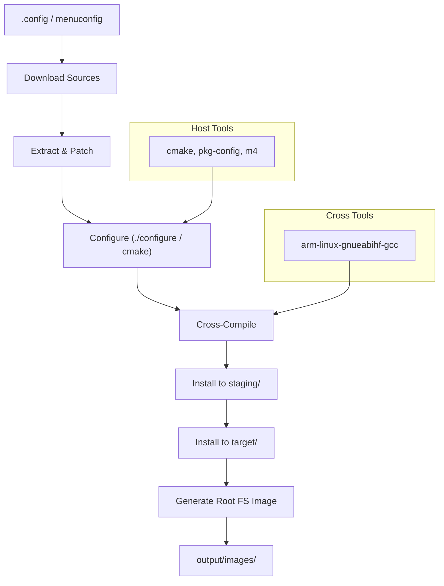

# Buildroot: Building Embedded Linux Systems

Buildroot is a simple, efficient tool for generating complete embedded Linux
systems through cross-compilation. It produces a root filesystem image, a
kernel image, a bootloader, and optionally a toolchain — all from a single
`make` invocation. This chapter covers configuration, package management,
custom overlays, cross-compilation, and output image generation.

---

## 1. Buildroot vs Alternatives

| Feature | Buildroot | Yocto | OpenWrt |
|---------|-----------|-------|---------|
| Build system | Make | BitBake (Python) | Make |
| Complexity | Low | High | Medium |
| Package count | ~3000 | ~3500 (core) | ~8000 |
| Root FS format | Read-only (ext4, squashfs) | Read-write or read-only | Squashfs + overlay |
| Reproducibility | Good | Excellent | Good |
| Learning curve | Gentle | Steep | Moderate |
| Best for | Simple, fixed-function devices | Complex, multi-image products | Routers / networking |

---

## 2. Getting Started

### 2.1 Prerequisites

```bash
# Debian/Ubuntu
sudo apt install build-essential git cmake \
    bc cpio file unzip wget \
    libncurses-dev python3 python3-pip \
    rsync
```

### 2.2 Download and Extract

```bash
wget https://buildroot.org/downloads/buildroot-2024.02.tar.xz
tar xf buildroot-2024.02.tar.xz
cd buildroot-2024.02
```

### 2.3 Minimal Build

```bash
make qemu_arm_vexpress_defconfig   # pick a defconfig
make                                # build everything (30-60 min first time)
```

Output appears in `output/images/`.

---

## 3. Configuration System (menuconfig)

Buildroot uses the Linux kernel's Kconfig system. The main configuration
interface is `menuconfig`.

```bash
make menuconfig
```

### 3.1 Key Menu Sections

```
├── Target options            # Architecture, ABI, FPU
├── Build options             # Parallel jobs, ccache, download dir
├── Toolchain                 # Internal, external, or custom
├── System configuration      # Hostname, init system, root password
├── Kernel                    # Linux kernel version and config
├── Target packages           # Libraries, applications, services
├── Filesystem images         # ext4, squashfs, cpio, etc.
├── Bootloaders               # U-Boot, Barebox, GRUB
└── Host utilities            # Tools built for the build host
```

### 3.2 Target Options

For an ARM Cortex-A9 board:

```
Target Architecture (ARM)  --->
Target Binary Format (ELF) --->
Target Architecture Variant (cortex-A9) --->
Floating point strategy (NEON/VFPv4) --->
```

### 3.3 Saving and Loading Configurations

```bash
# Save current config
make savedefconfig DEFCONFIG=myboard_defconfig

# Restore a defconfig
cp myboard_defconfig configs/
make myboard_defconfig
make
```

---

## 4. Toolchain Configuration

### 4.1 Internal Toolchain (Recommended for Beginners)

Buildroot builds its own cross-compiler from source:

```
Toolchain type (Buildroot toolchain) --->
    Toolchain (Custom toolchain) --->
    GCC compiler version (13.x) --->
    C library (glibc) --->
    Kernel Headers (Linux 6.6.x) --->
```

The toolchain is installed in `output/host/bin/`:

```bash
output/host/bin/arm-linux-gnueabihf-gcc --version
```

### 4.2 External Toolchain

Use a pre-built toolchain (e.g., ARM GNU Toolchain, Linaro):

```
Toolchain type (External toolchain) --->
    Toolchain (Linaro ARM 2023.10) --->
```

### 4.3 Using the Toolchain Outside Buildroot

```bash
# Extract the SDK
make sdk
tar xf output/images/arm-buildroot-linux-gnueabihf_sdk-buildroot.tar.xz \
    -C /opt/

# Use it
export PATH=/opt/arm-buildroot-linux-gnueabihf_sdk-buildroot/bin:$PATH
arm-linux-gnueabihf-gcc -o hello hello.c
```

---

## 5. Package Management

### 5.1 Enabling Packages

```bash
make menuconfig
# Navigate to Target packages → Libraries → ...
# Enable: [*] zlib
# Enable: [*] openssl
```

Or directly edit `.config`:

```
BR2_PACKAGE_ZLIB=y
BR2_PACKAGE_OPENSSL=y
```

### 5.2 Package Structure

Each package is defined in a directory under `package/`:

```
package/
└── myapp/
    ├── myapp.mk        # Makefile fragment
    ├── myapp.hash      # Hash verification
    └── Config.in       # Kconfig entry
```

### 5.3 Writing a Package (myapp.mk)

```makefile
################################################################################
#
# myapp
#
################################################################################

MYAPP_VERSION = 1.2.3
MYAPP_SITE = https://example.com/releases
MYAPP_SOURCE = myapp-$(MYAPP_VERSION).tar.gz
MYAPP_LICENSE = MIT
MYAPP_LICENSE_FILES = LICENSE

# Dependencies
MYAPP_DEPENDENCIES = zlib openssl

# Build system: autotools, cmake, generic
MYAPP_CONF_OPTS = -DENABLE_TESTS=OFF

# Install init script
define MYAPP_INSTALL_INIT_SYSV
    $(INSTALL) -D -m 0755 $(MYAPP_PKGDIR)/S99myapp \
        $(TARGET_DIR)/etc/init.d/S99myapp
endef

$(eval $(cmake-package))
```

### 5.4 Package Config (Config.in)

```
config BR2_PACKAGE_MYAPP
    bool "myapp"
    depends on BR2_PACKAGE_ZLIB
    select BR2_PACKAGE_OPENSSL
    help
        My custom application for the embedded device.
        
        https://example.com/myapp
```

Reference it from the parent `Config.in`:

```
source "$BR2_EXTERNAL_MYBOARD_PATH/package/myapp/Config.in"
```

### 5.5 Rebuilding a Single Package

```bash
# Clean and rebuild
make myapp-dirclean
make myapp

# Rebuild only (no clean)
make myapp-rebuild

# Show build log
make myapp-show-log
```

---

## 6. Custom Overlays

Overlays let you add files to the root filesystem without modifying packages.

### 6.1 Root Filesystem Overlay

Create a directory tree mirroring the target's root filesystem:

```
board/mycompany/myboard/rootfs_overlay/
├── etc/
│   ├── hostname
│   ├── network/
│   │   └── interfaces
│   └── fstab
├── usr/
│   └── share/
│       └── myapp/
│           └── config.json
└── var/
    └── lib/
        └── myapp/
```

Configure in `menuconfig`:

```
System configuration → Root filesystem overlay directories:
    board/mycompany/myboard/rootfs_overlay
```

Or in `.config`:

```
BR2_ROOTFS_OVERLAY="board/mycompany/myboard/rootfs_overlay"
```

### 6.2 Post-Build Scripts

Run custom scripts after the filesystem is assembled:

```bash
# post_build.sh
#!/bin/bash
TARGET_DIR=$1

# Remove unnecessary files
rm -rf ${TARGET_DIR}/usr/share/doc
rm -rf ${TARGET_DIR}/usr/share/man

# Set permissions
chmod 700 ${TARGET_DIR}/root
```

```
BR2_ROOTFS_POST_BUILD_SCRIPT="board/mycompany/myboard/post_build.sh"
```

### 6.3 Post-Image Scripts

Run after images are generated (e.g., to create a firmware bundle):

```bash
# post_image.sh
#!/bin/bash
IMAGES_DIR=$1

# Create a combined firmware image
cat ${IMAGES_DIR}/u-boot.bin \
    ${IMAGES_DIR}/zImage \
    ${IMAGES_DIR}/rootfs.ext4 \
    > ${IMAGES_DIR}/firmware.img
```

```
BR2_ROOTFS_POST_IMAGE_SCRIPT="board/mycompany/myboard/post_image.sh"
```

---

## 7. Cross-Compilation Workflow

### 7.1 Build Flow Diagram



### 7.2 Build Stages

| Stage | Directory | Purpose |
|-------|-----------|---------|
| `build/` | `output/build/<pkg>-<ver>/` | Build artifacts |
| `staging/` | `output/staging/` | Cross-compiled libraries + headers |
| `target/` | `output/target/` | Root filesystem contents |
| `host/` | `output/host/` | Host tools + cross-compiler |

### 7.3 Building a Single Package

```bash
# Configure only
make myapp-configure

# Build only
make myapp-build

# Full cycle
make myapp
```

### 7.4 Out-of-Tree Application Development

```bash
# Point pkg-config to staging
export PKG_CONFIG_SYSROOT_DIR=$(pwd)/output/staging
export PKG_CONFIG_PATH=$(pwd)/output/staging/usr/lib/pkgconfig

# Cross-compile your app
$(pwd)/output/host/bin/arm-linux-gnueabihf-gcc \
    $(pkg-config --cflags --libs openssl) \
    -o myapp src/main.c
```

---

## 8. Output Images

### 8.1 Supported Formats

```
Filesystem images --->
    [*] ext2/3/4 root filesystem
        ext2/3/4 variant (ext4) --->
        Filesystem size (256M) --->
    [*] squashfs root filesystem
    [*] initial RAM filesystem (cpio)
    [*] tar the root filesystem
        Compression (gzip) --->
```

### 8.2 Typical Output

```bash
ls output/images/
# Image.gz              — compressed kernel image
# rootfs.ext4           — ext4 root filesystem
# rootfs.squashfs       — read-only squashfs
# rootfs.tar.gz         — tarball of rootfs
# rootfs.cpio.gz        — initramfs
# sdcard.img            — combined SD card image (if configured)
# u-boot.bin            — bootloader
```

### 8.3 SD Card Image

```bash
# Write to SD card
sudo dd if=output/images/sdcard.img of=/dev/sdX bs=1M status=progress
sync
```

### 8.4 QEMU Testing

```bash
# For ARM versatile express
make qemu_arm_vexpress_defconfig
make

# Run
./output/host/bin/qemu-system-arm \
    -M vexpress-a9 \
    -kernel output/images/zImage \
    -dtb output/images/vexpress-v2p-ca9.dtb \
    -drive file=output/images/rootfs.ext4,if=sd \
    -append "root=/dev/mmcblk0 console=ttyAMA0" \
    -nographic
```

---

## 9. Board Support with `board/` Directory

### 9.1 Custom Board Layout

```
board/mycompany/myboard/
├── genimage.cfg           # SD card partition layout
├── post_build.sh
├── post_image.sh
├── rootfs_overlay/
│   └── etc/
│       └── ...
├── patches/
│   └── linux/
│       └── 0001-fix-display.patch
└── defconfig
```

### 9.2 genimage.cfg — Partition Layout

```cfg
image sdcard.img {
    hdimage {
        partition-table-type = "mbr"
    }

    partition boot {
        image = "boot.vfat"
        partition-type = 0x0C
        size = 64M
    }

    partition rootfs {
        image = "rootfs.ext4"
        partition-type = 0x83
    }
}

image boot.vfat {
    vfat {
        files = {
            "zImage",
            "myboard.dtb"
        }
    }
    size = 64M
}
```

---

## 10. External Trees (`BR2_EXTERNAL`)

Buildroot supports external trees to keep custom packages, board support, and
configurations separate from the Buildroot source tree.

### 10.1 Creating an External Tree

```
myboard-external/
├── external.desc
├── external.mk
├── Config.in
├── configs/
│   └── myboard_defconfig
├── board/
│   └── mycompany/
│       └── myboard/
│           └── ...
└── package/
    └── myapp/
        ├── Config.in
        └── myapp.mk
```

`external.desc`:
```
name: MYBOARD
desc: My Company Board Support
```

### 10.2 Using the External Tree

```bash
make BR2_EXTERNAL=/path/to/myboard-external myboard_defconfig
make
```

---

## 11. Tips and Tricks

### 11.1 Speed Up Builds

```bash
# Enable ccache
BR2_CCACHE=y
BR2_CCACHE_DIR="/path/to/ccache"

# Use parallel jobs
BR2_JLEVEL=0    # 0 = auto-detect
```

### 11.2 Legal Compliance

```bash
# Generate manifest of all packages and licenses
make legal-info
ls output/legal-info/
# host-sources/  host-licenses/  manifest.csv  sources/
```

### 11.3 Reproducible Builds

```bash
# Record exact config + version
make show-info > build_info.json

# Force deterministic timestamps
BR2_REPRODUCIBLE=y
```

---

## Further Reading

- [Buildroot Manual — buildroot.org](https://buildroot.org/downloads/manual/manual.html)
- [Buildroot Developer Guide](https://buildroot.org/downloads/manual/manual.html#_contributing_to_buildroot)
- [Cross-compilation with Buildroot — Free Electrons](https://bootlin.com/doc/training/buildroot/buildroot-slides.pdf)
- [Buildroot Package Examples](https://github.com/buildroot/buildroot/tree/master/package)
- [Embedded Linux with Buildroot — Embedded Linux Conference](https://www.youtube.com/watch?v=HJewlILOmm4)
- [Linux Kernel Cross-Compilation — docs.kernel.org](https://docs.kernel.org/kbuild/index.html)
