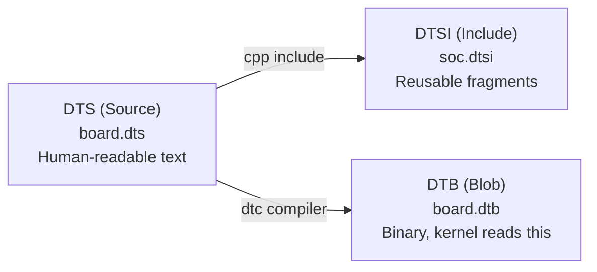

# Device Tree

## Introduction

The device tree is a data structure for describing hardware to the operating system kernel. Instead of hardcoding hardware information in the kernel source (as was done with ARM board files), the device tree provides a declarative, portable description that the kernel parses at boot time.

Device trees are essential in ARM, RISC-V, and other embedded architectures where hardware varies widely between boards and SoCs. They enable a single kernel binary to run on multiple boards by loading the appropriate device tree blob (DTB) at boot.

## DTS, DTB, and DTSI

### File Types



| Extension | Description | Format |
|-----------|-------------|--------|
| `.dts` | Device tree source | Text (human-readable) |
| `.dtsi` | Device tree source include | Text (included by .dts) |
| `.dtb` | Device tree blob | Binary (compiled from .dts) |
| `.dtbo` | Device tree overlay | Binary (applied at runtime) |
| `.dts.S` | Preprocessed source | Assembly with C preprocessor macros |

### DTS Syntax

```dts
/* Minimal device tree */
/dts-v1/;

/ {
    model = "My Custom Board v1.0";
    compatible = "myvendor,my-board", "myvendor,my-soc";
    #address-cells = <2>;
    #size-cells = <2>;

    /* Aliases — shortcut names */
    aliases {
        serial0 = &uart0;
        ethernet0 = &gmac;
    };

    /* Chosen node — kernel parameters */
    chosen {
        bootargs = "console=ttyS0,115200 root=/dev/mmcblk0p2";
        stdout-path = "serial0:115200n8";
    };

    /* Memory */
    memory@80000000 {
        device_type = "memory";
        reg = <0x0 0x80000000 0x0 0x40000000>; /* 1GB */
    };

    /* CPUs */
    cpus {
        #address-cells = <1>;
        #size-cells = <0>;

        cpu@0 {
            device_type = "cpu";
            compatible = "arm,cortex-a53";
            reg = <0>;
            clocks = <&ccu CLK_CPU>;
            operating-points-v2 = <&cpu_opp_table>;
        };

        cpu@1 {
            device_type = "cpu";
            compatible = "arm,cortex-a53";
            reg = <1>;
            clocks = <&ccu CLK_CPU>;
            operating-points-v2 = <&cpu_opp_table>;
        };
    };

    /* Operating points (DVFS) */
    cpu_opp_table: opp-table {
        compatible = "operating-points-v2";
        opp-shared;
        opp@600000000 {
            opp-hz = /bits/ 64 <600000000>;
            opp-microvolt = <1100000>;
            clock-latency-ns = <200000>;
        };
        opp@1000000000 {
            opp-hz = /bits/ 64 <1000000000>;
            opp-microvolt = <1200000>;
            clock-latency-ns = <200000>;
        };
    };

    /* Interrupt controller */
    gic: interrupt-controller@ff801000 {
        compatible = "arm,gic-400";
        reg = <0x0 0xff801000 0 0x1000>,  /* GICD */
              <0x0 0xff802000 0 0x2000>,  /* GICC */
              <0x0 0xff804000 0 0x2000>,  /* GICH */
              <0x0 0xff806000 0 0x2000>;  /* GICV */
        interrupts = <GIC_PPI 9 (GIC_CPU_MASK_SIMPLE(4) | IRQ_TYPE_LEVEL_HIGH)>;
        #interrupt-cells = <3>;
        interrupt-controller;
    };

    /* SoC peripherals */
    soc {
        compatible = "simple-bus";
        #address-cells = <2>;
        #size-cells = <2>;
        ranges;

        uart0: serial@ff110000 {
            compatible = "snps,dw-apb-uart";
            reg = <0x0 0xff110000 0x0 0x1000>;
            interrupts = <GIC_SPI 85 IRQ_TYPE_LEVEL_HIGH>;
            clocks = <&ccu CLK_UART0>, <&ccu CLK_BUS_UART0>;
            clock-names = "baudclk", "apb_pclk";
            reg-shift = <2>;
            status = "okay";
        };

        gmac: ethernet@ff540000 {
            compatible = "snps,dwmac";
            reg = <0x0 0xff540000 0x0 0x10000>;
            interrupts = <GIC_SPI 79 IRQ_TYPE_LEVEL_HIGH>;
            interrupt-names = "macirq";
            clocks = <&ccu CLK_GMAC>;
            clock-names = "stmmaceth";
            phy-mode = "rgmii";
            phy-handle = <&phy0>;
            status = "okay";

            mdio {
                #address-cells = <1>;
                #size-cells = <0>;
                compatible = "snps,dwmac-mdio";

                phy0: ethernet-phy@0 {
                    reg = <0>;
                    interrupt-parent = <&gpio4>;
                    interrupts = <10 IRQ_TYPE_LEVEL_LOW>;
                };
            };
        };

        i2c@ff120000 {
            compatible = "snps,designware-i2c";
            reg = <0x0 0xff120000 0x0 0x1000>;
            interrupts = <GIC_SPI 86 IRQ_TYPE_LEVEL_HIGH>;
            clocks = <&ccu CLK_BUS_I2C0>;
            #address-cells = <1>;
            #size-cells = <0>;
            status = "okay";

            pmic@1a {
                compatible = "vendor,pmic-xyz";
                reg = <0x1a>;
                interrupt-parent = <&gpio0>;
                interrupts = <5 IRQ_TYPE_LEVEL_LOW>;

                regulators {
                    vdd_cpu: DCDC_REG1 {
                        regulator-name = "vdd-cpu";
                        regulator-min-microvolt = <800000>;
                        regulator-max-microvolt = <1400000>;
                        regulator-always-on;
                    };
                };
            };
        };

        gpio0: gpio@ff720000 {
            compatible = "snps,dw-apb-gpio";
            reg = <0x0 0xff720000 0x0 0x1000>;
            #address-cells = <1>;
            #size-cells = <0>;

            gpio-controller@0 {
                compatible = "snps,dw-apb-gpio-port";
                gpio-controller;
                #gpio-cells = <2>;
                ngpios = <32>;
                reg = <0>;
            };
        };
    };
};
```

### DTSI (Include) Files

```dts
/* soc.dtsi — SoC-level common definitions */
/dts-v1/;

/ {
    soc {
        compatible = "simple-bus";
        #address-cells = <2>;
        #size-cells = <2>;

        uart0: serial@ff110000 {
            compatible = "snps,dw-apb-uart";
            reg = <0x0 0xff110000 0x0 0x1000>;
            /* ... */
        };
    };
};

/* board.dts — Board-specific, includes SoC */
/dts-v1/;
#include "soc.dtsi"
#include <dt-bindings/gpio/gpio.h>
#include <dt-bindings/interrupt-controller/irq.h>

/ {
    model = "My Board v1.1";
    compatible = "myvendor,my-board", "myvendor,my-soc";

    memory@80000000 {
        device_type = "memory";
        reg = <0x0 0x80000000 0x0 0x80000000>; /* 2GB */
    };

    /* Override SoC defaults */
    &uart0 {
        status = "okay";
    };
};
```

## Bindings

Device tree bindings define the expected properties for each device type:

### Standard Bindings

```bash
# Bindings documentation location in kernel tree
ls Documentation/devicetree/bindings/
# arm/           bus/          clock/        firmware/
# gpio/          i2c/          input/        interrupt-controller/
# media/         memory/       mtd/          net/
# pci/           phy/          power/        pwm/
# rtc/           serial/       sound/        spi/
# timer/         usb/          watchdog/

# Example: serial port binding
# Documentation/devicetree/bindings/serial/snps-dw-apb-uart.yaml
```

```yaml
# YAML binding schema (modern format)
# serial/snps-dw-apb-uart.yaml
%YAML 1.2
---
$id: http://devicetree.org/schemas/serial/snps,dw-apb-uart.yaml#
$schema: http://devicetree.org/meta-schemas/core.yaml#

title: Synopsys DesignWare ABP UART

maintainers:
  - Author <author@example.com>

properties:
  compatible:
    const: snps,dw-apb-uart

  reg:
    maxItems: 1

  interrupts:
    maxItems: 1

  clocks:
    minItems: 1
    maxItems: 2

  clock-names:
    items:
      - const: baudclk
      - const: apb_pclk

  reg-shift: true
  snps,uart-16550-compatible: true

required:
  - compatible
  - reg
  - interrupts
  - clocks

additionalProperties: false
```

### Device Tree Validation

```bash
# Validate device tree against bindings
# Requires dt-schema (pip install dt-schema)
make dtbs_check

# Or manually with dt-validate
dt-validate -p /path/to/processed-schema.yaml board.dtb

# Warnings/errors indicate binding violations:
# board.dtb: uart@ff110000: 'clock-names' is a required property
# board.dtb: ethernet@ff540000: 'phy-mode' should be one of ['mii', 'rmii', ...]
```

## Device Tree Overlays

Overlays allow modifying the device tree at runtime or boot time without changing the base DTB:

```dts
/* overlay-i2c-sensor.dts */
/dts-v1/;
/plugin/;

&i2c0 {
    #address-cells = <1>;
    #size-cells = <0>;

    sensor@76 {
        compatible = "bosch,bme280";
        reg = <0x76>;
        interrupt-parent = <&gpio4>;
        interrupts = <12 1>;  /* GPIO4_12, falling edge */
    };
};
```

```bash
# Compile overlay
dtc -@ -I dts -O dtb -o overlay-i2c-sensor.dtbo overlay-i2c-sensor.dts
# -@ enables symbol references (required for overlays)

# Apply at boot (U-Boot)
=> load mmc 0:1 ${fdtaddr} board.dtb
=> fdt addr ${fdtaddr}
=> load mmc 0:2 ${overlayaddr} overlay-i2c-sensor.dtbo
=> fdt apply ${overlayaddr}
=> booti ${loadaddr} - ${fdtaddr}

# Apply at boot (config.txt for Raspberry Pi)
dtoverlay=i2c-sensor

# Apply at runtime (if kernel supports)
mkdir -p /sys/kernel/config/device-tree/overlays/my-sensor
cp overlay-i2c-sensor.dtbo /sys/kernel/config/device-tree/overlays/my-sensor/dtbo
```

### Overlay Use Cases

```bash
# Raspberry Pi uses overlays extensively
# /boot/firmware/overlays/
# - spi0-1cs.dtbo       — Enable SPI0 with 1 chip select
# - i2c-rtc.dtbo        — Add I2C RTC
# - disable-bt.dtbo     — Disable Bluetooth
# - vc4-kms-v3d.dtbo    — Enable graphics

# U-Boot overlay support
# CONFIG_OF_LIBFDT_OVERLAY=y
# CONFIG_SPL_LOAD_FIT=y
```

## Runtime Configuration

### /proc/device-tree

```bash
# After boot, the device tree is available at /proc/device-tree/
ls /proc/device-tree/
# #address-cells  chosen       memory@80000000  model
# #size-cells     compatible   name             serial-number
# aliases         cpus         soc

# Read a property
cat /proc/device-tree/model
# My Custom Board v1.0

# Read binary property
xxd /proc/device-tree/memory@80000000/reg
# 00000000: 00000000 80000000 00000000 40000000  ...............@

# Find a specific device
find /proc/device-tree/ -name "compatible" -exec grep -l "dw-apb-uart" {} \;
# /proc/device-tree/soc/serial@ff110000/compatible

# Check device status
cat /proc/device-tree/soc/serial@ff110000/status
# okay
```

### sysfs Device Tree

```bash
# Devices appear in sysfs based on device tree
ls /sys/firmware/devicetree/base/
# Same as /proc/device-tree/

# Platform devices from device tree
ls /sys/bus/platform/devices/
# ff110000.serial    (UART)
# ff540000.ethernet  (GMAC)
# ff120000.i2c       (I2C)
# ff720000.gpio      (GPIO)

# Device driver binding
cat /sys/bus/platform/devices/ff110000.serial/driver_override
cat /sys/bus/platform/devices/ff110000.serial/uevent
# OF_NAME=serial
# OF_FULLNAME=/soc/serial@ff110000
# OF_COMPATIBLE_0=snps,dw-apb-uart
# OF_COMPATIBLE_N=1
# MODALIAS=of:NserialT(null)Csnps,dw-apb-uart
```

## Debugging Device Trees

### Decompiling DTB

```bash
# Convert DTB back to DTS (readable format)
dtc -I dtb -O dts -o board.dts board.dtb

# Or use fdtdump for raw hex
fdtdump board.dtb

# Compare two device trees
dtc -I dtb -O dts board-v1.dtb > v1.dts
dtc -I dtb -O dts board-v2.dtb > v2.dts
diff v1.dts v2.dts
```

### Kernel Debug Messages

```bash
# Enable verbose device tree parsing
# Kernel command line: earlyprintk

# Check device tree loading
dmesg | grep -i "of\|dt\|device.tree"
# [    0.000000] OF: fdt: Machine model: My Custom Board v1.0
# [    0.000000] OF: fdt: Reserved memory: reserved region for node 'linux,cma'
# [    0.500000] OF: fdt: Memory: 0x80000000 - 0xbfffffff (1024 MB)
# [    1.000000] serial: ff110000.serial: ttyS0 at MMIO 0xff110000 (irq = 85) is a 16550A
# [    1.100000] libphy: ff540000.ethernet: probed

# Check for device tree errors
dmesg | grep -i "error\|warning\|fail" | grep -i "of\|dt"
# OF: overlay: node not found
# OF: ERROR: duplicate node name
```

### Debug Tools

```bash
# dtc decompiler with source reference
dtc -I dtb -O dts -@ -L board.dtb

# Device tree debugger (dt_debug)
# Enable CONFIG_OF_UNITTEST for self-test
# Creates /sys/firmware/devicetree/base/__unittest__

# lshw on embedded
lshw -short -businfo

# Device tree aware tools
# dtmerge — merge overlays (Raspberry Pi)
dtmerge board.dtb merged.dtb overlay.dtbo

# dtoverlay — manage overlays (Raspberry Pi)
dtoverlay -l           # List active overlays
dtoverlay i2c-sensor   # Apply overlay
dtoverlay -r i2c-sensor # Remove overlay
```

## Device Tree for Different SoCs

### ARM64 Device Trees in the Kernel

```bash
# Mainline kernel device trees
ls arch/arm64/boot/dts/
# allwinner/   hisilicon/   marvell/    qcom/     ti/
# amd/         intel/       mediatek/   realtek/  xilinx/
# broadcom/    lg/          nvidia/     renesas/
# exynos/      microchip/   nxp/        rockchip/

# Build all device trees
make ARCH=arm64 CROSS_COMPILE=aarch64-linux-gnu- dtbs

# Build specific device tree
make ARCH=arm64 CROSS_COMPILE=aarch64-linux-gnu- \
  broadcom/bcm2711-rpi-4-b.dtb
```

### Adding Custom Device Tree to Kernel

```bash
# 1. Add your DTS file
cp my-board.dts arch/arm64/boot/dts/myvendor/

# 2. Update Makefile
echo 'dtb-$(CONFIG_ARCH_MYVENDOR) += my-board.dtb' >> arch/arm64/boot/dts/myvendor/Makefile

# 3. Enable in Kconfig
# arch/arm64/Kconfig.platforms:
# config ARCH_MYVENDOR
#     bool "My Vendor SoC Support"
#     select GPIOLIB
#     select ARM_GIC

# 4. Build
make ARCH=arm64 CROSS_COMPILE=aarch64-linux-gnu- myvendor/my-board.dtb
```

## Device Tree Compiler (dtc)

```bash
# Install dtc
apt install device-tree-compiler

# Compile DTS to DTB
dtc -I dts -O dtb -o board.dtb board.dts

# Decompile DTB to DTS
dtc -I dtb -O dts -o board.dts board.dtb

# Compile with preprocessing (for includes)
cpp -nostdinc -I include -undef -x assembler-with-cpp board.dts board.dts.pp
dtc -I dts -O dtb -o board.dtb board.dts.pp

# Or use the kernel's build system
make ARCH=arm64 CROSS_COMPILE=aarch64-linux-gnu- dtbs

# Validate DTB
dtc -I dtb -O dts board.dtb > /dev/null
# Warnings indicate syntax issues

# Overlay compilation (needs -@ flag)
dtc -@ -I dts -O dtb -o overlay.dtbo overlay.dts
```

## References

1. Device Tree Specification. [https://devicetree.org/specifications/](https://devicetree.org/specifications/)
2. Device Tree Usage in Linux. [https://www.kernel.org/doc/html/latest/devicetree/usage-model.html](https://www.kernel.org/doc/html/latest/devicetree/usage-model.html)
3. Device Tree Bindings. [https://www.kernel.org/doc/html/latest/devicetree/bindings/](https://www.kernel.org/doc/html/latest/devicetree/bindings/)
4. Devicetree.org. [https://devicetree.org/](https://devicetree.org/)

## Further Reading

- [Device Tree Specification](https://devicetree.org/specifications/)
- [Linux Device Tree Usage Model](https://www.kernel.org/doc/html/latest/devicetree/usage-model.html)
- [Device Tree Compiler (dtc)](https://git.kernel.org/pub/scm/utils/dtc/dtc.git/)
- [Device Tree Overlays](https://www.kernel.org/doc/html/latest/devicetree/overlay-notes.html)
- [Bootlin Device Tree Training](https://bootlin.com/docs/)

## Related Topics

- [Embedded Linux Overview](./overview.md) — Embedded Linux fundamentals
- [U-Boot](./uboot.md) — Bootloader that loads device trees
- [Cross-Compilation](./cross-compilation.md) — Building device trees for target
- [ARM Architecture](./arm.md) — ARM-specific device tree details
