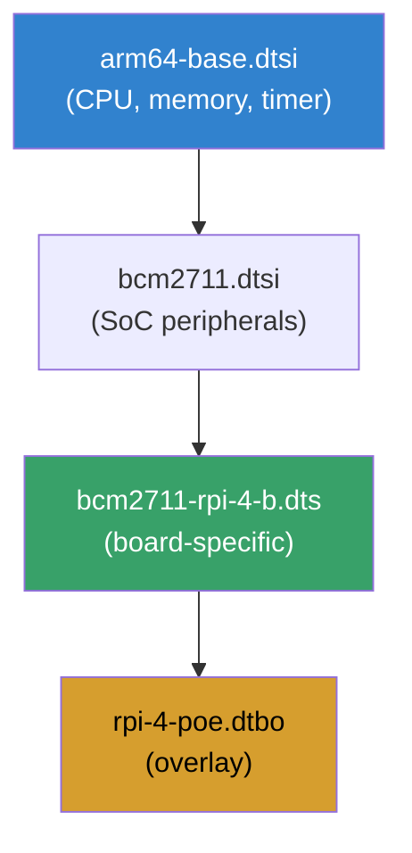
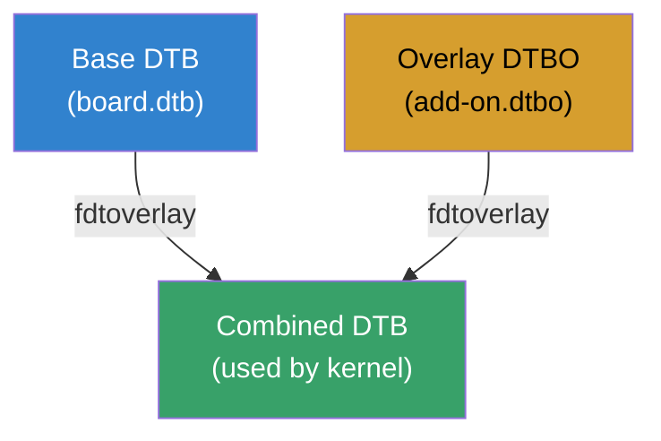
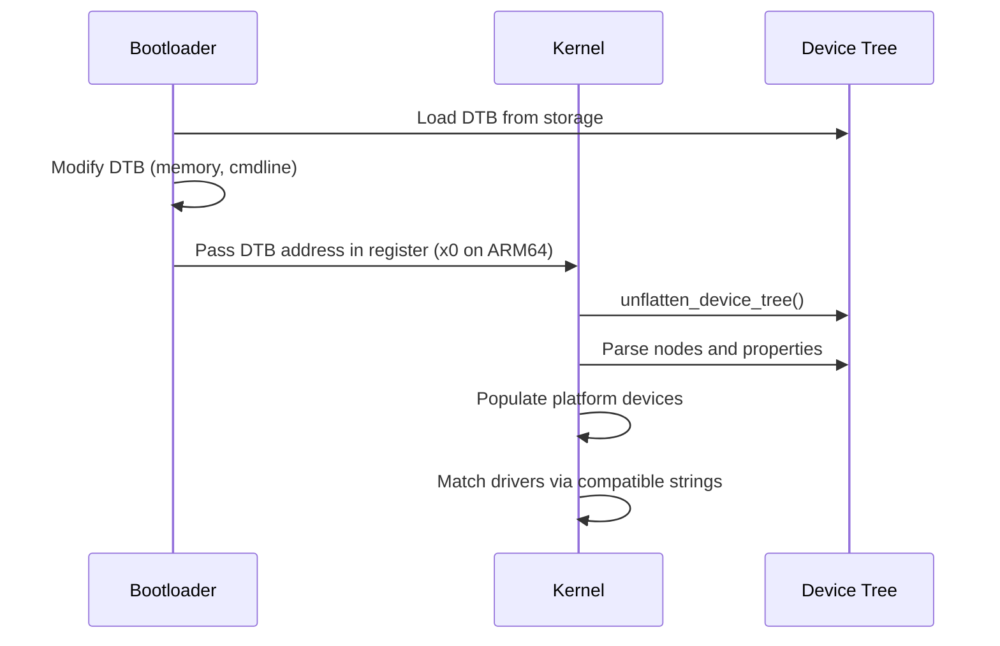
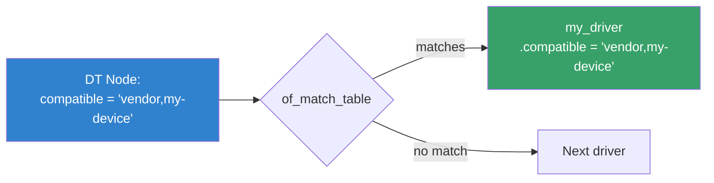

# Flattened Device Tree (FDT)

## Introduction

The Flattened Device Tree (FDT) is a binary data structure used by the Linux kernel to describe hardware components that cannot be dynamically discovered. Originally developed for PowerPC and widely adopted across ARM, ARM64, RISC-V, and other architectures, the FDT provides a standardized way to describe:

- **CPU topology** — cores, clusters, cache hierarchy
- **Memory layout** — RAM regions, reserved memory
- **Interrupt controllers** — GIC, IRQ routing
- **Bus topology** — I2C, SPI, PCI, USB controllers
- **Peripheral devices** — UART, GPIO, clocks, regulators
- **Memory-mapped I/O** — device register addresses

Key properties:
- **Architecture-neutral** — works on ARM, ARM64, x86, RISC-V, MIPS, etc.
- **Binary format** — compact, efficient for bootloader-to-kernel passing
- **Text source (.dts)** — human-readable, compiled to binary (.dtb)
- **Overlayable** — runtime modification via DT overlays
- **Stable ABI** — backward-compatible binding format

## Device Tree Terminology

| Term | Description |
|------|-------------|
| **DTS** | Device Tree Source — human-readable text format |
| **DTSI** | Device Tree Source Include — shared/base DTS files |
| **DTB** | Device Tree Blob — compiled binary format |
| **DTC** | Device Tree Compiler — converts DTS ↔ DTB |
| **FDT** | Flattened Device Tree — the binary blob in memory |
| **DTBO** | Device Tree Blob Overlay — runtime overlays |
| **Binding** | Documentation for a compatible device node |

## Device Tree Structure

### DTS Syntax

A device tree is a tree of **nodes** with **properties**:

```dts
/ {
    model = "Raspberry Pi 4 Model B";
    compatible = "brcm,bcm2711";
    #address-cells = <2>;
    #size-cells = <2>;

    cpus {
        #address-cells = <1>;
        #size-cells = <0>;

        cpu@0 {
            device_type = "cpu";
            compatible = "arm,cortex-a72";
            reg = <0>;
            enable-method = "psci";
        };

        cpu@1 {
            device_type = "cpu";
            compatible = "arm,cortex-a72";
            reg = <1>;
            enable-method = "psci";
        };
    };

    memory@0 {
        device_type = "memory";
        reg = <0x0 0x0 0x0 0x80000000>;  /* 2GB at address 0 */
    };

    soc {
        compatible = "simple-bus";
        #address-cells = <2>;
        #size-cells = <2>;
        ranges;

        uart@7e201000 {
            compatible = "brcm,bcm2835-pl011", "arm,pl011", "arm,primecell";
            reg = <0x7e201000 0x200>;
            interrupts = <2 25>;
            clocks = <&clocks BCM2835_CLOCK_UART>,
                     <&clocks BCM2835_CLOCK_VPU>;
            clock-names = "uartclk", "apb_pclk";
            status = "okay";
        };

        gpio@7e200000 {
            compatible = "brcm,bcm2835-gpio";
            reg = <0x7e200000 0xb4>;
            interrupts = <2 17>;
            gpio-controller;
            #gpio-cells = <2>;
            interrupt-controller;
            #interrupt-cells = <2>;
        };
    };
};
```

### Node Naming Convention

```
node-name@unit-address
```

- **node-name** — device type (lowercase, hyphens allowed)
- **unit-address** — first `reg` address (matches `reg` property)

Examples:
```
cpu@0          — CPU at MPIDR 0
memory@0       — Memory at address 0
uart@7e201000  — UART at MMIO 0x7e201000
i2c@7e804000   — I2C controller at MMIO 0x7e804000
```

### Essential Properties

| Property | Description |
|----------|-------------|
| `compatible` | Driver matching string (most important) |
| `reg` | Register addresses and sizes |
| `#address-cells` | Number of cells for child addresses |
| `#size-cells` | Number of cells for child sizes |
| `interrupts` | Interrupt specifiers |
| `status` | `"okay"` or `"disabled"` |
| `clocks` | Phandle to clock providers |
| `phandle` | Unique node identifier (auto-generated) |
| `ranges` | Address translation between bus and parent |

### Phandles and References

```dts
/* Define a clock provider */
clocks {
    clk24: clk24 {
        compatible = "fixed-clock";
        #clock-cells = <0>;
        clock-frequency = <24000000>;
    };
};

/* Reference it via phandle */
uart@7e201000 {
    clocks = <&clk24>;  /* &clk24 = phandle reference */
};
```

## Compiling Device Trees

### Using DTC (Device Tree Compiler)

```bash
# Install dtc
sudo apt install device-tree-compiler    # Debian/Ubuntu
sudo dnf install dtc                     # Fedora/RHEL
sudo pacman -S dtc                       # Arch Linux

# Compile DTS to DTB
dtc -I dts -O dtb -o output.dtb input.dts

# Decompile DTB to DTS
dtc -I dtb -O dts -o output.dts input.dtb

# Compile with includes (use -i for include paths)
dtc -I dts -O dtb -i /path/to/dts/include -o output.dtb input.dts

# Check DTB for errors
dtc -I dtb -O dtb -o /dev/null input.dtb

# Apply overlay
fdtoverlay -i base.dtbo -o combined.dtb overlay.dtbo
```

### Using the Kernel Build System

```bash
# Build all device trees for a platform
make dtbs

# Build specific DTB
make broadcom/bcm2711-rpi-4-b.dtb

# Build with custom DTS file
make ARCH=arm64 dtbs

# Install DTBs
make dtbs_install INSTALL_DTBS_PATH=/boot/dtbs/

# Clean
make dtbs_clean
```

### DTS Include Hierarchy



## fdtget and fdtput

### Reading DTB Values (fdtget)

```bash
# Get a property value
fdtget output.dtb / model
# "Raspberry Pi 4 Model B"

# Get compatible strings
fdtget output.dtb / compatible
# "brcm,bcm2711"

# Get register values (as integers)
fdtget -tx output.dtb /soc/uart@7e201000 reg
# 7e201000 200

# List subnodes
fdtget -l output.dtb /cpus
# cpu@0
# cpu@1
# cpu@2
# cpu@3

# Get all properties of a node
fdtget -p output.dtb /soc/uart@7e201000
# compatible
# reg
# interrupts
# clocks
# clock-names
# status

# Get interrupt values
fdtget -tx output.dtb /soc/gpio@7e200000 interrupts
# 2 17

# Get string array
fdtget -ts output.dtb /soc/uart@7e201000 clock-names
# uartclk
# apb_pclk
```

### Writing DTB Values (fdtput)

```bash
# Set a string property
fdtput -ts output.dtb /soc/uart@7e201000 status "disabled"

# Set integer values
fdtput -tx output.dtb /soc/uart@7e201000 reg 0x7e201000 0x200

# Add a new node
fdtput -c output.dtb /soc/new-device@7e300000

# Set properties on new node
fdtput -ts output.dtb /soc/new-device@7e300000 compatible "my-driver"
fdtput -tx output.dtb /soc/new-device@7e300000 reg 0x7e300000 0x100

# Delete a property
fdtput -d output.dtb /soc/uart@7e201000 status

# Delete a node
fdtput -R output.dtb /soc/new-device@7e300000
```

### Scripting with fdtget/fdtput

```bash
#!/bin/bash
# dtb-info.sh — Extract device tree information

DTB="$1"
if [ -z "$DTB" ]; then
    echo "Usage: $0 <dtb-file>"
    exit 1
fi

echo "=== Device Tree Info ==="
echo "Model: $(fdtget $DTB / model 2>/dev/null)"
echo "Compatible: $(fdtget $DTB / compatible 2>/dev/null)"

echo ""
echo "=== Memory ==="
fdtget -l $DTB /memory 2>/dev/null | while read node; do
    echo "  $node: $(fdtget -tx $DTB /memory/$node reg 2>/dev/null)"
done

echo ""
echo "=== CPUs ==="
fdtget -l $DTB /cpus 2>/dev/null | while read node; do
    COMPAT=$(fdtget $DTB /cpus/$node compatible 2>/dev/null)
    REG=$(fdtget $DTB /cpus/$node reg 2>/dev/null)
    echo "  $node: $COMPAT (reg=$REG)"
done

echo ""
echo "=== UARTs ==="
fdtget -l $DTB /soc 2>/dev/null | grep uart | while read node; do
    STATUS=$(fdtget $DTB /soc/$node status 2>/dev/null)
    echo "  $node: status=$STATUS"
done
```

## Device Tree Overlays

### What Are DT Overlays?

Overlays are small DTB fragments that modify the base device tree at runtime. They're used for:

- **Add-on boards** — HATs, capes, shields
- **Runtime configuration** — enabling/disabling peripherals
- **FPGA bitstreams** — loading custom hardware designs



### Overlay DTS Syntax

```dts
/* rpi-4-poe-overlay.dts */
/dts-v1/;
/plugin/;  /* Mark as overlay */

/* Add PoE HAT fan controller */
&i2c1 {
    #address-cells = <1>;
    #size-cells = <0>;

    fan: pwm-fan@2a {
        compatible = "raspberrypi,4b-poe-fan";
        reg = <0x2a>;
        cooling-min-state = <0>;
        cooling-max-state = <3>;
        #cooling-cells = <2>;
        cooling-map {
            map0 {
                trip = <&cpu_thermal>;
                cooling-device = <&fan 0 1>;
            };
            map1 {
                trip = <&cpu_thermal_hot>;
                cooling-device = <&fan 1 2>;
            };
        };
    };
};

/* Enable PWM for fan */
&pwm1 {
    status = "okay";
    pinctrl-names = "default";
    pinctrl-0 = <&pwm1_pins>;
};
```

### Applying Overlays

```bash
# Compile overlay
dtc -@ -I dts -O dtb -o overlay.dtbo overlay.dts

# Apply overlay to base DTB
fdtoverlay -i base.dtb -o combined.dtb overlay.dtbo

# Apply multiple overlays
fdtoverlay -i base.dtb -o combined.dtb overlay1.dtbo overlay2.dtbo

# Apply via config.txt (Raspberry Pi)
# /boot/config.txt
dtoverlay=i2c-rtc,ds3231
dtoverlay=gpio-fan,gpiopin=14,temp=55000

# Apply via U-Boot
# In U-Boot shell:
fdt apply <overlay_addr>

# Apply at runtime (if supported)
mkdir -p /sys/kernel/config/device-tree/overlays/my-overlay
echo overlay.dtbo > /sys/kernel/config/device-tree/overlays/my-overlay/path
```

## FDT in Memory

### How the Kernel Receives FDT



### FDT Binary Format

```
struct fdt_header {
    uint32_t magic;              /* 0xd00dfeed */
    uint32_t totalsize;          /* Total size of DTB */
    uint32_t off_dt_struct;      /* Offset to structure block */
    uint32_t off_dt_strings;     /* Offset to strings block */
    uint32_t off_mem_rsvmap;     /* Offset to memory reserve map */
    uint32_t version;            /* FDT version (17) */
    uint32_t last_comp_version;  /* Last compatible version */
    uint32_t boot_cpuid_phys;    /* Boot CPU physical ID */
    uint32_t size_dt_strings;    /* Size of strings block */
    uint32_t size_dt_struct;     /* Size of structure block */
};
```

### Inspecting DTB in Memory

```bash
# Check DTB magic at a memory address (e.g., via devmem)
devmem2 0x10000000 w
# Should read 0xd00dfeed

# Extract DTB from kernel image
# For ARM64:
scripts/dtc/dtc -I dtb -O dts -o extracted.dts /sys/firmware/fdt

# For U-Boot passed DTB:
dd if=/proc/device-tree bs=1 count=$(fdtget /sys/firmware/fdt / totalsize) of=extracted.dtb
```

## Linux Kernel Device Tree API

### Key Kernel Functions

```c
#include <linux/of.h>
#include <linux/of_device.h>
#include <linux/platform_device.h>

/* Find a node by path */
struct device_node *of_find_node_by_path(const char *path);

/* Find a node by compatible string */
struct device_node *of_find_compatible_node(struct device_node *from,
                                            const char *type,
                                            const char *compat);

/* Get a property value */
const void *of_get_property(const struct device_node *np,
                            const char *name, int *lenp);

/* Read integer properties */
int of_property_read_u32(const struct device_node *np,
                         const char *propname, u32 *out_value);

int of_property_read_u32_array(const struct device_node *np,
                               const char *propname,
                               u32 *out_values, size_t sz);

/* Read string properties */
int of_property_read_string(const struct device_node *np,
                            const char *propname,
                            const char **out_string);

/* Check if property exists */
bool of_property_read_bool(const struct device_node *np,
                           const char *propname);

/* Get phandle references */
struct device_node *of_parse_phandle(const struct device_node *np,
                                     const char *phandle_name, int index);

/* Get register addresses */
int of_address_to_resource(struct device_node *dev, int index,
                           struct resource *r);

/* Get interrupt number */
int of_irq_get(struct device_node *dev, int index);
```

### Driver Example Using OF API

```c
#include <linux/module.h>
#include <linux/platform_device.h>
#include <linux/of.h>
#include <linux/of_device.h>
#include <linux/io.h>

struct my_device {
    void __iomem *base;
    int irq;
    u32 clock_freq;
};

static int my_driver_probe(struct platform_device *pdev)
{
    struct my_device *priv;
    struct resource *res;
    struct device_node *np = pdev->dev.of_node;
    const char *name;

    priv = devm_kzalloc(&pdev->dev, sizeof(*priv), GFP_KERNEL);
    if (!priv)
        return -ENOMEM;

    /* Get register base from DT */
    res = platform_get_resource(pdev, IORESOURCE_MEM, 0);
    priv->base = devm_ioremap_resource(&pdev->dev, res);
    if (IS_ERR(priv->base))
        return PTR_ERR(priv->base);

    /* Get interrupt from DT */
    priv->irq = platform_get_irq(pdev, 0);
    if (priv->irq < 0)
        return priv->irq;

    /* Read properties */
    of_property_read_u32(np, "clock-frequency", &priv->clock_freq);
    of_property_read_string(np, "label", &name);

    dev_info(&pdev->dev, "Probed: base=%p irq=%d freq=%u name=%s\n",
             priv->base, priv->irq, priv->clock_freq,
             name ? name : "unnamed");

    platform_set_drvdata(pdev, priv);
    return 0;
}

static int my_driver_remove(struct platform_device *pdev)
{
    dev_info(&pdev->dev, "Removed\n");
    return 0;
}

static const struct of_device_id my_driver_match[] = {
    { .compatible = "vendor,my-device" },
    { /* sentinel */ }
};
MODULE_DEVICE_TABLE(of, my_driver_match);

static struct platform_driver my_driver = {
    .probe = my_driver_probe,
    .remove = my_driver_remove,
    .driver = {
        .name = "my-driver",
        .of_match_table = my_driver_match,
    },
};
module_platform_driver(my_driver);

MODULE_LICENSE("GPL");
MODULE_DESCRIPTION("Example OF driver");
```

### Matching Compatible Strings



## Device Tree Debugging

### /proc/device-tree

```bash
# Browse device tree from userspace
ls /proc/device-tree/

# Read properties
cat /proc/device-tree/model
# Raspberry Pi 4 Model B

# List subnodes
ls /proc/device-tree/cpus/

# Read binary properties as hex
xxd /proc/device-tree/cpus/cpu@0/reg

# Read string properties
cat /proc/device-tree/cpus/cpu@0/compatible
# arm,cortex-a72

# Check device status
cat /proc/device-tree/soc/uart@7e201000/status
# okay

# List all compatible strings
find /proc/device-tree -name compatible -exec cat {} \;
```

### DT Debug with dtc

```bash
# Check DTB for warnings
dtc -I dtb -O dtb -o /dev/null input.dtb 2>&1 | grep Warning

# Verbose decompile
dtc -I dtb -O dts -@ -o output.dts input.dtb

# Compare two DTBs
diff <(dtc -I dtb -O dts a.dtb) <(dtc -I dtb -O dts b.dtb)

# Extract DTB from kernel image
scripts/extract-dtb kernel.bin

# Merge DTB + overlays
fdtoverlay -i base.dtb -o merged.dtb overlay1.dtbo overlay2.dtbo
```

### Dynamic Debug

```bash
# Enable DT debug messages
echo 'module of +p' > /sys/kernel/debug/dynamic_debug/control
echo 'file drivers/of/*.c +p' > /sys/kernel/debug/dynamic_debug/control

# View DT-related kernel messages
dmesg | grep -i "of:\|dt:\|device.tree"

# Check OF graph (for multimedia devices)
ls /proc/device-tree/*/ports/
```

## Device Tree Best Practices

### Writing Good Bindings

```dts
/*
 * Best practices for DTS:
 *
 * 1. Use upstream compatible strings when available
 *    compatible = "vendor,device-v1", "vendor,device";
 *
 * 2. Add vendor prefix to compatible strings
 *    "ti,am335x-gpio" (not "gpio-am335x")
 *
 * 3. Describe only what the hardware provides
 *    Don't add Linux-specific config in DT
 *
 * 4. Use status = "okay" / "disabled"
 *    Don't use status = "ok" or "enable"
 *
 * 5. Include common dtsi files for SoC definitions
 *    #include "bcm2711.dtsi"
 *
 * 6. Document all custom properties
 */
```

### Vendor Prefixes

```bash
# List registered vendor prefixes
cat Documentation/devicetree/bindings/vendor-prefixes.yaml

# Common prefixes:
# arm,     — ARM Ltd.
# brcm,    — Broadcom
# ti,      — Texas Instruments
# samsung, — Samsung
# nvidia,  — NVIDIA
# qcom,    — Qualcomm
# mediatek,— MediaTek
# intel,   — Intel
```

## FDT Tools Reference

| Tool | Description |
|------|-------------|
| `dtc` | Device Tree Compiler — compile/decompile DTS/DTB |
| `fdtget` | Read properties from DTB |
| `fdtput` | Write properties to DTB |
| `fdtoverlay` | Apply overlays to DTB |
| `fdtdump` | Dump raw DTB contents |
| `fdtgrep` | Search/filter DTB contents |
| `convert-dtsv0` | Convert v0 DTS to v1 format |

### Install All Tools

```bash
# Debian/Ubuntu
sudo apt install device-tree-compiler u-boot-tools

# Fedora
sudo dnf install dtc uboot-tools

# Arch Linux
sudo pacman -S dtc uboot-tools

# From kernel source
cd /path/to/linux
make scripts
# tools installed in scripts/dtc/
```

## Further Reading

- [Device Tree Specification](https://www.devicetree.org/specifications/)
- [Linux Device Tree Documentation](https://www.kernel.org/doc/html/latest/devicetree/)
- [Device Tree Usage](https://elinux.org/Device_Tree_Usage)
- [Device Tree Bindings](https://www.kernel.org/doc/html/latest/devicetree/bindings/)
- [LWN: Device Tree](https://lwn.net/Articles/462355/)
- [Device Tree Reference](https://elinux.org/Device_Tree_Reference)

## See Also

- [Device Tree](./device-tree.md) — DT architecture overview
- [Platform Drivers](./platform-drivers.md) — platform device drivers
- [ACPI](./acpi.md) — x86 hardware description alternative
- [U-Boot](../embedded/uboot.md) — bootloader DT support
- [ARM](../embedded/arm.md) — ARM platform specifics
- [GPIO](./gpio.md) — GPIO DT bindings
