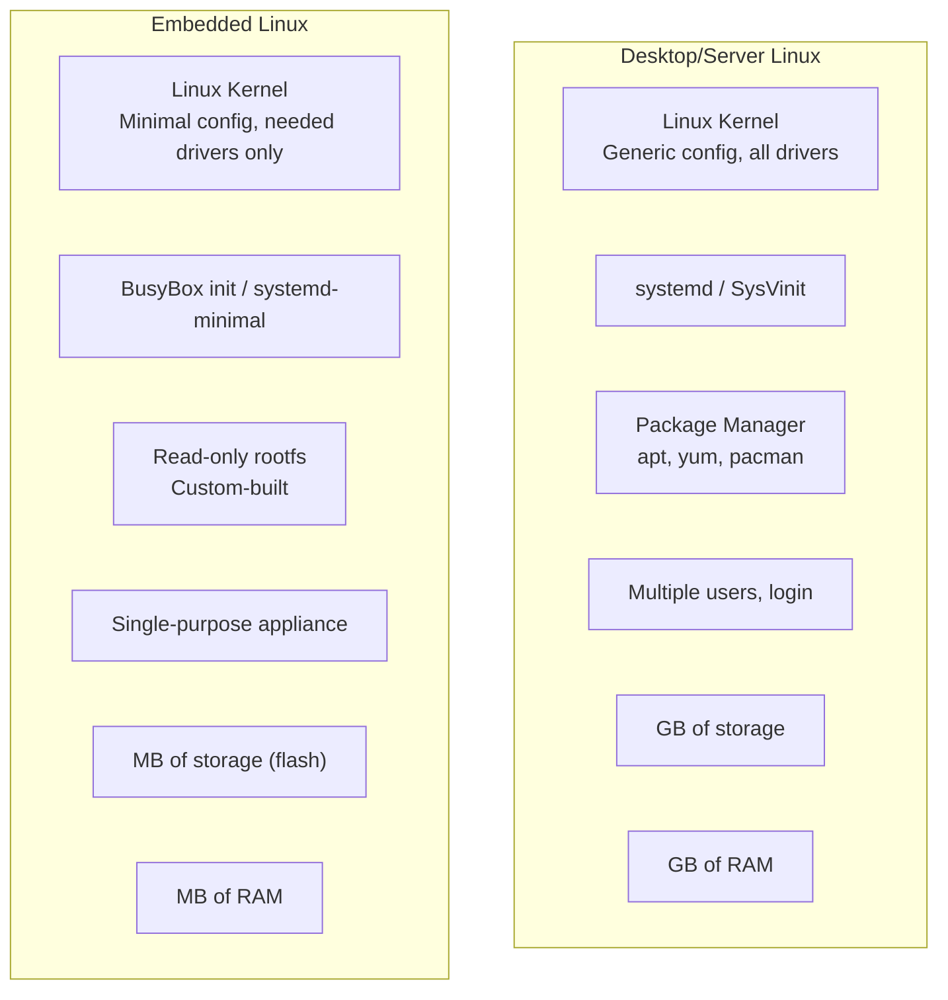
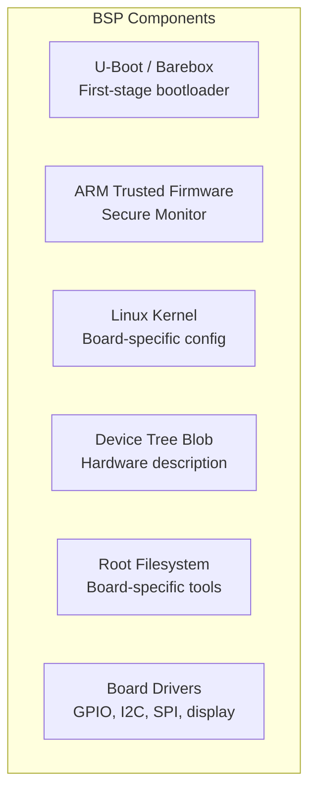
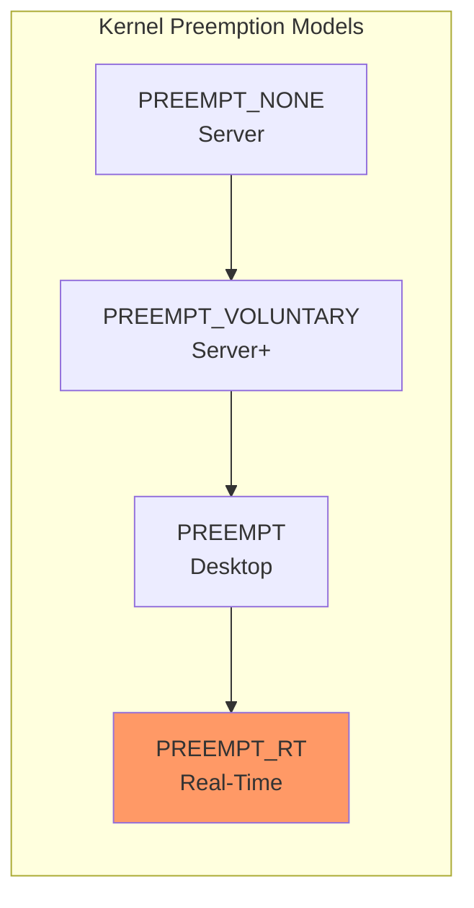
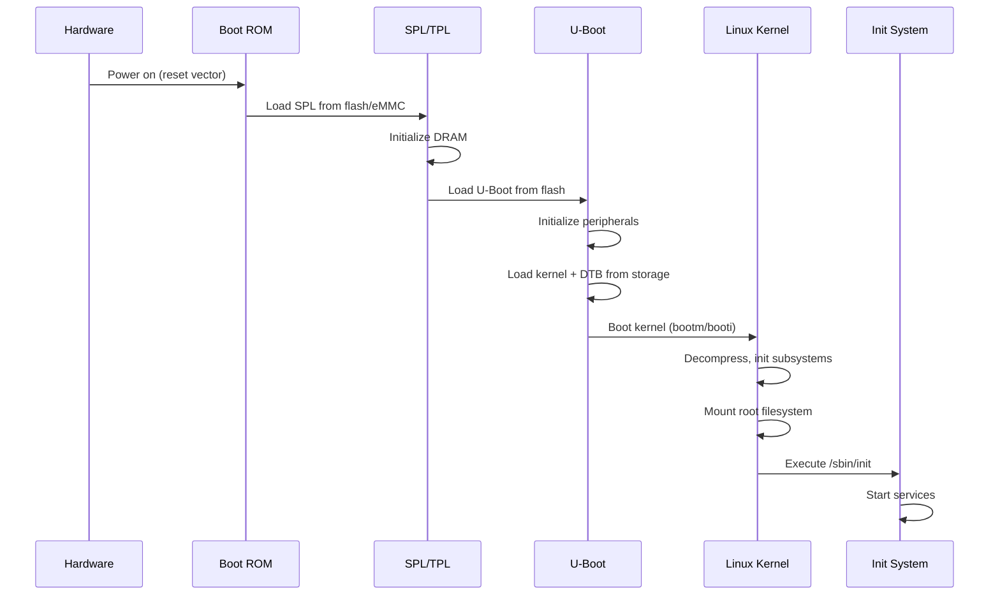
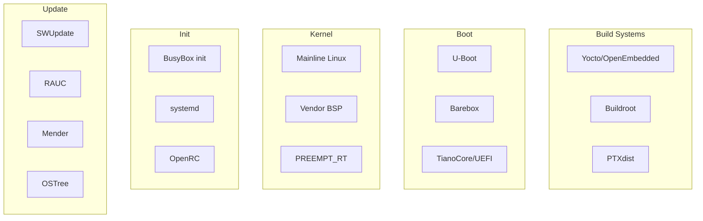
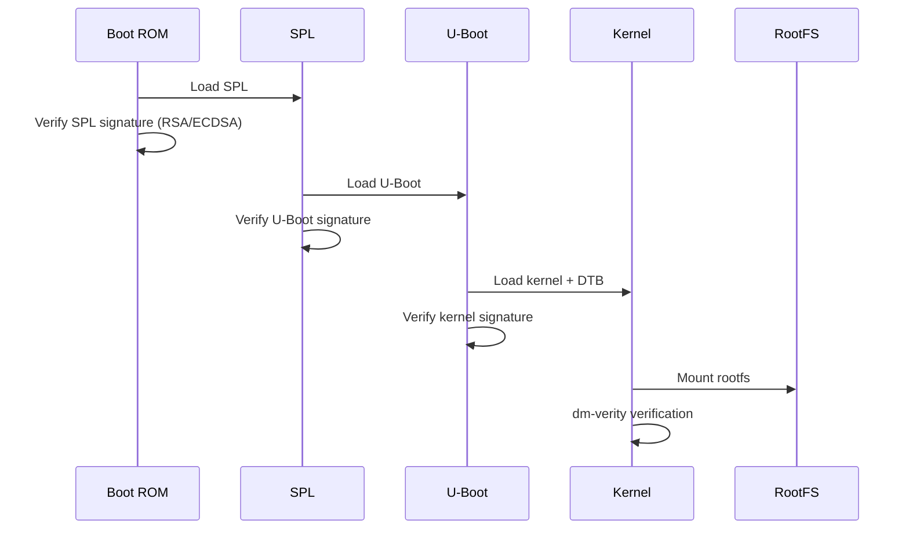
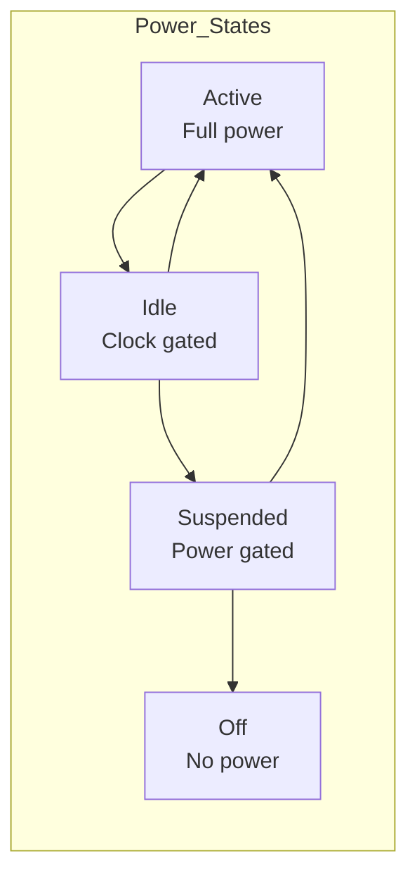
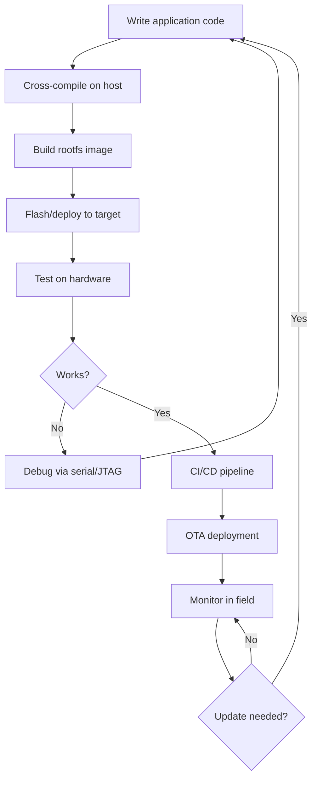

# Embedded Linux Overview

## Introduction

Embedded Linux is the use of the Linux kernel in embedded systems — devices that are not general-purpose computers but dedicated electronic systems with specific functions. From routers and smart TVs to automotive infotainment systems and industrial controllers, Embedded Linux powers billions of devices worldwide.

Building an Embedded Linux system requires understanding hardware constraints, cross-compilation, bootloaders, device trees, real-time considerations, and deployment strategies. This chapter provides an overview of the Embedded Linux landscape and introduces the key topics covered in subsequent chapters.

## Embedded vs Desktop/Server Linux



| Aspect | Desktop/Server | Embedded |
|--------|---------------|----------|
| CPU | x86_64, powerful | ARM, MIPS, RISC-V, limited |
| RAM | 8-512 GB | 16 MB – 2 GB |
| Storage | SSD/HDD, 100s GB | eMMC, NAND, 4-32 MB |
| Boot time | Seconds-minutes acceptable | Often < 1 second required |
| Updates | Package manager | OTA, firmware images |
| Users | Multi-user | Single-purpose, headless or limited UI |
| Power | Always plugged in | Battery or constrained |
| Real-time | Not required | Often required |

## Constraints and Challenges

### Memory Constraints

```bash
# Typical embedded memory budgets:
# Kernel: 2-8 MB (compressed)
# Root filesystem: 4-64 MB
# Available RAM: 32-512 MB

# Minimizing kernel size
make tinyconfig          # Start with minimal config
# Only enable needed features
scripts/diffconfig .config.old .config  # Compare configs

# Static vs dynamic linking
# Static: larger binary, no shared libs needed
# Dynamic: smaller total, but needs libc.so etc.

# Minimal C library options:
# musl libc: ~600KB static, clean, modern
# uClibc-ng: ~300KB static, embedded-focused
# glibc: ~2MB static, full-featured (most desktop distros)
# Bionic: Android's C library
```

### Storage Constraints

```bash
# Flash storage types:
# NOR flash: Execute in place (XIP), slow writes, expensive
# NAND flash: Higher density, faster writes, needs FTL
# eMMC: NAND + controller, block device interface
# SD card: Removable eMMC
# SPI NOR: Small boot firmware storage

# Filesystem choices:
# SquashFS: Read-only, compressed (root filesystem)
# JFFS2: Read-write, wear-leveling, for raw NAND
# UBIFS: Read-write, for raw NAND (better than JFFS2)
# F2FS: Flash-friendly, for eMMC/SD
# ext4: For eMMC/SD (standard Linux)
# tmpfs: RAM-based, for runtime data

# Typical partition layout:
# [Bootloader] [Kernel] [RootFS (SquashFS)] [Data (ext4/UBIFS)]
```

### Power Constraints

```bash
# Linux power management for embedded:
# CPU frequency scaling
echo powersave > /sys/devices/system/cpu/cpu0/cpufreq/scaling_governor

# CPU idle states
cat /sys/devices/system/cpu/cpu0/cpuidle/state0/name
# C1 (shallow sleep)
cat /sys/devices/system/cpu/cpu0/cpuidle/state1/name
# C2 (deeper sleep)

# Suspend to RAM
echo mem > /sys/power/state

# Runtime PM for peripherals
echo auto > /sys/bus/i2c/devices/0-0068/power/control
```

## BSP (Board Support Package)

A BSP is the collection of software that enables Linux to run on a specific hardware board:



### BSP Contents

```bash
# Typical BSP structure
bsp-board/
├── boot/
│   ├── u-boot.bin           # Bootloader binary
│   ├── u-boot.env           # Default environment
│   ├── arm-trusted-firmware/ # ATF/OP-TEE for ARM
│   └── flash.bin             # Combined boot image
├── kernel/
│   ├── Image                 # Kernel binary
│   ├── zImage                # Compressed kernel (ARM)
│   ├── board.dtb             # Device tree blob
│   └── modules/              # Kernel modules
├── rootfs/
│   ├── rootfs.squashfs       # Read-only root filesystem
│   └── rootfs.tar.gz         # For development
├── tools/
│   ├── flash-tool            # Board programming utility
│   └── serial-config         # Serial console settings
└── documentation/
    ├── hardware-manual.pdf
    └── getting-started.md
```

### Vendor BSP vs Mainline

```bash
# Vendor BSP (from chip manufacturer):
# Pros: All hardware works, tested, supported
# Cons: Old kernel, proprietary patches, maintenance burden
# Example: TI Processor SDK, NXP Yocto BSP, Rockchip SDK

# Mainline Linux:
# Pros: Latest features, security updates, community support
# Cons: Some hardware features may not be supported yet
# Example: Mainline kernel + upstream device trees

# Check if your SoC is in mainline
git log --oneline arch/arm64/boot/dts/vendor/ | head
# Look for your SoC device tree
```

## Build Systems

### Yocto Project / OpenEmbedded

```bash
# Yocto is the industry-standard Embedded Linux build system
# Generates complete root filesystem, kernel, bootloader, SDK

# Initialize Yocto environment
source oe-init-build-env build/

# Configure for target machine (e.g., BeagleBone Black)
# conf/local.conf:
# MACHINE = "beaglebone-yocto"
# DISTRO = "poky"

# Build the image
bitbake core-image-minimal
# Output: tmp/deploy/images/beaglebone-yocto/
#   MLO                    # First-stage bootloader
#   u-boot.img             # U-Boot
#   zImage                 # Kernel
#   am335x-boneblack.dtb   # Device tree
#   core-image-minimal-beaglebone-yocto.wic  # Disk image

# Build SDK for cross-compilation
bitbake core-image-minimal -c populate_sdk
# Output: poky-glibc-x86_64-core-image-minimal-cortexa8hf-neon-toolchain-4.0.5.sh
```

### Buildroot

```bash
# Buildroot is a simpler alternative to Yocto
# Good for smaller projects, easier learning curve

# Configure for a board
make raspberrypi4_64_defconfig
make menuconfig  # Customize options

# Build everything
make
# Output: output/images/
#   Image                # Kernel
#   bcm2711-rpi-4-b.dtb  # Device tree
#   rootfs.squashfs      # Root filesystem
#   sdcard.img           # Complete SD card image

# Cross-compile a package
make busybox-rebuild

# Generate SDK
make sdk
# Output: output/images/aarch64-buildroot-linux-gnu_sdk-buildroot.tar.gz
```

### Comparison

| Feature | Yocto | Buildroot | Custom |
|---------|-------|-----------|--------|
| Complexity | High | Medium | Variable |
| Package management | Full (opkg/rpm/deb) | None (all built-in) | Manual |
| Reproducibility | Excellent | Good | Depends |
| Layer system | ✅ | ❌ | N/A |
| SDK generation | ✅ | ✅ | Manual |
| Community | Large | Large | N/A |
| Best for | Production, complex | Simple to medium | Learning, custom |

## Real-Time Linux

Many embedded systems require deterministic, low-latency response:

```bash
# Real-time approaches:
# 1. PREEMPT_RT patches — Linux with full preemption
# 2. Dual kernel (Xenomai) — RTOS kernel alongside Linux
# 3. RTAI — Real-Time Application Interface

# Check preemption model
uname -v
# #1 SMP PREEMPT_RT Debian 6.1.0-9

# Preemption models:
# PREEMPT_NONE — No preemption (server default)
# PREEMPT_VOLUNTARY — Explicit preemption points
# PREEMPT — Preemptible kernel (desktop)
# PREEMPT_RT — Fully preemptible with RT mutexes

# Configure kernel for PREEMPT_RT
# Kernel hacking → Preemption Model → Fully Preemptible Kernel (RT)
# Enable CONFIG_PREEMPT_RT

# RT priority for a process
chrt -f 99 my_rt_application
# SCHED_FIFO, priority 99 (highest RT priority)

# Measure scheduling latency
cyclictest -t 1 -p 80 -i 1000 -l 10000
# Typical results:
# PREEMPT_NONE: max latency ~100-1000 µs
# PREEMPT_RT: max latency ~10-50 µs
```



## Cross-Compilation

Cross-compilation is building code on one architecture (e.g., x86_64) to run on another (e.g., ARM):

```bash
# Cross-compilation toolchain
# aarch64-linux-gnu-gcc — ARM64 cross compiler
# arm-linux-gnueabihf-gcc — ARM32 hard-float cross compiler
# riscv64-linux-gnu-gcc — RISC-V 64-bit cross compiler

# Install toolchains (Debian/Ubuntu)
apt install gcc-aarch64-linux-gnu gcc-arm-linux-gnueabihf

# Cross-compile a simple program
aarch64-linux-gnu-gcc -o hello hello.c
file hello
# hello: ELF 64-bit LSB executable, ARM aarch64...

# Run with QEMU user-mode emulation
qemu-aarch64 -L /usr/aarch64-linux-gnu/ ./hello
```

See [Cross-Compilation](./cross-compilation.md) for detailed coverage.

## Device Tree

The device tree describes hardware to the kernel:

```dts
/* Simplified device tree for an ARM board */
/dts-v1/;
/ {
    model = "My Embedded Board";
    compatible = "vendor,my-board";
    
    cpus {
        #address-cells = <1>;
        cpu@0 {
            device_type = "cpu";
            compatible = "arm,cortex-a53";
            reg = <0>;
            clocks = <&clk_cpu>;
        };
    };
    
    memory@80000000 {
        device_type = "memory";
        reg = <0x80000000 0x40000000>; /* 1GB at 0x80000000 */
    };
    
    uart@9000000 {
        compatible = "ns16550a";
        reg = <0x09000000 0x1000>;
        interrupts = <0 33 4>;
        clocks = <&clk_uart>;
        status = "okay";
    };
};
```

See [Device Tree](./device-tree.md) for comprehensive coverage.

## Boot Flow



## Deployment

```bash
# Deployment methods:

# 1. SD card image
dd if=sdcard.img of=/dev/sdX bs=4M status=progress

# 2. Network boot (TFTP/NFS)
# U-Boot loads kernel via TFTP, mounts rootfs via NFS
# Good for development

# 3. NAND/eMMC flashing
# Using U-Boot or vendor flash tool
tftp 0x80000000 rootfs.squashfs
nand write 0x80000000 rootfs ${filesize}

# 4. OTA (Over-The-Air) update
# SWUpdate, RAUC, Mender, OSTree
swupdate -i update.swu -v
```

## Embedded Linux Ecosystem



## Security Hardening

Embedded devices often run unattended in physically accessible locations, making security critical:

### Verified Boot Chain



### dm-verity: Read-Only Rootfs Integrity

dm-verity provides block-level integrity verification for read-only partitions using a Merkle tree of hashes:

```bash
# Build verity metadata during image creation
veritysetup format rootfs.img rootfs.hash
# Output: Root hash: 4a5b6c7d8e9f...

# U-Boot passes root hash to kernel
setenv bootargs root=/dev/mmcblk0p2 rootfstype=squashfs \
    ro dm-mod.create="verity,,,ro,0 $(blockdev --getsz /dev/mmcblk0p2) \
    verity 1 /dev/mmcblk0p2 /dev/mmcblk0p3 4096 4096 \
    $(blockdev --getsz /dev/mmcblk0p2) 1 sha256 \
    4a5b6c7d8e9f... 0"
```

### SELinux / AppArmor for Embedded

```bash
# Minimal SELinux policy for embedded device (Yocto)
# In local.conf:
# DISTRO_FEATURES_append = " selinux"
# PREFERRED_PROVIDER_virtual/refpolicy = "refpolicy-minimal"

# AppArmor profile for a single-purpose device
# /etc/apparmor.d/mydevice
profile mydevice /usr/bin/myapp {
    /dev/i2c-0 rw,
    /dev/spidev0.0 rw,
    /var/log/myapp/** w,
    network inet stream,
    deny /home/** rwx,
}
```

### Read-Only Root Filesystem

```bash
# Mount rootfs read-only with tmpfs for writable areas
# In /etc/fstab:
# /dev/mmcblk0p2  /       squashfs  ro,noatime           0  1
# tmpfs           /var    tmpfs     defaults,size=64M    0  0
# tmpfs           /tmp    tmpfs     defaults,size=32M    0  0
# /dev/mmcblk0p3  /data   ext4      defaults,noatime     0  2

# Overlay filesystem for mutable state
mount -t overlay overlay -o lowerdir=/,upperdir=/data/upper,workdir=/data/work /merged
```

### Secure Storage

```bash
# Use hardware crypto engine if available
# OP-TEE for ARM TrustZone
# /dev/tee0 — Trusted Execution Environment

# Encrypted data partition with LUKS
cryptsetup luksFormat /dev/mmcblk0p3
cryptsetup luksOpen /dev/mmcblk0p3 data
mkfs.ext4 /dev/mapper/data

# Use TPM or secure element for key storage
# tpm2_createprimary -C o -c primary.ctx
tpm2_create -g sha256 -u key.pub -r key.priv -c primary.ctx
```

## Containerization in Embedded Linux

Containers are increasingly used in embedded for application isolation and OTA updates:

### Lightweight Container Runtimes

```bash
# Container runtimes for embedded:
# - containerd (Docker's runtime)
# - CRI-O
# - crun (lightweight, C-based, faster than runc)
# - lxc (OS-level containers)

# Minimal Docker setup on Yocto
# In local.conf:
# IMAGE_INSTALL:append = " docker"
# DISTRO_FEATURES:append = " virtualization"

# Run a container with device access
docker run --rm -it --device /dev/i2c-0 myapp:latest
```

### Balena / Torizon

```bash
# Balena: container-based IoT platform
# - Delta updates (only changed layers)
# - Fleet management
# - Base images optimized for ARM

# Torizon (Toradex): containers for embedded
# - Debian-based containers
# - OTA update integration
# - IDE integration (VS Code)
```

## Debugging Embedded Systems

### JTAG / SWD Debugging

```bash
# OpenOCD for JTAG debugging
openocd -f interface/stlink.cfg -f target/stm32f4x.cfg
# Connect with GDB
gdb-multiarch build/firmware.elf
(gdb) target remote :3333
(gdb) load
(gdb) break main
(gdb) continue

# Segger J-Link (commercial, faster)
JLinkGDBServer -device STM32F407VG -if SWD -speed 4000
```

### Serial Console Debugging

```bash
# minicom
minicom -D /dev/ttyUSB0 -b 115200

# screen
screen /dev/ttyUSB0 115200

# picocom (lightweight)
picocom -b 115200 /dev/ttyUSB0

# Kernel early printk
# CONFIG_EARLYPRINTK=y
# CONFIG_EARLYPRINTK_DBGP=y
# bootargs: earlyprintk=serial,ttyS0,115200
```

### Kernel Debugging on Embedded

```bash
# KGDB over serial
# CONFIG_KGDB=y
# CONFIG_KGDB_SERIAL_CONSOLE=y

# On target:
echo ttyS0,115200 > /sys/module/kgdboc/parameters/kgdboc
echo g > /proc/sysrq-trigger  # Enter KGDB

# On host:
gdb vmlinux
(gdb) target remote /dev/ttyUSB0
(gdb) continue

# ftrace for embedded debugging
echo function_graph > /sys/kernel/tracing/current_tracer
echo 1 > /sys/kernel/tracing/tracing_on
cat /sys/kernel/tracing/trace_pipe
```

## Power Profiling

```bash
# Measure power consumption with tools:

# INA219/INA260 power monitors (I2C)
i2cget -y 1 0x40 0x02 w  # Read current register

# PowerTOP for x86 embedded
powertop --auto-tune

# CPU frequency + voltage scaling
cat /sys/devices/system/cpu/cpu0/cpufreq/scaling_cur_freq
cat /sys/devices/system/cpu/cpu0/cpufreq/scaling_available_governors
# conservative ondemand userspace powersave performance schedutil

# Runtime PM statistics
cat /sys/bus/i2c/devices/0-0068/power/runtime_status
# active / suspended / suspending
```



## Networking in Embedded

### Lightweight Network Stacks

```bash
# For MCU-class devices (< 1MB RAM):
# - lwIP (lightweight IP)
# - Zephyr networking
# - Mbed TLS + network

# For MPU-class Linux devices:
# - connman (connection manager)
# - NetworkManager (heavier, more features)
# - systemd-networkd (minimal)

# connman for embedded
connmanctl enable wifi
connmanctl scan wifi
connmanctl services
connmanctl connect wifi_..._managed_psk
```

### MQTT / IoT Protocols

```bash
# Lightweight protocols for IoT:
# - MQTT (Mosquitto): publish/subscribe
# - CoAP: RESTful for constrained devices
# - LwM2M: device management protocol

# Mosquitto MQTT client
mosquitto_sub -h broker.example.com -t sensors/temperature
mosquitto_pub -h broker.example.com -t sensors/temperature -m "23.5"
```

## Embedded Linux Development Workflow



## Embedded Linux Size Optimization

```bash
# Kernel size reduction strategies:

# 1. Start with tinyconfig
make tinyconfig

# 2. Add only needed features
make menuconfig
# Disable: sound, wireless, USB (if not needed)
# Disable: debug info, profiling
# Enable: CC_OPTIMIZE_FOR_SIZE

# 3. Compress kernel
# CONFIG_KERNEL_GZIP=y (default)
# CONFIG_KERNEL_LZ4=y (faster decompression)
# CONFIG_KERNEL_LZO=y (fastest decompression)

# 4. Strip kernel modules
make INSTALL_MOD_STRIP=1 modules_install

# Rootfs size reduction:
# - Use musl instead of glibc (~600KB vs ~2MB)
# - BusyBox instead of coreutils (~2MB vs ~50MB)
# - Remove man pages, locales, docs
# - Use SquashFS compression

# Measure sizes
ls -lh arch/arm64/boot/Image
ls -lh rootfs.squashfs
du -sh rootfs/
```

## References

1. Yaghmour, K. (2008). *Building Embedded Linux Systems*. O'Reilly Media.
2. Simmonds, C., & Bagnall, B. (2021). *Mastering Embedded Linux Programming*. Packt Publishing.
3. Yocto Project Documentation. [https://docs.yoctoproject.org/](https://docs.yoctoproject.org/)
4. Buildroot Manual. [https://buildroot.org/downloads/manual/manual.html](https://buildroot.org/downloads/manual/manual.html)
5. Opdenacker, M. (2023). *Embedded Linux Security*. Bootlin. [https://bootlin.com/docs/](https://bootlin.com/docs/)
6. dm-verity Documentation. [https://docs.kernel.org/admin-guide/device-mapper/verity.html](https://docs.kernel.org/admin-guide/device-mapper/verity.html)

## Further Reading

- [The Linux Kernel Documentation](https://docs.kernel.org/)
- [LWN.net - Linux and free software news](https://lwn.net/)
- [GNU Project Documentation](https://www.gnu.org/doc/doc.html)
- [GNU Manuals](https://www.gnu.org/manual/manual.html)
- [Free Software Directory](https://directory.fsf.org/wiki/Main_Page)
- [Planet GNU](https://planet.gnu.org/)
- [Free Software Books](https://www.gnu.org/doc/other-free-books.html)

- [Yocto Project Documentation](https://docs.yoctoproject.org/)
- [Buildroot Manual](https://buildroot.org/downloads/manual/manual.html)
- [Embedded Linux Wiki](https://elinux.org/)
- [Bootlin Training Materials](https://bootlin.com/docs/)
- [The Linux Kernel Documentation](https://www.kernel.org/doc/html/latest/)

## Related Topics

- [Cross-Compilation](./cross-compilation.md) — toolchains and building for target
- [U-Boot](./uboot.md) — bootloader for embedded Linux
- [Device Tree](./device-tree.md) — hardware description
- [ARM Architecture](./arm.md) — ARM-specific details
- [Virtualization Overview](../virtualization/overview.md) — VMs on embedded
