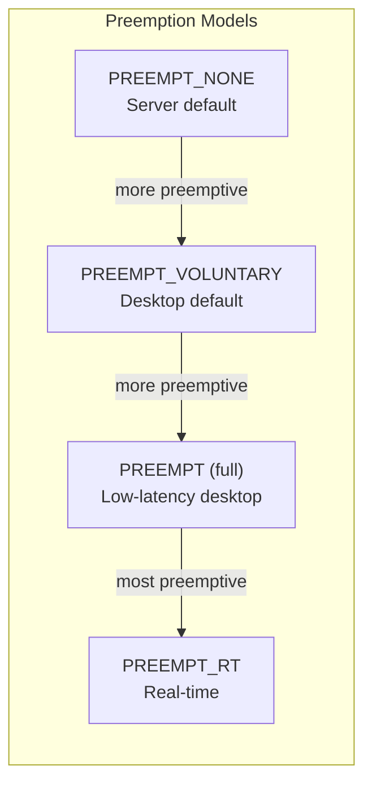
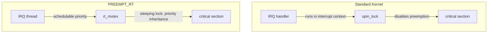
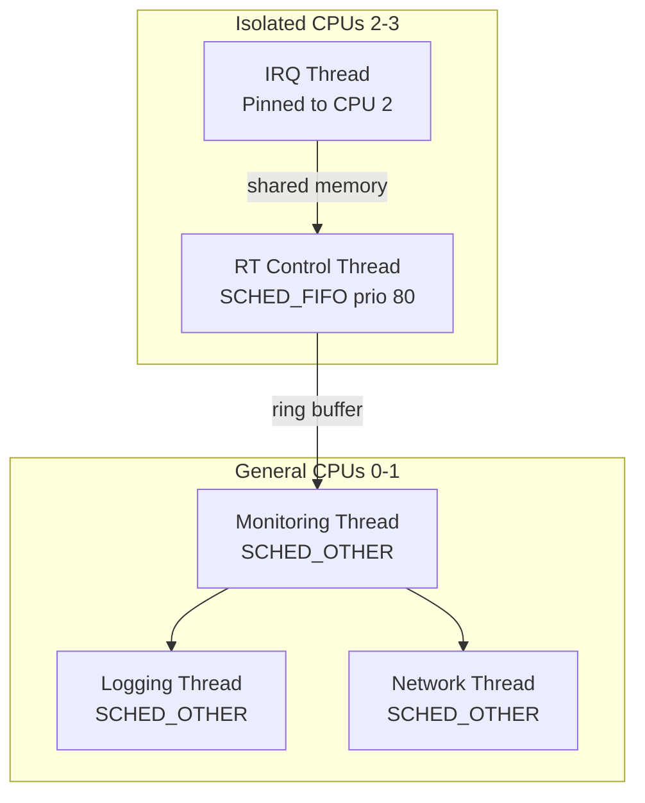
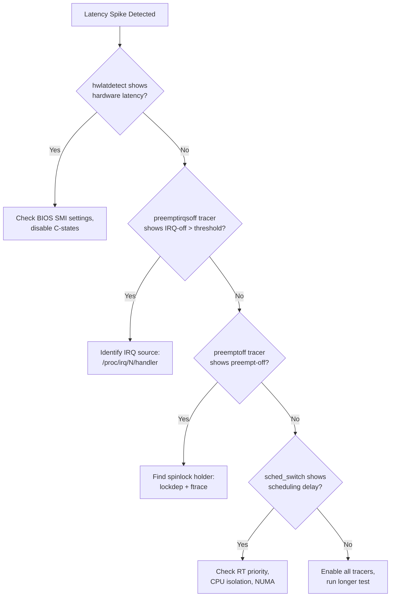
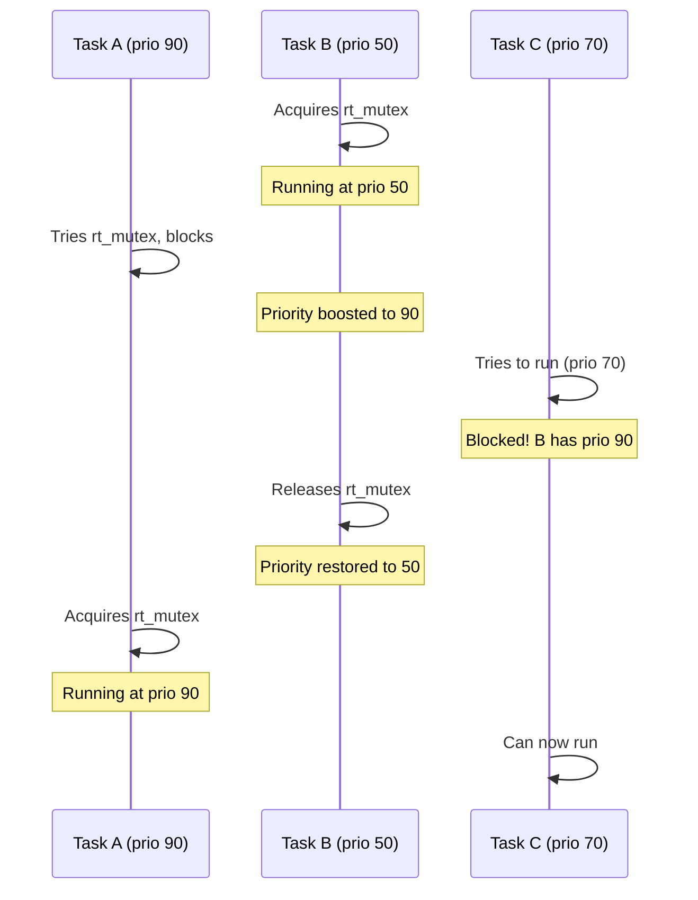

# Real-Time Linux

Real-time (RT) computing demands deterministic, bounded response times. This
chapter covers the PREEMPT_RT patch, RT scheduling classes, latency tuning
techniques, cyclictest benchmarking, and the journey of real-time Linux from
out-of-tree patch toward mainline inclusion.

---

## 1. What Is Real-Time?

A real-time system must meet **timing deadlines**, not just be "fast." The
metric that matters is **worst-case latency** — the maximum time between an
event and the system's response.

| Type | Deadline Miss Consequence | Example |
|------|---------------------------|---------|
| Hard RT | Catastrophic failure | Aircraft flight control |
| Firm RT | Useless result, no harm | Video frame decoding |
| Soft RT | Degraded quality | Audio playback, robotics |

**Important:** Real-time ≠ fast. A system that responds in 10 μs 99.99% of
the time but occasionally takes 100 ms is *not* real-time. A system that
*always* responds within 1 ms *is*.

---

## 2. Standard Linux vs PREEMPT_RT

### 2.1 Preemption Models

Linux offers several preemption levels, configurable at compile time:



| Model | Preemptible | Typical Latency | Use Case |
|-------|-------------|-----------------|----------|
| `PREEMPT_NONE` | Only at userspace/kernel boundary | 1–10 ms | Servers |
| `PREEMPT_VOLUNTARY` | + explicit preemption points | 0.5–5 ms | Desktops |
| `PREEMPT` | + most kernel code | 0.1–1 ms | Audio workstations |
| `PREEMPT_RT` | + IRQ threads, spinlocks → mutexes | 10–100 μs | Industrial, robotics |

### 2.2 What PREEMPT_RT Changes

The RT patch makes several fundamental changes to the kernel:

1. **Spinlocks → Sleeping locks** — Most `spinlock_t` become `rt_mutex`,
   allowing preemption in critical sections
2. **IRQ threading** — All interrupt handlers run in kernel threads with
   schedulable priorities
3. **Priority inheritance** — Prevents priority inversion on RT mutexes
4. **Deterministic timing** — `hrtimers` with nanosecond precision



---

## 3. RT Scheduling Classes

Linux has three scheduling classes relevant to real-time:

### 3.1 SCHED_FIFO

First-in, first-out. A RT task runs until it yields or a higher-priority task
becomes runnable.

```c
#include <sched.h>

struct sched_param param;
param.sched_priority = 80;  /* 1–99, higher = higher priority */
sched_setscheduler(0, SCHED_FIFO, &param);
```

### 3.2 SCHED_RR

Round-robin among same-priority tasks. Time quantum is configurable:

```bash
# Set RR time quantum for priority 80
chrt -r -p 80 <pid>

# Check scheduling policy
chrt -p <pid>
```

### 3.3 SCHED_DEADLINE (Linux 3.14+)

Admission-controlled Earliest Deadline First (EDF) scheduling:

```c
#include <sched.h>

struct sched_attr attr = {
    .size = sizeof(attr),
    .sched_policy = SCHED_DEADLINE,
    .sched_runtime = 2000000,    /* 2 ms in nanoseconds */
    .sched_deadline = 5000000,   /* 5 ms */
    .sched_period = 5000000,     /* 5 ms */
};
sched_setattr(0, &attr, 0);
```

The kernel guarantees the task meets its deadline if admission control passes:

```bash
# Check admission
dmesg | grep "deadline"
```

### 3.4 Priority Mapping

```
Priority 99  ─── Highest RT (SCHED_FIFO/SCHED_RR)
Priority 50  ─── Mid-range RT
Priority 1   ─── Lowest RT
Priority 0   ─── SCHED_NORMAL (CFS)
```

**Warning:** Never run RT tasks at priority 99 — the kernel watchdog and
migration threads use this priority. Use 1–98 for application RT tasks.

---

## 4. Building a PREEMPT_RT Kernel

### 4.1 Obtain the Patch

```bash
# Check available versions
# https://cdn.kernel.org/pub/linux/kernel/projects/rt/

KERNEL_VERSION=6.6
RT_PATCH=6.6-rt18

wget https://cdn.kernel.org/pub/linux/kernel/projects/rt/6.6/patch-${RT_PATCH}.patch.xz
```

### 4.2 Apply and Build

```bash
# Download kernel source
wget https://cdn.kernel.org/pub/linux/kernel/v6.x/linux-${KERNEL_VERSION}.tar.xz
tar xf linux-${KERNEL_VERSION}.tar.xz
cd linux-${KERNEL_VERSION}

# Apply RT patch
xzcat ../patch-${RT_PATCH}.patch.xz | patch -p1

# Configure
make menuconfig
# → General setup → Preemption Model (Fully Preemptible Kernel (Real-Time))
# → Processor type and features → Timer frequency (1000 Hz)

# Build
make -j$(nproc)
sudo make modules_install
sudo make install
```

### 4.3 Verify RT Kernel

```bash
uname -v
# Should show: SMP PREEMPT_RT

cat /sys/kernel/realtime
# Should be: 1
```

---

## 5. Latency Tuning

### 5.1 CPU Isolation

Isolate CPUs from the kernel scheduler so only RT tasks run on them:

```bash
# Boot parameter: isolate CPUs 2 and 3
isolcpus=2,3

# Or at runtime (requires cpuset cgroup)
echo 2-3 > /sys/fs/cgroup/cpuset/myrt/cpuset.cpus
```

### 5.2 IRQ Affinity

Pin interrupts away from isolated CPUs:

```bash
# Move all IRQs to CPU 0-1
for irq in /proc/irq/*/smp_affinity; do
    echo 3 > $irq   # bitmask: 0b0011 = CPUs 0,1
done

# Pin specific IRQ to CPU 0
echo 1 > /proc/irq/42/smp_affinity
```

### 5.3 Disable Power Management

C-States and P-States introduce unpredictable latency:

```bash
# Disable C-states (idle states)
echo 1 > /sys/devices/system/cpu/cpu*/cpuidle/state*/disable

# Set performance governor
for cpu in /sys/devices/system/cpu/cpu*/cpufreq/scaling_governor; do
    echo performance > $cpu
done
```

### 5.4 Disable NMI Watchdog

```bash
# Boot parameter
nmi_watchdog=0

# Or runtime
echo 0 > /proc/sys/kernel/nmi_watchdog
```

### 5.5 Lock Memory

Prevent RT tasks from being swapped out:

```c
#include <sys/mman.h>

mlockall(MCL_CURRENT | MCL_FUTURE);
```

### 5.6 Thread Affinity

Pin RT threads to isolated CPUs:

```c
#include <sched.h>

cpu_set_t cpuset;
CPU_ZERO(&cpuset);
CPU_SET(2, &cpuset);  /* Pin to CPU 2 */
pthread_setaffinity_np(thread, sizeof(cpuset), &cpuset);
```

---

## 6. cyclictest — Measuring Latency

### 6.1 What Is cyclictest?

`cyclictest` is the standard tool for measuring real-time latency. It sets up a
periodic timer and measures the difference between expected and actual wake-up
times.

### 6.2 Running cyclictest

```bash
# Basic test: all CPUs, 100μs period, 100000 iterations
sudo cyclictest -t1 -p80 -i100 -l100000 -a 2-3 -m --policy fifo

# Explanation:
# -t1        : 1 thread per CPU
# -p80       : priority 80
# -i100      : 100μs interval
# -l100000   : 100000 loops
# -a 2-3     : affinity to CPUs 2,3
# -m         : lock memory
# --policy fifo : use SCHED_FIFO
```

### 6.3 Interpreting Results

```
T: 0 ( 3456) P:80 I:100 C: 100000 Min:      1 Act:    3 Avg:    2 Max:      15
T: 1 ( 3457) P:80 I:100 C: 100000 Min:      1 Act:    4 Avg:    3 Max:      18
```

| Column | Meaning |
|--------|---------|
| `T` | Thread number |
| `P` | Priority |
| `I` | Interval (μs) |
| `C` | Iteration count |
| `Min` | Minimum latency (μs) |
| `Avg` | Average latency (μs) |
| `Max` | Maximum latency (μs) ← **the critical metric** |

### 6.4 Acceptable Latency Targets

| System | Max Latency Target |
|--------|--------------------|
| Untuned PREEMPT_RT kernel | < 100 μs |
| Tuned PREEMPT_RT kernel | < 50 μs |
| Industrial control | < 20 μs |
| Audio processing | < 500 μs |

### 6.5 Histogram Output

```bash
sudo cyclictest -t1 -p80 -i100 -l1000000 -a2 -m \
    --histogram=100 -q

# Output: latency histogram in gnuplot format
# View with gnuplot:
gnuplot -e "plot 'hist.txt' with impulses"
```

---

## 7. Benchmarking Suite

### 7.1 hackbench — Scheduler Stress

```bash
hackbench -l 10000 -g 4
# Measures context switch and scheduler overhead
```

### 7.2 rt-tests Package

```bash
sudo apt install rt-tests

# Available tools:
# cyclictest   — latency measurement
# hackbench    — scheduler stress
# pip_stress   — priority inversion stress
# pi_stress    — priority inheritance stress
# signaltest   — signal delivery latency
# ptsematest   — POSIX mutex latency
# svsematest   — System V semaphore latency
```

### 7.3 osnoise — OS Noise Tracer (Linux 5.14+)

```bash
# Enable osnoise tracer
echo osnoise > /sys/kernel/tracing/current_tracer
cat /sys/kernel/tracing/trace_pipe

# Or use the osnoise tool
sudo cyclictest --osnoise
```

---

## 8. Real-World RT Application Architecture



### 8.1 Minimal RT Application

```c
#include <stdio.h>
#include <stdlib.h>
#include <pthread.h>
#include <sched.h>
#include <sys/mman.h>
#include <time.h>

#define PERIOD_NS 1000000  /* 1 ms */

void *rt_thread(void *arg) {
    struct timespec next;
    clock_gettime(CLOCK_MONOTONIC, &next);

    while (1) {
        /* Do real-time work here */
        /* ... */

        /* Sleep until next period */
        next.tv_nsec += PERIOD_NS;
        while (next.tv_nsec >= 1000000000) {
            next.tv_sec++;
            next.tv_nsec -= 1000000000;
        }
        clock_nanosleep(CLOCK_MONOTONIC, TIMER_ABSTIME, &next, NULL);
    }
    return NULL;
}

int main(void) {
    /* Lock memory */
    mlockall(MCL_CURRENT | MCL_FUTURE);

    /* Create RT thread */
    pthread_t thread;
    pthread_attr_t attr;
    struct sched_param param;

    pthread_attr_init(&attr);
    pthread_attr_setinheritsched(&attr, PTHREAD_EXPLICIT_SCHED);
    pthread_attr_setschedpolicy(&attr, SCHED_FIFO);
    param.sched_priority = 80;
    pthread_attr_setschedparam(&attr, &param);

    /* Pin to isolated CPU */
    cpu_set_t cpuset;
    CPU_ZERO(&cpuset);
    CPU_SET(2, &cpuset);
    pthread_attr_setaffinity_np(&attr, sizeof(cpuset), &cpuset);

    pthread_create(&thread, &attr, rt_thread, NULL);
    pthread_join(thread, NULL);
    return 0;
}
```

Compile with:

```bash
# Use RT-safe memory allocation (no malloc in RT path)
gcc -O2 -o rt_app rt_app.c -lpthread -lrt
```

---

## 9. PREEMPT_RT Mainline Status

The PREEMPT_RT patchset has been progressively merged into mainline Linux:

| Version | Merged Feature |
|---------|----------------|
| 2.6.18 | RT-mutex with priority inheritance |
| 3.x | IRQ threading infrastructure |
| 5.3 | printk deferred printing |
| 5.15 | Forced IRQ threading |
| 5.18 | Local locks |
| 6.x | Ongoing spinlock conversions |
| 6.12 | **PREEMPT_RT fully merged** (announced Oct 2024) |

As of Linux 6.12, `PREEMPT_RT` is a mainline configuration option with no
out-of-tree patches required.

---

## 10. Common Pitfalls

| Pitfall | Solution |
|---------|----------|
| Using `malloc()` in RT path | Pre-allocate all memory, use `mlockall()` |
| Logging from RT thread | Use lock-free ring buffer, log from non-RT thread |
| Priority inversion | Use `PTHREAD_PRIO_INHERIT` mutexes |
| Running at priority 99 | Use 1–98; 99 is reserved for kernel |
| Forgetting CPU isolation | Use `isolcpus` + `cpuset` cgroup |
| Using `sleep()` in RT path | Use `clock_nanosleep()` with `TIMER_ABSTIME` |
| Using condition variables | Signaling may lose wakeups in RT; prefer semaphores or eventfd |
| Unbounded memory allocation | Use `MAP_POPULATE` + `mlockall()` to prefault pages |
| File I/O in RT path | File operations can page-fault; use `MAP_POPULATE` or tmpfs |
| futex contention | `futex(FUTEX_LOCK_PI)` supports priority inheritance |
| Logging to stdout | `printf()` takes locks; use `write()` to pre-opened fd or ring buffer |

---

## 11. Latency Tracing and Debugging

When cyclictest shows unexpected latency spikes, the kernel's tracing
infrastructure helps identify the root cause.

### 11.1 Preempt/IRQ Tracing

```bash
# Enable preemption-off tracing
echo 1 > /sys/kernel/debug/tracing/tracing_on
echo preemptirqsoff > /sys/kernel/debug/tracing/current_tracer
echo 1 > /sys/kernel/debug/tracing/options/latency-format

# Set latency threshold (trigger trace if preempt-off > 100μs)
echo 100 > /sys/kernel/debug/tracing/tracing_thresh

# View latency trace
cat /sys/kernel/debug/tracing/trace
# latency: 245 us, #6/6, CPU#1 | (M:preempt VP:0, KP:0, SP:0 HP:0 #P:4)
# -----------------
# | task: swapper/1-0 (uid:0 nice:0 policy:0 rt_prio:0)
# -----------------
#  => started at: __do_softirq
#  => ended at:   run_timer_softirq
#
#                  _------=> CPU#
#                / _-----=> irqs-off
#               | / _----=> need-resched
#               || / _---=> hardirq/softirq
#               ||| / _--=> preempt-depth
#               |||| /
#  DELAY   |||||  TASK-PID   CPU#  TIMESTAMP   FUNCTION
#     |    |||||     |         |       |          |
#    45us  ....1     0-0       12345.678901: __do_softirq
#   123us  ....1     0-0       12345.678946: run_timer_softirq
```

### 11.2 Hardware Latency Tracer (hwlatdetect)

Some latency comes from hardware (SMI, firmware, power management).
The `hwlatdetect` tool measures these non-software delays:

```bash
# Detect hardware latency (runs as kernel module)
modprobe hwlat_detector

# Or use the tracefs interface
echo hwlat > /sys/kernel/debug/tracing/current_tracer
echo 1000000 > /sys/kernel/debug/tracing/tracing_thresh  # 1ms threshold
echo 1 > /sys/kernel/debug/tracing/tracing_on

# View results
cat /sys/kernel/debug/tracing/trace_pipe
# hwlat: CPU#0  total: 234567  count: 3  timestamp: 12345.678901
# hwlat: CPU#1  total: 123456  count: 1  timestamp: 12345.679901

# Typical hardware latency sources:
# - SMI (System Management Interrupts) from BIOS/firmware
# - CPU frequency transitions (P-state changes)
# - Deep C-state wakeups
# - PCIe link power management
```

### 11.3 ftrace for RT Analysis

```bash
# Trace specific functions causing latency
echo function_graph > /sys/kernel/debug/tracing/current_tracer
echo do_IRQ > /sys/kernel/debug/tracing/set_graph_function
echo 1 > /sys/kernel/debug/tracing/tracing_on

# Trace scheduling decisions
echo 1 > /sys/kernel/debug/tracing/events/sched/sched_switch/enable
echo 1 > /sys/kernel/debug/tracing/events/sched/sched_wakeup/enable

# Trace IRQ handlers
echo 1 > /sys/kernel/debug/tracing/events/irq/irq_handler_entry/enable
echo 1 > /sys/kernel/debug/tracing/events/irq/irq_handler_exit/enable

# Trace preemption events
echo 1 > /sys/kernel/debug/tracing/events/preemptirq/preempt_disable/enable
echo 1 > /sys/kernel/debug/tracing/events/preemptirq/preempt_enable/enable
```

### 11.4 Latency Source Identification Flowchart



---

## 12. RT Application Patterns

### 12.1 Watchdog Pattern

An RT watchdog monitors system health without interfering with the
control loop:

```c
#include <stdio.h>
#include <stdlib.h>
#include <pthread.h>
#include <sched.h>
#include <sys/mman.h>
#include <time.h>
#include <signal.h>
#include <stdatomic.h>

#define RT_PERIOD_NS   1000000   /* 1 ms */
#define WATCHDOG_MS    100       /* 100 ms timeout */

static atomic_int rt_alive = 0;
static volatile int running = 1;

void *rt_control(void *arg) {
    struct timespec next;
    clock_gettime(CLOCK_MONOTONIC, &next);

    while (running) {
        /* Real-time work: read sensors, compute PID, write actuators */
        /* ... */

        atomic_store_explicit(&rt_alive, 1, memory_order_release);

        next.tv_nsec += RT_PERIOD_NS;
        while (next.tv_nsec >= 1000000000) {
            next.tv_sec++;
            next.tv_nsec -= 1000000000;
        }
        clock_nanosleep(CLOCK_MONOTONIC, TIMER_ABSTIME, &next, NULL);
    }
    return NULL;
}

void *watchdog_thread(void *arg) {
    while (running) {
        usleep(WATCHDOG_MS * 1000);
        if (!atomic_load_explicit(&rt_alive, memory_order_acquire)) {
            fprintf(stderr, "WATCHDOG: RT thread missed deadline!\n");
            /* Log, alert, or take corrective action */
        }
        atomic_store_explicit(&rt_alive, 0, memory_order_release);
    }
    return NULL;
}
```

### 12.2 Lock-Free Ring Buffer IPC

RT threads must never block on non-RT operations. Use lock-free ring
buffers to communicate with non-RT logging/monitoring threads:

```c
#include <stdatomic.h>

#define RING_SIZE 1024

struct rt_event {
    uint64_t timestamp_ns;
    int32_t  sensor_value;
    uint32_t sequence;
};

struct ring_buffer {
    struct rt_event events[RING_SIZE];
    atomic_uint head;  /* Written by RT thread */
    atomic_uint tail;  /* Read by non-RT thread */
};

/* RT thread: non-blocking enqueue */
static inline int ring_enqueue(struct ring_buffer *rb,
                                const struct rt_event *evt) {
    unsigned int head = atomic_load_explicit(&rb->head,
                                             memory_order_relaxed);
    unsigned int next = (head + 1) % RING_SIZE;
    if (next == atomic_load_explicit(&rb->tail, memory_order_acquire))
        return -1;  /* Full — drop event (acceptable for RT) */
    rb->events[head] = *evt;
    atomic_store_explicit(&rb->head, next, memory_order_release);
    return 0;
}

/* Non-RT thread: dequeue */
static inline int ring_dequeue(struct ring_buffer *rb,
                                struct rt_event *evt) {
    unsigned int tail = atomic_load_explicit(&rb->tail,
                                             memory_order_relaxed);
    if (tail == atomic_load_explicit(&rb->head, memory_order_acquire))
        return -1;  /* Empty */
    *evt = rb->events[tail];
    atomic_store_explicit(&rb->tail, (tail + 1) % RING_SIZE,
                          memory_order_release);
    return 0;
}
```

### 12.3 Signal-Driven Timer Pattern

Use POSIX signals for event-driven RT triggers:

```c
#include <signal.h>
#include <time.h>

static timer_t rt_timer;

void timer_handler(int sig, siginfo_t *si, void *uc) {
    /* Signal context — keep it short! */
    /* Read sensor, update state, etc. */
}

int setup_rt_timer(long period_ns) {
    struct sigevent sev = {
        .sigev_notify = SIGEV_THREAD,
        .sigev_notify_function = (void (*)(sigval_t))timer_handler,
        .sigev_value.sival_ptr = &rt_timer,
    };
    timer_create(CLOCK_MONOTONIC, &sev, &rt_timer);

    struct itimerspec its = {
        .it_interval = { .tv_sec = 0, .tv_nsec = period_ns },
        .it_value    = { .tv_sec = 0, .tv_nsec = period_ns },
    };
    timer_settime(rt_timer, 0, &its, NULL);
    return 0;
}
```

---

## 13. RT in the Kernel: Key Subsystems

### 13.1 RT-Mutex (Priority Inheritance)

The RT-mutex provides priority inheritance to prevent priority inversion.
When a high-priority task blocks on a mutex held by a low-priority task,
the holder's priority is temporarily boosted:

```c
#include <linux/rtmutex.h>

DEFINE_RT_MUTEX(my_rt_mutex);

/* Task A (priority 90) acquires mutex */
rt_mutex_lock(&my_rt_mutex);
/* ... critical section ... */
rt_mutex_unlock(&my_rt_mutex);

/* If Task B (priority 50) holds the mutex and Task A (priority 90)
 * waits, Task B's priority is temporarily boosted to 90 to prevent
 * a medium-priority task (priority 70) from preempting Task B.
 */
```

Priority inheritance diagram:



### 13.2 Threaded IRQ Handlers

On PREEMPT_RT, all IRQ handlers run as kernel threads, making them
preemptible and schedulable:

```c
/* Request a threaded IRQ handler */
static irqreturn_t my_hardirq(int irq, void *dev_id) {
    /* Hardirq context: minimal work (acknowledge interrupt) */
    return IRQ_WAKE_THREAD;
}

static irqreturn_t my_thread_fn(int irq, void *dev_id) {
    /* Thread context: can sleep, preemptible, schedulable */
    /* Process interrupt data, wake RT tasks */
    return IRQ_HANDLED;
}

request_threaded_irq(irq, my_hardirq, my_thread_fn,
                     IRQF_ONESHOT, "my-device", dev);
```

### 13.3 Local Locks

Local locks (`local_lock_t`) replace `get_cpu_var`/`put_cpu_var` on
PREEMPT_RT. They disable preemption only for the current CPU:

```c
#include <linux/local_lock.h>

static DEFINE_LOCAL_LOCK(my_lock);
static DEFINE_PER_CPU(int, my_data);

void update_data(void) {
    local_lock(&my_lock);
    this_cpu_inc(my_data);
    local_unlock(&my_lock);
}
```

---

## Further Reading

- [PREEMPT_RT Wiki — wiki.linuxfoundation.org](https://wiki.linuxfoundation.org/realtime/start)
- [RT Wiki — kernel.org](https://kernel.org/wiki/realtime)
- [cyclictest Documentation — rt-tests](https://wiki.linuxfoundation.org/realtime/documentation/howto/tools/rt-tests)
- [SCHED_DEADLINE — docs.kernel.org](https://docs.kernel.org/scheduler/sched-deadline.html)
- [Real-Time Linux in Mainline — LWN.net](https://lwn.net/Articles/953752/)
- [PREEMPT_RT Merged (6.12) — LWN.net](https://lwn.net/Articles/993498/)
- [Latency Debugging — docs.kernel.org](https://docs.kernel.org/trace/events.html)
- [rt-tests GitHub](https://github.com/jirka-h/rt-tests)
- [cyclictest(1) man page](https://man7.org/linux/man-pages/man1/cyclictest.1.html)
- [sched(7) — scheduling policies](https://man7.org/linux/man-pages/man7/sched.7.html)
