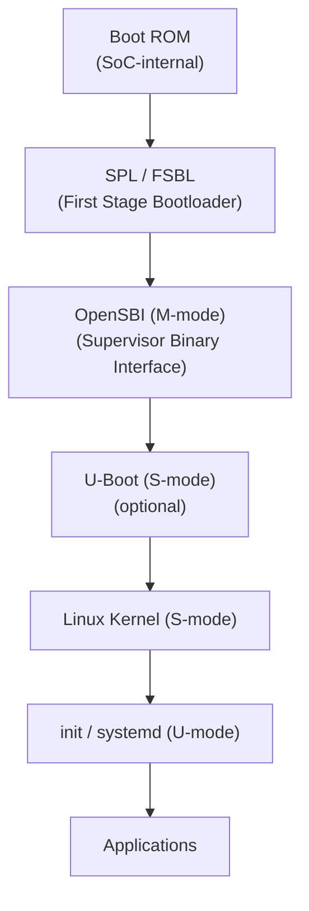

# RISC-V: Open-Source Architecture for Linux

RISC-V is a free and open instruction set architecture (ISA) originating from
UC Berkeley. Unlike ARM or x86, RISC-V is royalty-free and can be implemented
by anyone. This chapter covers RISC-V hardware boards, the Linux boot flow,
device tree conventions, and the cross-compilation toolchain ecosystem.

---

## 1. RISC-V ISA Overview

### 1.1 Design Philosophy

RISC-V follows a **modular ISA** design:

| Extension | Description | Status |
|-----------|-------------|--------|
| `RV32I` / `RV64I` | Base integer instructions | Ratified |
| `M` | Integer multiply/divide | Ratified |
| `A` | Atomic operations | Ratified |
| `F` / `D` / `Q` | Floating-point (single/double/quad) | Ratified |
| `C` | Compressed (16-bit) instructions | Ratified |
| `V` | Vector extensions | Ratified (1.0) |
| `Zicsr` | CSR access instructions | Ratified |
| `Zifencei` | Instruction-fetch fence | Ratified |

A typical Linux-capable core implements `RV64GC` (64-bit with G = IMAFDZicsr_Zifencei).

### 1.2 Privilege Levels


| Level | Code | Used By |
|-------|------|---------|
| Machine (M) | 3 | Boot ROM, OpenSBI |
| Supervisor (S) | 1 | Linux kernel |
| User (U) | 0 | Applications |

---

## 2. RISC-V Development Boards

### 2.1 SiFive Boards

SiFive was the first company to produce RISC-V SoCs for Linux.

| Board | SoC | Cores | RAM | Notes |
|-------|-----|-------|-----|-------|
| HiFive Unmatched | SiFive FU740 | 4× U74 + 1× S7 | 16 GB | PCIe, M.2, Gigabit Ethernet |
| HiFive Unleashed | SiFive FU540 | 4× U54 + 1× S5 | 4 GB | First Linux-capable RISC-V board |

**HiFive Unmatched Quick Start:**

```bash
# Download prebuilt image
wget https://github.com/sifive/freedom-u-sdk/releases/download/v2022.04.00/demo-coreip-cli-unmatched-2022.04.00.rootfs.wic.gz

# Flash to SD card
gunzip demo-coreip-cli-unmatched-2022.04.00.rootfs.wic.gz
sudo dd if=demo-coreip-cli-unmatched-2022.04.00.rootfs.wic of=/dev/sdX bs=4M status=progress
sync
```

### 2.2 StarFive Boards

StarFive produces the JH7100 and JH7110 SoCs, widely used in affordable boards.

| Board | SoC | Cores | RAM | Notes |
|-------|-----|-------|-----|-------|
| VisionFive 2 | JH7110 | 4× SiFive U74 | 2/4/8 GB | GPU (Imagination BXE-4-32), PCIe 2.0 |
| Star64 | JH7110 | 4× SiFive U74 | 4/8 GB | Pine64 ecosystem |
| Mars | JH7110 | 4× SiFive U74 | 4 GB | Milk-V, very compact |

**VisionFive 2 Boot from SD Card:**

```bash
# Download Debian image
wget https://cdn.starfivetech.com/Documentation/VisionFive2_2307_debian.img.gz

# Flash
gunzip VisionFive2_2307_debian.img.gz
sudo dd if=VisionFive2_2307_debian.img of=/dev/sdX bs=4M status=progress
```

### 2.3 Allwinner D1 Boards

The Allwinner D1 (single-core C906) powers several low-cost boards:

- **MangoPi MQ-Pro** — tiny form factor
- **Sipeed LicheeRV** — module + dock
- **Nezha D1** — Allwinner dev board

### 2.4 QEMU Virtual RISC-V

For development without hardware:

```bash
# Install QEMU
sudo apt install qemu-system-misc

# Download prebuilt kernel + rootfs
wget https://people.debian.org/~gio/dqib/riscv64-virt/image.qcow2

# Run
qemu-system-riscv64 \
    -machine virt \
    -nographic \
    -m 2G \
    -kernel /path/to/Image \
    -append "root=/dev/vda rw console=ttyS0" \
    -drive file=image.qcow2,format=qcow2 \
    -netdev user,id=net0 \
    -device virtio-net-device,netdev=net0
```

---

## 3. Linux Boot Flow on RISC-V

### 3.1 Boot Sequence



### 3.2 OpenSBI — The Firmware

OpenSBI is the standard M-mode firmware for RISC-V, analogous to ARM's TF-A.
It provides the **Supervisor Binary Interface (SBI)** — the API between M-mode
and S-mode.

```bash
# Build OpenSBI
git clone https://github.com/riscv-software-src/opensbi.git
cd opensbi
make PLATFORM=generic CROSS_COMPILE=riscv64-linux-gnu-
# Output: build/platform/generic/firmware/fw_dynamic.bin
```

SBI calls include:

| Function | Purpose |
|----------|---------|
| `sbi_ecall_console_putchar` | Debug UART output |
| `sbi_ecall_timer_set` | Set timer for next interrupt |
| `sbi_ecall_hart_start` | Start a secondary hart |
| `sbi_ecall_system_reset` | Reboot / shutdown |

### 3.3 U-Boot on RISC-V

U-Boot supports RISC-V natively:

```bash
# Build U-Boot for QEMU RISC-V
git clone https://source.denx.de/u-boot/u-boot.git
cd u-boot
make qemu-riscv64_smode_defconfig
make CROSS_COMPILE=riscv64-linux-gnu-
# Output: u-boot.bin
```

### 3.4 Boot with QEMU (OpenSBI + U-Boot + Linux)

```bash
qemu-system-riscv64 \
    -machine virt \
    -nographic \
    -m 4G \
    -smp 4 \
    -bios opensbi/build/platform/generic/firmware/fw_dynamic.bin \
    -kernel u-boot.bin \
    -drive file=rootfs.ext4,format=raw,if=virtio \
    -netdev user,id=net0,hostfwd=tcp::2222-:22 \
    -device virtio-net-device,netdev=net0
```

---

## 4. Device Tree for RISC-V

### 4.1 Standard Properties

RISC-V device trees follow the standard `ePAPR`/`devicetree.org` conventions
plus RISC-V-specific bindings.

```dts
/ {
    #address-cells = <2>;
    #size-cells = <2>;
    compatible = "starfive,jh7110", "riscv";

    cpus {
        #address-cells = <1>;
        #size-cells = <0>;
        timebase-frequency = <4000000>;

        cpu@0 {
            device_type = "cpu";
            compatible = "riscv";
            reg = <0>;
            riscv,isa = "rv64imafdc_zicsr_zifencei";
            riscv,isa-base = "rv64i";
            mmu-type = "riscv,sv39";
            cpu0_intc: interrupt-controller {
                #interrupt-cells = <1>;
                compatible = "riscv,cpu-intc";
                interrupt-controller;
            };
        };

        cpu@1 {
            device_type = "cpu";
            compatible = "riscv";
            reg = <1>;
            riscv,isa = "rv64imafdc_zicsr_zifencei";
            riscv,isa-base = "rv64i";
            mmu-type = "riscv,sv39";
            cpu1_intc: interrupt-controller {
                #interrupt-cells = <1>;
                compatible = "riscv,cpu-intc";
                interrupt-controller;
            };
        };
    };

    soc {
        #address-cells = <2>;
        #size-cells = <2>;
        compatible = "simple-bus";
        ranges;

        uart0: serial@10000000 {
            compatible = "ns16550a";
            reg = <0x0 0x10000000 0x0 0x10000>;
            clock-frequency = <3686400>;
            interrupt-parent = <&plic>;
            interrupts = <10>;
        };

        plic: interrupt-controller@c000000 {
            compatible = "riscv,plic0";
            reg = <0x0 0xc000000 0x0 0x4000000>;
            #interrupt-cells = <1>;
            interrupt-controller;
            interrupts-extended = <&cpu0_intc 11 &cpu0_intc 9>,
                                  <&cpu1_intc 11 &cpu1_intc 9>;
            riscv,ndev = <130>;
        };

        clint: timer@2000000 {
            compatible = "riscv,clint0";
            reg = <0x0 0x2000000 0x0 0xc0000>;
            interrupts-extended = <&cpu0_intc 3 &cpu0_intc 7>,
                                  <&cpu1_intc 3 &cpu1_intc 7>;
        };
    };
};
```

### 4.2 Key RISC-V DT Properties

| Property | Description |
|----------|-------------|
| `riscv,isa` | ISA string (e.g., `rv64imafdc`) |
| `riscv,isa-base` | Base ISA (`rv64i` or `rv32i`) |
| `mmu-type` | `riscv,sv32`, `riscv,sv39`, `riscv,sv48` |
| `riscv,ndev` | Number of PLIC interrupt sources |
| `timebase-frequency` | Timer tick frequency (Hz) |

### 4.3 Compiling Device Trees

```bash
# Compile DTS to DTB
riscv64-linux-gnu-gcc -E -x assembler-with-cpp -I include \
    myboard.dts -o myboard.dts.preprocessed
dtc -I dts -O dtb -o myboard.dtb myboard.dts.preprocessed

# Or using the kernel build system
make ARCH=riscv CROSS_COMPILE=riscv64-linux-gnu- dtbs
```

---

## 5. RISC-V Toolchain

### 5.1 Pre-built Toolchain

```bash
# Debian/Ubuntu
sudo apt install gcc-riscv64-linux-gnu g++-riscv64-linux-gnu

# Verify
riscv64-linux-gnu-gcc --version
riscv64-linux-gnu-gcc -print-multi-lib
```

### 5.2 Building from Source

```bash
# Using the RISC-V GNU Toolchain
git clone --recursive https://github.com/riscv-collab/riscv-gnu-toolchain
cd riscv-gnu-toolchain

# Linux toolchain (with glibc)
./configure --prefix=/opt/riscv --enable-linux
make linux -j$(nproc)

# Newlib toolchain (bare-metal)
./configure --prefix=/opt/riscv
make -j$(nproc)
```

### 5.3 LLVM/Clang for RISC-V

```bash
# Clang supports RISC-V natively
clang --target=riscv64-unknown-linux-gnu \
    --sysroot=/opt/riscv/sysroot \
    -o hello hello.c
```

### 5.4 Cross-Compilation for Linux Kernel

```bash
# Build kernel for RISC-V
make ARCH=riscv CROSS_COMPILE=riscv64-linux-gnu- defconfig
make ARCH=riscv CROSS_COMPILE=riscv64-linux-gnu- -j$(nproc)
# Output: arch/riscv/boot/Image
```

---

## 6. Linux Kernel Configuration for RISC-V

### 6.1 Key Config Options

```
CONFIG_RISCV=y
CONFIG_64BIT=y
CONFIG_ARCH_RV64I=y
CONFIG_SMP=y
CONFIG_MMU=y
CONFIG_FPU=y
CONFIG_VECTOR=y              # RISC-V Vector extension
CONFIG_RISCV_SBI=y           # SBI interface
CONFIG_RISCV_SBI_V01=y       # Legacy SBI support
CONFIG_SERIAL_8250=y         # UART (ns16550)
CONFIG_VIRTIO=y              # Virtio for QEMU
CONFIG_VIRTIO_MMIO=y
CONFIG_EXT4_FS=y
```

### 6.2 Building for Specific Boards

```bash
# VisionFive 2
make ARCH=riscv CROSS_COMPILE=riscv64-linux-gnu- \
    starfive_jh7110_defconfig
make ARCH=riscv CROSS_COMPILE=riscv64-linux-gnu- -j$(nproc)

# QEMU virt machine
make ARCH=riscv CROSS_COMPILE=riscv64-linux-gnu- defconfig
make ARCH=riscv CROSS_COMPILE=riscv64-linux-gnu- -j$(nproc)
```

---

## 7. Running Linux on QEMU RISC-V

### 7.1 Build Everything from Source

```bash
# 1. Build OpenSBI
cd opensbi && make PLATFORM=generic CROSS_COMPILE=riscv64-linux-gnu- && cd ..

# 2. Build Linux kernel
cd linux && make ARCH=riscv CROSS_COMPILE=riscv64-linux-gnu- defconfig && \
    make ARCH=riscv CROSS_COMPILE=riscv64-linux-gnu- -j$(nproc) && cd ..

# 3. Create rootfs with BusyBox or debootstrap
mkdir rootfs && cd rootfs
debootstrap --arch=riscv64 --foreign sid . https://deb.debian.org/debian
# ... complete second stage ...
cd ..

# 4. Create ext4 image
dd if=/dev/zero of=rootfs.ext4 bs=1M count=2048
mkfs.ext4 rootfs.ext4
sudo mount rootfs.ext4 /mnt
sudo cp -a rootfs/* /mnt/
sudo umount /mnt

# 5. Boot
qemu-system-riscv64 \
    -machine virt \
    -nographic \
    -m 4G \
    -smp 4 \
    -bios opensbi/build/platform/generic/firmware/fw_dynamic.bin \
    -kernel linux/arch/riscv/boot/Image \
    -append "root=/dev/vda rw console=ttyS0" \
    -drive file=rootfs.ext4,format=raw,if=virtio \
    -netdev user,id=net0 \
    -device virtio-net-device,netdev=net0
```

### 7.2 Boot Log (Abbreviated)

```
OpenSBI v1.3
   ____                    _____ ____ _____
  / __ \                  / ____|  _ \_   _|
 | |  | |_ __   ___ _ __ | (___ | |_) || |
 | |  | | '_ \ / _ \ '_ \ \___ \|  _ < | |
 | |__| | |_) |  __/ | | |____) | |_) || |_
  \____/| .__/ \___|_| |_|_____/|____/_____|
        | |
        |_|

[    0.000000] Linux version 6.6.0 (user@host) (riscv64-linux-gnu-gcc 13.2)
[    0.000000] Machine model: riscv-virtio,qemu
[    0.000000] SBI specification v1.0 detected
[    0.000000] Zone ranges:
[    0.000000]   DMA32    [mem 0x0000000080000000-0x00000000ffffffff]
[    0.000000]   Normal   [mem 0x0000000100000000-0x000000017fffffff]
```

---

## 8. RISC-V Ecosystem Status (2024–2025)

### 8.1 Mainline Linux Support

RISC-V has been in mainline Linux since 4.15 (2018). Key milestones:

| Kernel | Feature |
|--------|---------|
| 4.15 | Initial RISC-V support (RV64) |
| 5.4 | SiFive FU540 support |
| 5.10 | Vector extension support |
| 5.18 | SiFive FU740 (Unmatched) |
| 6.1 | StarFive JH7110 support |
| 6.5 | ACPI support, RISC-V KVM |
| 6.8 | Vector crypto extensions |

### 8.2 Distros with RISC-V Support

| Distribution | Status |
|--------------|--------|
| Debian | Official port (sid/testing) |
| Ubuntu | 22.04+ (unofficial), 24.04 (official) |
| Fedora | Spins available |
| openSUSE | Tumbleweed available |
| Arch Linux | Community port |
| Buildroot | Full support |
| Yocto | Full support |

### 8.3 RISC-V vs ARM for Linux

| Aspect | RISC-V | ARM |
|--------|--------|-----|
| ISA licensing | Free, open | Licensed |
| Ecosystem maturity | Growing | Very mature |
| Board availability | Limited, improving | Extensive |
| Mainline kernel | Good (since 4.15) | Excellent |
| GPU support | Early (Imagination) | Excellent (Mali, Panfrost) |
| Software ecosystem | Growing | Extensive |

---

## 9. Debugging RISC-V Linux

### 9.1 OpenOCD + GDB

```bash
# OpenOCD for RISC-V
openocd -f interface/ftdi/olimex-arm-usb-tiny-h.cfg \
    -f target/riscv.cfg

# Connect GDB
riscv64-linux-gnu-gdb vmlinux
(gdb) target remote :3333
(gdb) hbreak start_kernel
(gdb) continue
```

### 9.2 QEMU GDB Stub

```bash
# Add -s -S to QEMU command
qemu-system-riscv64 ... -s -S

# Connect
riscv64-linux-gnu-gdb vmlinux
(gdb) target remote :1234
(gdb) hbreak start_kernel
(gdb) continue
```

---

## Further Reading

- [RISC-V ISA Specification — riscv.org](https://riscv.org/technical/specifications/)
- [Linux RISC-V Documentation — docs.kernel.org](https://docs.kernel.org/riscv/index.html)
- [OpenSBI Documentation — github.com](https://github.com/riscv-software-src/opensbi/blob/master/docs/)
- [RISC-V GNU Toolchain — github.com](https://github.com/riscv-collab/riscv-gnu-toolchain)
- [SiFive Technical Documents](https://www.sifive.com/documentation)
- [StarFive VisionFive 2 Documentation](https://doc.rvspace.org/VisionFive2/)
- [RISC-V on QEMU — qemu.org](https://www.qemu.org/docs/master/system/target-riscv.html)
- [RISC-V Linux Kernel Source](https://git.kernel.org/pub/scm/linux/kernel/git/torvalds/linux.git/tree/arch/riscv)
- [LWN: RISC-V and Linux](https://lwn.net/Articles/893726/)
- [device-tree.org — ePAPR Standard](https://www.devicetree.org/specifications/)
