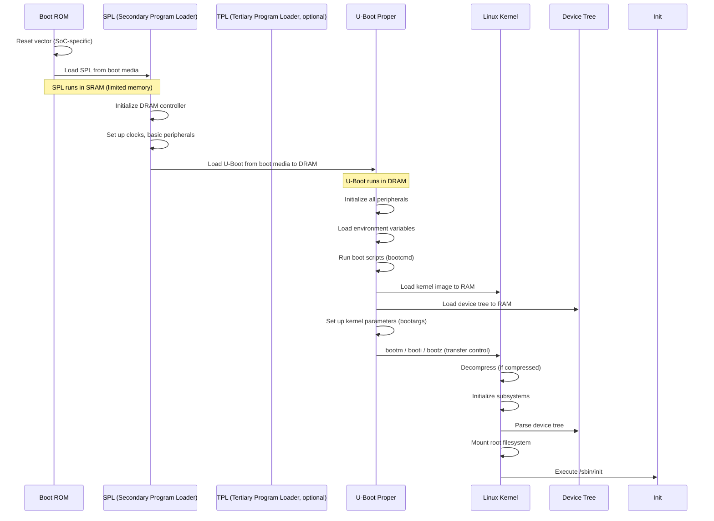
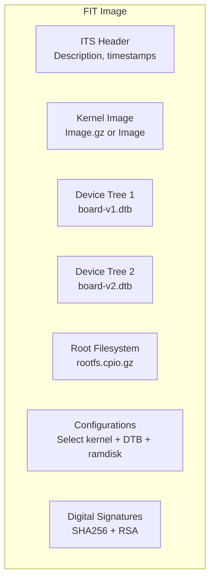
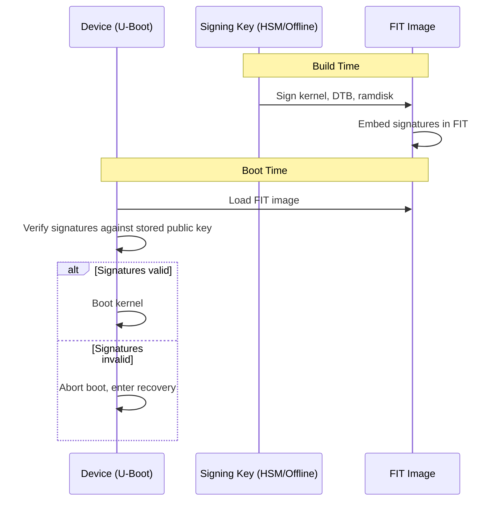

# U-Boot

## Introduction

U-Boot (Universal Bootloader) is the most widely used bootloader in Embedded Linux. Originally developed for PowerPC-based boards, it has grown to support ARM, MIPS, RISC-V, x86, Nios II, MicroBlaze, and many other architectures. U-Boot initializes hardware, loads the operating system kernel, and passes control to it with the necessary parameters and device tree.

U-Boot is both a bootloader and a command-line environment for hardware debugging, firmware updates, and boot configuration. Understanding U-Boot is essential for anyone working with Embedded Linux.

## Boot Flow



### SPL (Secondary Program Loader)

```bash
# SPL is a minimal bootloader that runs before U-Boot proper
# It runs in SRAM (limited memory, e.g., 128KB)

# SPL responsibilities:
# 1. Initialize DRAM (most critical task)
# 2. Set up clock tree
# 3. Configure boot media (eMMC, SD, SPI flash)
# 4. Load U-Boot proper into DRAM

# SPL is built as part of U-Boot
# For some SoCs, SPL is called:
# - MLO (Texas Instruments)
# - SPL (generic U-Boot)
# - TPL + SPL (if TPL is needed for very early init)

# SPL output files:
# spl/u-boot-spl.bin    — SPL binary
# spl/u-boot-spl-spl.bin — combined SPL + U-Boot
```

## Environment Variables

U-Boot uses environment variables to control its behavior:

### Key Environment Variables

```bash
# View all environment variables (in U-Boot console)
=> printenv

# Key variables:
baudrate=115200
bootargs=console=ttyS0,115200 root=/dev/mmcblk0p2 rootwait
bootcmd=run mmcboot
bootdelay=3
loadaddr=0x82000000
fdtaddr=0x88000000
mmcdev=0
mmcpart=1

# Custom boot script
mmcboot=mmc dev ${mmcdev}; mmc read ${loadaddr} ${kernel_offset} ${kernel_size}; mmc read ${fdtaddr} ${fdt_offset} ${fdt_size}; bootm ${loadaddr} - ${fdtaddr}
```

### Environment Storage

```bash
# Environment can be stored in:
# 1. SPI flash (persistent, survives reflash)
# 2. eMMC partition (persistent)
# 3. NAND flash (persistent)
# 4. Default compiled into U-Boot (fallback)

# Save environment changes
=> setenv bootargs "console=ttyS0,115200 root=/dev/mmcblk0p2 rootwait earlycon"
=> saveenv
# Writing to SPI flash...

# Reset to defaults
=> env default -a
=> saveenv

# Environment redundancy (CONFIG_ENV_IS_IN_FAT, etc.)
# Two copies of environment, CRC-checked
# If primary is corrupted, U-Boot uses backup
```

## U-Boot Commands

### Memory Commands

```bash
# Memory display
=> md 0x80000000 16
# 80000000: ea000012 e59ff014 e59ff014 e59ff014    ................
# 80000010: e59ff014 e59ff014 e59ff014 e59ff014    ................
# ...

# Memory write
=> mw 0x80000000 0xdeadbeef 1

# Memory copy
=> cp 0x80000000 0x90000000 0x1000

# Memory compare
=> cmp 0x80000000 0x90000000 0x1000
# Total of 4096 words were the same
```

### Storage Commands

```bash
# MMC/eMMC
=> mmc list
# FSL_SDHC: 0 (SD)
# FSL_SDHC: 1 (eMMC)

=> mmc dev 0
# switch to partitions #0, OK
# mmc0 is current device

=> mmc info
# Device: FSL_SDHC
# Manufacturer ID: 03
# OEM: 5344
# Name: SD16G
# Bus Speed: 50000000
# Mode: SD High Speed (50MHz)
# Capacity: 14.8 GiB

=> mmc read 0x80000000 0x800 0x4000
# read 16384 blocks from partition 0

# NAND
=> nand info
=> nand read 0x80000000 0x400000 0x800000

# SPI flash
=> sf probe 0
=> sf read 0x80000000 0x100000 0x400000
=> sf write 0x80000000 0x100000 0x400000

# USB
=> usb start
=> usb storage
=> usb read 0x80000000 0 0x4000

# Filesystem access (ext4, FAT, etc.)
=> ext4load mmc 0:2 ${loadaddr} /boot/Image
=> fatload mmc 0:1 ${loadaddr} Image
```

### Network Commands

```bash
# Configure network
=> setenv ipaddr 192.168.1.100
=> setenv serverip 192.168.1.1
=> setenv netmask 255.255.255.0
=> setenv gatewayip 192.168.1.1

# TFTP download
=> tftp ${loadaddr} Image
# Using ethernet@ff540000 device
# TFTP from server 192.168.1.1
# Load address: 0x82000000
# Loading: ################################
#          10 MiB/s

# NFS mount
=> nfs ${loadaddr} 192.168.1.1:/exports/Image

# Ping
=> ping 192.168.1.1
# Using ethernet@ff540000 device
# host 192.168.1.1 is alive

# DHCP
=> dhcp
# BOOTP broadcast 1
# DHCP client bound to address 192.168.1.100
```

### Boot Commands

```bash
# Load and boot a kernel
=> loadaddr=0x82000000
=> fdtaddr=0x88000000

# Load kernel from eMMC
=> ext4load mmc 0:2 ${loadaddr} /boot/Image
# 20971520 bytes read

# Load device tree
=> ext4load mmc 0:2 ${fdtaddr} /boot/board.dtb
# 32768 bytes read

# Set boot arguments
=> setenv bootargs "console=ttyS0,115200 root=/dev/mmcblk0p2 rootwait rw"

# Boot the kernel
=> bootm ${loadaddr} - ${fdtaddr}
# or for raw Image (ARM64):
=> booti ${loadaddr} - ${fdtaddr}
# or for compressed zImage (ARM32):
=> bootz ${loadaddr} - ${fdtaddr}

# Automatic boot (bootcmd runs on startup)
=> setenv bootcmd "ext4load mmc 0:2 ${loadaddr} /boot/Image; ext4load mmc 0:2 ${fdtaddr} /boot/board.dtb; booti ${loadaddr} - ${fdtaddr}"
=> saveenv
```

## FIT Images

FIT (Flattened Image Tree) is U-Boot's image format that bundles kernel, device tree, and ramdisk into a single, verified image:



### Creating FIT Images

```bash
# Image Tree Source (ITS) file
cat > image.its << 'EOF'
/dts-v1/;

/ {
    description = "Embedded Linux FIT Image";
    
    images {
        kernel@1 {
            description = "Linux Kernel";
            data = /incbin/("Image.gz");
            type = "kernel";
            arch = "arm64";
            os = "linux";
            compression = "gzip";
            load = <0x82000000>;
            entry = <0x82000000>;
            hash@1 {
                algo = "sha256";
            };
        };
        
        fdt@1 {
            description = "Device Tree";
            data = /incbin/("board.dtb");
            type = "flat_dt";
            arch = "arm64";
            compression = "none";
            hash@1 {
                algo = "sha256";
            };
        };
        
        ramdisk@1 {
            description = "Root Filesystem";
            data = /incbin/("rootfs.cpio.gz");
            type = "ramdisk";
            arch = "arm64";
            os = "linux";
            compression = "gzip";
            hash@1 {
                algo = "sha256";
            };
        };
    };
    
    configurations {
        default = "conf@1";
        conf@1 {
            description = "Boot Linux with DTB and ramdisk";
            kernel = "kernel@1";
            fdt = "fdt@1";
            ramdisk = "ramdisk@1";
            hash@1 {
                algo = "sha256";
            };
        };
    };
};
EOF

# Build FIT image
mkimage -f image.its fitImage

# Verify FIT image
dumpimage -l fitImage
# FIT description: Embedded Linux FIT Image
# Created:         Mon Jul 21 10:00:00 2025
#  Image 0 (kernel@1)
#   Description:  Linux Kernel
#   Type:         Kernel Image
#   Compression:  gzip
#   Architecture: ARM64
#   Load Address: 0x82000000
#  Image 1 (fdt@1)
#   Description:  Device Tree
#   Type:         Flat Device Tree
#   Compression:  uncompressed
#  Image 2 (ramdisk@1)
#   Description:  Root Filesystem
#   Type:         RAMDisk Image
#   Compression:  gzip
#  Default Configuration: 'conf@1'
#  Configuration 0 (conf@1)
#   Description:  Boot Linux with DTB and ramdisk
#   Kernel:       kernel@1
#   FDT:          fdt@1
#   Ramdisk:      ramdisk@1
```

### Booting FIT Images

```bash
# Boot FIT image in U-Boot
=> load mmc 0:1 ${loadaddr} fitImage
=> bootm ${loadaddr}#conf@1

# U-Boot automatically:
# 1. Verifies hash/signature
# 2. Extracts kernel, DTB, ramdisk
# 3. Decompresses kernel if needed
# 4. Passes DTB and ramdisk addresses to kernel
```

## Secure Boot

U-Boot supports verified boot using digital signatures:



### Implementing Secure Boot

```bash
# 1. Generate RSA key pair (offline/HSM)
openssl genrsa -F4 -out signing_key.pem 4096
openssl req -new -x509 -key signing_key.pem -out signing_key.crt \
  -subj "/CN=My Embedded Device/"

# Extract public key for U-Boot
openssl rsa -in signing_key.pem -pubout -out signing_key.pub

# 2. Build U-Boot with signature verification
# CONFIG_FIT_SIGNATURE=y
# CONFIG_RSA=y
# CONFIG_RSA_VERIFY=y
# CONFIG_SECURE_BOOT=y

# 3. Sign the FIT image
mkimage -f image.its -K u-boot.dtb -k /path/to/keys -r fitImage
# -K: output public key DTB overlay
# -k: key directory
# -r: sign the image

# 4. U-Boot verifies on boot
# => bootm ${loadaddr}
# ## Loading kernel from FIT Image at 82000000 ...
#    Verifying Hash Integrity ... OK
#    Loading Flat Device Tree from FIT Image ...
#    Verifying Hash Integrity ... OK
# Booting using the fdt configuration at 0x...
```

### Chain of Trust

```mermaid
graph TB
    subgraph Hardware Root of Trust
        HAB[HAB (i.MX) / ATF (ARM64)<br/>ROM verifies SPL]
    end
    subgraph SPL
        SPL_VER[SPL verifies U-Boot]
    end
    subgraph U-Boot
        UB_VER[U-Boot verifies FIT image]
    end
    subgraph Kernel
        K_VER[dm-verity verifies rootfs]
    end
    HAB --> SPL_VER --> UB_VER --> K_VER
```

## U-Boot Device Tree

U-Boot has its own device tree and can modify the kernel device tree before booting:

```bash
# U-Boot can modify DTB before passing to kernel
# This is called "fixup" or "fdt apply"

# Set a property in the DTB
=> fdt addr ${fdtaddr}
=> fdt set /chosen bootargs "extra_param=1"

# Enable/disable a device
=> fdt set /soc/serial@9000000 status "okay"

# Add a node
=> fdt mknode /chosen my_node
=> fdt set /chosen/my_node my_prop "my_value"

# U-Boot fixup mechanism (automatic)
# CONFIG_OF_BOARD_FIXUP=y
# Board code can modify DTB automatically
```

## Build System

```bash
# Cross-compile U-Boot
git clone https://source.denx.de/u-boot/u-boot.git
cd u-boot

# List available board configurations
make list-defs | grep -i beagle
# am335x_evm_defconfig
# beaglebone_defconfig

# Configure
make CROSS_COMPILE=aarch64-linux-gnu- rpi_4_defconfig

# Optional: customize
make CROSS_COMPILE=aarch64-linux-gnu- menuconfig

# Build
make CROSS_COMPILE=aarch64-linux-gnu- -j$(nproc)
# Output:
# u-boot.bin     — Raw binary
# u-boot.img     — Image with header (for boot ROM)
# u-boot-spl.bin — SPL binary
# u-boot.dtb     — U-Boot device tree (with public keys if secure boot)

# Build for multiple boards (with ATF)
make CROSS_COMPILE=aarch64-linux-gnu- BL31=../arm-trusted-firmware/build/release/bl31.bin -j$(nproc)
```

## U-Boot Shell Scripts

```bash
# U-Boot supports scripting with hush shell

# Conditional boot (try SD card, fall back to network)
=> setenv bootcmd '
    if mmc dev 0; then
        run mmcboot;
    else
        run netboot;
    fi
'

# Multiple boot targets
=> setenv bootcmd '
    if test -e mmc 0:2 /boot/Image; then
        run mmcboot;
    elif test -e mmc 0:1 fitImage; then
        run fitboot;
    else
        run netboot;
    fi
'

# Recovery mode
=> setenv bootcmd '
    if button_recovery; then
        run recovery;
    else
        run normalboot;
    fi
'
```

## Debugging U-Boot

```bash
# Serial console (most common)
# Connect USB-to-serial adapter
# Baud rate: 115200, 8N1
screen /dev/ttyUSB0 115200

# Break into U-Boot console
# Press any key during "Hit any key to stop autoboot: 3"

# Debug with JTAG
# OpenOCD + GDB
openocd -f interface/ftdi/olimex-arm-usb-tiny-h.cfg \
        -f board/my-board.cfg

# In another terminal
aarch64-linux-gnu-gdb u-boot
(gdb) target remote :3333
(gdb) break board_init_f
(gdb) continue

# U-Boot debug options
# CONFIG_DEBUG_UART=y
# CONFIG_DEBUG_UART_BASE=0xff1a0000
# CONFIG_DEBUG_UART_CLOCK=24000000
# Enables early serial output before console is initialized
```

## References

1. U-Boot Documentation. [https://docs.u-boot.org/en/latest/](https://docs.u-boot.org/en/latest/)
2. U-Boot Source Code. [https://source.denx.de/u-boot/u-boot](https://source.denx.de/u-boot/u-boot)
3. U-Boot FIT Image Documentation. [https://docs.u-boot.org/en/latest/usage/fit/](https://docs.u-boot.org/en/latest/usage/fit/)
4. Denx U-Boot Wiki. [https://www.denx.de/wiki/U-Boot](https://www.denx.de/wiki/U-Boot)

## Further Reading

- [U-Boot Documentation](https://docs.u-boot.org/en/latest/)
- [U-Boot FIT Image Guide](https://docs.u-boot.org/en/latest/usage/fit/)
- [U-Boot Secure Boot](https://docs.u-boot.org/en/latest/usage/verified-boot.html)
- [U-Boot Environment Variables](https://docs.u-boot.org/en/latest/usage/env.html)
- [ARM Trusted Firmware](https://trustedfirmware-a.readthedocs.io/)

## Related Topics

- [Embedded Linux Overview](./overview.md) — Embedded Linux fundamentals
- [Device Tree](./device-tree.md) — Hardware description
- [Cross-Compilation](./cross-compilation.md) — Building U-Boot for target
- [ARM Architecture](./arm.md) — ARM-specific boot details
