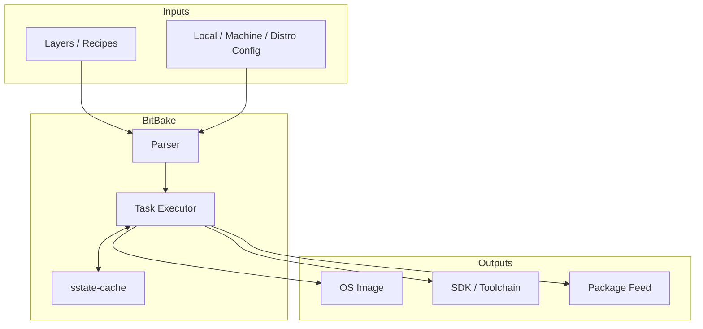
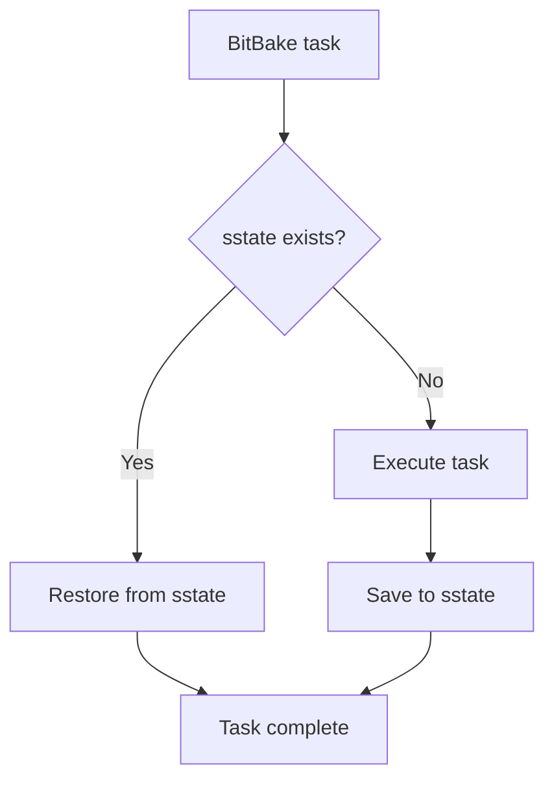
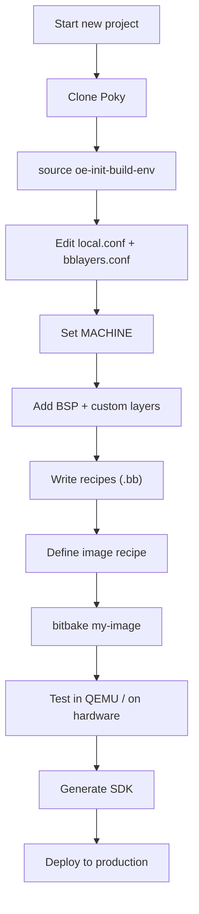

# Yocto Project: Building Custom Linux Distributions

The Yocto Project is the industry-standard build system for creating custom
Linux distributions for embedded devices. Built around **BitBake** (a task
executor similar to Make) and **OpenEmbedded-Core** (a layer of base recipes),
Yocto provides a complete framework for cross-compilation, package management,
image generation, and SDK creation. This chapter covers BitBake recipes, the
layer model, image building, SDK generation, shared-state cache, and the
`devtool` workflow.

---

## 1. Architecture Overview



### 1.1 Key Concepts

| Concept | Description |
|---------|-------------|
| **Recipe** (.bb) | Describes how to build a single package |
| **Layer** | Collection of related recipes + config |
| **BitBake** | Task executor (Python-based) |
| **Metadata** | Configuration + recipes + classes |
| **Image** | A complete root filesystem |
| **Machine** | Target hardware description |
| **Distro** | Distribution-wide policy |

---

## 2. Getting Started

### 2.1 Prerequisites

```bash
# Ubuntu 22.04
sudo apt install gawk wget git diffstat unzip texinfo gcc build-essential \
    chrpath socat cpio python3 python3-pip python3-pexpect \
    python3-git python3-jinja2 python3-subunit \
    xz-utils debianutils iputils-ping \
    libsdl1.2-dev xterm zstd liblz4-tool
```

### 2.2 Fetch Poky

```bash
git clone -b scarthgap https://git.yoctoproject.org/poky
cd poky
```

### 2.3 Initialize Build Environment

```bash
source oe-init-build-env build
# This creates build/ and sets BBPATH, PATH, etc.
```

### 2.4 First Build (QEMU)

```bash
bitbake core-image-minimal
# First build: 1–3 hours depending on hardware and network
```

### 2.5 Run in QEMU

```bash
runqemu qemuarm64 nographic
```

---

## 3. BitBake Recipes

### 3.1 Recipe Structure

A recipe (`*.bb`) describes how to fetch, patch, configure, compile, and
package a piece of software.

```
meta-mylayer/
└── recipes-example/
    └── myapp/
        ├── myapp_1.0.bb
        ├── files/
        │   ├── myapp.service
        │   └── 0001-fix-build.patch
        └── myapp_1.0.bbappend
```

### 3.2 Minimal Recipe

```bitbake
# recipes-example/myapp/myapp_1.0.bb

SUMMARY = "My custom application"
DESCRIPTION = "A simple example application for Yocto"
HOMEPAGE = "https://example.com/myapp"
LICENSE = "MIT"
LIC_FILES_CHKSUM = "file://LICENSE;md5=abc123..."

SRC_URI = "git://github.com/example/myapp.git;branch=main;protocol=https"
SRCREV = "a1b2c3d4e5f6a7b8c9d0e1f2a3b4c5d6e7f8a9b0"

S = "${WORKDIR}/git"

inherit cmake

# Dependencies
DEPENDS = "zlib openssl"
RDEPENDS:${PN} = "openssl"

# Installation
do_install:append() {
    install -d ${D}${systemd_system_unitdir}
    install -m 0644 ${WORKDIR}/myapp.service ${D}${systemd_system_unitdir}
}

inherit systemd
SYSTEMD_SERVICE:${PN} = "myapp.service"
```

### 3.3 Recipe Tasks

BitBake executes tasks in a specific order:


| Task | Purpose |
|------|---------|
| `do_fetch` | Download source code |
| `do_unpack` | Extract archive |
| `do_patch` | Apply patches from `SRC_URI` |
| `do_configure` | Run `./configure`, `cmake`, etc. |
| `do_compile` | Build the software |
| `do_install` | Install to `${D}` (staging root) |
| `do_package` | Split into sub-packages |

### 3.4 Running Individual Tasks

```bash
# Run only the fetch task
bitbake myapp -c fetch

# Run only configure
bitbake myapp -c configure

# Clean and rebuild
bitbake myapp -c cleansstate
bitbake myapp

# Show task dependencies
bitbake myapp -g
```

### 3.5 Devtool Workflow

`devtool` streamlines recipe development:

```bash
# Create a new recipe from a source tree
devtool add myapp /path/to/source

# Modify source (creates a git workspace)
devtool modify myapp

# Build from workspace
devtool build myapp

# Update recipe with changes
devtool finish myapp meta-mylayer

# Reset workspace
devtool reset myapp
```

`devtool modify` creates a workspace at `build/workspace/sources/myapp/` with
the source tree checked out. You can edit, build, and test iteratively.

---

## 4. Layers

### 4.1 Layer Priority

Layers are stacked by priority. Higher priority overrides lower:

```bash
# conf/layer.conf
BBPATH .= ":${LAYERDIR}"
BBFILES += "${LAYERDIR}/recipes-*/*/*.bb"
BBFILE_COLLECTIONS += "meta-mylayer"
BBFILE_PATTERN_meta-mylayer = "^${LAYERDIR}/"
BBFILE_PRIORITY_meta-mylayer = 10
LAYERSERIES_COMPAT_meta-mylayer = "scarthgap"
```

### 4.2 Common Layers

| Layer | Purpose |
|-------|---------|
| `meta` | Core recipes (oe-core) |
| `meta-poky` | Poky distro config |
| `meta-yocto-bsp` | Reference BSPs |
| `meta-oe` | Extended recipes (meta-openembedded) |
| `meta-raspberrypi` | Raspberry Pi BSP |
| `meta-ti` | Texas Instruments BSP |
| `meta-freescale` | NXP/Freescale BSP |
| `meta-qt5` / `meta-qt6` | Qt framework |

### 4.3 Adding a Layer

```bash
# Clone
git clone https://github.com/example/meta-mylayer.git

# Add to build
bitbake-layers add-layer ../meta-mylayer

# Verify
bitbake-layers show-layers
```

### 4.4 Layer Priority and Overrides

```bash
# See what recipe provides a package
bitbake -e myapp | grep "^PV="

# See recipe file used
bitbake-layers show-recipes myapp
```

### 4.5 bbappends — Extending Recipes

`.bbappend` files modify existing recipes without copying them:

```bitbake
# meta-mylayer/recipes-core/busybox/busybox_%.bbappend

FILESEXTRAPATHS:prepend := "${THISDIR}/files:"

SRC_URI += "file://my-busybox.cfg"

do_configure:append() {
    cat ${WORKDIR}/my-busybox.cfg >> ${B}/.config
}
```

---

## 5. Images

### 5.1 Image Recipes

An image recipe defines which packages to install:

```bitbake
# recipes-core/images/my-image.bb

SUMMARY = "My custom image"

inherit core-image

IMAGE_INSTALL:append = " \
    myapp \
    nginx \
    openssh \
    python3 \
    htop \
"

# Extra space on rootfs
IMAGE_ROOTFS_EXTRA_SPACE = "1048576"

# Enable SSH server
EXTRA_IMAGE_FEATURES += "ssh-server-openssh"
```

### 5.2 Building an Image

```bash
bitbake my-image
```

### 5.3 Image Types

```bash
# Available image types
ls tmp/deploy/images/qemuarm64/
# core-image-minimal-qemuarm64.rootfs.ext4
# core-image-minimal-qemuarm64.rootfs.wic
# core-image-minimal-qemuarm64.rootfs.tar.bz2
# Image.gz (kernel)
```

Common image types:

| Format | Description |
|--------|-------------|
| `ext4` | Standard Linux filesystem |
| `wic` | Full disk image (partition table + partitions) |
| `squashfs` | Read-only compressed filesystem |
| `tar.bz2` | Tarball of rootfs |
| `cpio.gz` | Initramfs |
| `bmap` | Block map for fast flashing with `bmaptool` |

### 5.4 WIC Image Creation

```bash
# Custom WIC kickstart file
# my-image.wks
# Partitions: boot + rootfs
part /boot --source bootimg-partition --ondisk sda --fstype=vfat --label boot --active --align 4096 --size 256
part / --source rootfs --ondisk sda --fstype=ext4 --label root --align 4096 --size 2048

# Use in recipe
WKS_FILE = "my-image.wks"
```

```bash
# Create WIC image
wic create my-image.wks -e my-image
```

---

## 6. SDK Generation

### 6.1 Standard SDK

```bash
# Build the SDK
bitbake my-image -c populate_sdk

# Output: tmp/deploy/sdk/
# poky-glibc-x86_64-my-image-armv8a-toolchain-5.0.sh
```

### 6.2 Installing the SDK

```bash
chmod +x poky-glibc-x86_64-my-image-armv8a-toolchain-5.0.sh
./poky-glibc-x86_64-my-image-armv8a-toolchain-5.0.sh
# Default install: /opt/poky/5.0/
```

### 6.3 Using the SDK

```bash
source /opt/poky/5.0/environment-setup-armv8a-poky-linux

# Verify
echo $CC
# aarch64-poky-linux-gcc -march=armv8-a+crc -mtune=cortex-a53 ...

# Cross-compile
$CC -o hello hello.c
```

### 6.4 Extensible SDK (eSDK)

The eSDK includes `devtool` and the full build system:

```bash
bitbake my-image -c populate_sdk_ext

# Install and use
./poky-glibc-x86_64-my-image-armv8a-toolchain-ext-5.0.sh
source /opt/poky/5.0/environment-setup-armv8a-poky-linux

# Use devtool in the SDK
devtool add myapp https://github.com/example/myapp.git
devtool build myapp
```

---

## 7. Shared-State Cache (sstate-cache)

### 7.1 What Is sstate?

The shared-state cache stores task output (compiled objects, packaged files)
so that subsequent builds can reuse them. This makes incremental builds
dramatically faster.



### 7.2 sstate Structure

```
tmp/sstate-cache/
├── 00/
│   └── sstate:zlib:armv8a-poky-linux:1.3:0:riscv64:3:xxxx.tgz
├── 01/
│   └── ...
└── ...
```

### 7.3 Configuring sstate

```bash
# conf/local.conf
SSTATE_DIR = "/path/to/sstate-cache"
SSTATE_MIRRORS = "file://.* http://sstate.example.com/PATH"

# Prune old entries
SSTATE_PRUNE_OBSOLETEDIR = "1"
```

### 7.4 Sharing sstate Between Builds

```bash
# Build 1
SSTATE_DIR = "/shared/sstate"

# Build 2 (different machine, same packages)
SSTATE_DIR = "/shared/sstate"
# Reuses matching tasks from Build 1
```

### 7.5 sstate Miss Analysis

```bash
# Show sstate usage
bitbake my-image -S printdiff

# Force rebuild from scratch
bitbake my-image -c cleansstate
```

---

## 8. Machine Configuration

### 8.1 Defining a Machine

```bitbake
# conf/machine/myboard.conf

#@TYPE: Machine
#@NAME: My Custom Board
#@DESCRIPTION: Machine configuration for My Board

require conf/machine/include/arm/armv8a/tune-cortexa53.inc

PREFERRED_PROVIDER_virtual/kernel = "linux-yocto"
KERNEL_IMAGETYPE = "Image"
KERNEL_DEVICETREE = "myvendor/myboard.dtb"

SERIAL_CONSOLES = "115200;ttyAMA0"

MACHINE_FEATURES = "wifi bluetooth usbhost"
IMAGE_FSTYPES = "wic ext4.gz"

# U-Boot configuration
PREFERRED_PROVIDER_virtual/bootloader = "u-boot"
UBOOT_MACHINE = "myboard_defconfig"
```

### 8.2 Distro Configuration

```bitbake
# conf/distro/mydistro.conf

DISTRO = "mydistro"
DISTRO_NAME = "My Custom Distribution"
DISTRO_VERSION = "1.0"
DISTRO_CODENAME = "release"

# Use systemd
DISTRO_FEATURES:append = " systemd"
VIRTUAL-RUNTIME_init_manager = "systemd"
DISTRO_FEATURES_BACKFILL_CONSIDERED = "sysvinit"

# Enable security features
DISTRO_FEATURES:append = " seccomp pam"
```

---

## 9. BitBake Debugging

### 9.1 Useful Commands

```bash
# Show all variables for a recipe
bitbake -e myapp

# Show specific variable
bitbake -e myapp | grep "^PV="

# Show task dependency graph
bitbake -g myapp
# Generates: task-depends.dot

# Show build statistics
bitbake --status

# Dry run (parse only)
bitbake myapp -n
```

### 9.2 Build History

```bash
# Enable buildhistory
INHERIT += "buildhistory"
BUILDHISTORY_COMMIT = "1"
BUILDHISTORY_DIR = "/path/to/buildhistory"

# Inspect
cat tmp/buildhistory/images/qemuarm64/glibc/my-image/image-info.txt
```

### 9.3 Log Files

```
tmp/work/cortexa53-poky-linux/myapp/1.0-r0/
├── temp/
│   ├── log.do_fetch          # Fetch log
│   ├── log.do_compile        # Compile log
│   ├── log.do_install        # Install log
│   └── run.do_compile        # Actual command used
└── image/                    # Installed files
```

---

## 10. Workflow Diagram



---

## 11. Tips and Tricks

### 11.1 Speed Up Builds

```bash
# Use ccache
INHERIT += "ccache"
CCACHE_DIR = "/path/to/ccache"

# Parallel builds (already default)
BB_NUMBER_THREADS = "16"
PARALLEL_MAKE = "-j 16"

# Use hash equivalence
BB_SIGNATURE_HANDLER = "OEEquivHash"
```

### 11.2 Reproducible Builds

```bash
# Inherit buildhistory for auditing
INHERIT += "buildhistory"
BUILDHISTORY_COMMIT = "1"

# Pin all source revisions
SRCREV_pn-myapp = "abc123..."
```

### 11.3 Security Hardening

```bitbake
# Enable security flags
require conf/distro/include/security_flags.inc

# Compiler flags
SECURITY_CFLAGS = "-fstack-protector-strong -D_FORTIFY_SOURCE=2"
SECURITY_LDFLAGS = "-Wl,-z,relro,-z,now"
```

---

## Further Reading

- [Yocto Project Documentation — yoctoproject.org](https://docs.yoctoproject.org/)
- [BitBake User Manual](https://docs.yoctoproject.org/bitbake.html)
- [Yocto Project Mega-Manual](https://docs.yoctoproject.org/singleindex.html)
- [OpenEmbedded-Core Layer Index](https://layers.openembedded.org/)
- [devtool Documentation](https://docs.yoctoproject.org/dev-manual/common-tasks.html#using-devtool-in-your-workflow)
- [Yocto Project Development Tasks Manual](https://docs.yoctoproject.org/dev-manual/common-tasks.html)
- [BitBake Recipe Syntax Reference](https://docs.yoctoproject.org/bitbake-user-manual/bitbake-user-manual-metadata.html)
- [sstate-cache Explanation — LWN.net](https://lwn.net/Articles/761530/)
- [Embedded Linux with Yocto — Free Electrons / Bootlin](https://bootlin.com/training/embedded-linux-yocto/)
