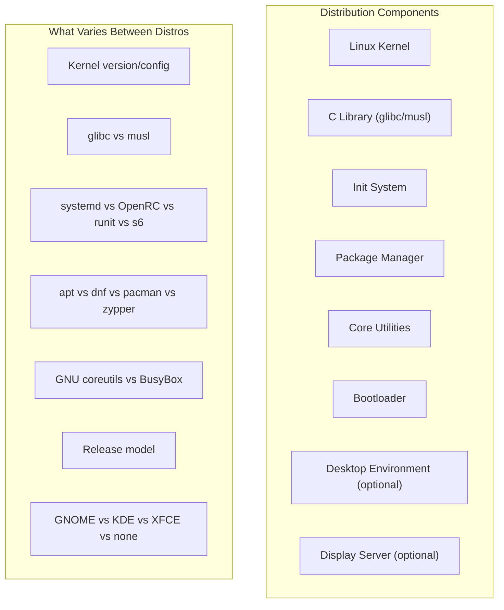
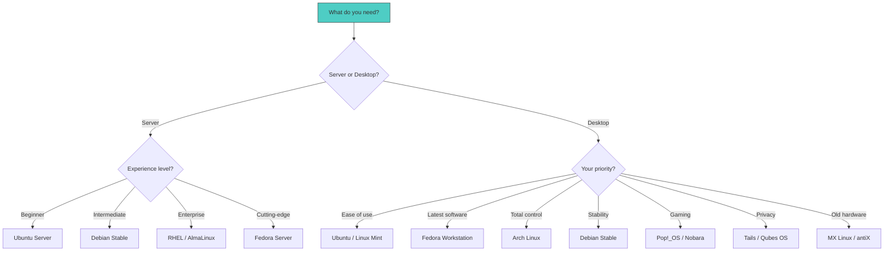

# Linux Distributions

A Linux distribution (or "distro") is a complete operating system built around the Linux kernel. While the kernel provides the core of the system — process management, memory management, device drivers, filesystems — it's the distribution that makes it usable by bundling the kernel with userspace tools, libraries, a package manager, and often a desktop environment.

There are hundreds of Linux distributions, but they're not random — they form a tree of inheritance and influence. Understanding this tree, and the key differences between distribution families, is essential for choosing the right one and understanding the broader Linux ecosystem.

## What Makes a Distribution?

Every distribution provides these core components:



### The C Library

The **C library** is the bridge between user-space programs and the kernel's system calls. It's the most fundamental piece of userspace software:

| Library | Used By | Size | Notes |
|---------|---------|------|-------|
| **glibc** | Most distros (Debian, Fedora, Arch, SUSE, Ubuntu) | Large | Most compatible, most features |
| **musl** | Alpine, Void (musl variant), OpenWrt | Small | Minimal, static-linking friendly |
| **uClibc-ng** | Embedded systems | Tiny | For resource-constrained devices |

The choice of C library has profound implications. Programs compiled against glibc won't run on musl-based systems (and vice versa) without compatibility layers or recompilation.

### The Init System

The **init system** is the first userspace process (PID 1) and the parent of all other processes. It's responsible for booting the system, managing services, and handling shutdown:

| Init System | Philosophy | Used By |
|-------------|-----------|---------|
| **systemd** | Integrated service manager | Debian, Ubuntu, Fedora, RHEL, Arch, SUSE |
| **OpenRC** | Dependency-based init | Gentoo, Alpine (optionally), Artix |
| **rinit** | Runit supervision | Void Linux |
| **s6** | Process supervision suite | Some embedded/specialty distros |
| **SysV init** | Traditional Unix init | Legacy systems, Devuan |

systemd deserves special mention because it's the most controversial and most widely adopted. It's not just an init system — it handles logging (`journald`), networking (`networkd`), time synchronization (`timedated`), user sessions (`logind`), and more. Critics argue this violates the Unix philosophy of small, focused tools. Supporters argue it provides consistency and modern features that SysV init lacks.

## The Major Distribution Families

### The Debian Family

**Debian** was founded by Ian Murdock in 1993 and is one of the oldest and most influential distributions. It's a volunteer-driven project known for its stability, its massive software repository, and its Social Contract.

#### Debian

Debian has three main branches:

| Branch | Purpose | Packages | Stability |
|--------|---------|----------|-----------|
| **Stable** | Production servers | ~59,000 | Very high (frozen versions) |
| **Testing** | Next stable release | ~62,000 | Medium (being tested for stable) |
| **Unstable** | Rolling development | ~65,000 | Lower (always latest versions) |

Debian's release cycle is driven by quality, not time — a new stable release happens when it's ready (typically every 2-3 years). Each stable release gets approximately 3 years of official support, with additional LTS support via the Debian LTS team.

```bash
# Debian package management
$ sudo apt update                          # Update package lists
$ sudo apt upgrade                         # Upgrade all packages
$ sudo apt install nginx                   # Install a package
$ sudo apt remove nginx                    # Remove a package
$ sudo apt autoremove                      # Remove unused dependencies
$ apt search "web server"                  # Search for packages
$ apt show nginx                           # Show package details
$ dpkg -l | grep nginx                     # List installed packages
$ dpkg -L nginx                            # List files in a package
```

#### Ubuntu

**Ubuntu**, created by Mark Shuttleworth and Canonical in 2004, is based on Debian's "unstable" branch with additional modifications. It's the most popular desktop Linux distribution and has significant server market share.

Ubuntu's key innovations:

- **Predictable releases**: Every 6 months (April `.04` and October `.10`)
- **LTS (Long Term Support)**: Every 2 years, supported for 5 years (with paid Extended Security Maintenance up to 10 years)
- **Main vs. Universe**: Free software (main) vs. community-maintained (universe)
- **Snap packages**: Canonical's universal package format
- **Ubuntu Pro**: Free for up to 5 personal machines, paid for enterprise

```
Ubuntu Release Timeline (Recent)
├── 20.04 LTS "Focal Fossa"      — Supported until April 2025
├── 22.04 LTS "Jammy Jellyfish"  — Supported until April 2027
├── 23.10 "Mantic Minotaur"      — Standard (9 months support)
├── 24.04 LTS "Noble Numbat"     — Supported until April 2029
└── 24.10 "Oracular Oriole"      — Standard (9 months support)
```

#### Other Debian Derivatives

| Distribution | Focus |
|-------------|-------|
| **Linux Mint** | Desktop user-friendliness, Cinnamon/MATE desktop |
| **Kali Linux** | Penetration testing and security auditing |
| **Raspberry Pi OS** | Optimized for Raspberry Pi hardware |
| **Pop!_OS** | Developer/gaming focus by System76 |
| **MX Linux** | Lightweight, systemd-free option |
| **Devuan** | Debian without systemd |
| **Deepin** | Chinese distro with polished desktop |

### The Red Hat Family

**Red Hat** was founded in 1993 by Bob Young and Marc Ewing. It's one of the most commercially successful open-source companies, acquired by IBM in 2019 for **$34 billion** — the largest software acquisition in history at that time.

#### Red Hat Enterprise Linux (RHEL)

RHEL is the commercially supported, enterprise-grade distribution. It's the backbone of corporate Linux:

- **Long support cycles**: Each major version gets ~10 years of support
- **Certified hardware/software**: Extensive compatibility testing
- **Subscription model**: Paid support and updates
- **Binary compatibility**: CentOS (now Stream) and AlmaLinux/Rocky Linux are compatible

```
RHEL Release History
├── RHEL 6    — Kernel 2.6.32  (2010, EOL 2020)
├── RHEL 7    — Kernel 3.10    (2014, EOL 2024)
├── RHEL 8    — Kernel 4.18    (2019, EOL 2029)
└── RHEL 9    — Kernel 5.14    (2022, EOL 2032)
```

#### Fedora

**Fedora** is Red Hat's community distribution and the upstream for RHEL. New technologies appear in Fedora first, then (if successful) get included in the next RHEL release:

- **Fast release cycle**: ~every 6 months
- **Cutting-edge software**: Latest kernels, GCC, GNOME, etc.
- **SELinux**: Security-Enhanced Linux enabled by default
- **Wayland**: Early adopter of Wayland display server
- **PipeWire**: Replaced PulseAudio and JACK

```bash
# Fedora/RHEL package management (DNF)
$ sudo dnf check-update                      # Check for updates
$ sudo dnf upgrade                           # Upgrade all packages
$ sudo dnf install nginx                     # Install a package
$ sudo dnf remove nginx                      # Remove a package
$ sudo dnf autoremove                        # Remove unused dependencies
$ dnf search "web server"                    # Search for packages
$ dnf info nginx                             # Show package info
$ dnf list installed                         # List installed packages
$ rpm -ql nginx                              # List files in a package
```

#### CentOS and Its Successors

The CentOS story is important for understanding the RHEL ecosystem:

1. **CentOS** (2004-2021): Rebuilt RHEL from source, free to use. Very popular for servers.
2. **CentOS Stream** (2019-present): Rolling release between Fedora and RHEL. Replaced traditional CentOS.
3. **AlmaLinux** (2021-present): Community-driven RHEL rebuild, by CloudLinux Inc.
4. **Rocky Linux** (2021-present): Community-driven RHEL rebuild, founded by CentOS co-founder Gregory Kurtzer.

Red Hat's decision to discontinue traditional CentOS in favor of CentOS Stream was controversial and led directly to the creation of AlmaLinux and Rocky Linux.

### The Arch Family

**Arch Linux** takes a radically different approach: it's a rolling-release, minimalist distribution that provides the latest software and expects users to configure their own system.

#### Arch Linux Philosophy

- **Simplicity**: Minimal base install, no unnecessary additions
- **Up-to-date**: Rolling release with the latest stable versions
- **User-centric**: The user controls the system, not the distribution
- **Documentation**: The [Arch Wiki](https://wiki.archlinux.org/) is considered the best Linux documentation available

```bash
# Arch package management (pacman)
$ sudo pacman -Syu                    # Full system upgrade (rolling release)
$ sudo pacman -S nginx                # Install a package
$ sudo pacman -R nginx                # Remove a package
$ sudo pacman -Rns nginx              # Remove with dependencies and config
$ pacman -Ss "web server"             # Search for packages
$ pacman -Si nginx                    # Show package info (remote)
$ pacman -Qi nginx                    # Show package info (local)
$ pacman -Ql nginx                    # List files in a package
$ pacman -Qo /usr/bin/nginx           # Which package owns this file?
```

The **Arch User Repository (AUR)** is a community repository of package build scripts. Users can install packages from the AUR using helper tools:

```bash
# Install an AUR helper (yay)
$ git clone https://aur.archlinux.org/yay.git
$ cd yay && makepkg -si

# Install from AUR
$ yay -S google-chrome
```

#### Arch Derivatives

| Distribution | Relationship |
|-------------|-------------|
| **Manjaro** | Arch-based with easier installation and delayed updates for stability |
| **EndeavourOS** | Close to Arch with graphical installer |
| **Garuda Linux** | Arch-based with gaming focus |
| **SteamOS 3.0** | Valve's Steam Deck OS, based on Arch |

### The SUSE Family

**SUSE** (Software und System-Entwicklung) was founded in Germany in 1992. It's one of the oldest commercial Linux companies.

#### openSUSE

openSUSE comes in two flavors:

- **openSUSE Tumbleweed**: Rolling release with the latest software
- **openSUSE Leap**: Regular release based on SUSE Linux Enterprise (SLE) binaries

openSUSE is known for:
- **YaST**: A powerful system administration tool (graphical and text-mode)
- **Btrfs** as default filesystem with automatic snapshots
- **Zypper**: A fast, feature-rich package manager
- **OBS (Open Build Service)**: Build packages for multiple distros

```bash
# openSUSE package management (Zypper)
$ sudo zypper refresh                       # Refresh repositories
$ sudo zypper update                        # Update all packages
$ sudo zypper install nginx                 # Install a package
$ sudo zypper remove nginx                  # Remove a package
$ zypper search "web server"               # Search for packages
$ zypper info nginx                         # Show package info
$ zypper se -i                              # List installed packages
```

#### SUSE Linux Enterprise (SLE)

SLE is SUSE's commercial enterprise distribution, competing with RHEL:

- **SLES** (SUSE Linux Enterprise Server): For servers and mainframes
- **SLED** (SUSE Linux Enterprise Desktop): For workstations
- Strong IBM mainframe (s390x) support
- Long support cycles (13+ years with extensions)

### Independent Distributions

Not all major distros fit neatly into the families above:

#### Gentoo

**Gentoo** is a source-based distribution — all packages are compiled from source on the user's machine, optimized for their specific hardware.

```bash
# Gentoo package management (Portage)
$ sudo emerge --sync                        # Sync package tree
$ sudo emerge -av nginx                     # Install (compile) a package
$ sudo emerge --depclean                    # Remove unused dependencies
$ eix "web server"                          # Search for packages (with eix)
```

Gentoo uses **USE flags** to customize package features:

```bash
# /etc/portage/package.use
# Enable SSL support in nginx, disable mail module
www-servers/nginx ssl -mail

# Set global USE flags in /etc/portage/make.conf
USE="X gtk3 bluetooth wifi -systemd"
```

Gentoo is popular with experienced users who want maximum control and optimization. Compilation times can be significant (hours for large packages like Firefox or LibreOffice).

#### Alpine Linux

**Alpine Linux** is a security-oriented, lightweight distribution based on musl libc and BusyBox:

- **Tiny**: Base install is ~5 MB
- **Security**: Uses musl (which has a smaller attack surface than glibc) and compiles all packages with stack-smashing protection
- **Containers**: The most popular base image for Docker containers
- **Package manager**: `apk` (Alpine Package Keeper)

```bash
# Alpine package management (apk)
$ apk update                                # Update package index
$ apk upgrade                               # Upgrade all packages
$ apk add nginx                             # Install a package
$ apk del nginx                             # Remove a package
$ apk search "web server"                   # Search for packages
$ apk info nginx                            # Show package info
```

#### Void Linux

**Void Linux** is an independent, rolling-release distribution:

- Uses **runit** as init system (not systemd)
- Supports both **glibc and musl** as C library
- Built its own package manager (**xbps**)
- Built from scratch, not derived from any other distro

#### NixOS and GNU Guix

**NixOS** and **GNU Guix** represent a fundamentally different approach to distribution design:

- **Declarative configuration**: The entire system is defined in a single configuration file
- **Reproducible builds**: Same configuration produces the same system
- **Atomic upgrades**: Updates are atomic — either fully applied or not at all
- **Rollback**: Any generation can be rolled back to instantly

```nix
# NixOS configuration.nix (simplified example)
{ config, pkgs, ... }:
{
  # System packages
  environment.systemPackages = with pkgs; [
    vim
    git
    firefox
    nginx
  ];

  # Services
  services.nginx.enable = true;

  # Networking
  networking.hostName = "myserver";
  networking.firewall.allowedTCPPorts = [ 80 443 ];

  # Users
  users.users.alice = {
    isNormalUser = true;
    extraGroups = [ "wheel" "networkmanager" ];
  };
}
```

## Package Manager Comparison

| Distribution | Package Manager | Package Format | Repository | Command |
|-------------|----------------|---------------|------------|---------|
| Debian/Ubuntu | APT/dpkg | `.deb` | apt repositories | `apt install pkg` |
| Fedora/RHEL | DNF/RPM | `.rpm` | Fedora/EPEL repos | `dnf install pkg` |
| openSUSE | Zypper/RPM | `.rpm` | OBS repositories | `zypper install pkg` |
| Arch | Pacman | `.pkg.tar.zst` | Official + AUR | `pacman -S pkg` |
| Gentoo | Portage | Source (ebuild) | Gentoo tree | `emerge pkg` |
| Alpine | APK | `.apk` | Alpine repos | `apk add pkg` |
| Void | XBPS | `.xbps` | Void repos | `xbps-install pkg` |
| NixOS | Nix | Nix expressions | nixpkgs | `nix-env -iA pkg` |

### Universal Package Formats

In recent years, distribution-agnostic package formats have emerged:

| Format | Developer | Sandboxed | Notes |
|--------|-----------|-----------|-------|
| **Flatpak** | Red Hat/community | Yes (via Bubblewrap) | Desktop apps; used by Fedora, Ubuntu |
| **Snap** | Canonical | Yes (via AppArmor) | Desktop + server; used by Ubuntu |
| **AppImage** | Community | No | Run anywhere, no installation needed |

```bash
# Flatpak
$ flatpak install flathub org.mozilla.firefox
$ flatpak run org.mozilla.firefox
$ flatpak update

# Snap
$ sudo snap install vlc
$ snap list
$ sudo snap refresh

# AppImage (just download and run)
$ chmod +x SomeApp.AppImage
$ ./SomeApp.AppImage
```

## Release Models

### Point Release

Most distributions use a **point release** model: specific versions are released at regular intervals, and users upgrade from one version to the next.

```
Point Release Model (e.g., Ubuntu)
Time ─────────────────────────────────────────────►

22.04 LTS ──────────────────────────┐
    │ (updates only, no new features)│
    │                                │
22.10 ────┐                         │
    │      │ (9 months support)      │
    │      │                         │
23.04 ────┐                         │
    │      │ (9 months support)      │
    │      │                         │
23.10 ────┐                         │
    │      │ (9 months support)      │
    │      │                         │
24.04 LTS ──────────────────────────┘ ← Upgrade path
```

**Advantages**: Predictable, stable, well-tested
**Disadvantages**: Packages can be outdated; upgrades can be complex

### Rolling Release

A **rolling release** distribution continuously updates all packages to their latest stable versions. There are no major version numbers or upgrade cycles.

```
Rolling Release Model (e.g., Arch, openSUSE Tumbleweed)
Time ─────────────────────────────────────────────►

kernel 6.7 ── kernel 6.8 ── kernel 6.9 ── kernel 6.10
gcc 13 ────── gcc 13.1 ──── gcc 13.2 ──── gcc 14
firefox 121 ─ firefox 122 ─ firefox 123 ── firefox 124

(Continuous updates, no "versions")
```

**Advantages**: Always up-to-date; no major upgrades
**Disadvantages**: Updates can occasionally break things; requires regular maintenance

### Fixed + Rolling Hybrid

Some distros combine both models:

- **Debian**: Stable is point-release; Unstable/Sid is rolling
- **openSUSE**: Leap is point-release; Tumbleweed is rolling
- **Fedora**: Point release but with very fast cycles (~6 months)

## How to Choose a Distribution

Choosing a distribution depends on your use case, experience level, and preferences:



### Decision Matrix

| Use Case | Recommended | Why |
|----------|-------------|-----|
| Learning Linux | Ubuntu or Fedora | Large community, good documentation |
| Web server | Debian or Ubuntu LTS | Stability, long support, huge package repos |
| Enterprise server | RHEL or SLES | Commercial support, certifications |
| Cloud/container | Alpine (containers), Ubuntu (VMs) | Alpine is tiny; Ubuntu is the most common cloud image |
| Development workstation | Fedora or Arch | Latest tools, fast updates |
| Privacy/security | Tails, Qubes, Whonix | Designed for anonymity and security |
| Gaming | Pop!_OS, Nobara, or SteamOS | Pre-configured for gaming |
| Embedded/IoT | Alpine, Yocto, Buildroot | Minimal footprint |
| Old hardware | antiX, Puppy Linux, Alpine | Minimal resource requirements |
| Learning internals | Arch, Gentoo, LFS | Forces you to understand the system |

## Creating Your Own Distribution

While building a complete distribution from scratch is a major undertaking, there are several ways to create customized distributions:

### Linux From Scratch (LFS)

**LFS** (Linux From Scratch) is a book that guides you through building a complete Linux system from source code. It's an educational project — the resulting system isn't meant for production, but it teaches you everything about how a Linux distribution works.

### Custom Live CDs

Tools like **SUSE Studio**, **Ubuntu Customization Kit**, and **live-build** (for Debian) allow creating customized live images.

### Buildroot and Yocto

For embedded systems, **Buildroot** and **Yocto** are build systems that create minimal, customized Linux distributions:

```bash
# Buildroot example — build a minimal Linux system
$ git clone https://github.com/buildroot/buildroot.git
$ cd buildroot
$ make qemu_x86_64_defconfig
$ make

# The result: a complete Linux system in ~10MB
# output/images/bzImage       — Linux kernel
# output/images/rootfs.ext4   — Root filesystem
```

### Container Base Images

Creating a minimal container image is essentially creating a tiny distribution:

```dockerfile
# Alpine-based container image
FROM alpine:3.19
RUN apk add --no-cache nginx
COPY nginx.conf /etc/nginx/nginx.conf
EXPOSE 80
CMD ["nginx", "-g", "daemon off;"]
```

## Distribution Statistics

Based on various surveys and server data (2024):

### Server Market Share (Approximate)

- Ubuntu: ~35%
- Debian: ~15%
- CentOS/RHEL/Alma/Rocky: ~25%
- Amazon Linux: ~10%
- Other: ~15%

### Desktop Market Share (Approximate)

- Ubuntu/Linux Mint: ~35%
- Fedora: ~12%
- Manjaro/Arch: ~10%
- Debian: ~8%
- openSUSE: ~5%
- Other: ~30%

### Container Base Images

- Alpine: ~40%
- Ubuntu: ~25%
- Debian: ~20%
- Other: ~15%

## References and Further Reading

- [The Linux Kernel Documentation](https://docs.kernel.org/)
- [GNU Project Documentation](https://www.gnu.org/doc/doc.html)
- [GNU Manuals](https://www.gnu.org/manual/manual.html)
- [Free Software Directory](https://directory.fsf.org/wiki/Main_Page)
- [Planet GNU](https://planet.gnu.org/)
- [Free Software Books](https://www.gnu.org/doc/other-free-books.html)

- [DistroWatch](https://distrowatch.com/) — Comprehensive distribution tracker and news
- [The Arch Wiki](https://wiki.archlinux.org/) — The best Linux documentation, applicable to all distros
- [Debian Policy Manual](https://www.debian.org/doc/debian-policy/) — How Debian works internally
- [Fedora Documentation](https://docs.fedoraproject.org/) — Fedora's official docs
- [Gentoo Handbook](https://wiki.gentoo.org/wiki/Handbook:AMD64) — How to install and configure Gentoo
- [Alpine Linux Wiki](https://wiki.alpinelinux.org/) — Alpine documentation
- [Linux From Scratch](https://www.linuxfromscratch.org/) — Build your own Linux system from source
- [NixOS Manual](https://nixos.org/manual/nixos/stable/) — Declarative Linux configuration
- [LWN.net Distributions](https://lwn.net/Distributions/) — Distribution news and analysis
- [kernel.org](https://www.kernel.org/) — Official Linux kernel releases

## Related Topics

- [What Is Linux?](./what-is-linux.md) — Understanding the kernel that powers all distributions
- [Linux History](./history.md) — How distributions evolved over time
- [Unix Heritage](./unix-heritage.md) — The traditions and philosophy that shaped distributions
