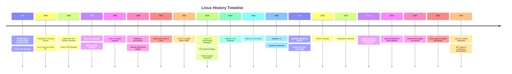
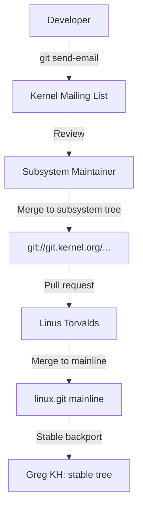

# Linux History: 1991 to Present

The history of Linux is one of the most remarkable stories in computing. What began as a Finnish student's hobby project became the most widely deployed operating system kernel in the world, running everything from smartphones to the International Space Station. This chapter traces that journey from its origins to the present day.

## Prehistory: The Soil Before the Seed

To understand Linux, you must first understand what came before it. By the late 1980s, the computing landscape was shaped by several forces:

### The Unix Wars

AT&T's Unix had fragmented into competing proprietary versions: Sun's Solaris, IBM's AIX, HP's HP-UX, DEC's Ultrix, and others. Each vendor added their own extensions, making Unix increasingly incompatible with itself. The Unix Wars of the late 1980s frustrated users and developers alike.

### The GNU Project

In 1983, Richard Stallman launched the [GNU Project](https://www.gnu.org/) with the goal of creating a complete free Unix-like operating system. By 1991, GNU had produced an impressive collection of tools:

- **GCC** (GNU Compiler Collection) — a C compiler
- **GNU Coreutils** — essential commands (`ls`, `cp`, `mv`, `cat`, etc.)
- **Bash** — the Bourne Again Shell
- **Glibc** — the GNU C Library
- **Emacs** — a text editor (and lifestyle)

What GNU lacked was a working kernel. Their kernel project, **GNU Hurd**, was based on the Mach microkernel and was (and still is) perpetually incomplete. This gap is what Linux would fill.

### MINIX

Andrew Tanenbaum created MINIX in 1987 as a teaching tool for his textbook *Operating Systems: Design and Implementation*. MINIX was a small, Unix-like operating system designed to run on IBM PCs. It was source-available but not freely modifiable — Tanenbaum kept tight control over the code to maintain its usefulness as a teaching tool.

This frustrated many MINIX users, including a Finnish university student named Linus Torvalds.

## 1991: The Birth of Linux

### A Terminal Emulator That Grew

Linus Torvalds was a 21-year-old computer science student at the University of Helsinki. In early 1991, he purchased an Intel 386-based PC and began programming a terminal emulator to access the university's Unix server. The terminal emulator evolved to include disk drivers, then a filesystem, then a process scheduler.

On August 25, 1991, Torvalds posted his famous announcement to the `comp.os.minix` Usenet newsgroup:

```
From: torvalds@klaava.Helsinki.FI (Linus Benedict Torvalds)
Newsgroups: comp.os.minix
Subject: What would you like to see most in minix?
Date: 25 Aug 91 20:57:08 GMT

Hello everybody out there using minix -

I'm doing a (free) operating system (just a hobby, won't be big and
professional like gnu) for 386(486) AT clones. This has been brewing
since april, and is starting to get ready. I'd like any feedback on
things people like/dislike in minix, as my OS resembles it somewhat
(same physical layout of the file-system (due to practical reasons)
among other things).

I've currently ported bash(1.08) and gcc(1.40), and things seem to work.
This implies that I'll get something practical within a few months, and
I'd like to know what features most people would want. Any suggestions
are welcome, but I won't promise I'll implement them :-)

                Linus (torvalds@kruuna.helsinki.fi)
```

### Version 0.01 and 0.02

Linux 0.01 was released in September 1991. It could barely do anything — it could run `bash` and `gcc` (both from the GNU project), but very little else. Version 0.02 followed in October, adding basic utilities.

### Version 0.95 and the GPL

In December 1991, Linux 0.10 was released. By March 1992, version 0.95 was released under the **GNU General Public License (GPL)**. This was a crucial decision — the GPL ensured that Linux would remain free software forever, and it attracted a community of developers who knew their contributions would stay open.

### The Early Development Environment

The early Linux development process was remarkably informal:

- **Communication**: Usenet newsgroups (`comp.os.minix`, later `alt.os.linux`)
- **Code exchange**: FTP servers and email patches
- **Version control**: None initially — Torvalds manually merged patches
- **Build system**: Simple Makefiles, no configuration system
- **Testing**: Developers tested on their own hardware

```bash
# What Linux 0.01 looked like (September 1991)
$ ls linux-0.01/
Makefile    boot/       fs/         include/    init/       kernel/     lib/        mm/

# The entire kernel was about 10,000 lines of C
$ wc -l linux-0.01/kernel/*.c
  10000 total (approximate)
```

The kernel grew rapidly:

| Version | Year | Lines of Code |
|---|---|---|
| 0.01 | 1991 | ~10,000 |
| 1.0 | 1994 | ~176,000 |
| 2.0 | 1996 | ~400,000 |
| 2.6 | 2003 | ~5,000,000 |
| 3.0 | 2011 | ~14,000,000 |
| 6.0 | 2022 | ~30,000,000 |

## 1992–1993: The Tanenbaum–Torvalds Debate and the First Distros

### The Great Debate

In January 1992, Andrew Tanenbaum and Linus Torvalds engaged in a legendary public debate on `comp.os.minix`. Tanenbaum argued that:

- Monolithic kernels were obsolete
- Microkernels were the future
- Linux was a "giant step back into the 1970s"
- In a few years, Linux would be replaced by a microkernel-based system

Torvalds responded that:

- Linux was practical and worked well
- Performance mattered more than theoretical elegance
- He was building something people could actually use
- "Your langstr[1] is wrong. You're a professor, you should know better."

The debate is worth reading in full — it's a snapshot of early-90s OS design philosophy. Tanenbaum was theoretically right about many things, but Torvalds was pragmatically right about what the market wanted.

### The First Distributions

1993 saw the birth of the first Linux distributions:

- **Slackware** (July 1993) — Created by Patrick Volkerding, one of the oldest surviving distros
- **Debian** (August 1993) — Created by Ian Murdock, named after himself and his girlfriend Debra

These distros solved a critical problem: installing Linux in 1993 required manually formatting disks, compiling kernels, and configuring everything from scratch. Distributions packaged it all together on floppy disks (and later CDs).

## 1994: Linux 1.0 and Red Hat

### The 1.0 Release

On March 14, 1994, Linux 1.0 was released. This was the first version Torvalds considered production-ready. It supported:

- 32-bit x86 processors (386 and above)
- TCP/IP networking
- Various filesystems (ext2, Minix, MS-DOS FAT)
- Loadable kernel modules

### Red Hat Linux

Also in 1994, Marc Ewing released Red Hat Linux, which would become one of the most influential distributions in history. Red Hat introduced the **RPM Package Manager** (originally Red Hat Package Manager), a structured system for installing, updating, and removing software.

## 1995–1999: Growth and the Dot-Com Era

### Key Developments

| Year | Event |
|------|-------|
| 1995 | Linux 1.2 released; Apache HTTP Server project begins |
| 1996 | Linux 2.0 released — first version supporting multiple CPUs (SMP) |
| 1996 | Torvalds trademarked the "Linux" name (later transferred to Linux Mark Institute) |
| 1997 | The "Halloween Documents" leaked — internal Microsoft memos acknowledging Linux as a threat |
| 1998 | Eric Raymond published "The Cathedral and the Bazaar" about open-source development |
| 1998 | Netscape open-sourced its browser → Mozilla project |
| 1999 | Red Hat and VA Linux had record-breaking IPOs during the dot-com boom |

### The Server Room

During the late 1990s, Linux became increasingly popular in server rooms. The combination of Apache (the dominant web server), Linux, MySQL, and PHP/Perl/Python became known as the **LAMP stack** and powered much of the early web.

## 2000–2003: The Desktop Dream and Corporate Adoption

### The Desktop Push

In 2000–2004, several efforts attempted to bring Linux to the desktop:

- **Ximian** (2000) — Created GNOME improvements, later acquired by Novell
- **Lindows/Linspire** (2001) — Attempted to run Windows apps on Linux (sued by Microsoft)
- **Xandros** (2002) — Commercial desktop Linux distribution

### IBM's Billion-Dollar Bet

In 2000, IBM announced it would invest **$1 billion** in Linux development. This was a massive vote of confidence from a major corporation and signaled that Linux was ready for enterprise use. IBM ported Linux to its mainframe (s390x) and midrange (PowerPC) platforms.

### The SCO Lawsuit

In 2003, SCO Group (which had acquired the rights to Unix) sued IBM for $1 billion, claiming that Linux contained copyrighted Unix code. The lawsuit dragged on for years, creating uncertainty around Linux adoption. SCO ultimately lost — the courts found that Novell, not SCO, owned the Unix copyrights, and that SCO's claims were baseless. The lawsuit ironically helped Linux by demonstrating that its codebase was legally clean.

### The 2.4 Kernel (2001)

Linux 2.4, released in January 2001, was a major milestone:

- Improved SMP support (up to 8 CPUs)
- USB support
- Improved networking (iptables/nftables replacing ipchains)
- Better filesystem support
- Enterprise-ready features

## 2004–2010: Ubuntu, Android, and the Cloud

### Ubuntu Changes Everything

In October 2004, Mark Shuttleworth and Canonical released **Ubuntu 4.10** ("Warty Warthog"). Based on Debian, Ubuntu aimed to be "Linux for human beings" — easy to install, easy to use, with a regular release cycle (every 6 months). Ubuntu rapidly became the most popular desktop distribution and remains so today.

Key Ubuntu innovations:

- **Predictable release schedule**: Every 6 months (April and October)
- **LTS releases**: Long-term support versions every 2 years with 5 years of support
- **Live CD**: Run the OS from a CD without installing
- **Easy installer**: The Ubiquity installer made installation accessible to everyone
- **Ubuntu Software Center**: Graphical software installation

### Android

In 2005, Google acquired Android Inc. In 2008, the first Android phone (the HTC Dream/T-Mobile G1) shipped. Android uses a modified Linux kernel, and by 2024, Android runs on over 3 billion devices worldwide. This makes the Linux kernel the most widely deployed kernel in history by a huge margin.

### The 2.6 Kernel Era

Linux 2.6, released in December 2003, was a watershed release:

- Completely new scheduler (O(1) scheduler, later replaced by CFS)
- Improved support for large systems (NUMA, more CPUs)
- Kernel preemption for better desktop responsiveness
- Improved I/O scheduling
- ACLs for filesystems
- SELinux integration
- The kernel moved to a time-based release model (no more multi-year gaps)

### The Cloud Era

Amazon Web Services launched EC2 in 2006, and Linux was the primary OS for cloud instances from the start. The cloud era cemented Linux as the default server operating system. By the 2010s, most new servers deployed worldwide ran Linux.

## 2011–2015: systemd, Containers, and the 3.x/4.x Kernels

### The systemd Controversy

In 2010, Lennart Poettering introduced **systemd**, a new init system to replace SysV init. systemd was controversial because:

- It was much larger and more complex than traditional init systems
- It took on responsibilities beyond init (logging, network management, etc.)
- It went against the Unix philosophy of small, focused tools
- Major distributions adopted it rapidly, often without community consensus

Despite the controversy, systemd became the default init system in most major distributions: Fedora (2011), Ubuntu (2015), Debian (2015).

### The Container Revolution

Linux containers, enabled by **cgroups** (introduced in kernel 2.6.24, 2008) and **namespaces**, transformed how software is deployed:

- **Docker** (2013) — Made containers accessible to developers
- **Kubernetes** (2014, by Google) — Container orchestration at scale
- **LXC/LXD** — System containers

These technologies are built entirely on Linux kernel features and have reshaped the entire software industry.

### Kernel Version Numbering Change

In 2011, Torvalds changed the kernel versioning scheme. After Linux 2.6.39, the next version was **3.0** — not because of a major technical change, but to simplify version numbers. The pattern continued: 3.x, then 4.x, then 5.x, then 6.x, with major version bumps every ~2 months driven by time rather than feature milestones.

## 2016–2020: Spectre, Meltdown, and Maturity

### Hardware Vulnerabilities

In 2018, the **Spectre** and **Meltdown** vulnerabilities were disclosed — fundamental flaws in CPU speculative execution that affected virtually all modern processors. Linux developers worked around the clock to develop mitigations, and the experience highlighted both the kernel's importance and the complexity of modern hardware.

Other notable CPU vulnerabilities included:

- **Spectre v1, v2** (2018)
- **Meltdown** (2018)
- **L1TF / Foreshadow** (2018)
- **MDS** (2019)
- **ZombieLoad** (2019)

### Key Kernel Features (5.x era)

| Version | Year | Notable Features |
|---------|------|-----------------|
| 5.0 | 2019 | Energy-aware scheduling for big.LITTLE CPUs |
| 5.1 | 2019 | Persistent memory support improvements |
| 5.4 | 2019 | exFAT filesystem support, lockdown mode |
| 5.6 | 2020 | WireGuard VPN merged into the kernel |
| 5.8 | 2020 | BPF ring buffers, support for Microsoft exFAT |
| 5.10 | 2020 | LTS release (supported until 2026) |

### WireGuard

In 2020, the **WireGuard** VPN protocol was merged into the Linux kernel (5.6). Created by Jason Donenfeld, WireGuard is a modern, high-performance VPN that replaced the complex and aging IPsec and OpenVPN implementations for many use cases. Its inclusion in the mainline kernel was a major milestone.

## 2021–Present: Rust, eBPF, and the 6.x Era

### Rust in the Kernel

In 2022, Linux 6.1 merged initial **Rust language support** for kernel development. This was a historic moment — for the first time, a language other than C could be used for core kernel code. The motivation was memory safety: Rust's ownership model prevents entire categories of bugs (buffer overflows, use-after-free, data races) that plague C code.

As of 2024, Rust support is still early, with only a few subsystems (like the Apple GPU driver by Asahi Linux) using Rust. But the long-term plan is to gradually expand Rust's footprint.

### eBPF

**eBPF** (extended Berkeley Packet Filter) has become one of the most transformative Linux technologies. Originally designed for packet filtering, eBPF allows running sandboxed programs inside the kernel without modifying kernel source code or loading kernel modules. Use cases include:

- Network monitoring and filtering
- Security observability
- Performance tracing
- Container networking (Cilium)

### Key 6.x Kernel Features

| Version | Year | Notable Features |
|---------|------|-----------------|
| 6.0 | 2022 | NVMe improvements, BPF improvements |
| 6.1 | 2022 | Rust support, MGLRU (multi-gen LRU page reclaim) |
| 6.3 | 2023 | User-mode BPF programs, io_uring improvements |
| 6.5 | 2023 | Wi-Fi 7 support, Landlock improvements |
| 6.6 | 2023 | EEVDF scheduler replacing CFS |
| 6.7 | 2024 | bcachefs filesystem merged |
| 6.10 | 2024 | Continued Rust expansion |

### The EEVDF Scheduler

In Linux 6.6, the **EEVDF** (Earliest Eligible Virtual Deadline First) scheduler replaced the **CFS** (Completely Fair Scheduler) that had been the default since 2007. EEVDF provides better latency characteristics for interactive workloads while maintaining fairness.

## Timeline Summary



## Key People

| Person | Contribution |
|--------|-------------|
| **Linus Torvalds** | Created Linux kernel, still maintains it |
| **Richard Stallman** | Founded GNU Project, wrote GPL |
| **Andrew Tanenbaum** | Created MINIX, inspired Torvalds |
| **Alan Cox** | Major kernel contributor (networking, SMP) |
| **Ingo Molnár** | Scheduler (CFS, EEVDF), kernel tracing |
| **Greg Kroah-Hartman** | Stable kernel maintainer, driver subsystem |
| **David Miller** | Networking subsystem maintainer |
| **Lennart Poettering** | systemd, PulseAudio, Avahi |
| **Mark Shuttleworth** | Founded Canonical/Ubuntu |
| **Patrick Volkerding** | Created Slackware |
| **Ian Murdock** | Created Debian |
| **Marc Ewing** | Co-founded Red Hat |

## The BitKeeper Saga and the Birth of Git

For several years, the Linux kernel used **BitKeeper**, a proprietary distributed version control system, for free. In 2005, the license was revoked after Andrew Tridgell (of Samba fame) reverse-engineered the BitKeeper protocol. This forced Torvalds to create a replacement.

In just **two weeks** (April 3–20, 2005), Torvalds wrote the initial version of **Git**. He later handed maintenance to Junio Hamano, who remains the primary maintainer.

Git's design goals were:
- **Distributed**: Every developer has a full repository copy
- **Fast**: The kernel tree is enormous (~30 million lines)
- **Cryptographic integrity**: Every commit is SHA-1 (later SHA-256) hashed
- **Support for non-linear development**: Thousands of parallel branches

```bash
# The Linux kernel git repository
$ git clone https://git.kernel.org/pub/scm/linux/kernel/git/torvalds/linux.git

# Count commits (as of 2024)
$ git rev-list --count HEAD
1000000+

# First commit
$ git log --reverse --oneline | head -1
initial import of Linux-0.01 (Linus Torvalds)

# Linus's commit frequency
$ git shortlog -sn --all | head -5
```

Git went on to become the dominant version control system in the world, powering GitHub, GitLab, and virtually all open-source projects.

## The GPLv2 vs GPLv3 Debate

When the Free Software Foundation released GPLv3 in 2007, Torvalds made the deliberate decision to keep the kernel under **GPLv2 only**. His concerns included:

- **Anti-DRM provisions**: GPLv3's anti-tivoization clause would restrict how hardware manufacturers could use Linux in locked-down devices (like Android phones)
- **Compatibility**: GPLv3 is incompatible with GPLv2-only code
- **Complexity**: GPLv3 is much longer and more complex than GPLv2

The kernel license was clarified with an explicit statement:

```
This program is free software; you can redistribute it and/or modify
it under the terms of the GNU General Public License version 2 as
published by the Free Software Foundation.
```

This decision enabled Linux's adoption in embedded devices, Android, and IoT — areas where GPLv3's restrictions would have been problematic.

## The SCO Lawsuit (2003–2016)

In 2003, **SCO Group** (which had acquired Unix System V rights from Novell) sued IBM for $1 billion, claiming Linux contained copyrighted Unix code. The lawsuit was one of the most significant legal challenges in open-source history.

### Timeline

| Year | Event |
|---|---|
| 2003 | SCO sues IBM, claims Linux contains Unix code |
| 2003 | SCO sends letters to Fortune 500 companies demanding Linux licenses |
| 2004 | Novell countersues SCO, claiming it never sold Unix copyrights |
| 2007 | Court rules Novell owns Unix copyrights, not SCO |
| 2010 | SCO files for bankruptcy |
| 2016 | Final resolution: SCO's claims entirely dismissed |

The lawsuit ultimately **helped** Linux by demonstrating that the codebase was legally clean and that the development process was transparent.

## Corporate Involvement

Linux's growth was fueled by increasing corporate investment:

### Key Corporate Contributions

| Company | Contribution | Year |
|---|---|---|
| **IBM** | $1 billion investment, mainframe Linux | 2000 |
| **Red Hat** | Enterprise Linux, major kernel contributions | 1994–present |
| **Google** | Android, KVM contributions, BPF | 2005–present |
| **Intel** | Driver contributions, x86 optimization | 1999–present |
| **Microsoft** | WSL, Azure Linux, Hyper-V drivers | 2015–present |
| **Samsung** | ARM/mobile contributions | 2005–present |
| **SUSE** | Enterprise Linux, Btrfs | 2000–present |
| **Canonical** | Ubuntu, Snap packages | 2004–present |
| **Facebook/Meta** | cgroup2, BPF, memory management | 2011–present |
| **Amazon** | AWS-specific drivers, Graviton support | 2006–present |

### Microsoft's Relationship with Linux

Microsoft's evolution from Linux opponent to contributor is one of the most remarkable shifts in tech history:

```
2001: Steve Ballmer calls Linux "a cancer"
2006: Microsoft partners with Novell (Linux interoperability)
2014: Satya Nadella says "Microsoft loves Linux"
2015: Microsoft joins the Linux Foundation
2016: Windows Subsystem for Linux (WSL) announced
2018: Microsoft acquires GitHub ($7.5B)
2020: Microsoft ships its own Linux kernel (WSL2)
2024: Azure runs more Linux than Windows Server instances
```

## Linux by the Numbers (2024)

- **Lines of code**: ~30 million (kernel alone)
- **Contributors**: 20,000+ individual developers since 1991
- **Companies**: 1,700+ companies have contributed to the kernel
- **Commits**: 1,000,000+ commits in the git history
- **TOP500 supercomputers**: 100% run Linux
- **Android devices**: 3+ billion active devices
- **Web servers**: ~80% run Linux

## The Linux Foundation and Governance

The **Linux Foundation** (formed in 2000 from the merger of OSDL and the Free Standards Group) provides legal, financial, and organizational support for Linux development. Key roles:

- Employs Linus Torvalds and other key maintainers
- Hosts kernel summits and conferences
- Manages trademark and legal issues
- Funds critical infrastructure (kernel.org, CI systems)

### The Benevolent Dictator Model

Linux development follows a **benevolent dictator** model:

1. **Linus Torvalds** makes final decisions on all code merged into the mainline
2. **Subsystem maintainers** (100+) review and forward patches to Torvalds
3. **Patch flow**: Developer → Subsystem tree → linux-next → Mainline
4. All changes go through public mailing list review



### The -rc and Stable Process

```
mainline:     v6.12 → v6.12-rc1 → ... → v6.12-rc7 → v6.13-rc1 → ...
stable:       v6.12.1 → v6.12.2 → ... (bug fixes only)
longterm:     v6.6.1 → v6.6.2 → ... (2-6 year support)
```

Long-term support (LTS) kernels are maintained for extended periods:

| Version | Released | EOL |
|---|---|---|
| 5.4 | Dec 2019 | Dec 2025 |
| 5.10 | Dec 2020 | Dec 2026 |
| 5.15 | Oct 2021 | Dec 2026 |
| 6.1 | Dec 2022 | Dec 2026 |
| 6.6 | Oct 2023 | Dec 2026 |

## References and Further Reading

- [The Linux Kernel Documentation](https://docs.kernel.org/)
- [GNU Project Documentation](https://www.gnu.org/doc/doc.html)
- [GNU Manuals](https://www.gnu.org/manual/manual.html)
- [Free Software Directory](https://directory.fsf.org/wiki/Main_Page)
- [Planet GNU](https://planet.gnu.org/)
- [Free Software Books](https://www.gnu.org/doc/other-free-books.html)

- [The Linux Kernel Archives](https://www.kernel.org/) — Official kernel releases and history
- [Linux Kernel Git Repository](https://git.kernel.org/pub/scm/linux/kernel/git/torvalds/linux.git) — Complete source history
- [LWN.net](https://lwn.net/) — The best source for Linux kernel news since 1998
- [Kernel Newbies](https://kernelnewbies.org/LinuxChanges) — Summarized kernel changes for each release
- [The Linux Kernel documentation](https://www.kernel.org/doc/html/latest/process/development-process.html) — How kernel development works
- [A History of Linux](https://www.tldp.org/HOWTO/html_single/HOWTO-INDEX/) — The Linux Documentation Project
- [Original comp.os.minix post](https://groups.google.com/g/comp.os.minix/c/dlNtH7RRrGA/m/SwRavCzVE7gJ) — The message that started it all
- [Tanenbaum-Torvalds Debate (full text)](https://www.oreilly.com/openbook/opensources/book/appa.html) — The classic 1992 debate
- [Linux Foundation Annual Report](https://www.linuxfoundation.org/) — Industry statistics and trends

## Related Topics

- [What Is Linux?](./what-is-linux.md) — Technical overview of the Linux kernel
- [Unix Heritage](./unix-heritage.md) — The traditions Linux inherited
- [Distributions](./distributions.md) — The many flavors of Linux
