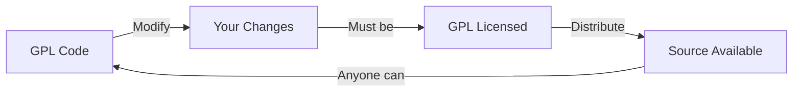
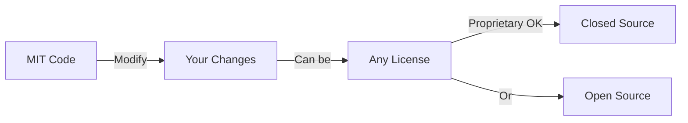
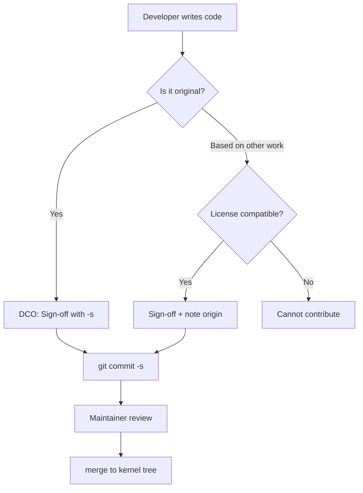

# Software Licensing in the Linux Ecosystem

## Introduction

Software licensing is the legal backbone of the open-source ecosystem. Every piece of software distributed in a Linux system carries a license that defines how it may be used, modified, and redistributed. Understanding licensing is essential for kernel developers, distribution maintainers, and anyone deploying Linux in production. A single licensing mistake can create legal liability, block distribution, or force costly rewrites.

The Linux kernel itself is licensed under **GPL v2**—a deliberate choice made by Linus Torvalds in 1991. This decision shaped the entire ecosystem: every kernel module, every driver, and every patch must be compatible with that license. The licensing landscape around the kernel is a tapestry of copyleft and permissive licenses, each with different obligations.

## Copyleft vs Permissive Licenses

The fundamental divide in open-source licensing is between **copyleft** and **permissive** licenses.

### Copyleft

Copyleft licenses require that derivative works be distributed under the same (or a compatible) license. When you modify GPL-licensed code and distribute the result, you must also release your modifications under the GPL. This "viral" property ensures that freedom propagates through all downstream versions.



### Permissive

Permissive licenses impose minimal restrictions. You can incorporate permissively-licensed code into proprietary products without releasing your source code. The MIT, BSD, and Apache licenses fall into this category.



### Comparison Table

| Feature | GPL v2 | GPL v3 | LGPL | MIT | BSD 2/3-Clause | Apache 2.0 |
|---------|--------|--------|------|-----|----------------|------------|
| Copyleft | Strong | Strong | Weak | No | No | No |
| Patent grant | No | Yes | No | No | No | Yes |
| Anti-Tivoization | No | Yes | No | No | No | No |
| Compatible with GPL v2 | — | No* | Yes | Yes | Yes | No |
| Compatible with GPL v3 | Yes | — | Yes | Yes | Yes | Yes |
| Attribution required | Yes | Yes | Yes | Yes | Yes | Yes |

\* GPL v3 is not directly compatible with GPL v2-only code (the "or later" clause bridges this).

## The GPL Family

### GNU General Public License v2 (GPL v2)

Released in 1991 by the Free Software Foundation, GPL v2 is the license of the Linux kernel. Its key terms:

- **Source code obligation**: Anyone who distributes GPL v2 binaries must also make the corresponding source code available.
- **Derivative works**: Modified versions must also be GPL v2.
- **No additional restrictions**: You cannot add further restrictions beyond those in the license.

The kernel uses GPL v2 **without the "or later" clause**, which is significant. This means the kernel cannot be relicensed under GPL v3 without consent from every copyright holder—a practically impossible task given the thousands of contributors.

```
/* SPDX-License-Identifier: GPL-2.0 */
```

The famous preamble:

> The licenses for most software are designed to take away your freedom to share and change it. By contrast, the GNU General Public License is intended to guarantee your freedom to share and change free software.

### GNU General Public License v3 (GPL v3)

Released in 2007 after extensive consultation, GPL v3 added:

- **Anti-Tivoization**: Hardware that runs GPL v3 software must allow users to install modified versions. This was a direct response to TiVo's use of Linux in locked-down devices.
- **Patent protection**: Contributors explicitly grant patent licenses for their contributions.
- **International compatibility**: Better handling of different copyright regimes.
- **DRM clarification**: Provisions against using DMCA-style laws to circumvent GPL rights.

The Linux kernel's refusal to adopt GPL v3 remains one of the most significant licensing decisions in open source. Linus Torvalds argued that anti-Tivoization would discourage hardware vendors from adopting Linux.

### GNU Lesser General Public License (LGPL)

The LGPL (currently version 2.1 or 3.0) is a weaker copyleft primarily used for libraries:

- Software can **link** against LGPL libraries without being subject to copyleft.
- Modifications to the LGPL library itself must be shared.
- Dynamically linking (shared libraries) satisfies the obligation; static linking requires providing object files.

Common LGPL users in the Linux ecosystem: glibc, GTK, Qt (in some configurations).

```
/* SPDX-License-Identifier: LGPL-2.1 */
```

## Permissive Licenses

### MIT License

The MIT License is one of the most permissive and widely used:

```
Permission is hereby granted, free of charge, to any person obtaining a copy
of this software and associated documentation files (the "Software"), to deal
in the Software without restriction, including without limitation the rights
to use, copy, modify, merge, publish, distribute, sublicense, and/or sell
copies of the Software.
```

Key characteristics:
- No copyleft—code can be relicensed under any terms.
- No patent grant.
- Minimal obligation: include the copyright notice and license text.

Used by: X11, curl, many npm/Python packages.

### BSD Licenses

The BSD family includes:

- **BSD 2-Clause** (Simplified): Attribution + no endorsement.
- **BSD 3-Clause**: Adds "no endorsement" clause (cannot use the author's name to promote derived products).
- **BSD 4-Clause** (Original): Adds advertising clause (now largely obsolete).

```
Redistribution and use in source and binary forms, with or without
modification, are permitted provided that the following conditions are met:
1. Redistributions of source code must retain the above copyright notice.
2. Redistributions in binary form must reproduce the above copyright notice.
```

### Apache License 2.0

The Apache 2.0 license is the most comprehensive permissive license:

- **Explicit patent grant**: Contributors grant a perpetual, worldwide, royalty-free patent license.
- **Patent retaliation clause**: If you sue someone over patents related to the software, your patent license terminates.
- **NOTICE file**: Must preserve attribution notices.
- **GPL v3 compatible** (but not GPL v2 compatible—this is a notable issue).

Used by: The Linux kernel (for some subsystems), Android (userspace), Kubernetes, TensorFlow.

```
/* SPDX-License-Identifier: Apache-2.0 */
```

## SPDX Identifiers

The **Software Package Data Exchange (SPDX)** specification standardizes license identification. The Linux kernel adopted SPDX headers in kernel 4.14+ (2017), replacing verbose license boilerplate with machine-readable identifiers.

### Common SPDX Identifiers in the Kernel

```c
/* SPDX-License-Identifier: GPL-2.0 */          /* GPL v2 only */
/* SPDX-License-Identifier: GPL-2.0+ */         /* GPL v2 or later */
/* SPDX-License-Identifier: GPL-2.0-only */     /* GPL v2 only (explicit) */
/* SPDX-License-Identifier: GPL-2.0-or-later */ /* GPL v2 or later (explicit) */
/* SPDX-License-Identifier: GPL-2.0 WITH Linux-syscall-note */
/* SPDX-License-Identifier: (GPL-2.0 OR BSD-2-Clause) */  /* Dual license */
/* SPDX-License-Identifier: MIT */
/* SPDX-License-Identifier: Apache-2.0 */
```

The kernel's `LICENSES/` directory (added in 4.14) contains the full text of each license used:

```
LICENSES/
├── preferred/          # Recommended licenses
│   ├── GPL-2.0
│   ├── MIT
│   └── ...
├── deprecated/         # Acceptable but discouraged
│   └── GPL-2.0
└── exceptions/         # License exceptions
    └── Linux-syscall-note
```

### Checking License Compliance

The kernel provides tools for license checking:

```bash
# Check all SPDX headers in the kernel tree
scripts/spdxcheck.py

# Find files without SPDX headers
grep -rL "SPDX-License-Identifier" --include="*.c" .

# Verify license compatibility
scripts/checkpatch.pl --strict file.c
```

## Contributor License Agreements (CLA)

A **Contributor License Agreement** is a legal document that defines the terms under which contributions are made to a project. CLAs are distinct from the software license itself.

### Why CLAs Exist

1. **Copyright assignment**: Some organizations require that contributors assign copyright to the project steward (e.g., FSF requires copyright assignment for GNU projects).
2. **License grant**: Contributors grant the project a broad license to use their contribution, while retaining copyright.
3. **Legal protection**: Provides a clear legal trail for every contribution.
4. **License flexibility**: Allows the project to relicense if needed.

### Types of CLAs

| Type | Description | Example |
|------|-------------|---------|
| Copyright Assignment | Contributor transfers copyright | FSF, Canonical (historical) |
| Contributor License Agreement | Contributor grants broad license | Google (Android), Apache Foundation |
| Developer Certificate of Origin | No CLA, just a sign-off | Linux Kernel |

### The Linux Kernel: DCO Instead of CLA

The Linux kernel uses the **Developer Certificate of Origin (DCO)** instead of a CLA. Introduced in 2004 after the SCO litigation, the DCO is a simple statement:

```
Developer's Certificate of Origin 1.1

By making a contribution to this project, I certify that:

(a) The contribution was created in whole or in part by me and I
    have the right to submit it under the open source license
    indicated in the file; or

(b) The contribution is based upon previous work that, to the best
    of my knowledge, is covered under an appropriate open source
    license and I have the right under that license to submit that
    work with modifications, whether created in whole or in part
    by me, under the same open source license (unless I am
    permitted to submit under a different license), as indicated
    in the file; or

(c) The contribution was provided directly to me by some other
    person who certified (a), (b) or (c) and I have not modified it.

(d) I understand and agree that this project and the contribution
    are public and that a record of the contribution (including all
    personal information I submit with it, including my sign-off) is
    maintained indefinitely and may be redistributed consistent with
    this project or the open source license(s) involved.
```

Developers indicate acceptance by adding a `Signed-off-by` line to their commit messages:

```
Signed-off-by: Developer Name <developer@example.com>
```



## License Compatibility

Not all open-source licenses are compatible. Combining incompatible licenses in a single work creates legal problems.

### GPL v2 Compatibility Matrix

```
                GPL-2.0  MIT  BSD-2  Apache-2.0  LGPL-2.1  MPL-2.0
GPL-2.0           ✓      ✓     ✓       ✗          ✓        ✗
MIT                ✓      ✓     ✓       ✓          ✓        ✓
BSD-2-Clause       ✓      ✓     ✓       ✓          ✓        ✓
Apache-2.0         ✗      ✓     ✓       ✓          ✗        ✓
LGPL-2.1           ✓      ✓     ✓       ✗          ✓        ✗
MPL-2.0            ✗      ✓     ✓       ✓          ✗        ✓
```

The incompatibility between GPL v2 and Apache 2.0 is a real-world issue. Code from Apache-licensed projects cannot be merged into the Linux kernel without relicensing.

### Dual Licensing

Some projects offer dual licensing to maximize compatibility:

```c
/* SPDX-License-Identifier: (GPL-2.0 OR MIT) */
```

This means the recipient can choose either license. Common in device drivers contributed by hardware vendors who want their code usable in both GPL and permissive contexts.

## U-Boot and Other Bootloader Licensing

Bootloaders like U-Boot use GPL v2+ (GPL v2 or later). This creates interesting interactions when bootloaders pass data structures (like device trees) to the kernel—these structures are generally considered data, not derivative works.

## Proprietary Kernel Modules

The legality of proprietary (closed-source) kernel modules is one of the most contentious licensing questions in Linux. The kernel exports symbols with explicit markers:

```c
EXPORT_SYMBOL(func);           /* Available to all modules */
EXPORT_SYMBOL_GPL(func);       /* Available only to GPL-compatible modules */
```

The `MODULE_LICENSE()` declaration determines which symbols a module can access:

```c
MODULE_LICENSE("GPL");              /* Can use GPL-only symbols */
MODULE_LICENSE("Proprietary");      /* Cannot use GPL-only symbols */
MODULE_LICENSE("GPL v2");           /* Can use GPL-only symbols */
MODULE_LICENSE("Dual BSD/GPL");     /* Can use GPL-only symbols */
```

The legal question of whether a kernel module that links against internal kernel APIs constitutes a "derivative work" under copyright law remains unsettled. The kernel community's position (expressed by COPYING) is that modules using internal headers are likely derivative works, but this has never been tested in court.

## Licensing Best Practices

1. **Always include SPDX headers** in source files.
2. **Check compatibility** before combining code from different projects.
3. **Record license provenance** in commit messages when porting code.
4. **Use the kernel's LICENSES/ directory** as a reference.
5. **Consult a lawyer** for complex licensing situations—this chapter is educational, not legal advice.

## Further Reading

- [Kernel COPYING file](https://docs.kernel.org/process/license-rules.html) — Official kernel licensing rules
- [SPDX License List](https://spdx.org/licenses/) — Complete list of SPDX identifiers
- [GNU Licenses](https://www.gnu.org/licenses/licenses.html) — FSF's license texts and FAQ
- [Choose a License](https://choosealicense.com/) — Practical license selection guide
- [LWN: GPL compatibility](https://lwn.net/Articles/739483/) — Analysis of GPL v2 compatibility issues
- [Developer Certificate of Origin](https://developercertificate.org/) — Full DCO text
- [kernel-doc: license-rules](https://www.kernel.org/doc/html/latest/process/license-rules.html) — Kernel licensing documentation
