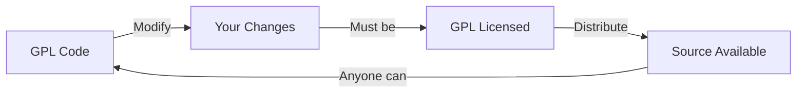
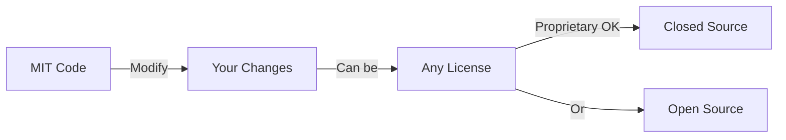
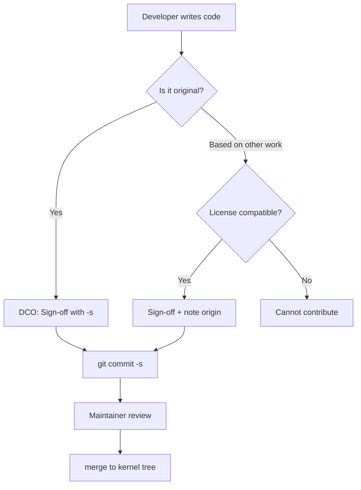
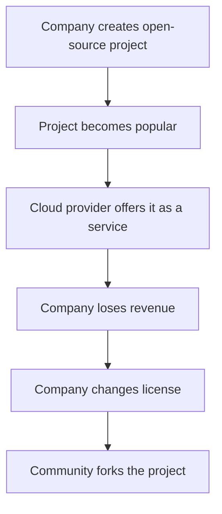
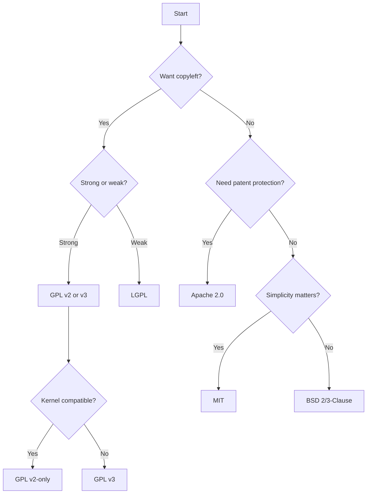

# Software Licensing in the Linux Ecosystem

## Introduction

Software licensing is the legal backbone of the open-source ecosystem. Every piece of software distributed in a Linux system carries a license that defines how it may be used, modified, and redistributed. Understanding licensing is essential for kernel developers, distribution maintainers, and anyone deploying Linux in production. A single licensing mistake can create legal liability, block distribution, or force costly rewrites.

The Linux kernel itself is licensed under **GPL v2** — a deliberate choice made by Linus Torvalds in 1991. This decision shaped the entire ecosystem: every kernel module, every driver, and every patch must be compatible with that license. The licensing landscape around the kernel is a tapestry of copyleft and permissive licenses, each with different obligations.

This chapter covers the major license families, their compatibility with each other, the practical implications for developers and distributors, and the ongoing debates that shape the licensing landscape.

---

## Copyleft vs Permissive Licenses

The fundamental divide in open-source licensing is between **copyleft** and **permissive** licenses.

### Copyleft

Copyleft licenses require that derivative works be distributed under the same (or a compatible) license. When you modify GPL-licensed code and distribute the result, you must also release your modifications under the GPL. This "viral" property ensures that freedom propagates through all downstream versions.



**The copyleft principle** is sometimes called "reciprocal licensing" — you receive freedom, and you must pass that freedom on to others. The FSF considers this the ethical way to build a software commons.

### Permissive

Permissive licenses impose minimal restrictions. You can incorporate permissively-licensed code into proprietary products without releasing your source code. The MIT, BSD, and Apache licenses fall into this category.



**The permissive philosophy** holds that maximizing adoption (including in proprietary software) benefits everyone. Code that is widely used — even in proprietary products — is more likely to be maintained and improved.

### Comparison Table

| Feature | GPL v2 | GPL v3 | LGPL | MIT | BSD 2/3-Clause | Apache 2.0 |
|---------|--------|--------|------|-----|----------------|------------|
| Copyleft | Strong | Strong | Weak | No | No | No |
| Patent grant | No | Yes | No | No | No | Yes |
| Anti-Tivoization | No | Yes | No | No | No | No |
| Compatible with GPL v2 | — | No* | Yes | Yes | Yes | No |
| Compatible with GPL v3 | Yes | — | Yes | Yes | Yes | Yes |
| Attribution required | Yes | Yes | Yes | Yes | Yes | Yes |
| Can be used proprietary | No | No | Partially | Yes | Yes | Yes |
| Trademark protection | No | No | No | No | Yes (3-clause) | No |

\* GPL v3 is not directly compatible with GPL v2-only code (the "or later" clause bridges this).

### When to Choose Which

**Choose copyleft (GPL) when:**
- You want to ensure all improvements remain open
- You're building a commons that should grow over time
- You want to prevent "free-riding" by proprietary competitors
- You're writing a library that should always remain free

**Choose permissive (MIT/BSD/Apache) when:**
- You want maximum adoption, including in proprietary software
- You're writing infrastructure that many projects will use
- You want corporate contributors who may have GPL concerns
- You're building a standard or reference implementation

---

## The GPL Family

### GNU General Public License v2 (GPL v2)

Released in 1991 by the Free Software Foundation, GPL v2 is the license of the Linux kernel. Its key terms:

- **Source code obligation**: Anyone who distributes GPL v2 binaries must also make the corresponding source code available.
- **Derivative works**: Modified versions must also be GPL v2.
- **No additional restrictions**: You cannot add further restrictions beyond those in the license.
- **No warranty**: The software is provided "as is" without warranty.

The kernel uses GPL v2 **without the "or later" clause**, which is significant. This means the kernel cannot be relicensed under GPL v3 without consent from every copyright holder — a practically impossible task given the thousands of contributors.

```
/* SPDX-License-Identifier: GPL-2.0 */
```

The famous preamble:

> The licenses for most software are designed to take away your freedom to share and change it. By contrast, the GNU General Public License is intended to guarantee your freedom to share and change free software.

#### Key Sections of GPL v2

| Section | Content |
|---------|---------|
| **Preamble** | Philosophy and intent |
| **Section 0** | Definitions (derivative work, etc.) |
| **Section 1** | Source code distribution requirements |
| **Section 2** | Modified source code requirements |
| **Section 3** | Binary distribution requirements |
| **Section 4** | Termination of rights upon violation |
| **Section 5** | Acceptance of license terms |
| **Section 6** | Distribution of license with software |
| **Section 7** | Additional restrictions prohibited |
| **Section 8** | Geographic limitations |
| **Section 9** | FSF may publish revised versions |

#### The "System Library" Exception

GPL v2 Section 3 contains an important exception: when distributing binaries, you don't need to provide source for "major components" of the operating system on which the binary runs (compiler, kernel, etc.). This prevents a situation where distributing a GPL binary would require providing the source for the entire operating system.

### GNU General Public License v3 (GPL v3)

Released in 2007 after extensive consultation, GPL v3 added:

- **Anti-Tivoization** (Section 6): Hardware that runs GPL v3 software must allow users to install modified versions. This was a direct response to TiVo's use of Linux in locked-down devices — TiVo ran Linux but cryptographically signed the kernel, preventing users from running modified versions.
- **Patent protection** (Section 11): Contributors explicitly grant patent licenses for their contributions. If you distribute GPL v3 code, you grant recipients a patent license for any patents you hold that are necessarily infringed by the code.
- **International compatibility** (Section 8): Better handling of different copyright regimes. The "liberty or death" clause ensures that if local laws restrict redistribution, the license terminates rather than allowing distribution under non-free terms.
- **DRM clarification** (Section 3): Provisions against using DMCA-style laws to circumvent GPL rights. GPL v3 explicitly states that it does not authorize circumvention of DRM, but also that GPL-covered code is not "anti-circumvention software."

The Linux kernel's refusal to adopt GPL v3 remains one of the most significant licensing decisions in open source. Linus Torvalds argued that anti-Tivoization would discourage hardware vendors from adopting Linux. His position was that hardware vendors should be free to create locked-down devices if they choose — the kernel's job is to run on as much hardware as possible.

### GNU Lesser General Public License (LGPL)

The LGPL (currently version 2.1 or 3.0) is a weaker copyleft primarily used for libraries:

- Software can **link** against LGPL libraries without being subject to copyleft.
- Modifications to the LGPL library itself must be shared.
- Dynamically linking (shared libraries) satisfies the obligation; static linking requires providing object files or the ability to relink.

Common LGPL users in the Linux ecosystem:

| Library | Purpose | LGPL Version |
|---------|---------|-------------|
| **glibc** | GNU C Library | LGPL v2.1+ |
| **GTK** | GUI toolkit (GNOME) | LGPL v2.1+ |
| **Qt** (open-source edition) | GUI toolkit (KDE) | LGPL v3 |
| **libvirt** | Virtualization API | LGPL v2.1+ |
| **GStreamer** | Multimedia framework | LGPL v2+ |
| **PulseAudio/PipeWire** | Audio servers | LGPL v2.1+ |

```
/* SPDX-License-Identifier: LGPL-2.1 */
```

### The "Or Later" Clause

Many GPL-licensed files include the phrase "or (at your option) any later version":

```
/* SPDX-License-Identifier: GPL-2.0-or-later */
```

This allows the code to be used under GPL v2, GPL v3, or any future GPL version. The Linux kernel specifically uses GPL v2 **without** this clause:

```
/* SPDX-License-Identifier: GPL-2.0 */
```

This distinction is critical — it means the kernel cannot be relicensed under GPL v3 without unanimous consent from all copyright holders.

---

## Permissive Licenses

### MIT License

The MIT License is one of the most permissive and widely used:

```
Permission is hereby granted, free of charge, to any person obtaining a copy
of this software and associated documentation files (the "Software"), to deal
in the Software without restriction, including without limitation the rights
to use, copy, modify, merge, publish, distribute, sublicense, and/or sell
copies of the Software.
```

Key characteristics:
- No copyleft — code can be relicensed under any terms.
- No patent grant.
- Minimal obligation: include the copyright notice and license text.
- Extremely simple and well-understood by lawyers.

Used by: X11, curl, many npm/Python packages, React, Vue.js, jQuery, Rails, Node.js.

The MIT License's simplicity makes it the most popular license on GitHub — over 50% of GitHub repositories use MIT.

### BSD Licenses

The BSD family includes:

- **BSD 2-Clause** (Simplified): Attribution + no endorsement.
- **BSD 3-Clause**: Adds "no endorsement" clause (cannot use the author's name to promote derived products).
- **BSD 4-Clause** (Original): Adds advertising clause (now largely obsolete; all modern BSDs have dropped it).

```
Redistribution and use in source and binary forms, with or without
modification, are permitted provided that the following conditions are met:
1. Redistributions of source code must retain the above copyright notice.
2. Redistributions in binary form must reproduce the above copyright notice.
```

Used by: FreeBSD, OpenBSD, NetBSD, nginx, Go (partially), LLVM/Clang.

### Apache License 2.0

The Apache 2.0 license is the most comprehensive permissive license:

- **Explicit patent grant** (Section 3): Contributors grant a perpetual, worldwide, royalty-free patent license.
- **Patent retaliation clause** (Section 3): If you sue someone over patents related to the software, your patent license terminates.
- **NOTICE file** (Section 4): Must preserve attribution notices.
- **NOT GPL v2 compatible** — this is a notable issue. Apache 2.0 code cannot be merged into the Linux kernel.
- **GPL v3 compatible** — Apache 2.0 code can be used in GPL v3 projects.

Used by: Android (userspace), Kubernetes, TensorFlow, Swift, Rust (dual licensed), many Apache Foundation projects.

```
/* SPDX-License-Identifier: Apache-2.0 */
```

The GPL v2 / Apache 2.0 incompatibility is a real-world problem. It means that Apache 2.0-licensed libraries cannot be directly linked into GPL v2-only programs (like the Linux kernel). This is one reason why many kernel-compatible projects use MIT or BSD licenses instead.

---

## SPDX Identifiers

The **Software Package Data Exchange (SPDX)** specification standardizes license identification. The Linux kernel adopted SPDX headers in kernel 4.14+ (2017), replacing verbose license boilerplate with machine-readable identifiers.

### Common SPDX Identifiers in the Kernel

```c
/* SPDX-License-Identifier: GPL-2.0 */          /* GPL v2 only (deprecated) */
/* SPDX-License-Identifier: GPL-2.0+ */         /* GPL v2 or later (deprecated) */
/* SPDX-License-Identifier: GPL-2.0-only */     /* GPL v2 only (explicit) */
/* SPDX-License-Identifier: GPL-2.0-or-later */ /* GPL v2 or later (explicit) */
/* SPDX-License-Identifier: GPL-2.0 WITH Linux-syscall-note */
/* SPDX-License-Identifier: (GPL-2.0 OR BSD-2-Clause) */  /* Dual license */
/* SPDX-License-Identifier: MIT */
/* SPDX-License-Identifier: Apache-2.0 */
/* SPDX-License-Identifier: (GPL-2.0-only OR Apache-2.0) */
```

The `WITH` operator adds an exception — `Linux-syscall-note` allows userspace code to include kernel headers without being subject to GPL copyleft.

### The Kernel's LICENSES/ Directory

The kernel's `LICENSES/` directory (added in 4.14) contains the full text of each license used:

```
LICENSES/
├── preferred/          # Recommended licenses
│   ├── GPL-2.0
│   ├── MIT
│   └── ...
├── deprecated/         # Acceptable but discouraged
│   └── GPL-2.0
└── exceptions/         # License exceptions
    └── Linux-syscall-note
```

### REUSE Compliance

The **REUSE** initiative (https://reuse.software/) provides guidelines for making licensing information machine-readable:

1. Every file must have a copyright notice and license identifier
2. Licenses must be in a `LICENSES/` directory
3. Use SPDX identifiers consistently

```bash
# Check REUSE compliance
$ reuse lint

# Add SPDX headers to new files
$ reuse addheader --copyright="Your Name <your@email.com>" \
    --license="GPL-2.0-only" path/to/file.c
```

### Checking License Compliance

The kernel provides tools for license checking:

```bash
# Check all SPDX headers in the kernel tree
$ scripts/spdxcheck.py

# Find files without SPDX headers
$ grep -rL "SPDX-License-Identifier" --include="*.c" .

# Verify license compatibility
$ scripts/checkpatch.pl --strict file.c
```

---

## Contributor License Agreements (CLA)

A **Contributor License Agreement** is a legal document that defines the terms under which contributions are made to a project. CLAs are distinct from the software license itself.

### Why CLAs Exist

1. **Copyright assignment**: Some organizations require that contributors assign copyright to the project steward (e.g., FSF requires copyright assignment for GNU projects).
2. **License grant**: Contributors grant the project a broad license to use their contribution, while retaining copyright.
3. **Legal protection**: Provides a clear legal trail for every contribution.
4. **License flexibility**: Allows the project to relicense if needed.

### Types of CLAs

| Type | Description | Example |
|------|-------------|---------|
| Copyright Assignment | Contributor transfers copyright to the project | FSF, Canonical (historical), Apache Foundation |
| Contributor License Agreement | Contributor grants broad license, retains copyright | Google (Android), Apache Foundation (ICLA) |
| Developer Certificate of Origin | No CLA, just a sign-off | Linux Kernel |
| No agreement | Contributions accepted under the project's license | Many small projects |

### The Linux Kernel: DCO Instead of CLA

The Linux kernel uses the **Developer Certificate of Origin (DCO)** instead of a CLA. Introduced in 2004 after the SCO litigation, the DCO is a simple statement:

```
Developer's Certificate of Origin 1.1

By making a contribution to this project, I certify that:

(a) The contribution was created in whole or in part by me and I
    have the right to submit it under the open source license
    indicated in the file; or

(b) The contribution is based upon previous work that, to the best
    of my knowledge, is covered under an appropriate open source
    license and I have the right under that license to submit that
    work with modifications, whether created in whole or in part
    by me, under the same open source license (unless I am
    permitted to submit under a different license), as indicated
    in the file; or

(c) The contribution was provided directly to me by some other
    person who certified (a), (b) or (c) and I have not modified it.

(d) I understand and agree that this project and the contribution
    are public and that a record of the contribution (including all
    personal information I submit with it, including my sign-off) is
    maintained indefinitely and may be redistributed consistent with
    this project or the open source license(s) involved.
```

Developers indicate acceptance by adding a `Signed-off-by` line to their commit messages:

```
Signed-off-by: Developer Name <developer@example.com>
```



### Why the Kernel Chose DCO Over CLA

The SCO litigation (2003-2016) raised concerns about the provenance of kernel code. SCO claimed that IBM had contributed Unix-copyrighted code to Linux. The DCO was introduced to create a paper trail showing that contributors had the right to submit their code.

The kernel community rejected formal CLAs because:
- CLAs create legal overhead for contributors
- CLAs can be used to relicense code against contributors' wishes
- Copyright assignment concentrates power in the hands of the project steward
- The DCO provides adequate legal protection without these downsides

---

## License Compatibility

Not all open-source licenses are compatible. Combining incompatible licenses in a single work creates legal problems.

### GPL v2 Compatibility Matrix

```
                GPL-2.0  MIT  BSD-2  Apache-2.0  LGPL-2.1  MPL-2.0
GPL-2.0           ✓      ✓     ✓       ✗          ✓        ✗
MIT                ✓      ✓     ✓       ✓          ✓        ✓
BSD-2-Clause       ✓      ✓     ✓       ✓          ✓        ✓
Apache-2.0         ✗      ✓     ✓       ✓          ✗        ✓
LGPL-2.1           ✓      ✓     ✓       ✗          ✓        ✗
MPL-2.0            ✗      ✓     ✓       ✓          ✗        ✓
```

The incompatibility between GPL v2 and Apache 2.0 is a real-world issue. Code from Apache-licensed projects cannot be merged into the Linux kernel without relicensing. This affects:

- **Android userspace** (Apache 2.0): Cannot share code directly with the kernel
- **Kubernetes** (Apache 2.0): Cannot include kernel code
- **Many Apache Foundation projects**: Cannot be linked into GPL v2 programs

### Dual Licensing

Some projects offer dual licensing to maximize compatibility:

```c
/* SPDX-License-Identifier: (GPL-2.0 OR MIT) */
```

This means the recipient can choose either license. Common in device drivers contributed by hardware vendors who want their code usable in both GPL and permissive contexts.

Examples of dual-licensed code in the kernel:
- **DRM GPU drivers**: Many use `(GPL-2.0 OR MIT)` to allow use in other contexts
- **Firmware files**: Often `(GPL-2.0 OR BSD-2-Clause)`
- **Some device tree bindings**: Dual licensed for maximum compatibility

### The ZFS Question

One of the most famous licensing controversies involves **ZFS** (Zettabyte File System). ZFS was developed by Sun Microsystems under the **CDDL** (Common Development and Distribution License) — a copyleft license that is incompatible with GPL v2.

The question: Can ZFS be distributed as a Linux kernel module?

| Position | Argument |
|----------|----------|
| **FSF** | No — ZFS is a derivative work of the kernel, so distributing it violates GPL v2 |
| **OpenZFS** | Yes — ZFS is an independent work that merely interfaces with the kernel via standard APIs |
| **Ubuntu** | Ships ZFS as a kernel module, arguing it's not a derivative work |
| **SFC** (Software Freedom Conservancy) | No — the combination is a GPL violation |

The legal question has never been tested in court. Most distributions handle this by:
- Shipping ZFS as a separate package (not part of the kernel)
- Building ZFS as a loadable kernel module
- Documenting the licensing concern

---

## Proprietary Kernel Modules

The legality of proprietary (closed-source) kernel modules is one of the most contentious licensing questions in Linux. The kernel exports symbols with explicit markers:

```c
EXPORT_SYMBOL(func);           /* Available to all modules */
EXPORT_SYMBOL_GPL(func);       /* Available only to GPL-compatible modules */
```

The `MODULE_LICENSE()` declaration determines which symbols a module can access:

```c
MODULE_LICENSE("GPL");              /* Can use GPL-only symbols */
MODULE_LICENSE("Proprietary");      /* Cannot use GPL-only symbols */
MODULE_LICENSE("GPL v2");           /* Can use GPL-only symbols */
MODULE_LICENSE("Dual BSD/GPL");     /* Can use GPL-only symbols */
```

### The Legal Question

The question of whether a kernel module that links against internal kernel APIs constitutes a "derivative work" under copyright law remains unsettled:

| Position | Argument |
|----------|----------|
| **Kernel community** | Modules using internal headers are likely derivative works |
| **Some vendors** | Modules are independent works that merely call kernel APIs |
| **FSF** | The combination of kernel + module is a derivative work |
| **No court has ruled** | The question remains legally untested |

### Practical Reality

In practice, proprietary modules exist and are widely distributed:

- **NVIDIA GPU drivers**: The most famous example; proprietary drivers coexist with the open-source nouveau driver
- **Some hardware vendors**: Ship proprietary drivers for specialized hardware
- **VMware**: vmware-tools includes proprietary kernel modules

The kernel community's response has been to:
1. Mark more symbols as `EXPORT_SYMBOL_GPL` over time
2. Encourage open-source drivers through technical and social pressure
3. Not actively pursue legal action against proprietary modules

---

## New-Generation Licenses: SSPL, BSL, and the License Wars

In the late 2010s and early 2020s, several open-source companies changed their licenses in response to cloud providers offering their software as a managed service without contributing back:

### The Pattern



### Notable License Changes

| Company | Project | Original License | New License | Year | Community Fork |
|---------|---------|-----------------|-------------|------|---------------|
| **MongoDB** | MongoDB | AGPL v3 | SSPL | 2018 | — |
| **Elastic** | Elasticsearch | Apache 2.0 | SSPL + Elastic License | 2021 | OpenSearch (AWS) |
| **HashiCorp** | Terraform | MPL 2.0 | BSL 1.1 | 2023 | OpenTofu (Linux Foundation) |
| **Redis** | Redis | BSD-3-Clause | RSAL v2 + SSPL | 2024 | Valkey (Linux Foundation) |
| **CockroachDB** | CockroachDB | Apache 2.0 | BSL 1.1 | 2019 | — |
| **Confluent** | Confluent Platform | Apache 2.0 | Confluent Community License | 2018 | — |

### SSPL (Server Side Public License)

The SSPL requires that anyone offering the software as a service must open-source their entire service stack — including management tools, monitoring, and infrastructure. The OSI has stated that SSPL does not meet the Open Source Definition because it discriminates against a field of endeavor (SaaS).

### BSL (Business Source License)

The BSL allows free use but restricts commercial competition. After a specified time (often 3-4 years), the code automatically converts to a permissive license. The OSI does not consider BSL to be open source.

### Community Response

The open-source community has responded to license changes with forks:

- **Valkey**: Linux Foundation fork of Redis after the license change
- **OpenTofu**: Linux Foundation fork of Terraform after the BSL change
- **OpenSearch**: AWS fork of Elasticsearch after the SSPL change

These forks demonstrate that the open-source model's greatest strength is the ability to fork — no company can hold a community hostage if the code was previously open.

---

## U-Boot and Other Bootloader Licensing

Bootloaders like U-Boot use GPL v2+ (GPL v2 or later). This creates interesting interactions when bootloaders pass data structures (like device trees) to the kernel — these structures are generally considered data, not derivative works.

### U-Boot

- **License**: GPL v2+
- **Implications**: Modifications to U-Boot must be shared
- **Device trees**: Passed to the kernel as data; not subject to kernel's GPL
- **Firmware blobs**: May have their own licenses; U-Boot can load them

### GRUB

- **License**: GPL v3
- **Implications**: More restrictive than the kernel's GPL v2
- **Secure Boot**: GRUB's GPL v3 interacts with anti-Tivoization provisions

---

## Licensing Best Practices

1. **Always include SPDX headers** in source files
2. **Check compatibility** before combining code from different projects
3. **Record license provenance** in commit messages when porting code
4. **Use the kernel's LICENSES/ directory** as a reference
5. **Understand the "or later" clause** — know whether your code uses it
6. **Be careful with header files** — including kernel headers in userspace may trigger GPL obligations
7. **Use dual licensing** when you want maximum compatibility
8. **Document your license clearly** in README, LICENSE, and source files
9. **Consult a lawyer** for complex licensing situations — this chapter is educational, not legal advice

### License Selection Flowchart



---

## Patent Law and Open Source

Software patents are a separate legal protection from copyright, and they interact with open-source licensing in important ways.

### What Is a Software Patent?

A software patent protects an **algorithm or method**, not the specific code implementation. Unlike copyright (which protects expression), patents protect the underlying idea. A single software patent can cover implementations in any programming language.

### Patent Grants in Licenses

| License | Patent Grant | Patent Retaliation |
|---------|-------------|--------------------|
| **MIT** | None | None |
| **BSD** | None | None |
| **Apache 2.0** | Yes (explicit) | Yes (Section 3) |
| **GPL v2** | Implied (controversial) | No |
| **GPL v3** | Yes (explicit, Section 11) | Yes (Section 10) |
| **MPL 2.0** | Yes | Yes |

The lack of an explicit patent grant in MIT and BSD licenses is a potential risk. If a contributor holds a patent that covers their contribution, they could theoretically sue users of the code for patent infringement — even though they released the code under a permissive license.

Apache 2.0 and GPL v3 address this by requiring contributors to grant patent licenses for any patents that are necessarily infringed by their contributions.

### Patent Trolls

Patent assertion entities ("patent trolls") acquire broad software patents and sue companies that use open-source software. The **Open Invention Network (OIN)** is a patent non-aggression pact among major Linux companies:

- **Members**: Google, IBM, Red Hat, SUSE, Toyota, and 3,700+ others
- **Protection**: Members agree not to assert patents against each other's use of Linux and open-source software
- **Scope**: Covers the "Linux System" — a defined list of packages and components

### Defensive Patent Pledges

Some companies make defensive patent pledges:

- **Google's Open Patent Non-Assertion Pledge (OPN)**: Promises not to assert certain patents against open-source software
- **Red Hat's Patent Promise**: Commits to not enforcing patents against open-source projects
- **Twitter's Innovator's Patent Agreement (IPA)**: Gives inventors control over how their patents are used

---

## International Licensing Considerations

Copyright law varies significantly between jurisdictions, creating challenges for global open-source projects.

### Moral Rights

In many European countries, authors have "moral rights" that cannot be waived:

- **Right of attribution**: The right to be identified as the author
- **Right of integrity**: The right to object to derogatory treatment of the work

These rights persist even if the author assigns copyright. In practice, this means:
- Open-source licenses that require attribution (MIT, BSD, Apache) are compatible with moral rights
- Licenses that attempt to waive all rights may conflict with moral rights in some jurisdictions

### Berne Convention

The **Berne Convention for the Protection of Literary and Artistic Works** provides automatic copyright protection across 181 member countries. Key provisions:

- Copyright arises automatically upon creation (no registration required)
- Protection lasts for life of the author + 50 years (70 years in many countries)
- Each country must recognize the copyright of works from other member countries

This means that a GPL-licensed work created in Finland (Torvalds' kernel) is protected by copyright in every Berne Convention country.

### Export Controls

Some open-source software is subject to export controls:

- **Cryptography**: Export of cryptographic software from the US is regulated by EAR (Export Administration Regulations)
- **Kernel crypto**: The Linux kernel's crypto subsystem includes an `EXPORT_SYMBOL_GPL` note that crypto functions may be subject to export controls
- **Wassenaar Arrangement**: International agreement controlling export of dual-use technologies

```c
/* From include/crypto/ */
/*
 * Exported crypto functions may be subject to export controls.
 * See the file Documentation/export-control.rst for details.
 */
```

---

## Common Licensing Mistakes

### 1. Mixing Incompatible Licenses

**Mistake**: Combining GPL v2-only code with Apache 2.0 code.

**Example**: Copying a function from an Apache 2.0 project into the Linux kernel.

**Fix**: Check compatibility before using code. Use the FSF's compatibility chart or SPDX tools.

### 2. Forgetting the "Or Later" Clause

**Mistake**: Assuming GPL v2 code can be relicensed under GPL v3.

**Example**: A kernel module developer includes GPL v3-only code in a GPL v2 kernel module.

**Fix**: Always check whether the source uses `-only` or `-or-later`. The kernel is GPL v2-only.

### 3. Ignoring Header File Licenses

**Mistake**: Including kernel headers in userspace programs without considering GPL implications.

**Example**: A proprietary application includes `<linux/ioctl.h>` directly.

**Fix**: Use the `Linux-syscall-note` exception or glibc's sanitized headers.

### 4. Not Including License Text

**Mistake**: Releasing code under a license without including the full license text.

**Fix**: Always include the full license text in a `LICENSE` file. The SPDX identifier in source files should reference a complete license text.

### 5. Assuming "Public Domain" Works Everywhere

**Mistake**: Releasing code as "public domain" — not all jurisdictions recognize public domain dedication.

**Fix**: Use the **Unlicense** or **CC0** (Creative Commons Zero), which include fallback licenses for jurisdictions that don't recognize public domain.

### 6. Using GPL for APIs

**Mistake**: Applying GPL to an API specification, which can prevent interoperability.

**Fix**: Use a permissive license for API specifications and headers; use GPL for implementations.

### 7. License Incompatibility in Dependency Trees

**Mistake**: Including a dependency that uses an incompatible license deep in the dependency tree.

**Example**: A GPL v2 application depends on a library that includes an Apache 2.0 dependency.

**Fix**: Audit dependency licenses. Use tools like `licensecheck`, `scancode-toolkit`, or `fossology`.

---

## License Auditing Tools

Several tools can help identify and verify licenses in codebases:

| Tool | Purpose | Website |
|------|---------|--------|
| **scancode-toolkit** | Scan files for licenses and copyrights | github.com/nexB/scancode-toolkit |
| **fossology** | License compliance toolkit | fossology.org |
| **licensecheck** | Identify licenses in source files | Debian package |
| **SPDX Tools** | Validate SPDX documents | spdx.dev/tools |
| **REUSE** | Check REUSE compliance | reuse.software |
| **FOSSA** | Commercial license compliance | fossa.com |
| **Snyk** | Security and license scanning | snyk.io |
| **Black Duck** | Open-source compliance | blackduck.com |

```bash
# Scan a directory for licenses
$ scancode --license --copyright --json-pp output.json /path/to/source

# Check Debian packages for license issues
$ licensecheck --recursive --debmake /path/to/source/

# REUSE compliance check
$ reuse lint
```

---

## The SCO Litigation (2003–2016)

The **SCO v. IBM** lawsuit was one of the most significant legal battles in open-source history. SCO Group claimed that IBM had contributed Unix-copyrighted code to Linux, and that Linux itself contained Unix intellectual property.

### Timeline

| Year | Event |
|------|-------|
| **2003** | SCO sues IBM for $5 billion, claiming Linux contains Unix code |
| **2003** | SCO sends letters to 1,500 companies警告 about Linux licensing |
| **2004** | DCO introduced for kernel contributions |
| **2007** | Novell (original Unix owner) wins ruling that it, not SCO, owns Unix copyrights |
| **2010** | SCO's bankruptcy trustee continues the case |
| **2016** | Final ruling: SCO has no valid claims |

### Impact

The SCO litigation had lasting effects on the open-source ecosystem:

1. **DCO adoption**: The kernel community introduced the Developer Certificate of Origin to document code provenance
2. **Corporate confidence**: Major companies (IBM, Red Hat, Novell) invested heavily in defending Linux, demonstrating corporate commitment to open source
3. **License awareness**: The case raised awareness about the importance of clear licensing and code provenance
4. **GPL v2 resilience**: The GPL v2 license proved legally robust — no court found it invalid

---

## Further Reading

- [Kernel COPYING file](https://docs.kernel.org/process/license-rules.html) — Official kernel licensing rules
- [SPDX License List](https://spdx.org/licenses/) — Complete list of SPDX identifiers
- [GNU Licenses](https://www.gnu.org/licenses/licenses.html) — FSF's license texts and FAQ
- [Choose a License](https://choosealicense.com/) — Practical license selection guide
- [LWN: GPL compatibility](https://lwn.net/Articles/739483/) — Analysis of GPL v2 compatibility issues
- [Developer Certificate of Origin](https://developercertificate.org/) — Full DCO text
- [kernel-doc: license-rules](https://www.kernel.org/doc/html/latest/process/license-rules.html) — Kernel licensing documentation
- [REUSE Software](https://reuse.software/) — Machine-readable licensing guidelines
- [OSI: Open Source Definition](https://opensource.org/osd/) — The official definition
- [TLDR Legal](https://tldrlegal.com/) — Plain-language license explanations
- [SPDX Specification](https://spdx.dev/specifications/) — Full SPDX specification
- [FSF License Compatibility](https://www.gnu.org/licenses/license-compatibility.html) — Official compatibility guide
- [The Open Source License Change Pattern](https://www.softwareseni.com/the-open-source-license-change-pattern-mongodb-to-redis-timeline-2018-to-2026-and-what-comes-next/) — History of license changes
