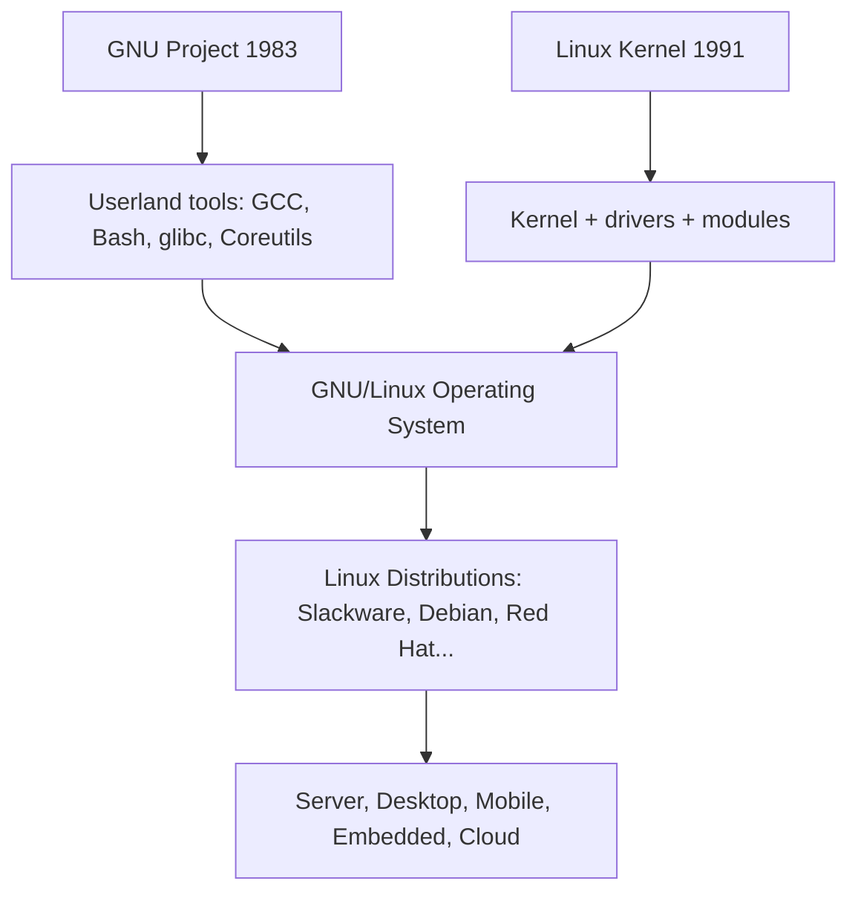

# Open Source: History, Philosophy, and Ecosystem

## Introduction

The open-source movement is one of the most transformative developments in computing history. What began as a philosophical stance about software freedom in the 1980s became the dominant model for software development by the 2020s. The Linux kernel, the Apache HTTP Server, Python, Kubernetes, and virtually every foundational technology in modern computing is open source.

This chapter traces the history from the early days of shared computing through the founding of the Free Software Foundation, the schism that created "open source," and the modern ecosystem of foundations, licenses, and communities that sustain it.

## The Prehistory: Sharing Software (1950s–1970s)

In the early days of computing, software was freely shared. Universities and research labs distributed source code along with their machines. The **DECUS** (Digital Equipment Computer Users' Society) user group shared PDP programs. The **SHARE** user group did the same for IBM mainframes.

Key developments:

- **1955**: SHARE founded, distributing software among IBM 704 users.
- **1969**: AT&T's Bell Labs begins developing Unix, distributing it to universities for a nominal fee.
- **1975**: The Homebrew Computer Club meets in Silicon Valley; members freely exchange software for the Altair 8800.
- **1976**: Bill Gates writes his "Open Letter to Hobbyists," arguing that software has value and should be paid for—signaling the shift toward proprietary software.

The commercialization of software in the late 1970s created the tension that would define the next four decades.

## The Free Software Foundation and GNU Project

### Richard Stallman and the Emacs Controversy

Richard Stallman (RMS), a programmer at MIT's Artificial Intelligence Lab, experienced the shift from shared to proprietary software firsthand. In 1980, the AI Lab's PDP-10 was replaced by commercial systems with proprietary software. When a printer manufacturer refused to provide source code for its driver (preventing Stallman from fixing a paper-jam notification bug), the frustration crystallized.

In 1983, Stallman announced the **GNU Project** ("GNU's Not Unix")—an ambitious plan to create a complete Unix-compatible operating system that would be entirely free software.

### The Four Freedoms

The Free Software Foundation (FSF), founded in 1985, codified the philosophy into four essential freedoms:

| Freedom | Description |
|---------|-------------|
| **Freedom 0** | The freedom to run the program for any purpose |
| **Freedom 1** | The freedom to study how the program works, and change it |
| **Freedom 2** | The freedom to redistribute copies |
| **Freedom 3** | The freedom to distribute copies of your modified versions |

These freedoms are about **user liberty**, not price. "Free" as in "free speech," not "free beer."

### GNU's Achievements

By the early 1990s, the GNU Project had produced most of a Unix-like system:

- **GCC** (GNU Compiler Collection)
- **GDB** (GNU Debugger)
- **Bash** (Bourne Again Shell)
- **Coreutils** (ls, cp, mv, etc.)
- **glibc** (GNU C Library)
- **GNU Emacs**
- **GNU Make**

The critical missing piece was the **kernel**. GNU's Hurd kernel was architecturally ambitious (based on a Mach microkernel) but chronically delayed. This gap would be filled by Linux.

### The GPL

The **GNU General Public License** (1989) was Stallman's legal innovation—using copyright law to guarantee freedom. The concept of **copyleft**: require that derivative works preserve the same freedoms. The GPL ensured that no company could take free software, modify it, and release the result as proprietary.

## The Birth of Linux (1991)

Linus Torvalds, a Finnish computer science student, began writing a kernel as a hobby project in 1991. His famous Usenet announcement:

```
From: torvalds@klaava.Helsinki.FI (Linus Benedict Torvalds)
Newsgroups: comp.os.minix
Subject: What would you like to see most in minix?
Date: 25 Aug 91 17:09:26 GMT

Hello everybody out there using minix -

I'm doing a (free) operating system (just a hobby, won't be big and
professional like gnu) for 386(486) AT clones.
```

Linux was initially released under a restrictive license that prohibited commercial redistribution. In February 1992, Torvalds **relicensed Linux under GPL v2**, a decision that:

1. Made Linux compatible with GNU's userland tools.
2. Ensured that all improvements would remain free.
3. Created the combined **GNU/Linux** system that would dominate computing.



## The Open Source Initiative

### The Schism

By the late 1990s, a group including Eric S. Raymond, Bruce Perens, and others felt that the term "free software" was off-putting to businesses. They wanted to emphasize the **practical benefits** of open development rather than the **ethical philosophy** of software freedom.

In 1998, they coined the term **"open source"** and founded the **Open Source Initiative (OSI)** to promote it. The catalyst was Netscape's release of the Navigator source code (which became Mozilla).

### The Open Source Definition (OSD)

The OSI's Open Source Definition is based on the **Debian Free Software Guidelines** and requires:

1. **Free redistribution**: The license shall not restrict any party from selling or giving away the software.
2. **Source code**: The program must include source code, and must allow distribution in source code form.
3. **Derived works**: The license must allow modifications and derived works.
4. **Integrity of the author's source code**: The license may require derived works to carry a different name or version number.
5. **No discrimination against persons or groups**.
6. **No discrimination against fields of endeavor**.
7. **Distribution of license**: Rights must apply to all recipients.
8. **License must not be specific to a product**.
9. **License must not restrict other software**.
10. **License must be technology-neutral**.

### FSF vs OSI: A Philosophical Divide

| Aspect | Free Software (FSF) | Open Source (OSI) |
|--------|--------------------|--------------------|
| **Core value** | Freedom and ethics | Practical development methodology |
| **Terminology** | Free software | Open source |
| **Primary concern** | User rights | Code quality and collaboration |
| **Business stance** | Skeptical of proprietary | Welcomes business adoption |
| **Key figure** | Richard Stallman | Eric S. Raymond |
| **Canonical essay** | The GNU Manifesto | The Cathedral and the Bazaar |

The FSF and OSI agree on which licenses are acceptable but differ on *why* open development matters. The FSF sees proprietary software as morally wrong; the OSI sees open source as a superior engineering methodology.

## Major Open-Source Projects and Foundations

### The Linux Kernel

The largest collaborative software project in history:
- **28+ million lines of code** (as of 2024)
- **Thousands of contributors** per release
- **~9-week release cycle**
- **Maintained by** Linus Torvalds with a hierarchical maintainer structure

### The Apache Software Foundation

Founded in 1999, the ASF oversees 300+ projects including:
- **Apache HTTP Server**: Dominated web serving for two decades.
- **Hadoop**: The big data framework.
- **Kafka**: Distributed event streaming.
- **Spark**: Unified analytics engine.

The ASF pioneered the "Apache Way"—a governance model emphasizing consensus, community, and meritocracy.

### The Linux Foundation

Founded in 2000 (as the Free Standards Group), the LF is the world's largest open-source foundation:

- **Kernel development support** (employs key maintainers)
- **CNCF** (Cloud Native Computing Foundation): Kubernetes, Prometheus, Envoy
- **LF AI & Data**: Machine learning projects
- **LF Edge**: IoT and edge computing
- **Zephyr**: Real-time operating system for embedded devices

### The GNOME and KDE Foundations

Desktop environment communities that demonstrated open source could produce polished user-facing software. GNOME uses GTK (LGPL), KDE uses Qt (LGPL/commercial dual).

### Mozilla

Born from Netscape's 1998 source release:
- **Firefox** browser
- **Thunderbird** email client
- **Rust** programming language (later transferred to the Rust Foundation)
- Pioneered the open-source business model of "give away the browser, sell services"

### Python Software Foundation, Node.js Foundation, etc.

Language ecosystems increasingly organize around foundations to ensure neutral governance and sustained development.

## The Cathedral and the Bazaar

Eric S. Raymond's 1997 essay "The Cathedral and the Bazaar" articulated two models of software development:

**Cathedral model** (traditional): Source code available with releases, but development happens internally. Examples: GCC before 1999, Emacs.

**Bazaar model** (open): Development happens in public, with frequent releases and broad participation. Examples: Linux kernel, Python, Rust.

Key insights from the essay:
1. "Every good work of software starts by scratching a developer's personal itch."
2. "Good programmers know what to write. Great ones know what to rewrite (and reuse)."
3. "Plan to throw one away; you will, anyhow." (quoting Fred Brooks)
4. "Treating your users as co-developers is your least-hassle route to rapid code improvement."

## Modern Open-Source Economics

### Business Models

Open source is not anti-commercial. Common business models:

- **Services and support**: Red Hat (RHEL), Canonical (Ubuntu)
- **Open core**: Basic features free, advanced features paid (GitLab, Elastic)
- **SaaS/hosting**: Offer managed versions (Confluent, Databricks)
- **Dual licensing**: GPL + commercial (MySQL, Qt)
- **Hardware**: Sell hardware, open-source the software (Android OEMs)

### The Supply Chain Problem

Modern software depends on vast dependency trees. The **Log4Shell vulnerability** (CVE-2021-44228) demonstrated that a single open-source library can affect millions of systems. Key concerns:

- **Maintainer burnout**: Critical projects maintained by single volunteers.
- **Security auditing**: Insufficient resources for security review.
- **Dependency depth**: Applications may depend on hundreds of transitive dependencies.
- **XZ Utils backdoor** (2024): A sophisticated social engineering attack that compromised a critical compression library.

Organizations like the **OpenSSF** (Open Source Security Foundation) and **Sigstore** are working to improve supply chain security.

### Corporate Contributions

The largest contributors to the Linux kernel are corporations:

| Company | Contribution % (approximate) |
|---------|------------------------------|
| Intel | ~12% |
| Google | ~8% |
| Red Hat | ~7% |
| Linaro | ~5% |
| SUSE | ~4% |
| Meta | ~3% |
| AMD | ~3% |

Companies contribute because it's cheaper to develop shared infrastructure than to maintain forks.

## Open Source Governance Models

### Benevolent Dictator for Life (BDFL)

- **Linux kernel**: Linus Torvalds
- **Python**: Guido van Rossum (retired 2018)
- **Git**: Junio Hamano

### Meritocratic Council

- **Apache Foundation**: Project Management Committees
- **CNCF**: Technical Oversight Committee

### Corporate Stewardship

- **Go**: Google
- **Swift**: Apple
- **Kotlin**: JetBrains

### Foundation-Managed

- **Rust**: Rust Foundation
- **Kubernetes**: CNCF
- **Eclipse**: Eclipse Foundation

## Open Source and the Linux Kernel

The kernel's development process is a masterclass in large-scale open-source governance:

```
Development tree: linux-next (integration testing)
         ↓
Pull requests from subsystem maintainers
         ↓
Linus Torvalds merges during merge window (2 weeks)
         ↓
Release candidates (rc1 through rc7-rc8)
         ↓
Final release
         ↓
Stable team backports fixes (stable, longterm)
```

The kernel's **MAINTAINERS** file lists thousands of subsystems and their maintainers. Tools like `get_maintainer.pl` automate the process of finding who should review a patch.

```bash
# Find who maintains a subsystem
scripts/get_maintainer.pl -f drivers/gpu/drm/i915/

# Output:
# Jani Nikula <jani.nikula@linux.intel.com> (maintainer:INTEL DRM DRIVERS...)
# Rodrigo Vivi <rodrigo.vivi@intel.com> (maintainer:INTEL DRM DRIVERS...)
# intel-gfx@lists.freedesktop.org (open list:INTEL DRM DRIVERS...)
```

## Further Reading

- [GNU Project History](https://www.gnu.org/gnu/initial-announcement.en.html) — Stallman's original announcement
- [OSI: Open Source Definition](https://opensource.org/osd/) — The official definition
- [The Cathedral and the Bazaar](http://www.catb.org/esr/writings/cathedral-bazaar/) — Raymond's essay
- [LWN: 25 years of Linux](https://lwn.net/Articles/696964/) — Retrospective
- [Kernel docs: Development process](https://docs.kernel.org/process/development-process.html) — How the kernel is developed
- [Linux Foundation Annual Report](https://www.linuxfoundation.org/research) — State of open source
- [OpenSSF](https://openssf.org/) — Open Source Security Foundation
- [man7.org: Development process](https://man7.org/linux/man-pages/man7/lfds.7.html) — Linux development resources
