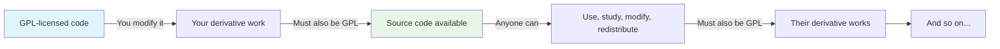
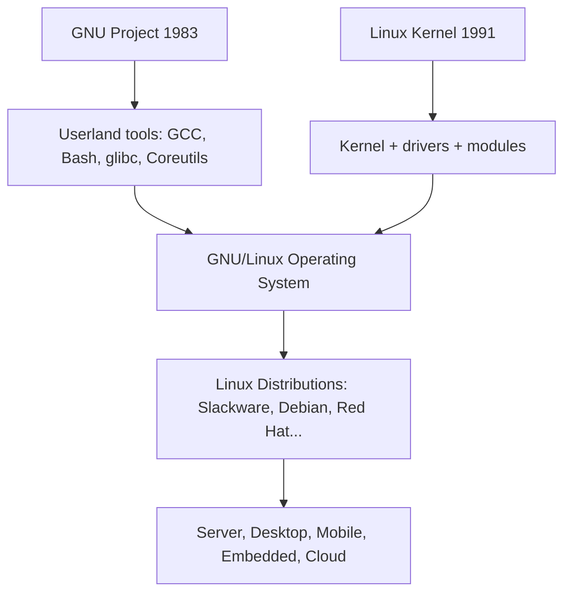
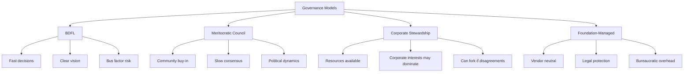
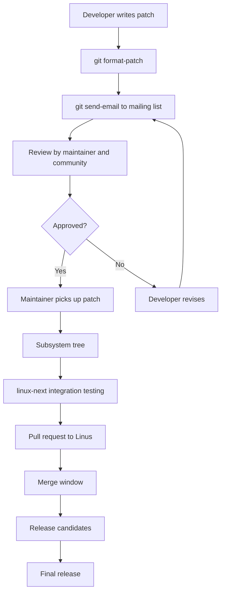

# Open Source: History, Philosophy, and Ecosystem

## Introduction

The open-source movement is one of the most transformative developments in computing history. What began as a philosophical stance about software freedom in the 1980s became the dominant model for software development by the 2020s. The Linux kernel, the Apache HTTP Server, Python, Kubernetes, and virtually every foundational technology in modern computing is open source.

This chapter traces the history from the early days of shared computing through the founding of the Free Software Foundation, the schism that created "open source," and the modern ecosystem of foundations, licenses, and communities that sustain it. It covers the economic models that make open source sustainable, the governance structures that keep projects healthy, and the security challenges that threaten the supply chain.

---

## The Prehistory: Sharing Software (1950s–1970s)

In the early days of computing, software was freely shared. Universities and research labs distributed source code along with their machines. The **DECUS** (Digital Equipment Computer Users' Society) user group shared PDP programs. The **SHARE** user group did the same for IBM mainframes.

### Timeline of Early Sharing

| Year | Event |
|------|-------|
| **1952** | IBM creates the first user group (SHARE) for the IBM 701 |
| **1955** | SHARE formally founded, distributing software among IBM 704 users |
| **1956** | The first consent decree limits IBM's bundling of software with hardware |
| **1964** | IBM unbundles software from hardware for the System/360 — the birth of the software industry |
| **1969** | AT&T's Bell Labs begins developing Unix, distributing it to universities for a nominal fee |
| **1970** | DECUS begins distributing PDP-11 software freely among DEC users |
| **1975** | The Homebrew Computer Club meets in Silicon Valley; members freely exchange software for the Altair 8800 |
| **1976** | Bill Gates writes his "Open Letter to Hobbyists," arguing that software has value and should be paid for |

The commercialization of software in the late 1970s created the tension that would define the next four decades. Gates' letter was a watershed moment — it crystallized the idea that software was property, not shared knowledge.

### Unix and Academic Sharing

Unix was a pivotal early example of shared software. Developed at Bell Labs by Ken Thompson and Dennis Ritchie beginning in 1969, Unix was distributed to universities with source code for a nominal fee. This enabled:

- **UC Berkeley's BSD**: Students and faculty added virtual memory, TCP/IP networking, and the vi editor. The Berkeley Software Distribution (BSD) became a major Unix variant.
- **University of Waterloo**: Ported Unix to the PDP-11, making it accessible to more students.
- **University of New South Wales**: Created a portable version that ran on the Interdata 8/32.

This academic sharing culture established the norms — peer review, distributed development, source code availability — that would later define open source.

---

## The Free Software Foundation and GNU Project

### Richard Stallman and the Emacs Controversy

Richard Stallman (RMS), a programmer at MIT's Artificial Intelligence Lab, experienced the shift from shared to proprietary software firsthand. In 1980, the AI Lab's PDP-10 was replaced by commercial systems with proprietary software. When a printer manufacturer refused to provide source code for its driver (preventing Stallman from fixing a paper-jam notification bug), the frustration crystallized.

The specific incident involved a Xerox 9700 laser printer. Stallman wanted to modify the driver to send a notification when jobs were stuck — a feature he'd previously implemented for an earlier printer. Xerox refused to share the source code, and Stallman realized that proprietary software systematically prevented users from helping each other.

In 1983, Stallman announced the **GNU Project** ("GNU's Not Unix") — an ambitious plan to create a complete Unix-compatible operating system that would be entirely free software.

### The Four Freedoms

The Free Software Foundation (FSF), founded in 1985, codified the philosophy into four essential freedoms:

| Freedom | Number | Description |
|---------|--------|-------------|
| **Freedom 0** | 0 | The freedom to run the program for any purpose |
| **Freedom 1** | 1 | The freedom to study how the program works, and change it (requires source code access) |
| **Freedom 2** | 2 | The freedom to redistribute copies |
| **Freedom 3** | 3 | The freedom to distribute copies of your modified versions |

These freedoms are about **user liberty**, not price. "Free" as in "free speech," not "free beer." The FSF's position is that software that denies users these freedoms is ethically wrong — it creates a power imbalance where the developer controls the user.

### GNU's Achievements

By the early 1990s, the GNU Project had produced most of a Unix-like system:

| Component | Purpose | First Release |
|-----------|---------|---------------|
| **GCC** (GNU Compiler Collection) | C, C++, Fortran, and other compilers | 1987 |
| **GDB** (GNU Debugger) | Source-level debugger | 1986 |
| **Bash** (Bourne Again Shell) | Command-line shell | 1989 |
| **Coreutils** | ls, cp, mv, rm, mkdir, etc. | 1990 (merged from fileutils, shellutils, textutils) |
| **glibc** (GNU C Library) | Standard C library | 1987 |
| **GNU Emacs** | Text editor | 1984 |
| **GNU Make** | Build automation tool | 1988 |
| **GNU Tar** | Archive utility | 1988 |
| **GNU grep** | Pattern matching | 1992 |
| **GNU Autoconf** | Configuration system | 1991 |

The critical missing piece was the **kernel**. GNU's Hurd kernel was architecturally ambitious (based on a Mach microkernel) but chronically delayed. The Hurd's design — with separate translators handling filesystem operations, device access, and networking — was elegant but proved difficult to implement reliably. This gap would be filled by Linux.

### The GPL

The **GNU General Public License** (1989) was Stallman's legal innovation — using copyright law to guarantee freedom. The concept of **copyleft**: require that derivative works preserve the same freedoms. The GPL ensured that no company could take free software, modify it, and release the result as proprietary.

The GPL's key innovation was its **reciprocal** nature:



This "viral" property is what makes copyleft different from permissive licenses. The GPL creates a commons that grows over time — once code enters the GPL ecosystem, it can never be made proprietary.

---

## The Birth of Linux (1991)

Linus Torvalds, a Finnish computer science student at the University of Helsinki, began writing a kernel as a hobby project in 1991. His famous Usenet announcement:

```
From: torvalds@klaava.Helsinki.FI (Linus Benedict Torvalds)
Newsgroups: comp.os.minix
Subject: What would you like to see most in minix?
Date: 25 Aug 91 17:09:26 GMT

Hello everybody out there using minix -

I'm doing a (free) operating system (just a hobby, won't be big and
professional like gnu) for 386(486) AT clones.
```

### Key Early Decisions

Linux's early success was shaped by several key decisions:

1. **Targeting the 386**: While Minix was designed for teaching on 8086 hardware, Torvalds targeted the Intel 386 — the most common PC processor. This meant Linux could run on hardware that thousands of hobbyists already owned.

2. **Monolithic design**: Unlike the Hurd's microkernel approach, Linux used a monolithic design where the kernel runs as a single program. This was simpler to implement and offered better performance, though it sacrificed some architectural elegance.

3. **GPL v2 licensing** (February 1992): Torvalds initially released Linux under a restrictive license that prohibited commercial redistribution. In February 1992, he **relicensed Linux under GPL v2**, a decision that:
   - Made Linux compatible with GNU's userland tools
   - Ensured that all improvements would remain free
   - Created the combined **GNU/Linux** system that would dominate computing

4. **Pragmatic development**: Torvalds focused on working code over theoretical elegance. "Release early, release often" was the development philosophy from the start.



### The Tanenbaum-Torvalds Debate (1992)

One of the most famous debates in computing history took place on the comp.os.minix newsgroup in January 1992. Andrew Tanenbaum, the creator of Minix and a respected computer scientist, argued that Linux was obsolete because it used a monolithic kernel design:

> *"Linux is obsolete. [...] 1991 is the year of the microkernel."*

Torvalds responded:

> *"Your langstrumpf langstrumpf langstrumpf [...] Linux is not at all tied to the 386."*

The debate centered on the trade-offs between monolithic and microkernel architectures:

| Aspect | Monolithic (Linux) | Microkernel (Hurd, Minix) |
|--------|-------------------|--------------------------|
| **Performance** | Fast (direct function calls) | Slower (message passing) |
| **Reliability** | A bug can crash the whole kernel | Bugs isolated in servers |
| **Complexity** | Simpler to implement | More complex IPC |
| **Modularity** | Loadable modules provide flexibility | Inherently modular |
| **Adoption** | Won in practice | Won in theory |

History vindicated Torvalds' pragmatic approach. Linux's monolithic design, combined with loadable kernel modules, proved to be the right engineering trade-off for the hardware and use cases of the 1990s and 2000s.

---

## The Open Source Initiative

### The Schism

By the late 1990s, a group including Eric S. Raymond, Bruce Perens, and others felt that the term "free software" was off-putting to businesses. They wanted to emphasize the **practical benefits** of open development rather than the **ethical philosophy** of software freedom.

In 1998, they coined the term **"open source"** and founded the **Open Source Initiative (OSI)** to promote it. The catalyst was Netscape's release of the Navigator source code (which became Mozilla) in January 1998.

### The Open Source Definition (OSD)

The OSI's Open Source Definition is based on the **Debian Free Software Guidelines** and requires:

1. **Free redistribution**: The license shall not restrict any party from selling or giving away the software.
2. **Source code**: The program must include source code, and must allow distribution in source code form.
3. **Derived works**: The license must allow modifications and derived works.
4. **Integrity of the author's source code**: The license may require derived works to carry a different name or version number.
5. **No discrimination against persons or groups**.
6. **No discrimination against fields of endeavor**.
7. **Distribution of license**: Rights must apply to all recipients without execution of an additional agreement.
8. **License must not be specific to a product**: The rights must not depend on the program being part of a particular software distribution.
9. **License must not restrict other software**: The license must not place restrictions on other software distributed along with the licensed software.
10. **License must be technology-neutral**: No provision may be predicated on any individual technology or style of interface.

### FSF vs OSI: A Philosophical Divide

| Aspect | Free Software (FSF) | Open Source (OSI) |
|--------|--------------------|--------------------|
| **Core value** | Freedom and ethics | Practical development methodology |
| **Terminology** | Free software | Open source |
| **Primary concern** | User rights | Code quality and collaboration |
| **Business stance** | Skeptical of proprietary | Welcomes business adoption |
| **Key figure** | Richard Stallman | Eric S. Raymond |
| **Canonical essay** | The GNU Manifesto | The Cathedral and the Bazaar |
| **Moral framing** | Proprietary software is morally wrong | Open source produces better software |
| **Goal** | A world where all software is free | Widespread adoption of open development |

The FSF and OSI agree on which licenses are acceptable but differ on *why* open development matters. The FSF sees proprietary software as morally wrong; the OSI sees open source as a superior engineering methodology.

In practice, most developers and organizations use the terms interchangeably, though the philosophical distinction remains important to both communities.

---

## The Cathedral and the Bazaar

Eric S. Raymond's 1997 essay "The Cathedral and the Bazaar" articulated two models of software development:

### The Cathedral Model (Traditional)

Source code available with releases, but development happens internally. The design is centralized and controlled. Examples:

- GCC before 1999 (FSF-controlled development)
- Emacs
- Most commercial software with public releases

### The Bazaar Model (Open)

Development happens in public, with frequent releases and broad participation. The design is decentralized and emergent. Examples:

- Linux kernel
- Python
- Rust
- Kubernetes

### Key Insights

The essay's most influential insights:

1. **"Every good work of software starts by scratching a developer's personal itch."** — The best open-source projects solve real problems for their creators.

2. **"Good programmers know what to write. Great ones know what to rewrite (and reuse)."** — Rewriting from scratch is often better than patching bad code.

3. **"Plan to throw one away; you will, anyhow."** (quoting Fred Brooks) — First implementations are learning experiences.

4. **"Treating your users as co-developers is your least-hassle route to rapid code improvement."** — Users who can read and modify code will find and fix bugs faster than any QA team.

5. **"Given enough eyeballs, all bugs are shallow."** — With enough testers and developers, every problem can be quickly identified and fixed. This became known as **Linus's Law**.

The essay had a profound impact on the software industry. It provided a business-friendly rationale for open development that didn't require philosophical commitment to software freedom.

---

## Major Open-Source Projects and Foundations

### The Linux Kernel

The largest collaborative software project in history:

| Metric | Value (2025) |
|--------|-------------|
| **Lines of code** | ~40 million (kernel 6.14-rc1) |
| **Contributors per release** | ~4,800+ unique authors per year |
| **Release cycle** | ~9-10 weeks |
| **Maintainer** | Linus Torvalds |
| **First release** | September 17, 1991 |
| **License** | GPL v2 |

The kernel's development process is a hierarchical model where subsystem maintainers collect patches, review them, and send pull requests to Torvalds during the merge window.

### The Apache Software Foundation

Founded in 1999, the ASF oversees 350+ projects including:

- **Apache HTTP Server**: Dominated web serving for two decades (still #2 behind nginx)
- **Hadoop**: The big data framework that kickstarted the data engineering revolution
- **Kafka**: Distributed event streaming platform used by 80% of Fortune 100 companies
- **Spark**: Unified analytics engine for large-scale data processing
- **Tomcat**: Java servlet container
- **HTTPD**: The most widely used web server for over a decade

The ASF pioneered the "Apache Way" — a governance model emphasizing:

- **Consensus**: Decisions are made through community discussion
- **Meritocracy**: Influence is earned through contribution, not appointment
- **Community over code**: Healthy communities produce healthy code
- **No vendor dominance**: Projects must be vendor-neutral

### The Linux Foundation

Founded in 2000 (as the Free Standards Group), the LF is the world's largest open-source foundation:

- **Kernel development support** (employs key maintainers including Torvalds)
- **CNCF** (Cloud Native Computing Foundation): Kubernetes, Prometheus, Envoy, containerd
- **LF AI & Data**: Machine learning projects (ONNX, PyTorch Foundation)
- **LF Edge**: IoT and edge computing (Akraino, EdgeX Foundry)
- **Zephyr**: Real-time operating system for embedded devices
- **LF Networking**: OpenDaylight, ONAP, and other networking projects
- **Automotive Grade Linux**: Open-source platform for automotive
- **Hyperledger**: Enterprise blockchain

The LF's annual budget exceeds $200 million, funded by corporate memberships. It employs over 150 people and supports thousands of developers.

### The GNOME and KDE Foundations

Desktop environment communities that demonstrated open source could produce polished user-facing software:

- **GNOME** (founded 1997): Uses GTK (LGPL), sponsored by the GNOME Foundation. Default desktop on Ubuntu, Fedora, RHEL.
- **KDE** (founded 1996): Uses Qt (LGPL/commercial dual), organized by KDE e.V. Default desktop on openSUSE, Kubuntu.

Both projects have millions of users and thousands of contributors.

### Mozilla

Born from Netscape's 1998 source release:

- **Firefox** browser — the primary alternative to Chromium-based browsers
- **Thunderbird** email client
- **Rust** programming language (later transferred to the Rust Foundation in 2021)
- **MDN Web Docs** — the definitive web technology reference
- Pioneered the open-source business model of "give away the browser, sell services"

### Python Software Foundation, Node.js Foundation, etc.

Language ecosystems increasingly organize around foundations to ensure neutral governance and sustained development:

- **Python Software Foundation (PSF)**: Manages CPython and the Python ecosystem
- **Rust Foundation** (2021): Founded by Mozilla, AWS, Google, Huawei, and Microsoft
- **OpenJS Foundation**: Node.js, jQuery, webpack, and other JS projects
- **Go**: Maintained by Google but open to community contributions
- **Eclipse Foundation**: IDE and Java ecosystem

---

## Open Source Governance Models

Different projects use different governance structures. The choice of model affects how decisions are made, how conflicts are resolved, and how the project evolves.

### Benevolent Dictator for Life (BDFL)

A single person has final say on all decisions. Works well for focused projects with clear vision:

- **Linux kernel**: Linus Torvalds (delegates extensively to subsystem maintainers)
- **Python**: Guido van Rossum (retired from BDFL role in 2018 after the PEP 572 controversy)
- **Git**: Junio Hamano
- **FFmpeg**: Michael Niedermayer

### Meritocratic Council

Decisions are made by a group of proven contributors:

- **Apache Foundation**: Project Management Committees (PMCs) govern each project
- **CNCF**: Technical Oversight Committee (TOC) elected by end users and vendors
- **Debian**: Debian Technical Committee, elected by developers

### Corporate Stewardship

A corporation maintains primary control, often with community input:

- **Go**: Google (open governance since 2024 with Go Proposal Process)
- **Swift**: Apple (open source since 2015)
- **Kotlin**: JetBrains (open source, Kotlin Foundation since 2023)
- **React**: Meta (open source, MIT licensed since 2017)

### Foundation-Managed

A neutral foundation owns the project's assets and governance:

- **Rust**: Rust Foundation (2021, funded by AWS, Google, Huawei, Microsoft, Mozilla)
- **Kubernetes**: CNCF
- **Eclipse**: Eclipse Foundation
- **Apache projects**: Apache Software Foundation

### Comparison



---

## Modern Open-Source Economics

### Business Models

Open source is not anti-commercial. Common business models:

| Model | Description | Examples |
|-------|-------------|----------|
| **Services and support** | Sell expertise around open-source software | Red Hat (RHEL), Canonical (Ubuntu) |
| **Open core** | Basic features free, advanced features paid | GitLab, Elastic, Redis Labs, HashiCorp |
| **SaaS/hosting** | Offer managed versions in the cloud | Confluent (Kafka), Databricks (Spark), MongoDB Atlas |
| **Dual licensing** | GPL + commercial license | MySQL (historical), Qt, MongoDB (SSPL) |
| **Hardware** | Sell hardware, open-source the software | Android OEMs, Raspberry Pi, System76 |
| **Training and certification** | Sell education and credentials | Red Hat (RHCE), Linux Foundation (LFCS) |
| **Donations and grants** | Community funding | Wikimedia, Let's Encrypt, curl |
| **Bounty programs** | Pay for specific features or bug fixes | Various small projects |

### The Red Hat Model

Red Hat proved that open source could be a billion-dollar business. Their model:

1. Develop software as open source (Fedora is the community project)
2. Create a stable, enterprise-hardened version (RHEL)
3. Sell subscriptions that include support, security patches, and certifications
4. Every line of source code remains available (via CentOS Stream and SRPMs)

IBM acquired Red Hat for **$34 billion** in 2019 — the largest software acquisition in history at the time. This validated the open-source business model at the highest level.

### The Open Core Model

Open core projects have a free core and paid extensions:

```
┌─────────────────────────────────────┐
│          Paid Features              │
│  ┌──────────────────────────────┐   │
│  │      Open Source Core        │   │
│  │  (Basic functionality)       │   │
│  └──────────────────────────────┘   │
│  Advanced features, enterprise      │
│  security, compliance, SSO, etc.    │
└─────────────────────────────────────┘
```

Examples:
- **GitLab**: Core is open source (MIT), enterprise features are proprietary
- **Elastic**: Elasticsearch is SSPL, Kibana is Apache 2.0, advanced features are paid
- **HashiCorp**: Terraform was MPL 2.0, moved to BSL in 2023 (controversial)
- **Redis**: Redis Stack is proprietary, Redis core is BSD (moved to dual RSALv2/SSPL in 2024, controversial)

### The Supply Chain Problem

Modern software depends on vast dependency trees. A typical web application may depend on hundreds of open-source libraries, each with their own dependencies.

#### Log4Shell (CVE-2021-44228)

On December 9, 2021, a critical vulnerability was discovered in **Apache Log4j**, a Java logging library used in virtually every Java application. The vulnerability allowed remote code execution by simply sending a crafted string that would be logged.

Impact:
- Affected **hundreds of millions** of devices worldwide
- Used in Apache, Minecraft, Apple iCloud, Steam, Twitter, and countless enterprise applications
- Rated CVSS 10.0 (the maximum severity)
- Exploited within hours of disclosure

The incident revealed that critical infrastructure depended on libraries maintained by volunteers with minimal funding.

#### XZ Utils Backdoor (CVE-2024-3094)

In March 2024, a backdoor was discovered in **XZ Utils**, a compression library used by virtually every Linux distribution. The attack was a sophisticated, multi-year social engineering campaign:

1. The attacker ("Jia Tan") contributed legitimate patches to XZ for over two years
2. Gradually gained commit access and maintainer trust
3. Introduced obfuscated malicious code that would compromise OpenSSH's authentication
4. Was discovered by Andres Freund, a Microsoft engineer, who noticed SSH logins taking 500ms longer than expected

The attack was caught before the backdoored version was widely deployed, but it demonstrated:

- **Maintainer burnout** creates vulnerabilities (the original maintainer was exhausted and looking for help)
- **Social engineering** can compromise any project
- **Supply chain attacks** can target the lowest levels of the stack
- **Trust** in open-source maintainers is a critical security surface

#### Maintainer Burnout

Critical projects are often maintained by a single volunteer:

| Project | Maintainer(s) | Users |
|---------|---------------|-------|
| **curl** | Daniel Stenberg (mostly solo) | Billions of devices |
| **OpenSSL** | Small team (expanded after Heartbleed) | Virtually all TLS connections |
| **core-js** | Denis Pushkarev (one person) | Most JavaScript applications |
| **Log4j** | Volunteer team | Most Java applications |

Organizations like the **OpenSSF** (Open Source Security Foundation) and **Sigstore** are working to improve supply chain security:

- **Sigstore**: Provides free code signing and transparency logs
- **SLSA** (Supply-chain Levels for Software Artifacts): Framework for supply chain integrity
- **OpenSSF Scorecard**: Automated security assessment for open-source projects
- **Alpha-Omega Project**: Funding security improvements for critical open-source projects

---

## Corporate Contributions

The largest contributors to the Linux kernel are corporations:

| Company | Contribution % (approximate) | Motivation |
|---------|------------------------------|------------|
| Intel | ~12% | Hardware enablement for Intel CPUs, GPUs, networking |
| Google | ~8% | Cloud infrastructure, Android, ChromeOS |
| Red Hat | ~7% | Enterprise Linux, RHEL |
| Linaro | ~5% | ARM ecosystem enablement |
| SUSE | ~4% | Enterprise Linux, SUSE Linux Enterprise |
| Meta | ~3% | Data center efficiency, networking |
| AMD | ~3% | GPU and CPU enablement |
| Huawei | ~3% | ARM servers, networking |
| Arm | ~2% | ARM architecture support |
| Apple | ~1% | ARM (Apple Silicon) support via Asahi Linux (indirect) |

Companies contribute because it's cheaper to develop shared infrastructure than to maintain forks. A single company maintaining its own kernel would cost billions of dollars per year and would be technically inferior to the collaborative effort.

---

## Open Source and the Linux Kernel

The kernel's development process is a masterclass in large-scale open-source governance:

```
Development tree: linux-next (integration testing)
         ↓
Pull requests from subsystem maintainers
         ↓
Linus Torvalds merges during merge window (2 weeks)
         ↓
Release candidates (rc1 through rc7-rc8)
         ↓
Final release
         ↓
Stable team backports fixes (stable, longterm)
```

### The MAINTAINERS File

The kernel's **MAINTAINERS** file (over 25,000 lines) lists thousands of subsystems and their maintainers. Tools like `get_maintainer.pl` automate the process of finding who should review a patch:

```bash
# Find who maintains a subsystem
$ scripts/get_maintainer.pl -f drivers/gpu/drm/i915/

# Output:
# Jani Nikula <jani.nikula@linux.intel.com> (maintainer:INTEL DRM DRIVERS...)
# Rodrigo Vivi <rodrigo.vivi@intel.com> (maintainer:INTEL DRM DRIVERS...)
# intel-gfx@lists.freedesktop.org (open list:INTEL DRM DRIVERS...)
```

### The Patch Process

A kernel patch follows this lifecycle:



### Signed-off-by and DCO

Every kernel patch must include a `Signed-off-by` line, indicating the developer's acceptance of the Developer Certificate of Origin (DCO):

```
Signed-off-by: Developer Name <developer@example.com>
```

This replaces a formal CLA (Contributor License Agreement) with a lighter-weight mechanism introduced after the SCO litigation in 2004.

→ See: [Licensing](./licensing.md) | [Development Model](../history/development-model.md)

---

## Open Source AI: The New Frontier

The definition of "open source" is being challenged by artificial intelligence. In 2024-2025, the OSI released the first formal definition of **Open Source AI (OSAI)**:

### The OSI Open Source AI Definition

An Open Source AI system must provide:

1. **Access to the preferred form for making modifications** — including model weights, training code, and data processing code
2. **The ability to study how the system works** — access to training data or sufficiently detailed information about it
3. **The ability to use the system for any purpose** — without restrictions on field of endeavor
4. **The ability to modify and share the system** — including modified versions

### Controversies

Many popular "open-source" AI models don't meet the OSI's definition:

| Model | License | Truly Open Source? |
|-------|---------|-------------------|
| **Llama 3** (Meta) | Llama Community License | No — restricts commercial use for large companies |
| **Mistral** | Apache 2.0 (some models) | Yes for weights, but training data not public |
| **DeepSeek R1** | MIT | Mostly — weights and code open, training data not fully disclosed |
| **GPT-NeoX** (EleutherAI) | Apache 2.0 | Yes — fully open |
| **PyTorch** (Meta) | BSD-3 | Yes — the framework is fully open |

The debate over what "open source" means in the context of AI is one of the defining discussions of the 2020s. The traditional open-source definition assumes source code as the primary artifact; AI models have weights, training data, and training code as distinct artifacts that may or may not be open.

→ See: [Open Source AI Definition](https://opensource.org/ai/) — OSI's formal definition

---

## The Future of Open Source

### Trends Shaping the Ecosystem

1. **Supply chain security**: Post-Log4Shell and XZ, massive investment in securing open-source dependencies. Governments are mandating software bills of materials (SBOMs).

2. **AI and open source**: The tension between open AI models and proprietary training data is reshaping the definition of "open source."

3. **Government adoption**: The EU Cyber Resilience Act, US Executive Order 14028, and similar legislation are driving open-source adoption and security requirements.

4. **Sustainability**: Growing recognition that critical open-source infrastructure needs sustainable funding. Initiatives like GitHub Sponsors, Open Collective, and the Sovereign Tech Fund are addressing this.

5. **Rust in the kernel**: Rust is being integrated into the Linux kernel as a safer alternative to C for new code, marking the first major new language in the kernel's 30+ year history.

6. **WebAssembly and WASI**: New portable binary format that may reshape how open-source software is distributed and executed.

7. **License evolution**: Projects like HashiCorp (Terraform) and Redis have moved from permissive to restrictive licenses, sparking debate about the social contract of open source. The SSPL (Server Side Public License) and BSL (Business Source License) are controversial new licenses that don't meet the OSI's definition.

---

## Open Source in the Linux Ecosystem

Open source is not just the development model for Linux — it's the foundation of the entire ecosystem. Every component in a typical Linux system is open source:

| Component | License | Project |
|-----------|---------|---------|
| **Kernel** | GPL v2 | Linux |
| **C library** | LGPL | glibc |
| **Shell** | GPL v3 | Bash |
| **Init system** | LGPL v2.1 | systemd |
| **Coreutils** | GPL v3 | GNU Coreutils |
| **Compiler** | GPL v3 | GCC |
| **Web server** | Apache 2.0 | Apache HTTPD / nginx (BSD) |
| **Database** | PostgreSQL License | PostgreSQL |
| **Container runtime** | Apache 2.0 | containerd |
| **Orchestration** | Apache 2.0 | Kubernetes |
| **Desktop** | GPL v2 | GNOME / KDE |

This massive commons of shared software is what makes Linux distributions possible. No single company could build or maintain all of these components — the collaborative model is essential.

---

## References

- [GNU Project History](https://www.gnu.org/gnu/initial-announcement.en.html) — Stallman's original announcement
- [OSI: Open Source Definition](https://opensource.org/osd/) — The official definition
- [The Cathedral and the Bazaar](http://www.catb.org/esr/writings/cathedral-bazaar/) — Raymond's essay
- [LWN: 25 years of Linux](https://lwn.net/Articles/696964/) — Retrospective
- [Kernel docs: Development process](https://docs.kernel.org/process/development-process.html) — How the kernel is developed
- [Linux Foundation Annual Report](https://www.linuxfoundation.org/research) — State of open source
- [OpenSSF](https://openssf.org/) — Open Source Security Foundation
- [CVE-2024-3094 (XZ Utils)](https://nvd.nist.gov/vuln/detail/cve-2024-3094) — NVD entry for XZ backdoor
- [CVE-2021-44228 (Log4Shell)](https://nvd.nist.gov/vuln/detail/cve-2021-44228) — NVD entry for Log4Shell
- [OSI: Open Source AI Definition](https://opensource.org/ai/) — Definition for AI systems
- [The GNU Manifesto](https://www.gnu.org/gnu/manifesto.html) — Stallman's foundational text
- [Sigstore](https://www.sigstore.dev/) — Software signing infrastructure
- [SLSA Framework](https://slsa.dev/) — Supply chain integrity levels
- [man7.org: Development process](https://man7.org/linux/man-pages/man7/lfds.7.html) — Linux development resources
- [Red Hat: The Open Source Way](https://www.redhat.com/en/open-source) — Red Hat's open-source philosophy
- [Apache Way](https://www.apache.org/theapacheway/) — Apache Foundation governance
