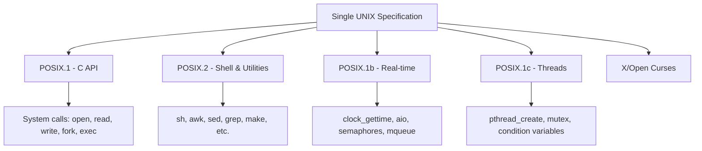
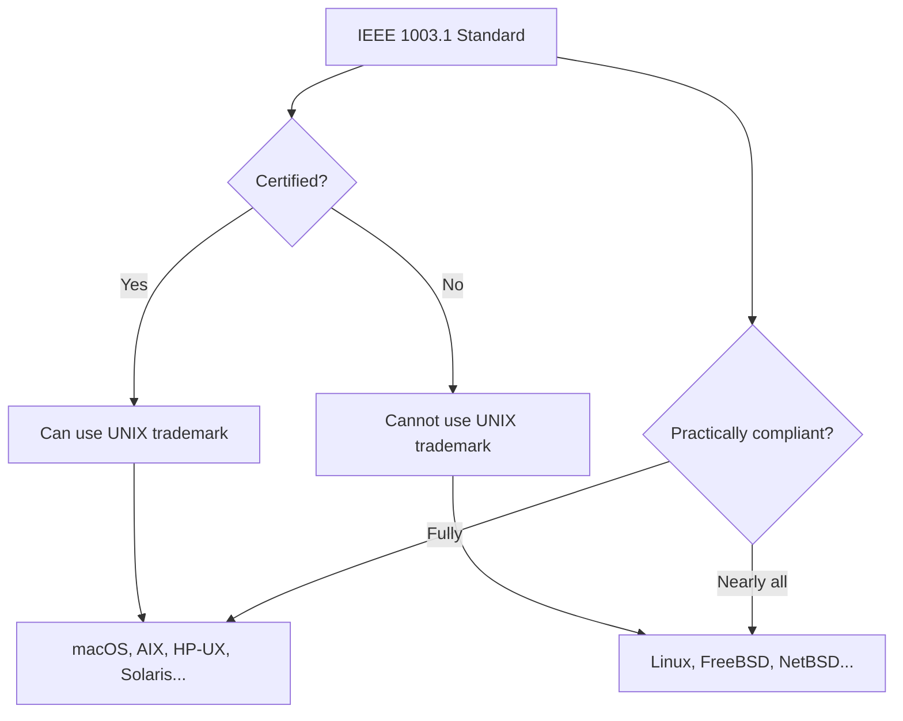

# POSIX: The Portable Operating System Interface

## Introduction

**POSIX** (Portable Operating System Interface) is a family of standards specified by the IEEE (Institute of Electrical and Electronics Engineers) that defines the interface between programs and the operating system. POSIX ensures that software written for one Unix-like system can be compiled and run on another with minimal or no changes.

The name "POSIX" was coined by Richard Stallman, who suggested it to the IEEE committee. It is pronounced "pahz-icks" (/ˈpɒzɪks/), not "poh-six."

Linux is largely POSIX-compliant but is not officially certified. Understanding POSIX is essential for writing portable systems software, understanding the boundaries between Linux-specific and standard behavior, and appreciating why certain interfaces exist in their current form.

## The POSIX Standards Family

POSIX is not a single standard but a collection of standards maintained by the IEEE and jointly registered with ISO/IEC.

### IEEE Std 1003

| Standard | Year | Description |
|----------|------|-------------|
| **IEEE 1003.1-1988** | 1988 | Original POSIX.1 — System C API |
| **IEEE 1003.1-1990** | 1990 | Revision (POSIX.1) |
| **IEEE 1003.2-1992** | 1992 | POSIX.2 — Shell and utilities |
| **IEEE 1003.1b-1993** | 1993 | Real-time extensions (POSIX.1b) |
| **IEEE 1003.1c-1995** | 1995 | Threads (POSIX.1c, pthreads) |
| **IEEE 1003.1d-1999** | 1999 | Additional real-time |
| **IEEE 1003.1j-2000** | 2000 | Advanced real-time |
| **IEEE 1003.1-2001** | 2001 | Single UNIX Specification v3 (POSIX.1-2001) |
| **IEEE 1003.1-2008** | 2008 | POSIX.1-2008 (SUSv4) |
| **IEEE 1003.1-2017** | 2017 | POSIX.1-2017 (SUSv4, 2nd edition) |
| **IEEE 1003.1-2024** | 2024 | POSIX.1-2024 (latest) |

### The Single UNIX Specification (SUS)

The **Open Group** maintains the **Single UNIX Specification**, which is a superset of POSIX. SUS adds interfaces beyond the POSIX base:

- **SUSv2** (1997): Added threads, real-time
- **SUSv3** (2001): Aligned with POSIX.1-2001
- **SUSv4** (2008): Aligned with POSIX.1-2008

Systems that pass the SUS certification test suite can use the **UNIX®** trademark.



## POSIX.1: System C API

POSIX.1 defines the C-language interface to the operating system. This is the most fundamental part of the standard and covers:

### File System Interface

```c
#include <fcntl.h>
#include <unistd.h>

/* POSIX file operations */
int fd = open("/tmp/file.txt", O_CREAT | O_WRONLY, 0644);
ssize_t n = write(fd, "Hello, POSIX!\n", 14);
off_t pos = lseek(fd, 0, SEEK_SET);
int rc = close(fd);

/* POSIX directory operations */
#include <dirent.h>
DIR *dir = opendir("/tmp");
struct dirent *entry;
while ((entry = readdir(dir)) != NULL) {
    printf("%s\n", entry->d_name);
}
closedir(dir);
```

Key POSIX.1 file interfaces:
- `open()`, `close()`, `read()`, `write()`, `lseek()`
- `stat()`, `fstat()`, `lstat()`
- `chmod()`, `chown()`, `link()`, `unlink()`, `rename()`
- `dup()`, `dup2()`, `fcntl()`, `ioctl()` (ioctl is not fully standardized)
- `mmap()`, `msync()`, `munmap()`

### Process Management

```c
#include <unistd.h>
#include <sys/wait.h>

pid_t pid = fork();

if (pid == 0) {
    /* Child process */
    execl("/bin/ls", "ls", "-la", NULL);
    _exit(127);  /* exec failed */
} else if (pid > 0) {
    /* Parent process */
    int status;
    waitpid(pid, &status, 0);
    if (WIFEXITED(status)) {
        printf("Child exited with %d\n", WEXITSTATUS(status));
    }
} else {
    perror("fork failed");
}
```

POSIX.1 process APIs:
- `fork()`, `exec` family, `_exit()`, `wait()`, `waitpid()`
- `getpid()`, `getppid()`, `getuid()`, `getgid()`
- `setuid()`, `setgid()`, `setsid()`
- `kill()`, `raise()`, `signal()`, `sigaction()`
- `pipe()`, `dup()`, `dup2()`

### POSIX Signals

POSIX defines a standardized signal model:

```c
#include <signal.h>

volatile sig_atomic_t got_sigint = 0;

void handler(int sig) {
    if (sig == SIGINT) {
        got_sigint = 1;
    }
}

int main(void) {
    struct sigaction sa;
    sa.sa_handler = handler;
    sigemptyset(&sa.sa_mask);
    sa.sa_flags = SA_RESTART;  /* Restart interrupted syscalls */
    sigaction(SIGINT, &sa, NULL);

    while (!got_sigint) {
        pause();  /* Wait for signal */
    }
    return 0;
}
```

Standard POSIX signals:

| Signal | Default Action | Description |
|--------|---------------|-------------|
| `SIGABRT` | Core dump | Abort signal |
| `SIGALRM` | Terminate | Timer expiration |
| `SIGCHLD` | Ignore | Child process stopped/terminated |
| `SIGFPE` | Core dump | Floating-point exception |
| `SIGHUP` | Terminate | Hangup on controlling terminal |
| `SIGILL` | Core dump | Illegal instruction |
| `SIGINT` | Terminate | Interactive attention (Ctrl+C) |
| `SIGKILL` | Terminate | Kill (cannot be caught) |
| `SIGPIPE` | Terminate | Write to pipe with no readers |
| `SIGSEGV` | Core dump | Invalid memory reference |
| `SIGTERM` | Terminate | Termination request |
| `SIGUSR1` | Terminate | User-defined signal 1 |
| `SIGUSR2` | Terminate | User-defined signal 2 |

### POSIX Threads (pthreads)

POSIX.1c (1995) standardized threads:

```c
#include <pthread.h>

void *thread_func(void *arg) {
    int *val = (int *)arg;
    printf("Thread received: %d\n", *val);
    return NULL;
}

int main(void) {
    pthread_t thread;
    int value = 42;

    pthread_create(&thread, NULL, thread_func, &value);
    pthread_join(thread, NULL);

    /* Mutex example */
    pthread_mutex_t mutex = PTHREAD_MUTEX_INITIALIZER;
    pthread_mutex_lock(&mutex);
    /* Critical section */
    pthread_mutex_unlock(&mutex);
    pthread_mutex_destroy(&mutex);

    /* Condition variable */
    pthread_cond_t cond = PTHREAD_COND_INITIALIZER;
    pthread_cond_signal(&cond);
    pthread_cond_wait(&cond, &mutex);

    return 0;
}
```

## POSIX.2: Shell and Utilities

POSIX.2 defines the command-line interface:

### POSIX Shell

The POSIX shell is a subset of common shell features:

```sh
#!/bin/sh
# POSIX-compliant shell script

# Variables
name="world"
echo "Hello, $name"

# Conditionals (POSIX test, not [[ ]])
if [ "$name" = "world" ]; then
    echo "Match"
fi

# Loops
for file in /tmp/*.txt; do
    [ -f "$file" ] && echo "$file"
done

# Functions
greet() {
    echo "Hi, $1"
}
greet "POSIX"

# Command substitution (POSIX: $(), not backticks preferred)
files=$(ls /tmp)

# Here document
cat <<EOF
This is a here document
with $name substitution
EOF
```

### Standard Utilities

POSIX.2 mandates these utilities (among many others):

```
awk, basename, cat, chgrp, chmod, chown, cmp, comm, cp, cut,
date, dd, diff, dirname, du, echo, env, expand, expr, false,
file, find, fold, grep, head, id, join, kill, ln, logname, ls,
mkdir, mkfifo, mv, nice, nl, nohup, od, paste, patch, printf,
pwd, read, rm, rmdir, sed, sh, sleep, sort, split, tail, tee,
test, touch, tr, true, tty, uname, uniq, wc, who, xargs
```

## POSIX Compliance: Linux vs. the Standard

Linux is **not officially POSIX-certified**, but it implements nearly all of POSIX.1 and POSIX.2. The reasons for non-certification are primarily economic:

1. **Cost**: POSIX certification requires paying the Open Group for testing.
2. **Practical benefit**: Linux's market success doesn't depend on certification.
3. **Extensions**: Linux adds many interfaces beyond POSIX that users depend on.

### Where Linux Exceeds POSIX

Linux provides numerous extensions not required by POSIX:

```c
/* Linux-specific: epoll (not in POSIX) */
#include <sys/epoll.h>
int epfd = epoll_create1(0);
struct epoll_event ev = { .events = EPOLLIN, .data.fd = fd };
epoll_ctl(epfd, EPOLL_CTL_ADD, fd, &ev);
epoll_wait(epfd, events, maxevents, timeout);

/* Linux-specific: sendfile() */
#include <sys/sendfile.h>
sendfile(out_fd, in_fd, &offset, count);

/* Linux-specific: clone() — fine-grained process creation */
#define _GNU_SOURCE
#include <sched.h>
clone(child_func, stack, CLONE_VM | CLONE_FS | CLONE_FILES, arg);

/* Linux-specific: /proc filesystem */
/* POSIX doesn't require /proc, but Linux has a rich one */

/* Linux-specific: timerfd, signalfd, eventfd */
#include <sys/timerfd.h>
int tfd = timerfd_create(CLOCK_MONOTONIC, 0);
```

### Where Linux Differs from POSIX

| Area | POSIX Specification | Linux Behavior |
|------|-------------------|----------------|
| `strerror_r()` | Returns `int` | GNU version returns `char *` |
| `getline()` | Not in POSIX.1-2001 | Available since glibc 2.10 |
| `getaddrinfo()` | Signal-safe | Not signal-safe in glibc |
| `/dev/null`, `/dev/zero` | Not specified | Always present on Linux |
| `pthread_mutex_t` | Opaque type | Linux exposes internal layout |
| Signal delivery | Implementation-defined | Real-time signals with queuing |

### `_GNU_SOURCE` and Feature Test Macros

Linux/glibc uses feature test macros to control which interfaces are visible:

```c
/* Define _GNU_SOURCE to get all Linux-specific interfaces */
#define _GNU_SOURCE
#include <unistd.h>
#include <string.h>

/* Now available: */
char *strchrnul(const char *s, int c);      /* GNU extension */
int pipe2(int pipefd[2], int flags);         /* Linux-specific */
int dup3(int oldfd, int newfd, int flags);   /* Linux-specific */
char *get_current_dir_name(void);            /* GNU extension */
```

Feature test macros:

| Macro | Effect |
|-------|--------|
| `_POSIX_C_SOURCE` | Enable POSIX interfaces |
| `_XOPEN_SOURCE` | Enable X/Open (SUS) interfaces |
| `_GNU_SOURCE` | Enable everything (Linux-specific + GNU extensions) |
| `_DEFAULT_SOURCE` | Enable default interfaces (replaces `_BSD_SOURCE`) |

## POSIX Certification

Several operating systems have been POSIX/SUS certified:

| System | Certification | Status |
|--------|---------------|--------|
| macOS | UNIX 03 (SUSv3) | Certified (Apple) |
| AIX | UNIX 03 | Certified (IBM) |
| HP-UX | UNIX 03 | Certified (HPE) |
| Solaris | UNIX 03 | Certified (Oracle) |
| Inspur K-UX | UNIX 03 | Certified (Inspur) |
| EulerOS | UNIX 03 | Certified (Huawei) |
| Linux | None | Not certified |



## Writing POSIX-Compliant Code

### Portable Shell Scripts

```sh
#!/bin/sh
# POSIX-compliant: avoid bashisms

# BAD (bash-only):
# [[ "$x" =~ pattern ]]
# declare -a array
# function name() { }
# echo -e "hello\tworld"
# local var  # (local is common but not POSIX)

# GOOD (POSIX):
[ "$x" = "pattern" ]
name() { }
printf "hello\tworld"
var="value"  # Use subshell for scope if needed
```

### Portable C Programs

```c
/* Avoid Linux-specific extensions for portable code */

/* BAD (Linux-only): */
#include <sys/epoll.h>      /* Use poll() instead */
#include <sys/sendfile.h>   /* Use read()/write() loop */
#include <sys/epoll.h>      /* Use poll() or select() */

/* GOOD (POSIX): */
#include <poll.h>
struct pollfd pfd = { .fd = fd, .events = POLLIN };
int n = poll(&pfd, 1, timeout_ms);
if (n > 0 && (pfd.revents & POLLIN)) {
    /* Data available */
}
```

### The `confstr()` and `sysconf()` Interfaces

POSIX provides runtime queries for system capabilities:

```c
#include <unistd.h>

/* Query system configuration */
long max_open = sysconf(_SC_OPEN_MAX);
long page_size = sysconf(_SC_PAGESIZE);
long nprocs = sysconf(_SC_NPROCESSORS_ONLN);
long clk_tck = sysconf(_SC_CLK_TCK);

/* Query path configuration */
char path[256];
confstr(_CS_PATH, path, sizeof(path));  /* Default PATH */
```

## POSIX Compliance Testing

Several tools help verify POSIX compliance of shell scripts and C programs:

### ShellCheck

```bash
# Install shellcheck
$ sudo apt install shellcheck

# Check a script for POSIX compliance
$ shellcheck --shell=sh myscript.sh

# Example output:
# In myscript.sh line 5:
# [[ "$x" =~ pattern ]]
# ^-- SC2039: In POSIX sh, [[ ]] is undefined.
```

### POSIX Test Suites

The **PCTS** (POSIX Conformance Test Suite) and **LTP** (Linux Test Project) help verify compliance:

```bash
# Run LTP (Linux Test Project)
$ git clone https://github.com/linux-test-project/ltp.git
$ cd ltp
$ make autotools
$ ./configure
$ make -j$(nproc)
$ sudo make install
$ cd /opt/ltp
$ sudo ./runltp -p -l result.log -f syscalls
```

## POSIX and Container Runtimes

POSIX interfaces define the baseline that container runtimes must support. Container isolation relies on:

- **Namespaces** (Linux-specific, not POSIX): PID, network, mount, UTS, IPC, user, cgroup
- **cgroups** (Linux-specific): Resource limits
- **POSIX interfaces**: `fork()`, `exec()`, `mount()`, `chroot()` (limited)
- **seccomp** (Linux-specific): System call filtering

The OCI (Open Container Initiative) runtime spec implicitly assumes POSIX-like behavior.

### Minimal POSIX Environment for Containers

A minimal container needs these POSIX interfaces at minimum:

```c
/* Container runtime requires: */
clone()          /* Create namespaces */
execve()         /* Run the container process */
waitpid()        /* Monitor container process */
kill()           /* Signal container process */

/* Inside the container: */
open(), read(), write()   /* File I/O */
socket(), bind(), connect()  /* Networking */
mmap(), brk()            /* Memory allocation */
pipe(), dup2()           /* Process communication */
```

## POSIX Threads Deep Dive

### Thread Safety

POSIX defines which functions are **thread-safe** (can be called from multiple threads simultaneously) and which are not:

| Thread-Safe | Not Thread-Safe |
|---|---|
| `read()`, `write()` | `gethostbyname()` |
| `malloc()`, `free()` | `strtok()` |
| `pthread_*()` | `rand()` (use `rand_r()`) |
| `localtime_r()` | `localtime()` (use `_r` variant) |
| `getaddrinfo()` | `getservbyname()` |

The `_r` suffix denotes reentrant (thread-safe) versions of functions:

```c
/* Non-reentrant (NOT thread-safe) */
char *strtok(char *str, const char *delim);

/* Reentrant (thread-safe) */
char *strtok_r(char *str, const char *delim, char **saveptr);

/* Non-reentrant */
struct tm *localtime(const time_t *timep);

/* Reentrant */
struct tm *localtime_r(const time_t *timep, struct tm *result);
```

### POSIX Thread Attributes

```c
#include <pthread.h>

/* Create a detached thread */
pthread_attr_t attr;
pthread_attr_init(&attr);
pthread_attr_setdetachstate(&attr, PTHREAD_CREATE_DETACHED);
pthread_attr_setstacksize(&attr, 2 * 1024 * 1024);  /* 2 MB stack */

pthread_t thread;
pthread_create(&thread, &attr, thread_func, NULL);
pthread_attr_destroy(&attr);

/* Set thread name (for debugging) */
pthread_setname_np(thread, "worker-thread-1");

/* Thread-local storage */
__thread int tls_var = 0;  /* GCC extension, widely supported */

/* POSIX thread-specific data (more portable) */
pthread_key_t key;
pthread_key_create(&key, NULL);
pthread_setspecific(key, (void *)42);
int *val = (int *)pthread_getspecific(key);
```

### Reader-Writer Locks

```c
#include <pthread.h>

pthread_rwlock_t rwlock = PTHREAD_RWLOCK_INITIALIZER;

/* Multiple readers can hold the lock simultaneously */
pthread_rwlock_rdlock(&rwlock);
/* Read shared data */
pthread_rwlock_unlock(&rwlock);

/* Writers get exclusive access */
pthread_rwlock_wrlock(&rwlock);
/* Modify shared data */
pthread_rwlock_unlock(&rwlock);
```

### Condition Variable Patterns

```c
/* Producer-consumer with condition variables */
#include <pthread.h>
#include <stdio.h>

#define QUEUE_SIZE 100
static int queue[QUEUE_SIZE];
static int head = 0, tail = 0, count = 0;
static pthread_mutex_t mutex = PTHREAD_MUTEX_INITIALIZER;
static pthread_cond_t not_full = PTHREAD_COND_INITIALIZER;
static pthread_cond_t not_empty = PTHREAD_COND_INITIALIZER;

void *producer(void *arg) {
    for (int i = 0; i < 1000; i++) {
        pthread_mutex_lock(&mutex);
        while (count == QUEUE_SIZE)
            pthread_cond_wait(&not_full, &mutex);
        queue[tail] = i;
        tail = (tail + 1) % QUEUE_SIZE;
        count++;
        pthread_cond_signal(&not_empty);
        pthread_mutex_unlock(&mutex);
    }
    return NULL;
}

void *consumer(void *arg) {
    for (int i = 0; i < 1000; i++) {
        pthread_mutex_lock(&mutex);
        while (count == 0)
            pthread_cond_wait(&not_empty, &mutex);
        int val = queue[head];
        head = (head + 1) % QUEUE_SIZE;
        count--;
        pthread_cond_signal(&not_full);
        pthread_mutex_unlock(&mutex);
        printf("Consumed: %d\n", val);
    }
    return NULL;
}
```

## POSIX Real-Time Extensions

POSIX.1b (1993) added real-time capabilities:

### High-Resolution Timers

```c
#include <time.h>

struct timespec ts;
clock_gettime(CLOCK_MONOTONIC, &ts);

/* Sleep with nanosecond precision */
struct timespec req = { .tv_sec = 0, .tv_nsec = 500000 };  /* 500 μs */
nanosleep(&req, NULL);

/* Clock resolution */
struct timespec res;
clock_getres(CLOCK_MONOTONIC, &res);
printf("Resolution: %ld ns\n", res.tv_nsec);
```

### Real-Time Scheduling

```c
#include <sched.h>

/* Set real-time scheduling policy */
struct sched_param param;
param.sched_priority = 50;  /* 1 (low) to 99 (high) */
sched_setscheduler(0, SCHED_FIFO, &param);

/* Or SCHED_RR for round-robin real-time */
sched_setscheduler(0, SCHED_RR, &param);

/* Check priority limits */
int max = sched_get_priority_max(SCHED_FIFO);  /* Typically 99 */
int min = sched_get_priority_min(SCHED_FIFO);  /* Typically 1 */
```

### POSIX Asynchronous I/O

```c
#include <aio.h>

/* See the AIO chapter for detailed examples */
struct aiocb cb;
/* ... initialize ... */
aio_read(&cb);  /* Non-blocking read */
```

## Further Reading

- [POSIX.1-2017 Specification](https://pubs.opengroup.org/onlinepubs/9699919799/) — The Open Group's online edition
- [Linux man-pages: POSIX](https://man7.org/linux/man-pages/man7/posixoptions.7.html) — POSIX options in Linux
- [The GNU C Library Manual](https://www.gnu.org/software/libc/manual/) — glibc documentation including POSIX extensions
- [LWN: POSIX compliance](https://lwn.net/Articles/604830/) — Discussion of Linux and POSIX
- [Austin Group](https://austin-group-portal.org/) — The POSIX/SUS standards working group
- [ShellCheck](https://www.shellcheck.net/) — Static analysis for shell script POSIX compliance
- [man7.org: feature_test_macros](https://man7.org/linux/man-pages/man7/feature_test_macros.7.html) — Feature test macros documentation
