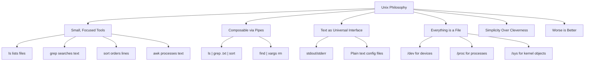
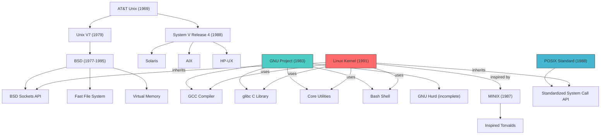

# Unix Heritage

Linux did not appear in a vacuum. It is the product of decades of operating system development, deeply rooted in the traditions and design philosophy of Unix. Understanding Unix heritage is essential for understanding why Linux works the way it does — why "everything is a file," why the shell is central, why small composable tools are preferred over monolithic programs, and why the filesystem hierarchy looks the way it does.

## The Birth of Unix

### Bell Labs and the Multics Failure

In the mid-1960s, AT&T's Bell Labs was part of a collaborative project with MIT and General Electric called **Multics** (Multiplexed Information and Computing Service). Multics was an ambitious, highly secure, multi-user operating system designed for the GE-645 mainframe.

By 1969, Bell Labs pulled out of the Multics project, frustrated by its complexity and delays. But several Bell Labs researchers — particularly **Ken Thompson** and **Dennis Ritchie** — had become accustomed to the comfortable programming environment that Multics provided and wanted something similar.

### Unix is Born (1969)

Ken Thompson wrote the first version of Unix (initially named "Unics" — a pun on "Multics") in assembly language on a spare PDP-7 minicomputer. The name was suggested by Brian Kernighan — "Unics" as a "castrated Multics," though the exact etymology is debated.

Dennis Ritchie joined Thompson, and together they:

1. Rewrote Unix in **PDP-11 assembly** (1970)
2. Invented the **C programming language** (1972)
3. Rewrote Unix in **C** (1973) — the first OS written in a high-level language

This last point was revolutionary. Writing an operating system in C meant it could be **ported** to different hardware architectures. Before this, every OS was written in assembly and was tied to a specific machine.

### The Portability Revolution

The ability to move Unix between different machines was transformative. The C language, combined with Unix's hardware abstraction layer, meant that porting the OS to a new machine primarily required writing a C compiler for that machine and some device drivers. This portability is a direct ancestor of Linux's ability to run on everything from Raspberry Pis to IBM mainframes.

## The Unix Philosophy

The Unix philosophy is a set of cultural norms and design approaches that have shaped software development for over 50 years. While it was never codified in a single document, its principles are widely understood:

### Doug McIlroy's Summary

Doug McIllroy, the inventor of Unix pipes, summarized the philosophy:

> "This is the Unix philosophy: Write programs that do one thing and do it well. Write programs to work together. Write programs that handle text streams, because that is a universal interface."

### The Core Principles



### The Principles in Detail

**1. Do one thing well**

Each program should do one thing and do it well. `ls` lists files. `grep` searches text. `sort` sorts lines. `wc` counts words. None of them try to do everything — they're specialists, not generalists.

**2. Composability**

Programs should work together. The Unix pipe (`|`) is the primary mechanism: the output of one program becomes the input of another. This allows building complex operations from simple pieces:

```bash
# Find the 10 most common error messages in a log file
$ grep "ERROR" /var/log/syslog | sort | uniq -c | sort -rn | head -10
    247 Failed password for invalid user admin from 192.168.1.100
     89 Connection refused by 10.0.0.5
     56 SSL certificate verification failed
     23 Out of memory: Killed process 12345
     12 Permission denied: /var/www/html/secret
      8 Segmentation fault (core dumped)
      5 Disk full on /dev/sda1
      3 Kernel panic - not syncing: Fatal exception
      1 Attempt to access beyond end of device
```

Each of those five commands (`grep`, `sort`, `uniq`, `sort`, `head`) does one thing. Together, they perform sophisticated log analysis.

**3. Text as universal interface**

Unix programs communicate via text streams. This is a deliberate design choice — text is human-readable, easy to generate, easy to parse, and doesn't require special tools to inspect.

```bash
# These all produce plain text output:
$ ps aux              # process list
$ df -h               # disk usage
$ free -m             # memory usage
$ ifconfig            # network interfaces
$ cat /proc/cpuinfo   # CPU information
```

**4. Everything is a file**

In Unix (and Linux), nearly everything is represented as a file:

```bash
# Hardware devices are files
$ ls -la /dev/sda
brw-rw---- 1 root disk 8, 0 Jul 21 10:00 /dev/sda

# Processes are files
$ ls /proc/self/
attr/       cmdline     coredump_filter  exe -> /usr/bin/ls
fd/         maps        mountinfo        stat
status      wchan       ...

# System information is files
$ cat /proc/version
Linux version 6.8.0-40-generic (buildd@lcy02-amd64-045) ...

# Even the kernel's configuration is files
$ cat /proc/sys/net/ipv4/ip_forward
0
```

This design means you can use the same tools (`cat`, `grep`, `echo`, `tee`) to interact with files, devices, processes, and kernel parameters.

**5. Simplicity over cleverness**

Unix programs should be simple in design and implementation. When given the choice between a clever solution and a simple one, choose simple. Simple code is easier to understand, debug, and maintain.

**6. "Worse is Better"**

Richard Gabriel coined this term to describe the Unix approach: a simpler system that works now is better than a complex system that's theoretically superior but doesn't exist yet. This philosophy directly influenced Torvalds — he chose a monolithic kernel not because it was theoretically optimal, but because it worked.

## The AT&T / BSD Split

### AT&T Unix

The original Unix was developed at Bell Labs, which was part of AT&T. In the 1970s, AT&T was a regulated monopoly and was restricted from selling software. So AT&T licensed Unix to universities at very low cost, including source code.

### The University of California, Berkeley

The University of California, Berkeley (UCB) received a Unix license and began making significant improvements. Their version became known as **BSD** (Berkeley Software Distribution). Key BSD innovations included:

- **TCP/IP networking** — BSD sockets became the standard network programming interface
- **The vi editor** — Bill Joy's creation, still used today
- **The C shell (csh)** — An alternative to the Bourne shell
- **Virtual memory** — Paging and swapping
- **Fast filesystem (FFS)** — A reliable, high-performance filesystem

The **BSD socket API** is particularly important — it's the interface that Linux (and virtually every modern OS) uses for network programming:

```c
// The BSD socket API - still used in Linux today
#include <sys/socket.h>
#include <netinet/in.h>

int sockfd = socket(AF_INET, SOCK_STREAM, 0);

struct sockaddr_in server_addr;
server_addr.sin_family = AF_INET;
server_addr.sin_port = htons(80);
server_addr.sin_addr.s_addr = inet_addr("93.184.216.34");

connect(sockfd, (struct sockaddr*)&server_addr, sizeof(server_addr));
write(sockfd, "GET / HTTP/1.1\r\nHost: example.com\r\n\r\n", 37);
```

### The Legal Battle

In 1984, AT&T was broken up and allowed to sell software. AT&T began charging for Unix and asserting ownership over all Unix code, including the code Berkeley had written.

This led to a legal dispute (USL v. BSDi, 1992) that was settled in 1994. The settlement revealed that only three files out of 18,000+ in the BSD codebase were actually AT&T's. The result was the release of **4.4BSD-Lite**, which was free of AT&T code.

This legal uncertainty drove many developers toward Linux in the early 1990s — Linux was written from scratch and had no AT&T code, making it legally clean.

### BSD Variants

After the settlement, several BSD variants emerged:

| Variant | Description |
|---------|-------------|
| **FreeBSD** | Focuses on performance and stability; popular for servers |
| **NetBSD** | Focuses on portability — "runs on anything" |
| **OpenBSD** | Focuses on security and code correctness |
| **DragonFly BSD** | Forked from FreeBSD, focuses on scalability |
| **macOS** | Darwin (Apple's OS kernel) is based on Mach + FreeBSD |

## POSIX: The Standard

### What is POSIX?

**POSIX** (Portable Operating System Interface) is a family of standards specified by the IEEE (Institute of Electrical and Electronics Engineers). The name was coined by Richard Stallman at the request of the IEEE. POSIX defines:

- The C API for system calls (file operations, process management, signals, etc.)
- Shell and utility interfaces (command-line tools)
- Thread interfaces (pthreads)
- Networking interfaces

POSIX is formally known as **IEEE Std 1003** and the **Single UNIX Specification (SUS)** is maintained by The Open Group.

### Why POSIX Matters

POSIX ensures that programs written for one POSIX-compliant system can be compiled and run on any other POSIX-compliant system with minimal changes. This portability was one of the original goals of Unix.

Key POSIX APIs that Linux implements:

```c
#include <unistd.h>
#include <fcntl.h>
#include <signal.h>
#include <pthread.h>

// POSIX file operations
int fd = open("/etc/passwd", O_RDONLY);   // POSIX open()
char buf[1024];
ssize_t n = read(fd, buf, sizeof(buf));   // POSIX read()
close(fd);                                 // POSIX close()

// POSIX process management
pid_t pid = fork();                        // Create child process
if (pid == 0) {
    execl("/bin/ls", "ls", "-l", NULL);   // Replace process image
} else {
    int status;
    waitpid(pid, &status, 0);             // Wait for child
}

// POSIX signals
signal(SIGINT, handler);                   // Catch Ctrl+C

// POSIX threads
pthread_t thread;
pthread_create(&thread, NULL, worker, NULL);
pthread_join(thread, NULL);
```

### Linux and POSIX Compliance

Linux is **not officially POSIX-certified** (certification is expensive and rarely worth it for an open-source project), but it is highly POSIX-compliant in practice. Most POSIX programs compile and run on Linux without modification.

The few areas where Linux diverges from POSIX are usually deliberate choices:

- Linux provides `epoll` instead of (or in addition to) POSIX `poll` for scalability
- Linux has `inotify` instead of POSIX `dnotify` for file change notification
- Linux's `/proc` and `/sys` filesystems are extensions beyond POSIX
- Linux provides `io_uring` for high-performance asynchronous I/O

### Commands: POSIX vs. Linux Extensions

```bash
# POSIX standard utilities (available on all Unix-like systems)
$ ls -l                    # POSIX
$ grep pattern file        # POSIX
$ sed 's/old/new/g' file   # POSIX
$ awk '{print $1}' file    # POSIX
$ ps -ef                   # POSIX (System V style)
$ df -h                    # POSIX (with common extensions)

# Linux-specific utilities
$ systemctl start nginx    # systemd (not POSIX)
$ ip addr show             # iproute2 (replaces ifconfig)
$ journalctl -u nginx      # systemd journal
$ lsblk                    # list block devices
$ lscpu                    # CPU information
```

## What Linux Inherited from Unix

Linux inherited the vast majority of its design from Unix, either directly or through POSIX standardization. Here's a comprehensive list:

### Filesystem Hierarchy

The Linux filesystem hierarchy follows Unix conventions:

```
/
├── bin/      → Essential user commands (ls, cp, mv)
├── boot/     → Kernel and bootloader files
├── dev/      → Device files
├── etc/      → System configuration (et cetera)
├── home/     → User home directories
├── lib/      → Essential shared libraries
├── media/    → Mount points for removable media
├── mnt/      → Temporary mount points
├── opt/      → Optional software packages
├── proc/     → Process and kernel information (virtual)
├── root/     → Root user's home directory
├── run/      → Runtime data
├── sbin/     → System administration commands
├── srv/      → Data for services
├── sys/      → Kernel and device information (virtual)
├── tmp/      → Temporary files
├── usr/      → Secondary hierarchy (user programs)
└── var/      → Variable data (logs, spool, cache)
```

This layout comes directly from the **Filesystem Hierarchy Standard (FHS)**, which is based on Unix traditions. See [What Is Linux?](./what-is-linux.md) for more on the kernel's file-centric design.

### Process Model

Linux inherited Unix's process model:

- `fork()` creates a copy of the current process
- `exec()` replaces the current process with a new program
- `wait()` lets a parent wait for a child to finish
- Signals (`SIGTERM`, `SIGKILL`, `SIGINT`, etc.) for inter-process communication
- Process groups and sessions for job control

```bash
# Unix process management (works identically on Linux)
$ ps aux                    # List all processes
$ top                       # Real-time process viewer
$ kill -TERM 1234           # Send signal to process
$ nice -n 10 command        # Run with lower priority
$ nohup command &           # Run in background, ignore hangup
```

### The Shell

The Unix shell is one of its most enduring legacies. Linux distributions typically include:

- **bash** (Bourne Again Shell) — The default on most distros
- **sh** (POSIX shell) — Usually a symlink to dash or bash
- **zsh** — Extended shell with better completion and customization
- **fish** — User-friendly shell with modern features

The shell's power comes from its composability:

```bash
# Complex pipeline combining multiple Unix tools
$ find /var/log -name "*.log" -mtime -7 \
    | xargs grep -h "ERROR" \
    | awk '{print $1, $2, $5}' \
    | sort | uniq -c | sort -rn \
    | head -20
```

### Everything is a File

Linux extends the Unix "everything is a file" concept further than any other Unix-like system:

| Path | What It Represents |
|------|-------------------|
| `/dev/sda` | Hard drive (block device) |
| `/dev/tty` | Terminal (character device) |
| `/dev/null` | Bit bucket (discard output) |
| `/dev/zero` | Infinite zero bytes |
| `/dev/random` | Random number generator |
| `/proc/self` | Current process information |
| `/proc/cpuinfo` | CPU information |
| `/proc/meminfo` | Memory information |
| `/proc/net/` | Network statistics |
| `/sys/class/net/` | Network device configuration |
| `/sys/block/` | Block device information |

```bash
# Use "file" tools to interact with kernel information
$ cat /proc/cpuinfo | grep "model name" | head -1
model name	: Intel(R) Core(TM) i7-12700K

$ echo 1 > /proc/sys/net/ipv4/ip_forward  # Enable IP forwarding

# Device files work like regular files
$ dd if=/dev/zero of=zeros.bin bs=1M count=10
10+0 records in
10+0 records out
10485760 bytes (10 MB, 10 MiB) copied, 0.012345 s, 850 MB/s
```

## The GNU Connection

The relationship between GNU and Linux is complex and politically charged. Here's the factual situation:

### What GNU Provides

The GNU Project (started by Richard Stallman in 1983) provides the majority of userspace tools in most Linux distributions:

| Component | Description |
|-----------|-------------|
| **GCC** | The GNU Compiler Collection (C, C++, Fortran, etc.) |
| **glibc** | The GNU C Library (system call wrappers, standard C library) |
| **Coreutils** | `ls`, `cp`, `mv`, `rm`, `cat`, `echo`, `chmod`, `chown`, etc. |
| **Bash** | The GNU Bourne Again Shell |
| **Binutils** | `ld`, `as`, `ar`, `objdump`, `readelf`, etc. |
| **GDB** | The GNU Debugger |
| **Make** | Build automation tool |
| **grep, sed, awk** | Text processing tools |

### The GNU/Linux Naming Debate

Stallman and the Free Software Foundation argue that the complete operating system should be called "GNU/Linux" because:

1. The GNU project started the operating system; Linux is "just" the kernel
2. Without GNU tools, the Linux kernel is useless
3. Calling it "Linux" gives insufficient credit to the GNU project

Torvalds and many others argue that:

1. "Linux" has become the common name and changing it is impractical
2. Modern distributions include many non-GNU components (systemd, X11/Wayland, graphical environments)
3. The name "Linux" reflects the kernel's central role

In practice, most people say "Linux" when referring to the operating system and "the Linux kernel" when referring specifically to the kernel. This book follows that convention while acknowledging GNU's essential contribution.

## Inheritance Map



## Try It Yourself

### Explore Your System's Unix Heritage

```bash
# See which utilities are GNU
$ ls --version
ls (GNU coreutils) 9.4

$ bash --version | head -1
GNU bash, version 5.2.21(1)-release (x86_64-pc-linux-gnu)

$ gcc --version | head -1
gcc (Ubuntu 13.2.0-23ubuntu4) 13.2.0

# See your kernel's POSIX compliance
$ getconf -a | head -20
POSIX_VERSION: 200809
POSIX2_VERSION: 200809

# Run a POSIX-compliant shell script
$ sh -c 'echo "POSIX shell works on $(uname -s)"'
POSIX shell works on Linux

# Check your system against Single UNIX Specification
$ command -v su
/usr/bin/su
```

### Portability Exercise

Try writing a shell script that works on Linux, macOS, and FreeBSD:

```bash
#!/bin/sh
# POSIX-compliant script — works on any Unix-like system
# Note: #!/bin/sh (not #!/bin/bash) for maximum portability

OS=$(uname -s)

case "$OS" in
    Linux)
        echo "Running on Linux"
        MEM_KB=$(grep MemTotal /proc/meminfo | awk '{print $2}')
        echo "Total memory: $((MEM_KB / 1024)) MB"
        ;;
    Darwin)
        echo "Running on macOS"
        MEM_BYTES=$(sysctl -n hw.memsize)
        echo "Total memory: $((MEM_BYTES / 1024 / 1024)) MB"
        ;;
    FreeBSD)
        echo "Running on FreeBSD"
        MEM_BYTES=$(sysctl -n hw.physmem)
        echo "Total memory: $((MEM_BYTES / 1024 / 1024)) MB"
        ;;
    *)
        echo "Unknown OS: $OS"
        exit 1
        ;;
esac
```

## References and Further Reading

- [The Art of Unix Programming](http://www.catb.org/esr/writings/taoup/html/) — Eric Raymond's comprehensive study of Unix philosophy (free online)
- [The Unix Heritage Society](http://www.tuhs.org/) — Archive of historic Unix source code
- [Unix Programmer's Manual, First Edition (1971)](https://www.bell-labs.com/unix-first-edition/) — The original man pages
- [The Cathedral and the Bazaar](http://www.catb.org/esr/writings/cathedral-bazaar/) — Eric Raymond on open-source development models
- [The BSD Socket API](https://man7.org/linux/man-pages/man7/socket.7.html) — Modern Linux man page for sockets
- [POSIX.1-2017 Specification](https://pubs.opengroup.org/onlinepubs/9699919799/) — The Single UNIX Specification
- [Filesystem Hierarchy Standard](https://refspecs.linuxfoundation.org/fhs.shtml) — The standard for Linux filesystem layout
- [History of Unix](https://en.wikipedia.org/wiki/History_of_Unix) — Wikipedia's comprehensive article
- [Linux man pages](https://man7.org/linux/man-pages/) — Manual pages for Linux system calls and library functions
- [GNU Project Philosophy](https://www.gnu.org/philosophy/) — Stallman's essays on free software
- [The Linux Kernel documentation](https://www.kernel.org/doc/html/latest/) — Official documentation covering POSIX compliance details

## Related Topics

- [What Is Linux?](./what-is-linux.md) — Technical overview of the Linux kernel and its architecture
- [Linux History](./history.md) — The complete timeline from 1991 to today
- [Distributions](./distributions.md) — How different distros package the Unix tradition differently
