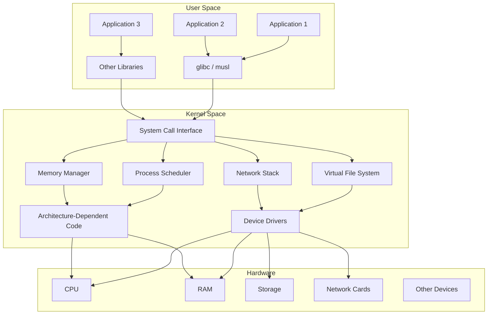
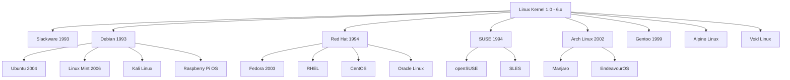

# What Is Linux?

Linux is a free and open-source Unix-like operating system kernel first created by Linus Torvalds in 1991. Today, the term "Linux" is used in two distinct ways: strictly, it refers to the **kernel** itself — the core software that manages hardware resources and provides services to running programs. More broadly, it refers to complete **operating systems** (called distributions) that pair the Linux kernel with userspace tools, libraries, and package managers to form a usable system.

This dual meaning has been the source of decades of naming debates (GNU/Linux vs. Linux), but in practice the distinction matters less than understanding what each layer does and how they fit together.

## The Linux Kernel

The Linux kernel is a **monolithic kernel** — meaning that the entire operating system core runs in a single address space with full access to all hardware. Device drivers, file systems, network protocol stacks, and process schedulers all execute in kernel mode (also called supervisor mode or ring 0 on x86).

This is in direct contrast to **microkernels** (like Mach, L4, or MINIX), where the kernel is kept minimal and most OS services run as separate user-space processes communicating via message passing.

### Why Monolithic?

Torvalds made this design choice early and defended it vigorously in the famous [Tanenbaum–Torvalds debate](https://en.wikipedia.org/wiki/Tanenbaum%E2%80%93Torvalds_debate) of 1992. Andrew Tanenbaum, creator of MINIX, argued that microkernels were the future and that monolithic kernels were "a giant step back into the 1970s." Torvalds countered that practical performance and simplicity mattered more than theoretical elegance.

History sided with Torvalds in terms of adoption, though the debate continues in academic circles. Linux's monolithic design provides:

- **Performance**: No inter-process communication (IPC) overhead for kernel services
- **Simplicity**: All kernel code shares a single address space, making function calls cheap
- **Flexibility**: Loadable kernel modules allow extending the kernel at runtime without rebooting

To mitigate the downsides of a monolithic design (a buggy driver can crash the entire kernel), Linux introduced **loadable kernel modules (LKMs)** and increasingly strict coding standards, static analysis tools, and sandboxing mechanisms.

### Kernel Architecture



## Kernel Space vs. User Space

The separation between **kernel space** and **user space** is one of the most fundamental concepts in Linux (and operating systems in general).

### Kernel Space

Kernel space is the memory region where the kernel code executes. Code running in kernel space has unrestricted access to:

- All hardware (CPU instructions, I/O ports, memory-mapped registers)
- All of physical memory (via virtual memory mappings)
- All CPU privileged instructions (disabling interrupts, changing page tables, etc.)

When a user program needs to perform a privileged operation — reading a file, sending a network packet, creating a process — it cannot do so directly. Instead, it makes a **system call**, which transitions the CPU from user mode to kernel mode.

### User Space

User space is where all normal applications run. Each process has its own virtual address space, isolated from other processes and from the kernel. User-space code cannot:

- Access hardware directly
- Read or write another process's memory
- Execute privileged CPU instructions
- Access kernel data structures

If a user-space program attempts any of these, the CPU generates a fault (like a segmentation fault / SIGSEGV), and the kernel intervenes — typically by terminating the offending process.

### The System Call Interface

The boundary between user space and kernel space is the **system call interface**. On Linux/x86-64, system calls are invoked via the `syscall` instruction. Each system call has a number:

```bash
# View system call numbers for your architecture
$ cat /usr/include/asm/unistd_64.h | head -20
#define __NR_read 0
#define __NR_write 1
#define __NR_open 2
#define __NR_close 3
#define __NR_stat 4
#define __NR_fstat 5
```

Common system calls include:

| System Call | Purpose |
|-------------|---------|
| `read()`    | Read from a file descriptor |
| `write()`   | Write to a file descriptor |
| `open()`    | Open a file |
| `close()`   | Close a file descriptor |
| `fork()`    | Create a new process |
| `execve()`  | Execute a program |
| `mmap()`    | Map memory |
| `ioctl()`   | Device-specific control operations |
| `socket()`  | Create a network socket |
| `brk()`     | Change data segment size |

You can trace system calls made by any program using `strace`:

```bash
$ strace ls /tmp
execve("/usr/bin/ls", ["ls", "/tmp"], 0x7ffd4a3b2c40 /* 52 vars */) = 0
brk(NULL)                               = 0x55a1e6e27000
access("/etc/ld.so.preload", R_OK)      = -1 ENOENT (No such file or directory)
openat(AT_FDCWD, "/etc/ld.so.cache", O_RDONLY|O_CLOEXEC) = 3
fstat(3, {st_mode=S_IFREG|0644, st_size=78456, ...}) = 0
mmap(NULL, 78456, PROT_READ, MAP_PRIVATE, 3, 0) = 0x7f8e1a200000
close(3)                                = 0
openat(AT_FDCWD, "/lib/x86_64-linux-gnu/libc.so.6", O_RDONLY|O_CLOEXEC) = 3
read(3, "\177ELF\2\1\1\3\0\0\0\0\0\0\0\0\3\0>\0\1\0\0\0\360q\2\0\0\0\0\0"..., 832) = 832
fstat(3, {st_mode=S_IFREG|0755, st_size=1922136, ...}) = 0
mmap(NULL, 8192, PROT_READ|PROT_WRITE, MAP_PRIVATE|MAP_ANONYMOUS, -1, 0) = 0x7f8e1a1fe000
# ... many more calls ...
```

## Linux vs. Unix

Linux is often described as "Unix-like" or "Unix-compatible" but it is **not Unix** in the legal or historical sense. Understanding the distinction requires some history (covered in detail in [Unix Heritage](./unix-heritage.md)).

### Key Differences

| Aspect | Traditional Unix | Linux |
|--------|-----------------|-------|
| **Source code** | Proprietary (AT&T, later various vendors) | Open source (GPL v2) |
| **Kernel** | Various (System V, BSD, etc.) | Monolithic, written from scratch |
| **Lineage** | Direct descendant of AT&T Unix | Independently written, POSIX-compatible |
| **Trademark** | "UNIX®" is a trademark of The Open Group | Not trademarked; anyone can use the name |
| **Hardware** | Originally minicomputers, later workstations | Runs on everything from phones to supercomputers |
| **Standardization** | Single UNIX Specification (SUS) | Follows POSIX but is not officially certified |

### What Linux Borrows from Unix

Despite being written from scratch, Linux inherits nearly all of Unix's design philosophy:

1. **"Everything is a file"**: Devices, processes, and system information are represented as files in the filesystem (e.g., `/dev/sda`, `/proc/cpuinfo`)
2. **Small, composable tools**: Programs do one thing well and are combined via pipes (`|`)
3. **Plain text configuration**: Most configuration files are human-readable text
4. **Hierarchical filesystem**: Single root (`/`) with standard directories (`/bin`, `/etc`, `/home`, `/var`, etc.)
5. **Multiuser, multitasking**: Multiple users can run multiple programs concurrently
6. **Shell as the primary interface**: `bash`, `zsh`, and other shells provide powerful scripting capabilities

## Distributions: The Complete Package

A Linux **distribution** (or "distro") packages the Linux kernel with:

- A **C library** (usually glibc or musl)
- Core **userspace utilities** (from GNU, BusyBox, or other projects)
- A **package manager** for installing and updating software
- A **bootloader** (usually GRUB)
- An **init system** (usually systemd, OpenRC, or runit)
- Optionally: a **desktop environment** (GNOME, KDE, XFCE, etc.)
- Optionally: a **display server** (X11 or Wayland)

This is why some people insist on calling it "GNU/Linux" — the GNU project provided many essential userspace tools (coreutils, GCC, glibc, bash) that form the foundation of most distributions.

### Major Distribution Families



For a comprehensive guide to choosing and comparing distributions, see [Distributions](./distributions.md).

## The Linux Ecosystem Today

Linux dominates in nearly every computing category except the desktop:

- **Servers**: ~80% of web servers run Linux
- **Supercomputers**: 100% of the TOP500 run Linux (as of 2024)
- **Mobile**: Android (based on the Linux kernel) runs on ~70% of smartphones
- **Cloud**: The vast majority of cloud instances (AWS, GCP, Azure) run Linux
- **Embedded**: Routers, smart TVs, cars, IoT devices
- **Desktop**: ~4% market share, but growing

### Why Linux Dominates

1. **Free and open source**: No licensing fees; anyone can inspect, modify, and redistribute
2. **Portability**: Runs on virtually any CPU architecture (x86, ARM, RISC-V, MIPS, PowerPC, s390x, etc.)
3. **Stability**: Many Linux servers have uptime measured in years
4. **Security**: Open code review, rapid patching, strong permission model
5. **Community**: Thousands of contributors worldwide, massive corporate support (Red Hat, Google, Microsoft, Intel, etc.)

## Building and Running the Kernel

For those curious about the kernel itself, here's how to build it from source:

```bash
# Get the source
$ git clone https://git.kernel.org/pub/scm/linux/kernel/git/torvalds/linux.git
$ cd linux

# Configure (use current system config as base)
$ make defconfig        # or: make menuconfig for interactive config

# Build
$ make -j$(nproc)       # compile with all available CPU cores

# Install
$ sudo make modules_install
$ sudo make install
$ sudo update-grub       # on Debian/Ubuntu
```

The kernel's `Makefile` reveals the current version:

```bash
$ head -5 Makefile
# SPDX-License-Identifier: GPL-2.0
VERSION = 6
PATCHLEVEL = 12
SUBLEVEL = 0
EXTRAVERSION =
```

## What's in the Kernel Source Tree?

The Linux kernel source tree is organized as follows:

| Directory | Contents |
|-----------|----------|
| `arch/` | Architecture-specific code (x86, arm64, riscv, etc.) |
| `block/` | Block I/O layer |
| `drivers/` | Device drivers (the largest directory) |
| `fs/` | Filesystem implementations (ext4, btrfs, xfs, etc.) |
| `include/` | Kernel header files |
| `init/` | Kernel initialization code (`main.c`) |
| `kernel/` | Core kernel subsystems (scheduler, signals, etc.) |
| `lib/` | Helper library routines |
| `mm/` | Memory management |
| `net/` | Networking stack |
| `scripts/` | Build scripts and utilities |
| `security/` | Security modules (SELinux, AppArmor, etc.) |
| `sound/` | Audio subsystem |
| `tools/` | Userspace tools for kernel development |
| `usr/` | initramfs-related code |

## Try It Yourself

You can explore your running kernel:

```bash
# Kernel version
$ uname -r
6.8.0-40-generic

# Detailed kernel info
$ uname -a
Linux myhost 6.8.0-40-generic #45-Ubuntu SMP PREEMPT_DYNAMIC x86_64 GNU/Linux

# Loaded kernel modules
$ lsmod | head -10
Module                  Size  Used by
nvidia_drm            114688  1
nvidia_modeset       1536000  1 nvidia_drm
nvidia              60719104  3 nvidia_modeset
i915                 4046848  8
drm_kms_helper        315392  2 nvidia_drm,i915

# Kernel parameters
$ cat /proc/cmdline
BOOT_IMAGE=/vmlinuz-6.8.0-40-generic root=UUID=... ro quiet splash

# System call table (partial)
$ cat /proc/kallsyms | grep sys_call_table | head -3
ffffffff8a000280 R sys_call_table
ffffffff8a000a80 R ia32_sys_call_table
```

## References and Further Reading

- [The Linux Kernel documentation](https://www.kernel.org/doc/html/latest/) — Official kernel documentation
- [Linux kernel source code](https://git.kernel.org/pub/scm/linux/kernel/git/torvalds/linux.git) — Torvalds' mainline tree
- [The Linux Kernel Module Programming Guide](https://sysprog21.github.io/lkmpg/) — Excellent guide to writing kernel modules
- [Linux From Scratch](https://www.linuxfromscratch.org/) — Build your own Linux system from source
- [man7.org](https://man7.org/linux/man-pages/) — Comprehensive Linux man pages
- [LWN.net](https://lwn.net/) — Linux Weekly News, covering kernel development
- [The Tanenbaum-Torvalds Debate](https://www.oreilly.com/openbook/opensources/book/appa.html) — The original 1992 debate about kernel design
- [kernel.org](https://www.kernel.org/) — Official kernel releases

## Related Topics

- [Linux History](./history.md) — The complete story from 1991 to today
- [Unix Heritage](./unix-heritage.md) — Where Linux's ideas came from
- [Distributions](./distributions.md) — Choosing and comparing Linux distributions
