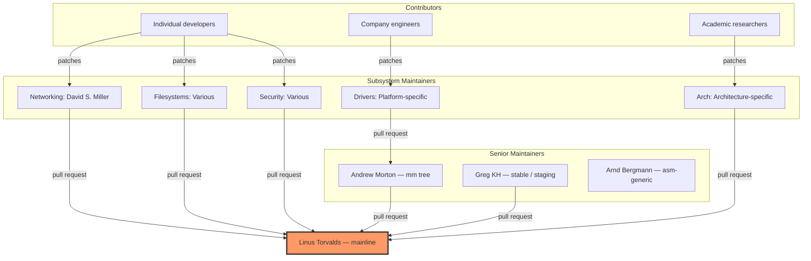
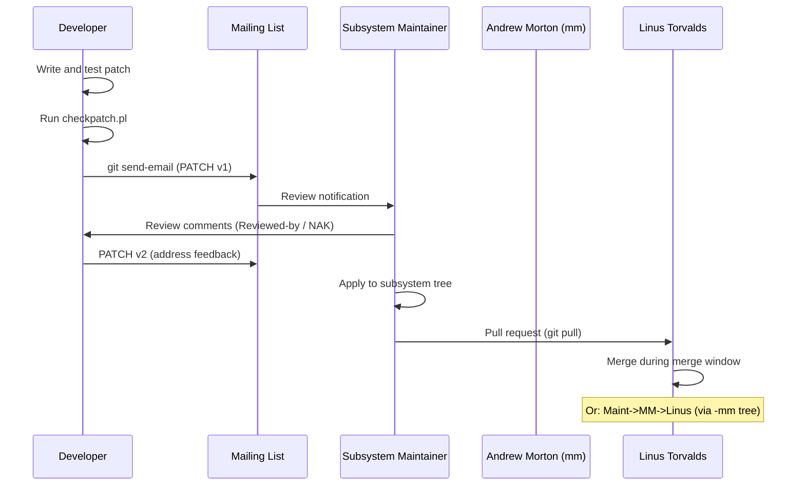
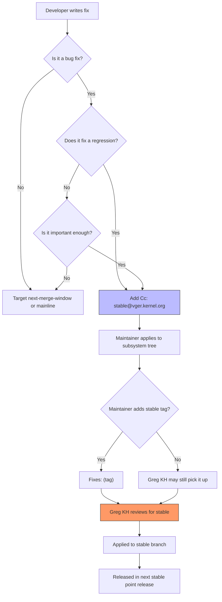
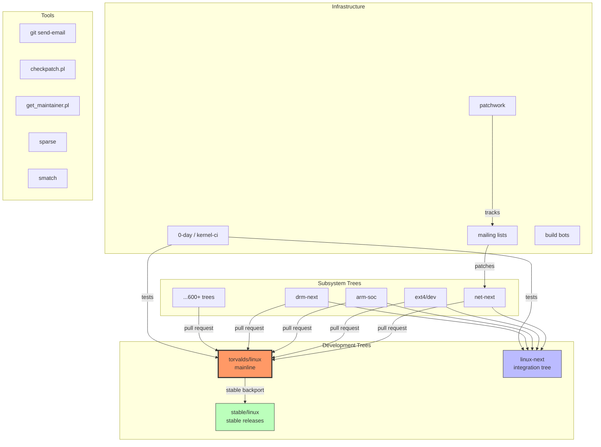

# Linux Kernel Development Model

## Introduction

The Linux kernel is one of the largest and most successful open-source projects in history, with over 28 million lines of code (as of 2024) and thousands of contributors from hundreds of organizations. Yet it operates with a remarkably efficient, hierarchical development model that has evolved organically over three decades.

Unlike many modern projects that use GitHub pull requests or GitLab merge requests, the Linux kernel uses a **mailing-list-based workflow** with a carefully structured maintainer hierarchy. Understanding this model is essential for anyone who wants to contribute to the kernel or simply understand how a world-class software project is managed.

## The Maintainer Hierarchy

### Tree Structure

The kernel development model is a **directed acyclic graph (DAG)** of Git trees, flowing upward toward a single person: **Linus Torvalds**.


### The Role of Each Level

```mermaid
Level 0: Contributors
─────────────────────
• Write code, test, report bugs
• Submit patches via email to appropriate mailing list
• Sign off patches (Developer Certificate of Origin)
• No commit access to any tree

Level 1: Subsystem Maintainers
──────────────────────────────
• Own a specific subsystem or driver area
• Review patches from contributors
• Apply patches to their own Git tree
• Send pull requests to Linus or senior maintainers
• Listed in MAINTAINERS file

Level 2: Senior Maintainers
───────────────────────────
• Andrew Morton (mm tree) — collects patches from many subsystems
• Greg Kroah-Hartman (stable, staging, USB) — stable kernel releases
• Arnd Bergmann (Y2038, asm-generic) — cross-architecture work

Level 3: Linus Torvalds
────────────────────────
• Maintains the mainline tree (torvalds/linux)
• Final authority on what goes into mainline
• Does not write most code — pulls from maintainers
• Sets the release schedule and policy
```

### The MAINTAINERS File

Every kernel source tree contains a `MAINTAINERS` file that maps code areas to responsible people:

```bash
# Example entries from MAINTAINERS

NETWORKING [GENERAL]
M:	David S. Miller <davem@davemloft.net>
L:	netdev@vger.kernel.org
S:	Maintained
F:	net/
F:	include/net/
F:	include/uapi/linux/if_*
T:	git git://git.kernel.org/pub/scm/linux/kernel/git/netdev/net.git

EXT4 FILE SYSTEM
M:	Theodore Ts'o <tytso@mit.edu>
M:	Andreas Dilger <adilger.kernel@dilger.ca>
L:	linux-ext4@vger.kernel.org
S:	Maintained
F:	fs/ext4/
F:	include/ext4*
T:	git git://git.kernel.org/pub/scm/linux/kernel/git/tytso/ext4.git

ARM SUB-ARCHITECTURES
M:	Russell King <linux@armlinux.org.uk>
L:	linux-arm-kernel@lists.infradead.org
S:	Maintained
F:	arch/arm/
```

Use the `get_maintainer.pl` script to find who should receive your patches:

```bash
$ ./scripts/get_maintainer.pl -f drivers/net/ethernet/intel/e1000e/
Jeff Kirsher <jeffrey.t.kirsher@intel.com> (maintainer:INTEL ETHERNET DRIVERS)
intel-wired-lan@lists.osuosl.org (open list:INTEL ETHERNET DRIVERS)
netdev@vger.kernel.org (open list:NETWORKING DRIVERS)
linux-kernel@vger.kernel.org (open list)
```

## The Patch Lifecycle

### From Idea to Mainline

A kernel patch follows a well-defined path:


### Patch Submission Process

#### Step 1: Write the Patch

```mermaid
bash
# Make your changes
$ git add -p
$ git commit -s    # -s adds Signed-off-by (DCO)

# Format the patch
$ git format-patch HEAD~1
0001-driver-fix-some-bug.patch
```

#### Step 2: Check Coding Style

```bash
$ ./scripts/checkpatch.pl 0001-driver-fix-some-bug.patch
total: 0 errors, 1 warnings, 8 lines checked
0001-driver-fix-some-bug.patch has style problems, please review.
NOTE: Ignored message types: COMMIT_LOG_LONG_LINE COMMIT_MESSAGE
```

#### Step 3: Send via Email

```bash
# Configure git for kernel development
$ git config sendemail.to "maintainer@example.com"
$ git config sendemail.cc "linux-kernel@vger.kernel.org"

# Send the patch
$ git send-email \
    --to="David S. Miller <davem@davemloft.net>" \
    --cc="netdev@vger.kernel.org" \
    --cc="linux-kernel@vger.kernel.org" \
    0001-driver-fix-some-bug.patch
```

#### Step 4: Respond to Review

Review responses use standard tags:

```
Reviewed-by: Reviewer Name <email>      — Full review approval
Acked-by: Reviewer Name <email>         — Agreement, typically from maintainer
Tested-by: Tester Name <email>          — Patch was tested successfully
Reported-by: Reporter Name <email>      — Bug was reported by this person
Cc: Person Name <email>                 — CC for awareness
Suggested-by: Person Name <email>       — Idea came from this person
```

## The Release Cycle

### Merge Window

The kernel follows a time-based release cycle, approximately **9–10 weeks** per release:

```mermaid
gantt
    title Linux Kernel Release Cycle (~9-10 weeks)
    dateFormat  X
    axisFormat %s
    
    section Merge Window
    New features merged        :active, mw, 0, 14
    Linus pulls from maintainers :active, mw2, 0, 14
    
    section RC Releases
    rc1 (most features in)     :milestone, rc1, 14, 14
    Bug fixes only             :active, rcfix, 14, 63
    rc2                         :milestone, rc2, 21, 21
    rc3                         :milestone, rc3, 28, 28
    rc4                         :milestone, rc4, 35, 35
    rc5                         :milestone, rc5, 42, 42
    rc6                         :milestone, rc6, 49, 49
    rc7                         :milestone, rc7, 56, 56
    
    section Release
    Final release              :milestone, rel, 63, 63
```


### Merge Window Details

The **merge window** is the first ~2 weeks after a release:

- Linus pulls feature branches from subsystem maintainers
- Only **new features, drivers, and major changes** are merged
- Subsystem maintainers send `git pull` requests
- Thousands of patches can be merged in this period
- Linus is **very selective** — incomplete or buggy pull requests are rejected

```mermaid
bash
# Example: Linus pulling from a subsystem
# (from Linus's perspective)
$ git pull https://git.kernel.org/pub/scm/linux/kernel/git/davem/net.git net-next
```

### Release Candidate (RC) Releases

After the merge window closes, only **bug fixes** are accepted:

```
Release Candidate Schedule
──────────────────────────
v6.8-rc1  ← Merge window closed, most features merged
v6.8-rc2  ← Bug fixes, regression fixes
v6.8-rc3  ← More bug fixes
v6.8-rc4  ← Typically the "calm down" point
v6.8-rc5  ← Should be getting stable
v6.8-rc6  ← Usually the last RC (unless issues found)
v6.8-rc7  ← Only if rc6 had significant regressions
v6.8      ← Final release (usually 7-8 RCs)
```

Linus has stated:
> "The rc1 is the biggest, and the rc's get progressively smaller as the bugs get fixed... If we can't get the bug count down to zero in about a week, we'll do another rc."

### Long-Term Support (LTS) Kernels

Not every kernel release receives long-term support. Selected versions become **LTS kernels** with extended maintenance:

```
LTS Kernels (as of 2024)
─────────────────────────
Kernel 4.19 — LTS until Dec 2024
Kernel 5.4  — LTS until Dec 2025
Kernel 5.10 — LTS until Dec 2026
Kernel 5.15 — LTS until Dec 2026
Kernel 6.1  — LTS until Dec 2026
Kernel 6.6  — LTS until Dec 2027
Kernel 6.12 — LTS until ~2027 (expected)

Maintained by: Greg Kroah-Hartman + Sasha Levin
Stable review list: stable@vger.kernel.org
```

## The Stable Kernel Process

### How Patches Get Into Stable


### The Stable Tag

To nominate a patch for stable, include these tags:

```mermaid
c
/*
 * Fix null pointer dereference in widget driver
 *
 * The widget driver dereferences a NULL pointer when the device
 * is unplugged during initialization. Add a null check.
 *
 * Fixes: abc123def456 ("widget: add initialization support")
 * Cc: stable@vger.kernel.org
 * Signed-off-by: Developer <dev@example.com>
 */
```

## Tools and Infrastructure

### Mailing Lists

The kernel communicates primarily through mailing lists hosted on `vger.kernel.org`:

```
Key Mailing Lists
──────────────────
linux-kernel@vger.kernel.org      — General kernel discussion
netdev@vger.kernel.org            — Networking subsystem
linux-ext4@vger.kernel.org        — EXT4 filesystem
linux-arm-kernel@lists.infradead.org — ARM architecture
stable@vger.kernel.org            — Stable kernel patches
kernel-janitors@vger.kernel.org   — Cleanup patches for newcomers
```

### Patchwork

Many subsystems use **Patchwork** (https://patchwork.kernel.org/) to track patch status:

```
Patch States:
  New        — Submitted, awaiting review
  Under Review — Being reviewed by maintainer
  Accepted   — Applied to maintainer's tree
  Rejected   — Won't be applied (with reason)
  RFC        — Request for Comments (not ready for merge)
  Not Applicable — Wrong tree or already fixed
```

### CI/CD Infrastructure

See [`ci-cd.md`](../build/ci-cd.md) for details on automated testing, but key systems include:

```
Kernel CI/CD Systems
─────────────────────
0-Day Bot        — Intel's automated testing and reporting
KernelCI         — Community CI for multi-architecture testing
LAVA             — LAb for Validation Architecture (Linaro)
Intel 0-Day      — Performance regression testing
ktest            — Automated kernel testing framework (bisect, boot)
syzkaller        — Coverage-guided kernel fuzzer
```

## Code Review Culture

### The Review Process

Kernel code review is **thorough and direct**. Contributors are expected to:

1. **Read existing code** in the subsystem before submitting
2. **Follow coding style** strictly (see `Documentation/process/coding-style.rst`)
3. **Explain the "why"** in the commit message, not just the "what"
4. **Respond to all review comments** — ignoring feedback is unacceptable
5. **Resend the full series** as a new version (v2, v3, etc.) with changelog

### Commit Message Format

```
subsystem: brief description of change (50-72 chars max)

Detailed explanation of WHY this change is needed. Describe
the problem being solved, not just the solution. Reference
relevant discussions, bug reports, or prior attempts.

Use imperative mood: "Fix the widget" not "Fixed the widget"
or "This patch fixes the widget".

Include any relevant technical details that would help a
reviewer understand the change without reading the code.

Signed-off-by: Author Name <author@example.com>
Reviewed-by: Reviewer Name <reviewer@example.com>
Fixes: abc123def456 ("commit being fixed")
Cc: stable@vger.kernel.org
```

### Common Review Feedback Patterns

```
"NAK" — Explicit rejection of the patch
"Needs-better-commit-message" — Commit message doesn't explain the why
"CodingStyle" — Style violation found
"Please resend with Cc: stable" — Nominating for stable
"This is already done by XYZ" — Duplicate effort
"Documentation/process/coding-style.rst please" — Read the docs
"Can you rebase on linux-next?" — Needs to be against latest
```

## Governance and Decision Making

### The Benevolent Dictator Model

Linux uses a **BDFL (Benevolent Dictator For Life)** model, with Linus Torvalds as the final authority:

```
Decision Authority Matrix
─────────────────────────
Subsystem code:    Subsystem maintainer decides
Cross-subsystem:   Negotiation between maintainers
Coding style:      Documented rules + Linus's preference
Feature inclusion: Linus decides during merge window
Release timing:    Linus decides (time-based, not feature-based)
License:           GPL v2 — non-negotiable (Linus's stance)
Naming:            Linus occasionally renames things
```

### How Disagreements Are Resolved

1. **Discussion on mailing list** — most issues are resolved through technical debate
2. **Subsystem maintainer decision** — within their domain
3. **Linus's decision** — for mainline, Linus has final say
4. **Fork** — if you disagree strongly enough, you can fork (it's GPL)

This has happened historically (e.g., the PREEMPT_RT patchset was maintained out-of-tree for ~20 years before being merged).

## Contributing: Getting Started

### First Patch: Kernel Janitors

The recommended path for new contributors:

```bash
# 1. Get the source
$ git clone https://git.kernel.org/pub/scm/linux/kernel/git/torvalds/linux.git
$ cd linux

# 2. Build it (see kernel-build.md)
$ make -j$(nproc)

# 3. Find something to fix
$ ./scripts/checkpatch.pl --file drivers/net/ethernet/intel/e1000e/*.c

# 4. Read the process documentation
$ cat Documentation/process/submitting-patches.rst
$ cat Documentation/process/coding-style.rst

# 5. Make a simple fix (e.g., coding style, typo)
$ vim drivers/net/ethernet/intel/e1000e/netdev.c
$ git commit -s -m "e1000e: fix typo in comment"

# 6. Find the maintainer
$ ./scripts/get_maintainer.pl -f drivers/net/ethernet/intel/e1000e/netdev.c

# 7. Send the patch
$ git send-email --to=<maintainer> --cc=<list> HEAD~1
```

### Contribution Statistics

```
Kernel Contributions by Organization (2024)
────────────────────────────────────────────
Intel         ████████████████████  (~12%)
Google        ███████████████       (~10%)
Meta/Facebook ████████████          (~8%)
Linaro        ██████████            (~6%)
Red Hat       █████████             (~6%)
AMD           ████████              (~5%)
Huawei        ███████               (~4%)
SUSE          ██████                (~4%)
Arm           █████                 (~3%)
Independent   ██████████████████████████ (~42%)
```

## The Role of linux-next

The **linux-next** tree (maintained by Stephen Rothwell) integrates all subsystem trees that are destined for the next merge window:

```bash
# Get linux-next
$ git clone https://git.kernel.org/pub/scm/linux/kernel/git/next/linux-next.git

# This tree contains:
# - All subsystem "next" branches
# - Integration testing target
# - Snapshot of what Linus will pull in next merge window
```

Testing against linux-next is one of the most valuable things developers can do.

## Diagram: The Kernel Development Ecosystem


## Patch Submission Best Practices

Based on the kernel documentation at `docs.kernel.org/process/submitting-patches.html`:

### Describing Changes

1. **Describe the problem first**: Whether it's a one-line fix or 5000-line feature, there must be an underlying problem. Convince the reviewer it's worth fixing.

2. **Describe user-visible impact**: Crashes and lockups are convincing, but describe subtler impacts too. Include provoking circumstances, dmesg excerpts, crash descriptions, performance regressions.

3. **Quantify optimizations**: If claiming improvements in performance, memory, stack footprint, or binary size, include numbers. Describe non-obvious costs and trade-offs.

4. **Use imperative mood**: "make xyzzy do frotz" not "[This patch] makes xyzzy do frotz" or "[I] changed xyzzy to do frotz".

5. **Solve one problem per patch**: If the description gets long, split the patch.

### Referencing Commits

When referencing a specific commit, include both the SHA-1 ID (at least 12 characters) and the one-line summary:

```mermaid
Commit e21d2170f36602ae2708 ("video: remove unnecessary
platform_set_drvdata()") removed the unnecessary
platform_set_drvdata(), but left the variable "dev" unused,
delete it.
```

### Using Tags

```bash
# Fixes tag (for bug fixes)
Fixes: 54a4f0239f2e ("KVM: MMU: make kvm_mmu_zap_page() return the number of pages")

# Link to mailing list discussion
Link: https://lore.kernel.org/30th.anniversary.repost@klaava.Helsinki.FI

# Closes tag (for bug tracker references)
Closes: https://example.com/issues/1234
```

Git config for pretty-format output:
```bash
[core]
  abbrev = 12
[pretty]
  fixes = Fixes: %h (\"%s\")
```

### Developer's Certificate of Origin

All patches must be signed off with `Signed-off-by:` indicating agreement with the DCO 1.1:

```
Developer's Certificate of Origin 1.1

By making a contribution to this project, I certify that:

(a) The contribution was created in whole or in part by me and I
    have the right to submit it under the open source license
    indicated in the file; or

(b) The contribution is based upon previous work that, to the best
    of my knowledge, is covered under an appropriate open source
    license and I have the right under that license to submit that
    work with modifications, whether created in whole or in part
    by me, under the same open source license (unless I am
    permitted to submit under a different license), as indicated
    in the file; or

(c) The contribution was provided directly to me by some other
    person who certified (a), (b) or (c) and I have not modified it.

(d) I understand and agree that this project and the contribution
    are public and that a record of the contribution (including all
    personal information I submit with it, including my sign-off) is
    maintained indefinitely and may be redistributed consistent with
    this project or the open source license(s) involved.
```

### Review Tags

Standard tags used in the review process:

| Tag | Meaning |
|-----|--------|
| `Reviewed-by:` | Full review approval |
| `Acked-by:` | Agreement, typically from maintainer |
| `Tested-by:` | Patch was tested successfully |
| `Reported-by:` | Bug was reported by this person |
| `Cc:` | CC for awareness |
| `Suggested-by:` | Idea came from this person |
| `Co-developed-by:` | Joint authorship |
| `Assisted-by:` | Non-author assistance |

## The Kernel Development Process (from docs.kernel.org)

The kernel documentation at `docs.kernel.org/process/development-process.html` provides the authoritative guide to how kernel development works in practice. Key points from the official documentation:

### The Development Lifecycle

The kernel development process follows a well-defined pattern:

1. **Early-stage planning**: Before writing code, developers should specify the problem clearly, discuss it on the appropriate mailing list, and get buy-in from relevant maintainers. Getting early feedback saves significant rework later.

2. **Getting the code right**: The kernel has strict requirements for code quality. Developers must use code checking tools (`checkpatch.pl`, `sparse`, `smatch`, Coccinelle). All code must be documented, and internal API changes must be coordinated across subsystems.

3. **Posting patches**: Patches should be posted at the right time (not too early, not too late in the cycle), prepared with proper formatting and changelogs, and sent to the correct mailing lists and maintainers using `git send-email`.

4. **Followthrough**: After posting, developers must work with reviewers, respond to feedback, and resend updated versions. Ignoring review feedback is one of the most common reasons patches are rejected.

5. **Advanced topics**: Managing patch series with `git`, reviewing others' patches, and understanding the merge window dynamics.

### The Importance of Getting Code into Mainline

The documentation stresses that getting code merged into the mainline kernel is critical:
- **Maintenance burden**: Out-of-tree code requires constant rebasing against new kernel releases
- **Code quality**: The review process improves code quality significantly
- **Community support**: Mainline code gets testing and bug fixes from the community
- **Legal clarity**: The DCO process ensures clear provenance

### Tools of the Trade

The development process relies on several key tools:
- **Git**: Version control (torvalds/linux for mainline)
- **git send-email**: Patch submission (not GitHub PRs)
- **checkpatch.pl**: Coding style enforcement
- **get_maintainer.pl**: Finding the right recipients for patches
- **sparse**: Static analysis for kernel-specific annotations
- **Coccinelle**: Semantic code matching and transformation

### Mailing Lists

The kernel communicates primarily through mailing lists hosted on `vger.kernel.org`. The `linux-kernel@vger.kernel.org` list is the general discussion list, but most development happens on subsystem-specific lists (e.g., `netdev@vger.kernel.org` for networking).

## References and Further Reading

- [The Linux Kernel Documentation](https://docs.kernel.org/)
- [GNU Project Documentation](https://www.gnu.org/doc/doc.html)
- [GNU Manuals](https://www.gnu.org/manual/manual.html)
- [Free Software Directory](https://directory.fsf.org/wiki/Main_Page)
- [Planet GNU](https://planet.gnu.org/)
- [Free Software Books](https://www.gnu.org/doc/other-free-books.html)

- Kroah-Hartman, Greg. "How the Linux Kernel is Developed." https://www.kernel.org/doc/html/latest/process/howto.html
- Torvalds, Linus. "Linux Kernel Management Style." https://www.kernel.org/doc/html/latest/process/management-style.html
- "Submitting Patches: The Essential Guide." https://docs.kernel.org/process/submitting-patches.html
- "A Guide to the Kernel Development Process." https://docs.kernel.org/process/development-process.html
- Linux kernel MAINTAINERS file: https://git.kernel.org/pub/scm/linux/kernel/git/torvalds/linux.git/tree/MAINTAINERS
- kernel.org Git repositories: https://git.kernel.org/
- Kernel Newbies — First Kernel Patch: https://kernelnewbies.org/FirstKernelPatch
- LWN.net — Kernel development coverage: https://lwn.net/Kernel/
- Jonathan Corbet's kernel reports: https://lwn.net/Archives/GuestIndex/
- Linux Foundation — Kernel development reports: https://www.linuxfoundation.org/publications/
- linux-next tree: https://git.kernel.org/pub/scm/linux/kernel/git/next/linux-next.git/
- Patchwork: https://patchwork.kernel.org/
- The Linux Kernel Documentation — Development Process: https://www.kernel.org/doc/html/latest/process/development-process.html
- [A Guide to the Kernel Development Process](https://docs.kernel.org/process/development-process.html) — Official kernel documentation

## Related Topics

- [Unix Timeline](./unix-timeline.md) — the historical context of kernel development
- [Notable Kernel Versions](./notable-versions.md) — what each major release brought
- [Key Kernel Subsystems](./subsystems.md) — the subsystem landscape
- [Building the Kernel](../build/kernel-build.md) — compile and test your changes
- [CI/CD for the Kernel](../build/ci-cd.md) — automated testing infrastructure
