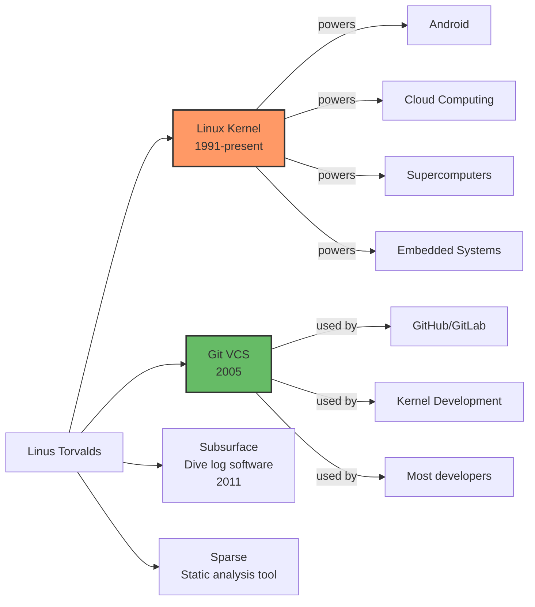
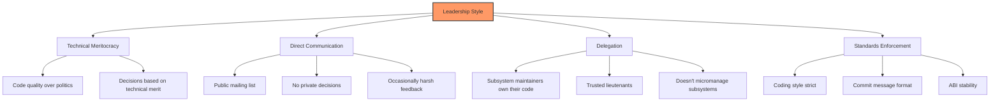
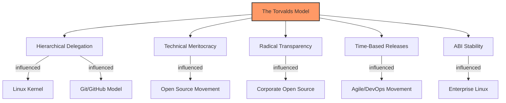

# Linus Torvalds: Creator and Leader of Linux

## Introduction

**Linus Benedict Torvalds** (born December 28, 1969, in Helsinki, Finland) is the creator of the Linux kernel and Git, the distributed version control system. His work has fundamentally shaped modern computing—Linux powers everything from the world's fastest supercomputers to billions of Android phones, and Git has become the de facto standard for version control in software development.

Yet Torvalds is not merely a talented programmer. His leadership of the Linux kernel project for over three decades represents one of the most remarkable sustained achievements in software engineering. This chapter explores his biography, technical contributions, development philosophy, and the leadership style that has both inspired and polarized the open-source community.

## Early Life and Education

### Childhood in Helsinki

Linus was born into an intellectual Finnish-Swedish family. Both his parents, **Nils** and **Anna Torvalds**, were journalists—his father was a radio journalist and his mother a newspaper editor. His grandfather, **Ole Torvalds**, was a prominent poet and professor.

```
Torvalds Family Context
───────────────────────
Born: December 28, 1969, Helsinki, Finland
Nationality: Finnish (became US citizen 2010)
Language: Swedish-speaking Finn (minority)
Education: University of Helsinki (M.S. Computer Science)
```

His interest in computers began early. At age 11, he was given access to his grandfather's Commodore VIC-20, where he began writing BASIC programs. This early exposure to computing sparked a lifelong passion.

### University Years

In 1988, Torvalds enrolled at the **University of Helsinki** to study computer science. The university's computing environment exposed him to Unix, and he quickly became proficient with **Sun Unix workstations**.

Key formative experiences at university:

1. **接触 Unix** — Access to Unix workstations gave him experience with a proper operating system
2. **MINIX** — Andrew Tanenbaum's teaching OS inspired his own operating system work
3. **386 PC purchase** — In January 1991, he bought an IBM PC/AT clone with an Intel 386
4. **GNU tools** — Familiarity with GCC, Emacs, and the GNU philosophy

```
Timeline: From Student to Creator
──────────────────────────────────
1988 — Enrolls at University of Helsinki
1990 — Takes operating systems course, encounters MINIX
1991 (Jan) — Buys 386 PC ($3,500)
1991 (Apr) — Starts writing terminal emulator
1991 (Jul) — Terminal emulator becomes an OS kernel
1991 (Aug 25) — Posts to comp.os.minix
1991 (Sep 17) — Releases Linux 0.01
1992 — Graduates with M.S. in Computer Science
```

## The Creation of Linux

### The Famous Usenet Post

On August 25, 1991, Torvalds posted the following message to `comp.os.minix`:

```
From: torvalds@klaava.Helsinki.FI (Linus Benedict Torvalds)
Newsgroups: comp.os.minix
Subject: What would you like to see most in minix?
Summary: small poll for my new operating system
Message-ID: <1991Aug25.205708.9541@klaava.Helsinki.FI>
Date: 25 Aug 91 20:57:08 GMT
Organization: University of Helsinki

Hello everybody out there using minix -

I'm doing a (free) operating system (just a hobby, won't be big
and professional like gnu) for 386(486) AT clones. This has been
brewing since april, and is starting to get ready. I'd like any
feedback on things people like/dislike in minix, as my OS resembles
it somewhat (same physical layout of the file-system (due to
practical reasons) among other things).

I've currently ported bash(1.08) and gcc(1.40), and things seem
to work. This implies that I'll get something practical within a
few months, and I'd like to know what features most people would
want. Any suggestions are welcome, but I won't promise I'll
implement them :-)

                Linus (torvalds@kruuna.helsinki.fi)

PS. Yes - it's free of any minix code, and it has a multi-threaded
fs. It is NOT protable (sic) (uses 386 task switching etc), and it
probably never will support anything other than AT-harddisks, as
that's all I have :-(.
```

This casual message—marked "just a hobby"—would lead to the most significant operating system development project in history.

### Early Development

The first version (0.01) was released on September 17, 1991. It was minimal:

```
Linux 0.01 Features (September 1991)
──────────────────────────────────────
Total files: ~100
Lines of C: ~8,400
Lines of assembly: ~1,700
Features:
  ✓ Boot on 386 PC
  ✓ Run in protected mode
  ✓ Simple process scheduling
  ✓ Basic filesystem (MINIX-compatible)
  ✓ Serial terminal driver
  ✓ Keyboard/screen driver
  ✗ Networking
  ✗ Sound
  ✗ Graphics (text mode only)
  ✗ Multi-user (single user only)
  ✗ POSIX compliance
```

### The GPL Decision

Initially, Linux was released under a license that prohibited commercial use. In February 1992, Torvalds switched to the **GNU General Public License (GPL v2)**. This was a pivotal decision:

```c
/*
 * From the earliest Linux COPYING file:
 *
 * This program is free software; you can redistribute it and/or
 * modify it under the terms of the GNU General Public License
 * as published by the Free Software Foundation; either version
 * 2 of the License, or (at your option) any later version.
 */
```

The GPL ensured that:
1. Anyone could use, modify, and distribute Linux
2. Modifications must also be GPL-licensed (copyleft)
3. No one could create a proprietary fork
4. The community would grow without fragmentation

## Technical Contributions

### Beyond the Kernel

While Torvalds is best known for Linux, his technical contributions extend further:



### Git: Created Out of Necessity

In 2005, the Linux kernel project lost access to **BitKeeper** (a proprietary VCS) due to license disputes. Torvalds created Git in approximately **two weeks**:

```
Git Development Timeline
────────────────────────
April 3, 2005  — BitKeeper license revoked
April 7, 2005  — Torvalds starts writing Git
April 18, 2005 — Git can self-host (commit #1: itself)
June 16, 2005  — Linux 2.6.12 managed with Git
July 25, 2005  — Torvalds hands Git maintenance to Junio Hamano
July 26, 2005  — Git 0.99.9e released
```

Git's design reflected Torvalds's core principles:

```bash
# Git was designed with these properties:
# 1. Distributed — no single point of failure
# 2. Fast — optimized for kernel-scale repositories
# 3. Cryptographic integrity — SHA-1 hashing
# 4. Non-linear — cheap branching and merging
# 5. Support for large projects — Linux kernel was the use case

# Performance benchmark (original design goal):
# - Check out Linux kernel: < 30 seconds
# - Apply patch: < 1 second
# - Diff against last commit: < 1 second
```

### Kernel Code Contributions

While Torvalds writes less kernel code than in the early days, he still contributes. His areas of personal involvement:

```
Torvalds's Direct Kernel Work
──────────────────────────────
Early years (1991-2000):
  • Wrote the original kernel (process scheduler, filesystem, drivers)
  • Designed the VFS (Virtual File System) layer
  • Wrote the original ext2 filesystem
  • Designed the module loading system
  • Implemented the original networking stack

Middle period (2000-2010):
  • Wrote Git (2005)
  • Maintained the merge process
  • Wrote sparse (static analysis tool)
  • Personal subsystem: sometimes random drivers

Modern era (2010-present):
  • Primarily maintains merge process
  • Reviews pull requests
  • Makes release decisions
  • Writes occasional patches
  • Maintains Subsurface (dive log application)
```

## Development Philosophy

### The Linus Torvalds School of Software Engineering

Torvalds has articulated a clear philosophy over decades of public statements. Key tenets:

#### 1. "Release Early, Release Often"

```
Contrast: Linux vs. Traditional OS Development
───────────────────────────────────────────────
Windows (traditional):
  3-5 year release cycles → Long development → Big bang release

Linux kernel:
  ~9-10 week release cycles → Continuous integration → Incremental
  Merge window (2 weeks) → RC period (7-8 weeks) → Release → Repeat
```

#### 2. "Good Taste" in Code

Torvalds frequently emphasizes code quality and "good taste":

```c
/* BAD: Special cases and unnecessary branching */
void remove_list_entry(struct list_entry *entry)
{
    struct list_entry *prev = NULL;
    struct list_entry *walk = head;

    /* Find the predecessor */
    while (walk != entry) {
        prev = walk;
        walk = walk->next;
    }

    /* Remove the entry */
    if (prev == NULL)
        head = entry->next;
    else
        prev->next = entry->next;
}

/* GOOD: Eliminate the special case */
void remove_list_entry(struct list_entry *entry)
{
    struct list_entry **indirect = &head;

    /* Walk the indirect pointer */
    while (*indirect != entry)
        indirect = &(*indirect)->next;

    /* Remove the entry */
    *indirect = entry->next;
}
```

> "Bad programmers worry about the code. Good programmers worry about data structures and their relationships."
> — Linus Torvalds

#### 3. Never Break Userspace

This is Torvalds's **cardinal rule**:

> "We do NOT break userspace! ... This is the #1 rule of kernel programming."
> — Linus Torvalds, LKML, 2012

```c
/*
 * If a change breaks an existing userspace application, the change
 * is WRONG, regardless of how "correct" it might be from a kernel
 * perspective.
 *
 * Examples:
 * - We can't change the behavior of syscalls even if the old
 *   behavior was a "bug"
 * - We can't remove a /proc file that userspace reads
 * - We can't change ioctl behavior that applications depend on
 * - ABI stability is sacred
 */
```

#### 4. Micro-Optimizations Matter

```
Torvalds on Performance
───────────────────────
"A 5% improvement in a hot path is worth more than a 50%
 improvement in a cold path."

This philosophy drove:
  • Fast path optimizations in the scheduler
  • RCU (Read-Copy-Update) for lockless reads
  • Per-CPU data structures to avoid cache bouncing
  • The emphasis on branch prediction and data locality
```

#### 5. Security is Not Special

Torvalds has been controversial for his stance that security is just another type of bug:

> "I personally consider security bugs to be just 'normal bugs'. I don't cover them up, but I also don't have any reason what-so-ever to think it's a good idea to track them and advertise them."

This position has evolved over time, with the kernel now having formal security processes.

## Leadership Style

### The "Benevolent Dictator"

Torvalds leads through a combination of technical authority and direct communication:



### Communication Style

Torvalds is known for his **direct, often blunt** communication style on the Linux kernel mailing list:

```
Example LKML Interactions
─────────────────────────
Positive:
  "Nice catch, applied."
  "This is the right approach. Good job."
  "Merged. Clean code, good commit message."

Critical:
  "This code is completely wrong. Don't ever do this."
  "Your patch is garbage. Here's why..."
  "Did you even test this?"

Philosophical:
  "This is not about technical merit, this is about not
   breaking existing users."
  "You're solving the wrong problem."
```

### The Tone Debate

In September 2018, Torvalds took a break from kernel development and apologized for his behavior:

```
September 16, 2018 — Torvalds's Public Apology
────────────────────────────────────────────────
"I need to change some of my behavior, and I want to
 apologize to the people that my personal behavior
 hurt and possibly drove away from kernel development."

Actions taken:
  • Signed up for professional counseling
  • Adopted the Code of Conflict (later Code of Conduct)
  • Took a month-long break from kernel work
  • Returned with a moderated tone
```

This led to the adoption of the **Linux Kernel Code of Conduct** (based on the Contributor Covenant).

### Management Style

From Torvalds's own "Linux Kernel Management Style" document:

```
Key Management Principles
─────────────────────────
1. "Don't hide your problem"
   — Be open about mistakes and limitations

2. "You are not a nice person, and you don't need to be"
   — But you should be fair and honest

3. "People who don't make mistakes rarely make anything"
   — Tolerate experimentation

4. "Your top priority is to delegate"
   — You can't do everything yourself

5. "Trust your lieutenants"
   — They're competent; let them work

6. "Don't merge code you don't understand"
   — If you can't review it, find someone who can
```

## Personal Characteristics

### The Person Behind the Code

```
Personal Facts
──────────────
Born: December 28, 1969, Helsinki, Finland
Citizenship: Finnish (naturalized US citizen, 2010)
Residence: Portland, Oregon, USA
Family: Married to Tove Torvalds (met online, she was a
        Finnish karate champion); three daughters
Hobbies: Diving (wrote Subsurface dive log software)
Hardware: Uses AMD processors (publicly switched from Intel)
OS: Runs Fedora Linux on his main workstation
```

### Awards and Recognition

```
Awards Timeline
───────────────
1998 — EFF Pioneer Award
2000 — British Computer Society Lovelace Medal
2001 — Takeda Award (shared with Stallman and Tanenbaum)
2005 — Reader's Choice Award, Linux Magazine
2008 — C&C Prize (NEC Foundation)
2012 — Millennium Technology Prize (€1.2 million)
         — First awarded for an open-source contribution
2014 — IEEE Computer Society Computer Pioneer Award
2018 — IEEE Masaru Ibuka Consumer Electronics Award
```

### Famous Quotes

```
Selected Torvalds Quotes
────────────────────────
On software design:
  "Software is like sex: it's better when it's free."

On debugging:
  "Most good programmers do programming not because they expect
   to get paid or get adulation by the public, but because it
   is fun to program."

On the GPL:
  "The GPL is what keeps me honest. It forces everyone to play
   by the same rules."

On his role:
  "I'm not a visionary. I'm an engineer. I'm perfectly happy
   with all the people who are walking around and just staring
   at the clouds and looking at the stars and saying, 'I want
   to go there.' But I'm looking at the ground, and I want to
   fix the pothole that's right in front of me before I fall in."

On C++ (a recurring theme):
  "C++ is a horrible language... In other words, the only way
   to do good, efficient, and system-level and portable C++ code
   ends up to limit yourself to all the features that were
   available in C."
```

## Legacy and Impact

### Scale of Impact

```
Linux Impact by Numbers (2024)
──────────────────────────────
Lines of kernel code:         ~28 million
Contributors (all time):      ~20,000+
Contributing organizations:   ~1,700+
Devices running Linux:        ~4+ billion
Percentage of top 500         100%
  supercomputers:
Web servers (estimated):      ~80%+
Cloud infrastructure:         ~90%+
Android devices:              ~3+ billion
Git repositories worldwide:   ~90%+ of version control
```

### The Torvalds Model

Perhaps Torvalds's greatest contribution is the **development model** itself:



The model's key innovations:
1. **Delegation with trust** — subsystem maintainers have real authority
2. **Public discussion** — all decisions happen on public mailing lists
3. **Technical merit** — code quality determines inclusion, not politics
4. **Time-based releases** — features don't delay releases
5. **ABI stability** — userspace is sacred and never broken

## References and Further Reading

- Torvalds, Linus & Diamond, David. *Just for Fun: The Story of an Accidental Revolutionary*. HarperBusiness, 2001. ISBN 978-0066620732
- Torvalds, Linus. "Linux Kernel Management Style." https://www.kernel.org/doc/html/latest/process/management-style.html
- The original comp.os.minix Usenet post: https://groups.google.com/g/comp.os.minix/c/dlNtH7RRrGA/m/SwRav4RyEVEJ
- "Git: The Origin Story" — TechCrunch: https://techcrunch.com/2012/04/14/an-interview-with-miwako-aka-git-creator-linus-torvalds/
- Wikipedia: Linus Torvalds: https://en.wikipedia.org/wiki/Linus_Torvalds
- Linux Foundation biography: https://www.linuxfoundation.org/about/linus-torvalds
- LWN.net: "Code, conflict, and conduct": https://lwn.net/Articles/764393/
- Millennium Technology Prize: https://millenniumprize.org/technology-prize/linux/
- "The Code" (documentary): https://www.youtube.com/watch?v=XMm0HsmOTFI
- Linux Kernel Code of Conduct: https://www.kernel.org/doc/html/latest/process/code-of-conduct.html

## Related Topics

- [Unix Timeline](./unix-timeline.md) — the historical context of Linux's creation
- [The Tanenbaum-Torvalds Debate](./tanenbaum-debate.md) — the famous philosophical clash
- [Linux Kernel Development Model](./development-model.md) — how Torvalds runs the project
- [Notable Kernel Versions](./notable-versions.md) — major releases under Torvalds's leadership
- [Git Version Control](../build/kernel-build.md) — the tool Torvalds created for kernel development
