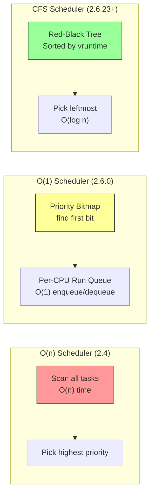
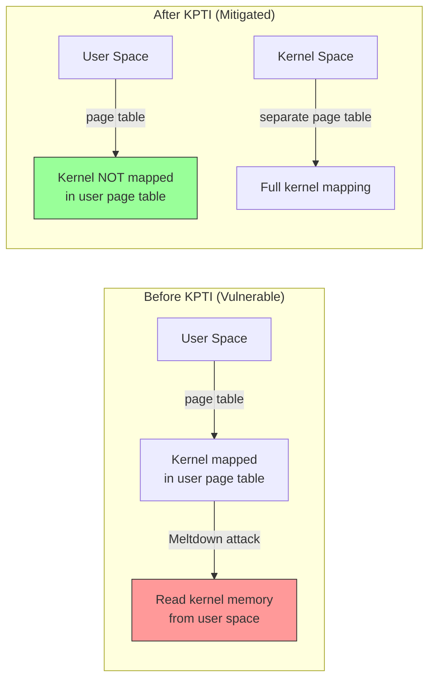
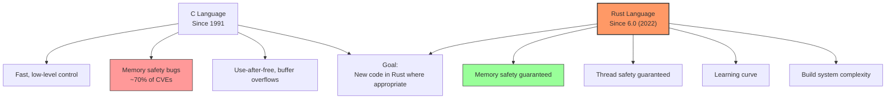
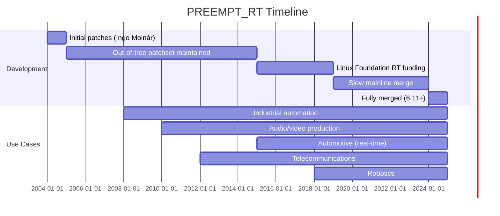

# Notable Kernel Versions

## Introduction

The Linux kernel has gone through dozens of major releases since Linus Torvalds first announced it in 1991. Each version brought significant changes—some technical, some organizational, and some philosophical. This chapter examines the most notable kernel releases, what made them important, and how they shaped the operating system landscape.

Understanding the version history helps you appreciate why certain design decisions were made, why some features exist and others don't, and how the kernel evolved from a hobbyist project to the foundation of modern computing.

## Version Numbering

The kernel's version numbering has changed over time:

```
Versioning Schemes
──────────────────
Pre-1.0:    0.01, 0.02, ..., 0.99, 0.99.15
1.x era:    1.0.0, 1.1.0, 1.2.0, 1.3.0
2.x era:    2.0.0, 2.1.0 (dev), 2.2.0, 2.3.0 (dev), 2.4.0, 2.5.0 (dev), 2.6.0
2.6.x era:  2.6.0 through 2.6.39 (no major version bumps for 6 years)
3.x-6.x:    3.0, 3.1, ..., 3.19, 4.0, ..., 4.20, 5.0, ..., 5.19, 6.0, ...
             (Major bumps are just numbers, no semantic meaning)

Current scheme: MAJOR.MINOR (e.g., 6.12)
  - No even=stable / odd=development distinction
  - -rcN suffix for release candidates
  - .0 is the first release (no separate .0)
```

> Linus on version numbering: "I decided to just go to 3.0 because the numbers were getting too big. No deeper meaning."

## Linux 1.0 — The First Stable Release (March 14, 1994)

### Significance

Linux 1.0 was the first "production-ready" release, marking the transition from a hobby project to a viable operating system.

```
Linux 1.0 Key Features
───────────────────────
• Networking: TCP/IP stack (BSD sockets API)
• Multi-user support
• Virtual memory with demand paging
• Shared libraries (a.out format)
• Loadable kernel modules
• ELF binary format support (coming in 1.2)
• Support for 386, 486 processors
• ext filesystem (precursor to ext2)
• SCSI support
• Sound card support (basic)

Code size: ~176,000 lines of C
Platforms: x86 only (32-bit)
```

### Historical Context

By March 1994, Linux had already been in use for over two years. The 1.0 release was largely a marketing decision—it signaled maturity to potential adopters. The actual code had been stable for some time.

```
1994 Linux Landscape
─────────────────────
Distributions: Slackware 2.0, Debian 0.91
Users:         ~100,000 estimated
Mailing list:  linux-activists@niksula.hut.fi
FTP site:      ftp.funet.fi (primary mirror)
```

## Linux 2.0 — SMP and the Desktop Dream (June 9, 1996)

### Breakthrough Features

```
Linux 2.0 Highlights
─────────────────────
• Symmetric Multi-Processing (SMP) — up to 2 CPUs initially
  (later expanded to 4, then more)
• Native TCP/IP networking improvements
• ELF binary format (default)
• ext2 filesystem (journaling came later)
• Improved memory management
• Loadable kernel modules (mature)
• Support for multiple architectures (Alpha, MIPS, SPARC)
• IP masquerading / firewalling
• Extended partitions beyond 2GB

Code size: ~400,000 lines
```

### SMP Architecture

```c
/* 2.0 SMP model — Big Kernel Lock (BKL)
 *
 * The original SMP implementation used a single global lock:
 * Only one CPU could execute kernel code at a time.
 * This was simple but severely limited scalability.
 */

/* The BKL was a single spinlock that protected the entire kernel */
extern spinlock_t kernel_flag;

/* To enter the kernel from a system call: */
lock_kernel();
/* ... do kernel work ... */
unlock_kernel();
```

```
SMP Scalability in 2.0 vs Later
────────────────────────────────
2.0 (BKL):        2 CPUs → ~1.7x speedup (overhead of lock contention)
2.2+:             Started removing BKL from critical paths
2.4:              Significant BKL removal
2.6:              BKL pushed to edges (mostly removed)
3.0+:             BKL completely removed (2011)
```

## Linux 2.2 — Enterprise Features (January 25, 1999)

```
Linux 2.2 Highlights
─────────────────────
• Improved SMP (per-CPU data, finer-grained locks)
• ext2 improvements (larger filesystem support)
• NFS v3 support
• Improved networking (netfilter/iptables framework)
• PCMCIA support
• USB support (basic)
• RAID support
• Better laptop support (APM)
• IPsec
• Improved POSIX compliance

Code size: ~1,500,000 lines
SMP scale:   Up to 4+ CPUs effectively
```

## Linux 2.4 — Enterprise Ready (January 4, 2001)

### The Big Enterprise Push

Linux 2.4 was a watershed release that made Linux viable for enterprise server workloads.

```
Linux 2.4 Highlights
─────────────────────
• Full USB support (USB 1.1)
• ext3 filesystem (journaling)
• Logical Volume Manager (LVM)
• Improved SMP scalability (up to 16+ CPUs)
• Pluggable I/O schedulers
• Per-process namespace support
• Improved memory management (rmap)
• PCMCIA/CardBus support
• ACLs for ext2/ext3
• Extended attributes
• Serial ATA (basic)
• 64-bit file sizes on 32-bit systems
• IPv6 support (experimental)

Code size: ~3,000,000 lines
```

### ext3: The Journaling Filesystem

```bash
# ext3 added journaling to ext2
# Journaling prevents filesystem corruption after crashes

$ mkfs.ext3 /dev/sdb1
# Or convert existing ext2:
$ tune2fs -j /dev/sdb1

# Journal options in /etc/fstab
/dev/sdb1  /data  ext3  defaults,data=writeback  0  2

# Journal modes:
#   journal  — Full data and metadata journaling (slowest, safest)
#   ordered  — Metadata journaling, data written first (default)
#   writeback — Metadata journaling only (fastest, some risk)
```

## Linux 2.6 — The Revolution (December 17, 2003)

### Why 2.6 Was Revolutionary

Linux 2.6 was arguably the most important release in kernel history. It represented a fundamental shift in development methodology and brought enterprise-grade features.

```
Linux 2.6 Highlights
─────────────────────
Kernel Infrastructure:
  • O(1) scheduler — constant-time scheduling regardless of load
  • Preemptible kernel — improved desktop responsiveness
  • Improved SMP — fine-grained locking, NUMA awareness
  • New I/O schedulers (Anticipatory, CFQ, Deadline)
  • Kernel threads (no more "context trick")
  • futex — fast userspace mutexes
  • epoll — scalable event notification
  • inotify — filesystem event monitoring
  • SELinux integration

Filesystems:
  • XFS ported from IRIX
  • ReiserFS improvements
  • sysfs (/sys) — unified device model
  • FUSE — filesystem in userspace
  • Extended attributes (xattr)

Hardware Support:
  • USB 2.0 support
  • SATA support
  • Native WiFi stack (mac80211)
  • ALSA sound system (replacing OSS)
  • ACPI improvements
  • Large NUMA systems (64+ CPUs)

Networking:
  • IPsec integrated
  • Netfilter/iptables mature
  • IPv6 improvements
  • SCTP support

Security:
  • SELinux (NSA contribution)
  • Linux Security Module (LSM) framework
  • Capabilities (fine-grained privileges)
  • seccomp (system call filtering)

Code size: ~6,000,000 lines (2.6.0)
```

### The O(1) Scheduler



### The Development Model Change

The 2.6 kernel adopted the **time-based release model** that persists today:

```
Old Model (2.0-2.4):
  2.0 → 2.1 (unstable) → 2.2 (stable) → 2.3 (unstable) → 2.4 (stable)
  Unstable series could last 2+ years
  Major features only in unstable series

New Model (2.6+):
  2.6.0 → 2.6.1 → 2.6.2 → ... → 2.6.39 → 3.0 → ...
  Every release is "stable" (production-ready)
  New features go into every release (merge window)
  ~2-3 month release cycle
```

## Linux 3.0 — The Version Bump (July 21, 2011)

```
Linux 3.0 Highlights
─────────────────────
• Version bump from 2.6.39 to 3.0 (no technical reason)
• BKL (Big Kernel Lock) completely removed
• OpenRISC architecture support
• Berkeley Packet Filter (BPF) JIT compiler
• Transparent Huge Pages improvements
• Cleancache and frontswap (virtualization optimization)
• Ext4 improvements (bigalloc, metadata checksums)

Linus's announcement:
  "So, let's just make it 3.0 and stop the numbering madness.
   Because I don't think we can reasonably count to 40."
```

## Linux 4.0 — "No New Features" (April 12, 2015)

```
Linux 4.0 Highlights
─────────────────────
• Live kernel patching (kpatch/livepatch)
  — Apply security fixes without rebooting
• UMl (User-Mode Linux) improvements
• Tracing improvements
• Memory management optimizations

The 4.0 release was notable more for what it symbolized than
for its features. Torvalds had polled the community about
whether 4.0 should have "no new features" — and most said yes.
```

### Live Patching

```bash
# Live patching allows applying security fixes to a running kernel
# No reboot required — critical for high-availability systems

# Load a live patch module
$ insmod kpatch-fix.ko

# Check live patch status
$ cat /sys/kernel/livepatch/kpatch-fix/enabled
1

# Architecture support:
# x86_64 — Full support (since 4.0)
# s390   — Full support (since 4.0)
# ppc64  — Full support (since 4.7)
# arm64  — Full support (since 5.x)
```

## Linux 4.15 — Spectre/Meltdown (January 28, 2018)

### The Speculative Execution Crisis

```
Linux 4.15 Highlights
─────────────────────
• Spectre and Meltdown mitigations (emergency patches)
• KPTI (Kernel Page Table Isolation) for Meltdown
• Retpoline for Spectre v2
• AMD Secure Encrypted Virtualization (SEV)
• Improvements to the block layer (blk-mq multi-queue)
• BPF improvements (BPF Type Format — BTF)
• cpufreq schedutil governor improvements

Code size: ~25,000,000 lines
```

### Meltdown Mitigation (KPTI)



```c
/* KPTI implementation (simplified)
 * 
 * Two sets of page tables per process:
 * 1. User page tables: kernel mostly unmapped (trampoline only)
 * 2. Kernel page tables: full kernel + user mappings
 *
 * On syscall entry: switch to kernel page tables
 * On syscall exit: switch to user page tables
 * Performance cost: ~5% on typical workloads
 */
```

## Linux 5.0 — More Version Bumping (March 3, 2019)

```
Linux 5.0 Highlights
─────────────────────
• AMD Radeon FreeSync / VRR support
• Adiantum filesystem encryption (for low-end devices)
• Energy-aware scheduling improvements
• BPF improvements (bounded loops)
• Swap file support on Btrfs
• x86 UMIP support (User-Mode Instruction Prevention)
• Energy Model framework for power management
• New "cpu.big" cpufreq governor for big.LITTLE

Again, the version bump was arbitrary:
Linus: "The numbering doesn't mean anything."
```

## Linux 5.10 — LTS and Stability (December 13, 2020)

```
Linux 5.10 Highlights
─────────────────────
• BPF ring buffer — efficient data streaming
• Thermal pressure awareness for scheduling
• KSMBD — kernel SMB3 server
• Virtio-mem — memory hotplug for VMs
• Maple tree data structure preparation
• io_uring improvements
• Real-time (PREEMPT_RT) progress

This is a Long-Term Support (LTS) kernel:
  Maintained until December 2026
  Widely used in embedded systems, automotive, industrial
```

## Linux 6.0 — Rust Infrastructure (October 2, 2022)

### Rust in the Kernel

```
Linux 6.0 Highlights
─────────────────────
• Rust build system infrastructure merged (no actual Rust drivers yet)
• io_uring improvements (zero-copy send)
• BPF arena memory types
• Maple tree data structure (replacing rbtree for VMAs)
• Multi-generational LRU (MGLRU) page reclaim
• TCP fastopen improvements
• Apple M1 basic support groundwork
• LoongArch architecture support
```

### The Rust Decision



```rust
// Example: Simple Rust kernel module (from samples/rust/)

use kernel::prelude::*;

module! {
    type: RustMinimal,
    name: "rust_minimal",
    author: "Rust for Linux Contributors",
    description: "Rust minimal sample",
    license: "GPL",
}

struct RustMinimal {
    message: String,
}

impl kernel::Module for RustMinimal {
    fn init(_module: &'static ThisModule) -> Result<Self> {
        pr_info!("Rust minimal module loaded\n");
        Ok(RustMinimal {
            message: String::try_from("Hello from Rust!\n")?,
        })
    }
}

impl Drop for RustMinimal {
    fn drop(&mut self) {
        pr_info!("Rust minimal module unloaded\n");
    }
}
```

## Linux 6.5 — Modern Hardware Support (August 27, 2023)

```
Linux 6.5 Highlights
─────────────────────
• USB4 v2 support (80 Gbps)
• MIPS: User-Mode Instruction Prevention
• LoongArch: KVM virtualization support
• ARM: Memory Tagging Extension (MTE) support
• AMD P-State EPP (Energy Performance Preference)
• BPF: struct_ops improvements
• Nouveau: GSP firmware support (NVIDIA open driver)
• io_uring: registered buffers improvements
• Rust: abstractions for device/driver registration
```

## Linux 6.11 — Cutting Edge (September 2024)

```
Linux 6.11 Highlights
─────────────────────
• PREEMPT_RT fully merged into mainline!
  (After ~20 years of out-of-tree development)
• Raspberry Pi 5 support improvements
• Intel Lunar Lake & Arrow Lake support
• AMD GPU improvements (RDNA4 prep)
• Rust block device driver support
• BPF: exceptions and typed pointers
• Maple tree optimizations
• New io_uring features
```

### PREEMPT_RT: A 20-Year Journey



```bash
# Enable PREEMPT_RT in the kernel configuration
$ make menuconfig
# → General setup
#   → Preemption Model
#     → Fully Preemptible Kernel (PREEMPT_RT)

# Verify RT is working
$ uname -v
# Should show "PREEMPT_RT" in the version string

# Check real-time latency
$ sudo cyclictest -t 5 -p 80 -i 1000 -l 10000
# Thread  0:  000000000000000  0000000000000000  00000002
# Min Latencies: 000002  Avg: 000005  Max: 000042
```

## Version Comparison Table

| Version | Date | Lines of Code | Contributors | Key Feature |
|---------|------|---------------|--------------|-------------|
| 1.0 | Mar 1994 | 176K | ~50 | First stable release |
| 2.0 | Jun 1996 | 400K | ~100 | SMP support |
| 2.4 | Jan 2001 | 3M | ~300 | Enterprise features |
| 2.6 | Dec 2003 | 6M | ~500 | Preemption, O(1) scheduler |
| 3.0 | Jul 2011 | 15M | ~1,000 | BKL removal, version bump |
| 4.0 | Apr 2015 | 20M | ~1,500 | Live patching |
| 5.0 | Mar 2019 | 26M | ~1,800 | BPF loops, FreeSync |
| 6.0 | Oct 2022 | 30M | ~2,000 | Rust infrastructure |
| 6.11 | Sep 2024 | 35M+ | ~2,500+ | PREEMPT_RT merged |

## The Acceleration of Development

```
Kernel Release Frequency Over Time
───────────────────────────────────
1991-1994 (1.0 era):   ~1 release per year
1996-2003 (2.x era):   ~1 release per 2 years (unstable took long)
2003-2011 (2.6 era):   ~8-10 releases per year (~2-3 months each)
2011-present (3.x+):   ~8-10 releases per year (consistent)

Patches per release:
  1.0 (1994):    ~1,000 patches total
  2.6.0 (2003):  ~4,000 patches in the merge window
  6.0 (2022):    ~15,000 patches in the merge window
  6.11 (2024):   ~13,000 patches in the merge window
```

## References and Further Reading

- [The Linux Kernel Documentation](https://docs.kernel.org/)
- [GNU Project Documentation](https://www.gnu.org/doc/doc.html)
- [GNU Manuals](https://www.gnu.org/manual/manual.html)
- [Free Software Directory](https://directory.fsf.org/wiki/Main_Page)
- [Planet GNU](https://planet.gnu.org/)
- [Free Software Books](https://www.gnu.org/doc/other-free-books.html)

- kernel.org release history: https://kernel.org/
- LWN.net "What's new in Linux X.Y" articles: https://lwn.net/
- Linux Kernel Newbies — Release notes: https://kernelnewbies.org/LinuxChanges
- kernel.org changelog: https://cdn.kernel.org/pub/linux/kernel/v6.x/ChangeLog-*
- Corbet, Jonathan. "A brief history of Linux kernel releases." LWN.net. https://lwn.net/
- "A Guide to the Kernel Development Process": https://www.kernel.org/doc/html/latest/process/development-process.html
- Torvalds, Linus. Linux kernel Git log: https://git.kernel.org/pub/scm/linux/kernel/git/torvalds/linux.git/log/
- Phoronix kernel benchmarks: https://www.phoronix.com/
- "Understanding the Linux Kernel, 3rd Edition" — Bovet & Cesati
- "Linux Kernel Development, 3rd Edition" — Robert Love

## Related Topics

- [Unix Timeline](./unix-timeline.md) — the broader historical context
- [Linux Kernel Development Model](./development-model.md) — how releases are managed
- [Linus Torvalds](./linus.md) — the person behind the releases
- [Building the Kernel](../build/kernel-build.md) — how to compile these versions
- [Key Kernel Subsystems](./subsystems.md) — what's inside each version
