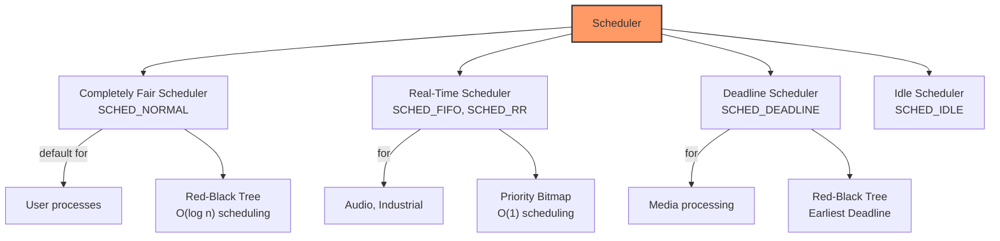
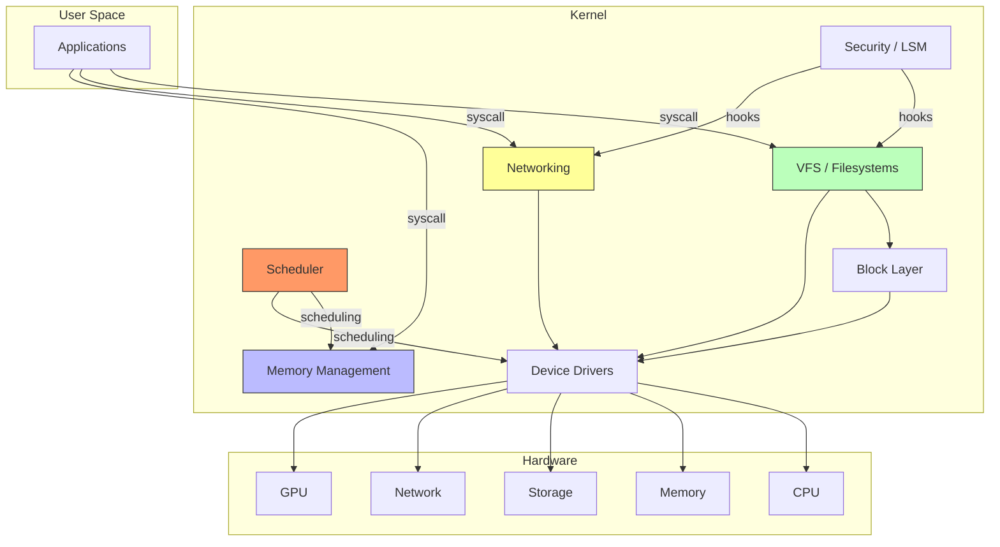
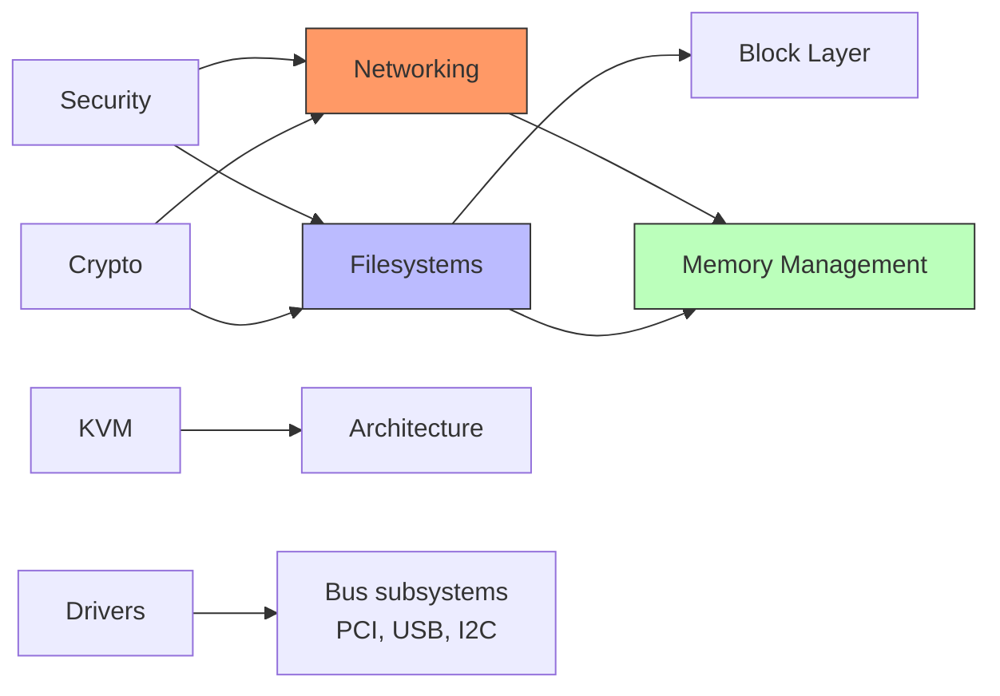

# Key Kernel Subsystems

## Introduction

The Linux kernel is not a monolithic block of code—it is organized into **subsystems**, each responsible for a specific aspect of operating system functionality. Understanding the subsystem structure is essential for navigating the kernel source, finding the right people to contact, and knowing where your contributions belong.

As of Linux 6.x, the kernel source tree contains over 30 million lines of code across more than 60,000 files. No single person understands all of it. Instead, each subsystem is maintained by one or more maintainers who have deep expertise in their area. This chapter maps the major subsystems, their maintainers, directory structure, and how to contribute to each.

## Kernel Source Tree Overview

The top-level directory structure reveals the subsystem organization:

```bash
$ ls -1 linux/
arch/          # Architecture-specific code
block/         # Block I/O layer
certs/         # Signing certificates
crypto/        # Cryptographic API
Documentation/ # Kernel documentation
drivers/       # Device drivers (largest subsystem)
fs/            # Filesystems
include/       # Header files
init/          # Kernel initialization (main.c)
ipc/           # Inter-process communication
kernel/        # Core kernel (scheduler, signals, time)
lib/           # Kernel library routines
LICENSES/      # License files
mm/            # Memory management
net/           # Networking stack
samples/       # Example code
scripts/       # Build scripts and tools
security/      # Security frameworks (SELinux, etc.)
sound/         # Audio subsystem
tools/         # Userspace tools (perf, etc.)
usr/           # initramfs generation
virt/          # Virtualization (KVM)
```

## Major Subsystems

### 1. Scheduler (`kernel/sched/`)

The **process scheduler** determines which thread runs on which CPU and for how long. It is one of the most performance-critical subsystems.

```
Directory: kernel/sched/
─────────────────────────
Core files:
  core.c      — Main scheduler logic
  fair.c      — CFS (Completely Fair Scheduler)
  rt.c        — Real-time scheduling classes
  deadline.c  — SCHED_DEADLINE (Earliest Deadline First)
  idle.c      — Idle task handling
  topology.c  — CPU topology awareness
  cpufreq.c   — CPU frequency scaling integration
  stats.c     — Scheduler statistics

Maintainers:
  Ingo Molnár <mingo@redhat.com>
  Peter Zijlstra <peterz@infradead.org>
  Vincent Guittot <vincent.guittot@linaro.org>
  Dietmar Eggemann <dietmar.eggemann@arm.com>
```

```c
/* Scheduling classes define the policy interface */
static const struct sched_class fair_sched_class __section("__sched_classes") = {
	.enqueue_task		= enqueue_task_fair,
	.dequeue_task		= dequeue_task_fair,
	.yield_task		= yield_task_fair,
	.check_preempt_curr	= check_preempt_wakeup,
	.pick_next_task		= __pick_next_task_fair,
	.put_prev_task		= put_prev_task_fair,
	.set_next_task		= set_next_task_fair,
	.task_tick		= task_tick_fair,
	.task_fork		= task_fork_fair,
	.switched_to		= switched_to_fair,
	.prio_changed		= prio_changed_fair,
	.update_curr		= update_curr_fair,
};
```



### 2. Memory Management (`mm/`)

The **memory management** subsystem handles virtual memory, page allocation, slab allocation, and the complex machinery that makes Linux work on systems from 4MB embedded devices to terabyte servers.

```
Directory: mm/
─────────────────────────
Core files:
  page_alloc.c    — Buddy allocator (physical pages)
  slab.c          — SLAB allocator (deprecated)
  slub.c          — SLUB allocator (default)
  vmalloc.c       — Virtual memory allocations
  mmap.c          — Memory-mapped files
  swap.c          — Swap management
  vmscan.c        — Page reclaim (kswapd)
  oom_kill.c      — Out-of-memory killer
  memory-failure.c — Hardware memory error handling
  huge_memory.c   — Transparent Huge Pages (THP)
  zswap.c         — Compressed swap cache
  userfaultfd.c   — Userspace page fault handling

Maintainers:
  Andrew Morton <akpm@linux-foundation.org>
  Matthew Wilcox <willy@infradead.org>
  Vlastimil Babka <vbabka@suse.cz>
```

```c
/* The buddy allocator is the foundation of physical memory management */
struct page *alloc_pages(gfp_t gfp, unsigned int order)
{
    struct page *page;
    
    /* Try to get pages from the buddy system */
    page = __alloc_pages(gfp, order, preferred_zonelist, NULL);
    
    if (unlikely(page == NULL))
        /* OOM killer may activate */
        return NULL;
    
    /* Track allocated pages */
    mod_zone_page_state(page_zone(page), NR_ALLOC_BATCH, -(1 << order));
    return page;
}
EXPORT_SYMBOL(alloc_pages);
```

```
Memory Zones (Physical Memory)
──────────────────────────────
ZONE_DMA      (0-16MB)     — ISA DMA devices
ZONE_DMA32    (0-4GB)      — 32-bit DMA devices
ZONE_NORMAL   (16MB-X)     — Normal kernel memory
ZONE_HIGHMEM  (>896MB on 32-bit) — Not permanently mapped

On 64-bit: ZONE_HIGHMEM doesn't exist (all memory is directly mapped)
```

### 3. Networking (`net/`)

The **networking subsystem** implements the full TCP/IP stack and is one of the most actively developed areas.

```
Directory: net/
─────────────────────────
  core/        — Socket layer, sk_buff management
  ipv4/        — IPv4 protocol (TCP, UDP, ICMP)
  ipv6/        — IPv6 protocol
  ethernet/    — Ethernet helpers
  wireless/    — WiFi (cfg80211, mac80211)
  bluetooth/   — Bluetooth stack
  netfilter/   — Packet filtering (iptables/nftables)
  bridge/      — Ethernet bridging
  bond/        — Network bonding
  team/        — Network teaming
  sctp/        — Stream Control Transmission Protocol
  tls/         — Kernel TLS offload
  xdp/         — eXpress Data Path
  bpf/         — BPF networking hooks

Maintainers:
  David S. Miller <davem@davemloft.net>  [overall networking]
  Jakub Kicinski <kuba@kernel.org>       [netdev, networking drivers]
  Alexei Starovoitov <ast@kernel.org>    [BPF]
  Paolo Abeni <pabeni@redhat.com>        [MPTCP, networking core]
```

```c
/* sk_buff (socket buffer) is the fundamental networking data structure */
struct sk_buff {
    /* These two members must be first */
    struct sk_buff		*next;
    struct sk_buff		*prev;

    union {
        struct net_device	*dev;
        /* ... */
    };

    unsigned long		_skb_refdst;
    void			(*destructor)(struct sk_buff *skb);

    unsigned int		len,
                        data_len;
    __u16			mac_len,
                        hdr_len;

    /* Protocol headers */
    __u16			protocol;
    __u16			transport_header;
    __u16			network_header;
    __u16			mac_header;

    /* Data pointers */
    sk_buff_data_t		tail;
    sk_buff_data_t		end;
    unsigned char		*head,
                        *data;
    unsigned int		truesize;
    refcount_t		users;
};
```

### 4. Filesystems (`fs/`)

Linux supports an extraordinary number of filesystems. The **VFS (Virtual File System)** layer provides a common interface.

```
Directory: fs/
─────────────────────────
  vfs/         — Virtual File System layer
  ext4/        — Extended Filesystem 4 (default on many distros)
  btrfs/       — B-tree filesystem (CoW, snapshots)
  xfs/         — XFS (SGI origin, high-performance)
  f2fs/        — Flash-Friendly File System
  ntfs3/       — NTFS read-write (Paragon contribution)
  fat/         — FAT/VFAT/exFAT
  overlayfs/   — Union filesystem (containers)
  proc/        — /proc filesystem
  sysfs/       — /sys filesystem
  nfs/         — Network File System
  cifs/        — SMB/CIFS (Windows shares)
  fuse/        — Filesystem in Userspace
  erofs/       — Enhanced Read-Only File System

Key Maintainers:
  ext4: Theodore Ts'o <tytso@mit.edu>
  btrfs: David Sterba <dsterba@suse.com>
  xfs: Darrick J. Wong <djwong@kernel.org>
  VFS: Christian Brauner <brauner@kernel.org>
```

```c
/* VFS operations table — every filesystem implements these */
struct file_operations {
    struct module *owner;
    loff_t (*llseek)(struct file *, loff_t, int);
    ssize_t (*read)(struct file *, char __user *, size_t, loff_t *);
    ssize_t (*write)(struct file *, const char __user *, size_t, loff_t *);
    __poll_t (*poll)(struct file *, struct poll_table_struct *);
    long (*unlocked_ioctl)(struct file *, unsigned int, unsigned long);
    int (*mmap)(struct file *, struct vm_area_struct *);
    int (*open)(struct inode *, struct file *);
    int (*flush)(struct file *, fl_owner_t id);
    int (*release)(struct inode *, struct file *);
    int (*fsync)(struct file *, loff_t, loff_t, int datasync);
    /* ... many more ... */
};
```

```mermaid
graph TB
    APP[Application] -->|read()/write()| VFS[VFS Layer]
    VFS --> EXT4[ext4]
    VFS --> XFS[XFS]
    VFS --> BTRFS[btrfs]
    VFS --> F2FS[f2fs]
    VFS --> NFS[NFS]
    VFS --> PROC[/proc]
    VFS --> SYSFS[/sys]
    VFS --> FUSE[FUSE]
    
    EXT4 --> BDEV[Block Layer]
    XFS --> BDEV
    BTRFS --> BDEV
    F2FS --> BDEV
    
    BDEV --> BLK[Block Drivers]
    BLK --> HW[Hardware]
    
    NFS --> NET[Network Stack]
    
    style VFS fill:#f96,stroke:#333,stroke-width:2px
```

### 5. Device Drivers (`drivers/`)

The `drivers/` directory is the **largest part of the kernel**, containing over 60% of the code.

```
Directory: drivers/
─────────────────────────
Major Subdirectories:
  gpu/           — Graphics drivers (i915, amdgpu, nouveau)
  net/           — Network device drivers
  usb/           — USB subsystem and drivers
  pci/           — PCI subsystem
  scsi/          — SCSI subsystem
  nvme/          — NVMe storage
  ata/           — SATA/PATA
  mmc/           — SD/MMC cards
  input/         — Input devices (keyboard, mouse, touchscreen)
  media/         — V4L2, camera drivers
  sound/         — ALSA audio drivers
  tty/           — Serial/terminal drivers
  clocksource/   — Timer/clock drivers
  iommu/         — IOMMU drivers
  vfio/          — Virtual Function I/O (device passthrough)
  virtio/        — Virtio para-virtualized drivers
  staging/       — Drivers needing cleanup
  platform/      — Platform-specific drivers
  cpufreq/       — CPU frequency scaling
  cpuidle/       — CPU idle management
  thermal/       — Thermal management
  power/         — Power management
  firmware/      — Firmware loading
  leds/          — LED subsystem
  gpio/          — GPIO subsystem
  i2c/           — I2C bus subsystem
  spi/           — SPI bus subsystem
```

### 6. Security (`security/`)

```
Directory: security/
─────────────────────────
  selinux/     — SELinux (mandatory access control)
  apparmor/    — AppArmor (Ubuntu default)
  smack/       — Smack (Simplified Mandatory Access Control)
  tomoyo/      — TOMOYO (path-based MAC)
  yama/        — Yama (ptrace restrictions)
  integrity/   — IMA/EVM (file integrity)
  keys/        — Kernel key management
  lockdown/    — Kernel lockdown (UEFI Secure Boot)

Maintainers:
  SELinux: Paul Moore <paul@paul-moore.com>
  LSM framework: James Morris <jamorris@linux.microsoft.com>
```

### 7. Virtualization (`virt/kvm/`)

```
Directory: virt/kvm/
─────────────────────────
  kvm.ko         — Core KVM module
  kvm_main.c     — Main KVM infrastructure
  
Architecture-specific:
  arch/x86/kvm/  — x86 KVM (Intel VMX + AMD SVM)
  arch/arm64/kvm/ — ARM KVM

Maintainers:
  KVM/x86: Paolo Bonzini <pbonzini@redhat.com>
  KVM/ARM: Marc Zyngier <maz@kernel.org>
```

## Subsystem Statistics

```
Lines of Code by Subsystem (approximate, Linux 6.x)
────────────────────────────────────────────────────
drivers/     ████████████████████████████████  ~16M lines (60%)
arch/        ████████████                      ~4.5M lines (16%)
fs/          ████████                          ~3M lines (10%)
net/         ██████                            ~2M lines (7%)
include/     ████                              ~1.5M lines (5%)
mm/          ███                               ~0.8M lines (3%)
kernel/      ██                                ~0.5M lines (2%)
security/    █                                 ~0.3M lines (1%)
sound/       █                                 ~0.3M lines (1%)
crypto/      █                                 ~0.15M lines
block/       ▌                                 ~0.08M lines
ipc/         ▌                                 ~0.03M lines
```

## How Subsystems Interact



## Contributing to a Subsystem

### Step 1: Choose Your Subsystem

```bash
# Browse the source tree
$ find fs/ext4 -name "*.c" | wc -l
42

# Read the subsystem documentation
$ ls Documentation/filesystems/ext4/
$ cat Documentation/filesystems/ext4/overview.rst
```

### Step 2: Find the Right Mailing List and Maintainer

```bash
$ ./scripts/get_maintainer.pl fs/ext4/super.c
"Theodore Ts'o" <tytso@mit.edu> (maintainer:EXT4 FILE SYSTEM)
Andreas Dilger <adilger.kernel@dilger.ca> (maintainer:EXT4 FILE SYSTEM)
linux-ext4@vger.kernel.org (open list:EXT4 FILE SYSTEM)
linux-kernel@vger.kernel.org (open list)
```

### Step 3: Read Existing Code and Documentation

```bash
# Read the coding style guide
$ cat Documentation/process/coding-style.rst

# Read subsystem-specific docs
$ cat Documentation/filesystems/ext4/

# Look at recent commits
$ git log --oneline fs/ext4/ | head -20
$ git log --oneline --since="2024-01-01" fs/ext4/
```

### Step 4: Start Small

```
Good First Contributions by Subsystem
──────────────────────────────────────
drivers/staging/     — Code needing cleanup (explicitly for newcomers)
Documentation/       — Documentation fixes and improvements
tools/testing/       — Self-test improvements
fs/                  — Bug fixes, coding style cleanups
kernel/              — Scheduler tweaks, minor fixes
net/                 — Networking driver fixes
```

### Step 5: Submit and Iterate

```bash
# Create your patch
$ git commit -s -m "ext4: fix typo in error message"
$ git format-patch HEAD~1

# Check it
$ ./scripts/checkpatch.pl 0001-ext4-fix-typo-in-error-message.patch

# Send it
$ git send-email \
    --to="Theodore Ts'o <tytso@mit.edu>" \
    --cc="linux-ext4@vger.kernel.org" \
    0001-ext4-fix-typo-in-error-message.patch
```

## Subsystem Trees and Git Repositories

Each major subsystem maintains its own Git tree, often with separate trees for development (`*-next`) and fixes (`*-fixes`):

```bash
# Key subsystem repositories (git.kernel.org)
─────────────────────────────────────────────
# Mainline (Linus)
git://git.kernel.org/pub/scm/linux/kernel/git/torvalds/linux.git

# Networking (David Miller)
git://git.kernel.org/pub/scm/linux/kernel/git/davem/net.git
git://git.kernel.org/pub/scm/linux/kernel/git/davem/net-next.git

# Block layer (Jens Axboe)
git://git.kernel.org/pub/scm/linux/kernel/git/axboe/linux-block.git

# SCSI (Martin Petersen)
git://git.kernel.org/pub/scm/linux/kernel/git/jejb/scsi.git

# USB / Staging (Greg KH)
git://git.kernel.org/pub/scm/linux/kernel/git/gregkh/usb.git
git://git.kernel.org/pub/scm/linux/kernel/git/gregkh/staging.git

# ARM/ARM64 (Arnd Bergmann, Olof Johansson)
git://git.kernel.org/pub/scm/linux/kernel/git/arm64/linux.git

# KVM (Paolo Bonzini)
git://git.kernel.org/pub/scm/linux/kernel/git/kvm/kvm.git

# ext4 (Theodore Ts'o)
git://git.kernel.org/pub/scm/linux/kernel/git/tytso/ext4.git

# XFS (Darrick Wong)
git://git.kernel.org/pub/scm/linux/kernel/git/djwong/xfs-linux.git
```

## The "staging" Subsystem

The `drivers/staging/` directory is unique—it exists specifically to **welcome new contributors**:

```
drivers/staging/ — A Gateway for New Developers
────────────────────────────────────────────────
Purpose:
  • Home for drivers that "work but aren't up to kernel coding standards"
  • Maintained by Greg Kroah-Hartman
  • Explicit invitation for new developers to clean up code
  • If not maintained, drivers get removed

What you can do:
  • Fix coding style issues (checkpatch.pl violations)
  • Add proper kernel doc comments
  • Convert to modern kernel APIs
  • Remove dead code
  • Improve error handling

Example cleanup tasks:
  $ ./scripts/checkpatch.pl --file drivers/staging/rtl8723bs/os_dep/os_intfs.c
  # Fix each warning/error — each is a potential patch
```

## Cross-Subsystem Dependencies

Many changes span multiple subsystems. This requires coordination:



When a patch touches multiple subsystems:
1. Send to all affected mailing lists
2. Get **Acked-by** from each subsystem maintainer
3. Typically, one maintainer applies the patch and includes the other's Ack
4. Or the patch goes through the `-mm` tree (Andrew Morton)

## References and Further Reading

- [The Linux Kernel Documentation](https://docs.kernel.org/)
- [GNU Project Documentation](https://www.gnu.org/doc/doc.html)
- [GNU Manuals](https://www.gnu.org/manual/manual.html)
- [Free Software Directory](https://directory.fsf.org/wiki/Main_Page)
- [Planet GNU](https://planet.gnu.org/)
- [Free Software Books](https://www.gnu.org/doc/other-free-books.html)

- Linux Kernel Source Browser: https://elixir.bootlin.com/linux/latest/source
- MAINTAINERS file: https://git.kernel.org/pub/scm/linux/kernel/git/torvalds/linux.git/tree/MAINTAINERS
- Kernel Newbies — Kernel Map: https://kernelnewbies.org/KernelMap
- "Linux Kernel Development" by Robert Love (3rd Edition). ISBN 978-0672329464
- "Understanding the Linux Kernel" by Bovet & Cesati (3rd Edition). ISBN 978-0596005658
- The Linux Kernel documentation: https://www.kernel.org/doc/html/latest/
- Elixir Bootlin (source browser): https://elixir.bootlin.com/
- LWN.net Kernel Index: https://lwn.net/Kernel/
- kernel.org git repositories: https://git.kernel.org/

## Related Topics

- [Linux Kernel Development Model](./development-model.md) — how the maintainer hierarchy works
- [Building the Kernel](../build/kernel-build.md) — compile and test subsystem changes
- [Notable Kernel Versions](./notable-versions.md) — when major subsystem features were added
- [x86 Architecture](../arch/x86.md) — architecture-specific subsystem code
- [ARM Architecture](../arch/arm.md) — ARM-specific subsystem code
