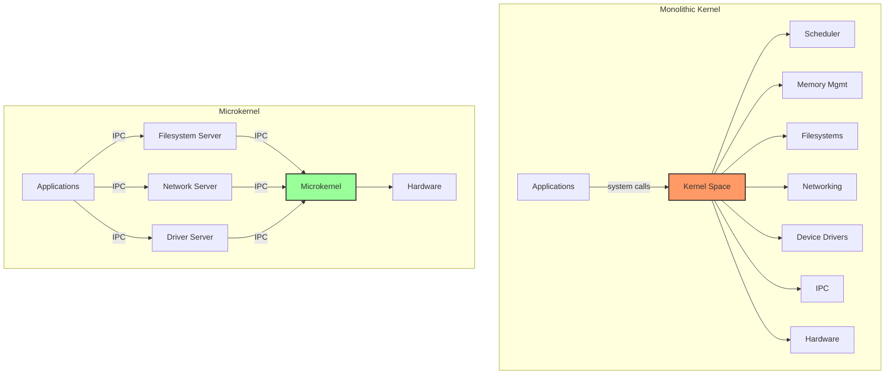
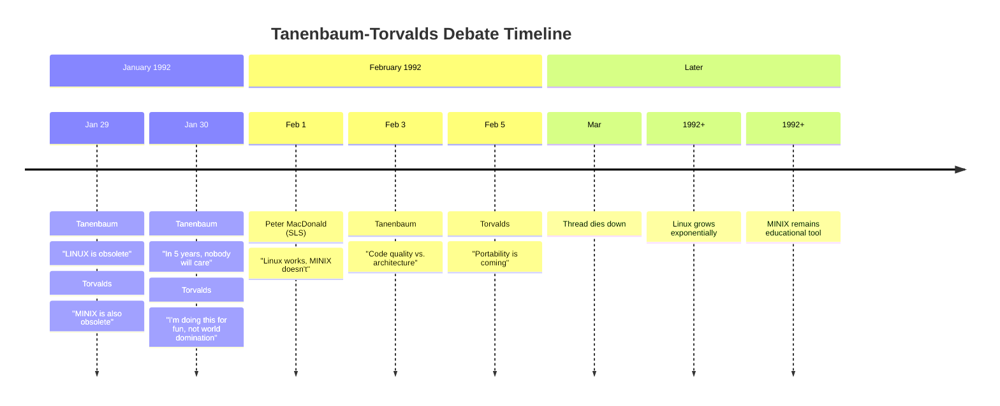
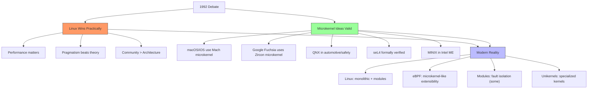
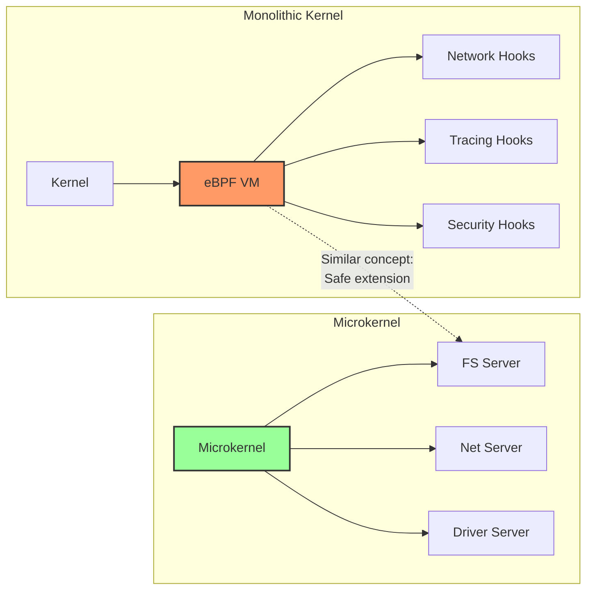

# The Tanenbaum-Torvalds Debate

## Introduction

In January 1992, a passionate debate erupted on the `comp.os.minix` Usenet newsgroup between **Andrew S. Tanenbaum**, a respected computer science professor at Vrije Universiteit Amsterdam, and **Linus Torvalds**, a 22-year-old Finnish student who had just created Linux. The debate centered on operating system architecture—specifically, the merits of **monolithic kernels** versus **microkernels**—and became one of the most famous technical discussions in computing history.

The Tanenbaum-Torvalds debate is far more than a historical curiosity. The architectural choices it discussed remain relevant today: modern operating systems continue to grapple with the tradeoffs between monolithic and microkernel designs, and the debate's themes echo in contemporary discussions about eBPF, unikernels, and the future of OS design.

## Background

### The Architectural Divide

Before examining the debate itself, let's understand the two approaches:



### Tanenbaum's Position

Andrew Tanenbaum was (and remains) a strong advocate for microkernel design. His arguments:

```
Tanenbaum's Arguments (1992)
────────────────────────────
1. Microkernels are the future of OS design
   — Mach, Chorus, Amoeba all use microkernels
   — Industry trend clearly moving toward microkernels

2. Monolithic kernels are architecturally flawed
   — A bug in any module can crash the entire system
   — No fault isolation between components
   — Difficult to maintain and extend

3. Linux is obsolete before it starts
   — Monolithic design is a step backward
   — 1970s technology masquerading as innovation
   — Porting to new architectures will be very difficult

4. The future belongs to distributed systems
   — Microkernels naturally support distributed computing
   — Single-processor monolithic kernels are a dead end
```

### Torvalds's Position

Linus Torvalds defended the monolithic approach with pragmatic arguments:

```
Torvalds's Arguments (1992)
───────────────────────────
1. Performance matters
   — Microkernel IPC overhead is significant
   — Context switches between servers are expensive
   — Real-world performance beats theoretical elegance

2. Linux works NOW
   — While Mach theorists debate, Linux users compute
   — Practical software beats theoretical perfection
   — "Show me the code"

3. Portability is achievable within monolithic design
   — Abstract hardware-specific code behind interfaces
   — Linux can be ported without becoming a microkernel

4. Reliability comes from testing, not architecture
   — A well-tested monolithic kernel can be reliable
   — Microkernel bugs in servers are still bugs
   — Practical reliability matters more than theoretical guarantees
```

## The Debate Thread

### The Opening Salvo (January 29, 1992)

Tanenbaum initiated the debate with a provocative message:

```
From: ast@cs.vu.nl (Andy Tanenbaum)
Newsgroups: comp.os.minix
Subject: LINUX is obsolete
Date: 29 Jan 92 12:12:50 GMT

I was in the US for a couple of weeks, so I haven't commented much on
LINUX (not that I would have said much had I been around), but for what 
it's worth, I have a couple of comments now.

As most of you know, for me MINIX is a hobby, something that I do in 
the evening when I get bored writing books and there are no major wars,
revolutions, or senate hearings being televised live on CNN. My real 
job is a professor and researcher in the area of operating systems.

As a result of my occupation, I think I know a bit about where 
operating systems are going in the next 10 years or so. Two aspects 
are important:

1. MICROKERNELS vs MONOLITHIC SYSTEMS
   Most older operating systems are monolithic, that is, the whole 
   operating system is a single a.out binary that runs in kernel mode. 
   This includes Linux. ...
   MINIX is a microkernel-based system. ...
   LINUX is obsolete. ...

2. PORTABILITY
   ...
   MINIX was designed to be reasonably portable ...
   LINUX is tied fairly closely to the 386. ...
```

### Torvalds's Response (January 29, 1992)

Torvalds responded the same day:

```
From: torvalds@klaava.Helsinki.FI (Linus Benedict Torvalds)
Newsgroups: comp.os.minix
Subject: Re: LINUX is obsolete
Date: 29 Jan 92 23:14:26 -1000

OK, I'll take the bait. ... 

> LINUX is obsolete.

Well, with a subject like this, I'm afraid I'll have to agree. 
... LINUX is obsolete in the sense that it uses 70's technology 
(monolithic approach), but on the other hand, I'd like to point out 
that MINIX is also obsolete (in the sense that it uses 70's 
technology, but in a slightly different way).

Seriously, the monolithic approach has some definite advantages:
- It's easier to implement
- It's potentially faster due to less overhead
- It's what I know how to do

... your argument that monolithic systems are inferior is unproven. 
Your claim that MINIX is a microkernel is not correct. ... You claim 
that MINIX is a microkernel system, but it really isn't ...
```

### The Debate Escalates

The thread continued with increasingly pointed exchanges:



### Key Exchanges

#### On Portability

Tanenbaum argued:
```
> MINIX was designed to be reasonably portable, and has been ported 
> from the original IBM PC to the Atari, Amiga, Macintosh, and SPARC.
> LINUX is tied fairly closely to the 386. I think this is a big 
> mistake.
```

Torvalds responded:
```
> LINUX is tied fairly closely to the 386.

This is not a big mistake. It's a CHOICE. I wanted to get something 
working, and the 386 was the best platform to do it on. When Linux 
is running well and has a reasonable set of tools, I'll port it to 
other platforms. It's not that hard.
```

#### On the Future

Tanenbaum's most famous (and most wrong) prediction:
```
> MINIX is a microkernel-based system. ... LINUX is obsolete. ...
> 
> 5 years from now, everyone will be running a free GNU system on 
> their 200 MIPS, 64M SPARCstation-5, and nobody will care about 
> LINUX anymore.
```

This prediction proved spectacularly incorrect. Within 5 years (by 1997), Linux was growing rapidly while MINIX remained a teaching tool.

#### On the Monolithic Approach

Tanenbaum:
```
> The monolithic approach is a giant step back into the 1970s.
> Like filling a coffin with nails, it will be impossible to maintain.
```

Torvalds:
```
> You think monolithic is bad? I think you're wrong. The performance 
> difference between a monolithic kernel and a microkernel is 
> SIGNIFICANT. It's not a small difference — it's a factor of 2 or 
> more for some operations.
```

## The Technical Arguments in Depth

### Microkernel Overhead

The primary technical argument against microkernels is **IPC overhead**:

```c
/* Monolithic kernel: Direct function call
 * 
 * File read goes through:
 *   syscall → VFS → filesystem → device driver → hardware
 *   All in kernel space, direct function calls
 *   Cost: ~100-500 nanoseconds
 */

/* Microkernel: Message passing
 * 
 * File read goes through:
 *   app → IPC to FS server → IPC to driver server → hardware
 *   Each IPC requires: context switch + data copy + context switch back
 *   Cost: ~1,000-10,000 nanoseconds per IPC hop
 *   2 IPC hops: ~2,000-20,000 nanoseconds
 */

/* Example: Reading a file in a microkernel */
struct message {
    int type;
    int source;
    int target;
    union {
        struct { int fd; size_t count; } read;
        struct { void *buf; size_t count; int err; } read_reply;
    } data;
};

int microkernel_read(int fd, void *buf, size_t count) {
    struct message msg = {
        .type = MSG_READ,
        .target = FS_SERVER_PID,
        .data.read = { .fd = fd, .count = count }
    };
    
    /* IPC call: kernel context switch, copy message, switch back */
    ipc_send_receive(&msg);  /* Expensive! */
    
    if (msg.data.read_reply.err)
        return -msg.data.read_reply.err;
    
    memcpy(buf, msg.data.read_reply.buf, msg.data.read_reply.count);
    return msg.data.read_reply.count;
}
```

### The Reliability Argument


Tanenbaum was right about this advantage. A bug in a device driver running in user space (as in a microkernel) can't corrupt kernel data structures.

### The Performance Reality

```
IPC Overhead Comparison (approximate, circa 1992-2000)
──────────────────────────────────────────────────────
                    Latency    Throughput
Monolithic call:    ~0.1μs     ~10M calls/sec
Unix pipe:          ~2μs       ~500K calls/sec
Mach IPC:           ~10-20μs   ~50-100K calls/sec
QNX IPC:            ~5-10μs    ~100-200K calls/sec

For a filesystem read requiring 2 IPC hops:
  Monolithic: ~0.5μs total
  Microkernel (Mach): ~30-50μs total (60-100x slower)
  Microkernel (optimized): ~10-20μs total (20-40x slower)
```

Modern microkernels (seL4, Zircon/Fuchsia) have dramatically reduced these costs, but the gap still exists.

## Historical Outcome

### Linux Wins (Practically)

The debate's outcome is clear:

```
Linux (2024)                          MINIX (2024)
─────────────                         ─────────────
~28 million lines of code             ~16,000 lines of code
Powers 4+ billion devices             Teaching tool
100% of supercomputers                Limited real-world use
~2,500 active contributors            Small community
$1B+ annual development               Academic project
Android, cloud, IoT, HPC              OS courses
Worth trillions in infrastructure     Textbook companion
```

### MINIX's Unexpected Second Life

Ironically, MINIX found widespread use in an unexpected place:

```
MINIX on Intel Management Engine (2008-2019+)
──────────────────────────────────────────────
Starting with Intel ME version 11 (Skylake, 2015):
  • Intel ME runs MINIX 3 internally
  • Separate processor (ARC core) on every Intel CPU
  • Has full access to system memory and network
  • Runs even when the computer is "off"
  • Cannot be easily disabled or audited
  • Tanenbaum himself was not initially aware of this

Impact: MINIX became (arguably) the most widely deployed
        operating system in the world by number of computers
        with it installed — running on every Intel processor

Tanenbaum wrote an open letter to Intel expressing concern
about the security implications and lack of source access.
```

### Both Were Right (Sort Of)



## The Modern Relevance

### eBPF: Microkernel Ideas in a Monolithic Kernel

eBPF (extended Berkeley Packet Filter) brings microkernel-like extensibility to the Linux monolithic kernel:

```c
/* eBPF allows safe, dynamic kernel extension
 * 
 * User-space programs are verified and loaded into the kernel
 * They can hook into various subsystems without modifying the kernel
 * This is conceptually similar to microkernel servers
 */

// eBPF program: count network packets
SEC("xdp")
int count_packets(struct xdp_md *ctx) {
    u32 key = 0;
    u64 *value = bpf_map_lookup_elem(&packet_count, &key);
    if (value)
        __sync_fetch_and_add(value, 1);
    return XDP_PASS;
}
```



### Google Fuchsia: Zircon Microkernel

Google's Fuchsia OS uses a microkernel called Zircon:

```
Fuchsia / Zircon Architecture
─────────────────────────────
Zircon (microkernel):
  • Handles: processes, threads, virtual memory, IPC
  • Everything else runs in user space
  
User-space components:
  • Component framework
  • Filesystems (pkgfs, memfs)
  • Networking (netstack)
  • Graphics (Scenic)
  • Audio (audio_core)
  
Relationship to the debate:
  Tanenbaum's vision, implemented 30 years later
  Using modern hardware (faster IPC)
  For a new use case (IoT, embedded, eventually mobile)
```

### QNX and Automotive

```
QNX Neutrino RTOS
──────────────────
• Microkernel-based real-time OS
• Used in automotive (BlackBerry QNX)
• Powers 235+ million vehicles
• Safety-critical certified (ISO 26262)
• 6 microsecond context switch time

Tanenbaum was right that microkernels excel in:
  • Safety-critical systems
  • Real-time applications
  • Systems requiring formal verification
```

### seL4: Formally Verified Microkernel

```
seL4 — The World's First Formally Verified OS Kernel
────────────────────────────────────────────────────
• Mathematical proof of correctness
• Proofs of:
  — Functional correctness (code matches specification)
  — Security enforcement (information flow)
  — Worst-case execution time
• ~10,000 lines of C + assembly
• Used in military, aerospace, autonomous vehicles
• Open source (GPLv2)

This validates Tanenbaum's argument that microkernels
can be proven correct — something impossible for
Linux's 28 million lines of code.
```

## Lessons from the Debate

### Technical Lessons

```
Lessons Learned
───────────────
1. Architecture alone doesn't determine success
   — Implementation quality, community, and timing matter more

2. Performance is not optional
   — Users will choose "fast and buggy" over "slow and correct"
   — Microkernel IPC overhead was a real barrier in the 1990s

3. Modularity can exist within monolithic design
   — Linux modules provide some microkernel benefits
   — eBPF provides safe extensibility

4. Hardware changes assumptions
   — Faster CPUs reduce IPC overhead concerns
   — Multi-core makes fine-grained locking more important
   — Security threats make fault isolation more valuable

5. Both sides had valid points
   — Tanenbaum: reliability, maintainability, portability
   — Torvalds: performance, pragmatism, community
```

### Cultural Lessons

```
Cultural Impact
───────────────
1. Technical debates can be passionate without being personal
   (Though both parties occasionally crossed the line)

2. Predictions about technology are often wrong
   Tanenbaum: "Nobody will care about Linux in 5 years"
   Reality: Linux dominates computing

3. "Show me the code" beats theoretical arguments
   Working software > elegant architecture

4. The best technology doesn't always win
   (But in this case, the practical choice did)

5. Both participants remained respected figures
   Tanenbaum: continued teaching, won ACM award
   Torvalds: created Git, leads kernel, won Millennium Prize
```

## The Full Debate Thread

The complete Usenet thread is preserved and worth reading in full:

```
Thread: "LINUX is obsolete" (comp.os.minix)
Date: January-February 1992
Messages: ~40+ posts
Archive: Google Groups (comp.os.minix)

Key participants:
  Andrew Tanenbaum (ast@cs.vu.nl)
  Linus Torvalds (torvalds@klaava.Helsinki.FI)
  Peter MacDonald (SLS creator)
  David Tanenbaum (contributor)
  Various MINIX and Linux users
```

You can read the full thread at:
https://groups.google.com/g/comp.os.minix/c/dlNtH7RRrGA/m/SwRav4RyEVEJ

## References and Further Reading

- [The Linux Kernel Documentation](https://docs.kernel.org/)
- [LWN.net - Linux and free software news](https://lwn.net/)
- [GNU Project Documentation](https://www.gnu.org/doc/doc.html)
- [GNU Manuals](https://www.gnu.org/manual/manual.html)
- [Free Software Directory](https://directory.fsf.org/wiki/Main_Page)
- [Planet GNU](https://planet.gnu.org/)
- [Free Software Books](https://www.gnu.org/doc/other-free-books.html)

- Tanenbaum, Andrew S. "LINUX is obsolete." Usenet post, comp.os.minix, January 29, 1992.
- Torvalds, Linus. "Re: LINUX is obsolete." Usenet post, comp.os.minix, January 29, 1992.
- Tanenbaum, Andrew S. & Woodhull, Albert S. *Operating Systems: Design and Implementation* (3rd Edition). Prentice Hall, 2006. ISBN 978-0131429383
- Tanenbaum, Andrew S. "Tanenbaum-Torvalds Debate: An Update." https://www.cs.vu.nl/~ast/reliable-os/
- Wikipedia: Tanenbaum–Torvalds debate: https://en.wikipedia.org/wiki/Tanenbaum%E2%80%93Torvalds_debate
- Herder, Jorrit N. et al. "MINIX 3: A Highly Reliable, Self-Repairing Operating System." https://www.minix3.org/
- Klein, Gerwin et al. "seL4: Formal Verification of an OS Kernel." SOSP 2009. https://sel4.systems/
- Google Fuchsia documentation: https://fuchsia.dev/
- QNX Neutrino RTOS: https://blackberry.qnx.com/
- Intel Management Engine: https://en.wikipedia.org/wiki/Intel_Management_Engine
- "The Cathedral and the Bazaar" by Eric S. Raymond: http://www.catb.org/esr/writings/cathedral-bazaar/
- Andrew Tanenbaum's open letter to Intel: https://www.cs.vu.nl/~ast/intel/

## Related Topics

- [Unix Timeline](./unix-timeline.md) — the broader OS history context
- [Linus Torvalds](./linus.md) — the debate's central figure
- [Key Kernel Subsystems](./subsystems.md) — the monolithic kernel's structure
- [Memory Models](../arch/memory-models.md) — how different architectures affect kernel design
- [Building the Kernel](../build/kernel-build.md) — compiling the "obsolete" monolithic kernel
