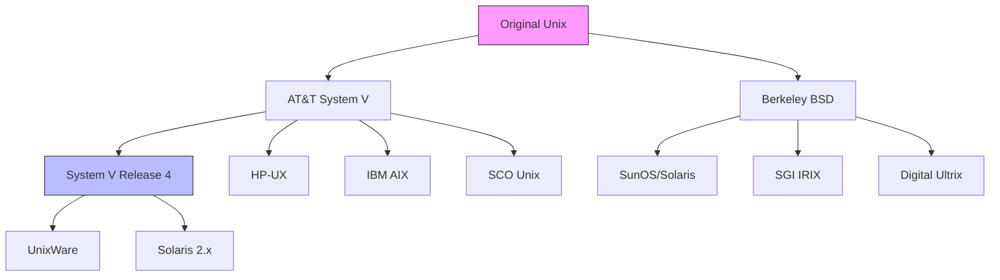
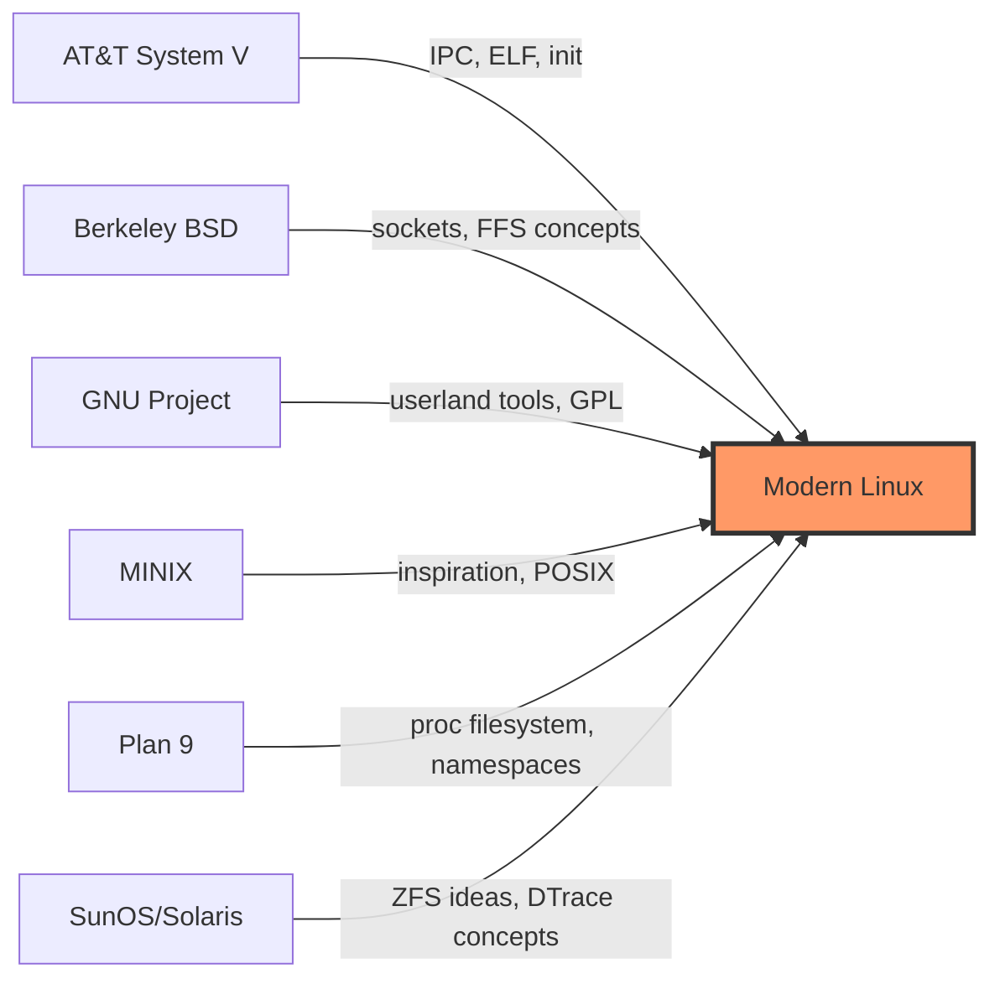
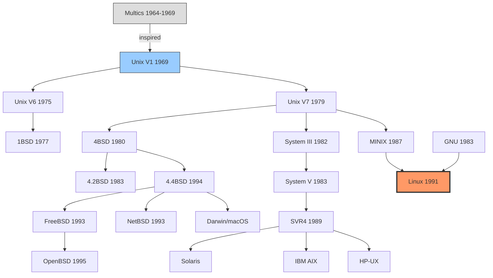

# Unix Timeline: From AT&T to Modern Linux

## Introduction

The history of Unix is the history of modern computing itself. Born in a cramped lab at Bell Telephone Laboratories in 1969, Unix evolved from a small project by two programmers into a global ecosystem that powers everything from smartphones to supercomputers. This timeline traces the key events, forks, and philosophical shifts that shaped the operating system landscape—from the original AT&T Unix through BSD, System V, MINIX, and ultimately to Linux.

Understanding this lineage is essential for anyone working with Linux, because many of the design decisions, conventions, and even controversies that define modern systems trace directly back to these decades of evolution.

## The Birth of Unix (1969–1979)

### Multics to Unics

In the mid-1960s, Bell Labs was a partner in the **Multics** (Multiplexed Information and Computing Service) project alongside MIT and General Electric. Multics was an ambitious time-sharing operating system, but by 1969, Bell Labs withdrew from the project due to its complexity and cost.

**Ken Thompson** and **Dennis Ritchie**, both Bell Labs researchers who had worked on Multics, wanted to preserve the interactive computing environment they had grown accustomed to. Thompson found a spare PDP-7 minicomputer and began writing a new operating system.

```
1969 — Key Milestone
├── Ken Thompson writes a file system on a PDP-7
├── Dennis Ritchie joins the effort
├── The name "Unics" is coined (a pun on "Multics")
│   └── Brian Kernighan suggested the name
└── First version: assembler-based, single-user
```

### Unix V1 through V6

| Version | Year | Key Features |
|---------|------|--------------|
| V1 | 1971 | First edition; PDP-11/20; `fork()` primitive; `roff` text formatter |
| V2 | 1972 | Rewritten in assembly; C compiler by Ritchie |
| V3 | 1973 | First C rewrite begins; pipes introduced |
| V4 | 1973 | Mostly rewritten in C—a revolutionary decision |
| V5 | 1974 | Licensed to universities for $200 |
| V6 | 1975 | Widely distributed; basis for BSD; PDP-11/40 and /45 support |

The decision to rewrite Unix in **C** (developed by Dennis Ritchie specifically for this purpose) was transformative. For the first time, an operating system was written in a high-level language, making it **portable** across hardware architectures.

> "C was invented essentially to write Unix in, and the combination of C and Unix became the lingua franca of computing."
> — Brian Kernighan

### System III and System V

AT&T released **System III** in 1982, followed by **System V** (also called SVR1) in 1983. System V became the commercial branch of Unix:

```
AT&T Unix Lineage
──────────────────
V6 (1975)
├── V7 (1979) — Last research Unix widely distributed
├── 32V (1979) — First Unix for VAX (32-bit)
├── System III (1982) — AT&T commercial release
└── System V (1983)
    ├── SVR2 (1984) — STREAMS I/O, shared libraries
    ├── SVR3 (1987) — TLI networking, ELF format
    ├── SVR3.2 (1987) — Multiprocessor support
    ├── SVR4 (1989) — Merged with SunOS; massive feature set
    └── SVR4.2 (1992) — UnixWare, Novell involvement
```

**System V Release 4 (SVR4)** was particularly significant because it merged features from three major branches: System V, BSD, and SunOS. This was a joint effort between AT&T and Sun Microsystems.

### Key System V Contributions

- **`init` system** with runlevels (influenced systemd design debates decades later)
- **STREAMS** — a flexible I/O framework for networking
- **IPC mechanisms** — shared memory, semaphores, message queues
- **ELF binary format** — still the standard on Linux today (see [`arch/x86.md`](../arch/x86.md))
- **Dynamic linking** — shared libraries (`.so` files)

## The BSD Branch (1977–Present)

### Origins at Berkeley

The **Berkeley Software Distribution** began in 1977 when **Bill Joy**, a graduate student at UC Berkeley, started distributing enhancements to Unix V6 on PDP-11 tapes.

```
BSD Evolution
─────────────
1BSD (1977) — Joy's Pascal compiler, ex editor
2BSD (1978) — vi editor, termcap, more utilities
3BSD (1979) — VAX support, virtual memory
4.0BSD (1980) — TCP/IP networking stack (Joy)
4.1BSD (1981) — Fast file system (FFS)
4.2BSD (1983) — socket API, reliable signals
4.3BSD (1986) — Performance improvements
4.3BSD-Tahoe (1988) — Support for CCI and Power 6/32
4.3BSD-Reno (1990) — NFS client support
4.4BSD-Lite (1994) — Last Berkeley release (CSRG dissolves)
```

### The Legal Battles

The early 1990s saw a protracted legal battle between **Unix System Laboratories (USL)** and **BSDi** (Berkeley Software Design Inc.) over alleged copyright infringement in BSD. The case was settled in 1994, but the delay was catastrophic for BSD adoption.

Key consequence: during the years BSD was legally encumbered, **Linux** emerged and gained momentum. Many historians argue that without the USL lawsuit, BSD might have become the dominant open-source Unix.

### BSD Descendants

```
4.4BSD-Lite (1994)
├── FreeBSD (1993) — Performance, server workloads
│   └── Used by Netflix, WhatsApp, PlayStation OS
├── NetBSD (1993) — "Runs on anything" portability
│   └── Embedded systems, retro computing
├── OpenBSD (1995) — Security-focused (Theo de Raadt)
│   └── OpenSSH, LibreSSL, pf firewall
├── DragonFly BSD (2003) — Matt Dillon, new SMP approach
└── macOS / iOS (Darwin kernel)
    └── Mach microkernel + BSD layer
```

## MINIX and the Seeds of Linux (1987–1991)

### Andrew Tanenbaum's Teaching Tool

In 1987, Professor **Andrew S. Tanenbaum** of Vrije Universiteit Amsterdam created **MINIX** (MINi-unIX) as a teaching operating system. It was designed to accompany his textbook *Operating Systems: Design and Implementation*.

MINIX was significant for several reasons:

1. **Microkernel architecture** — message-passing design, minimal kernel
2. **Runs on modest hardware** — 8088 PCs with 256KB RAM
3. **Complete and documented** — all source code published in the textbook
4. **Educational philosophy** — Tanenbaum intentionally kept it simple

```
MINIX Architecture (Microkernel)
┌─────────────────────────────────────┐
│           User Processes            │
├────────┬────────┬────────┬─────────┤
│ File   │ Memory │ Device │ Network │  ← Server processes
│ System │ Mgr    │ Driver │         │
├────────┴────────┴────────┴─────────┤
│         Microkernel                 │  ← Minimal: scheduling, IPC
├─────────────────────────────────────┤
│         Hardware                    │
└─────────────────────────────────────┘
```

### MINIX 2 and 3

| Version | Year | Notable Features |
|---------|------|-----------------|
| MINIX 1 | 1987 | Original; 12,000 lines of C; IBM PC |
| MINIX 2 | 1997 | POSIX-compliant; networking support |
| MINIX 3 | 2005 | Self-healing; live update; runs drivers in user space |

MINIX 3's self-healing capabilities were particularly innovative—it could automatically restart crashed drivers without rebooting the system.

### The Connection to Linux

In 1991, **Linus Torvalds**, a student at the University of Helsinki, purchased an IBM PC/AT with a 386 processor. He initially used MINIX but found it limiting for his purposes. His frustration with MINIX's licensing (it was not free software in the GNU sense) and technical limitations directly motivated the creation of Linux.

The famous Usenet post that announced Linux was cross-posted to `comp.os.minix`, reflecting the direct lineage. (See [`tanenbaum-debate.md`](./tanenbaum-debate.md) for the subsequent philosophical clash.)

## The Unix Wars and Standardization (1980s–1990s)

### The Fragmentation Problem

By the late 1980s, Unix had fragmented into dozens of incompatible variants:



### Standardization Efforts

Multiple competing standards emerged:

| Standard | Organization | Year | Focus |
|----------|-------------|------|-------|
| POSIX | IEEE | 1988 | Portable OS interface (IEEE 1003) |
| SVID | AT&T | 1985 | System V Interface Definition |
| X/Open | X/Open Group | 1984 | European portability standard |
| OSF | Open Software Foundation | 1988 | Anti-AT&T coalition |
| UI | Unix International | 1988 | Pro-AT&T/SVR4 coalition |
| Single UNIX Spec | X/Open | 1994 | Merged POSIX + X/Open |
| LSB | FSG | 2001 | Linux Standard Base |

**POSIX** (Portable Operating System Interface) was the most successful standardization effort. IEEE 1003 defined a common API that allowed programs to be portable across Unix-like systems. Linux largely conforms to POSIX, which is a key reason why it could replace commercial Unix systems.

## The Open Source Revolution (1991–2000)

### The GPL and Free Software

**Richard Stallman's** GNU project (started 1983) had created most of the userland tools for a free Unix-like system by the early 1990s—everything except the kernel (GNU Hurd was perpetually delayed). The **GNU General Public License (GPL)** ensured that derivative works would remain free.

When Linus Torvalds released Linux under the GPL in 1992, it completed the GNU/Linux system and triggered an explosion of open-source development.

### The 1990s Timeline

```
1991 — Linux 0.01 released (Sept 17)
1992 — Linux relicensed under GPL
1993 — Slackware and Debian, the first Linux distributions
       FreeBSD 1.0 released
1994 — Linux 1.0 released (March 14)
       USL vs BSDi settled
1995 — Apache HTTP Server released
       OpenBSD forked from NetBSD
1996 — Linux 2.0 released (June 9)
       KDE project started
1997 — Eric Raymond publishes "The Cathedral and the Bazaar"
1998 — Netscape open-sources Mozilla
       "Open Source" term coined (Christine Peterson)
1999 — GNOME 1.0 released
       Red Hat IPO
2000 — IBM announces $1 billion investment in Linux
```

## The Enterprise Era (2000–2010)

### Linux Goes Enterprise

The early 2000s saw Linux transition from a hobbyist system to an enterprise platform:

- **2000**: IBM pledges $1 billion for Linux development
- **2001**: Linux 2.4 released with improved SMP, new filesystems
- **2003**: Red Hat Enterprise Linux (RHEL) becomes dominant server distro
- **2004**: Ubuntu launched (Canonical/Mark Shuttleworth)
- **2005**: Git created by Linus Torvalds for kernel development
- **2006**: Linux dominates the TOP500 supercomputer list
- **2007**: Android announced (Linux kernel for mobile)
- **2008**: Chrome OS announced

### Commercial Unix Decline

```
Unix Market Share Evolution (Servers)
────────────────────────────────────
1995: ████████████████ Unix (70%)
      ████             Windows NT (15%)
      ██               Linux (5%)

2005: ████████         Unix (35%)
      ████████         Windows (30%)
      ████████         Linux (25%)

2015: ███              Unix (10%)
      ████████         Windows (30%)
      ████████████     Linux (50%)
```

Commercial Unix systems gradually lost market share:
- **Solaris**: Sun acquired by Oracle (2010), Solaris effectively discontinued
- **HP-UX**: Itanium dependency killed by x86 rise
- **AIX**: IBM shifted focus to Linux on POWER
- **IRIX**: SGI went bankrupt (2009)

## The Modern Era (2010–Present)

### Linux Everywhere

By the 2010s, Linux had become the dominant operating system for:

```
Linux Dominance by Platform (2024)
┌──────────────────┬────────────────┐
│ Platform         │ Linux Share    │
├──────────────────┼────────────────┤
│ Supercomputers   │ 100% (TOP500)  │
│ Cloud servers    │ ~90%           │
│ Web servers      │ ~80%           │
│ Mobile (Android) │ ~72%           │
│ Embedded/IoT     │ ~60%           │
│ Desktop          │ ~4%            │
│ Containers       │ ~99%           │
└──────────────────┴────────────────┘
```

### Key Modern Developments

```
2011 — Linux 3.0 released (version number change, not major rewrite)
2012 — Linux 3.6: UEFI boot support
2014 — Linux 3.15: systemd becomes default in major distros
2015 — Containers boom (Docker + Kubernetes)
2016 — Windows Subsystem for Linux (WSL) announced
2017 — Linux 4.12: WireGuard merged
2019 — Linux 5.0: mainline support for smartphones
2020 — Linux 5.6: USB4, WireGuard merged into mainline
2022 — Linux 5.19: initial Apple M1 support
2022 — Linux 6.0: Rust infrastructure merged
2023 — Linux 6.1: Rust character device driver
2024 — Linux 6.8: continued Rust integration, performance work
2025 — Linux 6.12+: PREEMPT_RT fully merged into mainline
```

### The Merger of Unix Lineages in Linux

Modern Linux incorporates elements from all major Unix traditions:



## Legacy and Impact

The Unix philosophy—small programs that do one thing well, connected through pipes and text streams—remains influential. The key principles articulated by Doug McIlroy in 1978 still apply:

1. Make each program do one thing well
2. Expect the output of every program to become the input to another
3. Design and build software to be tried early
4. Prefer tools to unskilled help

These principles shaped not just Linux, but the entire cloud-native ecosystem of containers, microservices, and orchestration.

## Diagram: Unix Family Tree (Simplified)



## References and Further Reading

- [The Linux Kernel Documentation](https://docs.kernel.org/)
- [LWN.net - Linux and free software news](https://lwn.net/)
- [GNU Project Documentation](https://www.gnu.org/doc/doc.html)
- [GNU Manuals](https://www.gnu.org/manual/manual.html)
- [Free Software Directory](https://directory.fsf.org/wiki/Main_Page)
- [Planet GNU](https://planet.gnu.org/)
- [Free Software Books](https://www.gnu.org/doc/other-free-books.html)

- Ritchie, D.M. & Thompson, K. "The UNIX Time-Sharing System." *Communications of the ACM*, Vol. 17, No. 7, 1974. https://www.bell-labs.com/unix-project-history/unix-cacm1974.pdf
- Salus, Peter H. *A Quarter Century of UNIX*. Addison-Wesley, 1994. ISBN 978-0201547771
- McKusick, Marshall Kirk. "Twenty Years of Berkeley Unix." *Open Sources: Voices from the Open Source Revolution*, O'Reilly, 1999. https://www.oreilly.com/openbook/opensources/book/kirkmck.html
- Tozzi, Christopher. *For Fun and Profit: A History of the Free and Open Source Software Revolution*. MIT Press, 2017.
- UNIX Heritage Society: https://www.tuhs.org/
- The Unix Tree (historic source code): https://www.tuhs.org/cgi-bin/utree.pl
- Computer History Museum — Unix timeline: https://www.computerhistory.org/unix/
- "The Art of Unix Programming" by Eric S. Raymond: http://www.catb.org/esr/writings/taoup/html/
- POSIX standard (IEEE 1003): https://pubs.opengroup.org/onlinepubs/9699919799/
- TOP500 Supercomputers (Linux dominance): https://top500.org/

## Related Topics

- [The Tanenbaum-Torvalds Debate](./tanenbaum-debate.md) — the philosophical clash over kernel architecture
- [Linux Kernel Development Model](./development-model.md) — how Linux is developed today
- [Notable Kernel Versions](./notable-versions.md) — major milestones in Linux kernel releases
- [x86 Architecture](../arch/x86.md) — the hardware platform that drove Unix adoption
- [Building the Kernel](../build/kernel-build.md) — modern kernel compilation process
