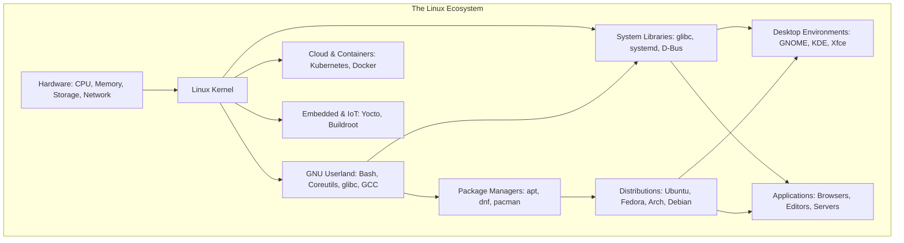
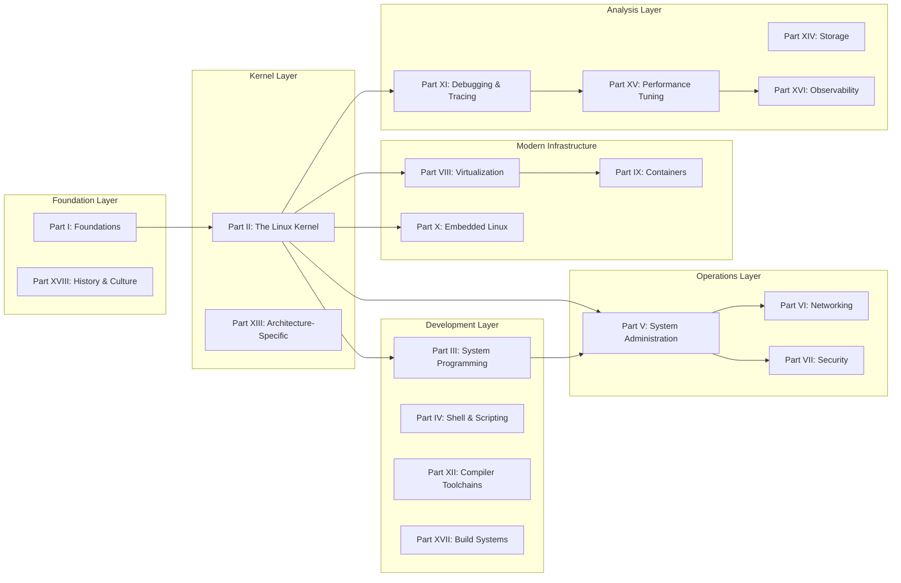
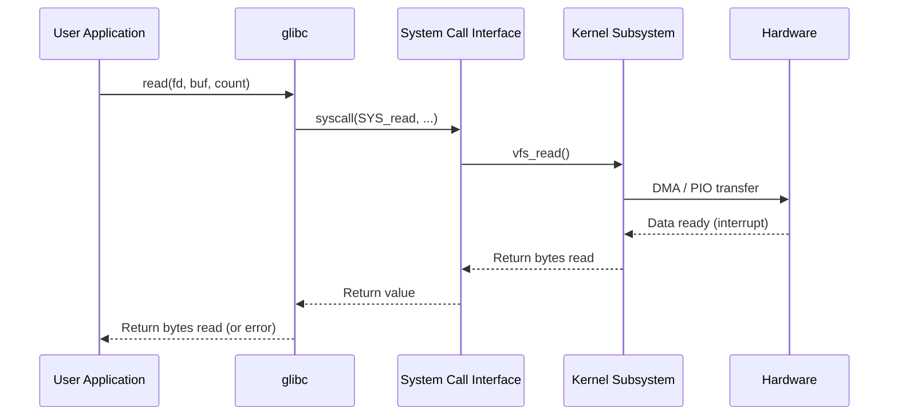
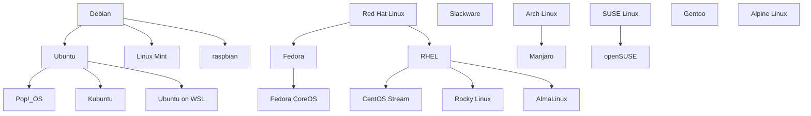
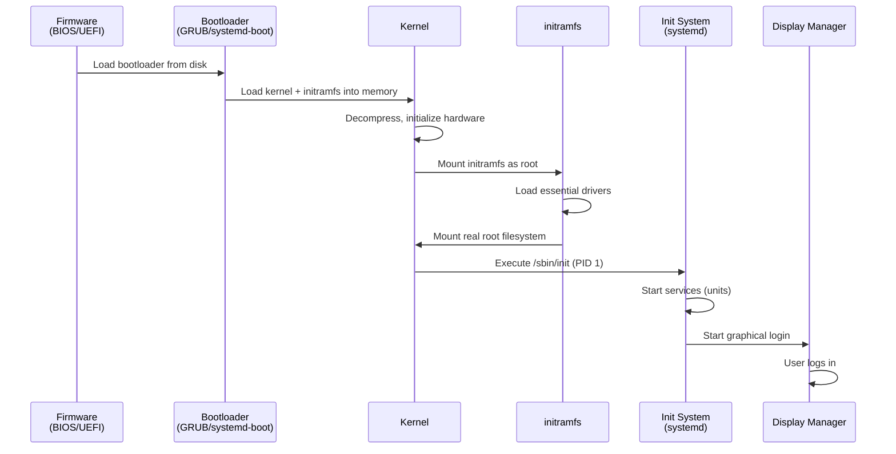

# The Linux Encyclopedia

> *"Linux is a cancer that attaches itself in an intellectual property sense to everything it touches."* — Steve Ballmer, Microsoft CEO (2001)
>
> *"We're all going to have to get used to the fact that Linux is a major force in the operating systems world."* — Steve Ballmer (2016)

Welcome to **The Linux Encyclopedia** — a comprehensive, continuously growing reference for everything Linux. From the lowest levels of kernel memory management to the highest abstractions of cloud-native orchestration, this encyclopedia aims to be the definitive technical reference for anyone who works with, studies, or is curious about the Linux operating system and its ecosystem.

---

## What Is Linux?

At its core, **Linux** is a Unix-like operating system kernel first released by Linus Torvalds on September 17, 1991. But "Linux" has come to mean much more than a kernel. It refers to an entire ecosystem:

- **The Linux kernel** — the monolithic kernel that manages hardware, processes, memory, and system calls
- **GNU/Linux systems** — the combination of the Linux kernel with GNU userland tools (Bash, Coreutils, GCC, glibc) that forms a complete operating system
- **Linux distributions** — curated collections of the kernel, userland, package managers, and desktop environments packaged for end users
- **The broader ecosystem** — cloud platforms, containers, embedded systems, supercomputers, and mobile devices all running Linux



### The Scale of Linux in 2025

The numbers tell the story of Linux's dominance:

| Domain | Linux Presence |
|--------|---------------|
| **Top 500 Supercomputers** | 100% run Linux (since 2017) |
| **Cloud Infrastructure** | ~90% of cloud workloads (AWS, GCP, Azure) |
| **Web Servers** | ~77% of web servers (Netcraft, 2025) |
| **Mobile Devices** | ~72% via Android (Linux kernel) |
| **Embedded Systems** | Dominant in routers, TVs, cars, industrial controllers |
| **Desktop** | ~4.5% global market share, growing steadily (StatCounter, 2025) |
| **Containers** | Virtually all container workloads run on Linux |

The Linux kernel itself has reached **40 million lines of code** as of kernel 6.14-rc1 (January 2025), with contributions from over **4,800 developers** per year. It is the largest collaborative software project in human history.

---

## Who This Encyclopedia Is For

This encyclopedia is written for a broad audience, from students encountering Linux for the first time to seasoned kernel developers looking for a quick reference:

### Beginners and Students
If you're new to Linux, start with the [Foundations](./foundations/what-is-linux.md) section. It covers the history, philosophy, and basic concepts you'll need. Then explore [Shell Scripting](./shell/scripting-fundamentals.md) and [System Administration](./admin/overview.md) for practical skills.

### System Administrators and DevOps Engineers
The [System Administration](./admin/overview.md), [Networking](./networking/fundamentals.md), [Security](./security/overview.md), and [Performance](./performance/overview.md) sections provide deep dives into the topics you deal with daily. The [Containers](./containers/overview.md) and [Virtualization](./virtualization/overview.md) sections cover modern infrastructure.

### Application Developers
The [System Programming](./sysprog/syscalls.md) section covers POSIX APIs, file I/O, process control, threading, and IPC. The [Shell](./shell/overview.md) section covers scripting from fundamentals to advanced patterns. The [Compilers](./compilers/gcc.md) section covers build toolchains.

### Kernel Developers and Contributors
The [Kernel](./kernel/overview.md) section is the deepest technical reference in this encyclopedia, covering architecture, subsystems, drivers, memory management, scheduling, networking, synchronization, and more. The [Debugging](./debugging/overview.md) section covers the tools you need for kernel development.

### Security Professionals
The [Security](./security/overview.md) section covers SELinux, AppArmor, capabilities, seccomp, secure boot, cryptography, and hardening. The [Debugging](./debugging/overview.md) section covers BPF, tracing, and forensic tools.

### Embedded Systems Engineers
The [Embedded](./embedded/overview.md) section covers device trees, cross-compilation, U-Boot, Buildroot, Yocto, real-time Linux, and ARM/RISC-V architectures.

---

## How This Encyclopedia Is Organized

This encyclopedia is organized into **18 major parts**, each covering a broad domain of Linux knowledge. Topics cross-reference each other extensively — if a concept mentions something unfamiliar, chances are there's a dedicated page for it.

Use the **search function** (press `S` or click the search icon) to find any topic quickly.

### Overview of Parts



### Detailed Part Descriptions

| Part | Title | Pages | Description |
|------|-------|-------|-------------|
| **I** | [Foundations](./foundations/what-is-linux.md) | 7 | History, philosophy, distributions, POSIX, Unix heritage, open source, licensing |
| **II** | [The Linux Kernel](./kernel/overview.md) | 100+ | The deepest technical reference: architecture, processes, memory, filesystems, networking, drivers, synchronization, interrupts, block layer |
| **III** | [System Programming](./sysprog/syscalls.md) | 20 | POSIX APIs, file I/O, process control, signals, threads, IPC, ELF, dynamic linking, io_uring |
| **IV** | [Shell and Scripting](./shell/overview.md) | 12 | Bash, Zsh, Fish, POSIX shell, scripting fundamentals and advanced patterns, regex, sed/awk, grep, find, xargs |
| **V** | [System Administration](./admin/overview.md) | 20 | Package management, systemd, users/groups, permissions, networking config, disk management, LVM, RAID, backup, cron, logging, performance |
| **VI** | [Networking](./networking/fundamentals.md) | 14 | OSI model, TCP/IP, DNS, DHCP, HTTP, TLS, SSH, VPN, routing, packet capture, troubleshooting, IPv6 |
| **VII** | [Security](./security/overview.md) | 20 | SELinux, AppArmor, capabilities, seccomp, PAM, audit, secure boot, cryptography, hardening, rootkits, Landlock, Yama, IMA, keyring |
| **VIII** | [Virtualization](./virtualization/overview.md) | 9 | KVM, QEMU, libvirt, virtio, VFIO, virtual networking, virtual storage, Xen |
| **IX** | [Containers](./containers/overview.md) | 16 | Docker internals, Kubernetes, OCI, containerd, Podman, cgroups v2, namespaces, overlayfs, rootless, seccomp, security |
| **X** | [Embedded Linux](./embedded/overview.md) | 15 | ARM, RISC-V, device trees, U-Boot, Buildroot, Yocto, cross-compilation, Android, real-time, TEE, initramfs |
| **XI** | [Debugging and Tracing](./debugging/overview.md) | 17 | GDB, ftrace, perf, BPF, eBPF, SystemTap, strace, Valgrind, KASAN, KFENCE, crash dumps, KGDB |
| **XII** | [Compiler Toolchains](./compilers/gcc.md) | 8 | GCC, Clang/LLVM, assembler, linker, make, CMake, Ninja, Rust for Linux |
| **XIII** | [Architecture-Specific](./arch/x86.md) | 7 | x86, ARM, RISC-V, MIPS, PowerPC, calling conventions, memory models |
| **XIV** | [Storage](./storage/overview.md) | 8 | Block I/O, SCSI, NVMe, RAID, LVM, SAN, Ceph, multipath |
| **XV** | [Performance Tuning](./performance/overview.md) | 14 | CPU, memory, I/O, network, NUMA, kernel profiling, benchmarking, BPF CO-RE, PEBS, RAPL |
| **XVI** | [Observability](./observability/overview.md) | 9 | /proc, /sys, BPF/bpftrace, kprobes, tracepoints, metrics, Prometheus/Grafana, SystemTap |
| **XVII** | [Build Systems](./build/kernel-build.md) | 5 | Kernel build system, cross-compilation, package building, distro building, CI/CD |
| **XVIII** | [History and Culture](./history/linus.md) | 6 | Linus Torvalds, development model, notable versions, Tanenbaum debate, Unix timeline, subsystems |

---

## The Linux Operating System Architecture

Understanding Linux requires understanding the layered architecture from hardware to userspace applications. Here's a high-level view of how the pieces fit together:

```mermaid
graph TB
    subgraph "User Space"
        APP1[Applications: nginx, Python, GCC]
        APP2[Desktop: GNOME, KDE]
        APP3[Containers: Docker, Podman]
        LIB[System Libraries: glibc, OpenSSL, zlib]
        INIT[Init System: systemd]
        SHELL[Shell: bash, zsh]
    end

    subgraph "Kernel Space"
        VFS[Virtual File System]
        SCHED[Process Scheduler]
        MM[Memory Manager]
        NET[Networking Stack]
        BLOCK[Block Layer]
        CHAR[Character Devices]
        IPC[IPC: pipes, sockets, shared memory]
        SECURITY[Security: LSM, capabilities, seccomp]
        IRQ[Interrupt Handling]
        MODULE[Module Loader]

        VFS --> EXT4[ext4]
        VFS --> XFS[XFS]
        VFS --> BTRFS[Btrfs]
        VFS --> PROC[/proc]
        VFS --> SYSFS[/sys]

        BLOCK --> IO_SCHED[I/O Schedulers]
        BLOCK --> DM[Device Mapper]
        BLOCK --> MD[Software RAID]

        NET --> TCP[TCP/IP]
        NET --> NETFILTER[Netfilter/iptables]
        NET --> XDP[XDP/eBPF]
    end

    subgraph "Hardware"
        CPU[CPU: x86, ARM, RISC-V]
        MEM[RAM]
        DISK[Storage: SSD, HDD, NVMe]
        NIC[Network: Ethernet, WiFi]
        GPU[GPU]
    end

    APP1 --> LIB
    APP2 --> LIB
    APP3 --> LIB
    LIB --> VFS
    LIB --> SCHED
    LIB --> MM
    LIB --> NET
    INIT --> SCHED
    SHELL --> LIB
    VFS --> BLOCK
    SCHED --> CPU
    MM --> MEM
    BLOCK --> DISK
    NET --> NIC
    CHAR --> GPU
    IRQ --> CPU
```

### Kernel Space vs User Space

The most fundamental architectural distinction in Linux is between **kernel space** and **user space**:

- **Kernel space** is where the kernel executes with full hardware access and no memory protection between components. The kernel manages hardware, schedules processes, handles interrupts, and provides system calls.
- **User space** is where applications run with restricted privileges. Applications access hardware and kernel services through **system calls** — a well-defined API that acts as the boundary between user space and kernel space.



### The Major Kernel Subsystems

The Linux kernel is organized into several major subsystems, each with its own maintainer team and mailing list. Understanding these subsystems is essential for navigating the kernel source tree and this encyclopedia:

#### Process Scheduler
The scheduler determines which process runs on each CPU core and for how long. Linux uses the **EEVDF** (Earliest Eligible Virtual Deadline First) scheduler (since kernel 6.6), replacing the earlier CFS (Completely Fair Scheduler). The scheduler supports real-time scheduling classes (SCHED_FIFO, SCHED_DEADLINE) and the new extensible scheduler framework (sched_ext).

→ See: [Scheduler](./kernel/processes/scheduler.md) | [CFS](./kernel/processes/cfs.md) | [EEVDF](./kernel/processes/eevdf.md) | [Real-time Scheduling](./kernel/processes/realtime-scheduling.md) | [sched_ext](./kernel/processes/sched-ext.md)

#### Memory Management
The memory manager handles virtual memory, page tables, physical page allocation, slab caches, huge pages, NUMA balancing, swap, and the OOM killer. It is one of the most complex subsystems in the kernel.

→ See: [Memory Overview](./kernel/memory/overview.md) | [Virtual Memory](./kernel/memory/virtual-memory.md) | [Page Allocator](./kernel/memory/page-allocator.md) | [Slab Allocator](./kernel/memory/slab-allocator.md) | [Huge Pages](./kernel/memory/huge-pages.md) | [NUMA](./kernel/memory/numa.md) | [OOM Killer](./kernel/memory/oom-killer.md)

#### Virtual File System (VFS)
VFS provides an abstraction layer over all filesystems. It defines the interfaces (`inode`, `dentry`, `superblock`, `file_operations`) that filesystem implementations must provide. This allows Linux to support dozens of filesystem types simultaneously.

→ See: [VFS](./kernel/filesystems/vfs.md) | [Inode](./kernel/filesystems/inode.md) | [Dentry](./kernel/filesystems/dentry.md) | [ext4](./kernel/filesystems/ext4.md) | [XFS](./kernel/filesystems/xfs.md) | [Btrfs](./kernel/filesystems/btrfs.md)

#### Networking Stack
The networking stack implements the full TCP/IP protocol suite, from socket interfaces through transport, network, and link layers. It includes Netfilter (firewalling), traffic control, XDP/eBPF for high-performance packet processing, and support for modern protocols.

→ See: [Networking Overview](./kernel/networking/overview.md) | [Sockets](./kernel/networking/sockets.md) | [TCP/IP](./kernel/networking/tcpip.md) | [Netfilter](./kernel/networking/netfilter.md) | [XDP](./kernel/networking/xdp.md) | [eBPF](./kernel/networking/ebpf.md)

#### Block Layer
The block layer sits between the filesystem and block device drivers. It handles I/O scheduling, request merging, device mapper (LVM, dm-crypt), and software RAID (md).

→ See: [Block Overview](./kernel/block/overview.md) | [BIO](./kernel/block/bio.md) | [I/O Schedulers](./kernel/block/io-schedulers.md) | [Device Mapper](./kernel/block/device-mapper.md)

#### Device Drivers
The largest portion of the kernel source tree is device drivers — they account for over 60% of the code. Drivers are organized by bus type (PCI, USB, I2C, SPI) and device class (network, block, character, graphics).

→ See: [Driver Overview](./kernel/drivers/overview.md) | [PCI](./kernel/drivers/pci.md) | [USB](./kernel/drivers/usb.md) | [Network Drivers](./kernel/drivers/net-drivers.md) | [Character Devices](./kernel/drivers/char-devices.md)

#### Interrupt Handling
Interrupts are the mechanism by which hardware notifies the kernel of events. Linux divides interrupt handling into top halves (fast, hardware-specific) and bottom halves (deferred work via softirqs, tasklets, and workqueues).

→ See: [Interrupt Overview](./kernel/interrupts/overview.md) | [Hardware Interrupts](./kernel/interrupts/hardware.md) | [Softirqs](./kernel/interrupts/softirqs.md) | [Workqueues](./kernel/interrupts/workqueues.md)

#### Synchronization Primitives
With multiple CPUs accessing shared data, the kernel needs robust synchronization. Linux provides spinlocks, mutexes, RCU (Read-Copy-Update), semaphores, seqlocks, atomic operations, and more.

→ See: [Sync Overview](./kernel/sync/overview.md) | [Spinlocks](./kernel/sync/spinlocks.md) | [Mutexes](./kernel/sync/mutexes.md) | [RCU](./kernel/sync/rcu.md) | [Atomic Ops](./kernel/sync/atomic-ops.md)

---

## How to Use This Encyclopedia

### Navigation

- **Search**: Press `S` or click the search icon to search across all pages
- **Table of Contents**: Each page has a table of contents in the sidebar
- **Cross-references**: Blue links connect related topics across the encyclopedia
- **Breadcrumbs**: The top navigation shows your location in the hierarchy

### Reading Paths

Depending on your goals, here are suggested reading paths:

#### Path 1: "I'm New to Linux"
1. [What Is Linux?](./foundations/what-is-linux.md)
2. [History of Linux](./foundations/history.md)
3. [Unix Heritage](./foundations/unix-heritage.md)
4. [POSIX](./foundations/posix.md)
5. [Distributions](./foundations/distributions.md)
6. [Shell Overview](./shell/overview.md)
7. [Bash](./shell/bash.md)
8. [System Administration Overview](./admin/overview.md)

#### Path 2: "I Want to Understand the Kernel"
1. [Kernel Overview](./kernel/overview.md)
2. [Kernel Architecture](./kernel/architecture.md)
3. [Boot Process](./kernel/boot-process.md)
4. [System Calls](./kernel/core/processes/system-calls.md)
5. [Processes and Threads](./kernel/processes/processes-and-threads.md)
6. [Memory Overview](./kernel/memory/overview.md)
7. [VFS](./kernel/filesystems/vfs.md)
8. [Networking Overview](./kernel/networking/overview.md)

#### Path 3: "I'm a System Administrator"
1. [Admin Overview](./admin/overview.md)
2. [systemd](./admin/systemd.md)
3. [Package Management](./admin/package-management.md)
4. [Users and Groups](./admin/users-groups.md)
5. [Permissions](./admin/permissions.md)
6. [Networking Config](./admin/networking-config.md)
7. [Disk Management](./admin/disk-management.md)
8. [LVM](./admin/lvm.md)
9. [Firewall](./admin/firewall.md)
10. [Performance](./admin/performance.md)

#### Path 4: "I'm a Security Professional"
1. [Security Overview](./security/overview.md)
2. [Security Model](./security/security-model.md)
3. [Capabilities](./security/capabilities.md)
4. [SELinux](./security/selinux.md)
5. [AppArmor](./security/apparmor.md)
6. [Seccomp](./security/seccomp.md)
7. [Secure Boot](./security/secure-boot.md)
8. [Hardening](./security/hardening.md)
9. [Audit](./security/audit.md)

#### Path 5: "I Want to Develop Kernel Modules"
1. [Kernel Overview](./kernel/overview.md)
2. [Kernel Architecture](./kernel/architecture.md)
3. [Modules](./kernel/modules.md)
4. [Driver Overview](./kernel/drivers/overview.md)
5. [Character Devices](./kernel/drivers/char-devices.md)
6. [Kernel Build System](./kernel/build-system.md)
7. [Debugging Overview](./debugging/overview.md)
8. [KGDB](./debugging/kgdb.md)

---

## Quality Commitment

Every page in this encyclopedia aims to:

- Explain **what** a concept is and **why** it exists
- Cover **implementation details** and internal mechanics
- Discuss **trade-offs** and design decisions
- Provide **working examples** and command outputs
- Include **diagrams** (Mermaid) where they aid understanding
- Link to **official references** and further reading
- Cross-reference related topics throughout the book

All technical claims are verifiable against kernel source code, official documentation, or authoritative published sources. Where behavior varies between kernel versions, the version is noted.

---

## Conventions Used in This Encyclopedia

### Code Examples

Code examples use the following conventions:

```bash
# Commands you type are shown with a $ prompt
$ ls -la /proc/self/maps

# Output is shown without a prompt
total 0
-r--r--r-- 1 root root 0 Jul 22 10:00 auxv
```

```c
// Kernel and C code examples are shown in full
#include <linux/module.h>
#include <linux/kernel.h>

static int __init hello_init(void) {
    pr_info("Hello, kernel!\n");
    return 0;
}
module_init(hello_init);
```

### Diagrams

Diagrams use [Mermaid](https://mermaid.js.org/) syntax and are rendered inline. They illustrate architecture, data flow, state machines, and relationships between components.

### Cross-References

Related topics are linked inline with arrows:

> → See: [Related Topic](./path/to/topic.md)

### Version Notes

When behavior differs between kernel versions:

> **Note:** The EEVDF scheduler replaced CFS in kernel 6.6 (October 2023).

### Command Output

Real command output is preferred over hypothetical examples. When specific hardware or configuration is required, it is noted.

---

## A Brief History of Linux

Understanding Linux requires understanding its history. Here are the key milestones:

| Year | Event |
|------|-------|
| **1969** | Unix developed at AT&T Bell Labs by Ken Thompson and Dennis Ritchie |
| **1983** | Richard Stallman announces the GNU Project |
| **1985** | Free Software Foundation (FSF) founded |
| **1989** | GPL v1 released |
| **1991** | Linux kernel 0.01 released by Linus Torvalds (September 17) |
| **1992** | Linux relicensed under GPL v2 (February); first distributions (Slackware, Debian) |
| **1993** | NetBSD, FreeBSD, OpenBSD fork from 386BSD |
| **1994** | Linux 1.0 released (March 14); Red Hat Linux founded |
| **1996** | Linux 2.0 released — symmetric multiprocessor (SMP) support |
| **1998** | "Open Source" term coined; Netscape open-sources Navigator (Mozilla) |
| **1999** | Linux 2.2 released; Apache dominates web servers |
| **2001** | Linux 2.4 released — USB, LVM, RAID, ext3 |
| **2003** | Linux 2.6 released — O(1) scheduler, preemptibility, 64-bit support |
| **2004** | Ubuntu 4.10 "Warty Warthog" released |
| **2005** | Git created by Linus Torvalds; Open Source Development Labs merges with FSF |
| **2007** | GPL v3 released; Android announced |
| **2008** | Chrome OS announced; Linux dominates cloud computing |
| **2011** | Linux 3.0 released; Android becomes world's most popular smartphone OS |
| **2012** | Linux Foundation reports kernel is worth $1.4 billion to recreate |
| **2015** | Linux 4.0 released — live kernel patching |
| **2016** | Linux 4.6 — cgroup v2; Microsoft joins Linux Foundation |
| **2019** | Linux 5.0 — initial support for AMD Radeon GPUs; io_uring |
| **2020** | Linux 5.6 — WireGuard VPN merged; 32-bit Arm deprecation begins |
| **2021** | Linux 5.10 LTS — nftables; 5.15 LTS — NTFS3 driver |
| **2022** | Linux 6.0 — Rust support initial merge; io_uring improvements |
| **2023** | Linux 6.5 — initial Wi-Fi 7 support; EEVDF scheduler (6.6) |
| **2024** | Linux 6.8 — Xe GPU driver; bcachefs merged; 6.12 LTS — sched_ext |
| **2025** | Linux 6.14 — 40 million lines of code; Rust driver expansion continues |

→ See: [Full History](./foundations/history.md) | [Notable Versions](./history/notable-versions.md) | [Linus Torvalds](./history/linus.md) | [Unix Timeline](./history/unix-timeline.md)

---

## Linux in the Modern World

### Cloud Computing

Linux is the foundation of cloud computing. Every major cloud provider — Amazon Web Services (AWS), Google Cloud Platform (GCP), Microsoft Azure — runs primarily on Linux. Cloud-native technologies like Kubernetes, Docker, and Prometheus are all Linux-native.

→ See: [Containers](./containers/overview.md) | [Kubernetes](./containers/kubernetes.md) | [Virtualization](./virtualization/overview.md)

### Mobile and Embedded

Android, the world's most popular mobile operating system, runs on the Linux kernel. Beyond phones, Linux powers smart TVs, automotive infotainment systems (Automotive Grade Linux), network routers, industrial controllers, and spacecraft (SpaceX, NASA).

→ See: [Embedded Overview](./embedded/overview.md) | [Android](./embedded/android.md) | [ARM](./embedded/arm.md) | [Device Trees](./embedded/device-tree.md)

### Supercomputing and HPC

Every system on the TOP500 supercomputer list has run Linux since November 2017. High-performance computing relies on Linux for its customizability, performance, and support for specialized hardware (InfiniBand, GPUs, FPGAs).

→ See: [Performance](./performance/overview.md) | [NUMA](./performance/numa.md) | [Networking](./networking/fundamentals.md)

### Artificial Intelligence and Machine Learning

The AI/ML revolution runs on Linux. NVIDIA's CUDA, PyTorch, TensorFlow, and virtually all ML frameworks target Linux first. Training large language models requires Linux for GPU driver support, container orchestration, and cluster management.

### The Internet of Things (IoT)

From Raspberry Pi to industrial sensors, Linux is the OS of choice for connected devices. The Yocto Project and Buildroot provide tools for creating custom Linux distributions for embedded hardware.

→ See: [Yocto](./embedded/yocto.md) | [Buildroot](./embedded/buildroot.md) | [RISC-V](./embedded/riscv.md)

---

## The Linux Kernel Development Model

The Linux kernel has one of the most successful open-source development models in history. Understanding it helps explain why Linux has thrived for over three decades:

### The Release Cycle

The kernel follows a time-based release cycle of approximately **9-10 weeks**:

1. **Merge window** (2 weeks): New features merged from subsystem trees into Linus's tree
2. **Release candidates** (rc1 through rc7-rc8, ~7 weeks): Bug fixes only, increasingly strict
3. **Final release**: The kernel is released and the cycle begins again
4. **Stable releases**: Critical fixes are backported to stable and longterm branches


### The Maintainer Hierarchy

The kernel uses a hierarchical maintainer model:

- **Linus Torvalds** — overall maintainer, merges subsystem trees
- **Subsystem maintainers** — maintain specific areas (networking, memory, filesystems, etc.)
- **Driver maintainers** — maintain specific device drivers
- **The MAINTAINERS file** — lists every subsystem and its maintainer(s)

```bash
# Find who maintains a subsystem
$ scripts/get_maintainer.pl -f drivers/gpu/drm/i915/
# Output lists maintainers, reviewers, and mailing lists
```

### The Contribution Process

Contributing to the kernel follows a well-defined process:

1. Write code following the kernel coding style (`Documentation/process/coding-style.rst`)
2. Test thoroughly
3. Generate patches with `git format-patch`
4. Send patches to the appropriate mailing list using `git send-email`
5. Respond to review comments
6. Once approved, the maintainer sends a pull request to Linus

→ See: [Development Model](./history/development-model.md) | [Kernel Build System](./kernel/build-system.md) | [Contributing](./foundations/open-source.md)

---

## Glossary of Key Terms

| Term | Definition |
|------|-----------|
| **Kernel** | The core of the operating system that manages hardware and provides services to user space |
| **System call** | The interface between user space and kernel space (e.g., `read()`, `write()`, `fork()`) |
| **Process** | A running program with its own address space, file descriptors, and execution context |
| **Thread** | A lightweight process sharing an address space with other threads in the same process |
| **VFS** | Virtual File System — the kernel abstraction layer over all filesystem implementations |
| **Scheduler** | The kernel component that decides which process/thread runs on each CPU |
| **Page** | The unit of memory management, typically 4 KB on x86 |
| **inode** | A filesystem data structure representing a file (metadata, not the filename) |
| **dentry** | Directory entry — maps filenames to inodes |
| **Block device** | A device that reads/writes data in fixed-size blocks (disk, SSD) |
| **Character device** | A device that reads/writes data as a stream of bytes (terminal, serial port) |
| **Module** | A piece of kernel code that can be loaded and unloaded at runtime |
| **BPF** | Berkeley Packet Filter — now eBPF, a virtual machine for running programs in the kernel |
| **cgroup** | Control group — a mechanism for limiting, accounting, and isolating resource usage |
| **Namespace** | A mechanism for partitioning kernel resources so that different processes see different views |
| **Device tree** | A data structure describing hardware, used especially on ARM and RISC-V |
| **initramfs** | Initial RAM filesystem — a root filesystem loaded into memory during boot |
| **systemd** | The init system and service manager used by most modern Linux distributions |

→ See: [Full Glossary](./reference/glossary.md)

---

## The Linux Kernel Source Tree

The kernel source tree is organized into directories that mirror the subsystem structure. Understanding this layout is essential for navigating the code:

```
linux/
├── arch/           # Architecture-specific code (x86, arm64, riscv, etc.)
│   ├── x86/        # x86-specific: boot, vDSO, entry code, KVM
│   ├── arm64/      # ARM 64-bit: boot, device trees, exceptions
│   └── riscv/      # RISC-V: boot, vector extensions
├── block/          # Block layer: BIO, I/O schedulers, device mapper
├── certs/          # Signing certificates for secure boot
├── crypto/         # Cryptographic API and algorithms
├── Documentation/  # Kernel documentation (reStructuredText)
├── drivers/        # Device drivers (largest directory)
│   ├── gpu/        # Graphics drivers (DRM subsystem)
│   ├── net/        # Network device drivers
│   ├── scsi/       # SCSI subsystem drivers
│   ├── usb/        # USB subsystem drivers
│   └── ...         # 50+ driver subdirectories
├── fs/             # Filesystem implementations
│   ├── ext4/       # ext4 filesystem
│   ├── xfs/        # XFS filesystem
│   ├── btrfs/      # Btrfs filesystem
│   ├── proc/       # /proc filesystem
│   └── ...         # 50+ filesystem types
├── include/        # Header files
│   ├── linux/      # Core kernel headers
│   ├── uapi/       # User-space API headers
│   └── asm-generic/# Architecture-independent asm headers
├── init/           # Kernel initialization (main.c, do_mounts.c)
├── io_uring/       # io_uring subsystem
├── ipc/            # Inter-process communication (SysV IPC, POSIX)
├── kernel/         # Core kernel: scheduler, signals, time, BPF
├── lib/            # Kernel library routines (string, sort, etc.)
├── mm/             # Memory management
├── net/            # Networking stack
│   ├── ipv4/       # TCP/IP v4
│   ├── ipv6/       # TCP/IP v6
│   ├── netfilter/  # Packet filtering (iptables/nftables)
│   └── ...         # Protocol implementations
├── rust/           # Rust language support
├── scripts/        # Build scripts, helper tools
├── security/       # Security frameworks (LSM, SELinux, AppArmor)
├── sound/          # Audio subsystem (ALSA)
├── tools/          # User-space tools (perf, BPF, selftests)
├── usr/            # initramfs generation
└── virt/           # Virtualization (KVM)
```

The kernel tree contains over **40 million lines of code** (as of 2025), with the `drivers/` directory alone accounting for over 60% of the total. The `Documentation/` directory contains thousands of files covering every subsystem and API.

### Key Files

| File | Purpose |
|------|---------|
| `MAINTAINERS` | Lists every subsystem, its maintainer(s), and mailing list |
| `COPYING` | GPL v2 license text |
| `Kconfig` | Kernel configuration system definitions |
| `Makefile` | Top-level build system |
| `README` | Build instructions and overview |
| `CREDITS` | Contributors to the kernel |
| `Documentation/process/coding-style.rst` | Kernel coding style guide |

```bash
# Count lines of code in the kernel tree
$ find . -name '*.c' -o -name '*.h' | xargs wc -l | tail -1
# As of 6.14-rc1: ~40,000,000 lines

# Count the number of source files
$ find . -name '*.c' | wc -l
# Approximately 80,000+ C source files

# See the MAINTAINERS file for a subsystem
$ head -50 MAINTAINERS
```

---

## Getting Started with Linux

If you're completely new to Linux, here's how to get hands-on experience:

### Option 1: Use a Distribution in a Virtual Machine

The easiest way to experiment without affecting your main system:

```bash
# Install VirtualBox, VMware, or use QEMU
# Download an ISO from a major distribution:
#   - Ubuntu: https://ubuntu.com/download
#   - Fedora: https://fedoraproject.org/
#   - Debian: https://www.debian.org/

# Create a VM with:
#   - 2+ CPU cores
#   - 4+ GB RAM
#   - 20+ GB disk
# Boot from the ISO and follow the installer
```

### Option 2: Windows Subsystem for Linux (WSL)

On Windows 10/11, WSL provides a full Linux environment:

```powershell
# In PowerShell (Administrator)
> wsl --install -d Ubuntu
# Restart, then open Ubuntu from Start menu
```

### Option 3: Use a Live USB

Most distributions offer a "live" mode that runs entirely from a USB stick without installing:

```bash
# Download the ISO
# Write to USB with dd (Linux/macOS) or Rufus (Windows)
$ sudo dd if=ubuntu-24.04-desktop-amd64.iso of=/dev/sdX bs=4M status=progress
# Boot from USB (change boot order in BIOS/UEFI)
```

### Option 4: Cloud Instance

Spin up a Linux server in the cloud:

```bash
# AWS: Launch an EC2 instance with Amazon Linux or Ubuntu
# GCP: Create a Compute Engine instance
# Azure: Create a Virtual Machine
# DigitalOcean: Create a Droplet ($4/month)
```

### Essential First Steps

Once you have a Linux system, try these commands:

```bash
# See what kernel version you're running
$ uname -a
Linux myhost 6.8.0-40-generic #40-Ubuntu SMP x86_64 GNU/Linux

# See system information
$ cat /etc/os-release
NAME="Ubuntu"
VERSION="24.04 LTS (Noble Numbat)"

# Explore the filesystem hierarchy
$ ls /
bin  boot  dev  etc  home  lib  lost+found  media  mnt  opt  proc  root  run  sbin  srv  sys  tmp  usr  var

# See running processes
$ ps aux

# See disk usage
$ df -h

# See memory usage
$ free -h

# Get help on any command
$ man ls
$ man 2 read    # Section 2: system calls
$ man 3 printf  # Section 3: library functions
```

---

## Linux Distributions: Choosing Your Starting Point

A Linux distribution ("distro") packages the kernel, userland, package manager, and usually a desktop environment into a coherent system. Hundreds of distributions exist, but most are derived from a handful of major base distributions:

### Major Distribution Families



### Distribution Comparison

| Distribution | Base | Package Manager | Best For |
|-------------|------|-----------------|----------|
| **Ubuntu** | Debian | apt (.deb) | Beginners, servers, cloud |
| **Fedora** | Independent | dnf (.rpm) | Developers, cutting-edge |
| **Debian** | Independent | apt (.deb) | Stability, servers |
| **Arch Linux** | Independent | pacman | Advanced users, learning |
| **RHEL** | Fedora | dnf (.rpm) | Enterprise servers |
| **openSUSE** | Independent | zypper (.rpm) | Enterprise, desktop |
| **Alpine** | Independent | apk | Containers, minimal systems |
| **Gentoo** | Independent | Portage (source) | Maximum customization |
| **NixOS** | Independent | Nix | Reproducible builds |
| **Linux Mint** | Ubuntu | apt (.deb) | Desktop, Windows switchers |

→ See: [Distributions](./foundations/distributions.md) | [Package Management](./admin/package-management.md)

---

## The POSIX Standard and Portability

**POSIX** (Portable Operating System Interface) is a family of IEEE standards (IEEE 1003) that define the API, shell, and utility interfaces for Unix-like operating systems. POSIX compliance is what makes it possible to write software that runs on Linux, macOS, FreeBSD, and other Unix-like systems with minimal changes.

Key POSIX standards:

- **POSIX.1** (IEEE Std 1003.1): Core system calls and functions (`fork()`, `exec()`, `read()`, `write()`, `open()`, etc.)
- **POSIX.1b** (Real-time extensions): Real-time signals, timers, message queues, semaphores
- **POSIX.1c** (Threads): pthreads API (`pthread_create()`, `pthread_mutex_lock()`, etc.)
- **POSIX.2** (Shell and Utilities): Command-line utilities (`ls`, `grep`, `sed`, `awk`, etc.)

Linux is largely POSIX-compliant but not certified. It adds many extensions beyond POSIX (epoll, io_uring, inotify, etc.) that provide superior performance or functionality.

```c
// A POSIX-compliant program that works on Linux, macOS, FreeBSD, etc.
#include <stdio.h>
#include <stdlib.h>
#include <unistd.h>
#include <sys/wait.h>

int main(void) {
    pid_t pid = fork();
    if (pid == 0) {
        // Child process
        printf("Child: PID %d\n", getpid());
        exit(0);
    } else if (pid > 0) {
        // Parent process
        int status;
        waitpid(pid, &status, 0);
        printf("Parent: child %d exited with %d\n", pid, WEXITSTATUS(status));
    } else {
        perror("fork");
        exit(1);
    }
    return 0;
}
```

→ See: [POSIX](./foundations/posix.md) | [System Calls](./sysprog/syscalls.md) | [Process Control](./sysprog/process-control.md)

---

## The Shell: Your Interface to Linux

The **shell** is the command-line interface to Linux. It reads commands, interprets them, and executes programs. Understanding the shell is essential for every Linux user and administrator.

Linux offers multiple shells:

| Shell | Description | Default On |
|-------|-------------|------------|
| **Bash** | Bourne Again Shell — the most widely used shell | Most distributions |
| **Zsh** | Z Shell — advanced features, Oh My Zsh ecosystem | macOS (since Catalina), Kali |
| **Fish** | Friendly Interactive Shell — user-friendly, auto-suggestions | Some desktop distros |
| **Dash** | Debian Almquist Shell — fast, POSIX-compliant | Ubuntu (as /bin/sh) |
| **mksh** | MirBSD Korn Shell — lightweight, embedded systems | Android (as /system/bin/sh) |

```bash
# Basic shell operations
$ echo "Hello, Linux!"
Hello, Linux!

# Pipes and redirection
$ ps aux | grep nginx | wc -l
3

# Command substitution
$ echo "Today is $(date +%A)"
Today is Wednesday

# Control structures
$ for f in /etc/*.conf; do echo "$f"; done
/etc/adduser.conf
/etc/ca-certificates.conf
...

# Scripting
$ cat > hello.sh << 'EOF'
#!/bin/bash
echo "Hello from $0"
echo "Arguments: $@"
EOF
$ chmod +x hello.sh
$ ./hello.sh world
Hello from ./hello.sh
Arguments: world
```

→ See: [Shell Overview](./shell/overview.md) | [Bash](./shell/bash.md) | [Scripting Fundamentals](./shell/scripting-fundamentals.md) | [POSIX Shell](./shell/posix-shell.md)

---

## How Linux Boots: From Power Button to Login Prompt

Understanding the boot process helps with troubleshooting and system configuration:



The key stages are:

1. **Firmware** (BIOS or UEFI) performs POST and loads the bootloader
2. **Bootloader** (GRUB, systemd-boot, or U-Boot on embedded) loads the kernel
3. **Kernel** initializes hardware, mounts the root filesystem, starts PID 1
4. **Init system** (systemd on most modern distros) starts all services
5. **User space** — login shell or graphical desktop

→ See: [Boot Process](./kernel/boot-process.md) | [systemd](./admin/systemd.md) | [GRUB](./admin/rescue.md) | [initramfs](./embedded/initramfs.md)

---

## Contributing to This Encyclopedia

This is a living document. If you find errors, gaps, or areas that could be improved, contributions are welcome. Every page follows a consistent structure:

1. **Introduction** — What is this topic and why does it matter?
2. **Background** — Historical context and motivation
3. **Technical Details** — How it works internally
4. **Examples** — Working code and command examples
5. **Diagrams** — Visual representations where helpful
6. **Trade-offs** — Design decisions and their implications
7. **References** — Links to authoritative sources

---

## References

- [The Linux Kernel documentation](https://docs.kernel.org/) — Official kernel documentation
- [kernel.org](https://www.kernel.org/) — Official kernel releases
- [Linux Foundation](https://www.linuxfoundation.org/) — Supporting open-source development
- [LWN.net](https://lwn.net/) — Linux and free software news and analysis
- [The Linux Kernel Module Programming Guide](https://tldp.org/LDP/lkmpg/2.6/html/) — Guide to kernel module development
- [Linux From Scratch](https://www.linuxfromscratch.org/) — Build your own Linux system from source
- [The Linux Command Line](https://linuxcommand.org/tlcl.php) — Free book on the Linux command line
- [Linux man pages](https://man7.org/linux/man-pages/) — Comprehensive manual pages
- [TOP500 Supercomputer List](https://top500.org/) — Supercomputer rankings (all Linux)
- [StatCounter OS Market Share](https://gs.statcounter.com/os-market-share/) — Desktop/mobile OS statistics
- [Netcraft Web Server Survey](https://www.netcraft.com/) — Web server market share
- [kernel.org git statistics](https://git.kernel.org/) — Kernel source code statistics
- [Linux Weekly News: Kernel](https://lwn.net/Kernel/Index/) — Comprehensive kernel topic index

---

*This encyclopedia is released under the [GNU Free Documentation License v1.3](https://www.gnu.org/licenses/fdl-1.3.html). Last updated: July 2025.*
