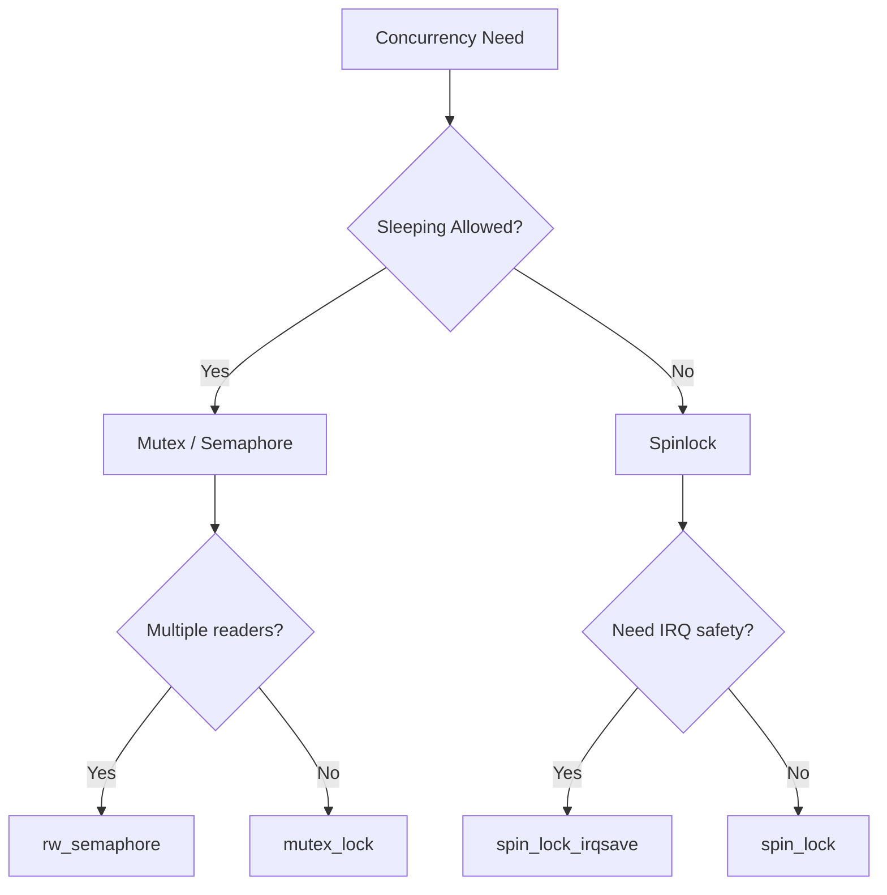
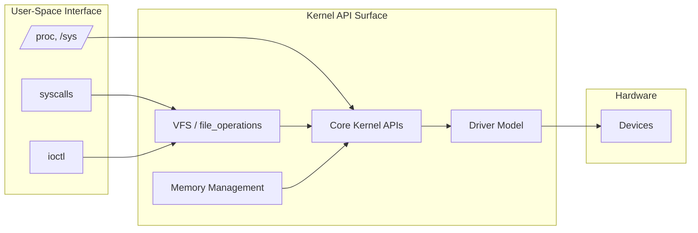

# Kernel APIs

The Linux kernel exposes a rich set of internal APIs that device drivers and
other kernel subsystems use to interact with hardware, manage memory, handle
concurrency, and communicate with user space. Unlike user-space libraries
(which link against shared objects), kernel code calls these routines through
**exported symbols** — functions and data objects that the kernel's symbol
table makes available to loadable modules.

Understanding the kernel API surface is essential for anyone writing or
reviewing kernel code. This chapter covers the most commonly used APIs
grouped into logical families.

---

## 1. Exported Symbols

Every function or variable that a kernel module must call from another
translation unit must be **exported** via one of two macros:

```c
EXPORT_SYMBOL(symbol_name);
EXPORT_SYMBOL_GPL(symbol_name);
```

| Macro | Visibility |
|---|---|
| `EXPORT_SYMBOL` | Available to any module, regardless of license |
| `EXPORT_SYMBOL_GPL` | Available **only** to modules whose license is GPL-compatible |

### How Exporting Works

At build time the `EXPORT_SYMBOL` macro emits a special ELF section
(`__ksymtab` and friends) containing the symbol name and its address.
At module load time the kernel's module loader resolves references against
this table.

```text
$ grep -c EXPORT_SYMBOL /proc/kallsyms
6832
```

You can inspect the live symbol table at any time:

```bash
$ cat /proc/kallsyms | head -5
ffffffff81000000 T _text
ffffffff81000000 T _stext
ffffffff81000000 T startup_64
ffffffff81001000 T secondary_startup_64
ffffffff81001000 T __start_bss
```

### Adding Your Own Export

```c
/* drivers/misc/my_helper.c */
#include <linux/module.h>

int my_helper_do_work(int arg)
{
    return arg * 2;
}
EXPORT_SYMBOL_GPL(my_helper_do_work);
```

Any module that then includes the header and links against the symbol can
call `my_helper_do_work()` at runtime.

---

## 2. Kernel Library Routines (`lib/`)

The kernel ships a large collection of **general-purpose library routines**
under `lib/`. These are *not* tied to any specific subsystem.

### 2.1 String and Memory APIs

| Function | Purpose |
|---|---|
| `strcpy`, `strncpy` | Copy strings (prefer `strscpy`) |
| `strscpy` | Safer string copy with guaranteed NUL termination |
| `strlcpy` | Deprecated in kernel — use `strscpy` |
| `strcmp`, `strncmp`, `strchr`, `strrchr` | Compare / search strings |
| `strlen`, `strnlen` | Measure length |
| `memcpy`, `memmove`, `memset`, `memcmp` | Raw memory operations |
| `kstrdup`, `kstrndup`, `kfree` | Allocate a copy of a string in kernel memory |
| `kasprintf` | `sprintf` into a `kmalloc`'d buffer |
| `snprintf`, `scnprintf` | Bounded formatting |

#### `strscpy` — The Preferred String Copy

```c
char dest[32];

/* strscpy returns the number of bytes copied (excluding NUL),
   or -E2NOSPC if truncation occurred. */
ssize_t ret = strscpy(dest, src, sizeof(dest));
if (ret == -E2NOSPC)
    pr_warn("string truncated\n");
```

#### `kstrdup` — Duplicate a String

```c
char *copy = kstrdup(original, GFP_KERNEL);
if (!copy)
    return -ENOMEM;

/* use copy ... */
kfree(copy);
```

### 2.2 Linked Lists (`<linux/list.h>`)

The kernel's **doubly-linked circular list** is one of the most used data
structures:

```c
#include <linux/list.h>

struct my_entry {
    int data;
    struct list_head node;   /* must be embedded */
};

LIST_HEAD(my_list);

struct my_entry *e = kmalloc(sizeof(*e), GFP_KERNEL);
e->data = 42;
list_add_tail(&e->node, &my_list);

/* Iterate safely (safe against removal) */
struct my_entry *cur;
list_for_each_entry(cur, &my_list, node) {
    pr_info("data = %d\n", cur->data);
}
```

### 2.3 Bitmaps

```c
#include <linux/bitmap.h>

DECLARE_BITMAP(my_bits, 256);

set_bit(42, my_bits);
clear_bit(42, my_bits);
int val = test_bit(42, my_bits);
```

### 2.4 Sort and Search

```c
#include <linux/sort.h>

sort(array, count, sizeof(array[0]), my_cmp_func, NULL);
```

---

## 3. `copy_to_user` / `copy_from_user`

When a driver needs to transfer data between kernel space and user-space
buffers (e.g., in a `read()` or `write()` system call), it **must** use
the dedicated copy helpers rather than raw `memcpy`:

```c
#include <linux/uaccess.h>

/* Kernel → User (used in .read / .copy_to_user) */
unsigned long copy_to_user(void __user *to, const void *from, unsigned long n);

/* User → Kernel (used in .write / .copy_from_user) */
unsigned long copy_from_user(void *to, const void __user *from, unsigned long n);
```

### Why Not `memcpy`?

1. **Security**: Kernel code must not dereference user pointers without
   validation — the address may be unmapped, non-canonical, or deliberately
   crafted to fault.
2. **SMAP / PAN**: On modern x86 and ARM CPUs, Supervisor Mode Access
   Prevention traps direct kernel reads/writes of user pages.
3. **`access_ok` checks**: The helpers verify the range is in user space.

### Return Value

Both functions return the number of bytes **not** copied. A return of 0
means success:

```c
static ssize_t my_read(struct file *f, char __user *buf,
                        size_t len, loff_t *off)
{
    char data[] = "hello from kernel";

    if (copy_to_user(buf, data, sizeof(data)))
        return -EFAULT;

    return sizeof(data);
}
```

### Short-Copy Idiom

```c
if (copy_to_user(buf, kern_buf, len))
    return -EFAULT;    /* some or all bytes failed */
```

For variable-length copies where partial success is acceptable (rare in
drivers), check the return value and adjust.

---

## 4. `printk` and the Kernel Log Buffer

`printk` is the kernel's primary logging mechanism — analogous to
`printf` in user space, but writes into a ring buffer consumed by
`dmesg` and optionally forwarded to consoles.

### Log Levels

```c
#define KERN_EMERG   KERN_SOH "0"   /* system is unusable */
#define KERN_ALERT   KERN_SOH "1"   /* action must be taken */
#define KERN_CRIT    KERN_SOH "2"   /* critical conditions */
#define KERN_ERR     KERN_SOH "3"   /* error conditions */
#define KERN_WARNING KERN_SOH "4"   /* warning conditions */
#define KERN_NOTICE  KERN_SOH "5"   /* normal but significant */
#define KERN_INFO    KERN_SOH "6"   /* informational */
#define KERN_DEBUG   KERN_SOH "7"   /* debug-level messages */
```

### Convenience Macros

```c
pr_emerg("format, ...\n");
pr_alert("format, ...\n");
pr_crit("format, ...\n");
pr_err("format, ...\n");
pr_warn("format, ...\n");
pr_notice("format, ...\n");
pr_info("format, ...\n");
pr_debug("format, ...\n");   /* compiled out unless DEBUG is defined */
```

### `pr_fmt` — Module-Wide Prefix

```c
#define pr_fmt(fmt) KBUILD_MODNAME ": " fmt
#include <linux/module.h>
#include <linux/printk.h>

pr_info("driver loaded\n");
/* Output: "my_module: driver loaded" */
```

### Rate-Limited and Once-Only Variants

```c
/* At most once per 5 seconds */
pr_warn_ratelimited("buffer overflow detected\n");

/* Print only on the first invocation */
pr_warn_once("deprecated path taken\n");
```

### Dynamic Debug (`dyndbg`)

For `pr_debug()` calls to be active at runtime without recompilation, enable
the dynamic debug subsystem:

```bash
# Enable all pr_debug in my_module
echo 'module my_module +p' > /sys/kernel/debug/dynamic_debug/control

# Enable a specific file + line
echo 'file drivers/misc/my.c line 42 +p' > /sys/kernel/debug/dynamic_debug/control
```

---

## 5. Kernel Memory Allocation

### 5.1 `kmalloc` / `kfree`

```c
void *p = kmalloc(size, GFP_KERNEL);   /* may sleep */
void *p = kmalloc(size, GFP_ATOMIC);   /* cannot sleep (interrupt context) */
kfree(p);
```

GFP flags control the allocator's behavior:

| Flag | Meaning |
|---|---|
| `GFP_KERNEL` | Normal kernel allocation; may sleep, may reclaim |
| `GFP_ATOMIC` | Never sleep; use in interrupt / spinlock context |
| `GFP_DMA` | Allocate from ISA DMA zone (< 16 MiB) |
| `GFP_ZERO` | Zero the returned memory |

### 5.2 `vmalloc`

Allocates virtually contiguous pages (not necessarily physically contiguous).
Useful for large buffers:

```c
void *p = vmalloc(1 << 20);   /* 1 MiB */
vfree(p);
```

### 5.3 Slab Caches (`kmem_cache`)

For objects of a fixed size that are allocated/freed frequently:

```c
struct kmem_cache *cache = kmem_cache_create("my_obj",
                            sizeof(struct my_obj),
                            0, 0, NULL);

struct my_obj *obj = kmem_cache_alloc(cache, GFP_KERNEL);
kmem_cache_free(cache, obj);
kmem_cache_destroy(cache);
```

---

## 6. Concurrency Primitives (Brief Overview)



| Primitive | Header | Context |
|---|---|---|
| `spinlock_t` | `<linux/spinlock.h>` | Non-sleeping, interrupt-safe |
| `struct mutex` | `<linux/mutex.h>` | Sleeping allowed |
| `struct rw_semaphore` | `<linux/rwsem.h>` | Reader-writer lock |
| `atomic_t` | `<linux/atomic.h>` | Lock-free integer ops |
| `refcount_t` | `<linux/refcount.h>` | Safe reference counting |
| `RCU` | `<linux/rcupdate.h>` | Read-mostly data structures |

---

## 7. Error Handling Conventions

The kernel uses **negative errno** values for errors. The `ERR_PTR` / `PTR_ERR`
family encodes errors into pointer return values:

```c
#include <linux/err.h>

struct device *dev = get_device();
if (IS_ERR(dev)) {
    int err = PTR_ERR(dev);   /* e.g., -ENODEV */
    return err;
}
```

Common idioms:

```c
return -ENODEV;       /* No such device */
return -ENOMEM;       /* Out of memory */
return -EINVAL;       /* Invalid argument */
return -EIO;          /* I/O error */
return -EACCES;       /* Permission denied */
```

---

## 8. Module Lifecycle APIs

```c
#include <linux/module.h>
#include <linux/init.h>

static int __init my_init(void) { /* ... */ return 0; }
static void __exit my_exit(void) { /* ... */ }

module_init(my_init);
module_exit(my_exit);

MODULE_LICENSE("GPL");
MODULE_AUTHOR("Your Name");
MODULE_DESCRIPTION("A sample module");
```

---

## 9. Kernel API Map



---

## 10. System Call Interface

The system call interface is the primary boundary between user space and kernel space. Linux provides ~450 system calls on x86_64.

### System Call Categories

| Category | Examples | Purpose |
|----------|---------|--------|
| **Process** | `fork`, `exec`, `wait`, `exit`, `clone` | Process lifecycle |
| **File I/O** | `open`, `read`, `write`, `close`, `stat` | File operations |
| **Memory** | `mmap`, `brk`, `mprotect`, `munmap` | Address space management |
| **Networking** | `socket`, `bind`, `listen`, `connect`, `send` | Network communication |
| **Time** | `clock_gettime`, `nanosleep`, `timer_create` | Time and timers |
| **Signals** | `kill`, `sigaction`, `sigprocmask` | Signal handling |
| **IPC** | `pipe`, `shmget`, `msgget`, `semget` | Inter-process communication |
| **Security** | `setuid`, `capset`, `seccomp` | Privilege management |
| **Device** | `ioctl`, `mmap`, `read`, `write` | Device interaction |

### System Call Invocation

On x86_64, system calls use the `syscall` instruction:

```asm
; User-space syscall invocation (simplified)
mov rax, 1        ; syscall number (1 = write)
mov rdi, 1        ; arg1: fd (stdout)
mov rsi, buf      ; arg2: buffer
mov rdx, len      ; arg3: length
syscall            ; enter kernel
; rax contains return value
```

The kernel's entry point is `entry_SYSCALL_64` in `arch/x86/entry/entry_64.S`, which:
1. Saves user-space registers
2. Looks up the syscall number in the `sys_call_table`
3. Calls the corresponding kernel function
4. Restores registers and returns to user space

### io_uring

`io_uring` is a modern asynchronous I/O interface (Linux 5.1+) that uses shared memory rings between user space and the kernel:

```c
#include <liburing.h>

struct io_uring ring;
io_uring_queue_init(256, &ring, 0);

/* Submit a read */
struct io_uring_sqe *sqe = io_uring_get_sqe(&ring);
io_uring_prep_read(sqe, fd, buf, len, offset);
io_uring_submit(&ring);

/* Wait for completion */
struct io_uring_cqe *cqe;
io_uring_wait_cqe(&ring, &cqe);
int result = cqe->res;
io_uring_cqe_seen(&ring, cqe);
```

io_uring advantages:
- **Zero syscall overhead**: submission and completion via shared ring buffers
- **Batching**: multiple I/O operations submitted in one `io_uring_enter()` call
- **Polling mode**: eliminates syscall overhead entirely for high-throughput workloads

### seccomp-bpf

`seccomp-bpf` allows filtering system calls using BPF programs:

```c
#include <linux/seccomp.h>
#include <linux/filter.h>
#include <linux/audit.h>

/* Allow read, write, exit; deny everything else */
struct sock_filter filter[] = {
    BPF_STMT(BPF_LD+BPF_W+BPF_ABS, offsetof(struct seccomp_data, nr)),
    BPF_JUMP(BPF_JMP+BPF_JEQ+BPF_K, __NR_read, 0, 1),
    BPF_STMT(BPF_RET+BPF_K, SECCOMP_RET_ALLOW),
    BPF_JUMP(BPF_JMP+BPF_JEQ+BPF_K, __NR_write, 0, 1),
    BPF_STMT(BPF_RET+BPF_K, SECCOMP_RET_ALLOW),
    BPF_JUMP(BPF_JMP+BPF_JEQ+BPF_K, __NR_exit, 0, 1),
    BPF_STMT(BPF_RET+BPF_K, SECCOMP_RET_ALLOW),
    BPF_STMT(BPF_RET+BPF_K, SECCOMP_RET_KILL),
};
```

## 11. Basic Kernel Library Functions

The kernel provides a set of **basic C library-like functions** that drivers and other kernel code can use. However, drivers **cannot** use standard C library functions (like those from `<string.h>` or `<stdlib.h>` in user space) — the kernel has its own implementations.

### String Conversion APIs

The kernel provides safe string-to-number conversion functions that validate input and handle errors gracefully. These are the preferred way to convert strings to integers in kernel code:

| Function | Purpose |
|----------|---------|
| `kstrtoul(buf, base, &res)` | Convert string to `unsigned long` |
| `kstrtol(buf, base, &res)` | Convert string to `long` |
| `kstrtoull(buf, base, &res)` | Convert string to `unsigned long long` |
| `kstrtoll(buf, base, &res)` | Convert string to `long long` |
| `kstrtouint(buf, base, &res)` | Convert string to `unsigned int` |
| `kstrtoint(buf, base, &res)` | Convert string to `int` |
| `kstrtou16(buf, base, &res)` | Convert string to `u16` |
| `kstrtos16(buf, base, &res)` | Convert string to `s16` |
| `kstrtou8(buf, base, &res)` | Convert string to `u8` |
| `kstrtos8(buf, base, &res)` | Convert string to `s8` |
| `kstrtobool(buf, &res)` | Convert string to `bool` ("1", "y", "yes", "on", "Y", "YES", "ON") |

All `kstrto*` functions return `0` on success or a negative error code (`-EINVAL`, `-ERANGE`) on failure. They perform proper input validation and range checking.

```c
#include <linux/kstrtox.h>

unsigned long value;
int ret = kstrtoul(buf, 10, &value);
if (ret)
    return ret;  /* Invalid input */
```

### `simple_strtol` / `simple_strtoul` (Legacy)

Older kernel code uses `simple_strtol()` and `simple_strtoul()`, but these are **deprecated** because they don't perform input validation. Always prefer the `kstrto*` family.

### `snprintf` and `vsnprintf` Format Extensions

The kernel's `snprintf()` / `vsnprintf()` support **format extensions** beyond standard C printf. These are heavily used in `printk` and driver code:

| Format | Output |
|--------|--------|
| `%pS` | Symbol name + offset (for kernel addresses) |
| `%pSR` | Symbol name + offset + size (with `kallsyms`) |
| `%pF` | Full function name (deprecated, use `%pS`) |
| `%pB` | Symbol name without offset |
| `%pa` | Physical address (`phys_addr_t *`) |
| `%pr` | Struct resource (start–end, flags) |
| `%pM` | MAC address (6 bytes, colon-separated) |
| `%pMR` | MAC address (reversed) |
| `%pI4` | IPv4 address (network byte order) |
| `%pI6` | IPv6 address |
| `%pIS` | IPv4 or IPv6 (struct sockaddr *) |
| `%pUb` | UUID (lower case, no dashes) |
| `%pUB` | UUID (upper case, with dashes) |
| `%*ph` | Hex dump of a buffer (e.g., `%16ph` for 16 bytes) |
| `%*phC` | Hex dump with colon separators |
| `%pG` | gfp_t flags (human readable) |
| `%ps` | Symbol name only (no address) |
| `%pK` | Kernel address (respecting `kptr_restrict`) |

```c
pr_info("MAC: %pM\n", dev->dev_addr);
pr_info("IP: %pI4\n", &ip_addr);
pr_info("Symbol: %pS\n", func_ptr);
pr_info("GFP flags: %pG\n", (void *)(unsigned long)gfp);

char buf[64];
snprintf(buf, sizeof(buf), "device at %pa\n", &phys_addr);
```

### Why Not Standard C Library Functions?

Kernel code runs in a freestanding environment with no libc. The kernel provides its own implementations of common functions:

- `strlen()`, `strcpy()`, `strncpy()`, `strcmp()` — in `lib/string.c`
- `memcpy()`, `memset()`, `memcmp()` — architecture-optimized versions
- `snprintf()`, `vsnprintf()`, `sscanf()` — with kernel format extensions
- `sort()`, `bsearch()` — in `lib/sort.c`, `lib/bsearch.c`

The kernel versions may differ subtly from their libc counterparts (e.g., `strncpy` doesn't NUL-terminate — use `strscpy` instead).

### Full Reference

For the complete kernel API reference including all library functions, data structure helpers, and format specifiers:

- [Kernel API: Basic kernel library functions](https://docs.kernel.org/core-api/kernel-api.html)
- [Kernel API: String parsing](https://docs.kernel.org/core-api/kernel-api.html)
- [Kernel API: Sorting](https://docs.kernel.org/core-api/kernel-api.html)

## 12. RCU (Read-Copy-Update)

RCU is a synchronization mechanism optimized for read-mostly data structures. It allows readers to access data without any locks or atomic operations:

```c
#include <linux/rcupdate.h>

/* Writer: update a pointer */
struct data *old, *new;
new = kmalloc(sizeof(*new), GFP_KERNEL);
/* ... initialize new ... */

rcu_read_lock();
old = rcu_dereference(global_ptr);
rcu_assign_pointer(global_ptr, new);
rcu_read_unlock();

/* Wait for all readers to finish before freeing old */
synchronize_rcu();
kfree(old);
```

### RCU Read-Side Primitives

| Function | Purpose |
|----------|--------|
| `rcu_read_lock()` | Enter RCU read-side critical section |
| `rcu_read_unlock()` | Leave RCU read-side critical section |
| `rcu_dereference(p)` | Safely read an RCU-protected pointer |
| `rcu_assign_pointer(p, v)` | Safely publish a new pointer to readers |
| `synchronize_rcu()` | Wait for all current readers to complete |
| `call_rcu(cb)` | Asynchronous callback after grace period |

### RCU Use Cases

- **Routing tables**: frequent reads, rare updates
- **Module lists**: readers iterate without blocking writers
- **Filesystem dentry cache**: high read-to-write ratio
- **Network connection tracking**: concurrent packet processing

## 13. Workqueues

Workqueues defer work to a process context (where sleeping is allowed):

```c
#include <linux/workqueue.h>

static struct work_struct my_work;

static void my_work_fn(struct work_struct *work)
{
    /* This runs in process context, can sleep */
    pr_info("work executed\n");
}

/* In init */
INIT_WORK(&my_work, my_work_fn);
schedule_work(&my_work);   /* Queue on system_wq */

/* Or use a custom workqueue */
struct workqueue_struct *wq = alloc_workqueue("my_wq", WQ_MEM_RECLAIM, 0);
queue_work(wq, &my_work);

/* Cleanup */
destroy_workqueue(wq);
```

### Delayed Work

```c
static struct delayed_work my_delayed;

INIT_DELAYED_WORK(&my_delayed, my_work_fn);
schedule_delayed_work(&my_delayed, msecs_to_jiffies(1000));

/* Cancel if pending */
cancel_delayed_work_sync(&my_delayed);
```

## 14. Kernel Timers

For short-duration timeouts in interrupt context:

```c
#include <linux/timer.h>

static struct timer_list my_timer;

static void my_timer_fn(struct timer_list *t)
{
    pr_info("timer fired\n");
    /* Re-arm if needed */
    mod_timer(&my_timer, jiffies + msecs_to_jiffies(500));
}

/* Init */
timer_setup(&my_timer, my_timer_fn, 0);
mod_timer(&my_timer, jiffies + msecs_to_jiffies(1000));

/* Cleanup */
del_timer_sync(&my_timer);
```

## Cross-References

- [Character Devices](drivers/char-devices.md) — registering file_operations that call these APIs
- [Device Model Overview](drivers/overview.md) — kobject and sysfs
- [Block Layer Overview](block/overview.md) — bio and request APIs
- [PCI Subsystem](drivers/pci.md) — PCI driver APIs
- [Interrupts](interrupts/top-bottom-halves.md) — Interrupt handling and bottom halves
- [Memory Management](mm/) — Page allocator and slab caches

## Further Reading

- [GNU Project Documentation](https://www.gnu.org/doc/doc.html)
- [GNU Manuals](https://www.gnu.org/manual/manual.html)
- [Free Software Directory](https://directory.fsf.org/wiki/Main_Page)
- [Planet GNU](https://planet.gnu.org/)
- [Free Software Books](https://www.gnu.org/doc/other-free-books.html)

- [Linux kernel docs — Basic kernel library functions](https://docs.kernel.org/core-api/kernel-api.html)
- [Linux kernel docs — printk documentation](https://docs.kernel.org/core-api/printk-basics.html)
- [LWN: Export Symbol](https://lwn.net/Articles/830965/)
- [LWN: copy_to_user and friends](https://lwn.net/Articles/722267/)
- [Linux Device Drivers, 3rd Edition — Chapter 1](https://lwn.net/Kernel/LDD3/)

## Related Topics

- [Character Devices](drivers/char-devices.md) — registering file_operations that call these APIs
- [Device Model Overview](drivers/overview.md) — kobject and sysfs
- [Block Layer Overview](block/overview.md) — bio and request APIs
- [PCI Subsystem](drivers/pci.md) — PCI driver APIs
