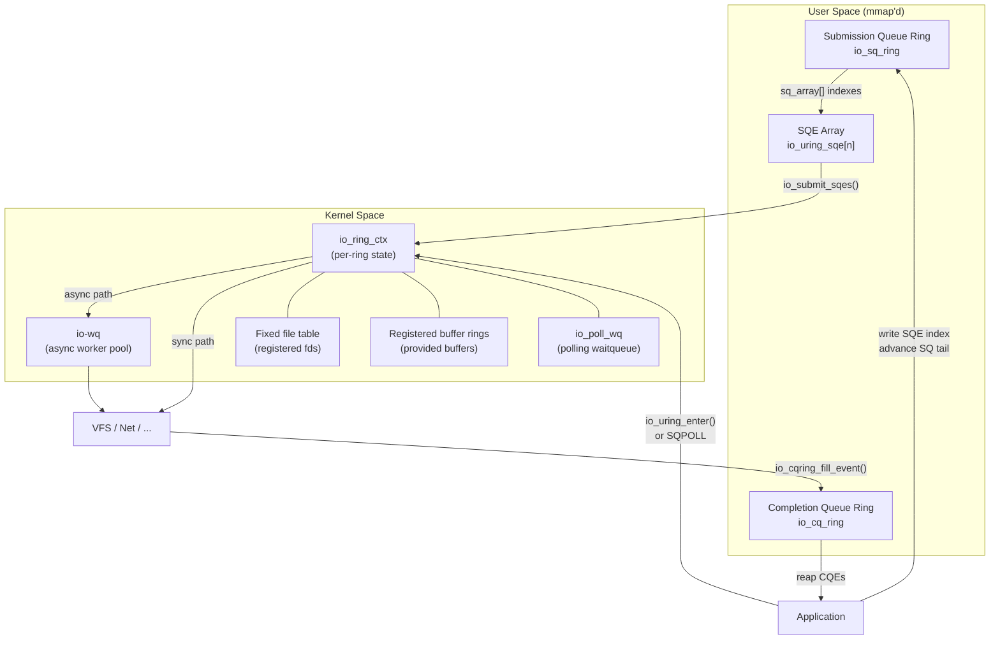
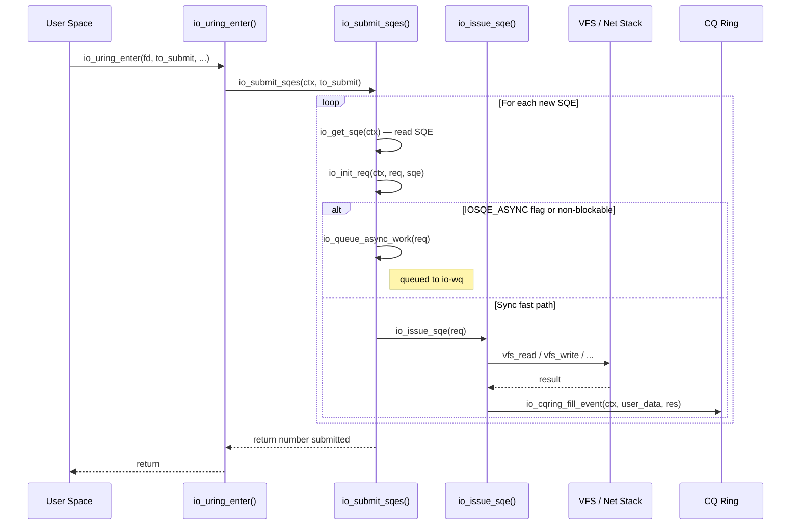
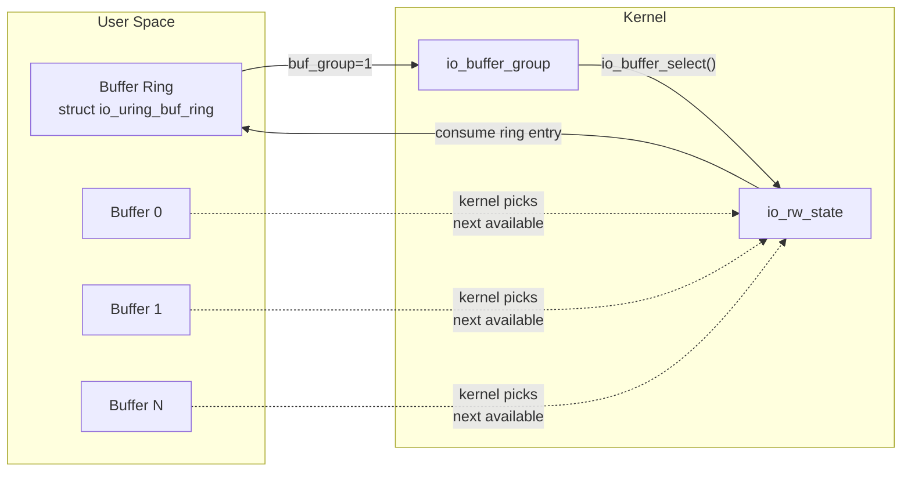

# io_uring — Asynchronous I/O Framework

## Introduction

`io_uring` is the Linux kernel's high-performance asynchronous I/O interface,
introduced in Linux 5.1 (2019) by Jens Axboe. It replaces the legacy POSIX AIO
(`libaio`) with a design that eliminates most system call overhead through
shared-memory ring buffers between user space and the kernel.

Where the sysprog-level page covers the **userspace API** (how to write programs
that use `io_uring`), this page focuses on the **kernel-internal implementation**:
data structures, the submission and completion paths, the worker thread model,
and the security considerations that have shaped its evolution.

## Core Architecture



### Ring Buffer Memory Layout

The key insight of `io_uring` is that the SQ and CQ rings are **mmap'd** into
user space, so submitting I/O and reaping completions requires no system calls
in the fast path. The kernel and user space communicate through **atomic head/tail
indices** using `smp_load_acquire()` / `smp_store_release()` semantics.

```text
┌─────────────────────────────────────────────────────┐
│                  mmap'd region                      │
├─────────────────────────────────────────────────────┤
│  SQ Ring Header                                     │
│    head (kernel writes, user reads)                 │
│    tail (user writes, kernel reads)                 │
│    ring_mask, ring_entries, flags                   │
│    array[] → indices into SQE array                 │
├─────────────────────────────────────────────────────┤
│  CQ Ring Header                                     │
│    head (user writes, kernel reads)                 │
│    tail (kernel writes, user reads)                 │
│    ring_mask, ring_entries, overflow                │
│    cqes[] → io_uring_cqe entries                    │
├─────────────────────────────────────────────────────┤
│  SQE Array                                          │
│    io_uring_sqe[0 .. entries-1]                     │
└─────────────────────────────────────────────────────┘
```

The SQ ring holds **indices** into a separate SQE array (not the SQEs
themselves). This indirection allows the kernel to batch-process SQEs and
reorder them internally without corrupting the user's submission order.

## Key Kernel Data Structures

### `struct io_ring_ctx`

The central per-ring object, allocated at `io_uring_setup()` time. It holds
all mutable state for a single io_uring instance.

```c
/* Simplified from io_uring/io_uring.c */
struct io_ring_ctx {
    struct {
        unsigned int        flags;
        unsigned int        compat: 1;
        unsigned int        account_mem: 1;
        unsigned int        cq_overflow_flushed: 1;
        /* ... many more bit flags ... */
    } ____cacheline_aligned_in_smp;

    /* Submission side */
    struct io_sq_ring      *sq_ring;
    struct io_uring_sqe    *sq_sqes;       /* SQE array */
    unsigned               cached_sq_head;
    unsigned               sq_entries;
    unsigned               sq_mask;

    /* Completion side */
    struct io_cq_ring      *cq_ring;
    struct io_uring_cqe    *cqes;          /* CQE array */
    unsigned               cached_cq_tail;
    unsigned               cq_entries;
    unsigned               cq_mask;

    /* Fixed resources */
    struct io_mapped_ubuf  **user_bufs;
    struct file            **file_table;
    unsigned               nr_user_files;
    unsigned               nr_user_bufs;

    /* Worker threads */
    struct io_wq           *io_wq;
    struct task_struct     *sqo_task;       /* SQPOLL thread */

    /* Limits and accounting */
    struct io_rsrc_data    *file_data;
    struct io_rsrc_data    *buf_data;
    struct user_struct     *user;
    const struct cred      *creds;

    /* Wait queues */
    wait_queue_head_t       poll_wq;
    wait_queue_head_t       cq_wait;
};
```

### `struct io_uring_sqe` (Submission Queue Entry)

Each SQE describes one I/O operation. At 64 bytes it fits a cache line pair.

```c
struct io_uring_sqe {
    __u8    opcode;          /* IORING_OP_* */
    __u8    flags;           /* IOSQE_* flags */
    __u16   ioprio;          /* I/O priority */
    __s32   fd;              /* file descriptor */
    union {
        __u64   off;         /* offset into file */
        __u64   addr2;
    };
    union {
        __u64   addr;        /* buffer address or iovec pointer */
        __u64   splice_off_in;
    };
    __u32   len;             /* buffer length or number of iovecs */
    union {
        __kernel_rwf_t  rw_flags;
        __u32           fsync_flags;
        __u16           poll_events;
        __u32           sync_range_flags;
        __u32           msg_flags;
        __u32           timeout_flags;
        __u32           accept_flags;
        __u32           cancel_flags;
        /* ... more op-specific flags ... */
    };
    __u64   user_data;       /* opaque data returned in CQE */
    union {
        __u16   buf_index;   /* registered buffer index */
        __u16   buf_group;   /* buffer group for provided buffers */
    };
    __u16   personality;     /* credentials override */
    union {
        __s32   splice_fd_in;
        __u32   file_index;  /* registered file index */
    };
    __u64   __pad2[2];
};
```

### `struct io_uring_cqe` (Completion Queue Entry)

```c
struct io_uring_cqe {
    __u64   user_data;   /* copied from the SQE */
    __s32   res;         /* result of the operation (bytes or -errno) */
    __u32   flags;       /* IORING_CQE_F_* flags */
};
```

The `user_data` field is the primary mechanism for correlating completions back
to submissions — the application stamps a unique identifier on each SQE and
the kernel echoes it in the CQE.

## Submission Path

When user space advances the SQ tail (or calls `io_uring_enter()`), the kernel
processes new SQEs through the following path:



### Batching and `io_submit_state`

To amortize per-SQE overhead, `io_submit_sqes()` uses an `io_submit_state`
structure to batch resource lookups:

```c
struct io_submit_state {
    struct blk_plug     plug;
    unsigned int        refs;
    struct io_wq_work_node  free_list;
    /* Preallocated requests */
    struct io_wq_work_node  comp_list;
};
```

The plug is submitted to the block layer at the end, allowing the I/O scheduler
to merge and reorder block requests — a significant performance win for
sequential I/O workloads.

### Operation Dispatch

Each `IORING_OP_*` opcode maps to an `io_issue_sqe` handler. The kernel
supports over 60 operations (as of Linux 6.8):

| Category | Operations |
|----------|-----------|
| **File I/O** | `READ`, `WRITE`, `READV`, `WRITEV`, `READ_FIXED`, `WRITE_FIXED`, `READV2`, `WRITEV2` |
| **Sync** | `FSYNC`, `FDATASYNC`, `SYNC_FILE_RANGE`, `FALLOCATE`, `FADVISE` |
| **Metadata** | `STATX`, `OPENAT`, `OPENAT2`, `CLOSE`, `RENAMEAT`, `UNLINKAT`, `MKDIRAT`, `LINKAT`, `SYMLINKAT` |
| **Network** | `ACCEPT`, `CONNECT`, `SEND`, `RECV`, `SENDMSG`, `RECVMSG`, `SEND_ZC`, `SHUTDOWN` |
| **Polling** | `POLL_ADD`, `POLL_REMOVE`, `POLL_UPDATE` |
| **Timeouts** | `TIMEOUT`, `TIMEOUT_REMOVE`, `LINK_TIMEOUT` |
| **Advanced** | `PROVIDE_BUFFERS`, `REMOVE_BUFFERS`, `SPLICE`, `TEE`, `EPOLL_CTL`, `URING_CMD` |

## Completion Path

Completions can arrive through two mechanisms:

### 1. Inline Completion (Sync Path)

When the operation completes immediately (e.g., buffered file I/O), the
completion is written directly to the CQ ring within the same `io_uring_enter()`
call.

### 2. Deferred Completion (Async Path)

For operations that block (unbuffered I/O, network), the kernel worker thread
(`io-wq`) completes the operation and calls `io_cqring_fill_event()` from
process context.

### CQE Overflow Handling

If the CQ ring is full when a completion arrives, the kernel sets
`IORING_SQ_CQ_OVERFLOW` in the SQ ring flags. Subsequent calls to
`io_uring_enter()` flush overflowed CQEs. Applications must monitor for this
condition.

### CQE Ordering

By default, CQEs arrive in **completion order**, not submission order. The
`IOSQE_IO_DRAIN` flag forces serial execution of operations, and
`IOSQE_IO_LINK` chains operations so that failure in one aborts the chain.

## SQPOLL Mode

When `IORING_SETUP_SQPOLL` is set, the kernel spawns a dedicated thread
(`ctx->sqo_task`) that continuously polls the SQ ring. This eliminates
`io_uring_enter()` entirely — the application never makes a system call
to submit I/O.

```text
Application                    Kernel SQPOLL Thread
    │                                │
    ├─ write SQE ─┐                  │
    │              │                  │
    ├─ store_release(sq.tail)        │
    │                                │
    │                          ┌─ load_acquire(sq.head) ──┐
    │                          │     head != tail?         │
    │                          │     yes → io_submit_sqes()│
    │                          │     no  → schedule()      │
    │                          └───────────────────────────┘
    │
    ├─ check CQ ring ── completion ready!
```

### SQ_AFF and CPU Pinning

`IORING_SETUP_SQ_AFF` pins the SQPOLL thread to `sq_thread_cpu`, which is
critical for latency-sensitive workloads to avoid cross-CPU cache bouncing.

### Idle Timeout

`sq_thread_idle` (in milliseconds) controls how long the SQPOLL thread waits
with no new submissions before going to sleep. Default is 1 second. Setting
this too low wastes CPU on thread wake/sleep cycles; setting it too high
wastes a CPU core when idle.

## io-wq — Async Worker Pool

For operations that cannot complete inline, `io_uring` uses an internal
worker pool called `io-wq`:

```c
struct io_wq {
    struct io_wq_hash       *hash;       /* work hash table */
    atomic_t                refs;
    struct io_wq_work_list  work_list;   /* pending work items */
    struct task_struct      *task;        /* manager thread */
    struct io_wqe           **wqes;      /* per-CPU worker queues */
    unsigned                nr_wqes;
};
```

Each CPU gets a `io_wqe` (worker queue entity) with bounded concurrency
controlled by `IORING_REGISTER_IOWQ_MAX_WORKERS`. The pool dynamically
scales between `min_workers` and `max_workers`.

### Hash-based Serialization

Operations on the same file descriptor are hashed to the same worker queue,
providing implicit ordering when `IOSQE_IO_DRAIN` is not needed but the
application expects sequential consistency.

## Provided Buffers (Buffer Rings)

`io_uring` supports pre-registered buffer pools to avoid per-operation
`get_user_pages()` overhead:



Applications register a buffer ring with `IORING_REGISTER_PBUF_RING`,
and operations with `IOSQE_BUFFER_SELECT` flag get the kernel to select
a buffer from the pool. The chosen buffer index is returned in the CQE
`flags >> IORING_CQE_BUFFER_SHIFT`.

## Registered Files and Buffers

### Fixed Files (`IORING_REGISTER_FILES`)

Registering file descriptors avoids repeated `fdget()` / `fdput()` overhead.
The kernel holds references to the files, and SQEs reference them by
`file_index` instead of an fd number.

```c
/* Register a set of files */
int io_uring_register(int fd, IORING_REGISTER_FILES,
                      int *fds, unsigned nr_fds);
```

### Registered Buffers (`IORING_REGISTER_BUFFERS`)

Pre-pinning user-space buffers with `get_user_pages()` avoids repeated
page fault overhead. SQEs reference them by `buf_index`.

## Ring Flags and Features

The `io_uring_params.features` field reports kernel capabilities:

| Feature Flag | Meaning |
|-------------|---------|
| `IORING_FEAT_SINGLE_MMAP` | SQ + CQ in single mmap region |
| `IORING_FEAT_NODROP` | kernel busy-loops instead of dropping CQEs |
| `IORING_FEAT_SUBMIT_STABLE` | SQEs don't need re-reading after submission |
| `IORING_FEAT_RW_CUR_POS` | read/write use current file position |
| `IORING_FEAT_CUR_PERSONALITY` | personality field is supported |
| `IORING_FEAT_FAST_POLL` | internal poll for async readiness |
| `IORING_FEAT_POLL_32BIT` | 32-bit poll events supported |
| `IORING_FEAT_SQPOLL_NONFIXED` | SQPOLL can use non-fixed files |
| `IORING_FEAT_EXT_ARG` | extended `io_uring_getevents_arg` |
| `IORING_FEAT_NATIVE_WORKERS` | kernel uses native workers |
| `IORING_FEAT_RSRC_TAGS` | resource tagging support |
| `IORING_FEAT_CQE_SKIP` | CQE can be skipped |
| `IORING_FEAT_LINKED_FILE` | linked file descriptors |

## Security Considerations

`io_uring` has been a significant source of kernel CVEs due to its deep
integration with VFS, networking, and memory management:

- **CVE-2021-3491**: `IORING_OP_BUFFER_SELECT` out-of-bounds access
- **CVE-2021-20226**: Use-after-free in `io_poll_remove_one()`
- **CVE-2022-29582**: `io_put_req()` reference counting error
- **CVE-2023-2598**: `io_uring` buffer mapping for non-regular files

### Seccomp Restrictions

Distributions (Ubuntu, ChromeOS) have blocked `io_uring` via seccomp
for unprivileged users due to its large attack surface. The kernel
introduced `io_uring_disabled` sysctl:

```bash
# Disable io_uring for unprivileged users
echo 2 > /proc/sys/kernel/io_uring_disabled
```

| Value | Effect |
|-------|--------|
| 0 | `io_uring` available to all |
| 1 | `io_uring` available only to `CAP_SYS_ADMIN` |
| 2 | `io_uring` fully disabled |

### io_uring and Namespaces

`io_uring` operations execute with the credentials of the creating task,
not the calling task, which has led to namespace escape vulnerabilities.
The `IORING_REGISTER_IOWQ_AFF` and personality fields were introduced
to mitigate some of these issues.

## Kernel Source Map

The `io_uring` implementation lives under `io_uring/` in the kernel tree:

| File | Purpose |
|------|---------|
| `io_uring/io_uring.c` | Core ring management, `io_uring_enter()`, CQE handling |
| `io_uring/io_uring-sqpoll.c` | SQPOLL thread implementation |
| `io_uring/io-wq.c` | `io-wq` async worker pool |
| `io_uring/io-wq-file.c` | File reference management for io-wq |
| `io_uring/opdef.c` | Operation definition table (opcode → handler mapping) |
| `io_uring/rsrc.c` | Resource registration (files, buffers) |
| `io_uring/napi.c` | NAPI integration for network operations |
| `io_uring/net.c` | Network operation implementations |
| `io_uring/fs.c` | Filesystem operation implementations |
| `io_uring/tctx.c` | Thread context management |
| `io_uring/notif.c` | Notification ring support |
| `io_uring/kbuf.c` | Kernel buffer management |
| `io_uring/timeout.c` | Timeout and timer operations |
| `io_uring/poll.c` | Polling implementation |
| `io_uring/cancel.c` | Request cancellation logic |
| `io_uring/register.c` | `io_uring_register()` syscall handlers |
| `io_uring/advise.c` | `IORING_OP_ADVISE` implementation |
| `io_uring/epoll.c` | `IORING_OP_EPOLL_CTL` |
| `io_uring/fdinfo.c` | `/proc/[pid]/fdinfo` reporting |

## `/proc` and `/sys` Interfaces

### `/proc/[pid]/fdinfo/[fd]`

Each `io_uring` file descriptor exposes its state:

```bash
$ cat /proc/self/fdinfo/3
IoUring:
    Flags:           0
    SqEntries:       256
    CqEntries:       512
    SqThreadCpu:     0
    SqThreadIdle:    1000
    Features:        15
    IoPollTimeout:   0
    SqArray:         0 1 2 3 ...
    SqHead:          0
    SqTail:          0
    CqHead:          0
    CqTail:          0
```

### `/proc/sys/kernel/io_uring_disabled`

Controls per-user `io_uring` access (see Security section above).

### `/proc/sys/kernel/io_uring_group`

On systems with `CONFIG_IO_URING`, limits `io_uring` to a specific group
(added in some distribution kernels).

## Performance Characteristics

### Why io_uring Outperforms Alternatives

| I/O Method | Syscalls per I/O | Memory Copies | Kernel Transitions |
|-----------|-------------------|---------------|-------------------|
| `read()/write()` | 1 per op | 1 (kernel ↔ user) | Full syscall |
| POSIX AIO | 1 submit + 1 wait | 1 | Full syscall × 2 |
| `io_uring` (basic) | 1 per batch | 0 (shared ring) | Minimized |
| `io_uring` (SQPOLL) | 0 | 0 | None in fast path |

### Benchmark Numbers

On a modern NVMe SSD with 4K random reads:

- `pread()` × 1: ~800K IOPS (limited by syscall overhead)
- `io_uring` batch-8: ~1.8M IOPS
- `io_uring` SQPOLL + fixed files: ~2.5M IOPS
- `io_uring` + `IORING_SETUP_SINGLE_ISSUER`: ~2.8M IOPS

*(Numbers are representative; actual performance depends on hardware and
kernel version.)*

## Example: Kernel Test Usage

The kernel's own test suite (`tools/testing/selftests/io_uring/`) exercises
the internal APIs. Here is a simplified example from the test infrastructure:

```c
/* From tools/testing/selftests/io_uring/ */
#include <liburing.h>

int main(void) {
    struct io_uring ring;
    struct io_uring_sqe *sqe;
    struct io_uring_cqe *cqe;
    char buf[4096];

    /* Setup ring with 64 entries */
    io_uring_queue_init(64, &ring, 0);

    /* Prepare a read operation */
    sqe = io_uring_get_sqe(&ring);
    io_uring_prep_read(sqe, fd, buf, sizeof(buf), 0);
    sqe->user_data = 42;  /* tag for completion matching */

    /* Submit and wait for one completion */
    io_uring_submit(&ring);
    io_uring_wait_cqe(&ring, &cqe);

    printf("Read returned: %d bytes (user_data=%llu)\n",
           cqe->res, (unsigned long long)cqe->user_data);
    io_uring_cqe_seen(&ring, cqe);

    io_uring_queue_exit(&ring);
    return 0;
}
```

## Version History

| Kernel | Key Changes |
|--------|-------------|
| 5.1 | Initial `io_uring` — `READ`, `WRITE`, `FSYNC`, `POLL` |
| 5.2 | `IORING_SETUP_SQPOLL`, network ops (`ACCEPT`, `CONNECT`, `SEND`, `RECV`) |
| 5.3 | Fixed files, registered buffers, `SPLICE`, `TEE` |
| 5.5 | `PROVIDE_BUFFERS`, `IORING_FEAT_FAST_POLL` |
| 5.6 | `io-wq` rework, `STATX`, `OPENAT`, `CLOSE` |
| 5.10 | `IORING_SETUP_SINGLE_ISSUER`, timeout improvements |
| 5.11 | `IORING_OP_URING_CMD` for passthrough commands |
| 5.13 | `IORING_OP_SPLICE` improvements, `BUFFER_SELECT` enhancements |
| 5.15 | Multishot `ACCEPT`, `PROVIDE_BUFFERS` ring |
| 5.19 | `IORING_SETUP_DEFER_TASKRUN`, `IORING_SETUP_SINGLE_ISSUER` improvements |
| 6.0 | `IORING_SETUP_TASKRUN_FLAG`, ring-mapped CQE flags |
| 6.1 | `IORING_REGISTER_IOWQ_AFF`, `IORING_OP_SEND_ZC` (zero-copy send) |
| 6.3 | `IORING_OP_SENDMSG_ZC`, waitid support |
| 6.7 | `IORING_SETUP_SINGLE_ISSUER` / `DEFER_TASKRUN` mandatory for unprivileged |
| 6.8 | `IORING_REGISTER_RESIZE_RINGS`, `io_uring_cmd_sock` for socket ops |

## Module Interaction

`io_uring` integrates with several kernel subsystems:

### Block Layer

When performing file I/O, `io_uring` goes through the VFS → file system →
block layer path. The `blk_plug` in `io_submit_state` batches block
requests for efficient I/O scheduling. With `IORING_OP_URING_CMD`,
applications can issue passthrough commands directly to NVMe or SCSI devices.

### Networking

Network operations (`SEND`, `RECV`, `CONNECT`, `ACCEPT`) integrate with
the socket layer. Zero-copy send (`IORING_OP_SEND_ZC`) uses msg_zerocopy
infrastructure to avoid copying data into kernel buffers, returning a
secondary CQE when the network stack releases the pages.

### Memory Management

`io_uring` uses `io_alloc_cache` for request allocation and
`io_buffer_list` for provided buffers. Memory accounting is tracked per-user
through `ctx->user->io_uring_bytes` to prevent unprivileged users from
consuming excessive kernel memory.

### Scheduler

The SQPOLL thread and io-wq workers participate in normal scheduling.\n`IORING_SETUP_SQ_AFF` allows pinning to specific CPUs. The
`IORING_REGISTER_IOWQ_AFF` operation lets users set CPU affinity for
io-wq workers.

## Troubleshooting

### Common Issues

**CQE overflow**: If the CQ ring fills up, the kernel sets
`IORING_SQ_CQ_OVERFLOW`. Monitor with:
```bash
cat /proc/[pid]/fdinfo/[uring_fd] | grep CqOverflow
```

**SQPOLL thread CPU usage**: Adjust `sq_thread_idle` to balance
responsiveness vs. CPU waste:
```bash
# Check if SQPOLL is running
ps -eLo pid,tid,comm | grep io_uring-sq
```

**io_uring_disabled**: If operations fail with `-EPERM`:
```bash
cat /proc/sys/kernel/io_uring_disabled
# 0=all, 1=privileged only, 2=disabled
```

## References


1. **io_uring source**: https://github.com/torvalds/linux/tree/master/io_uring
2. **io_uring design document**: https://kernel.dk/io_uring.pdf (Jens Axboe)
3. **Kernel documentation**: https://docs.kernel.org/userspace-api/io_uring.html
4. **LWN: A new API for asynchronous I/O**: https://lwn.net/Articles/776703/
5. **LWN: The rapid growth of io_uring**: https://lwn.net/Articles/810414/
6. **liburing userspace library**: https://github.com/axboe/liburing
7. **io_uring CVE tracking**: https://lore.kernel.org/io-uring/
