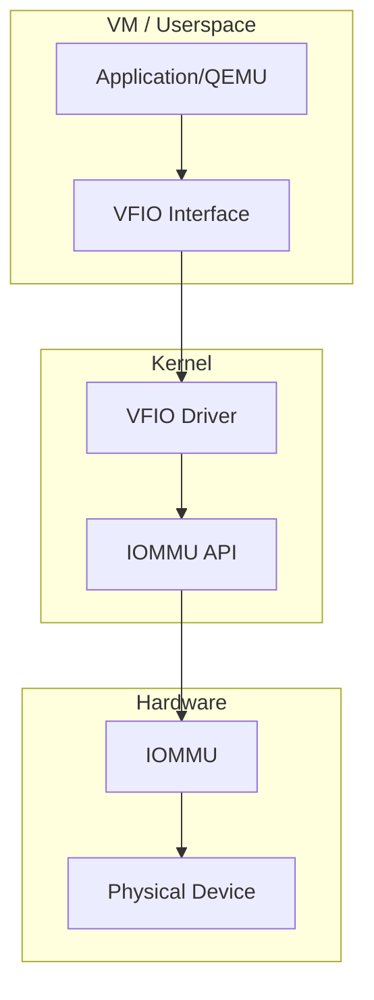

# I/O Memory Management Unit (IOMMU)

## Introduction

An I/O Memory Management Unit (IOMMU) is a hardware component that sits between peripheral devices and system memory, providing address translation and access control for DMA operations. Just as a CPU MMU translates virtual addresses to physical addresses for the processor, an IOMMU translates device-visible addresses to physical addresses for I/O devices.

IOMMUs provide several critical capabilities:
- **DMA remapping**: Devices can be given virtual address spaces, enabling safe DMA
- **Device isolation**: Prevent faulty or malicious devices from accessing arbitrary memory
- **DMA address translation**: Allow devices with limited addressing to access all of system memory
- **Interrupt remapping**: Route device interrupts through the IOMMU for isolation
- **Guest VM isolation**: Pass through physical devices to VMs with isolation

## IOMMU Hardware

### Intel VT-d

Intel's Virtualization Technology for Directed I/O (VT-d) is the most common x86 IOMMU:

```mermaid
graph TD
    subgraph "CPU"
        CPU[CPU Cores] --> MMU[CPU MMU]
    end
    subgraph "IOMMU (VT-d)"
        IOMMU[IOMMU Unit]
        DMAR[DMA Remapping Engine]
        IR[Interrupt Remapping Engine]
        TLB[IOTLB Cache]
    end
    subgraph "Devices"
        DEV1[PCIe Device 1]
        DEV2[PCIe Device 2]
        DEV3[PCIe Device 3]
    end
    subgraph "Memory"
        RAM[DRAM]
    end
    
    MMU --> RAM
    DEV1 --> IOMMU
    DEV2 --> IOMMU
    DEV3 --> IOMMU
    IOMMU --> DMAR
    IOMMU --> IR
    DMAR --> TLB
    TLB --> RAM
```

### AMD-Vi (AMD IOMMU)

AMD's IOMMU implementation provides similar capabilities to VT-d:
- DMA remapping with multi-level page tables
- Interrupt remapping
- Guest translation (nested IOMMU for VMs)

### ARM SMMU

ARM's System MMU (SMMU) provides IOMMU functionality for ARM platforms:
- SMMUv1/v2: Similar to VT-d with stage 1/2 translation
- SMMUv3: Supports HTTU (Hardware Translation Table Updates), PRI (Page Request Interface)

## IOMMU Page Tables

### Intel VT-d Page Table

VT-d uses a hierarchical page table similar to x86 CPU page tables:

```
Root Table (4 KiB, 256 entries)
  └── Context Table (4 KiB, 256 entries per bus)
      └── PASID Directory (optional)
      └── Page Table (4-level, same format as CPU)
          ├── PML4 → PDPE → PDE → PTE
          └── Supports 4 KiB, 2 MiB, 1 GiB pages
```

```c
/* VT-d page table entry format */
#define VTD_PAGE_PRESENT    (1ULL << 0)
#define VTD_PAGE_RW         (1ULL << 1)
#define VTD_PAGE_US         (1ULL << 2)   /* user/supervisor */
#define VTD_PAGE_AW         (1ULL << 9)   /* accessed/write-through */
#define VTD_PAGE_SNP        (1ULL << 11)  /* snoop control */

/* 2 MiB large page */
#define VTD_PAGE_SIZE       (1ULL << 7)   /* PS bit for large pages */

/* Context table entry */
struct context_entry {
    u64 lo;  /* lower: present, type, AW, DID, ASR (page table root) */
    u64 hi;  /* upper: reserved */
};

/* Root table entry */
struct root_entry {
    u64 lo;  /* present, context table pointer */
    u64 hi;
};
```

## Linux IOMMU Subsystem

### IOMMU API

The Linux IOMMU subsystem provides a generic API for device drivers and subsystems (VFIO, KVM):

```c
#include <linux/iommu.h>

/* Check if device has IOMMU */
struct iommu_domain *domain;

/* Allocate an IOMMU domain */
domain = iommu_domain_alloc(&platform_bus_type);
if (!domain)
    return -ENODEV;

/* Attach device to domain */
int ret = iommu_attach_device(domain, dev);
if (ret)
    goto err_free;

/* Map IOVA to physical address */
ret = iommu_map(domain, iova, paddr, size, IOMMU_READ | IOMMU_WRITE);
if (ret)
    goto err_detach;

/* Unmap */
size_t unmapped = iommu_unmap(domain, iova, size);

/* Translate IOVA to physical */
phys_addr_t pa;
ret = iommu_iova_to_phys(domain, iova);

/* Set DMA mask for device through IOMMU */
iommu_set_dma_mask(dev, DMA_BIT_MASK(64));

/* Check IOMMU capabilities */
bool can_map = iommu_present(&platform_bus_type);

/* Cleanup */
iommu_detach_device(domain, dev);
iommu_domain_free(domain);
```

### IOMMU Domain Types

```c
enum iommu_domain_type {
    IOMMU_DOMAIN_BLOCKED  = 0,  /* All DMA blocked */
    IOMMU_DOMAIN_IDENTITY = 1,  /* 1:1 passthrough mapping */
    IOMMU_DOMAIN_UNMANAGED = 2, /* Kernel-managed, used by VFIO */
    IOMMU_DOMAIN_DMA      = 3,  /* For DMA API integration */
    IOMMU_DOMAIN_DMA_FQ   = 4,  /* DMA with fault queue */
};
```

### DMA-IOMMU Integration

The DMA API transparently uses the IOMMU when present:

```c
/* The DMA API works transparently with IOMMU */
dma_addr_t dma = dma_map_single(dev, buf, size, DMA_TO_DEVICE);

/* Under the hood:
 * 1. Allocate IOVA from device's IOMMU domain
 * 2. Map IOVA → physical address in IOMMU page table
 * 3. Return IOVA as DMA address
 * 4. Device accesses IOVA, IOMMU translates to physical
 */

/* Direct DMA bypass (for devices behind IOMMU with identity mapping) */
dma_addr_t dma = dma_direct_map_page(dev, page, offset, size, dir, attrs);

/* Bypass IOMMU entirely */
dma_set_mask(dev, DMA_BIT_MASK(64));  /* If device can address all memory */
```

### IOMMU Groups

Devices are organized into IOMMU groups based on isolation:

```c
/* Get IOMMU group for a device */
struct iommu_group *group = iommu_group_get(dev);
if (group) {
    int id = iommu_group_id(group);
    /* All devices in the same group share IOMMU isolation */
    iommu_group_put(group);
}
```

```bash
# List IOMMU groups
ls /sys/kernel/iommu_groups/
# 0  1  2  3  4  5  ...

# Show devices in a group
ls /sys/kernel/iommu_groups/0/devices/
# 0000:00:02.0

# Show all groups and their devices
for g in /sys/kernel/iommu_groups/*; do
    echo "Group $(basename $g):"
    ls $g/devices/
done
# Group 0:
# 0000:00:02.0    # GPU
# Group 1:
# 0000:00:14.0    # USB
# Group 2:
# 0000:00:1f.6    # Network
```

## IOMMU Fault Handling

### Fault Reporting

```c
/* Register fault handler */
static int my_fault_handler(struct iommu_fault *fault, void *data)
{
    struct device *dev = data;
    
    switch (fault->type) {
    case IOMMU_FAULT_DMA_UNMAP:
        pr_err("IOMMU fault: unmapped IOVA 0x%llx\n",
               fault->event.addr);
        break;
    case IOMMU_FAULT_PAGE_REQ:
        pr_info("IOMMU page request: IOVA 0x%llx, flags 0x%x\n",
                fault->prm.addr, fault->prm.flags);
        /* Handle page request (for SVM/PRQ) */
        break;
    }
    
    return IOMMU_FAULT_HANDLED;
}

/* Install fault handler */
struct iommu_fault_param *fparam;
fparam = dev_iommu_fault_param_alloc(dev);
fparam->handler = my_fault_handler;
fparam->data = dev;
```

### Fault Debugging

```bash
# Enable IOMMU fault reporting
echo 1 > /sys/kernel/debug/iommu/intel/fault_log

# View IOMMU faults in dmesg
dmesg | grep -i iommu
# [  123.456789] DMAR: DRHD: handling fault status reg 2
# [  123.456790] DMAR: [DMA Read] Request device [00:1f.6] fault addr 0x12345000
# [  123.456791] DMAR: [DMA Read] Process 0 (swapper/0) fault reason 0x6
# [  123.456792] DMAR: [DMA Read] PASID 0x0

# Check IOMMU interrupt remapping
dmesg | grep -i "interrupt remapping"
# [    0.123456] DMAR: Host address width 39
# [    0.123457] DMAR: DRHD base: 0x000000fed90000 flags: 0x0
# [    0.123458] DMAR: dmar0: reg_base_addr fed90000 ver 1:0 cap ... ecap ...
# [    0.123459] DMAR: Interrupt remapping enabled
```

## Device Passthrough (VFIO)

VFIO (Virtual Function I/O) uses the IOMMU to safely pass physical devices to userspace or virtual machines:



### VFIO Usage

```bash
# Enable IOMMU (kernel command line)
# Intel: intel_iommu=on
# AMD: amd_iommu=on
# ARM: iommu.passthrough=0

# Load VFIO modules
modprobe vfio
modprobe vfio_iommu_type1
modprobe vfio_pci

# Bind device to vfio-pci
echo "8086 15b8" > /sys/bus/pci/drivers/vfio-pci/new_id
echo "0000:03:00.0" > /sys/bus/pci/devices/0000:03:00.0/driver/unbind
echo "0000:03:00.0" > /sys/bus/pci/drivers/vfio-pci/bind

# View VFIO group
ls /dev/vfio/
# 1  2  vfio

# QEMU with device passthrough
qemu-system-x86_64 \
    -device vfio-pci,host=03:00.0 \
    -m 4G -smp 4 \
    -drive file=vm.qcow2

# Using libvirt/virsh
virsh nodedev-detach pci_0000_03_00_0
virsh attach-device vm1 vfio-device.xml
```

## IOMMU and DMA API

### Bypassing IOMMU

```bash
# Disable IOMMU (not recommended)
# Kernel command line: intel_iommu=off
# or: iommu=off

# Passthrough mode (identity mapping)
# Kernel command line: intel_iommu=on,igfx_off iommu=pt
# or: iommu.passthrough=1

# Check IOMMU status
dmesg | grep -i iommu
# [    0.000000] DMAR: IOMMU enabled
# [    0.123456] DMAR: Intel(R) Virtualization Technology for Directed I/O

# Check if device is behind IOMMU
lspci -vvv -s 03:00.0 | grep -i iommu
```

### SWIOTLB (Software IO TLB)

When no IOMMU is present and a device has a limited DMA mask, Linux uses SWIOTLB (bounce buffers):

```c
/* SWIOTLB provides bounce buffers for devices that can't address all memory */
/* Transparently used by the DMA API */

/* Check if SWIOTLB is active */
bool swiotlb_active = is_swiotlb_active();

/* Kernel command line */
// swiotlb=<size>   Set bounce buffer size (in KiB)
// swiotlb=noforce   Don't force SWIOTLB usage
```

```bash
# Check SWIOTLB status
dmesg | grep -i swiotlb
# [    0.000000] software IO TLB: mapped [mem 0x000000007d700000-0x000000007db00000] (64MB)

# Check bounce buffer usage
cat /proc/vmstat | grep bounce
# nr_bounce 1234
```

## Nested IOMMU (for VMs)

For guest VMs with device passthrough, the IOMMU supports two-stage translation:

```
Guest IOVA → Guest Physical (Stage 1, guest-controlled)
Guest Physical → Host Physical (Stage 2, host-controlled)
```

```c
/* Set up nested IOMMU domain for VM */
struct iommu_domain *s2_domain;
s2_domain = iommu_domain_alloc(&pci_bus_type);

/* Stage 2 domain type for nested translation */
s2_domain->type = IOMMU_DOMAIN_NESTED;

/* Attach device */
iommu_attach_device(s2_domain, dev);

/* Guest can set up its own Stage 1 page tables */
/* The IOMMU hardware combines Stage 1 + Stage 2 translations */
```

## Debugging IOMMU

```bash
# Check if IOMMU is enabled
dmesg | grep -i iommu
# [    0.123456] DMAR: Intel(R) Virtualization Technology for Directed I/O
# [    0.123457] DMAR: Host address width 39
# [    0.123458] DMAR: IOMMU enabled

# View IOMMU groups
for g in /sys/kernel/iommu_groups/*; do
    devs=$(ls $g/devices/ | tr '\n' ' ')
    echo "Group $(basename $g): $devs"
done

# View IOMMU domains
ls /sys/kernel/iommu_groups/0/

# Check interrupt remapping
cat /proc/interrupts | head
# Check for IRTE-based routing

# IOMMU fault monitoring
echo 1 > /sys/kernel/debug/iommu/intel/fault_log 2>/dev/null
journalctl -f | grep -i iommu

# View DMA mappings
cat /sys/kernel/debug/dma-mapping

# View IOTLB hit/miss statistics
cat /sys/kernel/debug/iommu/intel/iommu0/iotlb_stats 2>/dev/null

# Check device capabilities
lspci -vvv | grep -A5 "IOMMU\|ACS\|ATS\|PRI"
```

## References

- [Intel VT-d Specification](https://www.intel.com/content/www/us/en/developer/articles/technical/intel-sdm.html)
- [AMD IOMMU Specification](https://www.amd.com/en/support/tech-docs)
- [Linux IOMMU Documentation](https://www.kernel.org/doc/html/latest/driver-api/iommu.html)
- [VFIO Documentation](https://www.kernel.org/doc/html/latest/driver-api/vfio.html)
- [LWN: IOMMU groups and VFIO](https://lwn.net/Articles/473906/)
- [LWN: The IOMMU API](https://lwn.net/Articles/253064/)
- [ARM SMMU Specification](https://developer.arm.com/documentation/ihi0070/latest)

## Related Topics

- [PCI Subsystem](./pci.md) — PCI device discovery and resource allocation
- [DMA](./dma.md) — Direct Memory Access and DMA API
- [Virtualization](./virtualization.md) — KVM and device passthrough
- [Security](./security.md) — IOMMU for device isolation
