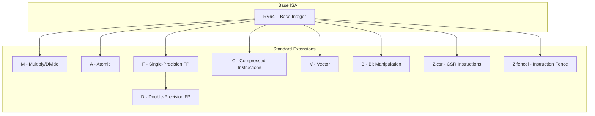
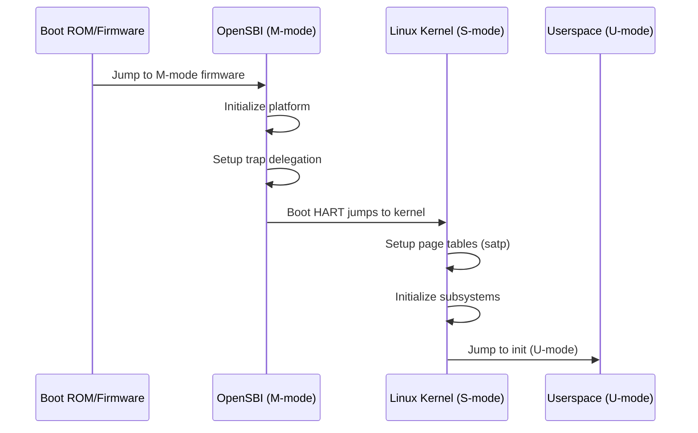
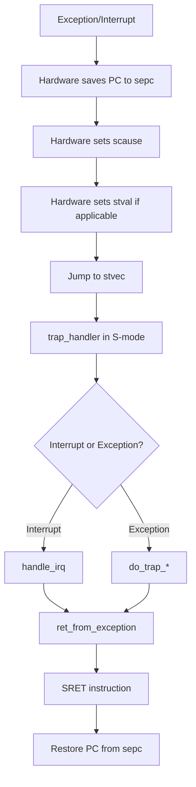

# RISC-V Architecture

## Introduction

RISC-V is an open-source instruction set architecture (ISA) based on established reduced instruction set computer (RISC) principles. Unlike proprietary ISAs (x86, ARM, MIPS), RISC-V is freely available for anyone to use, modify, and implement without licensing fees. Originally developed at UC Berkeley in 2010, RISC-V has grown into a global ecosystem with implementations ranging from tiny microcontrollers to high-performance server processors.

Linux support for RISC-V was merged in kernel 4.15 (2018), and the architecture has rapidly matured. RISC-V is notable for its modular ISA design — a base integer ISA (RV32I or RV64I) is extended by standard extensions (M, A, F, D, C, V, etc.), allowing implementers to choose exactly which features their hardware supports.

## RISC-V ISA Overview

### Base Integer ISAs

| ISA | Description | Register Width | Address Space |
|-----|-------------|---------------|---------------|
| **RV32I** | Base 32-bit integer | 32-bit | 32-bit (4 GiB) |
| **RV32E** | Embedded 32-bit (16 registers) | 32-bit | 32-bit |
| **RV64I** | Base 64-bit integer | 64-bit | 64-bit |
| **RV128I** | Base 128-bit integer | 128-bit | 128-bit (future) |

### Standard Extensions



### Naming Convention

The RISC-V ISA string naming convention describes the supported extensions:

```
rv64imafdc     = RV64 base + Integer + Multiply + Atomics + Float + Double + Compressed
rv64gcv        = RV64 G (IMAFD) + Compressed + Vector
rv64imafdc_zba_zbb_zbc_zbs = RV64G + C + Bitmanip extensions
```

Common profiles:
- **RV64GCV**: Linux application processor with vector extension
- **RV32IMAC**: Embedded microcontroller
- **RV64IMAFDC**: General-purpose Linux system (equivalent to "RV64GC")

## Registers

### Integer Registers

RISC-V has 32 general-purpose integer registers (x0-x31) with ABI names:

| Register | ABI Name | Description | Saved By |
|----------|----------|-------------|----------|
| x0 | zero | Hardwired zero | — |
| x1 | ra | Return address | Caller |
| x2 | sp | Stack pointer | Callee |
| x3 | gp | Global pointer | — |
| x4 | tp | Thread pointer | — |
| x5-x7 | t0-t2 | Temporaries | Caller |
| x8 | s0/fp | Saved/frame pointer | Callee |
| x9 | s1 | Saved register | Callee |
| x10-x17 | a0-a7 | Function arguments/return | Caller |
| x18-x27 | s2-s11 | Saved registers | Callee |
| x28-x31 | t3-t6 | Temporaries | Caller |

### Floating-Point Registers

32 floating-point registers (f0-f31):

| Register | ABI Name | Description |
|----------|----------|-------------|
| f0-f7 | ft0-ft7 | FP temporaries |
| f8-f9 | fs0-fs1 | FP saved |
| f10-f17 | fa0-fa7 | FP arguments/return |
| f18-f27 | fs2-fs11 | FP saved |
| f28-f31 | ft8-ft11 | FP temporaries |

### Control and Status Registers (CSRs)

```c
/* Key CSRs used by Linux */
#define CSR_SSTATUS    0x100   /* Supervisor status */
#define CSR_SIE        0x104   /* Supervisor interrupt enable */
#define CSR_STVEC      0x105   /* Supervisor trap vector base */
#define CSR_SSCRATCH   0x140   /* Supervisor scratch register */
#define CSR_SEPC       0x141   /* Supervisor exception program counter */
#define CSR_SCAUSE     0x142   /* Supervisor cause of trap */
#define CSR_STVAL      0x143   /* Supervisor trap value */
#define CSR_SIP        0x144   /* Supervisor interrupt pending */
#define CSR_SATP       0x180   /* Supervisor address translation */
#define CSR_TIME       0xC01   /* Timer counter */
#define CSR_CYCLE      0xC00   /* Cycle counter */
#define CSR_MHARTID    0xF14   /* Hardware thread ID (machine-mode) */

/* sstatus bits */
#define SSTATUS_SIE    (1UL << 1)   /* Supervisor interrupt enable */
#define SSTATUS_SPIE   (1UL << 5)   /* Previous SIE */
#define SSTATUS_SPP    (1UL << 8)   /* Previous privilege (0=U, 1=S) */
#define SSTATUS_FS     (3UL << 13)  /* FP unit status */
#define SSTATUS_SUM    (1UL << 18)  /* Permit user memory access */
#define SSTATUS_MXR    (1UL << 19)  /* Make executable readable */
```

## Boot Process



RISC-V defines three privilege modes:
- **Machine mode (M-mode)**: Highest privilege, firmware level
- **Supervisor mode (S-mode)**: OS kernel
- **User mode (U-mode)**: Applications

Linux runs in S-mode. The firmware (typically OpenSBI) runs in M-mode and provides the SBI (Supervisor Binary Interface) to the kernel.

### Early Boot (head.S)

```asm
/* arch/riscv/kernel/head.S — simplified */
SYM_CODE_START(_start)
    /* Disable interrupts */
    csrw sie, zero
    csrw sip, zero
    
    /* Save boot arguments: a0 = hartid, a1 = dtb */
    mv s0, a0
    mv s1, a1
    
    /* Clear BSS */
    la a0, __bss_start
    la a1, __bss_stop
1:  sd zero, (a0)
    addi a0, a0, 8
    blt a0, a1, 1b
    
    /* Setup initial stack */
    la sp, init_thread_union
    li t0, THREAD_SIZE
    add sp, sp, t0
    
    /* Call start_kernel */
    mv a0, s0          /* hartid */
    mv a1, s1          /* dtb pointer */
    call start_kernel
SYM_CODE_END(_start)
```

### SBI (Supervisor Binary Interface)

```c
/* SBI calls from Linux to firmware */
struct sbiret sbi_ecall(int ext, int fid,
                        unsigned long arg0, unsigned long arg1,
                        unsigned long arg2, unsigned long arg3,
                        unsigned long arg4, unsigned long arg5);

/* Standard SBI extensions */
#define SBI_EXT_TIME        0x54494D45  /* "TIME" */
#define SBI_EXT_IPI         0x735049   /* "sPI" */
#define SBI_EXT_RFENCE      0x52464E43 /* "RFNC" */
#define SBI_EXT_HSM         0x48534D   /* "HSM" */
#define SBI_EXT_SRST        0x53525354 /* "SRST" */
#define SBI_EXT_DBCN        0x4442434E /* "DBCN" */

/* Timer extension */
void sbi_set_timer(uint64_t stime_value);

/* Console extension (for early printk) */
void sbi_console_putchar(int ch);

/* HSM (Hart State Management) */
int sbi_hart_start(unsigned long hartid, unsigned long entry,
                    unsigned long priv);
int sbi_hart_stop(void);
```

## Memory Management

### Page Table Format

RISC-V uses a radix tree page table (similar to a trie). The Sv39/Sv48/Sv57 formats use 39/48/57-bit virtual addresses with 4 KiB pages:

```
Sv39 (3-level, 39-bit VA):
  ┌─────┬─────┬─────┬───────────┐
  │VPN[2]│VPN[1]│VPN[0]│  Offset  │  (9+9+9+12 = 39 bits)
  └─────┴─────┴─────┴───────────┘

Sv48 (4-level, 48-bit VA):
  ┌─────┬─────┬─────┬─────┬───────────┐
  │VPN[3]│VPN[2]│VPN[1]│VPN[0]│  Offset  │  (9+9+9+9+12 = 48 bits)
  └─────┴─────┴─────┴─────┴───────────┘
```

### Page Table Entry (PTE)

```c
/* PTE format (Sv39/Sv48/Sv57) */
#define _PAGE_PRESENT   (1UL << 0)  /* Valid */
#define _PAGE_READ      (1UL << 1)  /* Readable */
#define _PAGE_WRITE     (1UL << 2)  /* Writable */
#define _PAGE_EXEC      (1UL << 3)  /* Executable */
#define _PAGE_USER      (1UL << 4)  /* User accessible */
#define _PAGE_GLOBAL    (1UL << 5)  /* Global mapping */
#define _PAGE_ACCESSED  (1UL << 6)  /* Accessed (hardware set) */
#define _PAGE_DIRTY     (1UL << 7)  /* Dirty (hardware set) */
#define _PAGE_SOFT      (3UL << 8)  /* Software bits */

/* Combined permission bits */
#define _PAGE_READ      (1UL << 1)
#define _PAGE_WRITE     (1UL << 2)
#define _PAGE_EXEC      (1UL << 3)

#define _PAGE_KERNEL     (_PAGE_READ | _PAGE_WRITE | _PAGE_EXEC | _PAGE_ACCESSED | _PAGE_DIRTY)
#define _PAGE_KERNEL_RO  (_PAGE_READ | _PAGE_EXEC | _PAGE_ACCESSED)
#define _PAGE_IO         (_PAGE_READ | _PAGE_WRITE | _PAGE_ACCESSED | _PAGE_DIRTY)
```

### SATP Register

The `satp` (Supervisor Address Translation and Protection) register controls address translation:

```c
/* satp format (RV64) */
#define SATP_MODE_BARE  0UL  /* No translation */
#define SATP_MODE_SV39  8UL  /* Sv39 (3-level) */
#define SATP_MODE_SV48  9UL  /* Sv48 (4-level) */
#define SATP_MODE_SV57  10UL /* Sv57 (5-level) */

/* satp = (mode << 60) | (ASID << 44) | PPN_of_root_page_table */
static inline void csr_write(unsigned long csr, unsigned long val)
{
    __asm__ __volatile__("csrw %0, %1" :: "i"(csr), "r"(val));
}

void riscv_set_satp(unsigned long satp)
{
    csr_write(CSR_SATP, satp);
}
```

### TLB Management

RISC-V does not have hardware TLB shootdown for multiprocessor systems. The kernel must issue SFENCE.VMA instructions:

```asm
/* Flush all TLB entries */
sfence.vma

/* Flush single page */
sfence.vma rs1       /* flush VA in rs1, all ASIDs */
sfence.vma rs1, rs2  /* flush VA in rs1, ASID in rs2 */

/* Flush all (remote TLB shootdown via SBI RFENCE) */
/* Linux uses IPIs + SFENCE.VMA for remote flush */
```

```c
/* In arch/riscv/include/asm/tlbflush.h */
static inline void local_flush_tlb_all(void)
{
    __asm__ __volatile__("sfence.vma" ::: "memory");
}

static inline void local_flush_tlb_page(unsigned long addr)
{
    __asm__ __volatile__("sfence.vma %0" :: "r"(addr) : "memory");
}

/* Remote TLB flush uses SBI RFENCE extension */
void flush_tlb_all(void)
{
    local_flush_tlb_all();
    sbi_remote_sfence_vma(NULL, 0, -1UL);
}
```

## Interrupt and Exception Handling

### Privilege Modes and Trap Flow



### Trap Registers

```c
/* scause values */
#define EXC_INST_MISALIGNED    0
#define EXC_INST_ACCESS        1
#define EXC_INST_ILLEGAL       2
#define EXC_BREAKPOINT         3
#define EXC_LOAD_MISALIGNED    4
#define EXC_LOAD_ACCESS        5
#define EXC_STORE_MISALIGNED   6
#define EXC_STORE_ACCESS       7
#define EXC_SYSCALL            8   /* U-mode syscall */
#define EXC_HYPERVISOR_SYSCALL 9
#define EXC_SUPERVISOR_SYSCALL 10  /* S-mode syscall (ecall) */

/* Interrupt causes (scause with bit 63 set) */
#define IRQ_S_SOFT     1    /* Supervisor software interrupt */
#define IRQ_S_TIMER    5    /* Supervisor timer interrupt */
#define IRQ_S_EXT      9    /* Supervisor external interrupt */
#define IRQ_S_GEXT     12   /* Supervisor guest external interrupt */

#define CAUSE_IRQ_FLAG (1UL << 63)  /* Interrupt flag in scause */
```

### Trap Entry

```asm
/* arch/riscv/kernel/entry.S — simplified */
SYM_CODE_START(handle_exception)
    /* Save context to kernel stack */
    save_from_user_to_kernel
    
    /* Read cause and value */
    csrr s0, scause
    csrr s1, stval
    csrr s2, sepc
    
    /* Call C handler */
    move a0, sp        /* pt_regs pointer */
    mv a1, s0          /* scause */
    mv a2, s1          /* stval */
    call do_trap
    
    /* Return to interrupted context */
    restore_from_kernel_to_user
    sret
SYM_CODE_END(handle_exception)
```

## Interrupt Controller

RISC-V uses the **PLIC** (Platform-Level Interrupt Controller) for external interrupts and **ACLINT** (Advanced Core-Local Interruptor) for timer and software interrupts:

### PLIC

```c
/* PLIC register layout (MMIO) */
#define PLIC_BASE           0x0C000000
#define PLIC_PRIORITY       (PLIC_BASE + 0x0)
#define PLIC_PENDING        (PLIC_BASE + 0x1000)
#define PLIC_ENABLE(hart)   (PLIC_BASE + 0x2000 + (hart) * 0x80)
#define PLIC_THRESHOLD(hart) (PLIC_BASE + 0x200000 + (hart) * 0x1000)
#define PLIC_CLAIM(hart)    (PLIC_BASE + 0x200004 + (hart) * 0x1000)

/* PLIC in device tree */
// plic: interrupt-controller@c000000 {
//     compatible = "riscv,plic0";
//     #interrupt-cells = <1>;
//     interrupt-controller;
//     reg = <0x0 0xc000000 0x0 0x4000000>;
//     interrupts-extended = <&cpu0_intc 11>, <&cpu0_intc 9>,
//                           <&cpu1_intc 11>, <&cpu1_intc 9>;
// };
```

### ACLINT (Timer and Software Interrupts)

```c
/* ACLINT timer — set timer via SBI or MMIO */
void set_next_timer_event(unsigned long delta)
{
    unsigned long next = get_cycles64() + delta;
    
    /* Modern: write to ACLINT timer MMIO */
    writel_relaxed(next & 0xFFFFFFFF, clint_base + CLINT_MTIMECMP);
    writel_relaxed(next >> 32, clint_base + CLINT_MTIMECMP + 4);
    
    /* Legacy: use SBI */
    // sbi_set_timer(next);
}

/* ACLINT software interrupt (IPI) */
void send_ipi(const struct cpumask *cpu_mask)
{
    /* Modern: write to ACLINT SSWI MMIO */
    for_each_cpu(cpu, cpu_mask)
        writel_relaxed(1, sswi_base + cpu * 4);
    
    /* Legacy: use SBI */
    // sbi_send_ipi(cpumask_bits(cpu_mask));
}
```

## SMP (Symmetric Multiprocessing)

### Hart Discovery

RISC-V CPUs are called "harts" (hardware threads). They are discovered via device tree:

```dts
cpus {
    #address-cells = <2>;
    #size-cells = <0>;
    
    cpu0: cpu@0 {
        device_type = "cpu";
        compatible = "riscv";
        reg = <0x0 0x0>;           /* hartid */
        riscv,isa = "rv64imafdc";
        cpu0_intc: interrupt-controller {
            #interrupt-cells = <1>;
            interrupt-controller;
            compatible = "riscv,cpu-intc";
        };
    };
    
    cpu1: cpu@1 {
        device_type = "cpu";
        compatible = "riscv";
        reg = <0x0 0x1>;           /* hartid */
        riscv,isa = "rv64imafdc";
        cpu1_intc: interrupt-controller {
            #interrupt-cells = <1>;
            interrupt-controller;
            compatible = "riscv,cpu-intc";
        };
    };
};
```

### SMP Boot

```c
/* Secondary CPU boot — simplified */
void secondary_start_kernel(void)
{
    struct task_struct *task = current;
    
    /* Setup trap vector */
    csr_write(CSR_STVEC, (unsigned long)handle_exception);
    
    /* Setup page table (same as primary) */
    csr_write(CSR_SATP, (unsigned long)satp_mode << 60 |
                         PFN_DOWN(__pa_symbol(swapper_pg_dir)));
    local_flush_tlb_all();
    
    /* Enable interrupts */
    csr_set(CSR_SSTATUS, SSTATUS_SIE);
    
    /* Announce CPU online */
    set_cpu_online(smp_processor_id(), true);
    
    /* Enter idle loop */
    cpu_startup_entry(CPUHP_AP_ONLINE_IDLE);
}

/* Calling secondary CPU via SBI HSM */
sbi_hart_start(hartid, __pa_symbol(secondary_start_kernel),
               task_stack_page(task));
```

## Vector Extension (RVV)

The RISC-V Vector extension provides SIMD capabilities:

```c
/* Vector configuration */
void configure_vector(void)
{
    unsigned long vl, vtype;
    
    /* Set vector length for 32-bit integers */
    __asm__ __volatile__(
        "vsetvli %0, %1, e32, m1, ta, ma"
        : "=r"(vl)
        : "r"(128)  /* requested VL */
    );
    /* vl = actual VL (may be <= requested) */
}

/* Vector add example */
void vector_add(float *a, float *b, float *c, int n)
{
    size_t vl;
    for (int i = 0; i < n; i += vl) {
        vl = __riscv_vsetvl_e32m8(n - i);
        vfloat32m8_t va = __riscv_vle32_v_f32m8(a + i, vl);
        vfloat32m8_t vb = __riscv_vle32_v_f32m8(b + i, vl);
        vfloat32m8_t vc = __riscv_vfadd_vv_f32m8(va, vb, vl);
        __riscv_vse32_v_f32m8(c + i, vc, vl);
    }
}
```

## SBI Runtime Services

### SBI Debug Console (DBCN)

```c
/* Early console output via SBI */
static void sbi_console_putchar(int ch)
{
    sbi_ecall(SBI_EXT_DBCN, SBI_EXT_DBCN_CONSOLE_PUTCHAR,
              ch, 0, 0, 0, 0, 0);
}

/* Buffer output */
static void sbi_console_write(const char *buf, size_t len)
{
    /* Use SBI DBCN write string for efficiency */
    sbi_ecall(SBI_EXT_DBCN, SBI_EXT_DBCN_CONSOLE_WRITE,
              len, __pa(buf), 0, 0, 0, 0);
}
```

### System Reset

```c
/* System reset via SBI SRST extension */
void sbi_system_reset(unsigned long type, unsigned long reason)
{
    sbi_ecall(SBI_EXT_SRST, SBI_EXT_SRST_RESET,
              type, reason, 0, 0, 0, 0);
    unreachable();
}

#define SBI_SRST_RESET_TYPE_SHUTDOWN  0
#define SBI_SRST_RESET_TYPE_COLD_REBOOT 1
```

## Kernel Development

### Defconfig and Build

```bash
# RISC-V defconfigs
make defconfig                    # Default (RV64)
make rv32_defconfig               # RV32

# Build
export ARCH=riscv
export CROSS_COMPILE=riscv64-linux-gnu-
make -j$(nproc)

# QEMU emulation
qemu-system-riscv64 \
    -machine virt \
    -m 2G \
    -smp 4 \
    -kernel arch/riscv/boot/Image \
    -drive file=rootfs.ext4,format=raw \
    -append "root=/dev/vda rw console=ttyS0" \
    -nographic
```

### QEMU RISC-V Options

```bash
# Full system emulation (64-bit)
qemu-system-riscv64 -machine virt -cpu rv64,v=true \
    -m 4G -smp 4 -nographic \
    -kernel Image -drive file=rootfs.ext4,format=raw \
    -append "root=/dev/vda rw console=ttyS0" \
    -netdev user,id=net0 -device virtio-net-device,netdev=net0

# 32-bit emulation
qemu-system-riscv32 -machine virt -cpu rv32 \
    -m 512M -nographic \
    -kernel Image32 -drive file=rootfs32.ext4,format=raw \
    -append "root=/dev/vda rw console=ttyS0"

# With OpenSBI firmware
qemu-system-riscv64 -machine virt \
    -bios /usr/share/qemu/opensbi-riscv64-generic-fw_dynamic.bin \
    -kernel Image -nographic
```

## Debugging

```bash
# Check if running on RISC-V
uname -m
# riscv64

# View ISA string
cat /proc/cpuinfo
# processor	: 0
# hart	: 0
# isa	: rv64imafdc
# mmu	: sv48
# uarch	: sifive,u74

# View platform info
cat /proc/device-tree/model
# SiFive HiFive Unmatched A00

# CSR debugging (via /sys/kernel/debug)
ls /sys/kernel/debug/riscv/

# View kernel messages
dmesg | grep -i riscv
# [    0.000000] riscv: ISA extensions acdfim
# [    0.000000] riscv: ELF capabilities abimafdcb
# [    0.000000] riscv: SiFive u74 microarchitecture
```

## Hardware Implementations

| Implementation | Type | Company | Notes |
|---------------|------|---------|-------|
| SiFive U74 | Application | SiFive | HiFive Unmatched |
| SiFive P550 | Performance | SiFive | High-performance core |
| StarFive JH7110 | SoC | StarFive | VisionFive 2 SBC |
| Allwinner D1 | SoC | Allwinner | Single-board computers |
| T-Head C910 | Application | Alibaba | Xuantie 910 |
| Ventana Veyron | Server | Ventana | Data center |
| SpacemiT K1 | SoC | SpacemiT | Mobile/laptop |

## References

- [RISC-V ISA Specification](https://riscv.org/technical/specifications/)
- [RISC-V Linux Kernel Documentation](https://www.kernel.org/doc/html/latest/riscv/)
- [RISC-V Reader](https://www.riscvbook.com/)
- [RISC-V A Programmer's Perspective](https://github.com/jlpteaching/diveinfoSystems)
- [SiFive Documentation](https://www.sifive.com/documentation)
- [RISC-V Technical Specifications](https://github.com/riscv/riscv-isa-manual)

## Related Topics

- [Kernel Boot Process](../boot/index.md) — RISC-V boot flow
- [Interrupt Handling](../drivers/interrupt-handling.md) — PLIC and ACLINT
- [Device Tree](../devicetree/index.md) — RISC-V device descriptions
- [System Calls](../syscalls/index.md) — RISC-V syscall interface
