# Linux Kernel Architecture

## Introduction

The Linux kernel architecture is a carefully layered system that balances performance with maintainability. While the kernel is monolithic in the sense that all core components share a single address space, its internal design follows clear separation of concerns with well-defined interfaces between subsystems.

This chapter examines the kernel's architecture in detail: the relationships between subsystems, data flow paths, and the design decisions that make Linux both fast and flexible.

## High-Level Architecture Diagram

The following diagram shows the major components of the Linux kernel and their relationships:

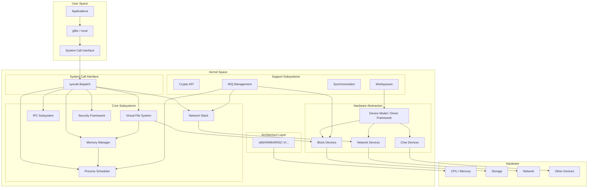

## Subsystem Relationship Map

The kernel subsystems are deeply interconnected. Here is a detailed view of the dependencies:

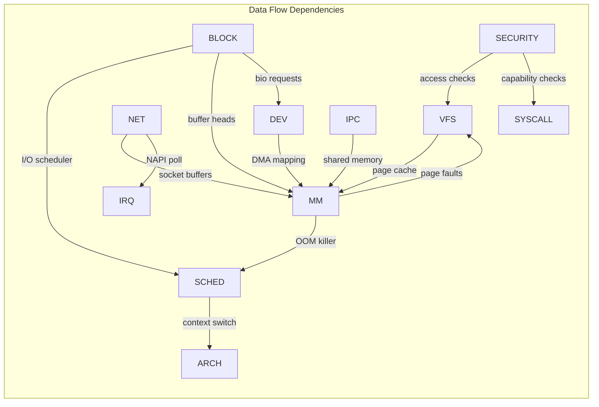

## The System Call Interface

The system call interface is the primary gateway between user space and kernel space. It's implemented in architecture-specific code but follows a common pattern:

### x86-64 System Call Path

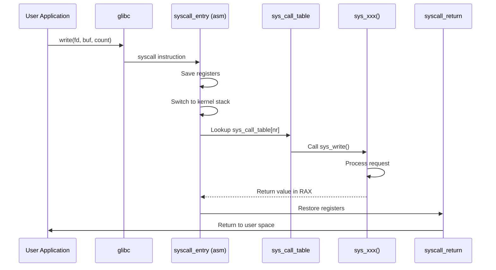

The entry point is defined in assembly:

```asm
/* arch/x86/entry/entry_64.S (simplified) */
entry_SYSCALL_64:
    swapgs
    mov    [gs:cpu_tss_rw.x86_tss.sp2], rsp  /* save user RSP */
    mov    rsp, [gs:cpu_tss_rw.x86_tss.sp0]  /* load kernel stack */
    /* save registers to pt_regs on stack */
    push   r11
    push   rcx
    push   rbp
    push   rbx
    /* ... */
    mov    rdi, rsp           /* pt_regs as first arg */
    call   do_syscall_64      /* C handler */
    /* restore and return */
    jmp    swapgs_restore_regs_and_return_to_usermode
```

The C-level dispatch:

```c
/* arch/x86/kernel/syscall_64.c */
__visible void do_syscall_64(struct pt_regs *regs)
{
    unsigned long nr = regs->orig_ax;

    if (nr < NR_syscalls) {
        regs->ax = sys_call_table[nr](
            regs->di, regs->si, regs->dx,
            regs->r10, regs->r8, regs->r9
        );
    }
}
```

## Process Scheduler Architecture

The scheduler is one of the most critical kernel subsystems. Linux implements a modular scheduling framework:

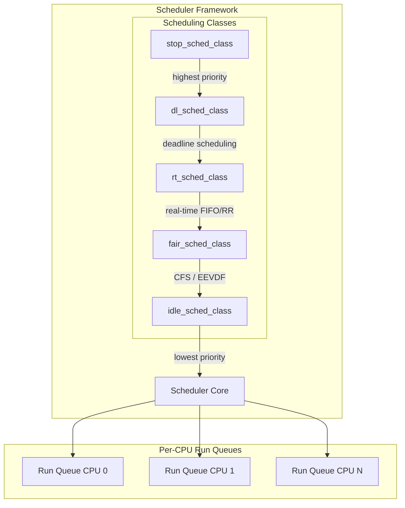

Each scheduling class has a defined interface:

```c
/* include/linux/sched.h */
struct sched_class {
    void (*enqueue_task)(struct rq *rq, struct task_struct *p, int flags);
    void (*dequeue_task)(struct rq *rq, struct task_struct *p, int flags);
    void (*yield_task)(struct rq *rq);
    void (*check_preempt_curr)(struct rq *rq, struct task_struct *p, int flags);
    struct task_struct *(*pick_next_task)(struct rq *rq);
    void (*put_prev_task)(struct rq *rq, struct task_struct *p);
    void (*set_curr_task)(struct rq *rq);
    void (*task_tick)(struct rq *rq, struct task_struct *p, int queued);
    void (*switched_to)(struct rq *rq, struct task_struct *p);
    void (*prio_changed)(struct rq *rq, struct task_struct *p, int oldprio);
    /* ... */
};
```

### CFS / EEVDF Scheduling

The Completely Fair Scheduler (CFS) uses a red-black tree keyed by **virtual runtime** (vruntime). The task with the smallest vruntime is always picked next, ensuring fair CPU time distribution.

Starting with kernel 6.6, the **EEVDF** (Earliest Eligible Virtual Deadline First) scheduler replaces CFS. EEVDF assigns each task a virtual deadline based on its request and lag, and picks the eligible task with the earliest deadline:

```c
/* kernel/sched/fair.c — EEVDF pick logic (simplified) */
static struct sched_entity *pick_eevdf(struct cfs_rq *cfs_rq)
{
    struct sched_entity *best = NULL;
    struct rb_node *node = cfs_rq->tasks_timeline.rb_leftmost;

    /* Walk the tree to find the earliest eligible virtual deadline */
    for_each_eligible_entity(se, cfs_rq) {
        if (!best || entity_before(se, best))
            best = se;
    }
    return best;
}
```

## Memory Management Architecture

The memory management subsystem is layered from low-level page allocation to high-level virtual memory abstractions:

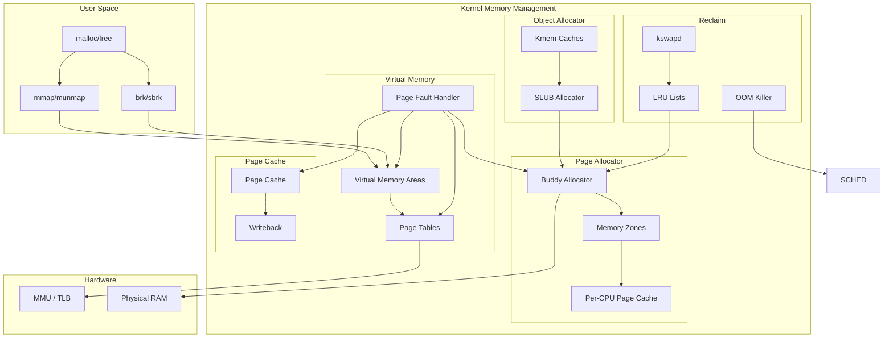

### Key Memory Data Structures

```c
/* Each process has a mm_struct describing its address space */
struct mm_struct {
    struct maple_tree mm_mt;        /* VMAs stored in maple tree */
    struct rw_semaphore mmap_lock;
    unsigned long task_size;        /* size of user address space */
    pgd_t *pgd;                     /* page global directory */
    atomic_t mm_users;              /* number of processes sharing this mm */
    atomic_t mm_count;              /* reference count */
    int map_count;                  /* number of VMAs */
    unsigned long total_vm;         /* total pages mapped */
    unsigned long locked_vm;        /* pages locked in memory */
    unsigned long data_vm;          /* VM_WRITE & ~VM_SHARED */
    unsigned long stack_vm;         /* VM_GROWSUP/DOWN */
    unsigned long start_code, end_code;
    unsigned long start_data, end_data;
    unsigned long start_brk, brk;
    unsigned long start_stack;
    /* ... */
};

/* Virtual Memory Area — describes a contiguous region of virtual memory */
struct vm_area_struct {
    unsigned long vm_start;         /* start address */
    unsigned long vm_end;           /* end address */
    pgprot_t vm_page_prot;          /* access permissions */
    unsigned long vm_flags;         /* VM_READ|VM_WRITE|VM_EXEC|... */
    struct rb_node vm_rb;           /* node in mm's maple tree/rbtree */
    struct file *vm_file;           /* file mapped (NULL for anonymous) */
    void *vm_private_data;          /* driver-specific data */
    const struct vm_operations_struct *vm_ops;
    /* ... */
};
```

## Virtual File System (VFS) Architecture

VFS provides a uniform interface for all filesystems:

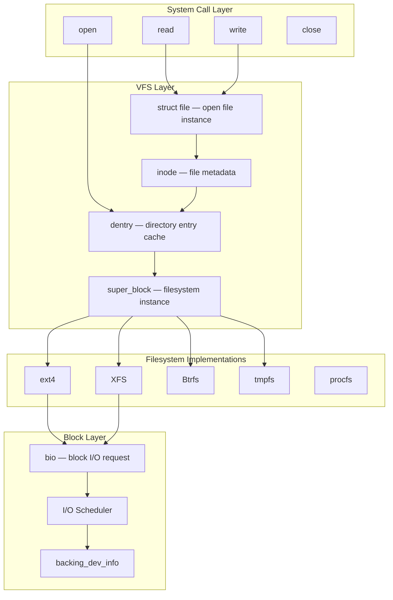

### Key VFS Objects

```c
/* struct inode — represents a filesystem object (file, directory, etc.) */
struct inode {
    umode_t                 i_mode;     /* file type and permissions */
    unsigned short          i_opflags;
    kuid_t                  i_uid;      /* owner UID */
    kgid_t                  i_gid;      /* owner GID */
    unsigned int            i_flags;
    const struct inode_operations   *i_op;
    struct super_block      *i_sb;
    struct address_space    *i_mapping; /* page cache mapping */
    unsigned long           i_ino;      /* inode number */
    loff_t                  i_size;     /* file size in bytes */
    struct timespec64       __i_atime;
    struct timespec64       __i_mtime;
    struct timespec64       __i_ctime;
    const struct file_operations    *i_fop;
    /* ... */
};

/* struct file — represents an open file */
struct file {
    struct path             f_path;     /* contains vfsmount and dentry */
    struct inode            *f_inode;
    const struct file_operations    *f_op;
    atomic_long_t           f_count;
    unsigned int            f_flags;    /* O_RDONLY, O_NONBLOCK, etc. */
    fmode_t                 f_mode;
    loff_t                  f_pos;      /* current file position */
    struct address_space    *f_mapping;
    void                    *private_data;
    /* ... */
};
```

## Network Subsystem Architecture

The networking stack follows a layered design similar to the OSI model:

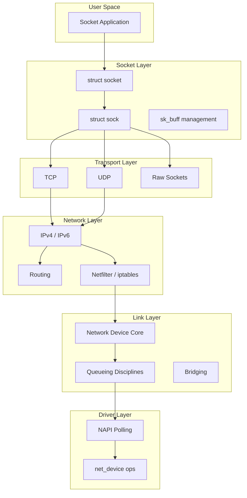

### sk_buff — The Socket Buffer

The `sk_buff` is the fundamental data unit in the networking stack:

```c
/* include/linux/skbuff.h (simplified) */
struct sk_buff {
    struct sk_buff      *next, *prev;
    struct sock         *sk;           /* owning socket */
    unsigned int        len;           /* data length */
    unsigned int        data_len;      /* non-linear data length */
    __u16               mac_len;       /* MAC header length */
    __u16               hdr_len;       /* skb headroom used */
    __u16               queue_mapping;
    __u8                cloned:1;
    __u8                ip_summed:2;

    /* Transport layer header */
    __u16               transport_header;
    /* Network layer header */
    __u16               network_header;
    /* Link layer header */
    __u16               mac_header;

    /* Data pointers */
    unsigned char       *head;         /* buffer head */
    unsigned char       *data;         /* data start */
    unsigned char       *tail;         /* data end */
    unsigned char       *end;          /* buffer end */

    /* Timestamp, dev, protocol, etc. */
    ktime_t             tstamp;
    struct net_device   *dev;
    __be16              protocol;
    /* ... */
};
```

## Device Model Architecture

The Linux device model provides a unified view of all devices through **sysfs**:

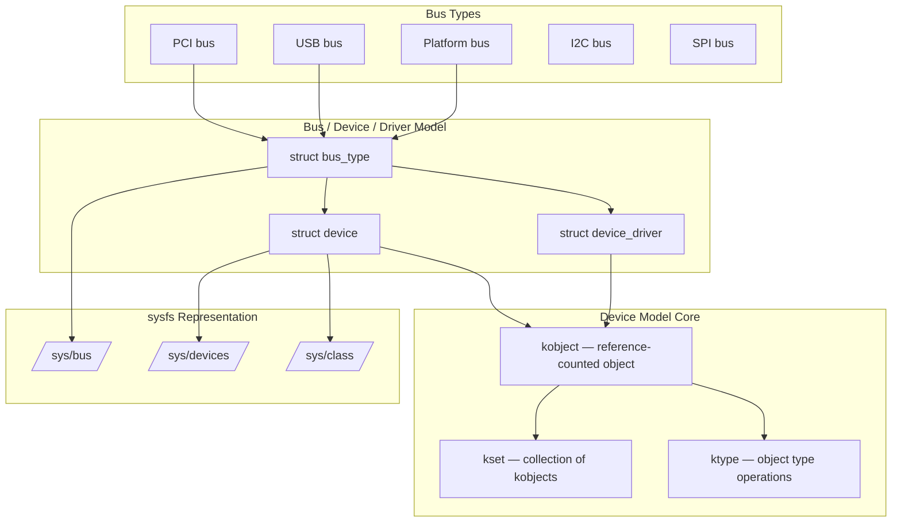

### Device-Driver Binding

```c
/* drivers/base/bus.c — simplified binding logic */
static int driver_match_device(struct device_driver *drv,
                               struct device *dev)
{
    return drv->bus->match ? drv->bus->match(dev, drv) : 1;
}

/* drivers/pci/pci-driver.c — PCI match function */
static const struct pci_device_id *pci_match_device(
    const struct pci_device_id *ids, struct pci_dev *dev)
{
    /* Match vendor, device, subvendor, subdevice, class */
    while (ids->vendor || ids->subvendor || ids->class_mask) {
        if (pci_match_one_device(ids, dev))
            return ids;
        ids++;
    }
    return NULL;
}
```

## Interrupt Handling Architecture

Linux uses a two-phase interrupt handling model to minimize the time spent with interrupts disabled:

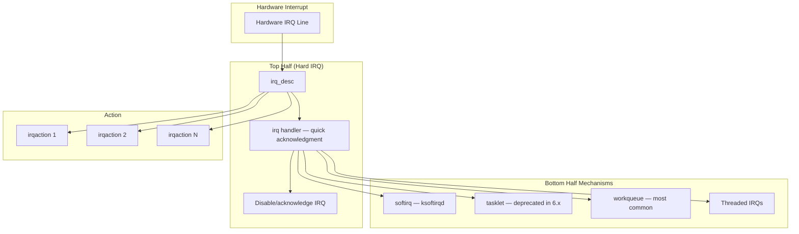

```bash
# View interrupt information
$ cat /proc/interrupts | head -5
           CPU0       CPU1       CPU2       CPU3
  1:          9          0          0          0   IO-APIC   1-edge      i8042
  8:          1          0          0          0   IO-APIC   8-edge      rtc0
  9:          0          0          23         0   IO-APIC   9-fasteoi   acpi
 16:         56        234          0          0   IO-APIC  16-fasteoi   ehci_hcd
 23:          0          0       1234          0   IO-APIC  23-fasteoi   nvidia

# View per-CPU softirq statistics
$ cat /proc/softirqs
                    CPU0       CPU1       CPU2       CPU3
          HI:          0          0          0          0
       TIMER:    1234567    1234566    1234567    1234566
      NET_TX:       1234       1234       1233       1234
      NET_RX:      56789      56788      56789      56788
       BLOCK:      12345      12344      12345      12344
    IRQ_POLL:          0          0          0          0
     TASKLET:       1234       1234       1233       1234
       SCHED:     234567     234566     234567     234566
     HRTIMER:          0          0          0          0
         RCU:     345678     345677     345678     345677
```

## Synchronization Primitives

The kernel provides various synchronization mechanisms for different use cases:

| Primitive | Use Case | Context |
|-----------|----------|---------|
| Spinlock | Short critical sections, IRQ-safe | Atomic (no sleep) |
| Mutex | Longer critical sections, can sleep | Process context |
| RCU | Read-mostly data, zero read overhead | Any context |
| Semaphore | Counting synchronization | Process context |
| rwlock | Many readers, few writers | Atomic |
| atomic_t | Simple counters | Any context |
| seqlock | Reader-writer, readers never block | Any context |
| Completion | Wait for event | Process context |

```c
/* Example: spinlock usage */
DEFINE_SPINLOCK(my_lock);
unsigned long flags;

spin_lock_irqsave(&my_lock, flags);  /* disable interrupts */
/* critical section — must not sleep */
spin_unlock_irqrestore(&my_lock, flags);

/* Example: mutex usage */
DEFINE_MUTEX(my_mutex);

mutex_lock(&my_mutex);
/* critical section — can sleep */
mutex_unlock(&my_mutex);

/* Example: RCU usage */
rcu_read_lock();
/* read-side critical section — no blocking */
list_for_each_entry_rcu(ptr, &my_list, list) {
    /* read data */
}
rcu_read_unlock();
```

## Kernel Configuration Architecture

The configuration system uses a hierarchy of `Kconfig` files:

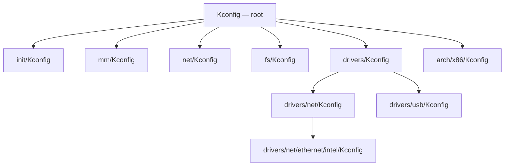

See [Build System](build-system.md) and [Configuration](configuration.md) for full details.

## Cross-Subsystem Data Flow Examples

### File Read Path

A `read()` system call traverses multiple subsystems:

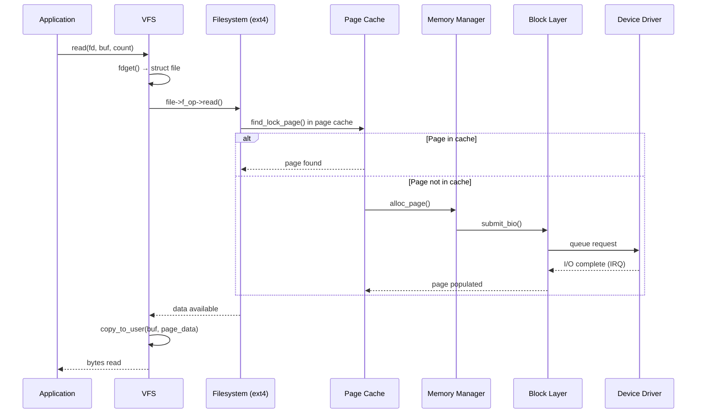

### Network Packet Receive Path

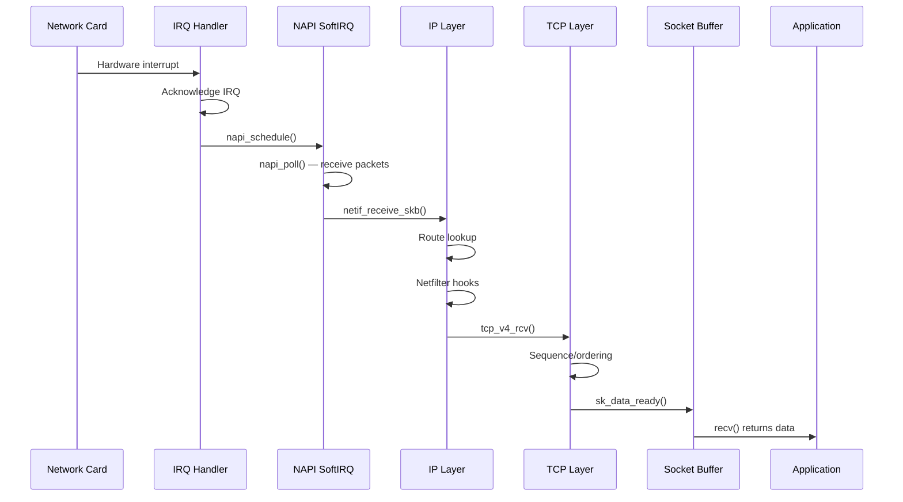

## Further Reading

- [Linux kernel documentation — Architecture](https://www.kernel.org/doc/html/latest/process/programming-language.html)
- [LWN: Porting the Linux kernel to a new architecture](https://lwn.net/Articles/597354/)
- [Linux Device Drivers, 3rd Edition](https://lwn.net/Kernel/LDD3/)
- [Understanding the Linux Virtual Memory Manager](https://www.kernel.org/doc/gorman/)
- [Linux Networking Architecture](https://www.kernel.org/doc/html/latest/networking/)
- [The Art of Linux Kernel Design](https://www.amazon.com/Art-Linux-Kernel-Design-Illustrating/dp/1466518030)

## Related Topics

- [Kernel Overview](overview.md) — High-level introduction
- [Build System](build-system.md) — Kconfig and Kbuild
- [Configuration](configuration.md) — Customizing the kernel
- [Kernel Modules](modules.md) — Loadable module architecture
- [Boot Process](boot-process.md) — From power-on to userspace
- [Data Structures](data-structures.md) — Core kernel data structures
