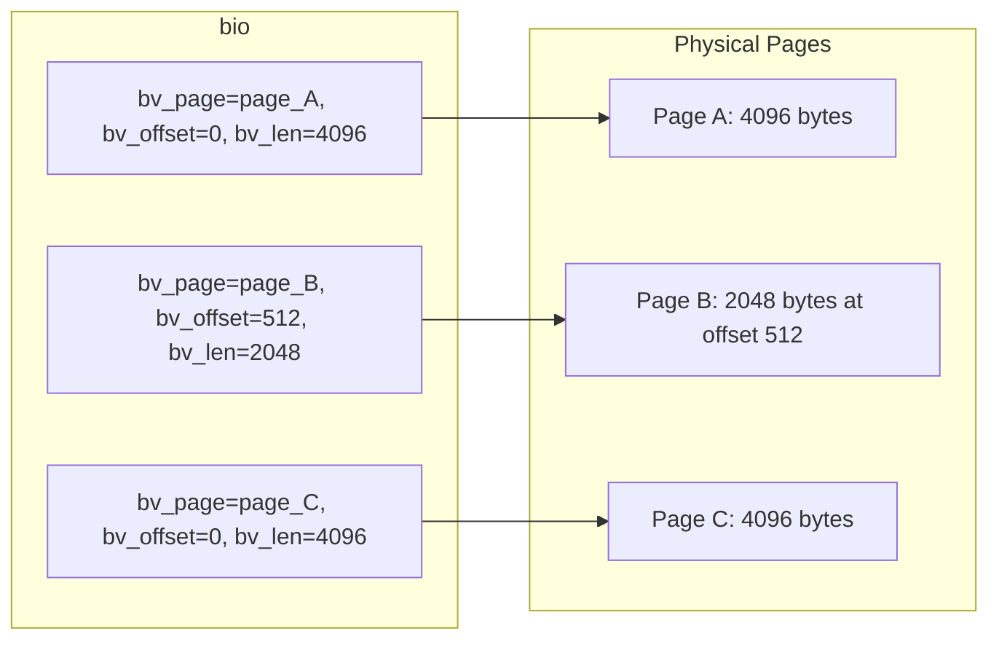
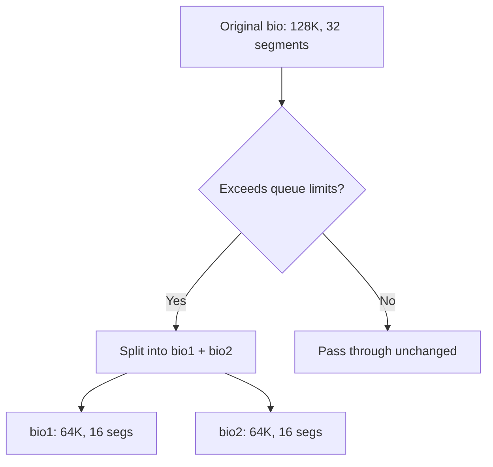
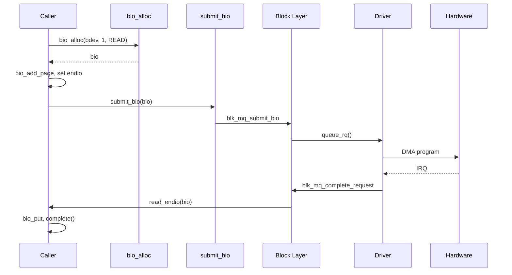

# Bio Structures

The **`bio`** (block I/O) structure is the fundamental unit of data
transfer in the Linux block layer. Every read, write, flush, or discard
operation that enters the block layer is represented as one or more
`bio` structures. Understanding `bio` anatomy is essential for anyone
writing block device drivers or working with the storage stack.

---

## 1. Anatomy of a `bio`

```c
struct bio {
    struct block_device     *bi_bdev;       /* target device */
    unsigned int            bi_opf;         /* op + flags */
    unsigned short          bi_flags;       /* BIO_* flags */
    blk_status_t            bi_status;      /* completion status */
    atomic_t                __bi_remaining; /* remaining segments */

    bio_end_io_t            *bi_end_io;     /* completion callback */
    void                    *bi_private;    /* driver-private data */

    unsigned short          bi_vcnt;        /* # of bio_vecs */
    unsigned short          bi_idx;         /* current bio_vec index */
    unsigned int            bi_size;        /* residual byte count */

    struct bio_vec          *bi_io_vec;     /* segment array */
    struct bio_set          *bi_pool;       /* allocation pool */

    /* ... more fields (blkcg, integrity, etc.) ... */
};
```

### Key Fields Explained

| Field | Description |
|---|---|
| `bi_bdev` | The block device this I/O targets |
| `bi_opf` | Operation (read/write/flush/discard) OR'd with flags |
| `bi_status` | Set by the driver before calling `bio_endio()` |
| `bi_io_vec` | Array of `bio_vec` segments — the actual data |
| `bi_vcnt` | Number of valid entries in `bi_io_vec` |
| `bi_idx` | Index of the next segment to process (advances during iteration) |
| `bi_end_io` | Callback invoked when the bio completes |
| `bi_private` | Driver can stash context here |
| `__bi_remaining` | Counter for chained bios; when it hits zero, completion fires |

---

## 2. `bio_vec` — Scatter-Gather Segments

Each `bio` contains an array of **`bio_vec`** structures. Each `bio_vec`
describes one contiguous memory segment:

```c
struct bio_vec {
    struct page     *bv_page;     /* page containing the data */
    unsigned int    bv_len;       /* length of data in bytes */
    unsigned int    bv_offset;    /* offset within the page */
};
```

A single `bio` can span **multiple pages** and **multiple segments**.
This scatter-gather design allows the kernel to assemble I/O from
scattered physical pages without copying.



### Iterating Over Segments

The preferred way to iterate over a bio's segments:

```c
struct bio_vec bvec;
struct bvec_iter iter;

bio_for_each_segment(bvec, bio, iter) {
    void *addr = page_address(bvec.bv_page) + bvec.bv_offset;
    unsigned int len = bvec.bv_len;

    /* Process 'len' bytes starting at 'addr' */
    pr_info("segment: addr=%p, len=%u\n", addr, len);
}
```

> **Note**: `bio_for_each_segment` advances `bio->bi_idx`. If you need
> to iterate a bio multiple times, use `bio_for_each_segment_all` with
> a separate iterator.

---

## 3. Bio Allocation

### 3.1 From a Bio Set

For drivers that allocate many bios, a **`bio_set`** provides a
pre-allocated pool (avoids slab pressure):

```c
#include <linux/bio.h>

struct bio_set my_bio_set;

/* At module init */
bioset_init(&my_bio_set, 64, 0, BIOSET_NEED_BVECS);

/* Allocate a bio from the set */
struct bio *bio = bio_alloc_bioset(bdev, nr_vecs, opf, GFP_KERNEL,
                                   &my_bio_set);

/* At module exit */
bioset_exit(&my_bio_set);
```

### 3.2 Simple Allocation

For one-off allocations (e.g., in a driver's probe function):

```c
struct bio *bio = bio_alloc(bdev, nr_vecs, opf, GFP_KERNEL);
```

> **Warning**: `bio_alloc()` may fail if too many vectors are requested.
> For large I/O, consider chaining (see below) or using the bio set.

### 3.3 Adding Pages

After allocating a bio, add pages to it:

```c
/* Single page */
bio_add_page(bio, page, len, offset);

/* Full 4K page */
bio_add_page(bio, my_page, PAGE_SIZE, 0);
```

`bio_add_page()` returns the number of bytes actually added. If the
device's segment limits are reached, it returns less than requested
and you must submit the current bio and start a new one.

---

## 4. Bio Operations

### 4.1 Setting Up a Bio

```c
struct bio *bio = bio_alloc(bdev, 1, REQ_OP_READ, GFP_KERNEL);
bio->bi_iter.bi_sector = start_sector;
bio->bi_end_io = my_bio_endio;
bio->bi_private = my_context;

bio_add_page(bio, page, 4096, 0);
```

### 4.2 Submitting a Bio

```c
submit_bio(bio);
```

This enters the block layer's submission path. The bio may be merged
with others, scheduled, and eventually dispatched to the driver.

### 4.3 Bio Completion

When the I/O is finished, the block layer calls the `bi_end_io`
callback:

```c
static void my_bio_endio(struct bio *bio)
{
    if (bio->bi_status) {
        pr_err("I/O error: %d\n", bio->bi_status);
    }

    /* Release resources */
    put_page(bio->bi_io_vec[0].bv_page);
    bio_put(bio);
}
```

**Always call `bio_put(bio)`** in the completion handler to release the
bio back to its pool.

### 4.4 Manual Completion (Driver Side)

Drivers completing bios manually (bypassing the scheduler):

```c
bio->bi_status = BLK_STS_OK;
bio_endio(bio);   /* calls bi_end_io */
```

---

## 5. Bio Splitting

Sometimes a bio exceeds the device's hardware limits (maximum segment
count, segment size, or total size). The block layer automatically
**splits** the bio during submission:



### Queue Limits That Cause Splits

| Limit | Description |
|---|---|
| `max_sectors` | Maximum I/O size in sectors |
| `max_segments` | Maximum scatter-gather segments |
| `max_segment_size` | Maximum size of a single segment |
| `logical_block_size` | Minimum I/O alignment |

### Manual Splitting

Drivers can split a bio explicitly:

```c
struct bio *split = bio_split(bio, split_sectors,
                              GFP_KERNEL, &my_bio_set);
/* 'split' takes the first 'split_sectors' sectors */
/* 'bio' retains the remainder */

submit_bio(split);
submit_bio(bio);
```

### Chunk Splitting for RAID

RAID drivers split bios at stripe boundaries:

```c
while (bio_sectors(bio) > 0) {
    unsigned int chunk = min(bio_sectors(bio),
                            stripe_remaining);
    struct bio *split = bio_split(bio, chunk, GFP_NOIO, &set);
    map_to_stripe(split);
    submit_bio(split);
}
```

---

## 6. Bio Chaining

When a single logical I/O needs to be represented by multiple bios,
they can be **chained**:

```c
bio_chain(bio1, bio2);
submit_bio(bio1);
/* bio2 will be submitted automatically when bio1 completes */
```

The `__bi_remaining` counter tracks how many chained bios are pending.
When all complete, the final bio's `bi_end_io` fires.

---

## 7. Bio Flags

| Flag | Meaning |
|---|---|
| `BIO_NO_PAGE_REF` | Don't take a ref on the page (caller owns it) |
| `BIO_CLONED` | Bio was cloned from another |
| `BIO_BOUNCED` | Bio was bounced to lower memory |
| `BIO_THROTTLED` | Bio is throttled by cgroup |
| `BIO_TRACE_COMPLETION` | Trace block completion |

---

## 8. Putting It All Together — Read Example

```c
static void read_endio(struct bio *bio)
{
    struct completion *comp = bio->bi_private;

    if (bio->bi_status)
        pr_err("read failed: %d\n", bio->bi_status);

    bio_put(bio);
    complete(comp);
}

int do_sync_read(struct block_device *bdev, sector_t sector,
                 struct page *page)
{
    struct bio *bio;
    DECLARE_COMPLETION_ONSTACK(comp);

    bio = bio_alloc(bdev, 1, REQ_OP_READ, GFP_KERNEL);
    bio->bi_iter.bi_sector = sector;
    bio->bi_end_io = read_endio;
    bio->bi_private = &comp;
    bio_add_page(bio, page, PAGE_SIZE, 0);

    submit_bio(bio);
    wait_for_completion(&comp);

    return 0;
}
```

### Execution Flow



---

## 9. Bio vs Request

| Aspect | `bio` | `request` |
|---|---|---|
| Granularity | One contiguous I/O | One or more merged bios |
| Scheduling | Not scheduled | Scheduled by I/O elevator |
| Driver interaction | Via `submit_bio` override | Via `queue_rq` callback |
| Typical use | Direct I/O, device-mapper | Standard block drivers |

A `request` wraps one or more merged bios:

```c
/* Iterate all bios in a request */
struct bio *bio;
__rq_for_each_bio(bio, rq) {
    /* process each bio */
}
```

---

## 10. Memory and Performance Considerations

- **bio pools**: Use `bioset_init()` with pre-allocated bios to avoid
  memory allocation failures in the I/O path.
- **Bounce buffers**: On systems with memory above 4 GiB and 32-bit
  DMA devices, bios may be bounced (copied to low memory). This is
  transparent but costly.
- **Integrity**: The block integrity (DIF/DIX) subsystem adds
  protection information to bios when the hardware supports it.

---

## Further Reading

- [GNU Project Documentation](https://www.gnu.org/doc/doc.html)
- [GNU Manuals](https://www.gnu.org/manual/manual.html)
- [Free Software Directory](https://directory.fsf.org/wiki/Main_Page)
- [Planet GNU](https://planet.gnu.org/)
- [Free Software Books](https://www.gnu.org/doc/other-free-books.html)

- [Linux kernel docs — bio API](https://docs.kernel.org/block/biovecs.html)
- [Linux kernel docs — bio allocation](https://docs.kernel.org/block/bio-pool.html)
- [LWN: The bio structure](https://lwn.net/Articles/737543/)
- [kernel.org — include/linux/bio.h](https://git.kernel.org/pub/scm/linux/kernel/git/torvalds/linux.git/tree/include/linux/bio.h)
- [kernel.org — block/bio.c source](https://git.kernel.org/pub/scm/linux/kernel/git/torvalds/linux.git/tree/block/bio.c)

## Related Topics

- [Block Layer Overview](overview.md) — where bio fits in the I/O path
- [Block Devices](devices.md) — gendisk and registration
- [Request Queues](request-queues.md) — how bios become requests
- [I/O Schedulers](io-schedulers.md) — reordering requests
- [Kernel APIs](../apis.md) — memory allocation and copy helpers
