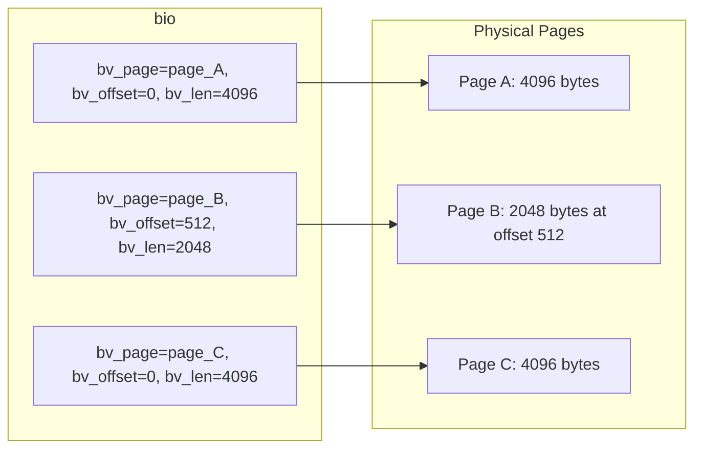
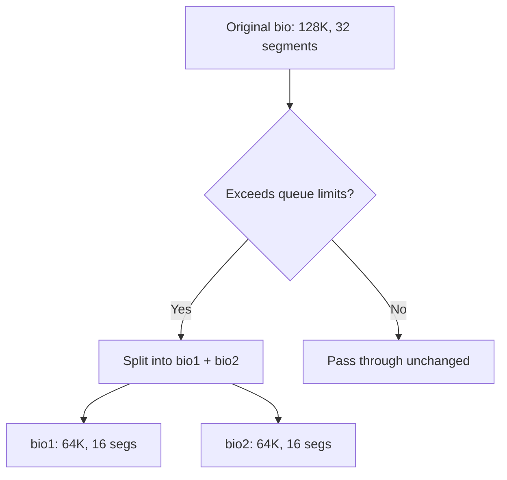
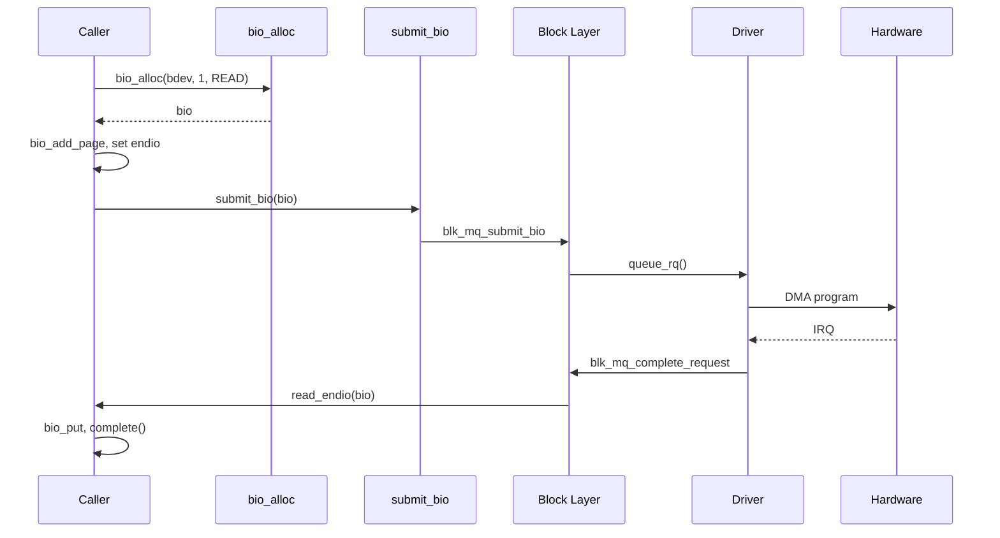
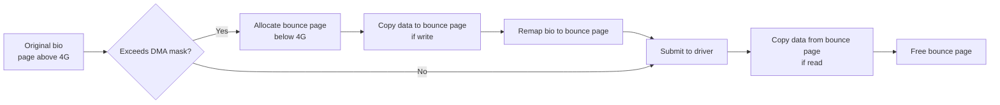
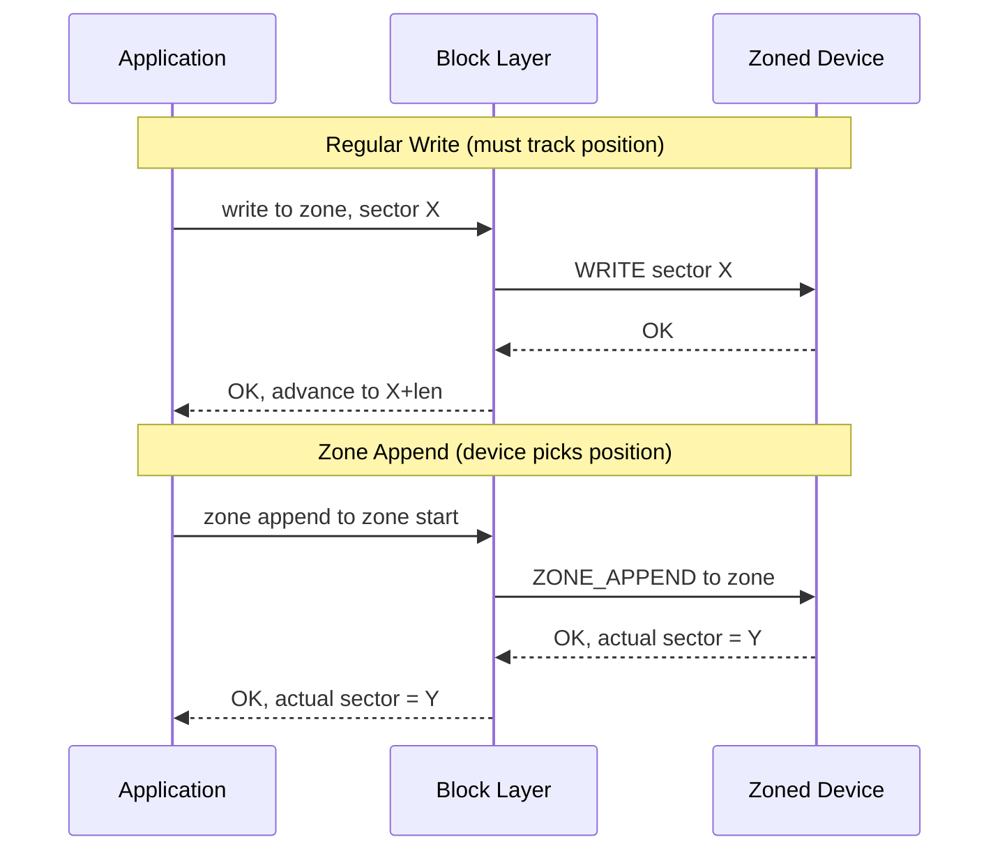
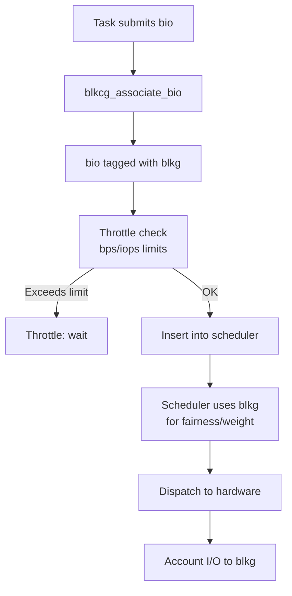

# Bio Structures

The **`bio`** (block I/O) structure is the fundamental unit of data
transfer in the Linux block layer. Every read, write, flush, or discard
operation that enters the block layer is represented as one or more
`bio` structures. Understanding `bio` anatomy is essential for anyone
writing block device drivers or working with the storage stack.

---

## 1. Anatomy of a `bio`

```c
struct bio {
    struct block_device     *bi_bdev;       /* target device */
    unsigned int            bi_opf;         /* op + flags */
    unsigned short          bi_flags;       /* BIO_* flags */
    blk_status_t            bi_status;      /* completion status */
    atomic_t                __bi_remaining; /* remaining segments */

    bio_end_io_t            *bi_end_io;     /* completion callback */
    void                    *bi_private;    /* driver-private data */

    unsigned short          bi_vcnt;        /* # of bio_vecs */
    unsigned short          bi_idx;         /* current bio_vec index */
    unsigned int            bi_size;        /* residual byte count */

    struct bio_vec          *bi_io_vec;     /* segment array */
    struct bio_set          *bi_pool;       /* allocation pool */

    /* ... more fields (blkcg, integrity, etc.) ... */
};
```

### Key Fields Explained

| Field | Description |
|---|---|
| `bi_bdev` | The block device this I/O targets |
| `bi_opf` | Operation (read/write/flush/discard) OR'd with flags |
| `bi_status` | Set by the driver before calling `bio_endio()` |
| `bi_io_vec` | Array of `bio_vec` segments — the actual data |
| `bi_vcnt` | Number of valid entries in `bi_io_vec` |
| `bi_idx` | Index of the next segment to process (advances during iteration) |
| `bi_end_io` | Callback invoked when the bio completes |
| `bi_private` | Driver can stash context here |
| `__bi_remaining` | Counter for chained bios; when it hits zero, completion fires |

---

## 2. `bio_vec` — Scatter-Gather Segments

Each `bio` contains an array of **`bio_vec`** structures. Each `bio_vec`
describes one contiguous memory segment:

```c
struct bio_vec {
    struct page     *bv_page;     /* page containing the data */
    unsigned int    bv_len;       /* length of data in bytes */
    unsigned int    bv_offset;    /* offset within the page */
};
```

A single `bio` can span **multiple pages** and **multiple segments**.
This scatter-gather design allows the kernel to assemble I/O from
scattered physical pages without copying.



### Iterating Over Segments

The preferred way to iterate over a bio's segments:

```c
struct bio_vec bvec;
struct bvec_iter iter;

bio_for_each_segment(bvec, bio, iter) {
    void *addr = page_address(bvec.bv_page) + bvec.bv_offset;
    unsigned int len = bvec.bv_len;

    /* Process 'len' bytes starting at 'addr' */
    pr_info("segment: addr=%p, len=%u\n", addr, len);
}
```

> **Note**: `bio_for_each_segment` advances `bio->bi_idx`. If you need
> to iterate a bio multiple times, use `bio_for_each_segment_all` with
> a separate iterator.

---

## 3. Bio Allocation

### 3.1 From a Bio Set

For drivers that allocate many bios, a **`bio_set`** provides a
pre-allocated pool (avoids slab pressure):

```c
#include <linux/bio.h>

struct bio_set my_bio_set;

/* At module init */
bioset_init(&my_bio_set, 64, 0, BIOSET_NEED_BVECS);

/* Allocate a bio from the set */
struct bio *bio = bio_alloc_bioset(bdev, nr_vecs, opf, GFP_KERNEL,
                                   &my_bio_set);

/* At module exit */
bioset_exit(&my_bio_set);
```

### 3.2 Simple Allocation

For one-off allocations (e.g., in a driver's probe function):

```c
struct bio *bio = bio_alloc(bdev, nr_vecs, opf, GFP_KERNEL);
```

> **Warning**: `bio_alloc()` may fail if too many vectors are requested.
> For large I/O, consider chaining (see below) or using the bio set.

### 3.3 Adding Pages

After allocating a bio, add pages to it:

```c
/* Single page */
bio_add_page(bio, page, len, offset);

/* Full 4K page */
bio_add_page(bio, my_page, PAGE_SIZE, 0);
```

`bio_add_page()` returns the number of bytes actually added. If the
device's segment limits are reached, it returns less than requested
and you must submit the current bio and start a new one.

---

## 4. Bio Operations

### 4.1 Setting Up a Bio

```c
struct bio *bio = bio_alloc(bdev, 1, REQ_OP_READ, GFP_KERNEL);
bio->bi_iter.bi_sector = start_sector;
bio->bi_end_io = my_bio_endio;
bio->bi_private = my_context;

bio_add_page(bio, page, 4096, 0);
```

### 4.2 Submitting a Bio

```c
submit_bio(bio);
```

This enters the block layer's submission path. The bio may be merged
with others, scheduled, and eventually dispatched to the driver.

### 4.3 Bio Completion

When the I/O is finished, the block layer calls the `bi_end_io`
callback:

```c
static void my_bio_endio(struct bio *bio)
{
    if (bio->bi_status) {
        pr_err("I/O error: %d\n", bio->bi_status);
    }

    /* Release resources */
    put_page(bio->bi_io_vec[0].bv_page);
    bio_put(bio);
}
```

**Always call `bio_put(bio)`** in the completion handler to release the
bio back to its pool.

### 4.4 Manual Completion (Driver Side)

Drivers completing bios manually (bypassing the scheduler):

```c
bio->bi_status = BLK_STS_OK;
bio_endio(bio);   /* calls bi_end_io */
```

---

## 5. Bio Splitting

Sometimes a bio exceeds the device's hardware limits (maximum segment
count, segment size, or total size). The block layer automatically
**splits** the bio during submission:



### Queue Limits That Cause Splits

| Limit | Description |
|---|---|
| `max_sectors` | Maximum I/O size in sectors |
| `max_segments` | Maximum scatter-gather segments |
| `max_segment_size` | Maximum size of a single segment |
| `logical_block_size` | Minimum I/O alignment |

### Manual Splitting

Drivers can split a bio explicitly:

```c
struct bio *split = bio_split(bio, split_sectors,
                              GFP_KERNEL, &my_bio_set);
/* 'split' takes the first 'split_sectors' sectors */
/* 'bio' retains the remainder */

submit_bio(split);
submit_bio(bio);
```

### Chunk Splitting for RAID

RAID drivers split bios at stripe boundaries:

```c
while (bio_sectors(bio) > 0) {
    unsigned int chunk = min(bio_sectors(bio),
                            stripe_remaining);
    struct bio *split = bio_split(bio, chunk, GFP_NOIO, &set);
    map_to_stripe(split);
    submit_bio(split);
}
```

---

## 6. Bio Chaining

When a single logical I/O needs to be represented by multiple bios,
they can be **chained**:

```c
bio_chain(bio1, bio2);
submit_bio(bio1);
/* bio2 will be submitted automatically when bio1 completes */
```

The `__bi_remaining` counter tracks how many chained bios are pending.
When all complete, the final bio's `bi_end_io` fires.

---

## 7. Bio Flags

| Flag | Meaning |
|---|---|
| `BIO_NO_PAGE_REF` | Don't take a ref on the page (caller owns it) |
| `BIO_CLONED` | Bio was cloned from another |
| `BIO_BOUNCED` | Bio was bounced to lower memory |
| `BIO_THROTTLED` | Bio is throttled by cgroup |
| `BIO_TRACE_COMPLETION` | Trace block completion |

---

## 8. Putting It All Together — Read Example

```c
static void read_endio(struct bio *bio)
{
    struct completion *comp = bio->bi_private;

    if (bio->bi_status)
        pr_err("read failed: %d\n", bio->bi_status);

    bio_put(bio);
    complete(comp);
}

int do_sync_read(struct block_device *bdev, sector_t sector,
                 struct page *page)
{
    struct bio *bio;
    DECLARE_COMPLETION_ONSTACK(comp);

    bio = bio_alloc(bdev, 1, REQ_OP_READ, GFP_KERNEL);
    bio->bi_iter.bi_sector = sector;
    bio->bi_end_io = read_endio;
    bio->bi_private = &comp;
    bio_add_page(bio, page, PAGE_SIZE, 0);

    submit_bio(bio);
    wait_for_completion(&comp);

    return 0;
}
```

### Execution Flow



---

## 9. Bio vs Request

| Aspect | `bio` | `request` |
|---|---|---|
| Granularity | One contiguous I/O | One or more merged bios |
| Scheduling | Not scheduled | Scheduled by I/O elevator |
| Driver interaction | Via `submit_bio` override | Via `queue_rq` callback |
| Typical use | Direct I/O, device-mapper | Standard block drivers |

A `request` wraps one or more merged bios:

```c
/* Iterate all bios in a request */
struct bio *bio;
__rq_for_each_bio(bio, rq) {
    /* process each bio */
}
```

---

## 10. Bounce Buffers

On systems with more than 4 GiB of RAM and 32-bit DMA devices, the
block layer must **bounce** I/O data to low memory (below 4 GiB)
before the device can DMA to/from it. This is handled transparently
at the bio level.

### When Bouncing Happens

1. Device DMA mask is 32-bit (`DMA_BIT_MASK(32)`) but the page is
   above 4 GiB.
2. The `CONFIG_BOUNCE` kernel option is enabled.
3. SWIOTLB (Software IO TLB) is active.

### Bounce Buffer Flow



### Performance Impact

Bounce buffers add a **memcpy** for every bounced I/O. On systems with
large amounts of RAM and 32-bit devices (common on older hardware or
embedded platforms), this can be significant.

```bash
# Check bounce buffer usage
$ cat /proc/vmstat | grep bounce
nr_bounce 0

# Check SWIOTLB allocation
$ dmesg | grep -i swiotlb
[    0.000000] software IO TLB: mapped [mem 0x000000007d700000-0x000000007db00000] (64MB)
```

### Mitigating Bounce Buffer Overhead

- Use 64-bit DMA-capable devices whenever possible.
- Set the device's DMA mask correctly in the driver.
- Use an IOMMU with 64-bit addressing (VT-d, AMD-Vi).
- Enable `CONFIG_SWIOTLB` only when needed.

---

## 11. Block Integrity (DIF/DIX)

The block integrity subsystem adds **protection information** (PI) to
I/O requests, enabling end-to-end data integrity checking between the
host and storage device.

### DIF vs DIX

| Feature | DIF | DIX |
|---|---|---|
| Full Name | Data Integrity Field | Data Integrity Extensions |
| PI Location | Appended to each sector | Separate scatter-gather |
| Hardware | Controller generates/checks | Host generates/checks |
| Standard | SCSI T10-PI | Extended T10-PI |

### Protection Information Format

Each PI tuple contains:

```c
struct blk_integrity_tuple {
    __be16 guard_tag;     /* CRC or IP checksum */
    __be16 app_tag;       /* application-defined tag */
    __be32 ref_tag;       /* lower 32 bits of LBA */
};
```

### bio Integrity Setup

```c
#include <linux/blk-integrity.h>

/* Enable integrity on a bio */
bio->bi_opf |= REQ_INTEGRITY;

/* The block layer adds PI segments automatically
 * when the device's integrity profile is configured */
```

### Integrity Profile Registration

Drivers register an integrity profile with the block layer:

```c
static struct blk_integrity my_integrity = {
    .name               = "my-dev-T10-PI",
    .generate_fn        = my_generate_pi,
    .verify_fn          = my_verify_pi,
    .tuple_size         = 8,
    .tag_size           = 0,
};

/* Register at disk setup time */
blk_integrity_register(mydev.gd, &my_integrity);
```

### Checking Integrity Support

```bash
# Check if device supports integrity
$ cat /sys/block/sda/integrity/format
# t10-pi (DIF) or none

# Check integrity settings
$ ls /sys/block/sda/integrity/
# format  protection_interval_bytes  read_verify  tag_size  write_generate

# Enable read verification
$ echo 1 > /sys/block/sda/integrity/read_verify
```

---

## 12. Zone Append for Zoned Block Devices

Zoned block devices (ZBC/ZAC HDDs, ZNS NVMe SSDs) require writes to
sequential zones to be issued in order. The **zone append** operation
simplifies this by letting the device choose the write position.

### Regular Write vs Zone Append



### Zone Append in bio

```c
/* Zone append bio setup */
struct bio *bio = bio_alloc(bdev, 1, REQ_OP_ZONE_APPEND, GFP_KERNEL);
bio->bi_iter.bi_sector = zone_start_sector;  /* target zone */
bio_add_page(bio, page, PAGE_SIZE, 0);

submit_bio(bio);
wait_for_completion(&comp);

/* After completion, the actual write position is: */
sector_t written_at = bio->bi_iter.bi_sector;
```

### Zone Append Constraints

- The `bi_iter.bi_sector` in the completion bio reflects the **device-chosen**
  write position, not the original request.
- Applications must handle the returned position (e.g., to update metadata).
- Zone append guarantees are per-zone: writes within a zone remain ordered.

---

## 13. cgroup / blkcg Integration

The block layer integrates with cgroups via the **block cgroup (blkcg)**
subsystem, enabling per-cgroup I/O accounting, throttling, and
weight-based scheduling.

### Per-bio cgroup Association

Each bio carries a `bi_blkg` (block cgroup) pointer that determines
which cgroup owns the I/O:

```c
/* bio is associated with the submitting task's blkcg at submission time */
/* The blk-mq layer uses this for throttling and scheduling */
```

### blkcg Configuration

```bash
# Create a blkcg cgroup
$ mkdir /sys/fs/cgroup/blkio/mygroup

# Set I/O weight (for BFQ)
$ echo 200 > /sys/fs/cgroup/blkio/mygroup/blkio.bfq.weight

# Set I/O throttle (for all schedulers)
$ echo "8:0 1048576" > /sys/fs/cgroup/blkio/mygroup/blkio.throttle.read_bps_device
# 8:0 = major:minor, 1048576 = 1 MiB/s read limit

$ echo "8:0 1000" > /sys/fs/cgroup/blkio/mygroup/blkio.throttle.read_iops_device
# Limit to 1000 read IOPS

# Assign a process to the cgroup
$ echo $PID > /sys/fs/cgroup/blkio/mygroup/cgroup.procs

# Check per-cgroup I/O stats
$ cat /sys/fs/cgroup/blkio/mygroup/blkio.throttle.io_service_bytes
```

### blkcg and bio Lifecycle



---

## 14. Write Hints

Modern NVMe devices support **write hints** — metadata that tells the
device which "stream" a write belongs to, allowing the device to place
data more efficiently in its internal NAND.

### Write Hint Types

```c
enum rw_hint {
    WRITE_LIFE_NOT_SET   = 0,  /* no hint */
    WRITE_LIFE_NONE      = 1,  /* no special lifetime */
    WRITE_LIFE_SHORT     = 2,  /* short-lived data (tmp files) */
    WRITE_LIFE_MEDIUM    = 3,  /* medium lifetime */
    WRITE_LIFE_LONG      = 4,  /* long-lived data (archives) */
    WRITE_LIFE_EXTREME   = 5,  /* extremely long-lived */
};
```

### Setting Write Hints

```c
/* Via bio */
bio->bi_write_hint = WRITE_LIFE_SHORT;

/* Via fcntl on file descriptor */
fcntl(fd, F_SET_RW_HINT, &(int){WRITE_LIFE_LONG});

/* Via file open flags (future) */
```

```bash
# Check device write hint support
$ cat /sys/block/nvme0n1/queue/write_hint_mask
# 0x3f = all hints supported
```

Write hints map to NVMe streams. If the device doesn't support streams,
hints are silently ignored.

---

## 15. Bio Reset and Reuse

In performance-critical paths, reusing a bio avoids repeated
allocation overhead:

```c
struct bio *bio = bio_alloc_bioset(bdev, 1, opf, GFP_KERNEL, &set);

/* First use */
bio->bi_iter.bi_sector = sector1;
bio_add_page(bio, page, PAGE_SIZE, 0);
submit_bio(bio);
wait_for_completion(&comp);

/* Reuse the bio (reset state) */
bio_reset(bio, bdev, opf);
bio->bi_iter.bi_sector = sector2;
bio_add_page(bio, page2, PAGE_SIZE, 0);
submit_bio(bio);
```

`bio_reset()` clears the bio state but keeps the allocated `bio_vec`
array, avoiding a trip through the memory allocator.

> **Warning**: Only reuse bios from a `bio_set` pool. Never reuse a
> bio that was cloned or bounced.

---

## 16. Error Handling and Retry

### Error Status Codes

```c
enum blk_status {
    BLK_STS_OK          = 0,   /* Success */
    BLK_STS_NOTSUPP     = 1,   /* Operation not supported */
    BLK_STS_TIMEOUT      = 2,   /* Request timed out */
    BLK_STS_NOSPC        = 3,   /* No space on device */
    BLK_STS_TRANSPORT    = 4,   /* Transport error */
    BLK_STS_TARGET       = 5,   /* Target error */
    BLK_STS_NEXUS        = 6,   /* Nexus error */
    BLK_STS_MEDIUM       = 7,   /* Medium error */
    BLK_STS_PROTECTION   = 8,   /* Protection error (DIF) */
    BLK_STS_RESOURCE     = 9,   /* Resource exhaustion */
    BLK_STS_IOERR        = 10,  /* Generic I/O error */
    BLK_STS_AGAIN        = 11,  /* Temporary, try again */
    BLK_STS_DM_REQUEUE   = 12,  /* Device-mapper requeue */
    BLK_STS_INVAL        = 13,  /* Invalid request */
    BLK_STS_IO_NOMEM     = 14,  /* Out of memory for I/O */
};
```

### Retry Pattern

```c
static void my_bio_endio(struct bio *bio)
{
    struct my_context *ctx = bio->bi_private;

    if (bio->bi_status == BLK_STS_AGAIN && ctx->retries < 3) {
        ctx->retries++;
        bio->bi_status = 0;
        bio->bi_iter.bi_sector = ctx->sector;  /* reset position */
        submit_bio(bio);
        return;
    }

    if (bio->bi_status)
        pr_err("I/O failed after %d retries: %d\n",
               ctx->retries, bio->bi_status);

    complete(&ctx->comp);
    bio_put(bio);
}
```

---

## 17. Performance Considerations

### bio Pool Sizing

```c
/* Create a pool sized for worst-case concurrency */
#define POOL_SIZE  256
bioset_init(&my_set, POOL_SIZE, 0, BIOSET_NEED_BVECS);
```

If the pool is exhausted, `bio_alloc_bioset()` falls back to the
system allocator (`kmalloc`), which may fail under memory pressure.
A well-sized pool prevents I/O stalls.

### Segment Coalescing

The block layer attempts to merge adjacent `bio_vec` entries that
reference contiguous memory:

```c
/* bio_add_page() will try to merge with the last bio_vec */
/* if the pages are physically contiguous and the device allows it */
```

### Queue Limits and Throughput

| Parameter | sysfs | Effect |
|---|---|---|
| `max_sectors_kb` | `/sys/block/<dev>/queue/` | Maximum I/O size (KiB) |
| `max_segments` | `/sys/block/<dev>/queue/` | Maximum scatter-gather segments |
| `max_segment_size` | `/sys/block/<dev>/queue/` | Maximum segment size (bytes) |
| `logical_block_size` | `/sys/block/<dev>/queue/` | Minimum I/O alignment |
| `physical_block_size` | `/sys/block/<dev>/queue/` | Physical sector size |
| `optimal_io_size` | `/sys/block/<dev>/queue/` | Device-optimal I/O size |

```bash
# Check queue limits
$ cat /sys/block/sda/queue/max_sectors_kb
128
$ cat /sys/block/sda/queue/max_segments
168
$ cat /sys/block/sda/queue/logical_block_size
512
```

### Avoiding Unnecessary Splits

Large bios that exceed queue limits are split automatically, but each
split adds overhead. To minimize splits:

1. Align I/O to `logical_block_size`.
2. Keep bio size within `max_sectors_kb`.
3. Use `bio_add_page()` to respect segment limits.
4. Use direct I/O for large transfers (avoids page cache fragmentation).

---

## 18. Complete Example: Asynchronous Multi-Page Read

```c
#include <linux/module.h>
#include <linux/bio.h>
#include <linux/blkdev.h>

struct async_read_ctx {
    struct completion   done;
    struct page         **pages;
    int                 nr_pages;
    sector_t            start_sector;
    int                 error;
};

static void async_read_endio(struct bio *bio)
{
    struct async_read_ctx *ctx = bio->bi_private;
    int i;

    if (bio->bi_status) {
        pr_err("async read failed: %d\n", bio->bi_status);
        ctx->error = -EIO;
    }

    /* Free pages on error */
    if (ctx->error) {
        for (i = 0; i < ctx->nr_pages; i++)
            put_page(ctx->pages[i]);
    }

    bio_put(bio);
    complete(&ctx->done);
}

int do_async_read(struct block_device *bdev, sector_t sector,
                  struct page **pages, int nr_pages)
{
    struct bio *bio;
    struct async_read_ctx ctx = {
        .done           = COMPLETION_INITIALIZER_ONSTACK(ctx.done),
        .pages          = pages,
        .nr_pages       = nr_pages,
        .start_sector   = sector,
        .error          = 0,
    };
    int i, ret;

    bio = bio_alloc(bdev, nr_pages, REQ_OP_READ, GFP_KERNEL);
    bio->bi_iter.bi_sector = sector;
    bio->bi_end_io = async_read_endio;
    bio->bi_private = &ctx;

    for (i = 0; i < nr_pages; i++) {
        ret = bio_add_page(bio, pages[i], PAGE_SIZE, 0);
        if (ret != PAGE_SIZE) {
            /* Device limit reached — would need to chain */
            pr_warn("bio full at page %d/%d\n", i, nr_pages);
            break;
        }
    }

    submit_bio(bio);
    wait_for_completion(&ctx.done);

    return ctx.error;
}
```

---

## 19. Further Reading

- [GNU Project Documentation](https://www.gnu.org/doc/doc.html)
- [GNU Manuals](https://www.gnu.org/manual/manual.html)
- [Free Software Directory](https://directory.fsf.org/wiki/Main_Page)
- [Planet GNU](https://planet.gnu.org/)
- [Free Software Books](https://www.gnu.org/doc/other-free-books.html)

- [Linux kernel docs — bio API](https://docs.kernel.org/block/biovecs.html)
- [Linux kernel docs — bio allocation](https://docs.kernel.org/block/bio-pool.html)
- [LWN: The bio structure](https://lwn.net/Articles/737543/)
- [kernel.org — include/linux/bio.h](https://git.kernel.org/pub/scm/linux/kernel/git/torvalds/linux.git/tree/include/linux/bio.h)
- [kernel.org — block/bio.c source](https://git.kernel.org/pub/scm/linux/kernel/git/torvalds/linux.git/tree/block/bio.c)

## Related Topics

- [Block Layer Overview](overview.md) — where bio fits in the I/O path
- [Block Devices](devices.md) — gendisk and registration
- [Request Queues](request-queues.md) — how bios become requests
- [I/O Schedulers](io-schedulers.md) — reordering requests
- [Kernel APIs](../apis.md) — memory allocation and copy helpers
