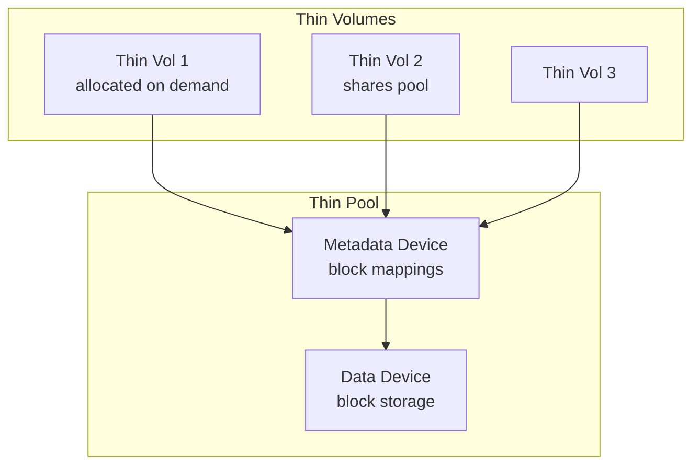
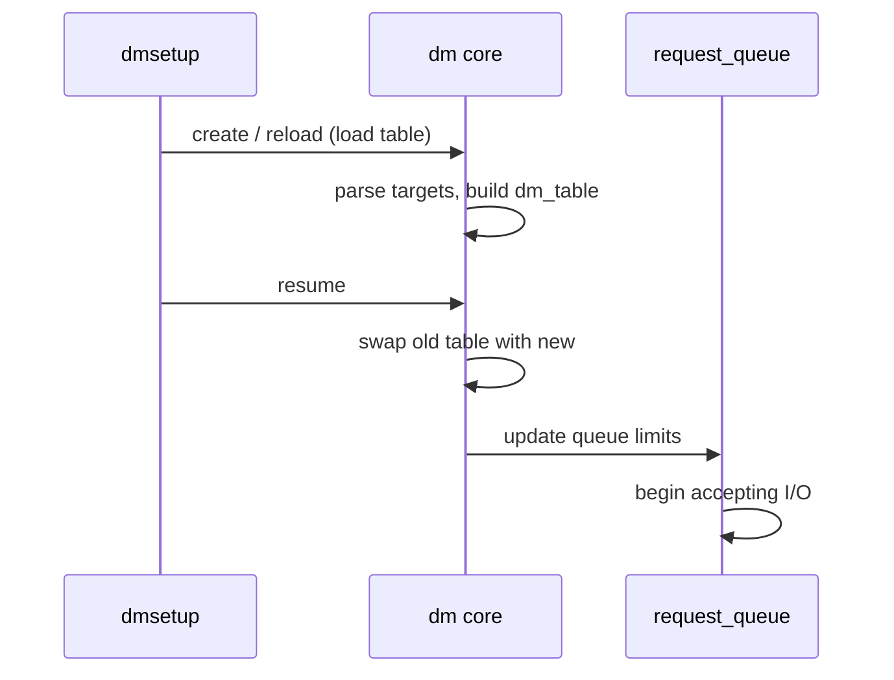
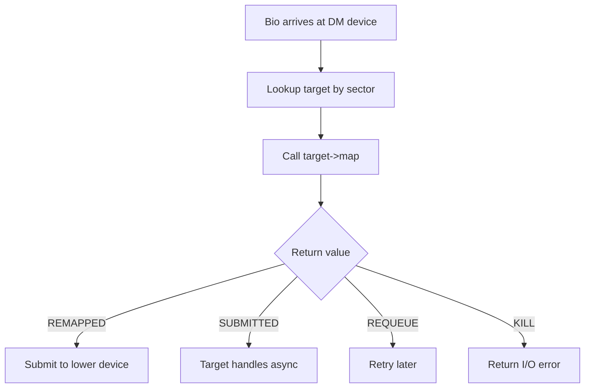

# Device Mapper

The **device mapper** (DM) is a kernel framework that creates virtual
block devices by mapping I/O to underlying (lower-level) block devices.
It is the foundation for LVM (Logical Volume Manager), dm-crypt (full-disk
encryption), dm-verity (integrity), and many other storage technologies.

---

## 1. Overview

A device-mapper device consists of:

1. A **table** that maps ranges of virtual sectors to ranges on
   underlying devices.
2. One or more **targets** that implement the mapping logic.

```mermaid
graph TD
    subgraph "User Space"
        DMSETUP[dmsetup]
        LVM[lvm2]
    end
    subgraph "Device Mapper"
        DM[dm core]
        TABLE[dm_table]
        TGT[dm_target]
    end
    subgraph "Targets"
        LIN[linear]
        STR[striped]
        CRYPT[crypt]
        MIRR[mirror]
        THIN[thin]
        RAID[raid]
    end
    subgraph "Lower Devices"
        D1[/dev/sda1]
        D2[/dev/sdb1]
    end
    DMSETUP --> DM
    LVM --> DM
    DM --> TABLE
    TABLE --> TGT
    TGT --> LIN & STR & CRYPT & MIRR & THIN & RAID
    LIN --> D1
    STR --> D1 & D2
    CRYPT --> D1
```

---

## 2. DM Table

A DM table is an array of **target entries**, each mapping a contiguous
range of virtual sectors to a target type and its constructor arguments.

### Table Format (from `dmsetup table`)

```text
$ dmsetup table my_vg-my_lv
0 2097152 linear 8:1 0
```

Format: `<start_sector> <num_sectors> <target_type> <target_args...>`

Multiple entries create a composite device:

```text
0      1048576 linear /dev/sda 0
1048576 1048576 linear /dev/sdb 0
```

This maps the first 1 MiB sectors to `sda` and the next 1 MiB to `sdb`.

### Table Loading

```c
/* Kernel API: load a new table */
int dm_table_create(struct dm_table **result, fmode_t mode,
                    unsigned int num_targets, struct mapped_device *md);

/* Add a target */
int dm_table_add_target(struct dm_table *t, const char *type,
                        struct dm_target *tgt);
```

---

## 3. Targets

### 3.1 `linear` — Simple Concatenation

Maps virtual sectors to a single underlying device with an offset.

**Use case**: LVM linear volumes, basic concatenation.

```bash
# Create a linear mapping
echo "0 2097152 linear /dev/sda 0" | dmsetup create my_linear

# Use it
mkfs.ext4 /dev/mapper/my_linear
mount /dev/mapper/my_linear /mnt
```

**How it works**:

```c
static int linear_map(struct dm_target *ti, struct bio *bio)
{
    struct linear_c *lc = ti->private;
    bio_set_dev(bio, lc->dev->bdev);
    bio->bi_iter.bi_sector = linear_map_sector(ti,
                                bio->bi_iter.bi_sector);
    return DM_MAPIO_REMAPPED;
}
```

### 3.2 `striped` — RAID-0 Style Striping

Distributes I/O across multiple devices in stripes.

**Use case**: Performance aggregation across multiple disks.

```bash
echo "0 4194304 striped 2 128 /dev/sda 0 /dev/sdb 0" \
    | dmsetup create my_stripe
```

Arguments: `striped <num_stripes> <chunk_size> <dev1> <offset1> <dev2> <offset2> ...`

**How it works**:

```mermaid
graph LR
    subgraph "Virtual Device"
        V[0 → 4194304 sectors]
    end
    subgraph "Stripe Map"
        S0[Even stripes → sda]
        S1[Odd stripes → sdb]
    end
    subgraph "Physical"
        D1[/dev/sda]
        D2[/dev/sdb]
    end
    V --> S0 --> D1
    V --> S1 --> D2
```

### 3.3 `crypt` — Full-Disk Encryption (dm-crypt)

Encrypts all I/O transparently using a cipher and key.

**Use case**: LUKS full-disk encryption, Android metadata encryption.

```bash
# Open a LUKS volume
cryptsetup luksOpen /dev/sda2 my_encrypted

# Internally creates:
# dmsetup table my_encrypted
# 0 2097152 crypt aes-xts-plain64 <key> 0 /dev/sda2 0
```

**How it works**:

```c
static int crypt_map(struct dm_target *ti, struct bio *bio)
{
    struct crypt_config *cc = ti->private;

    /* Allocate clone, encrypt/decrypt, submit to lower device */
    struct dm_crypt_io *io = crypt_io_alloc(cc, bio, ...);

    if (bio_data_dir(bio) == WRITE)
        kcryptd_queue_crypt(io);   /* encrypt then submit */
    else
        kcryptd_queue_crypt(io);   /* read, decrypt, complete */

    return DM_MAPIO_SUBMITTED;
}
```

**Cipher modes**:

| Mode | Description |
|---|---|
| `aes-xts-plain64` | AES-XTS with 64-bit sector IV (standard) |
| `aes-cbc-essiv:sha256` | AES-CBC with ESSIV (legacy) |
| `adiantum` | For low-end CPUs without AES acceleration |

### 3.4 `mirror` — RAID-1 Mirroring

Maintains two or more copies of all data.

**Use case**: LVM mirror volumes, fault tolerance.

```bash
echo "0 2097152 mirror core 2 128 /dev/sda 0 /dev/sdb 0" \
    | dmsetup create my_mirror
```

**How it works**:

```mermaid
graph TD
    BIO[Write bio] --> MIRROR[dm mirror]
    MIRROR --> D1[/dev/sda<br/>primary]
    MIRROR --> D2[/dev/sdb<br/>secondary]
    D1 --> DONE[completion when<br/>both done]
    D2 --> DONE
```

Mirror also supports:
- **log device**: Tracks which regions are in-sync (avoids full resync)
- **region size**: Granularity of dirty tracking

### 3.5 `thin` — Thin Provisioning

Allocates blocks on demand from a shared pool. Allows overallocation.

**Use case**: LVM thin provisioning, snapshots, container storage.

```bash
# Create a thin pool
dmsetup create my_pool \
    --table "0 4194304 thin-pool /dev/sda 0 128 0 0"

# Create a thin volume
dmsetup create my_thin \
    --table "0 1048576 thin /dev/mapper/my_pool 0"
```

**Thin pool architecture**:



**Key features**:
- Blocks allocated only when written
- Snapshots are instant (copy-on-write)
- Pool can be expanded without downtime
- Discard (TRIM) returns blocks to the pool

### 3.6 `raid` — MD-RAID Integration

Wraps the kernel's MD (Multiple Devices) RAID subsystem.

```bash
echo "0 4194304 raid raid5 3 256 region_size 1024 \
    /dev/sda 0 /dev/sdb 0 /dev/sdc 0" \
    | dmsetup create my_raid
```

### 3.7 Other Targets

| Target | Purpose |
|---|---|
| `cache` | Block-level caching (bcache equivalent) |
| `writecache` | Write-back caching on fast device |
| `integrity` | Block integrity (DIF/DIX) |
| `delay` | Add artificial latency (testing) |
| `error` | Always return I/O error (testing) |
| `zero` | Return zeros on read, discard writes |
| `flakey` | Intermittent errors (testing) |
| `snapshot` | Legacy snapshot (use thin instead) |

---

## 4. `dmsetup` Command Reference

### Basic Operations

```bash
# Create a device
dmsetup create my_dev --table "0 2097152 linear /dev/sda 0"

# Show table
dmsetup table my_dev

# Show status
dmsetup status my_dev

# Remove a device
dmsetup remove my_dev

# Suspend (stop I/O)
dmsetup suspend my_dev

# Resume
dmsetup resume my_dev

# List all DM devices
dmsetup ls

# Reload a table (does not take effect until resume)
dmsetup reload my_dev --table "0 2097152 linear /dev/sdb 0"
dmsetup resume my_dev
```

### Load + Reload Sequence



---

## 5. Kernel Internals

### 5.1 `mapped_device`

The core structure representing a DM device:

```c
struct mapped_device {
    struct request_queue *queue;
    struct dm_table __rcu *map;
    struct gendisk *disk;
    /* ... */
};
```

### 5.2 Target Interface

Every target implements:

```c
struct target_type {
    const char *name;
    struct module *module;
    unsigned version[3];    /* major.minor.patch */

    /* Constructor: parse args, allocate private data */
    int (*ctr)(struct dm_target *ti, unsigned int argc, char **argv);

    /* Destructor */
    void (*dtr)(struct dm_target *ti);

    /* Map a bio to lower device(s) */
    int (*map)(struct dm_target *ti, struct bio *bio);

    /* Report status (for dmsetup status) */
    void (*status)(struct dm_target *ti, status_type_t type,
                   unsigned flags, char *result, unsigned maxlen);

    /* Iteration over devices used by this target */
    int (*iterate_devices)(struct dm_target *ti,
                           iterate_devices_callout_fn fn, void *data);
};
```

### 5.3 Bio Mapping

When a bio arrives at a DM device:

1. DM looks up the target for the bio's sector range.
2. Calls `target->map()`.
3. The target either:
   - **Remaps**: Sets `bio_set_dev()` to the lower device and returns
     `DM_MAPIO_REMAPPED`.
   - **Submits async**: Takes ownership and returns
     `DM_MAPIO_SUBMITTED`.
   - **Requeues**: Returns `DM_MAPIO_REQUEUE` to retry later.



---

## 6. LVM and Device Mapper

LVM is the primary user-space consumer of device mapper:

| LVM Concept | DM Equivalent |
|---|---|
| Physical Volume (PV) | Underlying block device |
| Volume Group (VG) | Collection of PVs |
| Logical Volume (LV) | DM device (`linear`, `striped`, `thin`, etc.) |
| Snapshot | DM `snapshot` or `thin` target |
| Thin Pool | DM `thin-pool` target |

```bash
# LVM commands create DM devices internally
lvcreate -L 10G -n my_lv my_vg
# Equivalent to:
# dmsetup create my_vg-my_lv --table "0 20971520 linear /dev/sda2 0"
```

---

## 7. Stacking Device Mapper Devices

DM devices can be stacked — one DM device can use another as its
underlying device:

```bash
# Layer 1: encryption
echo "0 2097152 crypt aes-xts-plain64 ..." | dmsetup create enc

# Layer 2: linear mapping on top of encrypted device
echo "0 2097152 linear /dev/mapper/enc 0" | dmsetup create top
```

This creates a two-level stack. LVM on top of LUKS is a common
real-world example.

---

## Further Reading

- [Linux kernel docs — Device Mapper](https://docs.kernel.org/admin-guide/device-mapper/index.html)
- [kernel.org — drivers/md/dm.c](https://git.kernel.org/pub/scm/linux/kernel/git/torvalds/linux.git/tree/drivers/md/dm.c)
- [LWN: The device mapper](https://lwn.net/Articles/135208/)
- [Red Hat — Device Mapper documentation](https://access.redhat.com/documentation/en-us/red_hat_enterprise_linux/9/html/managing_storage_devices/assembly_using-the-device-mapper_managing-storage-devices)
- [dm-crypt wiki](https://wiki.archlinux.org/title/Dm-crypt)

## Related Topics

- [Block Layer Overview](overview.md) — where DM sits in the I/O stack
- [Bio Structures](bio.md) — how DM remaps bios
- [Block Devices](devices.md) — gendisk for DM devices
- [Request Queues](request-queues.md) — DM's request queue setup
- [Kernel APIs](../apis.md) — memory allocation and bio APIs
