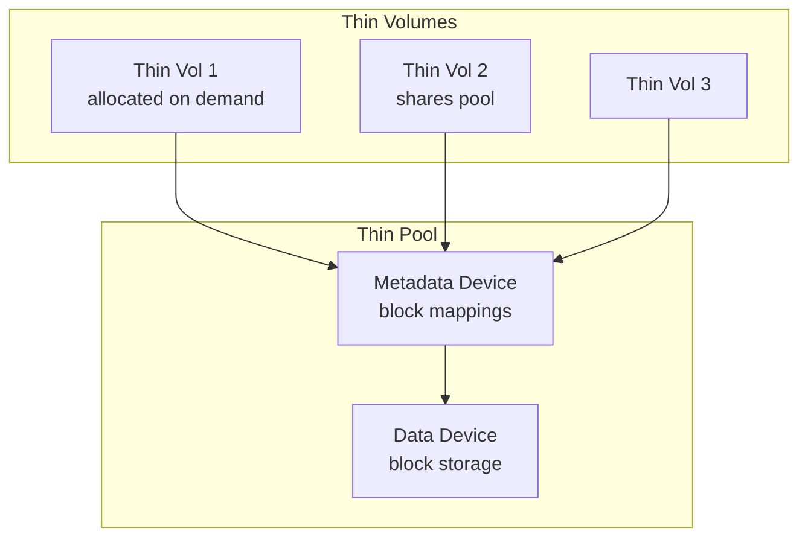
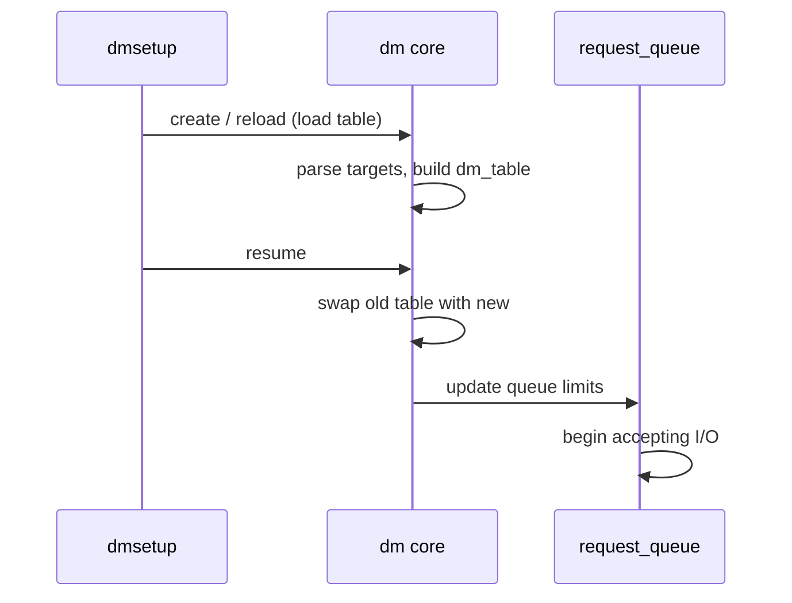
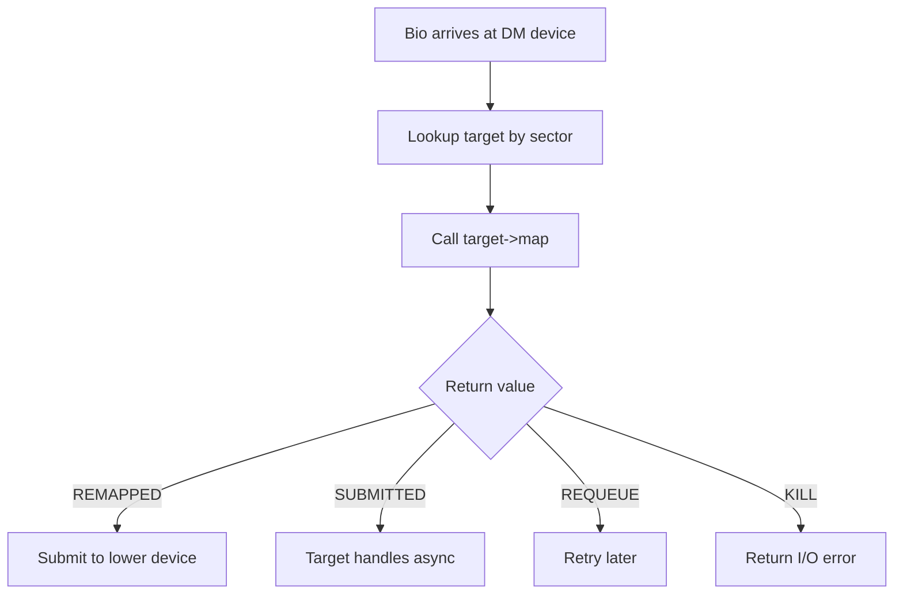
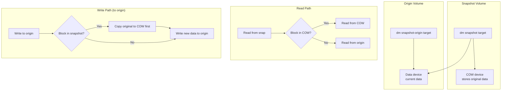
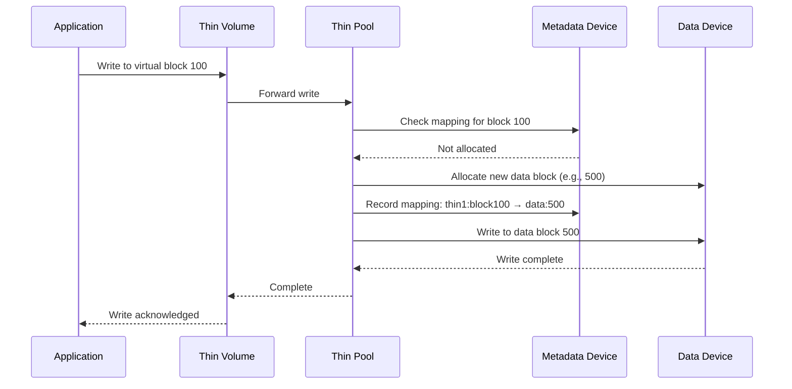
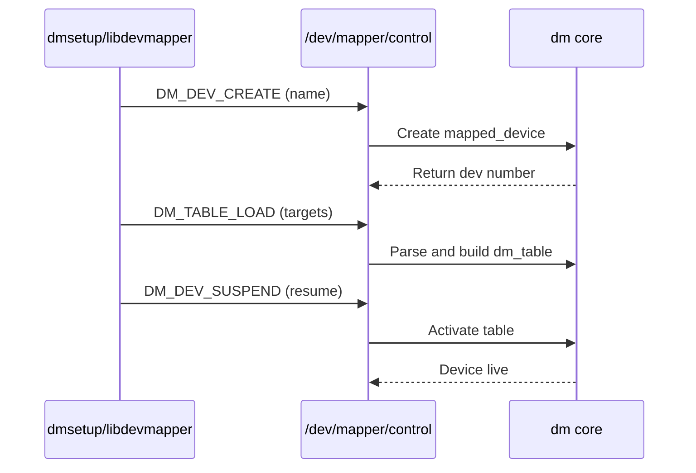
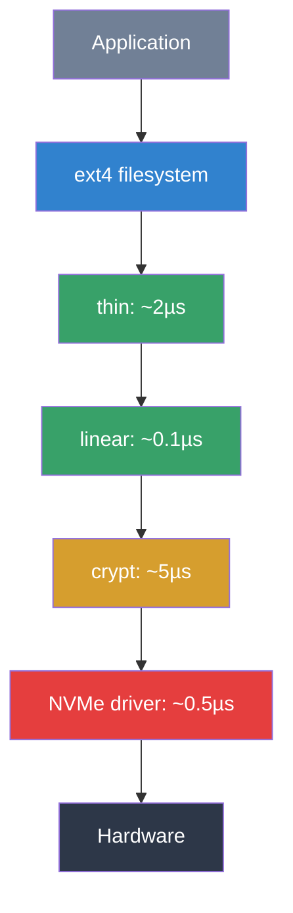
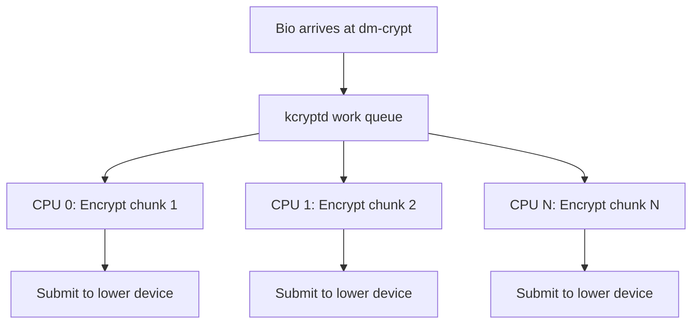

# Device Mapper

The **device mapper** (DM) is a kernel framework that creates virtual
block devices by mapping I/O to underlying (lower-level) block devices.
It is the foundation for LVM (Logical Volume Manager), dm-crypt (full-disk
encryption), dm-verity (integrity), and many other storage technologies.

---

## 1. Overview

A device-mapper device consists of:

1. A **table** that maps ranges of virtual sectors to ranges on
   underlying devices.
2. One or more **targets** that implement the mapping logic.

```mermaid
graph TD
    subgraph "User Space"
        DMSETUP[dmsetup]
        LVM[lvm2]
    end
    subgraph "Device Mapper"
        DM[dm core]
        TABLE[dm_table]
        TGT[dm_target]
    end
    subgraph "Targets"
        LIN[linear]
        STR[striped]
        CRYPT[crypt]
        MIRR[mirror]
        THIN[thin]
        RAID[raid]
    end
    subgraph "Lower Devices"
        D1[/dev/sda1]
        D2[/dev/sdb1]
    end
    DMSETUP --> DM
    LVM --> DM
    DM --> TABLE
    TABLE --> TGT
    TGT --> LIN & STR & CRYPT & MIRR & THIN & RAID
    LIN --> D1
    STR --> D1 & D2
    CRYPT --> D1
```

---

## 2. DM Table

A DM table is an array of **target entries**, each mapping a contiguous
range of virtual sectors to a target type and its constructor arguments.

### Table Format (from `dmsetup table`)

```text
$ dmsetup table my_vg-my_lv
0 2097152 linear 8:1 0
```

Format: `<start_sector> <num_sectors> <target_type> <target_args...>`

Multiple entries create a composite device:

```text
0      1048576 linear /dev/sda 0
1048576 1048576 linear /dev/sdb 0
```

This maps the first 1 MiB sectors to `sda` and the next 1 MiB to `sdb`.

### Table Loading

```c
/* Kernel API: load a new table */
int dm_table_create(struct dm_table **result, fmode_t mode,
                    unsigned int num_targets, struct mapped_device *md);

/* Add a target */
int dm_table_add_target(struct dm_table *t, const char *type,
                        struct dm_target *tgt);
```

---

## 3. Targets

### 3.1 `linear` — Simple Concatenation

Maps virtual sectors to a single underlying device with an offset.

**Use case**: LVM linear volumes, basic concatenation.

```bash
# Create a linear mapping
echo "0 2097152 linear /dev/sda 0" | dmsetup create my_linear

# Use it
mkfs.ext4 /dev/mapper/my_linear
mount /dev/mapper/my_linear /mnt
```

**How it works**:

```c
static int linear_map(struct dm_target *ti, struct bio *bio)
{
    struct linear_c *lc = ti->private;
    bio_set_dev(bio, lc->dev->bdev);
    bio->bi_iter.bi_sector = linear_map_sector(ti,
                                bio->bi_iter.bi_sector);
    return DM_MAPIO_REMAPPED;
}
```

### 3.2 `striped` — RAID-0 Style Striping

Distributes I/O across multiple devices in stripes.

**Use case**: Performance aggregation across multiple disks.

```bash
echo "0 4194304 striped 2 128 /dev/sda 0 /dev/sdb 0" \
    | dmsetup create my_stripe
```

Arguments: `striped <num_stripes> <chunk_size> <dev1> <offset1> <dev2> <offset2> ...`

**How it works**:

```mermaid
graph LR
    subgraph "Virtual Device"
        V[0 → 4194304 sectors]
    end
    subgraph "Stripe Map"
        S0[Even stripes → sda]
        S1[Odd stripes → sdb]
    end
    subgraph "Physical"
        D1[/dev/sda]
        D2[/dev/sdb]
    end
    V --> S0 --> D1
    V --> S1 --> D2
```

### 3.3 `crypt` — Full-Disk Encryption (dm-crypt)

Encrypts all I/O transparently using a cipher and key.

**Use case**: LUKS full-disk encryption, Android metadata encryption.

```bash
# Open a LUKS volume
cryptsetup luksOpen /dev/sda2 my_encrypted

# Internally creates:
# dmsetup table my_encrypted
# 0 2097152 crypt aes-xts-plain64 <key> 0 /dev/sda2 0
```

**How it works**:

```c
static int crypt_map(struct dm_target *ti, struct bio *bio)
{
    struct crypt_config *cc = ti->private;

    /* Allocate clone, encrypt/decrypt, submit to lower device */
    struct dm_crypt_io *io = crypt_io_alloc(cc, bio, ...);

    if (bio_data_dir(bio) == WRITE)
        kcryptd_queue_crypt(io);   /* encrypt then submit */
    else
        kcryptd_queue_crypt(io);   /* read, decrypt, complete */

    return DM_MAPIO_SUBMITTED;
}
```

**Cipher modes**:

| Mode | Description |
|---|---|
| `aes-xts-plain64` | AES-XTS with 64-bit sector IV (standard) |
| `aes-cbc-essiv:sha256` | AES-CBC with ESSIV (legacy) |
| `adiantum` | For low-end CPUs without AES acceleration |

### 3.4 `mirror` — RAID-1 Mirroring

Maintains two or more copies of all data.

**Use case**: LVM mirror volumes, fault tolerance.

```bash
echo "0 2097152 mirror core 2 128 /dev/sda 0 /dev/sdb 0" \
    | dmsetup create my_mirror
```

**How it works**:

```mermaid
graph TD
    BIO[Write bio] --> MIRROR[dm mirror]
    MIRROR --> D1[/dev/sda<br/>primary]
    MIRROR --> D2[/dev/sdb<br/>secondary]
    D1 --> DONE[completion when<br/>both done]
    D2 --> DONE
```

Mirror also supports:
- **log device**: Tracks which regions are in-sync (avoids full resync)
- **region size**: Granularity of dirty tracking

### 3.5 `thin` — Thin Provisioning

Allocates blocks on demand from a shared pool. Allows overallocation.

**Use case**: LVM thin provisioning, snapshots, container storage.

```bash
# Create a thin pool
dmsetup create my_pool \
    --table "0 4194304 thin-pool /dev/sda 0 128 0 0"

# Create a thin volume
dmsetup create my_thin \
    --table "0 1048576 thin /dev/mapper/my_pool 0"
```

**Thin pool architecture**:



**Key features**:
- Blocks allocated only when written
- Snapshots are instant (copy-on-write)
- Pool can be expanded without downtime
- Discard (TRIM) returns blocks to the pool

### 3.6 `raid` — MD-RAID Integration

Wraps the kernel's MD (Multiple Devices) RAID subsystem.

```bash
echo "0 4194304 raid raid5 3 256 region_size 1024 \
    /dev/sda 0 /dev/sdb 0 /dev/sdc 0" \
    | dmsetup create my_raid
```

### 3.7 Other Targets

| Target | Purpose |
|---|---|
| `cache` | Block-level caching (bcache equivalent) |
| `writecache` | Write-back caching on fast device |
| `integrity` | Block integrity (DIF/DIX) |
| `delay` | Add artificial latency (testing) |
| `error` | Always return I/O error (testing) |
| `zero` | Return zeros on read, discard writes |
| `flakey` | Intermittent errors (testing) |
| `snapshot` | Legacy snapshot (use thin instead) |

---

## 4. `dmsetup` Command Reference

### Basic Operations

```bash
# Create a device
dmsetup create my_dev --table "0 2097152 linear /dev/sda 0"

# Show table
dmsetup table my_dev

# Show status
dmsetup status my_dev

# Remove a device
dmsetup remove my_dev

# Suspend (stop I/O)
dmsetup suspend my_dev

# Resume
dmsetup resume my_dev

# List all DM devices
dmsetup ls

# Reload a table (does not take effect until resume)
dmsetup reload my_dev --table "0 2097152 linear /dev/sdb 0"
dmsetup resume my_dev
```

### Load + Reload Sequence



---

## 5. Kernel Internals

### 5.1 `mapped_device`

The core structure representing a DM device:

```c
struct mapped_device {
    struct request_queue *queue;
    struct dm_table __rcu *map;
    struct gendisk *disk;
    /* ... */
};
```

### 5.2 Target Interface

Every target implements:

```c
struct target_type {
    const char *name;
    struct module *module;
    unsigned version[3];    /* major.minor.patch */

    /* Constructor: parse args, allocate private data */
    int (*ctr)(struct dm_target *ti, unsigned int argc, char **argv);

    /* Destructor */
    void (*dtr)(struct dm_target *ti);

    /* Map a bio to lower device(s) */
    int (*map)(struct dm_target *ti, struct bio *bio);

    /* Report status (for dmsetup status) */
    void (*status)(struct dm_target *ti, status_type_t type,
                   unsigned flags, char *result, unsigned maxlen);

    /* Iteration over devices used by this target */
    int (*iterate_devices)(struct dm_target *ti,
                           iterate_devices_callout_fn fn, void *data);
};
```

### 5.3 Bio Mapping

When a bio arrives at a DM device:

1. DM looks up the target for the bio's sector range.
2. Calls `target->map()`.
3. The target either:
   - **Remaps**: Sets `bio_set_dev()` to the lower device and returns
     `DM_MAPIO_REMAPPED`.
   - **Submits async**: Takes ownership and returns
     `DM_MAPIO_SUBMITTED`.
   - **Requeues**: Returns `DM_MAPIO_REQUEUE` to retry later.



---

## 6. LVM and Device Mapper

LVM is the primary user-space consumer of device mapper:

| LVM Concept | DM Equivalent |
|---|---|
| Physical Volume (PV) | Underlying block device |
| Volume Group (VG) | Collection of PVs |
| Logical Volume (LV) | DM device (`linear`, `striped`, `thin`, etc.) |
| Snapshot | DM `snapshot` or `thin` target |
| Thin Pool | DM `thin-pool` target |

```bash
# LVM commands create DM devices internally
lvcreate -L 10G -n my_lv my_vg
# Equivalent to:
# dmsetup create my_vg-my_lv --table "0 20971520 linear /dev/sda2 0"
```

---

## 7. Stacking Device Mapper Devices

DM devices can be stacked — one DM device can use another as its
underlying device:

```bash
# Layer 1: encryption
echo "0 2097152 crypt aes-xts-plain64 ..." | dmsetup create enc

# Layer 2: linear mapping on top of encrypted device
echo "0 2097152 linear /dev/mapper/enc 0" | dmsetup create top
```

This creates a two-level stack. LVM on top of LUKS is a common
real-world example.

---

## 8. Target Registration and Lifecycle

Each DM target registers itself with the DM core at module load time:

```c
/* drivers/md/dm-linear.c — simplified */
static struct target_type linear_target = {
    .name   = "linear",
    .version = {1, 4, 0},
    .module = THIS_MODULE,
    .ctr    = linear_ctr,        /* constructor */
    .dtr    = linear_dtr,        /* destructor */
    .map    = linear_map,        /* bio mapping */
    .status = linear_status,     /* status report */
    .iterate_devices = linear_iterate_devices,
};

static int __init dm_linear_init(void)
{
    return dm_register_target(&linear_target);
}

static void __exit dm_linear_exit(void)
{
    dm_unregister_target(&linear_target);
}
```

### Target Constructor Arguments

The constructor receives arguments parsed from the dmsetup command line:

```c
static int linear_ctr(struct dm_target *ti, unsigned int argc, char **argv)
{
    struct linear_c *lc;
    unsigned long long start;

    if (argc != 2) {
        ti->error = "Invalid argument count";
        return -EINVAL;
    }

    lc = kmalloc(sizeof(*lc), GFP_KERNEL);
    if (!lc) {
        ti->error = "Cannot allocate linear context";
        return -ENOMEM;
    }

    /* argv[0] = path to underlying device */
    if (dm_get_device(ti, argv[0], dm_table_get_mode(ti->table),
                      &lc->dev)) {
        ti->error = "Device lookup failed";
        kfree(lc);
        return -EINVAL;
    }

    /* argv[1] = starting sector on underlying device */
    if (kstrtoull(argv[1], 10, &start)) {
        ti->error = "Invalid start sector";
        dm_put_device(ti, lc->dev);
        kfree(lc);
        return -EINVAL;
    }

    lc->start = (sector_t)start;
    ti->private = lc;
    return 0;
}
```

---

## 9. Snapshot Internals

The `snapshot` and `snapshot-origin` targets implement copy-on-write
snapshots. While thin provisioning has largely replaced legacy snapshots,
understanding the mechanism is valuable.

### 9.1 Snapshot Architecture



### 9.2 Exception Store

Snapshots use an **exception store** to track which blocks have been
copied to the COW device:

```c
/* drivers/md/dm-exception-store.h */
struct dm_exception_store_type {
    const char *name;
    struct module *module;

    /* Allocate and initialize exception store */
    int (*ctr)(struct dm_exception_store *store,
              unsigned argc, char **argv);

    /* Record that chunk 'old' on origin is now at 'new' on COW */
    int (*prepare_exception)(struct dm_exception_store *store,
                             struct dm_exception *e);

    /* Commit the exception (persist to disk) */
    void (*commit_exception)(struct dm_exception *e, int valid,
                             void (*callback)(void *, int), void *cb_data);

    /* Query: is this chunk in the snapshot? */
    int (*lookup_exception)(struct dm_exception_store *store,
                            chunk_t chunk, chunk_t *result);
};
```

Two store types exist:
- **P (Persistent)**: Survives reboot, stored on COW device
- **N (Transient)**: Lost on reboot (useful for temporary snapshots)

---

## 10. Thin Provisioning Internals

### 10.1 Thin Pool Metadata

The thin pool manages two devices:
- **Metadata device**: Stores mapping information (B-tree of block mappings)
- **Data device**: Stores actual data blocks

```c
/* drivers/md/dm-thin.c — key structures */
struct thin_c {
    struct dm_dev *pool_dev;       /* thin pool device */
    struct dm_dev *origin_dev;     /* optional origin */
    dm_thin_id dev_id;             /* thin device ID within pool */
    struct mapped_device *md;
};

struct pool {
    struct dm_thin_disk_super *sb;  /* superblock */
    struct dm_block_manager *bm;    /* metadata block manager */
    struct dm_pool_metadata *pmd;   /* pool metadata */
    struct dm_bio_prison *prison;   /* bio lock for in-progress ops */
    struct dm_deferred_set *shared_read_ds;
    struct dm_deferred_set *shared_ds;
    /* ... */
};
```

### 10.2 Thin Provisioning Data Flow



### 10.3 Discard Handling

Thin pools can return blocks to the free pool when the guest issues
TRIM/UNMAP:

```bash
# Enable discard pass-through
$ dmsetup table my_thin
0 1048576 thin /dev/mapper/my_pool 0

# Check discard support
$ cat /sys/block/dm-0/queue/discard_max_bytes
2199023255040

# The thin pool discards unused blocks
$ dmsetup status my_pool
0 4194304 thin-pool 253:0 253:1 128 0 1 4294967295 rw —
# Format: ... nr_blocks nr_free_blocks held_metadata_read_write ...
```

---

## 11. Device Mapper Events

DM devices can send events to user space when significant changes occur
(pool full, snapshot overflow, etc.).

### 11.1 Event Mechanism

```c
/* drivers/md/dm.c */
void dm_table_event(struct dm_table *t)
{
    /* Wake up processes waiting on /dev/mapper/<name> */
    wake_up(&t->eventq);
}

/* User space can poll/select on the DM device fd */
int fd = open("/dev/mapper/my_pool", O_RDONLY);
struct pollfd pfd = { .fd = fd, .events = POLLPRI };

while (1) {
    poll(&pfd, 1, -1);
    if (pfd.revents & POLLPRI) {
        /* Event occurred — check dmsetup status */
        system("dmsetup status my_pool");
    }
}
```

### 11.2 Pool Event Messages

```bash
# Thin pool status includes event flags
$ dmsetup status my_pool
0 4194304 thin-pool 253:0 253:1 128 0 0 0 rw —
# Last fields: needs_check(0/1) ro(0/1) error_count(0+)
# If "needs_check" is 1: pool requires repair
# If "ro" is 1: pool is read-only (out of space or metadata error)

# Monitor for events
$ dmsetup wait my_pool
# Blocks until an event occurs
$ dmsetup wait my_pool --event_nr 5
# Waits for event counter to reach 5
```

---

## 12. Sysfs Hierarchy

DM devices expose information through sysfs:

```bash
# DM device sysfs structure
/sys/block/dm-N/              # Block device attributes
/sys/devices/virtual/block/dm-N/
  ├── holders/                # Upper-level DM devices
  ├── slaves/                 # Lower-level devices
  ├── dm/
  │   ├── name               # DM device name
  │   ├── uuid               # DM device UUID
  │   ├── suspended          # 1 if suspended
  │   └── use_blk_mq         # 1 if using blk-mq
  └── queue/                  # Standard block queue attributes

# Check DM device name
$ cat /sys/block/dm-0/dm/name
my_vg-my_lv

# Check DM device UUID
$ cat /sys/block/dm-0/dm/uuid
LVM-abc123def456

# Check if suspended
$ cat /sys/block/dm-0/dm/suspended
0

# Show device dependencies
$ ls /sys/block/dm-0/slaves/
sda2
$ ls /sys/block/sda2/holders/
dm-0  dm-1
```

---

## 13. Device Mapper ioctl Interface

The primary user-space interface is through `ioctl()` on `/dev/mapper/control`:

```c
/* include/uapi/linux/dm-ioctl.h */
struct dm_ioctl {
    __u32 version[3];          /* DM_VERSION */
    __u32 data_size;           /* Total size of this struct */
    __u32 data_start;          /* Offset to data from start */
    __u32 target_count;        /* Number of targets */
    __s32 open_count;          /* Open count */
    __u32 flags;               /* DM_* flags */
    __u32 event_nr;            /* Event counter */
    __u32 padding;
    __u64 dev;                 /* Device number */
    char name[DM_NAME_LEN];    /* Device name */
    char uuid[DM_UUID_LEN];    /* Device UUID */
    /* ... */
};

/* Key ioctl commands */
#define DM_VERSION       _IOWR(DM_IOCTL, 0, struct dm_ioctl)
#define DM_REMOVE_ALL    _IOWR(DM_IOCTL, 1, struct dm_ioctl)
#define DM_LIST_DEVICES  _IOWR(DM_IOCTL, 2, struct dm_ioctl)
#define DM_DEV_CREATE    _IOWR(DM_IOCTL, 3, struct dm_ioctl)
#define DM_DEV_REMOVE    _IOWR(DM_IOCTL, 4, struct dm_ioctl)
#define DM_DEV_RENAME    _IOWR(DM_IOCTL, 5, struct dm_ioctl)
#define DM_DEV_SUSPEND   _IOWR(DM_IOCTL, 6, struct dm_ioctl)
#define DM_DEV_STATUS    _IOWR(DM_IOCTL, 7, struct dm_ioctl)
#define DM_TABLE_LOAD    _IOWR(DM_IOCTL, 9, struct dm_ioctl)
#define DM_TABLE_CLEAR   _IOWR(DM_IOCTL, 10, struct dm_ioctl)
#define DM_TABLE_DEPS    _IOWR(DM_IOCTL, 11, struct dm_ioctl)
#define DM_TABLE_STATUS  _IOWR(DM_IOCTL, 12, struct dm_ioctl)
```



---

## 14. Error Handling and Device Failure

DM targets handle errors in several ways:

### 14.1 Error Target

The `error` target always returns I/O errors:

```bash
# Create a device that always fails
$ echo "0 1048576 error" | dmsetup create /dev/mapper/broken

# Any I/O to /dev/mapper/broken returns -EIO
$ dd if=/dev/mapper/zero of=/dev/null bs=4k count=1
dd: error reading '/dev/mapper/broken': Input/output error
```

### 14.2 Handling Target Errors

When a target encounters an error, it can:

```c
static int my_map(struct dm_target *ti, struct bio *bio)
{
    /* Option 1: Return DM_MAPIO_KILL — bio gets -EIO */
    bio_io_error(bio);
    return DM_MAPIO_KILL;

    /* Option 2: Return DM_MAPIO_REQUEUE — retry later */
    return DM_MAPIO_REQUEUE;

    /* Option 3: Return DM_MAPIO_REMAPPED — pass to lower device */
    bio_set_dev(bio, lower_bdev);
    return DM_MAPIO_REMAPPED;
}
```

### 14.3 dm-verity Error Handling

`dm-verity` (used for Android verified boot) detects data corruption:

```bash
# dm-verity with error handling
$ veritysetup format /dev/sda1 /dev/sdb1
# Creates hash tree on sdb1 for data on sda1

# On verification failure:
# - "restart" mode: reboot device
# - "corrupt" mode: return -EIO
# - custom error handler: trigger repair
```

---

## 15. Performance Characteristics

### 15.1 Overhead per Target Type

| Target | Overhead per I/O | Notes |
|---|---|---|
| linear | ~0.1 µs | Simple sector arithmetic |
| striped | ~0.2 µs | Stripe calculation + dispatch |
| mirror | ~0.5 µs | Write duplication, read failover |
| crypt | ~2-50 µs | Depends on cipher + HW accel |
| thin | ~1-3 µs | Metadata lookup + allocation |
| raid | ~1-2 µs | Parity calculation for writes |

### 15.2 Stacking Overhead

Each DM layer adds overhead. A typical LVM-on-LUKS stack:



Total overhead: ~8 µs per I/O (vs ~0.5 µs for direct NVMe access).
This is negligible for sequential I/O but measurable for 4K random
reads at high IOPS.

---

## 16. dm-crypt Performance Optimization

dm-crypt has several tunables for performance:

```bash
# Check current cipher and key
$ dmsetup table --showkeys my_encrypted
0 2097152 crypt aes-xts-plain64 <hex_key> 0 /dev/sda2 0

# Number of encryption threads (kernel parameter)
$ cat /sys/module/dm_crypt/parameters/num_cpus
0  # 0 = auto (uses all CPUs)

# Submit from crypt threads (reduces latency by offloading)
$ cat /sys/module/dm_crypt/parameters/submit_from_crypt_cpus
0  # 0 = no, 1 = yes

# Large write bios improve throughput
$ cat /sys/block/dm-0/queue/max_sectors_kb
128
```

### Multi-threaded Encryption



---

## Further Reading

- [GNU Project Documentation](https://www.gnu.org/doc/doc.html)
- [GNU Manuals](https://www.gnu.org/manual/manual.html)
- [Free Software Directory](https://directory.fsf.org/wiki/Main_Page)
- [Planet GNU](https://planet.gnu.org/)
- [Free Software Books](https://www.gnu.org/doc/other-free-books.html)

- [Linux kernel docs — Device Mapper](https://docs.kernel.org/admin-guide/device-mapper/index.html)
- [kernel.org — drivers/md/dm.c](https://git.kernel.org/pub/scm/linux/kernel/git/torvalds/linux.git/tree/drivers/md/dm.c)
- [LWN: The device mapper](https://lwn.net/Articles/135208/)
- [Red Hat — Device Mapper documentation](https://access.redhat.com/documentation/en-us/red_hat_enterprise_linux/9/html/managing_storage_devices/assembly_using-the-device-mapper_managing-storage-devices)
- [dm-crypt wiki](https://wiki.archlinux.org/title/Dm-crypt)

## Related Topics

- [Block Layer Overview](overview.md) — where DM sits in the I/O stack
- [Bio Structures](bio.md) — how DM remaps bios
- [Block Devices](devices.md) — gendisk for DM devices
- [Request Queues](request-queues.md) — DM's request queue setup
- [Kernel APIs](../apis.md) — memory allocation and bio APIs
