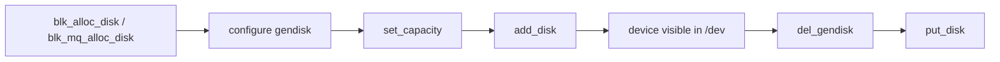
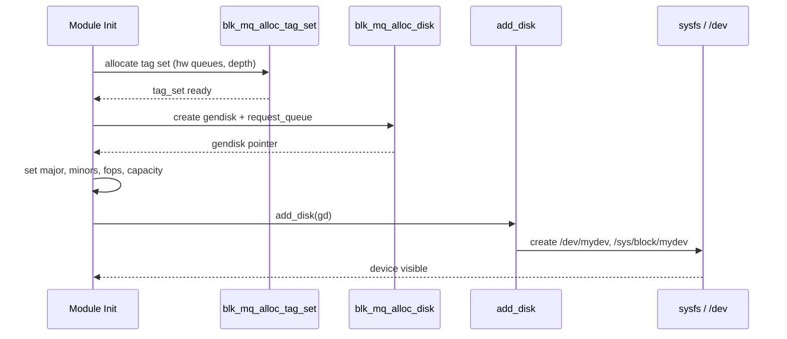

# Block Devices

A **block device** in Linux is a storage device that exposes data as
addressable blocks (sectors) — as opposed to character devices which
provide a byte stream. Hard drives, SSDs, NVMe drives, loop devices,
and RAM disks are all block devices.

This chapter covers how block devices are represented in the kernel,
how major and minor numbers work, and how drivers register block devices
using the `gendisk` structure.

---

## 1. Major and Minor Numbers

Every block device is identified by a pair of numbers:

| Number | Purpose | Range |
|---|---|---|
| **Major** | Identifies the driver | 0–511 (dynamic allocation preferred) |
| **Minor** | Identifies a specific device instance within the driver | 0–2²⁰−1 (with `ext_dev_t`) |

### Viewing Device Numbers

```bash
$ ls -la /dev/sda /dev/nvme0n1
brw-rw---- 1 root disk 8,  0 Jul 21 10:00 /dev/sda
brw-rw---- 1 root disk 259, 0 Jul 21 10:00 /dev/nvme0n1

$ cat /proc/partitions
major minor  #blocks  name

   8        0  488386584 sda
   8        1     512000 sda1
   8        2  487872512 sda2
 259        0  500107608 nvme0n1
```

Major number **8** is the SCSI disk driver (`sd`). Major **259** is
typically NVMe (dynamically allocated).

### Registration Types

```c
/* Static — choose your own major number (legacy) */
register_blkdev(MY_MAJOR, "mydev");

/* Dynamic — let the kernel assign one */
int major = register_blkdev(0, "mydev");
```

---

## 2. The `gendisk` Structure

The `gendisk` (generic disk) is the central representation of a block
device in the kernel:

```c
struct gendisk {
    int major;                  /* major number */
    int first_minor;            /* first minor number */
    int minors;                 /* max number of minors (partitions + 1) */
    char disk_name[DISK_NAME_LEN];  /* e.g., "sda" */
    struct block_device_operations *fops;
    struct request_queue *queue;
    void *private_data;
    struct blk_mq_tag_set *tag_set;
    /* ... */
};
```

### Lifecycle



---

## 3. `block_device_operations`

The `block_device_operations` structure defines the driver's callbacks
for device-level operations (analogous to `file_operations` for character
devices):

```c
static const struct block_device_operations my_block_ops = {
    .open       = my_block_open,
    .release    = my_block_release,
    .ioctl      = my_block_ioctl,
    .getgeo     = my_block_getgeo,
    .owner      = THIS_MODULE,
};
```

### Common Callbacks

| Callback | Purpose |
|---|---|
| `open` | Called when the device is opened |
| `release` | Called when the last reference is dropped |
| `ioctl` | Handle device-specific ioctl commands |
| `getgeo` | Return geometry (cylinders/heads/sectors) for legacy tools |
| `rw_page` | Optimized single-page I/O (bypasses bio) |
| `report_zones` | Zoned block device zone information |
| `submit_bio` | **Overridden** for drivers that handle bio directly |

### Example: `open` / `release`

```c
static int my_block_open(struct block_device *bdev, fmode_t mode)
{
    pr_info("mydev: opened\n");
    return 0;
}

static void my_block_release(struct gendisk *gd, fmode_t mode)
{
    pr_info("mydev: released\n");
}
```

---

## 4. Registering a Block Device

### 4.1 Full Example: Virtual RAM Disk

```c
#include <linux/module.h>
#include <linux/blkdev.h>
#include <linux/blk-mq.h>
#include <linux/hdreg.h>

#define MY_MAJOR        0   /* dynamic */
#define MY_MINORS       1
#define SECTOR_SIZE     512
#define NUM_SECTORS     2048   /* 1 MiB disk */

static struct my_dev {
    unsigned char       *data;
    struct gendisk      *gd;
    struct blk_mq_tag_set   tag_set;
} mydev;

/* ---- request handling ---- */
static blk_status_t my_queue_rq(struct blk_mq_hw_ctx *hctx,
                                const struct blk_mq_queue_data *bd)
{
    struct request *rq = bd->rq;
    struct bio *bio;
    sector_t sector = blk_rq_pos(rq);

    blk_mq_start_request(rq);

    __rq_for_each_bio(bio, rq) {
        struct bio_vec bvec;
        struct bvec_iter iter;

        bio_for_each_segment(bvec, bio, iter) {
            void *page_addr = page_address(bvec.bv_page);
            size_t offset = bvec.bv_offset;
            size_t len = bvec.bv_len;
            size_t dev_off = (size_t)sector * SECTOR_SIZE;

            if (bio_data_dir(bio) == READ)
                memcpy(page_addr + offset,
                       mydev.data + dev_off, len);
            else
                memcpy(mydev.data + dev_off,
                       page_addr + offset, len);

            sector += len / SECTOR_SIZE;
        }
    }

    blk_mq_end_request(rq, BLK_STS_OK);
    return BLK_STS_OK;
}

static const struct blk_mq_ops my_mq_ops = {
    .queue_rq = my_queue_rq,
};

static const struct block_device_operations my_fops = {
    .owner  = THIS_MODULE,
};

/* ---- module init/exit ---- */
static int __init my_init(void)
{
    int ret;

    mydev.data = kvzalloc(NUM_SECTORS * SECTOR_SIZE, GFP_KERNEL);
    if (!mydev.data)
        return -ENOMEM;

    mydev.tag_set.ops = &my_mq_ops;
    mydev.tag_set.nr_hw_queues = 1;
    mydev.tag_set.queue_depth = 128;
    mydev.tag_set.numa_node = NUMA_NO_NODE;
    mydev.tag_set.cmd_size = 0;
    mydev.tag_set.flags = BLK_MQ_F_SHOULD_MERGE;
    mydev.tag_set.driver_data = &mydev;

    ret = blk_mq_alloc_tag_set(&mydev.tag_set);
    if (ret)
        goto err_free;

    mydev.gd = blk_mq_alloc_disk(&mydev.tag_set, &mydev);
    if (IS_ERR(mydev.gd)) {
        ret = PTR_ERR(mydev.gd);
        goto err_tag;
    }

    mydev.gd->major = MY_MAJOR;
    mydev.gd->first_minor = 0;
    mydev.gd->minors = MY_MINORS;
    mydev.gd->fops = &my_fops;
    strscpy(mydev.gd->disk_name, "mydev",
            sizeof(mydev.gd->disk_name));
    set_capacity(mydev.gd, NUM_SECTORS);

    ret = add_disk(mydev.gd);
    if (ret)
        goto err_disk;

    pr_info("mydev: registered with %d sectors\n", NUM_SECTORS);
    return 0;

err_disk:
    put_disk(mydev.gd);
err_tag:
    blk_mq_free_tag_set(&mydev.tag_set);
err_free:
    kvfree(mydev.data);
    return ret;
}

static void __exit my_exit(void)
{
    del_gendisk(mydev.gd);
    put_disk(mydev.gd);
    blk_mq_free_tag_set(&mydev.tag_set);
    kvfree(mydev.data);
    pr_info("mydev: unregistered\n");
}

module_init(my_init);
module_exit(my_exit);
MODULE_LICENSE("GPL");
```

### 4.2 Registration Flow



---

## 5. Partition Handling

When `add_disk()` is called with a `minors` count > 1, the kernel
automatically scans the device's partition table (MBR or GPT) and creates
partition sub-devices:

```bash
$ ls /dev/mydev*
/dev/mydev  /dev/mydev1  /dev/mydev2
```

The `minors` field controls the maximum number of partitions:

- `minors = 1` → no partitions (the whole disk is the only device)
- `minors = 16` → up to 15 partitions (minor 0 = whole disk)

Drivers can disable partition scanning by calling `set_capacity_revalidate_and_notify()` or by
setting the `GENHD_FL_NO_PART` flag.

---

## 6. sysfs Integration

Every registered block device appears under `/sys/block/`:

```bash
$ ls /sys/block/sda/
alignment_offset  discard_alignment  holders  inflight
queue/             range              removable  ro
size               slaves             stat       subsystem
uevent
```

Key files:

| File | Content |
|---|---|
| `size` | Device size in 512-byte sectors |
| `ro` | 0 = read-write, 1 = read-only |
| `queue/scheduler` | Active I/O scheduler |
| `queue/nr_requests` | Maximum queued requests |
| `queue/hw_sector_size` | Hardware sector size |
| `stat` | I/O statistics (reads, writes, ticks, etc.) |

---

## 7. Device Numbers in Detail

### Historical vs Modern

In older kernels, `dev_t` was 16 bits (12 major + 4 minor). Modern
kernels use `dev_t = 32 bits` with `MINORBITS = 20`:

```c
#define MINORBITS   20
#define MAJOR(dev)  ((unsigned int)((dev) >> MINORBITS))
#define MINOR(dev)  ((unsigned int)((dev) & ((1 << MINORBITS) - 1)))
#define MKDEV(ma,mi) (((ma) << MINORBITS) | (mi))
```

### Dynamic Major Allocation

```c
int major = register_blkdev(0, "myblock");
if (major < 0) {
    pr_err("failed to register block device\n");
    return major;
}
/* major is now assigned by the kernel */
```

When the module is unloaded, call `unregister_blkdev(major, "myblock")`.

---

## 8. Comparing Block and Character Devices

| Aspect | Block Device | Character Device |
|---|---|---|
| Data unit | Sectors / blocks | Bytes |
| Caching | Page cache, readahead | None (usually) |
| Primary structure | `gendisk` | `cdev` |
| Operations | `block_device_operations` | `file_operations` |
| Examples | /dev/sda, /dev/loop0 | /dev/ttyS0, /dev/null |
| Registration | `add_disk()` | `cdev_add()` |

---

## 9. Request-Based vs Bio-Based Drivers

Most drivers use the **request-based** model via `blk-mq`, where the
block layer queues and schedules bios into requests, and the driver's
`queue_rq()` processes complete requests.

Alternatively, a driver can override `submit_bio` in
`block_device_operations` to handle bios directly (bypassing the
scheduler). This is used by device-mapper and some virtual block
devices.

```c
/* Bio-based driver (rare) */
static const struct block_device_operations my_fops = {
    .submit_bio = my_submit_bio,
    .owner      = THIS_MODULE,
};
```

---

## 10. Hot-Pluggable Block Devices

USB mass storage and virtio-blk support hot-plug/unplug. The driver
must handle the device disappearing at any time:

1. Stop accepting new requests.
2. Complete all in-flight requests with `BLK_STS_IOERR`.
3. Call `del_gendisk()` to remove the device.
4. Clean up resources.

---

## Further Reading

- [Linux kernel docs — Block devices](https://docs.kernel.org/block/index.html)
- [Linux kernel docs — gendisk API](https://docs.kernel.org/block/blk-mq.html)
- [LWN: The gendisk interface](https://lwn.net/Articles/339021/)
- [Linux Device Drivers, 3rd Ed — Block Drivers](https://lwn.net/Kernel/LDD3/)
- [kernel.org — block/blk-core.c source](https://git.kernel.org/pub/scm/linux/kernel/git/torvalds/linux.git/tree/block/blk-core.c)

## Related Topics

- [Block Layer Overview](overview.md) — architecture and I/O path
- [Bio Structures](bio.md) — bio allocation and completion
- [I/O Schedulers](io-schedulers.md) — scheduling policies
- [Request Queues](request-queues.md) — blk-mq internals
- [Character Devices](../drivers/char-devices.md) — the other device type
- [Device Mapper](device-mapper.md) — virtual block device framework
