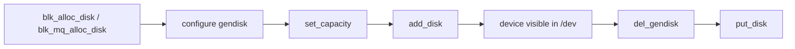
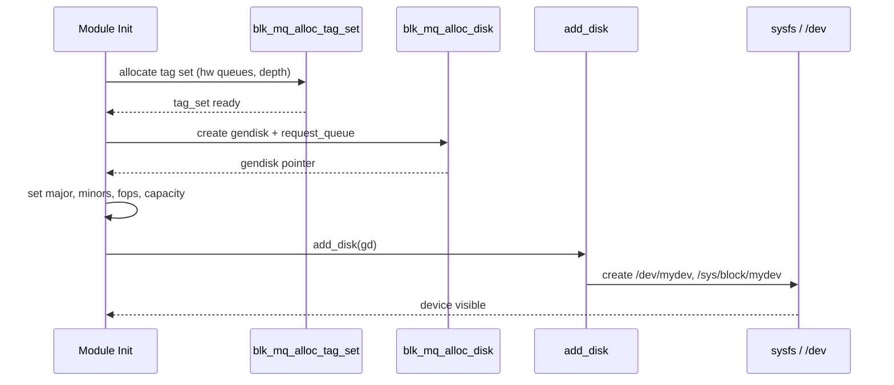
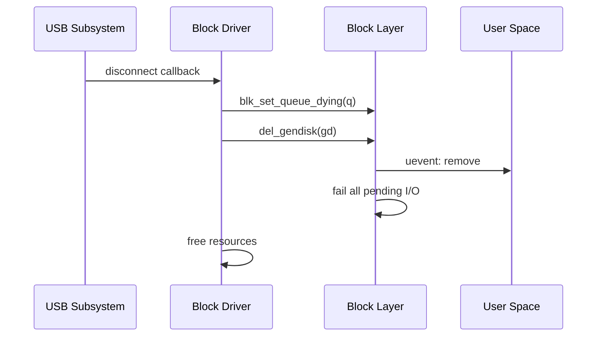
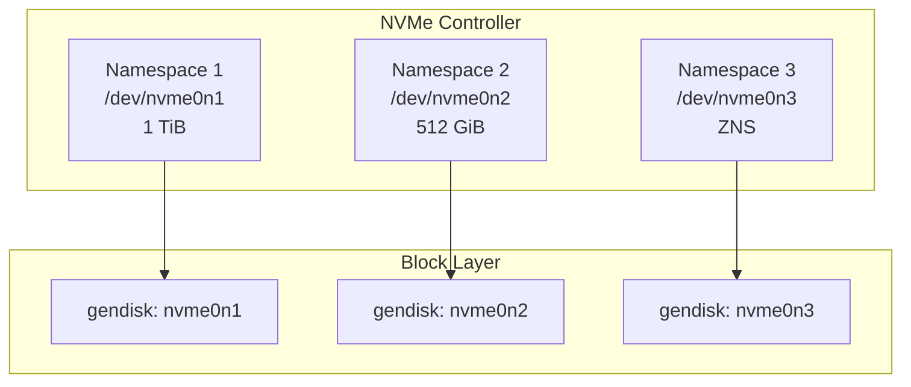
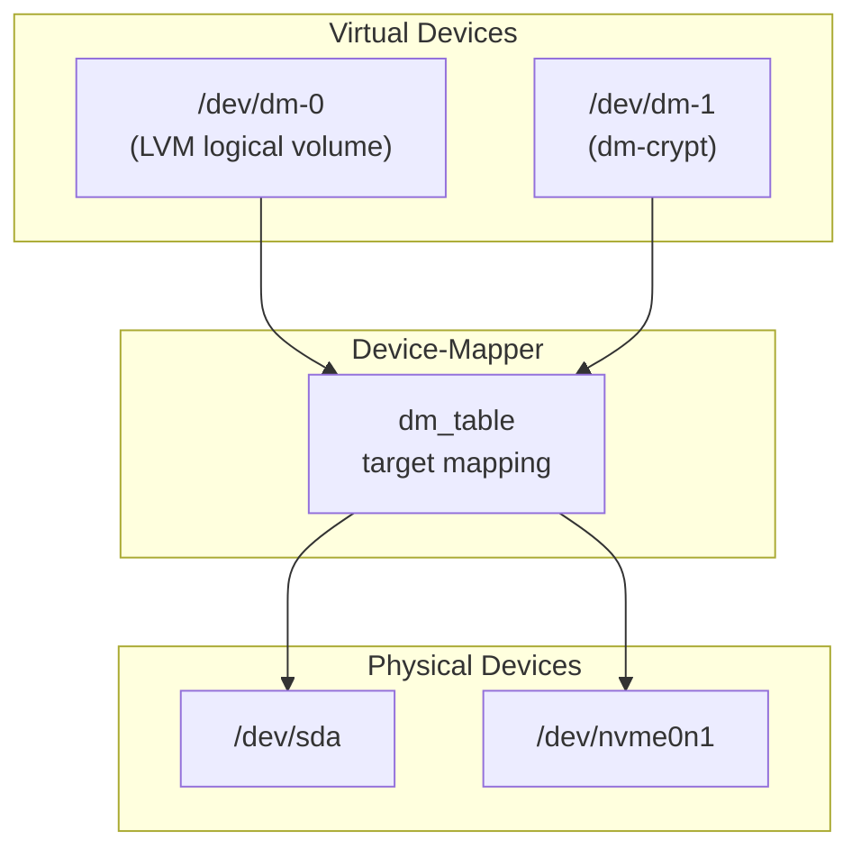

# Block Devices

A **block device** in Linux is a storage device that exposes data as
addressable blocks (sectors) — as opposed to character devices which
provide a byte stream. Hard drives, SSDs, NVMe drives, loop devices,
and RAM disks are all block devices.

This chapter covers how block devices are represented in the kernel,
how major and minor numbers work, and how drivers register block devices
using the `gendisk` structure.

---

## 1. Major and Minor Numbers

Every block device is identified by a pair of numbers:

| Number | Purpose | Range |
|---|---|---|
| **Major** | Identifies the driver | 0–511 (dynamic allocation preferred) |
| **Minor** | Identifies a specific device instance within the driver | 0–2²⁰−1 (with `ext_dev_t`) |

### Viewing Device Numbers

```bash
$ ls -la /dev/sda /dev/nvme0n1
brw-rw---- 1 root disk 8,  0 Jul 21 10:00 /dev/sda
brw-rw---- 1 root disk 259, 0 Jul 21 10:00 /dev/nvme0n1

$ cat /proc/partitions
major minor  #blocks  name

   8        0  488386584 sda
   8        1     512000 sda1
   8        2  487872512 sda2
 259        0  500107608 nvme0n1
```

Major number **8** is the SCSI disk driver (`sd`). Major **259** is
typically NVMe (dynamically allocated).

### Registration Types

```c
/* Static — choose your own major number (legacy) */
register_blkdev(MY_MAJOR, "mydev");

/* Dynamic — let the kernel assign one */
int major = register_blkdev(0, "mydev");
```

---

## 2. The `gendisk` Structure

The `gendisk` (generic disk) is the central representation of a block
device in the kernel:

```c
struct gendisk {
    int major;                  /* major number */
    int first_minor;            /* first minor number */
    int minors;                 /* max number of minors (partitions + 1) */
    char disk_name[DISK_NAME_LEN];  /* e.g., "sda" */
    struct block_device_operations *fops;
    struct request_queue *queue;
    void *private_data;
    struct blk_mq_tag_set *tag_set;
    /* ... */
};
```

### Lifecycle



---

## 3. `block_device_operations`

The `block_device_operations` structure defines the driver's callbacks
for device-level operations (analogous to `file_operations` for character
devices):

```c
static const struct block_device_operations my_block_ops = {
    .open       = my_block_open,
    .release    = my_block_release,
    .ioctl      = my_block_ioctl,
    .getgeo     = my_block_getgeo,
    .owner      = THIS_MODULE,
};
```

### Common Callbacks

| Callback | Purpose |
|---|---|
| `open` | Called when the device is opened |
| `release` | Called when the last reference is dropped |
| `ioctl` | Handle device-specific ioctl commands |
| `getgeo` | Return geometry (cylinders/heads/sectors) for legacy tools |
| `rw_page` | Optimized single-page I/O (bypasses bio) |
| `report_zones` | Zoned block device zone information |
| `submit_bio` | **Overridden** for drivers that handle bio directly |

### Example: `open` / `release`

```c
static int my_block_open(struct block_device *bdev, fmode_t mode)
{
    pr_info("mydev: opened\n");
    return 0;
}

static void my_block_release(struct gendisk *gd, fmode_t mode)
{
    pr_info("mydev: released\n");
}
```

---

## 4. Registering a Block Device

### 4.1 Full Example: Virtual RAM Disk

```c
#include <linux/module.h>
#include <linux/blkdev.h>
#include <linux/blk-mq.h>
#include <linux/hdreg.h>

#define MY_MAJOR        0   /* dynamic */
#define MY_MINORS       1
#define SECTOR_SIZE     512
#define NUM_SECTORS     2048   /* 1 MiB disk */

static struct my_dev {
    unsigned char       *data;
    struct gendisk      *gd;
    struct blk_mq_tag_set   tag_set;
} mydev;

/* ---- request handling ---- */
static blk_status_t my_queue_rq(struct blk_mq_hw_ctx *hctx,
                                const struct blk_mq_queue_data *bd)
{
    struct request *rq = bd->rq;
    struct bio *bio;
    sector_t sector = blk_rq_pos(rq);

    blk_mq_start_request(rq);

    __rq_for_each_bio(bio, rq) {
        struct bio_vec bvec;
        struct bvec_iter iter;

        bio_for_each_segment(bvec, bio, iter) {
            void *page_addr = page_address(bvec.bv_page);
            size_t offset = bvec.bv_offset;
            size_t len = bvec.bv_len;
            size_t dev_off = (size_t)sector * SECTOR_SIZE;

            if (bio_data_dir(bio) == READ)
                memcpy(page_addr + offset,
                       mydev.data + dev_off, len);
            else
                memcpy(mydev.data + dev_off,
                       page_addr + offset, len);

            sector += len / SECTOR_SIZE;
        }
    }

    blk_mq_end_request(rq, BLK_STS_OK);
    return BLK_STS_OK;
}

static const struct blk_mq_ops my_mq_ops = {
    .queue_rq = my_queue_rq,
};

static const struct block_device_operations my_fops = {
    .owner  = THIS_MODULE,
};

/* ---- module init/exit ---- */
static int __init my_init(void)
{
    int ret;

    mydev.data = kvzalloc(NUM_SECTORS * SECTOR_SIZE, GFP_KERNEL);
    if (!mydev.data)
        return -ENOMEM;

    mydev.tag_set.ops = &my_mq_ops;
    mydev.tag_set.nr_hw_queues = 1;
    mydev.tag_set.queue_depth = 128;
    mydev.tag_set.numa_node = NUMA_NO_NODE;
    mydev.tag_set.cmd_size = 0;
    mydev.tag_set.flags = BLK_MQ_F_SHOULD_MERGE;
    mydev.tag_set.driver_data = &mydev;

    ret = blk_mq_alloc_tag_set(&mydev.tag_set);
    if (ret)
        goto err_free;

    mydev.gd = blk_mq_alloc_disk(&mydev.tag_set, &mydev);
    if (IS_ERR(mydev.gd)) {
        ret = PTR_ERR(mydev.gd);
        goto err_tag;
    }

    mydev.gd->major = MY_MAJOR;
    mydev.gd->first_minor = 0;
    mydev.gd->minors = MY_MINORS;
    mydev.gd->fops = &my_fops;
    strscpy(mydev.gd->disk_name, "mydev",
            sizeof(mydev.gd->disk_name));
    set_capacity(mydev.gd, NUM_SECTORS);

    ret = add_disk(mydev.gd);
    if (ret)
        goto err_disk;

    pr_info("mydev: registered with %d sectors\n", NUM_SECTORS);
    return 0;

err_disk:
    put_disk(mydev.gd);
err_tag:
    blk_mq_free_tag_set(&mydev.tag_set);
err_free:
    kvfree(mydev.data);
    return ret;
}

static void __exit my_exit(void)
{
    del_gendisk(mydev.gd);
    put_disk(mydev.gd);
    blk_mq_free_tag_set(&mydev.tag_set);
    kvfree(mydev.data);
    pr_info("mydev: unregistered\n");
}

module_init(my_init);
module_exit(my_exit);
MODULE_LICENSE("GPL");
```

### 4.2 Registration Flow



---

## 5. Partition Handling

When `add_disk()` is called with a `minors` count > 1, the kernel
automatically scans the device's partition table (MBR or GPT) and creates
partition sub-devices:

```bash
$ ls /dev/mydev*
/dev/mydev  /dev/mydev1  /dev/mydev2
```

The `minors` field controls the maximum number of partitions:

- `minors = 1` → no partitions (the whole disk is the only device)
- `minors = 16` → up to 15 partitions (minor 0 = whole disk)

Drivers can disable partition scanning by calling `set_capacity_revalidate_and_notify()` or by
setting the `GENHD_FL_NO_PART` flag.

---

## 6. sysfs Integration

Every registered block device appears under `/sys/block/`:

```bash
$ ls /sys/block/sda/
alignment_offset  discard_alignment  holders  inflight
queue/             range              removable  ro
size               slaves             stat       subsystem
uevent
```

Key files:

| File | Content |
|---|---|
| `size` | Device size in 512-byte sectors |
| `ro` | 0 = read-write, 1 = read-only |
| `queue/scheduler` | Active I/O scheduler |
| `queue/nr_requests` | Maximum queued requests |
| `queue/hw_sector_size` | Hardware sector size |
| `stat` | I/O statistics (reads, writes, ticks, etc.) |

---

## 7. Device Numbers in Detail

### Historical vs Modern

In older kernels, `dev_t` was 16 bits (12 major + 4 minor). Modern
kernels use `dev_t = 32 bits` with `MINORBITS = 20`:

```c
#define MINORBITS   20
#define MAJOR(dev)  ((unsigned int)((dev) >> MINORBITS))
#define MINOR(dev)  ((unsigned int)((dev) & ((1 << MINORBITS) - 1)))
#define MKDEV(ma,mi) (((ma) << MINORBITS) | (mi))
```

### Dynamic Major Allocation

```c
int major = register_blkdev(0, "myblock");
if (major < 0) {
    pr_err("failed to register block device\n");
    return major;
}
/* major is now assigned by the kernel */
```

When the module is unloaded, call `unregister_blkdev(major, "myblock")`.

---

## 8. Comparing Block and Character Devices

| Aspect | Block Device | Character Device |
|---|---|---|
| Data unit | Sectors / blocks | Bytes |
| Caching | Page cache, readahead | None (usually) |
| Primary structure | `gendisk` | `cdev` |
| Operations | `block_device_operations` | `file_operations` |
| Examples | /dev/sda, /dev/loop0 | /dev/ttyS0, /dev/null |
| Registration | `add_disk()` | `cdev_add()` |

---

## 9. Request-Based vs Bio-Based Drivers

Most drivers use the **request-based** model via `blk-mq`, where the
block layer queues and schedules bios into requests, and the driver's
`queue_rq()` processes complete requests.

Alternatively, a driver can override `submit_bio` in
`block_device_operations` to handle bios directly (bypassing the
scheduler). This is used by device-mapper and some virtual block
devices.

```c
/* Bio-based driver (rare) */
static const struct block_device_operations my_fops = {
    .submit_bio = my_submit_bio,
    .owner      = THIS_MODULE,
};
```

---

## 10. Hot-Pluggable Block Devices

USB mass storage and virtio-blk support hot-plug/unplug. The driver
must handle the device disappearing at any time:

1. Stop accepting new requests.
2. Complete all in-flight requests with `BLK_STS_IOERR`.
3. Call `del_gendisk()` to remove the device.
4. Clean up resources.

### Hot-Plug Sequence



### Error Path in `queue_rq`

When the device is gone, the driver's `queue_rq` must detect this:

```c
static blk_status_t my_queue_rq(struct blk_mq_hw_ctx *hctx,
                                const struct blk_mq_queue_data *bd)
{
    struct my_dev *dev = hctx->queue->queuedata;

    if (test_bit(MY_DEV_GONE, &dev->flags))
        return BLK_STS_IOERR;

    /* Normal processing ... */
}
```

---

## 11. Zoned Block Devices

Zoned block devices (ZBC and ZAC standards) divide the media into
**zones** that must be written sequentially. These include SMR (Shingled
Magnetic Recording) HDDs and ZNS (Zoned Namespaces) NVMe SSDs.

### Zone Types

| Type | Description | Write Behavior |
|---|---|---|
| Conventional | Normal random-access blocks | No restrictions |
| Sequential Write Required | Must be written sequentially | Writes must follow write pointer |
| Sequential Write Preferred | Best-effort sequential | Non-sequential writes allowed but discouraged |

### Zone Model in sysfs

```bash
# Check if device is zoned
$ cat /sys/block/sda/queue/zoned
# host-managed | host-aware | none

# List zones (using blkzone utility)
$ blkzone report /dev/sda
  start: 0x000000000, len 0x080000, cap 0x080000, wptr 0x000000000,
         type: 2 (sequential-write-required), cond: 1 (empty)
  start: 0x000080000, len 0x080000, cap 0x080000, wptr 0x000080000,
         type: 2 (sequential-write-required), cond: 1 (empty)
```

### Zone Operations

```c
/* Report zones — iterate over device zones */
static int my_report_zones(struct block_device *bdev, sector_t sector,
                           struct blk_zone *zones, unsigned int *nr_zones)
{
    /* Fill in zone descriptors starting at 'sector' */
    /* Set *nr_zones to the number of zones reported */
    return 0;
}
```

### sysfs Zone Attributes

```bash
# Maximum number of open zones
$ cat /sys/block/sda/queue/max_open_zones
# 128

# Maximum number of active zones
$ cat /sys/block/sda/queue/max_active_zones
# 256

# Zone size in sectors
$ cat /sys/block/sda/queue/chunk_sectors
# 524288 (= 256 MiB for 512-byte sectors)
```

---

## 12. NVMe Namespaces

NVMe devices expose **namespaces** — independent block devices within
a single NVMe controller. Each namespace appears as a separate block
device (`/dev/nvmeXnY`).

### Namespace Architecture



### Checking NVMe Namespaces

```bash
# List NVMe namespaces
$ nvme list
Node             SN                   Model            Namespace Usage                      Format           FW Rev
---------------- -------------------- ---------------- --------- -------------------------- ---------------- --------
/dev/nvme0n1     ABC123               Samsung 980 PRO   1         500.11 GB / 500.11 GB      512   B +  0 B   5B2QGXA7

# Namespace info
$ nvme id-ns /dev/nvme0n1
NVME Identify Namespace 1:
nsze    : 0x3a386030
ncap    : 0x3a386030
nuse    : 0x3a386030
nsfeat  : 0
nlbaf   : 0
flbas   : 0
```

### Namespace Management (nvme-cli)

```bash
# Create a namespace (if supported)
$ nvme create-ns /dev/nvme0 -s 104857600 -c 104857600 -f 0
# -s = size in blocks, -c = capacity, -f = formatting

# Delete a namespace
$ nvme delete-ns /dev/nvme0 -n 2

# Attach namespace to controller
$ nvme attach-ns /dev/nvme0 -n 2 -c 1
```

---

## 13. Loop Devices

Loop devices (`/dev/loopN`) are virtual block devices that map to
files. They are used for mounting disk images, snap packages, and
container rootfs.

### Loop Device Setup

```c
static const struct block_device_operations loop_fops = {
    .open       = lo_open,
    .release    = lo_release,
    .ioctl      = lo_ioctl,
    .submit_bio = lo_submit_bio,   /* bio-based */
    .owner      = THIS_MODULE,
};
```

### Creating Loop Devices

```bash
# Create a loop device
$ losetup -f /path/to/image.img
/dev/loop0

# Or with specific options
$ losetup -f --show --sector-size 4096 /path/to/image.img
/dev/loop0

# List loop devices
$ losetup -a
/dev/loop0: [0005]:12345 (/path/to/image.img)

# Detach
$ losetup -d /dev/loop0
```

### Loop Device sysfs

```bash
$ ls /sys/block/loop0/
alignment_offset  capability  discard_alignment  ext_range
holders           inflight    loop/              partition
range             ro          size               stat

$ ls /sys/block/loop0/loop/
# backing_file  autoclear  dio  offset  partscan  sizelimit

cat /sys/block/loop0/loop/backing_file
/path/to/image.img
```

### Direct I/O on Loop Devices

When the backing file and loop device both support direct I/O, data
can bypass the page cache entirely:

```bash
# Enable direct I/O (avoids double caching)
$ losetup --direct-io=on /dev/loop0 /path/to/image.img

# Or per-mount
$ mount -o loop,discard /path/to/image.img /mnt
```

---

## 14. Device Mapper

The device-mapper (DM) is a framework for creating virtual block
devices by mapping I/O to underlying devices. It underpins LVM,
LUKS encryption, dm-crypt, dm-raid, and multipath.

### Device-Mapper in the Block Layer



### Creating DM Devices

```bash
# Create a linear mapping (concatenation)
$ dmsetup create my-linear --table '0 1048576 linear /dev/sda 0'

# Create a striped mapping
$ dmsetup create my-stripe --table '0 1048576 striped 2 256 /dev/sda 0 /dev/sdb 0'

# Create a mirror
$ dmsetup create my-mirror --table '0 1048576 mirror core 2 8 /dev/sda 0 /dev/sdb 0'

# Create a crypt target
$ dmsetup create my-crypt --table '0 1048576 crypt aes-xts-plain64 <key> 0 /dev/sda 0'

# List device-mapper devices
$ dmsetup ls
my-linear	(253:0)
my-crypt	(253:1)

# Show table
$ dmsetup table my-linear
0 1048576 linear 8:0 0
```

### DM Target Registration

```c
static struct target_type my_target = {
    .name   = "my_target",
    .version = {1, 0, 0},
    .module = THIS_MODULE,
    .ctr    = my_ctr,       /* constructor */
    .dtr    = my_dtr,       /* destructor */
    .map    = my_map,       /* I/O mapping */
    .status = my_status,    /* status output */
    .iterate_devices = my_iterate_devices,
};

static int __init my_init(void)
{
    return dm_register_target(&my_target);
}
```

### DM bio Mapping

```c
static int my_map(struct dm_target *ti, struct bio *bio)
{
    struct my_c *mc = ti->private;

    /* Remap bio to underlying device */
    bio_set_dev(bio, mc->bdev);
    bio->bi_iter.bi_sector = dm_target_offset(ti, bio->bi_iter.bi_sector);

    submit_bio_noacct(bio);
    return DM_MAPIO_REMAPPED;
}
```

---

## 15. Partition Handling in Detail

### GPT (GUID Partition Table)

Modern systems use GPT, which supports:

- Up to 128 partitions by default
- 64-bit LBA addressing (supporting disks > 2 TiB)
- Redundant partition table (primary + backup)
- Partition type GUIDs for identification

```bash
# View GPT partitions
$ sgdisk -p /dev/sda
Disk /dev/sda: 976773168 sectors, 465.8 GiB
Logical sector size: 512 bytes
Disk identifier (GUID): 12345678-ABCD-1234-5678-123456789ABC
Partition table holds up to 128 entries
First usable sector is 34, last usable sector is 976773134

Number  Start (sector)    End (sector)  Size       Code  Name
   1            2048         1050623   512.0 MiB   EF00  EFI System
   2         1050624       976773119   465.3 GiB   8300  Linux filesystem
```

### Partition Detection

When `add_disk()` is called, the kernel reads the partition table:

```c
/* Called from add_disk() -> bdev_disk_changed() */
/* Reads MBR or GPT, creates partition devices */
/* Each partition gets a unique minor number */
```

### sysfs Partition Info

```bash
# Partitions listed under the disk
$ ls /sys/block/sda/
sda1  sda2  queue/  ...

# Partition-specific attributes
$ cat /sys/block/sda/sda1/start
2048

$ cat /sys/block/sda/sda1/size
1048576
```

### Disabling Partition Scanning

```c
/* Set flag before add_disk() */
disk->flags |= GENHD_FL_NO_PART;

/* Or use the helper */
disk->flags |= GENHD_FL_NO_PART;
```

---

## 16. sysfs Queue Attributes Deep Dive

The `/sys/block/<dev>/queue/` directory exposes numerous tunable
parameters:

```bash
$ ls /sys/block/sda/queue/
add_random              iosched/            nr_requests
chunk_sectors           iostats             optimal_io_size
discard_alignment       logical_block_size  physical_block_size
discard_granularity     max_hw_sectors_kb   read_ahead_kb
discard_max_bytes       max_integrity_segments  rotational
discard_max_hw_bytes    max_sectors_kb      rq_affinity
discard_zeroes_data     max_segment_size    scheduler
dax                     max_segments        write_cache
hw_sector_size          max_zone_append_sectors  write_same_max_bytes
io_poll                 minimum_io_size     write_zeroes_max_bytes
io_poll_delay           nomerges            wbt_lat_usec
```

### Key Attributes

| Attribute | Description | Default |
|---|---|---|
| `nr_requests` | Maximum queued requests | 256 (HDD), 1023 (NVMe) |
| `scheduler` | Active I/O scheduler | device-dependent |
| `rotational` | 1 for HDD, 0 for SSD | auto-detected |
| `read_ahead_kb` | Readahead window (KiB) | 128 |
| `max_sectors_kb` | Maximum I/O size (KiB) | 128 |
| `nomerges` | 0=normal, 1=no merges, 2=only simple | 0 |
| `rq_affinity` | 0=none, 1=hint, 2=follow CPU | 1 |
| `io_poll` | 0=off, 1=on | 0 |
| `write_cache` | writeback or writethrough | writeback |
| `rotational` | Rotational media flag | auto-detected |
| `iostats` | Per-cpu I/O accounting | 1 |

### Readahead Configuration

```bash
# Default readahead (128 KiB)
$ cat /sys/block/sda/queue/read_ahead_kb
128

# Increase for sequential workloads
$ echo 2048 > /sys/block/sda/queue/read_ahead_kb

# Disable readahead
$ echo 0 > /sys/block/sda/queue/read_ahead_kb
```

### Write Cache Control

```bash
# Check write cache
$ cat /sys/block/sda/queue/write_cache
write back

# Flush write cache
$ echo 1 > /sys/block/sda/queue/write_cache  # Enable
$ echo 0 > /sys/block/sda/queue/write_cache  # Disable (writethrough)

# Issue a cache flush
$ blkdiscard --secure /dev/sda  # For SSDs
$ hdparm -F /dev/sda            # For HDDs
```

---

## 17. Block Device I/O Statistics

### `/proc/diskstats`

```bash
$ cat /proc/diskstats | head -5
  8       0 sda 123456 789 12345678 9012 567890 123 45678901 2345 0 6789 11357
  8       1 sda1 23456 456 2345678 1234 567890 123 45678901 2345 0 6789 11357
```

Fields (1-indexed after major/minor):

| Index | Field | Description |
|---|---|---|
| 1 | reads_completed | Total reads completed |
| 2 | reads_merged | Reads merged with adjacent |
| 3 | sectors_read | Total 512-byte sectors read |
| 4 | read_time_ms | Total read time (ms) |
| 5 | writes_completed | Total writes completed |
| 6 | writes_merged | Writes merged with adjacent |
| 7 | sectors_written | Total 512-byte sectors written |
| 8 | write_time_ms | Total write time (ms) |
| 9 | io_in_flight | I/O currently in progress |
| 10 | io_time_ms | Time doing I/O (ms) |
| 11 | weighted_io_time_ms | Weighted I/O time (ms) |

### `/sys/block/<dev>/stat`

Same data, per-device:

```bash
$ cat /sys/block/sda/stat
 123456    789 12345678  9012  567890    123 45678901  2345      0   6789  11357
```

### Monitoring with `iostat`

```bash
$ iostat -xz 1
Device  r/s    w/s    rMB/s  wMB/s  rrqm/s wrqm/s  %rrqm  %wrqm r_await w_await aqu-sz rareq-sz wareq-sz svctm  %util
sda     120.0  80.0   10.5   5.2    1.2    2.3    1.0    2.8    2.1    1.5    0.45   88.0    66.0    0.8    16.0
```

| Metric | Meaning |
|---|---|
| `r/s`, `w/s` | Read/write operations per second |
| `rMB/s`, `wMB/s` | Read/write throughput |
| `r_await`, `w_await` | Average latency (ms) |
| `aqu-sz` | Average queue depth |
| `%util` | Device utilization (100% = saturated) |

---

## 18. Block Device Capacity Management

### Setting Capacity

```c
/* Set capacity in 512-byte sectors */
set_capacity(gd, num_sectors);

/* Update capacity at runtime (e.g., after resize) */
set_capacity_revalidate_and_notify(gd, num_sectors, true);
```

### Resizing a Block Device

```bash
# Notify kernel of size change (e.g., after online resize)
$ echo 1 > /sys/block/sda/device/rescan

# For device-mapper
$ dmsetup suspend my-dev
$ dmsetup reload my-dev --table '0 <new_sectors> linear /dev/sda 0'
$ dmsetup resume my-dev

# For NVMe (rescan namespaces)
$ echo 1 > /sys/class/nvme/nvme0/rescan
```

### Discard / TRIM Support

```bash
# Check discard support
$ cat /sys/block/sda/queue/discard_max_bytes
2199023255040

$ cat /sys/block/sda/queue/discard_granularity
512

$ cat /sys/block/sda/queue/discard_zeroes_data
0

# Issue TRIM
$ blkdiscard /dev/sda1

# fstrim (filesystem-level)
$ fstrim -v /mnt
/mnt: 123.4 MiB (129454080 bytes) trimmed
```

---

## 19. Further Reading

- [GNU Project Documentation](https://www.gnu.org/doc/doc.html)
- [GNU Manuals](https://www.gnu.org/manual/manual.html)
- [Free Software Directory](https://directory.fsf.org/wiki/Main_Page)
- [Planet GNU](https://planet.gnu.org/)
- [Free Software Books](https://www.gnu.org/doc/other-free-books.html)

- [Linux kernel docs — Block devices](https://docs.kernel.org/block/index.html)
- [Linux kernel docs — gendisk API](https://docs.kernel.org/block/blk-mq.html)
- [LWN: The gendisk interface](https://lwn.net/Articles/339021/)
- [Linux Device Drivers, 3rd Ed — Block Drivers](https://lwn.net/Kernel/LDD3/)
- [kernel.org — block/blk-core.c source](https://git.kernel.org/pub/scm/linux/kernel/git/torvalds/linux.git/tree/block/blk-core.c)

## Related Topics

- [Block Layer Overview](overview.md) — architecture and I/O path
- [Bio Structures](bio.md) — bio allocation and completion
- [I/O Schedulers](io-schedulers.md) — scheduling policies
- [Request Queues](request-queues.md) — blk-mq internals
- [Character Devices](../drivers/char-devices.md) — the other device type
- [Device Mapper](device-mapper.md) — virtual block device framework
