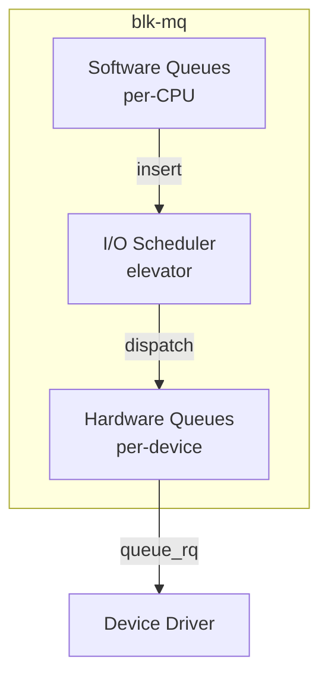
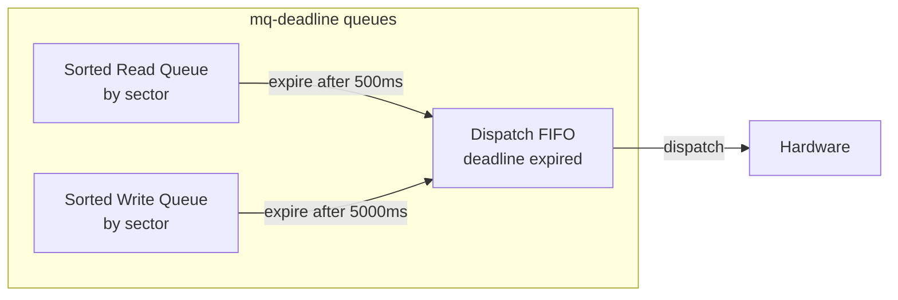
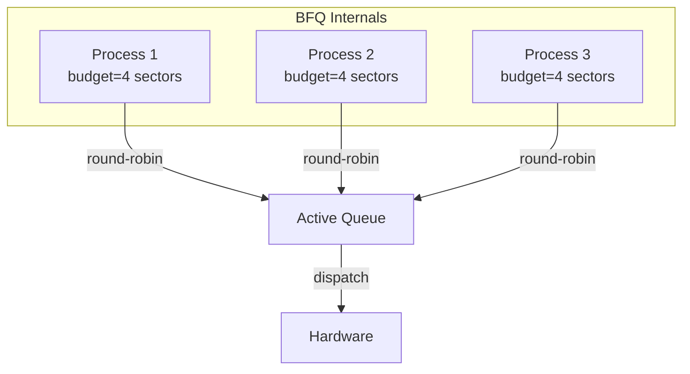
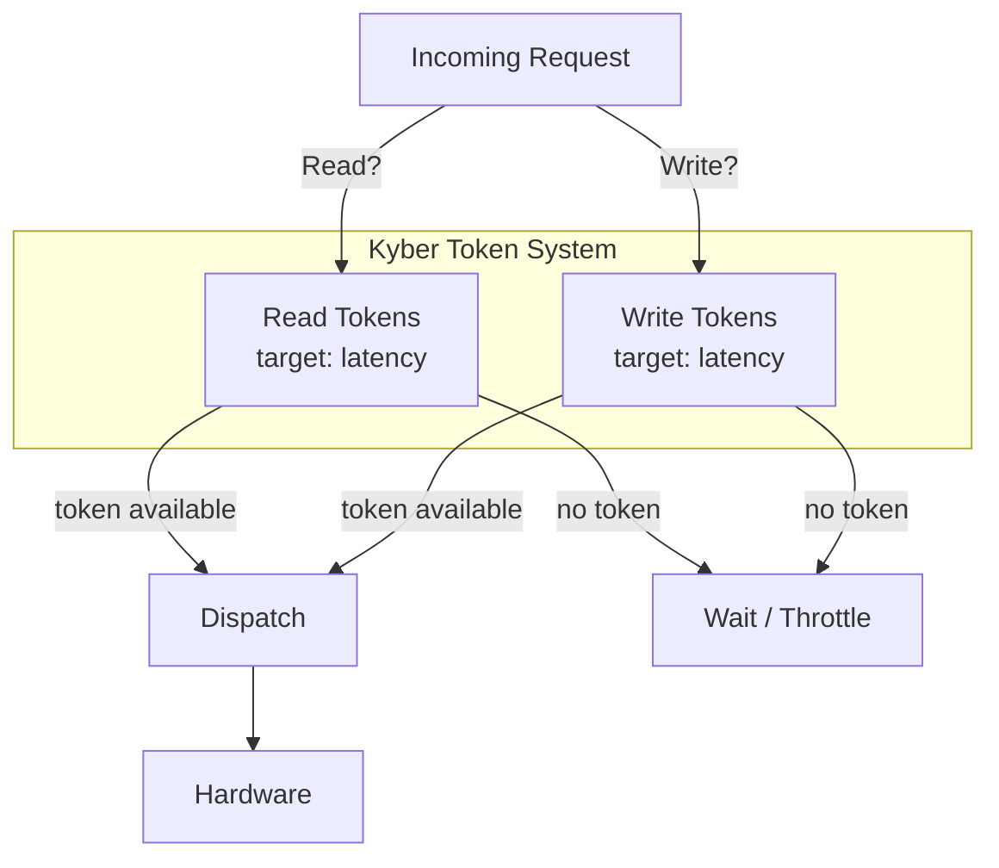
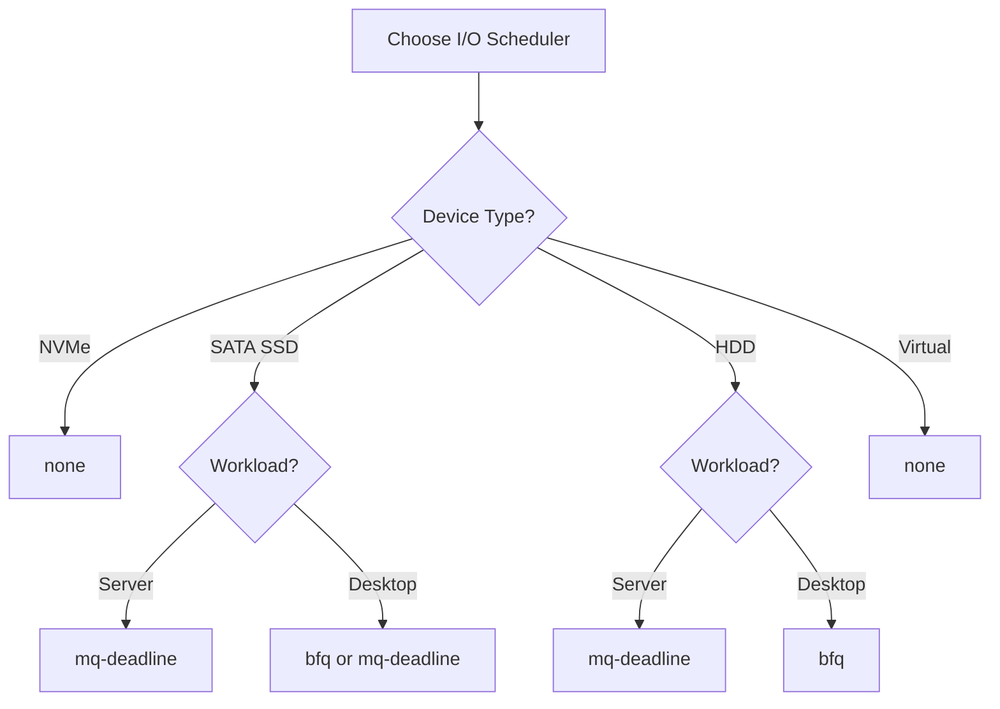
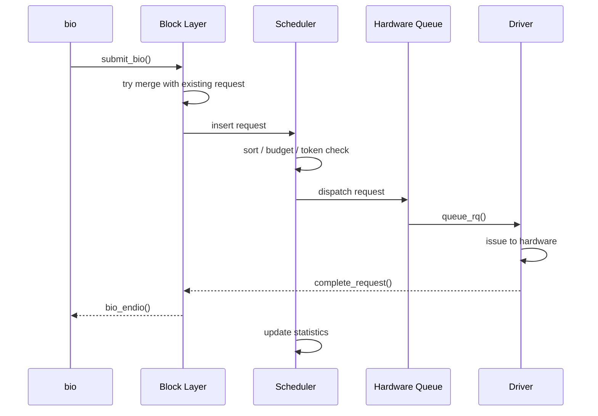
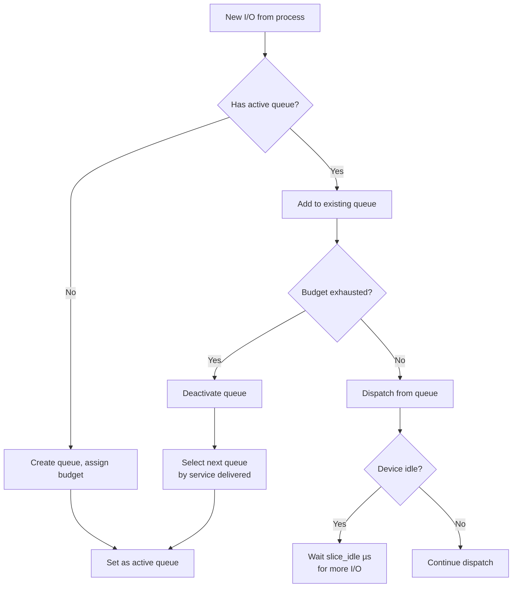
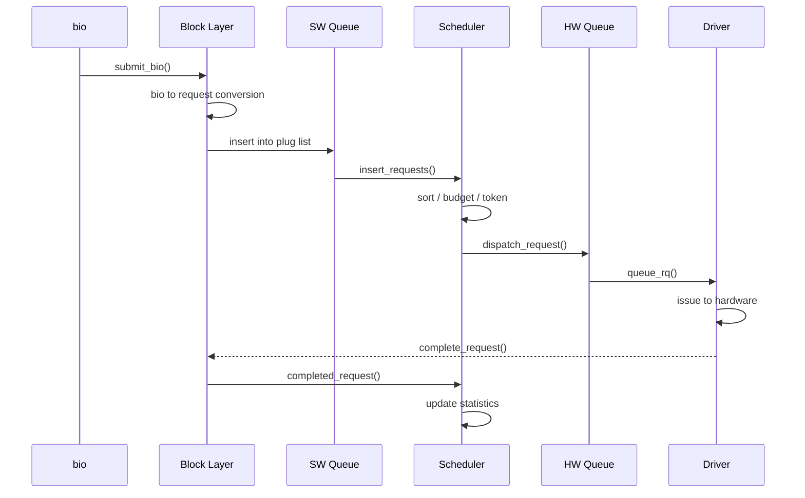
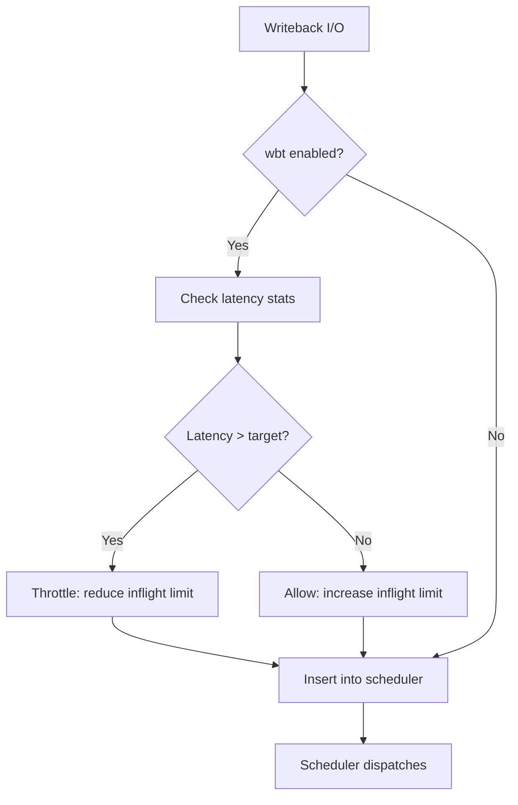

# I/O Schedulers

An I/O scheduler (also called an **elevator**) reorders and batches I/O
requests before they are dispatched to the hardware. The goals are to
maximize throughput (by reducing seek time and enabling merges) while
keeping latency fair across processes.

Linux currently ships four I/O schedulers, selectable per-block-device
via sysfs or the kernel command line.

---

## 1. Why Schedule I/O?

Rotational hard drives pay a heavy penalty for random seeks. An I/O
scheduler can:

- **Merge** adjacent requests (reduce total I/O operations)
- **Reorder** requests to minimize head movement (elevator algorithm)
- **Fairness** — prevent one process from starving others
- **Latency control** — guarantee request completion within a deadline

On fast NVMe SSDs (where random access is nearly as fast as sequential),
scheduling overhead can exceed its benefit. That's why the "none"
scheduler exists.

---

## 2. Architecture Overview



The scheduler sits between the per-CPU software queues and the hardware
dispatch queues. It decides **when** and **in what order** requests are
sent to the hardware.

---

## 3. The Four Schedulers

### 3.1 `none` (No-op)

**Description**: Performs no scheduling at all. Requests pass through in
FIFO order with basic front merging.

**Best for**: NVMe SSDs, virtual block devices, any fast random-access
device where scheduling overhead exceeds its benefit.

**Characteristics**:

- Zero scheduling latency
- No reordering
- Minimal CPU overhead
- Only does front-merge (tries to merge with the front of the queue)

```bash
# Set none scheduler
echo none > /sys/block/nvme0n1/queue/scheduler
```

### 3.2 `mq-deadline`

**Description**: A multi-queue-aware port of the classic deadline
scheduler. Maintains separate read and write queues with expiration
deadlines to prevent starvation.

**Best for**: HDDs, SATA SSDs, and any device where you want a balance
of throughput and latency guarantees.

**Characteristics**:

- Per-request deadline tracking (default: read 500ms, write 5000ms)
- Read-preferring (reads are dispatched before writes)
- Sorted queue for seek optimization on HDDs
- Batch dispatch for throughput



**Tunable parameters**:

```bash
# View/modify read expiry (ms)
cat /sys/block/sda/queue/iosched/read_expire
500
echo 200 > /sys/block/sda/queue/iosched/read_expire

# View/modify write expiry (ms)
cat /sys/block/sda/queue/iosched/write_expire
5000

# Write batch size (dispatch writes in batches)
cat /sys/block/sda/queue/iosched/write_starved
1   # how many reads before a write gets dispatched

# FIFO batch size
cat /sys/block/sda/queue/iosched/fifo_batch
16
```

**Selection logic**:

1. If there's a read request, prefer it.
2. If the write queue has an expired request, dispatch it.
3. Otherwise, dispatch from the sorted queue (by sector) for
   sequential locality.

### 3.3 `bfq` (Budget Fair Queuing)

**Description**: A proportional-share scheduler that assigns each
process a "budget" (in sectors) and ensures fairness. Optimized for
low latency on interactive and desktop workloads.

**Best for**: Desktop systems, mobile devices, any workload where
interactivity and fairness matter more than raw throughput.

**Characteristics**:

- Per-process scheduling with cgroup support
- Low-latency mode for interactive I/O
- Budget-based fairness (similar to CFQ but blk-mq native)
- Heavier CPU usage than mq-deadline or none



**Tunable parameters**:

```bash
# Slice idle time (µs) — how long to wait for a process after its budget
cat /sys/block/sda/queue/iosched/slice_idle
8000

# Low latency mode (0=off, 1=on)
cat /sys/block/sda/queue/iosched/low_latency
1

# Timeout for backlogged queues (ms)
cat /sys/block/sda/queue/iosched/back_seek_max
16384

# FIFO expiry time for sync requests
cat /sys/block/sda/queue/iosched/fifo_expire_sync
128000

# FIFO expiry time for async requests
cat /sys/block/sda/queue/iosched/fifo_expire_async
256000
```

**Budget allocation**:

Each process gets a budget (default 4 sectors for random I/O, more for
sequential). When a process exhausts its budget, the next process gets
a turn. This prevents any single process from dominating the device.

### 3.4 `kyber`

**Description**: A latency-oriented scheduler for fast devices. Uses a
token-based system to limit the number of in-flight read and write
requests, targeting specific latency targets.

**Best for**: Fast NVMe SSDs where you want latency control without the
CPU overhead of BFQ.

**Characteristics**:

- Two separate latency targets: read and write
- Token-based admission control
- Very low CPU overhead
- No per-process fairness (device-level only)



**Tunable parameters**:

```bash
# Read latency target (µs)
cat /sys/block/nvme0n1/queue/iosched/read_lat_nsec
2000000    # 2ms in nanoseconds

# Write latency target (µs)
cat /sys/block/nvme0n1/queue/iosched/write_lat_nsec
10000000   # 10ms in nanoseconds
```

Kyber adjusts the number of tokens based on observed latency. If
latency exceeds the target, fewer tokens are issued (throttling
throughput). If latency is under target, more tokens are issued.

---

## 4. Choosing the Right Scheduler

| Workload | Recommended Scheduler | Rationale |
|---|---|---|
| NVMe SSD | `none` | No scheduling benefit; minimal overhead |
| SATA SSD | `mq-deadline` | Good balance of latency and throughput |
| HDD (server) | `mq-deadline` | Deadline guarantees; seek optimization |
| HDD (desktop) | `bfq` | Fairness for interactive use |
| Virtual machine | `none` | Host scheduler handles reordering |
| Embedded/mobile | `bfq` or `kyber` | Low latency for user-facing I/O |

### Decision Tree



---

## 5. Selecting and Changing Schedulers

### View Current Scheduler

```bash
$ cat /sys/block/sda/queue/scheduler
[mq-deadline] bfq none
```

The scheduler in brackets is the active one.

### Change Scheduler

```bash
echo bfq > /sys/block/sda/queue/scheduler
```

The change takes effect immediately for new requests. In-flight requests
complete under the old scheduler.

### Default Scheduler at Boot

Set via kernel command line:

```text
elevator=mq-deadline
```

Or per-device via udev rules:

```bash
# /etc/udev/rules.d/60-ioscheduler.rules
ACTION=="add|change", KERNEL=="nvme[0-9]*", ATTR{queue/scheduler}="none"
ACTION=="add|change", KERNEL=="sd[a-z]", ATTR{queue/scheduler}="mq-deadline"
```

---

## 6. Scheduler Internals: Request Lifecycle



---

## 7. Monitoring Scheduler Performance

### `/sys/block/<dev>/queue/iosched/`

Each scheduler exposes statistics and tunables under this directory:

```bash
$ ls /sys/block/sda/queue/iosched/
back_seek_max      fifo_expire_sync   writes_starved
back_seek_penalty  fifo_expire_async  front_merges
fifo_batch         read_expire        write_expire
```

### `iostat` — Device Utilization

```bash
$ iostat -xz 1
Device  r/s    w/s    rMB/s  wMB/s  await  svctm  %util
sda     120.0  80.0   10.5   5.2    2.1    0.8    16.0
```

| Metric | Meaning |
|---|---|
| `await` | Average time (ms) from submission to completion |
| `svctm` | Average service time (deprecated but still shown) |
| `%util` | Percentage of time the device was busy |

### `blktrace` / `btt` — Deep Inspection

```bash
# Trace I/O events for 10 seconds
sudo blktrace -d /dev/sda -o - | blktrace -i - -d sda.trace

# Analyze with btt
btt -i sda.trace
```

This produces detailed statistics on queue depths, request latencies,
merge rates, and scheduler behavior.

---

## 8. Writing a Custom Elevator (Brief)

The kernel provides an `elevator_type` registration API:

```c
static struct elevator_type my_elevator = {
    .ops = {
        .insert_requests = my_insert,
        .dispatch_request = my_dispatch,
        .completed_request = my_completed,
        .has_work = my_has_work,
    },
    .elevator_name = "mine",
    .elevator_owner = THIS_MODULE,
};

static int __init my_elevator_init(void)
{
    return elv_register(&my_elevator);
}

static void __exit my_elevator_exit(void)
{
    elv_unregister(&my_elevator);
}
```

> **Note**: Custom schedulers must handle the blk-mq software/hardware
> queue topology. Study `block/mq-deadline.c` as a reference
> implementation.

---

## 10. BFQ Internals

### Budget Allocation Algorithm

BFQ assigns each process a **budget** measured in sectors. The budget
determines how much I/O a process can issue before yielding to the next
process.



### Budget vs Service

- **Budget**: Maximum sectors a process can dispatch per turn.
- **Service**: Actual sectors dispatched (may be less than budget if
  the process has no more I/O).

BFQ tracks the **service delivered** to each queue and uses it to
determine fairness. Processes that receive more service are deprioritized.

### Queue States

| State | Description |
|---|---|
| Active | Currently dispatching I/O |
| Inactive | On the scheduler's sorted tree, waiting for a turn |
| Idle | No pending I/O, may be kept alive for a short time |

### Weighted Fairness

BFQ supports per-cgroup weights. Higher-weight processes get a larger
share of the device bandwidth:

```bash
# Default weight is 100
$ echo 200 > /sys/fs/cgroup/blkio/mygroup/blkio.bfq.weight

# Per-device weight
$ echo "8:0 200" > /sys/fs/cgroup/blkio/mygroup/blkio.bfq.weight
```

The weight directly scales the budget:

```
budget = base_budget × (weight / 100)
```

### Low-Latency Mode

BFQ can detect interactive I/O (e.g., reads from a desktop application)
and give it priority:

```bash
# Enable/disable low-latency mode
$ echo 1 > /sys/block/sda/queue/iosched/low_latency

# Timeout for interactive detection (µs)
$ cat /sys/block/sda/queue/iosched/timeout_sync
128000
```

When low-latency mode is on, BFQ:
1. Detects processes that issue small, sporadic reads.
2. Assigns them a higher weight (typically 2× default).
3. Reduces their idle time to improve responsiveness.

### BFQ Hierarchical Scheduling

BFQ fully supports cgroup v1 and v2 I/O controllers:

```bash
# cgroup v2
$ mkdir /sys/fs/cgroup/test
$ echo 200 > /sys/fs/cgroup/test/io.bfq.weight
$ echo $PID > /sys/fs/cgroup/test/cgroup.procs

# Verify scheduling
$ cat /sys/fs/cgroup/test/io.stat
8:0 rbytes=1234567 wbytes=7654321 dbytes=0
```

---

## 11. blk-mq Scheduling Framework

All modern I/O schedulers plug into blk-mq via the `elevator_type`
interface. The framework provides hooks for:

### Scheduler Hooks

```c
struct elevator_mq_ops {
    /* Called when a new request is ready for scheduling */
    void (*insert_requests)(struct blk_mq_hw_ctx *, struct list_head *,
                            bool);

    /* Called to get the next request to dispatch */
    struct request *(*dispatch_request)(struct blk_mq_hw_ctx *);

    /* Called when a request completes */
    void (*completed_request)(struct request *, u64);

    /* Check if the scheduler has work to do */
    bool (*has_work)(struct blk_mq_hw_ctx *);

    /* Called during elevator init/exit */
    int (*init_sched)(struct request_queue *, struct elevator_type *);
    void (*exit_sched)(struct elevator_queue *);
};
```

### Request Lifecycle in blk-mq



### Software Queue (SWQ) Flushing

When a software queue is flushed (either explicitly or because it's
full), all requests are moved to the scheduler:

```c
/* Flush plug list to scheduler */
blk_mq_flush_plug_list(plug, false);

/* Scheduler processes the batch */
elevator->ops.insert_requests(hctx, list, false);
```

---

## 12. Writeback Throttling (wbt)

The writeback throttling (wbt) mechanism limits the rate of writeback
I/O to prevent it from starving reads. It works at the blk-mq level,
before the scheduler.

### How wbt Works

1. Monitors the latency of completed I/O requests.
2. If latency exceeds a threshold, throttles new writeback submissions.
3. Adjusts the number of in-flight writeback requests dynamically.

```bash
# Check wbt status
$ cat /sys/block/sda/queue/wbt_lat_usec
75000   # latency target in µs

# Disable wbt
$ echo 0 > /sys/block/sda/queue/wbt_lat_usec

# Re-enable with custom target
$ echo 50000 > /sys/block/sda/queue/wbt_lat_usec
```

### wbt and Scheduler Interaction



### wbt Statistics

```bash
# View wbt statistics
$ cat /sys/kernel/debug/block/sda/wbt_state
# inflight=12, threshold=32, max_depth=64
# min_lat_nsec=75000000, cur_lat_nsec=45000000
```

---

## 13. cgroup I/O Controller

The cgroup I/O controller (`io` in cgroup v2, `blkio` in v1) provides
per-cgroup I/O control.

### cgroup v2 Interface

```bash
# Create a cgroup
$ mkdir /sys/fs/cgroup/limited

# Set I/O weight (BFQ only)
$ echo 50 > /sys/fs/cgroup/limited/io.bfq.weight

# Set I/O limits (all schedulers)
$ echo "8:0 rbps=10485760" > /sys/fs/cgroup/limited/io.max
# 10 MiB/s read limit on 8:0

$ echo "8:0 wbps=5242880" > /sys/fs/cgroup/limited/io.max
# 5 MiB/s write limit

$ echo "8:0 riops=1000" > /sys/fs/cgroup/limited/io.max
# 1000 read IOPS limit

# View I/O stats
$ cat /sys/fs/cgroup/limited/io.stat
8:0 rbytes=123456789 wbytes=987654321 dbytes=0
rios=12345 wios=6789 drios=0 dwios=0

# Set I/O latency target
$ echo "8:0 target=10000" > /sys/fs/cgroup/limited/io.latency
# Target 10ms latency for this cgroup on device 8:0
```

### cgroup v1 (blkio) Interface

```bash
# Weight-based control
$ echo 500 > /sys/fs/cgroup/blkio/mygroup/blkio.weight

# Throttle-based control
$ echo "8:0 10485760" > /sys/fs/cgroup/blkio/mygroup/blkio.throttle.read_bps_device
$ echo "8:0 1000" > /sys/fs/cgroup/blkio/mygroup/blkio.throttle.read_iops_device

# Stats
$ cat /sys/fs/cgroup/blkio/mygroup/blkio.io_service_bytes_recursive
```

---

## 14. Scheduler Benchmarks and Selection Guide

### Performance Characteristics

| Metric | none | mq-deadline | bfq | kyber |
|---|---|---|---|---|
| Sequential read (MB/s) | Best | Good | Fair | Good |
| Random read IOPS | Best | Good | Fair | Good |
| Latency (p99) | Good | Good | Best | Good |
| CPU overhead | Lowest | Low | Medium | Low |
| Fairness | None | Time-based | Proportional | Latency-based |
| Interactive latency | Good | Fair | Best | Good |

### Benchmark Commands

```bash
# Install fio
$ sudo apt-get install fio

# Sequential read (1M blocks)
fio --name=seq-read --filename=/dev/sda --rw=read --bs=1M --size=1G --runtime=30 --ioengine=io_uring

# Random read (4K blocks)
fio --name=rand-read --filename=/dev/sda --rw=randread --bs=4k --size=1G --runtime=30 --ioengine=io_uring --iodepth=32

# Mixed workload
$fio --name=mixed --filename=/dev/sda --rw=randrw --rwmixread=70 --bs=4k --size=1G --runtime=30 --ioengine=io_uring --iodepth=32

# Compare schedulers
for sched in none mq-deadline bfq kyber; do
    echo $sched > /sys/block/sda/queue/scheduler
    echo "=== $sched ==="
    fio --name=test --filename=/dev/sda --rw=randread --bs=4k --size=1G --runtime=10 --ioengine=io_uring --iodepth=32 --minimal
done
```

### Common Recommendations

```bash
# Database server (NVMe)
echo none > /sys/block/nvme0n1/queue/scheduler

# Web server (SATA SSD)
echo mq-deadline > /sys/block/sda/queue/scheduler

# Desktop/laptop
echo bfq > /sys/block/sda/queue/scheduler

# Embedded device (eMMC)
echo bfq > /sys/block/mmcblk0/queue/scheduler
```

---

## 15. I/O Priority Deep Dive

The `ioprio` system assigns priorities to I/O requests, influencing
scheduler behavior.

### I/O Priority Classes

| Class | Value | Description |
|---|---|---|
| IOPRIO_CLASS_NONE | 0 | Inherit from process nice |
| IOPRIO_CLASS_RT | 1 | Real-time (highest priority) |
| IOPRIO_CLASS_BE | 2 | Best-effort (default) |
| IOPRIO_CLASS_IDLE | 3 | Idle (lowest priority) |

### Priority in Schedulers

- **mq-deadline**: Real-time class requests get shorter deadlines.
- **bfq**: Higher priority gets a larger budget proportion.
- **kyber**: Not affected by I/O priority.
- **none**: Not affected.

```bash
# Set I/O priority for a command
$ ionice -c 2 -n 0 dd if=/dev/zero of=/tmp/test bs=1M count=100 &
# Best-effort, priority 0 (highest within class)

$ ionice -c 3 dd if=/dev/zero of=/tmp/test2 bs=1M count=100 &
# Idle class — only runs when device is otherwise idle

# Real-time class (requires root)
$ sudo ionice -c 1 -n 0 dd if=/dev/zero of=/tmp/test3 bs=1M count=100

# Check priority of running process
$ ionice -p 1234
none: prio 4
```

---

## 16. Writing a Custom Elevator (Extended)

### Minimal Elevator Template

```c
#include <linux/elevator.h>
#include <linux/blk-mq.h>

struct my_sched_data {
    struct list_head fifo_list;
    spinlock_t lock;
};

static void my_insert_requests(struct blk_mq_hw_ctx *hctx,
                               struct list_head *list, bool at_head)
{
    struct my_sched_data *sd = hctx->sched_data;
    struct request *rq, *next;

    spin_lock(&sd->lock);
    list_for_each_entry_safe(rq, next, list, queuelist) {
        list_del_init(&rq->queuelist);
        if (at_head)
            list_add(&rq->queuelist, &sd->fifo_list);
        else
            list_add_tail(&rq->queuelist, &sd->fifo_list);
    }
    spin_unlock(&sd->lock);
}

static struct request *my_dispatch_request(struct blk_mq_hw_ctx *hctx)
{
    struct my_sched_data *sd = hctx->sched_data;
    struct request *rq = NULL;

    spin_lock(&sd->lock);
    if (!list_empty(&sd->fifo_list)) {
        rq = list_first_entry(&sd->fifo_list, struct request,
                              queuelist);
        list_del_init(&rq->queuelist);
    }
    spin_unlock(&sd->lock);

    return rq;
}

static bool my_has_work(struct blk_mq_hw_ctx *hctx)
{
    struct my_sched_data *sd = hctx->sched_data;
    return !list_empty(&sd->fifo_list);
}

static int my_init_sched(struct request_queue *q,
                         struct elevator_type *et)
{
    struct my_sched_data *sd;
    struct elevator_queue *eq;

    eq = elevator_alloc(q, et);
    if (!eq)
        return -ENOMEM;

    sd = eq->elevator_data;
    INIT_LIST_HEAD(&sd->fifo_list);
    spin_lock_init(&sd->lock);

    q->elevator = eq;
    return 0;
}

static void my_exit_sched(struct elevator_queue *eq)
{
    /* Clean up if needed */
}

static struct elevator_type my_elevator = {
    .ops = {
        .insert_requests   = my_insert_requests,
        .dispatch_request  = my_dispatch_request,
        .has_work          = my_has_work,
        .init_sched        = my_init_sched,
        .exit_sched        = my_exit_sched,
    },
    .elevator_name = "mine",
    .elevator_owner = THIS_MODULE,
};

static int __init my_elevator_init(void)
{
    return elv_register(&my_elevator);
}

static void __exit my_elevator_exit(void)
{
    elv_unregister(&my_elevator);
}

module_init(my_elevator_init);
module_exit(my_elevator_exit);
MODULE_LICENSE("GPL");
```

> **Study reference**: `block/mq-deadline.c` (~600 lines) is the
> simplest complete scheduler implementation in the kernel source.

---

## 17. Historical Note: Legacy Elevators

Before blk-mq (kernel < 3.13), Linux used single-queue schedulers:

- **noop** → predecessor to `none`
- **deadline** → predecessor to `mq-deadline`
- **cfq** (Completely Fair Queuing) → predecessor to `bfq`
- **anticipatory** → removed in 2.6.33

These are all gone. The blk-mq versions are the only supported
schedulers in modern kernels.

### Legacy vs Modern Comparison

| Aspect | Legacy (single-queue) | blk-mq (multi-queue) |
|---|---|---|
| Queue model | Single request_queue | Per-CPU SW queues + HW queues |
| Locking | Single queue lock | Per-queue spinlock (lockless in fast path) |
| Scalability | Poor on many-core systems | Scales to hundreds of cores |
| Scheduler API | `elevator_ops` | `elevator_mq_ops` |
| NVMe support | Awkward (needed blk-mq) | Native |

---

## 18. Further Reading

- [GNU Project Documentation](https://www.gnu.org/doc/doc.html)
- [GNU Manuals](https://www.gnu.org/manual/manual.html)
- [Free Software Directory](https://directory.fsf.org/wiki/Main_Page)
- [Planet GNU](https://planet.gnu.org/)
- [Free Software Books](https://www.gnu.org/doc/other-free-books.html)

- [Linux kernel docs — I/O schedulers](https://docs.kernel.org/block/elevator-schedulers.html)
- [kernel.org — block/mq-deadline.c](https://git.kernel.org/pub/scm/linux/kernel/git/torvalds/linux.git/tree/block/mq-deadline.c)
- [kernel.org — block/bfq-iosched.c](https://git.kernel.org/pub/scm/linux/kernel/git/torvalds/linux.git/tree/block/bfq-iosched.c)
- [kernel.org — block/kyber-iosched.c](https://git.kernel.org/pub/scm/linux/kernel/git/torvalds/linux.git/tree/block/kyber-iosched.c)
- [LWN: BFQ and kyber schedulers](https://lwn.net/Articles/701166/)
- [LWN: The mq-deadline I/O scheduler](https://lwn.net/Articles/706073/)

## Related Topics

- [Block Layer Overview](overview.md) — where schedulers fit in the I/O path
- [Request Queues](request-queues.md) — blk-mq request lifecycle
- [Bio Structures](bio.md) — the data that flows through schedulers
- [Block Devices](devices.md) — per-device scheduler configuration
