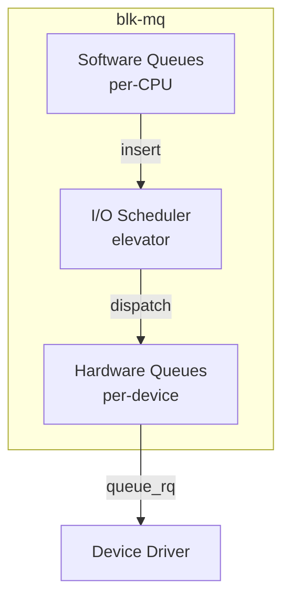
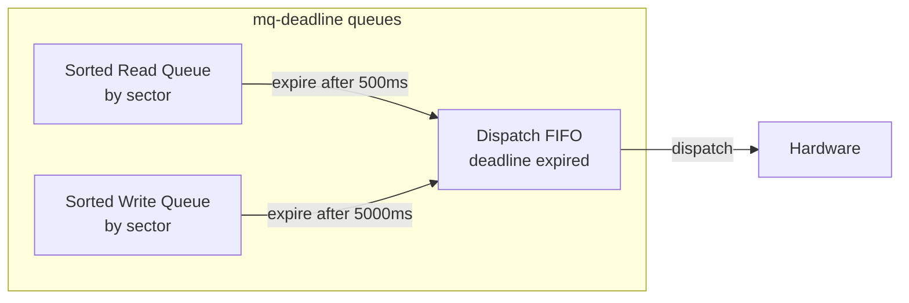
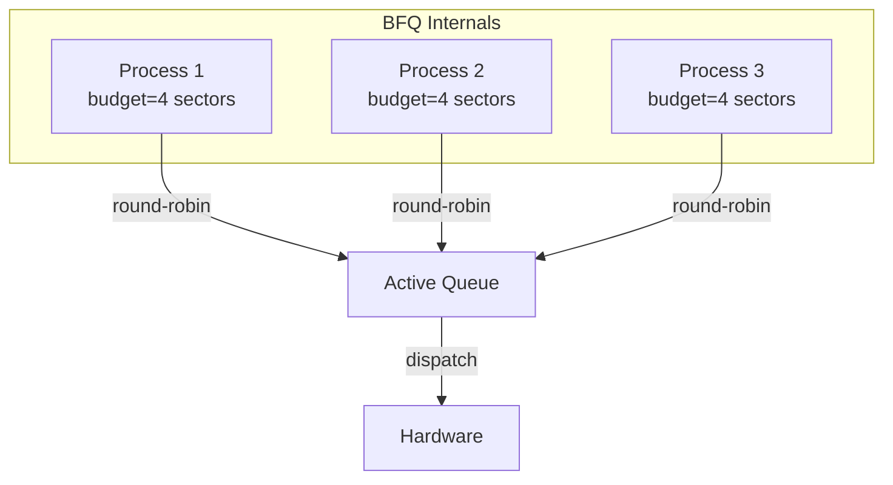
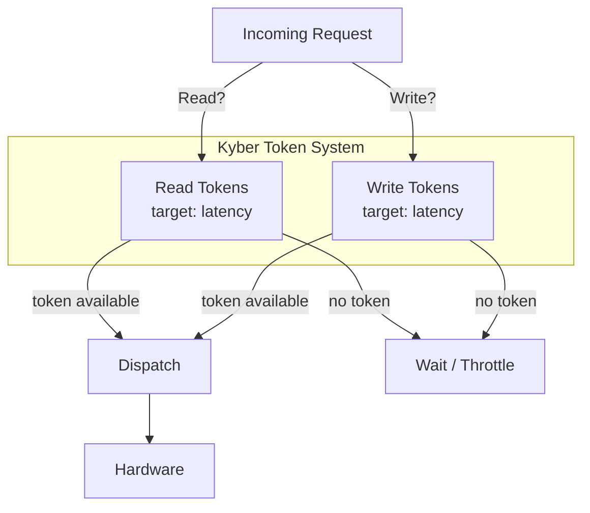
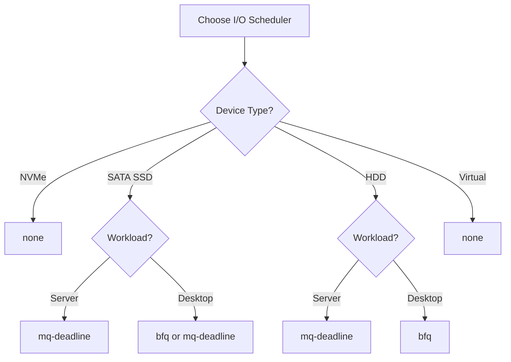
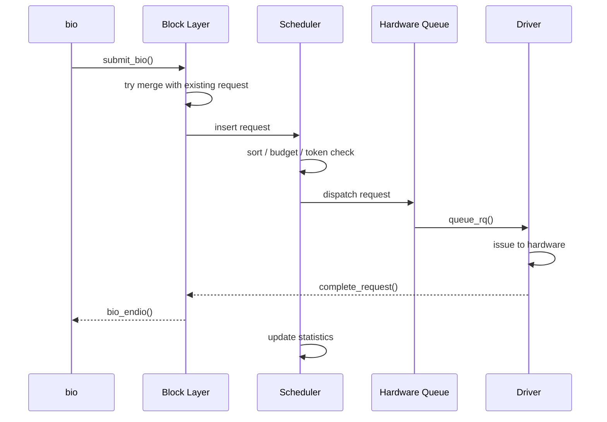

# I/O Schedulers

An I/O scheduler (also called an **elevator**) reorders and batches I/O
requests before they are dispatched to the hardware. The goals are to
maximize throughput (by reducing seek time and enabling merges) while
keeping latency fair across processes.

Linux currently ships four I/O schedulers, selectable per-block-device
via sysfs or the kernel command line.

---

## 1. Why Schedule I/O?

Rotational hard drives pay a heavy penalty for random seeks. An I/O
scheduler can:

- **Merge** adjacent requests (reduce total I/O operations)
- **Reorder** requests to minimize head movement (elevator algorithm)
- **Fairness** — prevent one process from starving others
- **Latency control** — guarantee request completion within a deadline

On fast NVMe SSDs (where random access is nearly as fast as sequential),
scheduling overhead can exceed its benefit. That's why the "none"
scheduler exists.

---

## 2. Architecture Overview



The scheduler sits between the per-CPU software queues and the hardware
dispatch queues. It decides **when** and **in what order** requests are
sent to the hardware.

---

## 3. The Four Schedulers

### 3.1 `none` (No-op)

**Description**: Performs no scheduling at all. Requests pass through in
FIFO order with basic front merging.

**Best for**: NVMe SSDs, virtual block devices, any fast random-access
device where scheduling overhead exceeds its benefit.

**Characteristics**:

- Zero scheduling latency
- No reordering
- Minimal CPU overhead
- Only does front-merge (tries to merge with the front of the queue)

```bash
# Set none scheduler
echo none > /sys/block/nvme0n1/queue/scheduler
```

### 3.2 `mq-deadline`

**Description**: A multi-queue-aware port of the classic deadline
scheduler. Maintains separate read and write queues with expiration
deadlines to prevent starvation.

**Best for**: HDDs, SATA SSDs, and any device where you want a balance
of throughput and latency guarantees.

**Characteristics**:

- Per-request deadline tracking (default: read 500ms, write 5000ms)
- Read-preferring (reads are dispatched before writes)
- Sorted queue for seek optimization on HDDs
- Batch dispatch for throughput



**Tunable parameters**:

```bash
# View/modify read expiry (ms)
cat /sys/block/sda/queue/iosched/read_expire
500
echo 200 > /sys/block/sda/queue/iosched/read_expire

# View/modify write expiry (ms)
cat /sys/block/sda/queue/iosched/write_expire
5000

# Write batch size (dispatch writes in batches)
cat /sys/block/sda/queue/iosched/write_starved
1   # how many reads before a write gets dispatched

# FIFO batch size
cat /sys/block/sda/queue/iosched/fifo_batch
16
```

**Selection logic**:

1. If there's a read request, prefer it.
2. If the write queue has an expired request, dispatch it.
3. Otherwise, dispatch from the sorted queue (by sector) for
   sequential locality.

### 3.3 `bfq` (Budget Fair Queuing)

**Description**: A proportional-share scheduler that assigns each
process a "budget" (in sectors) and ensures fairness. Optimized for
low latency on interactive and desktop workloads.

**Best for**: Desktop systems, mobile devices, any workload where
interactivity and fairness matter more than raw throughput.

**Characteristics**:

- Per-process scheduling with cgroup support
- Low-latency mode for interactive I/O
- Budget-based fairness (similar to CFQ but blk-mq native)
- Heavier CPU usage than mq-deadline or none



**Tunable parameters**:

```bash
# Slice idle time (µs) — how long to wait for a process after its budget
cat /sys/block/sda/queue/iosched/slice_idle
8000

# Low latency mode (0=off, 1=on)
cat /sys/block/sda/queue/iosched/low_latency
1

# Timeout for backlogged queues (ms)
cat /sys/block/sda/queue/iosched/back_seek_max
16384

# FIFO expiry time for sync requests
cat /sys/block/sda/queue/iosched/fifo_expire_sync
128000

# FIFO expiry time for async requests
cat /sys/block/sda/queue/iosched/fifo_expire_async
256000
```

**Budget allocation**:

Each process gets a budget (default 4 sectors for random I/O, more for
sequential). When a process exhausts its budget, the next process gets
a turn. This prevents any single process from dominating the device.

### 3.4 `kyber`

**Description**: A latency-oriented scheduler for fast devices. Uses a
token-based system to limit the number of in-flight read and write
requests, targeting specific latency targets.

**Best for**: Fast NVMe SSDs where you want latency control without the
CPU overhead of BFQ.

**Characteristics**:

- Two separate latency targets: read and write
- Token-based admission control
- Very low CPU overhead
- No per-process fairness (device-level only)



**Tunable parameters**:

```bash
# Read latency target (µs)
cat /sys/block/nvme0n1/queue/iosched/read_lat_nsec
2000000    # 2ms in nanoseconds

# Write latency target (µs)
cat /sys/block/nvme0n1/queue/iosched/write_lat_nsec
10000000   # 10ms in nanoseconds
```

Kyber adjusts the number of tokens based on observed latency. If
latency exceeds the target, fewer tokens are issued (throttling
throughput). If latency is under target, more tokens are issued.

---

## 4. Choosing the Right Scheduler

| Workload | Recommended Scheduler | Rationale |
|---|---|---|
| NVMe SSD | `none` | No scheduling benefit; minimal overhead |
| SATA SSD | `mq-deadline` | Good balance of latency and throughput |
| HDD (server) | `mq-deadline` | Deadline guarantees; seek optimization |
| HDD (desktop) | `bfq` | Fairness for interactive use |
| Virtual machine | `none` | Host scheduler handles reordering |
| Embedded/mobile | `bfq` or `kyber` | Low latency for user-facing I/O |

### Decision Tree



---

## 5. Selecting and Changing Schedulers

### View Current Scheduler

```bash
$ cat /sys/block/sda/queue/scheduler
[mq-deadline] bfq none
```

The scheduler in brackets is the active one.

### Change Scheduler

```bash
echo bfq > /sys/block/sda/queue/scheduler
```

The change takes effect immediately for new requests. In-flight requests
complete under the old scheduler.

### Default Scheduler at Boot

Set via kernel command line:

```text
elevator=mq-deadline
```

Or per-device via udev rules:

```bash
# /etc/udev/rules.d/60-ioscheduler.rules
ACTION=="add|change", KERNEL=="nvme[0-9]*", ATTR{queue/scheduler}="none"
ACTION=="add|change", KERNEL=="sd[a-z]", ATTR{queue/scheduler}="mq-deadline"
```

---

## 6. Scheduler Internals: Request Lifecycle



---

## 7. Monitoring Scheduler Performance

### `/sys/block/<dev>/queue/iosched/`

Each scheduler exposes statistics and tunables under this directory:

```bash
$ ls /sys/block/sda/queue/iosched/
back_seek_max      fifo_expire_sync   writes_starved
back_seek_penalty  fifo_expire_async  front_merges
fifo_batch         read_expire        write_expire
```

### `iostat` — Device Utilization

```bash
$ iostat -xz 1
Device  r/s    w/s    rMB/s  wMB/s  await  svctm  %util
sda     120.0  80.0   10.5   5.2    2.1    0.8    16.0
```

| Metric | Meaning |
|---|---|
| `await` | Average time (ms) from submission to completion |
| `svctm` | Average service time (deprecated but still shown) |
| `%util` | Percentage of time the device was busy |

### `blktrace` / `btt` — Deep Inspection

```bash
# Trace I/O events for 10 seconds
sudo blktrace -d /dev/sda -o - | blktrace -i - -d sda.trace

# Analyze with btt
btt -i sda.trace
```

This produces detailed statistics on queue depths, request latencies,
merge rates, and scheduler behavior.

---

## 8. Writing a Custom Elevator (Brief)

The kernel provides an `elevator_type` registration API:

```c
static struct elevator_type my_elevator = {
    .ops = {
        .insert_requests = my_insert,
        .dispatch_request = my_dispatch,
        .completed_request = my_completed,
        .has_work = my_has_work,
    },
    .elevator_name = "mine",
    .elevator_owner = THIS_MODULE,
};

static int __init my_elevator_init(void)
{
    return elv_register(&my_elevator);
}

static void __exit my_elevator_exit(void)
{
    elv_unregister(&my_elevator);
}
```

> **Note**: Custom schedulers must handle the blk-mq software/hardware
> queue topology. Study `block/mq-deadline.c` as a reference
> implementation.

---

## 9. Historical Note: Legacy Elevators

Before blk-mq (kernel < 3.13), Linux used single-queue schedulers:

- **noop** → predecessor to `none`
- **deadline** → predecessor to `mq-deadline`
- **cfq** (Completely Fair Queuing) → predecessor to `bfq`
- **anticipatory** → removed in 2.6.33

These are all gone. The blk-mq versions are the only supported
schedulers in modern kernels.

---

## Further Reading

- [Linux kernel docs — I/O schedulers](https://docs.kernel.org/block/elevator-schedulers.html)
- [kernel.org — block/mq-deadline.c](https://git.kernel.org/pub/scm/linux/kernel/git/torvalds/linux.git/tree/block/mq-deadline.c)
- [kernel.org — block/bfq-iosched.c](https://git.kernel.org/pub/scm/linux/kernel/git/torvalds/linux.git/tree/block/bfq-iosched.c)
- [kernel.org — block/kyber-iosched.c](https://git.kernel.org/pub/scm/linux/kernel/git/torvalds/linux.git/tree/block/kyber-iosched.c)
- [LWN: BFQ and kyber schedulers](https://lwn.net/Articles/701166/)
- [LWN: The mq-deadline I/O scheduler](https://lwn.net/Articles/706073/)

## Related Topics

- [Block Layer Overview](overview.md) — where schedulers fit in the I/O path
- [Request Queues](request-queues.md) — blk-mq request lifecycle
- [Bio Structures](bio.md) — the data that flows through schedulers
- [Block Devices](devices.md) — per-device scheduler configuration
