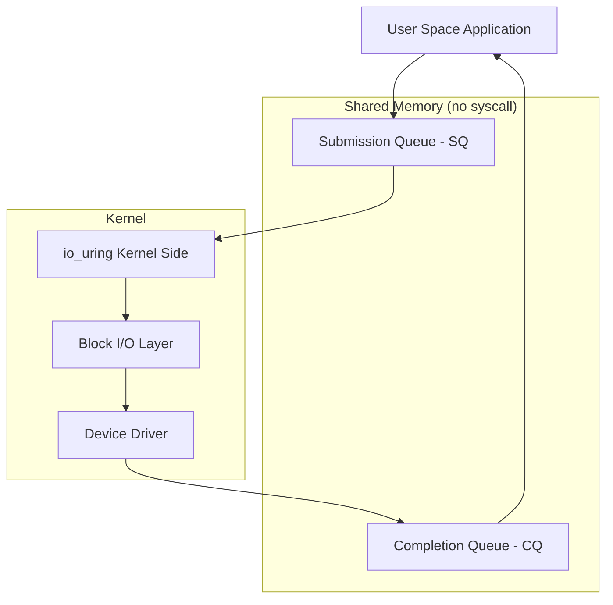
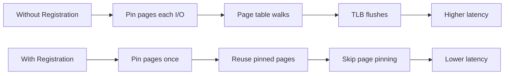
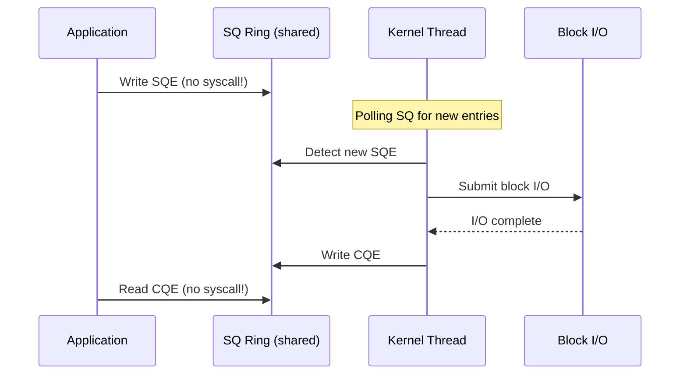
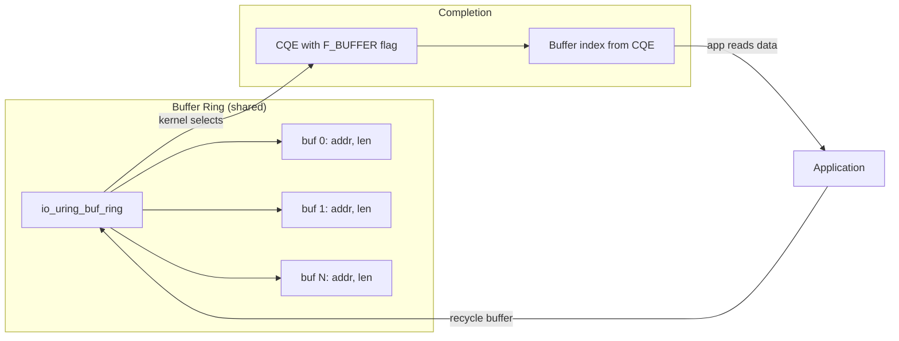
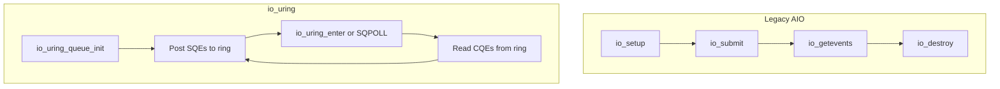

# io_uring for Block I/O

## Introduction

`io_uring` is Linux's high-performance asynchronous I/O interface, introduced in
Linux 5.1 by Jens Axboe. While originally focused on file and network I/O, io_uring
has expanded to support block device operations with significant performance advantages
over traditional `read()`/`write()` and even legacy AIO. This page covers io_uring's
block I/O capabilities, including registered buffers, fixed files, and poll-mode
completion.

## Architecture Overview



io_uring uses two ring buffers shared between user space and kernel:

- **Submission Queue (SQ)**: User space posts I/O requests
- **Completion Queue (CQ)**: Kernel posts completion events

The key innovation: **no system calls** are needed for submitting and reaping I/O
when using the ring in polling mode.

## Core Concepts

### Submission Queue Entry (SQE)

Each I/O request is described by a `struct io_uring_sqe`:

```c
struct io_uring_sqe {
    __u8  opcode;          /* I/O operation type */
    __u8  flags;           /* SQE flags */
    __u16 ioprio;          /* I/O priority */
    __s32 fd;              /* File descriptor */
    __u64 off;             /* Offset into file/device */
    __u64 addr;            /* Buffer address */
    __u32 len;             /* Buffer length */
    __u64 user_data;       /* User-provided identifier */
    __u16 buf_index;       /* Registered buffer index */
    /* ... additional fields for advanced operations */
};
```

### Completion Queue Entry (CQE)

```c
struct io_uring_cqe {
    __u64 user_data;    /* Matches SQE user_data */
    __s32 res;          /* Result (bytes read/written or error) */
    __u32 flags;        /* CQE flags */
};
```

### Opcodes for Block I/O

| Opcode | Description |
|--------|-------------|
| `IORING_OP_READ` | Read from fd |
| `IORING_OP_WRITE` | Write to fd |
| `IORING_OP_READ_FIXED` | Read using registered buffer |
| `IORING_OP_WRITE_FIXED` | Write using registered buffer |
| `IORING_OP_FSYNC` | Sync file data |
| `IORING_OP_FALLOCATE` | Pre-allocate space |
| `IORING_OP_READV` | Vectored read (scatter-gather) |
| `IORING_OP_WRITEV` | Vectored write |

## Basic Block I/O with io_uring

### Setup

```c
#include <liburing.h>
#include <fcntl.h>
#include <stdio.h>

#define QUEUE_DEPTH 256

int main(void)
{
    struct io_uring ring;
    int ret;

    /* Initialize io_uring instance */
    ret = io_uring_queue_init(QUEUE_DEPTH, &ring, 0);
    if (ret < 0) {
        fprintf(stderr, "io_uring_queue_init: %s\n", strerror(-ret));
        return 1;
    }

    /* Open a block device */
    int fd = open("/dev/sda", O_RDWR | O_DIRECT);
    if (fd < 0) {
        perror("open");
        return 1;
    }

    /* ... submit I/O operations ... */

    io_uring_queue_exit(&ring);
    close(fd);
    return 0;
}
```

### Submitting a Read

```c
void submit_read(struct io_uring *ring, int fd, void *buf,
                 size_t count, off_t offset)
{
    struct io_uring_sqe *sqe;

    /* Get a submission queue entry */
    sqe = io_uring_get_sqe(ring);

    /* Prepare a read operation */
    io_uring_prep_read(sqe, fd, buf, count, offset);

    /* Set user_data for identifying the completion */
    sqe->user_data = (uint64_t)buf;

    /* Submit the SQE to the kernel */
    io_uring_submit(ring);
}
```

### Reaping Completions

```c
void reap_completions(struct io_uring *ring)
{
    struct io_uring_cqe *cqe;
    int ret;

    /* Wait for at least one completion */
    ret = io_uring_wait_cqe(ring, &cqe);
    if (ret < 0) {
        fprintf(stderr, "io_uring_wait_cqe: %s\n", strerror(-ret));
        return;
    }

    /* Check result */
    if (cqe->res < 0) {
        fprintf(stderr, "I/O error: %s\n", strerror(-cqe->res));
    } else {
        printf("Read %d bytes from buffer %p\n", cqe->res,
               (void *)cqe->user_data);
    }

    /* Mark CQE as consumed */
    io_uring_cqe_seen(ring, cqe);
}
```

## Registered Buffers

For high-throughput block I/O, registering buffers avoids per-I/O kernel page pinning:

```c
int register_buffers(struct io_uring *ring)
{
    #define NUM_BUFFERS 64
    #define BUFFER_SIZE (4096 * 256)  /* 1 MB per buffer */

    struct iovec iovecs[NUM_BUFFERS];
    void *buffers[NUM_BUFFERS];

    /* Allocate aligned buffers (required for O_DIRECT) */
    for (int i = 0; i < NUM_BUFFERS; i++) {
        if (posix_memalign(&buffers[i], 4096, BUFFER_SIZE)) {
            perror("posix_memalign");
            return -1;
        }
        iovecs[i].iov_base = buffers[i];
        iovecs[i].iov_len = BUFFER_SIZE;
    }

    /* Register buffers with io_uring */
    int ret = io_uring_register_buffers(ring, iovecs, NUM_BUFFERS);
    if (ret) {
        fprintf(stderr, "io_uring_register_buffers: %s\n", strerror(-ret));
        return -1;
    }

    return 0;
}
```

### Using Registered Buffers

```c
void submit_read_registered(struct io_uring *ring, int fd,
                            int buf_index, size_t count, off_t offset)
{
    struct io_uring_sqe *sqe = io_uring_get_sqe(ring);

    /* Use io_uring_prep_read_fixed for registered buffers */
    io_uring_prep_read_fixed(sqe, fd, NULL, count, offset, buf_index);

    sqe->flags |= IOSQE_FIXED_FILE;
    sqe->user_data = buf_index;

    io_uring_submit(ring);
}
```

### Benefits of Registered Buffers



## Fixed Files

Similar to registered buffers, registering file descriptors avoids repeated
file lookup overhead:

```c
int register_files(struct io_uring *ring, int *fds, int nr_fds)
{
    int ret = io_uring_register_files(ring, fds, nr_fds);
    if (ret) {
        fprintf(stderr, "io_uring_register_files: %s\n", strerror(-ret));
        return -1;
    }
    return 0;
}

/* Submit using fixed file (fd = index into registered array) */
void submit_with_fixed_file(struct io_uring *ring, int file_index,
                            void *buf, size_t len, off_t offset)
{
    struct io_uring_sqe *sqe = io_uring_get_sqe(ring);

    io_uring_prep_read(sqe, file_index, buf, len, offset);
    sqe->flags |= IOSQE_FIXED_FILE;

    io_uring_submit(ring);
}
```

### File Update

```c
/* Update a registered file descriptor (atomic swap) */
int update_registered_file(struct io_uring *ring, int index, int new_fd)
{
    return io_uring_register_files_update(ring, index, &new_fd, 1);
}
```

## Poll Mode (IORING_SETUP_SQPOLL)

For ultra-low latency, io_uring can poll the submission queue from a kernel thread,
eliminating the `io_uring_enter()` system call entirely:

```c
struct io_uring_params params = {};
struct io_uring ring;

/* Enable SQ polling */
params.flags = IORING_SETUP_SQPOLL;

/* Set how long the kernel thread waits before sleeping (ms) */
params.sq_thread_idle = 2000;

int ret = io_uring_queue_init_params(QUEUE_DEPTH, &ring, &params);
if (ret < 0) {
    fprintf(stderr, "Failed to setup io_uring with SQPOLL\n");
    return -1;
}
```

### Poll Mode Operation



### When Kernel Thread Sleeps

If the SQ is empty for `sq_thread_idle` milliseconds, the kernel thread goes to sleep.
The next submission must use `io_uring_enter()` to wake it:

```c
/* Check if kernel thread is running */
if (IO_URING_READ_ONCE(*ring->sq.kflags) & IORING_SQ_NEED_WAKEUP) {
    /* Must wake the kernel thread */
    io_uring_enter(ring->ring_fd, 0, 0, IORING_ENTER_SQ_WAIT);
}
```

## Fixed Ring Buffers (IORING_SETUP_NO_MMAP)

Linux 6.7+ allows the kernel to allocate the ring buffers, avoiding an mmap call:

```c
struct io_uring_params params = {};
params.flags = IORING_SETUP_NO_MMAP;

io_uring_queue_init_params(depth, &ring, &params);
/* Ring buffers are kernel-allocated */
```

## Direct Descriptors (IORING_FILE_INDEX_ALLOC)

Instead of using file descriptors directly, io_uring can manage its own descriptor table:

```c
/* Open a file directly into io_uring's table */
struct io_uring_sqe *sqe = io_uring_get_sqe(ring);
io_uring_prep_openat(sqe, AT_FDCWD, "/dev/sda", O_RDWR | O_DIRECT, 0);
sqe->file_index = IORING_FILE_INDEX_ALLOC;
io_uring_submit(ring);
/* Result is the io_uring descriptor index */
```

## Batch Operations

For maximum throughput, submit multiple operations in a single call:

```c
void submit_batch(struct io_uring *ring, int fd, struct batch_io *ios, int count)
{
    for (int i = 0; i < count; i++) {
        struct io_uring_sqe *sqe = io_uring_get_sqe(ring);

        if (ios[i].is_read)
            io_uring_prep_read(sqe, fd, ios[i].buf, ios[i].len, ios[i].offset);
        else
            io_uring_prep_write(sqe, fd, ios[i].buf, ios[i].len, ios[i].offset);

        sqe->user_data = i;
    }

    /* Submit all at once - single syscall */
    io_uring_submit(ring);
}
```

## Chain Operations (IOSQE_IO_LINK)

Chain dependent operations so they execute in sequence:

```c
void chain_read_write(struct io_uring *ring, int src_fd, int dst_fd,
                      void *buf, size_t len, off_t offset)
{
    struct io_uring_sqe *sqe;

    /* First: read from source */
    sqe = io_uring_get_sqe(ring);
    io_uring_prep_read(sqe, src_fd, buf, len, offset);
    sqe->flags |= IOSQE_IO_LINK;  /* Link to next */
    sqe->user_data = 1;

    /* Second: write to destination (runs after read completes) */
    sqe = io_uring_get_sqe(ring);
    io_uring_prep_write(sqe, dst_fd, buf, len, offset);
    sqe->user_data = 2;

    io_uring_submit(ring);
}
```

## Performance Comparison

### Throughput (4K Random Read, NVMe SSD)

| Method | IOPS | Syscalls per I/O |
|--------|------|------------------|
| `pread()` | ~200K | 1 |
| Linux AIO | ~500K | 0.5 |
| io_uring (basic) | ~700K | 0.5 |
| io_uring (SQPOLL) | ~900K | 0 |
| io_uring (registered bufs + SQPOLL) | ~1M+ | 0 |

### Latency (4K Random Read)

| Method | p50 Latency | p99 Latency |
|--------|-------------|-------------|
| `pread()` | 4 µs | 15 µs |
| io_uring | 2 µs | 8 µs |
| io_uring (SQPOLL) | 1.5 µs | 5 µs |

## liburing API Summary

```c
/* Initialization */
int io_uring_queue_init(unsigned entries, struct io_uring *ring, unsigned flags);
int io_uring_queue_init_params(unsigned entries, struct io_uring *ring,
                                struct io_uring_params *p);
void io_uring_queue_exit(struct io_uring *ring);

/* Registration */
int io_uring_register_buffers(struct io_uring *ring, const struct iovec *iovecs,
                               unsigned nr_iovecs);
int io_uring_register_files(struct io_uring *ring, const int *files,
                             unsigned nr_files);
int io_uring_unregister_buffers(struct io_uring *ring);
int io_uring_unregister_files(struct io_uring *ring);

/* Submission */
struct io_uring_sqe *io_uring_get_sqe(struct io_uring *ring);
int io_uring_submit(struct io_uring *ring);
int io_uring_submit_and_wait(struct io_uring *ring, unsigned wait_nr);

/* Completion */
int io_uring_peek_cqe(struct io_uring *ring, struct io_uring_cqe **cqe_ptr);
int io_uring_wait_cqe(struct io_uring *ring, struct io_uring_cqe **cqe_ptr);
void io_uring_cqe_seen(struct io_uring *ring, struct io_uring_cqe *cqe);
```

## Kernel Configuration

```
CONFIG_IO_URING=y
```

---

## Kernel-Side Architecture

### io_uring Core Data Structures

The kernel-side io_uring is implemented in `fs/io_uring.c`.
The main structures are:

```c
/* fs/io_uring.c — simplified */
struct io_ring_ctx {
    struct io_sq_data    *sq_data;       /* SQ polling thread */
    struct io_rings      *rings;         /* shared SQ/CQ rings */
    struct io_uring_sqe  *sq_sqes;       /* SQE array */

    struct io_submit_state submit_state;

    unsigned int         flags;          /* IORING_SETUP_* */
    unsigned int         nr_user_files;
    unsigned int         nr_user_bufs;

    struct io_hash_table cancel_table;
    struct list_head     io_buffers;
    /* ... */
};

struct io_uring_task {
    /* Per-task io_uring state */
    int                  cached_refs;
    unsigned int         in_idle:1;
    /* ... */
};
```

### Submission Path

```mermaid
sequenceDiagram
    participant APP as Application
    participant SQ as SQ Ring
    participant KT as io_uring kernel
    participant IOWQ as io-wq workers
    participant BLK as Block Layer

    APP->>SQ: Post SQE (no syscall in SQPOLL mode)
    Note over KT: SQ thread or io_uring_enter()<br/>dequeues SQE
    KT->>KT: io_submit_sqe()<n    KT->>KT: io_issue_sqe()<n    alt Blocking I/O
        KT->>IOWQ: Queue to io-wq worker
        IOWQ->>BLK: Submit bio
    else Non-blocking (O_DIRECT)
        KT->>BLK: Submit bio directly
    end
    BLK-->>KT: bio completion callback
    KT->>SQ: Post CQE
    APP->>SQ: Read CQE
```

### io-wq Worker Pool

For operations that may block (buffered I/O, file metadata),
io_uring uses an internal worker pool (`io-wq`):

```c
/* fs/io-wq.c */
struct io_wq {
    unsigned long        state;
    atomic_t             refs;
    struct io_wq_hash    *hash;         /* hash table for work items */
    struct io_worker     *cur_worker;
    struct io_wq_work    *work_list;    /* pending work items */
    /* ... */
};

/* Each worker is a kernel thread */
struct io_worker {
    struct task_struct   *task;
    struct io_wq         *wq;
    unsigned int         flags;
    /* ... */
};
```

```bash
# View io_uring worker threads
$ ps aux | grep io_uring
# root  [io_uring/0]   ...   (per-node worker)
# root  [iou-wq-1234]  ...   (per-context worker)

# Check io-wq pool size (runtime tunable)
$ cat /proc/sys/kernel/io_uring_disabled
# 0 = enabled, 1 = unprivileged disabled, 2 = fully disabled
```

---

## io_uring for NVMe Passthrough (io_uring_cmd)

Linux 5.19+ introduced `IORING_OP_URING_CMD` which allows sending
vendor-specific commands directly to block devices via io_uring.
This is used for NVMe admin commands, NVMe passthrough, and
vendor-specific operations.

```c
#include <liburing.h>
#include <linux/nvme_ioctl.h>

int submit_nvme_identify(struct io_uring *ring, int fd)
{
    struct io_uring_sqe *sqe = io_uring_get_sqe(ring);
    struct nvme_admin_cmd cmd = {
        .opcode = 0x06,          /* Identify */
        .nsid = 1,
        .addr = (__u64)identify_buf,
        .data_len = 4096,
        .cdw10 = 1,              /* CNS: Identify Namespace */
    };

    io_uring_prep_uring_cmd(sqe, fd, 0);
    sqe->cmd_op = NVME_URING_CMD_ADMIN;
    memcpy(sqe->cmd, &cmd, sizeof(cmd));
    sqe->user_data = NVME_IDENTIFY;

    io_uring_submit(ring);
    return 0;
}
```

### NVMe I/O Commands via io_uring

```c
/* NVMe Read via io_uring passthrough */
int submit_nvme_read(struct io_uring *ring, int fd,
                     void *buf, size_t len, off_t offset)
{
    struct io_uring_sqe *sqe = io_uring_get_sqe(ring);
    struct nvme_user_io io = {
        .opcode = 0x02,          /* NVMe Read */
        .slba = offset / 4096,   /* Starting LBA */
        .nblocks = (len / 4096) - 1,
        .addr = (__u64)buf,
    };

    io_uring_prep_uring_cmd(sqe, fd, 0);
    sqe->cmd_op = NVME_URING_CMD_IO;
    memcpy(sqe->cmd, &io, sizeof(io));

    io_uring_submit(ring);
    return 0;
}
```

---

## Provided Buffer Rings

Instead of pre-registering fixed buffers, applications can use **buffer
rings** to dynamically provide buffers to io_uring. This is useful when
the buffer for a completion is not known in advance.

### Setup

```c
/* Register a buffer ring */
struct io_uring_buf_ring *br;
int bgid = 0;  /* Buffer group ID */

/* Allocate and register */
int ring_size = 64;
posix_memalign((void **)&br, 4096,
               ring_size * sizeof(struct io_uring_buf_ring));

io_uring_register_buf_ring(ring, &(struct io_uring_buf_reg){
    .ring_addr = (__u64)br,
    .ring_entries = ring_size,
    .bgid = bgid,
}, 0);

/* Add buffers to the ring */
for (int i = 0; i < ring_size; i++) {
    void *buf = malloc(4096);
    io_uring_buf_ring_add(br, buf, 4096, i,
                          io_uring_buf_ring_mask(ring_size), i);
}
io_uring_buf_ring_advance(ring, ring_size);
```

### Using Buffer Rings

```c
/* SQE requests a buffer from group bgid */
struct io_uring_sqe *sqe = io_uring_get_sqe(ring);
io_uring_prep_read(sqe, fd, NULL, 4096, 0);
sqe->flags |= IOSQE_BUFFER_SELECT;
sqe->buf_group = bgid;

io_uring_submit(ring);

/* CQE contains the buffer index */
struct io_uring_cqe *cqe;
io_uring_wait_cqe(ring, &cqe);

if (cqe->flags & IORING_CQE_F_BUFFER) {
    int buf_idx = cqe->flags >> IORING_CQE_BUFFER_SHIFT;
    void *buf = get_buffer(br, buf_idx);
    printf("Read %d bytes into buffer %d\n", cqe->res, buf_idx);
    /* Re-add buffer to ring for reuse */
}
```



---

## io_uring Statistics and Monitoring

### `/proc/[pid]/fdinfo/[ring_fd]`

Each io_uring instance exposes its state:

```bash
$ cat /proc/1234/fdinfo/5
# IoUring:
#     Flags:          0
#     Sq:             {
#         Head:       42
#         Tail:       42
#         Ring:       0x7f...
#         RingEntries: 256
#         Flags:      0
#         Dropped:    0
#         Array:      0x7f...
#         ArrayEntries: 256
#     }
#     Cq:             {
#         Head:       42
#         Tail:       42
#         Ring:       0x7f...
#         RingEntries: 512
#         Overflow:   0
#         Cqes:       0x7f...
#         Flags:      0
#     }
#     Personality:    0
#     Restrictions:
#     Iflags:         0
```

### Runtime Tuning

```bash
# Disable io_uring system-wide (security hardening)
$ echo 1 > /proc/sys/kernel/io_uring_disabled
# 0 = enabled (default)
# 1 = disabled for unprivileged users
# 2 = fully disabled

# Check io_uring usage (requires CONFIG_IO_URING)
$ grep io_uring /proc/slabinfo
# io_uring_sqe    ...  # SQE allocations
# io_uring_ctx    ...  # Context allocations
# io_uring_cmd    ...  # Command allocations

# Monitor io_uring workers
$ ps -eo pid,comm | grep -E 'io_uring|iou-wq'
```

---

## Error Handling

io_uring reports errors through the CQE `res` field:

| res value | Meaning |
|---|---|
| `> 0` | Bytes transferred (success) |
| `0` | Success (fsync, etc.) |
| `-EINVAL` | Invalid SQE parameters |
| `-EBADF` | Bad file descriptor |
| `-EAGAIN` | Try again (e.g., no free tags) |
| `-ENOSPC` | No space left on device |
| `-EIO` | I/O error from block layer |
| `-ECANCELED` | Request was canceled |
| `-ENXIO` | Device removed |
| `-EOVERFLOW` | Buffer too small |
| `-ERANGE` | Offset/length out of range |

### Error Recovery

```c
void handle_completion(struct io_uring *ring, struct io_uring_cqe *cqe)
{
    if (cqe->res < 0) {
        switch (-cqe->res) {
        case EAGAIN:
            /* Re-submit the same request */
            resubmit_sqe(ring, cqe->user_data);
            break;
        case ECANCELED:
            /* Request was canceled — don't retry */
            log_cancel(cqe->user_data);
            break;
        case EIO:
        case ENXIO:
            /* Fatal I/O error — report to application */
            report_error(cqe->user_data, cqe->res);
            break;
        default:
            /* Unexpected error */
            fprintf(stderr, "Unexpected error: %s\n",
                    strerror(-cqe->res));
        }
    } else {
        /* Success */
        process_data(cqe->user_data, cqe->res);
    }
    io_uring_cqe_seen(ring, cqe);
}
```

---

## io_uring vs Legacy AIO

| Feature | Legacy AIO | io_uring |
|---|---|---|
| Syscalls per I/O | 1 (io_submit + io_getevents) | 0 (SQPOLL) or 1 |
| Buffer registration | Not supported | Yes (fixed buffers) |
| File registration | Not supported | Yes (fixed files) |
| Polled I/O | Not supported | Yes (SQPOLL + IOPOLL) |
| Vectored I/O | Yes | Yes |
| Linked operations | Not supported | IOSQE_IO_LINK |
| Cancellation | io_cancel() | IORING_OP_ASYNC_CANCEL |
| Eventfd integration | Yes | Yes (CQE eventfd) |
| Ring buffer | Not used | Shared SQ/CQ rings |
| Worker pool | Per-syscall threads | Persistent io-wq |



---

## Security Considerations

io_uring has been a frequent source of kernel CVEs due to its
complexity and deep kernel access:

```bash
# Disable io_uring for specific users
$ echo 1 > /proc/sys/kernel/io_uring_disabled
# Unprivileged users cannot create io_uring instances

# Check if io_uring is available
$ cat /proc/sys/kernel/io_uring_disabled
0

# seccomp filter to block io_uring
# In a container, add to seccomp profile:
# {
#   "syscalls": [{
#     "names": ["io_uring_setup", "io_uring_enter",
#               "io_uring_register"],
#     "action": "SCMP_ACT_ERRNO"
#   }]
# }
```

**Notable io_uring CVEs:**
- CVE-2021-3491: `IORING_OP_PROVIDE_BUFFERS` OOB access
- CVE-2022-29582: io-wq use-after-free
- CVE-2023-2598: Fixed buffer mapping issue
- CVE-2024-0582: `io_register_pbuf_ring` use-after-free

---

## Cross-References

- [io_uring Overview](../../sysprog/io-uring.md) - General io_uring programming
- [Block I/O Overview](overview.md) - Block subsystem architecture
- [BIO Structure](bio.md) - Block I/O request representation
- [I/O Schedulers](io-schedulers.md) - Request scheduling
- [Device Mapper](device-mapper.md) - Block device mapping
- [AIO (Async I/O)](../../sysprog/aio.md) - Legacy async I/O
- [epoll](../../sysprog/epoll.md) - Event notification (for comparison)

## Further Reading

- [io_uring official documentation](https://kernel.dk/io_uring.pdf)
- [io_uring and networking in 5.6 (LWN.net)](https://lwn.net/Articles/810414/)
- [Efficient IO with io_uring (kernel.dk)](https://kernel.dk/io_uring-whatsnew.pdf)
- [liburing repository](https://github.com/axboe/liburing)
- [io_uring block I/O support (LWN.net)](https://lwn.net/Articles/776703/)
- [Jens Axboe's io_uring slides](https://kernel.dk/axboe-uring.pdf)
- [io_uring kernel source](https://git.kernel.org/pub/scm/linux/kernel/git/torvalds/linux.git/tree/fs/io_uring.c)
- [io_uring_cmd for NVMe (LWN.net)](https://lwn.net/Articles/896339/)
