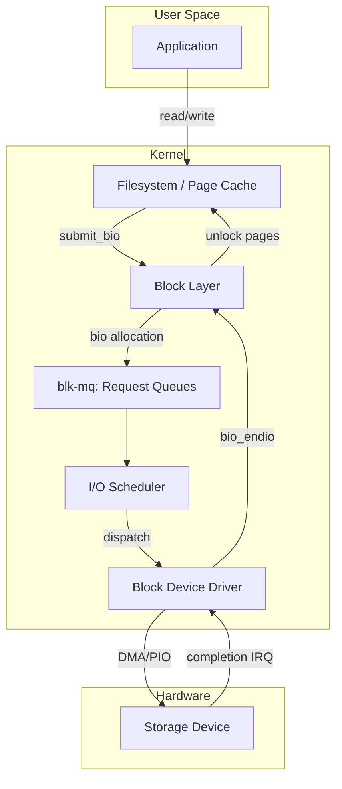
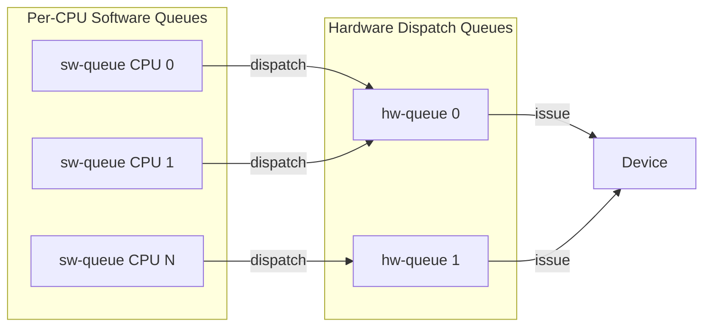
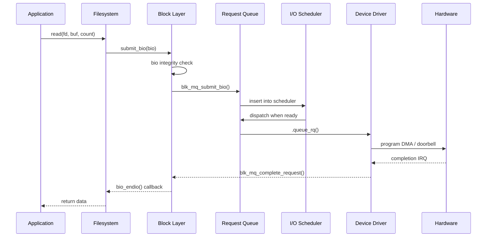
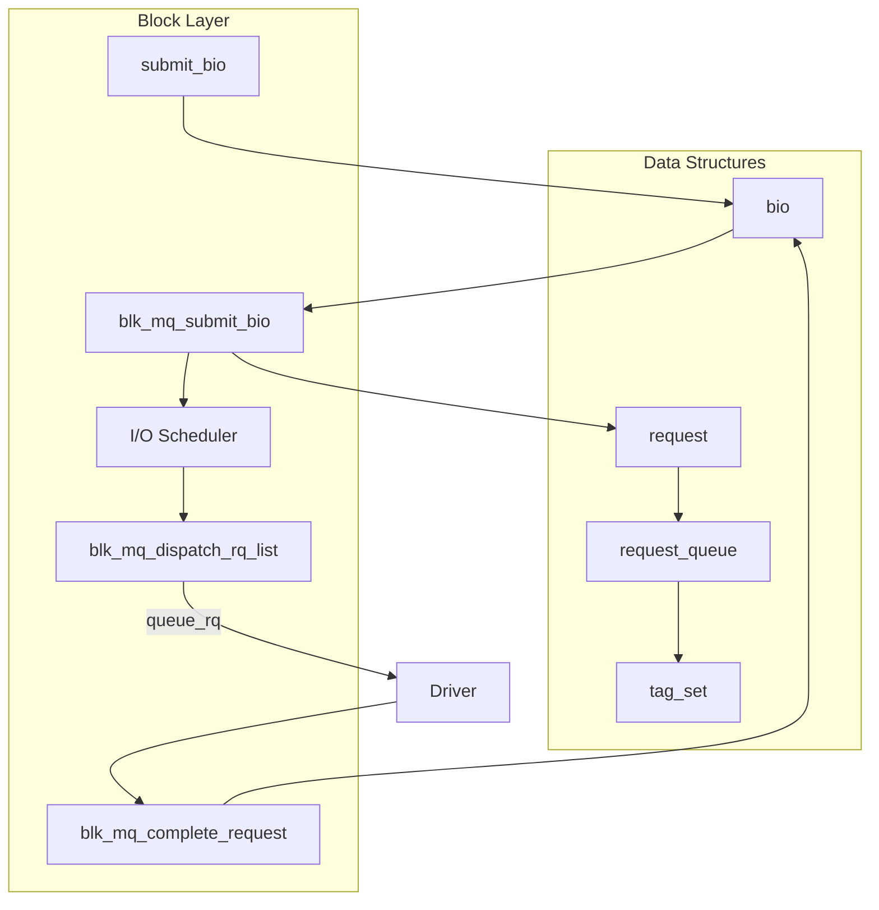

# Block Layer Overview

The Linux block layer sits between the file system / page cache and the
low-level device drivers that talk to storage hardware. It is responsible
for scheduling, merging, and dispatching I/O requests so that disk
throughput is maximized while latency remains bounded.

This chapter provides a high-level map of the block layer's architecture,
key data structures, and the I/O submission path from user space to
hardware completion.

---

## 1. Architecture at a Glance



---

## 2. The `bio` — Basic I/O Descriptor

The fundamental unit of I/O in the block layer is the **`bio`** (short for
"block I/O"). A `bio` describes one contiguous logical I/O operation
against a block device: a direction (read/write), a starting sector, a
set of pages/buffers, and a completion callback.

```c
struct bio {
    struct block_device *bi_bdev;
    unsigned int        bi_opf;        /* op | flags */
    blk_status_t        bi_status;
    atomic_t            __bi_remaining;
    bio_end_io_t        *bi_end_io;    /* completion callback */
    void                *bi_private;
    unsigned short      bi_vcnt;       /* number of bio_vecs */
    unsigned short      bi_idx;        /* current bio_vec index */
    struct bio_vec      *bi_io_vec;    /* array of segments */
    /* ... more fields ... */
};
```

> **Key point**: A `bio` is *not* a request. Multiple bios can be merged
> into a single request by the block layer. See [Bio Structures](bio.md)
> for full details.

### Operations (`bi_opf`)

The operation field encodes both the **opcode** and **flags**:

| Opcode | Meaning |
|---|---|
| `REQ_OP_READ` | Read data |
| `REQ_OP_WRITE` | Write data |
| `REQ_OP_FLUSH` | Flush volatile caches |
| `REQ_OP_DISCARD` | Discard blocks (TRIM/UNMAP) |
| `REQ_OP_SECURE_ERASE` | Cryptographic erase |
| `REQ_OP_ZONE_APPEND` | Zoned device sequential write |

Common flags:

| Flag | Meaning |
|---|---|
| `REQ_SYNC` | Synchronous I/O — do not delay |
| `REQ_IDLE` | Hint: no more I/O coming soon |
| `REQ_PREFETCH` | Hint: data will be used soon |

---

## 3. Request Queues and `blk-mq`

Modern Linux (since 3.13) uses the **multi-queue block I/O queuing
mechanism** (`blk-mq`) instead of the legacy single-queue path. `blk-mq`
is designed for modern NVMe and multi-core devices that have multiple
hardware submission queues.



### `request_queue`

Every block device has a `request_queue` that holds pending bios and
requests:

```c
struct request_queue {
    struct blk_mq_tag_set   *tag_set;
    struct blk_mq_ops       *mq_ops;
    struct elevator_queue   *elevator;
    struct request          *last_merge;
    /* queue limits, flags, etc. */
};
```

### Software and Hardware Queues

- **Software queues (ctx)**: One per CPU. Bios are staged here before
  being dispatched.
- **Hardware queues (hctx)**: One per hardware dispatch queue. The
  driver maps these to actual device queues.

The number of hardware queues is configured by the driver via
`blk_mq_alloc_tag_set()`.

---

## 4. Plug / Unplug Mechanism

To reduce lock contention and enable request merging, the block layer
uses a **plug** mechanism:

1. The submitting thread **plugs** the queue (starts collecting bios).
2. Multiple bios are queued without immediately dispatching.
3. The thread **unplugs** — all accumulated bios are dispatched together.

```c
blk_start_plug(&plug);
submit_bio(bio1);
submit_bio(bio2);
submit_bio(bio3);
blk_finish_plug(&plug);   /* dispatches all at once */
```

This is analogous to batching: instead of acquiring the queue lock for
each bio, we acquire it once at unplug time.

### Implicit Plugging

The page cache's `submit_bio()` calls are typically wrapped in plug
blocks already. Drivers rarely need to plug explicitly unless they are
generating multiple bios themselves.

---

## 5. I/O Submission Path

A typical read or write follows this path:



### Step-by-Step

1. **`submit_bio(bio)`** — Entry point. The filesystem (or any bio
   submitter) calls this.
2. **`blk_mq_submit_bio()`** — The core submission path. It:
   - Attempts to **merge** the bio with an existing request.
   - If no merge, allocates a new request from the tag set.
   - Inserts the request into the software queue.
   - Checks if the queue should be dispatched (unplug or direct).
3. **I/O Scheduler** — If enabled, the scheduler reorders requests for
   fairness or throughput.
4. **`queue_rq()`** — The driver's callback to issue the request to
   hardware.
5. **Completion** — The driver calls `blk_mq_complete_request()` which
   invokes the bio's `bi_end_io` callback.

---

## 6. I/O Schedulers

The Linux block layer supports pluggable I/O schedulers. The scheduler
sits between the software queues and the hardware dispatch path.

| Scheduler | Target | Characteristics |
|---|---|---|
| **none** | NVMe, fast devices | No reordering; FIFO |
| **mq-deadline** | HDDs, SATA SSDs | Per-request timeout; read vs. write fairness |
| **bfq** | Desktop / interactive | Budget fairness; low latency |
| **kyber** | Fast SSDs | Token-based; tunable read/write latency |

See [I/O Schedulers](io-schedulers.md) for detailed coverage.

---

## 7. Queue Limits

Every request queue has **limits** that describe the device's capabilities:

```c
struct queue_limits {
    unsigned int    max_sectors;       /* max sectors per request */
    unsigned int    max_segment_size;  /* max size of a single segment */
    unsigned short  max_segments;      /* max scatter-gather segments */
    unsigned int    logical_block_size;
    unsigned int    physical_block_size;
    unsigned int    io_min;
    unsigned int    chunk_sectors;
    /* ... */
};
```

Drivers configure these when setting up the queue. The block layer
enforces them when splitting bios that exceed device limits.

---

## 8. Block Device Registration

A block device driver typically:

1. Allocates a `gendisk` structure.
2. Sets up a `request_queue` with `blk_mq_init_queue()` or
   `blk_mq_alloc_disk()`.
3. Registers the `block_device_operations` callbacks.
4. Calls `add_disk()` to make the device visible.

```c
struct gendisk *disk = blk_mq_alloc_disk(&tag_set, NULL);
disk->major = MY_MAJOR;
disk->first_minor = 0;
disk->minors = 1;
disk->fops = &my_block_ops;
strscpy(disk->disk_name, "mydev", sizeof(disk->disk_name));
set_capacity(disk, num_sectors);
add_disk(disk);
```

See [Block Devices](devices.md) for registration details.

---

## 9. Error Handling

When a bio completes with an error, the driver sets `bio->bi_status` to
a `blk_status_t` value before calling `bio_endio()`:

| Status | Meaning |
|---|---|
| `BLK_STS_OK` | Success |
| `BLK_STS_IOERR` | Generic I/O error |
| `BLK_STS_RESOURCE` | Resource unavailable; retry |
| `BLK_STS_NOSPC` | No space left |
| `BLK_STS_MEDIUM` | Medium error (bad sector) |
| `BLK_STS_TARGET` | Target/transport error |

The filesystem translates these into `-EIO`, `-ENOSPC`, etc.

---

## 10. The Legacy Path (Optional)

Before `blk-mq`, the block layer used a single request queue per device
with elevator-based scheduling. This path was removed in kernel 5.20
(late 2022). All modern drivers must use `blk-mq`.

---

## 11. Block Layer Subsystem Map



---

## Further Reading

- [Linux kernel docs — Block layer](https://docs.kernel.org/block/index.html)
- [Linux kernel docs — blk-mq](https://docs.kernel.org/block/blk-mq.html)
- [LWN: The multiqueue block layer](https://lwn.net/Articles/552904/)
- [LWN: Plugging and unplugging the block layer](https://lwn.net/Articles/539840/)
- [Linux Storage Stack Diagram](https://www.thomas-krenn.com/en/wiki/Linux_Storage_Stack_Diagram)

## Related Topics

- [Bio Structures](bio.md) — detailed bio and bio_vec anatomy
- [Block Devices](devices.md) — gendisk and registration
- [I/O Schedulers](io-schedulers.md) — mq-deadline, BFQ, kyber
- [Request Queues](request-queues.md) — blk-mq internals
- [Device Mapper](device-mapper.md) — virtual block devices
