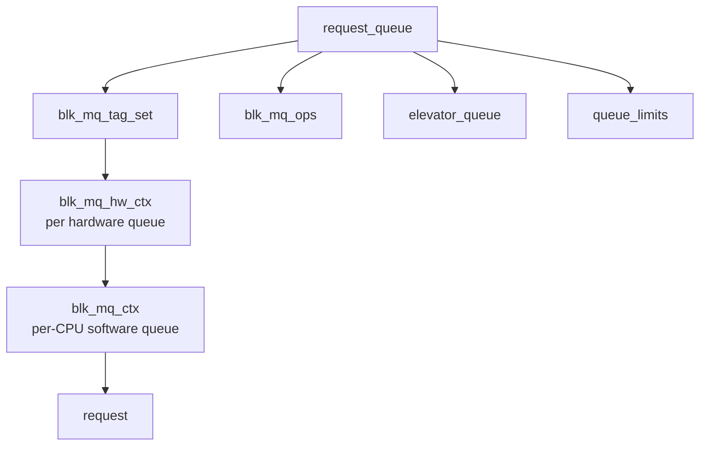
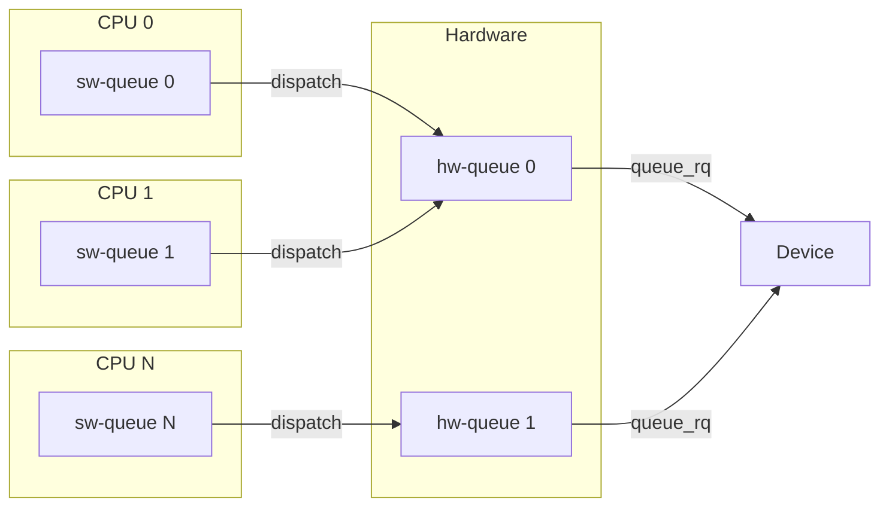
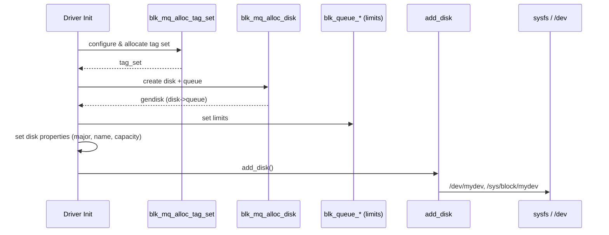
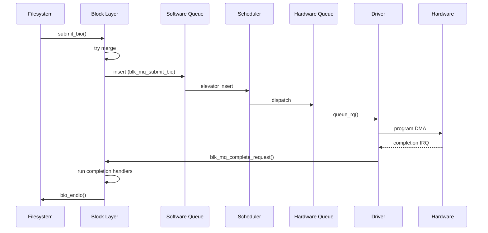
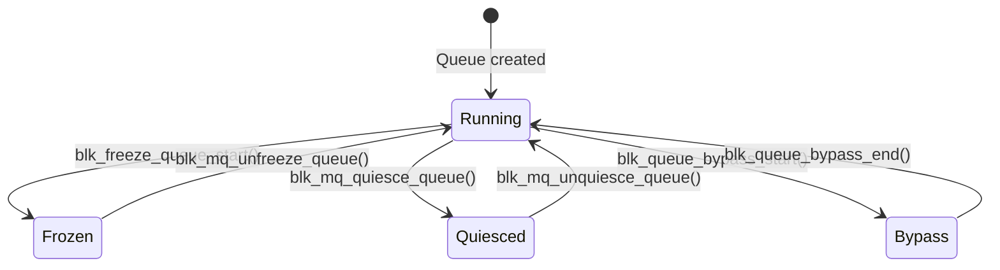
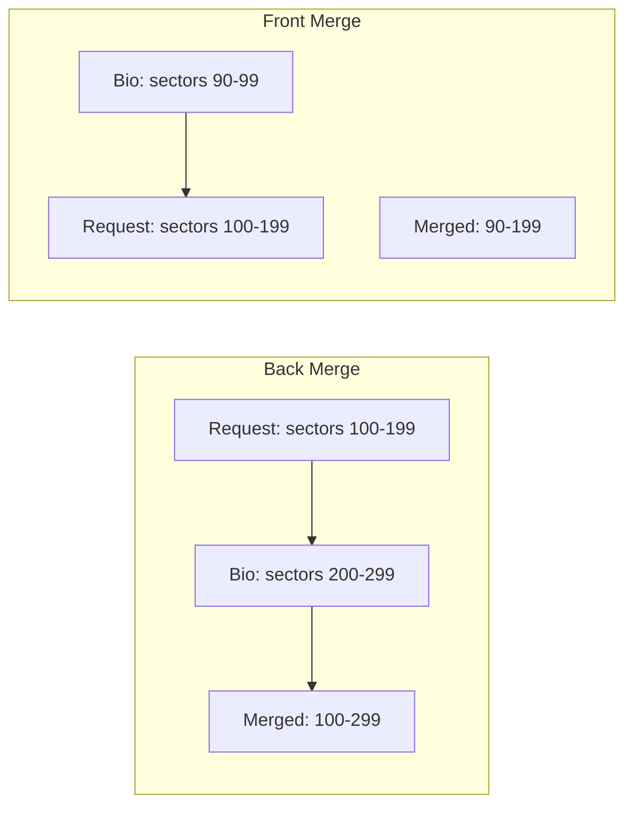
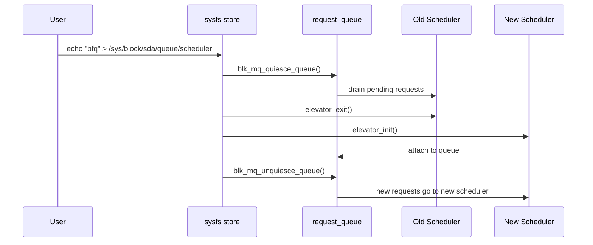
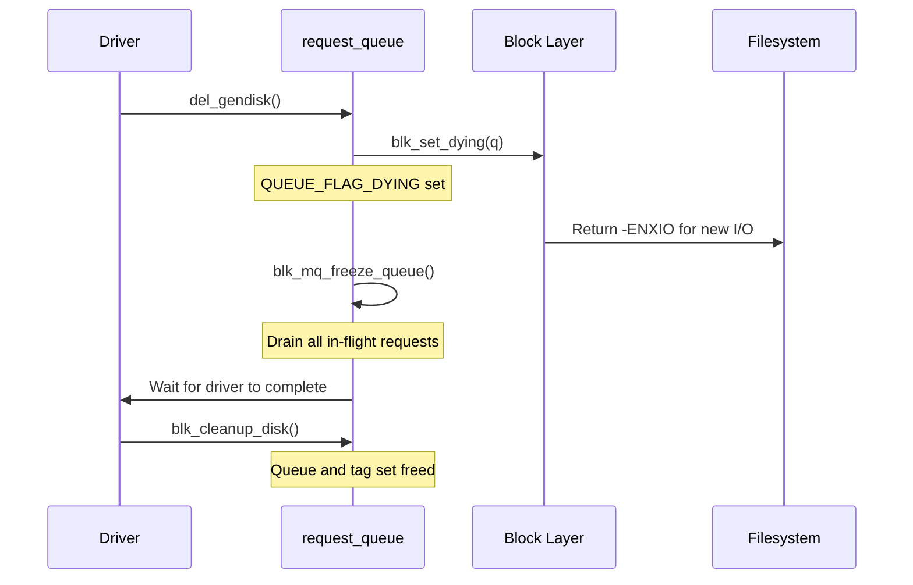

# Request Queues

The **request queue** (`request_queue`) is the central data structure
that connects block device drivers to the block layer. It manages the
lifecycle of I/O requests from creation through scheduling, dispatch,
and completion. In modern Linux, all request queues use the **blk-mq**
(multi-queue) infrastructure.

---

## 1. `request_queue` Structure

```c
struct request_queue {
    struct blk_mq_tag_set   *tag_set;     /* shared tag set */
    struct blk_mq_ops       *mq_ops;      /* driver callbacks */
    struct elevator_queue   *elevator;     /* active scheduler */
    struct request          *last_merge;   /* hint for merging */
    struct queue_limits     limits;        /* device limits */
    unsigned int            nr_requests;   /* max queued requests */
    unsigned long           queue_flags;   /* QUEUE_FLAG_* */
    spinlock_t              queue_lock;
    /* ... */
};
```

### Key Relationships



---

## 2. blk-mq Architecture

### 2.1 Tag Sets

A **`blk_mq_tag_set`** is shared across all request queues that belong
to the same hardware device. It defines the driver's capabilities:

```c
struct blk_mq_tag_set {
    const struct blk_mq_ops *ops;
    unsigned int    nr_hw_queues;    /* number of HW dispatch queues */
    unsigned int    queue_depth;     /* max tags (in-flight requests) */
    unsigned int    reserved_tags;   /* tags reserved for internal use */
    unsigned int    cmd_size;        /* per-request driver data size */
    int             numa_node;       /* NUMA affinity */
    unsigned int    flags;           /* BLK_MQ_F_* flags */
    void            *driver_data;    /* driver private pointer */
    /* ... */
};
```

### 2.2 Hardware Dispatch Queues (`blk_mq_hw_ctx`)

Each hardware queue maps to one or more device submission queues. For
NVMe, each hardware queue corresponds to a submission/completion queue
pair. For SATA (which has one hardware queue), there's only one
`blk_mq_hw_ctx`.

### 2.3 Software Queues (`blk_mq_ctx`)

One per CPU. Bio submissions land in the local CPU's software queue.
When the queue is flushed (unplug), requests are dispatched from
software queues to hardware queues.



---

## 3. Setting Up a Request Queue

### 3.1 Define the Tag Set

```c
static struct blk_mq_tag_set my_tag_set;

my_tag_set.ops = &my_mq_ops;
my_tag_set.nr_hw_queues = num_online_cpus();  /* or device's queue count */
my_tag_set.queue_depth = 256;
my_tag_set.numa_node = NUMA_NO_NODE;
my_tag_set.cmd_size = sizeof(struct my_request_data);
my_tag_set.flags = BLK_MQ_F_SHOULD_MERGE;
my_tag_set.driver_data = my_dev;
```

### 3.2 Allocate the Queue + Disk

```c
struct gendisk *disk = blk_mq_alloc_disk(&my_tag_set, my_private);
if (IS_ERR(disk))
    return PTR_ERR(disk);

struct request_queue *q = disk->queue;
```

### 3.3 Configure Queue Limits

```c
blk_queue_logical_block_size(q, 512);
blk_queue_physical_block_size(q, 4096);
blk_queue_max_hw_sectors(q, 1024);        /* max I/O in sectors */
blk_queue_max_segments(q, 128);           /* max SG segments */
blk_queue_max_segment_size(q, 65536);     /* max single segment */
blk_queue_dma_alignment(q, 511);          /* DMA alignment mask */
```

### 3.4 Full Setup Sequence



---

## 4. `blk_mq_ops` — Driver Callbacks

```c
static const struct blk_mq_ops my_mq_ops = {
    .queue_rq       = my_queue_rq,
    .complete       = my_complete,
    .init_request   = my_init_request,
    .exit_request   = my_exit_request,
    .timeout        = my_timeout,
    .map_queues     = my_map_queues,
};
```

### 4.1 `queue_rq` — The Core Dispatch Callback

Called by the block layer to issue a request to hardware:

```c
static blk_status_t my_queue_rq(struct blk_mq_hw_ctx *hctx,
                                const struct blk_mq_queue_data *bd)
{
    struct request *rq = bd->rq;

    blk_mq_start_request(rq);   /* mark request as in-flight */

    /* Program hardware... */
    struct my_request_data *d = blk_mq_rq_to_pdu(rq);
    d->cookie = submit_to_hw(rq);

    return BLK_STS_OK;
}
```

### 4.2 `complete` — Request Completion

Called from IRQ context when hardware signals completion:

```c
static void my_complete(struct request *rq)
{
    blk_status_t status = hw_error(rq) ? BLK_STS_IOERR : BLK_STS_OK;
    blk_mq_end_request(rq, status);
}
```

### 4.3 `timeout` — Request Timeout

Called when a request exceeds its timeout:

```c
static enum blk_eh_timer_return my_timeout(struct request *rq,
                                           bool reserved)
{
    pr_err("request timed out!\n");
    /* Try to recover or reset the device */
    return BLK_EH_RESET_TIMER;  /* retry */
    // return BLK_EH_DONE;      /* give up */
}
```

### 4.4 `map_queues` — CPU-to-Queue Mapping

Maps software queues to hardware queues. For single-queue devices:

```c
static int my_map_queues(struct blk_mq_tag_set *set)
{
    return blk_mq_map_queues(&set->map[HCTX_TYPE_DEFAULT],
                             NUMA_NO_NODE, 0);
}
```

---

## 5. Request Lifecycle



### Request States

| State | Meaning |
|---|---|
| `MQ_RQ_IDLE` | Request allocated, not yet issued |
| `MQ_RQ_IN_FLIGHT` | `blk_mq_start_request()` called; in driver |
| `MQ_RQ_COMPLETE` | Hardware completed; running end_io |

---

## 6. Per-Request Driver Data

Each request can carry driver-private data at the end of the `request`
structure, sized by `tag_set.cmd_size`:

```c
struct my_request_data {
    dma_addr_t dma_addr;
    struct my_cmd cmd;
};

/* In queue_rq: */
struct my_request_data *d = blk_mq_rq_to_pdu(rq);
d->dma_addr = dma_map_single(...);
```

This avoids allocating separate structures for each in-flight request.

---

## 7. Hardware Dispatch

The **dispatch** path moves requests from the scheduler (or software
queue) to the hardware queue and calls the driver's `queue_rq`:

```c
/* Internal: called by scheduler or flush path */
bool blk_mq_dispatch_rq_list(struct blk_mq_hw_ctx *hctx,
                             struct list_head *list, bool got_budget);
```

### Direct Dispatch

When the scheduler is `none`, or when the request is marked for direct
dispatch (e.g., flush requests), the block layer bypasses the scheduler:

```c
blk_mq_request_issue_directly(rq);
```

### Dispatch Budget

Before dispatching, the hardware queue checks if it has **budget**
(available tags). If not, requests are queued until tags are freed.

---

## 8. Queue Limits in Detail

| Limit | Getter/Setter | Description |
|---|---|---|
| Logical block size | `blk_queue_logical_block_size()` | Minimum I/O unit (usually 512) |
| Physical block size | `blk_queue_physical_block_size()` | Actual hardware sector (often 4096) |
| Max sectors | `blk_queue_max_hw_sectors()` | Maximum I/O size in sectors |
| Max segments | `blk_queue_max_segments()` | Max scatter-gather entries |
| Max segment size | `blk_queue_max_segment_size()` | Max bytes per SG segment |
| Max discard sectors | `blk_queue_max_discard_sectors()` | Max TRIM/UNMAP size |
| Max write zeroes | `blk_queue_max_write_zeroes_sectors()` | Max write-same-zeroes |
| Alignment | `blk_queue_dma_alignment()` | DMA alignment mask |
| Chunk sectors | `blk_queue_chunk_sectors()` | RAID stripe size |
| Virt boundary | `blk_queue_virt_boundary()` | Memory boundary for SG entries |

### Viewing Limits

```bash
$ cat /sys/block/sda/queue/max_sectors_kb
1280
$ cat /sys/block/sda/queue/max_hw_sectors_kb
1280
$ cat /sys/block/sda/queue/logical_block_size
512
$ cat /sys/block/sda/queue/physical_block_size
4096
$ cat /sys/block/sda/queue/max_segments
168
```

---

## 9. Request Completion

### 9.1 Simple Completion

```c
blk_mq_end_request(rq, BLK_STS_OK);
```

This is equivalent to:
1. Set `rq->bio->bi_status`.
2. Call `blk_mq_free_request(rq)`.
3. Invoke each bio's `bi_end_io` callback.

### 9.2 Partial Completion

For requests where only some bytes were transferred:

```c
blk_mq_end_request(rq, BLK_STS_OK);
/* Block layer handles partial bio completion based on residual count */
```

### 9.3 Error Completion

```c
blk_mq_end_request(rq, BLK_STS_IOERR);
```

The filesystem receives the error and translates it to a user-space
errno (`-EIO`).

### 9.4 Completion from IRQ

Drivers typically complete requests from an interrupt handler:

```c
static irqreturn_t my_irq_handler(int irq, void *data)
{
    struct my_dev *dev = data;
    struct request *rq;

    while ((rq = next_completed_request(dev)) != NULL) {
        blk_mq_end_request(rq, rq_status(rq));
    }

    return IRQ_HANDLED;
}
```

---

## 10. Queue Flags

| Flag | Meaning |
|---|---|
| `QUEUE_FLAG_STOPPED` | Queue is stopped |
| `QUEUE_FLAG_DYING` | Queue is being torn down |
| `QUEUE_FLAG_FUA` | Device supports FUA (Force Unit Access) |
| `QUEUE_FLAG_DISCARD` | Device supports TRIM/UNMAP |
| `QUEUE_FLAG_NONROT` | Non-rotational device (SSD) |
| `QUEUE_FLAG_WC` | Write-back caching enabled |

---

## 11. Freezing and Quiescing

The block layer provides mechanisms to pause I/O:

```c
/* Freeze: blocks all new I/O at the queue level */
blk_freeze_queue_start(q);
blk_mq_freeze_queue_wait(q);

/* Unfreeze: resume I/O */
blk_mq_unfreeze_queue(q);

/* Quiesce: drain in-flight requests (lighter than freeze) */
blk_mq_quiesce_queue(q);
/* ... do work ... */
blk_mq_unquiesce_queue(q);
```

Freezing is used during device removal, suspend, and reset paths.

### Freeze vs Quiesce

| Operation | New I/O | In-flight I/O | Use case |
|---|---|---|---|
| Freeze | Blocked (enters bypass) | Continues until drained | Device removal, suspend |
| Quiesce | Queued (not dispatched) | Drains normally | Scheduler switch, reset |
| Bypass | Direct dispatch (skip scheduler) | Continues | Emergency I/O |



---

## 12. Request Merging

The block layer merges adjacent I/O requests to reduce overhead and improve throughput.
Merging happens at two levels: **bio merging** (before a request is created) and
**request merging** (combining an existing request with a new bio).

### 12.1 Merge Types



| Merge Type | Description | Condition |
|---|---|---|
| Back merge | Bio extends the end of an existing request | `rq->sector + rq->nr_sectors == bio->sector` |
| Front merge | Bio precedes the start of an existing request | `bio->sector + bio_sectors == rq->sector` |
| Bio merge | Two bios are combined before request allocation | Adjacent sectors, within limits |

### 12.2 Merge Heuristics

```c
/* block/blk-merge.c — attempt back merge */
static bool blk_attempt_back_merge(struct request *rq, struct bio *bio)
{
    if (!blk_rq_merge_ok(rq, bio, GFP_KERNEL))
        return false;

    if (!ll_back_merge_fn(rq, bio))
        return false;

    /* Check segment and sector limits */
    if (blk_rq_sectors(rq) + bio_sectors(bio) >
        blk_queue_get_max_sectors(blk_rq_dir(rq), q))
        return false;

    bio_attempt_back_merge(rq, bio);
    return true;
}
```

### 12.3 Sysfs Merge Tunables

```bash
# Maximum number of segments after merging
$ cat /sys/block/sda/queue/max_segments
168

# Maximum segment size (bytes)
$ cat /sys/block/sda/queue/max_segment_size
65536

# Maximum sectors per request (after merging)
$ cat /sys/block/sda/queue/max_sectors_kb
1280

# Minimum I/O size (used for alignment hints)
$ cat /sys/block/sda/queue/minimum_io_size
512

# Optimal I/O size (e.g., RAID stripe width)
$ cat /sys/block/sda/queue/optimal_io_size
0
```

---

## 13. Sysfs Queue Attributes

The block layer exposes extensive runtime configuration through
`/sys/block/<device>/queue/`. These files are backed by the
`struct queue_sysfs_entry` infrastructure in `block/blk-sysfs.c`.

### 13.1 Complete Attribute Reference

| Attribute | R/W | Description |
|---|---|---|
| `nr_requests` | RW | Max requests in queue (scheduler-managed) |
| `scheduler` | RW | Active I/O scheduler (e.g., `[mq-deadline] none`) |
| `max_sectors_kb` | RW | Max request size in KiB |
| `max_hw_sectors_kb` | RO | Hardware max request size |
| `logical_block_size` | RO | Logical sector size (usually 512) |
| `physical_block_size` | RO | Physical sector size (usually 4096) |
| `max_segments` | RO | Max scatter-gather segments |
| `max_segment_size` | RO | Max single segment bytes |
| `rotational` | RW | 1 for HDD, 0 for SSD (affects scheduler) |
| `nomerges` | RW | 0=merge, 1=no merge, 2=no simple merge |
| `rq_affinity` | RW | 0=any CPU, 1=same CPU, 2=same CPU + force |
| `io_poll` | RW | Polling mode for completions |
| `io_poll_delay` | RW | Polling delay (µs), -1 for exclusive |
| `wbt_lat_usec` | RW | Write-back throttling latency target |
| `read_ahead_kb` | RW | Read-ahead window size |
| `iostats` | RW | Enable/disable I/O statistics |
| `random` | RW | 1 if device is random-access (SSD) |
| `discard_*` | RO | Discard (TRIM/UNMAP) capabilities |
| `write_*` | RO | Write-zeroes capabilities |
| `zone_*` | RO | Zoned block device info |
| `virt_boundary_mask` | RO | Memory boundary for SG |

### 13.2 Reading and Modifying

```bash
# View all queue attributes
ls -la /sys/block/nvme0n1/queue/

# Check scheduler
$ cat /sys/block/nvme0n1/queue/scheduler
[mq-deadline] none

# Switch scheduler
$ echo none > /sys/block/nvme0n1/queue/scheduler
$ cat /sys/block/nvme0n1/queue/scheduler
[none] mq-deadline

# Adjust queue depth
$ echo 512 > /sys/block/nvme0n1/queue/nr_requests

# Enable/disable merging
$ echo 1 > /sys/block/nvme0n1/queue/nomerges  # disable all merging

# Configure I/O polling for latency
$ echo 1 > /sys/block/nvme0n1/queue/io_poll
```

### 13.3 Sysfs Internals

```c
/* block/blk-sysfs.c — sysfs attribute definition */
static struct queue_sysfs_entry {
    struct attribute attr;
    ssize_t (*show)(struct request_queue *, char *);
    ssize_t (*store)(struct request_queue *, const char *, size_t);
};

/* Example: scheduler attribute */
static ssize_t queue_scheduler_show(struct request_queue *q, char *page)
{
    struct elevator_queue *e = q->elevator;
    /* ... enumerate available schedulers, mark active ... */
    return sprintf(page, "%s\n", str);
}

static ssize_t queue_scheduler_store(struct request_queue *q,
                                     const char *page, size_t count)
{
    /* ... parse scheduler name, switch elevator ... */
    /* Involves: blk_mq_quiesce_queue, elevator_switch, blk_mq_unquiesce */
    return count;
}
```

---

## 14. I/O Scheduling Integration

The request queue holds a reference to the active I/O scheduler (elevator).
The scheduler is responsible for reordering requests to maximize throughput
or minimize latency.

### 14.1 Elevator Interface

```c
struct elevator_mq_ops {
    /* Insert a request into the scheduler */
    void (*insert_request)(struct blk_mq_hw_ctx *, struct request *,
                           blk_insert_t flags);

    /* Dispatch the next request to hardware */
    struct request *(*dispatch_request)(struct blk_mq_hw_ctx *);

    /* Called when a request finishes */
    void (*completed_request)(struct request *, u64);

    /* Requeue a request (e.g., after busy) */
    void (*requeue_request)(struct request *);

    /* Check if scheduler has work */
    bool (*has_work)(struct blk_mq_hw_ctx *);

    /* Initialize/exit per-hw-queue scheduler data */
    int (*init_hctx)(struct blk_mq_hw_ctx *, unsigned int);
    void (*exit_hctx)(struct blk_mq_hw_ctx *, unsigned int);

    /* Initialize/exit elevator */
    int (*init_sched)(struct request_queue *, struct elevator_type *);
    void (*exit_sched)(struct elevator_queue *);
};
```

### 14.2 Scheduler Switching at Runtime



---

## 15. Write-Back Throttling (WBT)

Write-back throttling (WBT) is a mechanism that automatically limits
write I/O submission rate to prevent dirty page accumulation from
overwhelming the device. It monitors completion latency and adjusts
the write queue depth accordingly.

```c
/* block/blk-wbt.c — simplified */
void wbt_issue(struct rq_wb *rwb, struct rq_qos *rqos,
               struct request *rq)
{
    /* Record issue timestamp for latency measurement */
    rq->wbt_flags |= WBT_ISSUED;
}

void wbt_done(struct rq_wb *rwb, struct rq_qos *rqos,
              struct request *rq)
{
    /* Measure completion latency */
    u64 lat = ktime_get_ns() - rq->io_start_time_ns;

    /* Adjust scale based on latency vs target */
    if (lat > rwb->min_lat_nsec)
        scale = wbt_scale_down(rwb);  /* reduce write depth */
    else
        scale = wbt_scale_up(rwb);    /* increase write depth */
}
```

### WBT Configuration

```bash
# Set latency target (microseconds)
$ echo 2000 > /sys/block/sda/queue/wbt_lat_usec
# Write-back throttling targets 2ms completion latency

# Disable WBT
$ echo 0 > /sys/block/sda/queue/wbt_lat_usec

# Current WBT state (in kernel: rq_wb struct)
# Traced via tracepoints:
$ echo 1 > /sys/kernel/debug/tracing/events/block/block_rq_issue/enable
```

---

## 16. Debugging and Tracing

The block layer provides extensive tracing and debugging facilities.

### 16.1 Block Tracepoints

```bash
# List all block tracepoints
$ ls /sys/kernel/debug/tracing/events/block/
block_bio_backmerge   block_bio_queue      block_rq_complete
block_bio_bounce      block_rq_abort       block_rq_insert
block_bio_complete    block_rq_issue       block_rq_remap
block_bio_frontmerge  block_rq_requeue     block_split

# Trace all block I/O
$ echo 1 > /sys/kernel/debug/tracing/events/block/enable
$ cat /sys/kernel/debug/tracing/trace_pipe
# <...>-1234  [001] ....  1234.567890: block_rq_issue:
#   259,0 R 0 () 123456 + 8 [cat]

# Decode: major,minor READ offset + sectors [process]
```

### 16.2 blktrace / blkparse

```bash
# Capture block trace for /dev/sda
$ blktrace -d /dev/sda -o - | blktrace -i - -d sda
$ blkparse -i sda -o sda_parsed.txt

# Or one-liner:
$ blktrace -d /dev/sda -o - | blkparse -i -
#   8,0    1        1     0.000000000  1234  A   R 123456 + 8 <- (8,0) 123456
#   8,0    1        2     0.000012345  1234  Q   R 123456 + 8 [cat]
#   8,0    1        3     0.000015000  1234  G   R 123456 + 8 [cat]
#   8,0    1        4     0.000020000  1234  I   R 123456 + 8 [cat]
#   8,0    1        5     0.000025000  1234  D   R 123456 + 8 [cat]
#   8,0    1        6     0.000250000  1234  C   R 123456 + 8 [0]
```

### 16.3 blk-mq Debug Info

```bash
# Queue state in debugfs
$ ls /sys/kernel/debug/block/sda/
hctx0/  hctx1/  hctx2/  hctx3/

$ cat /sys/kernel/debug/block/sda/hctx0/active
# Shows active requests on this hardware context

# Request allocation state
$ cat /sys/kernel/debug/block/sda/hctx0/tags
# Tag allocation bitmap

# Scheduler-specific debug (e.g., mq-deadline)
$ cat /sys/kernel/debug/block/sda/sched/
starved  read_fifo_batch  write_fifo_batch  writes_starved
```

### 16.4 /proc/diskstats

```bash
$ cat /proc/diskstats
#  major minor name reads_completed reads_merged sectors_read ...
#    8     0 sda   1234567        89012    98765432  ...
# Fields (per Documentation/admin-guide/iostats.rst):
#  1  reads_completed    - total reads
#  2  reads_merged       - merged reads
#  3  sectors_read       - total sectors read
#  4  read_time_ms       - time spent reading (ms)
#  5  writes_completed   - total writes
#  6  writes_merged      - merged writes
#  7  sectors_written    - total sectors written
#  8  write_time_ms      - time spent writing (ms)
#  9  io_in_flight       - I/Os currently in progress
# 10  io_time_ms         - time doing I/Os (ms)
# 11  weighted_io_time_ms - weighted I/O time (ms)
```

### 16.5 /proc/sysvmem and /proc/buddyinfo

```bash
# Check block device allocation pressure
$ cat /proc/buddyinfo
# Node 0, zone      DMA      1      1      0      1      1 ...
# Node 0, zone    DMA32    256    128     64     32     16 ...

# Check if block layer is allocating memory
$ grep -i "block" /proc/slabinfo | head -5
# blkdev_requests   ...  # request pool
# bio-0             ...  # bio pool
```

---

## 17. Queue Teardown

When a block device is removed, the queue must be torn down gracefully:



```c
/* Driver removal sequence */
static void my_remove(struct my_dev *dev)
{
    /* 1. Mark queue as dying — new I/O gets ENXIO */
    del_gendisk(dev->disk);

    /* 2. Freeze and drain in-flight requests */
    blk_mq_freeze_queue(dev->queue);

    /* 3. Stop hardware */
    my_hw_stop(dev);

    /* 4. Clean up disk and queue */
    put_disk(dev->disk);

    /* 5. Free tag set */
    blk_mq_free_tag_set(&dev->tag_set);
}
```

---

## 18. Runtime PM Integration

The block layer integrates with the kernel's runtime power management
(RPM) framework to auto-suspend idle devices:

```c
/* block/blk-pm.c */
void blk_pm_runtime_init(struct request_queue *q, struct device *dev)
{
    q->dev = dev;
    q->rpm_status = RPM_ACTIVE;
    /* ... */
}

/* Called when a request completes and queue becomes idle */
void blk_post_runtime_resume(struct request_queue *q)
{
    /* ... resume queue, dispatch queued I/O ... */
}
```

### Runtime PM Attributes

```bash
# Enable runtime PM for a block device
$ echo auto > /sys/block/sda/device/power/control

# Set autosuspend delay (ms)
$ echo 5000 > /sys/block/sda/device/power/autosuspend_delay_ms

# Check power state
$ cat /sys/block/sda/device/power/runtime_status
active

# View PM statistics
$ cat /sys/block/sda/device/power/runtime_active_time
$ cat /sys/block/sda/device/power/runtime_suspended_time
```

---

## Further Reading

- [GNU Project Documentation](https://www.gnu.org/doc/doc.html)
- [GNU Manuals](https://www.gnu.org/manual/manual.html)
- [Free Software Directory](https://directory.fsf.org/wiki/Main_Page)
- [Planet GNU](https://planet.gnu.org/)
- [Free Software Books](https://www.gnu.org/doc/other-free-books.html)

- [Linux kernel docs — blk-mq](https://docs.kernel.org/block/blk-mq.html)
- [Linux kernel docs — request_queue API](https://docs.kernel.org/block/request.html)
- [LWN: The multiqueue block layer](https://lwn.net/Articles/552904/)
- [kernel.org — block/blk-mq.c](https://git.kernel.org/pub/scm/linux/kernel/git/torvalds/linux.git/tree/block/blk-mq.c)
- [kernel.org — include/linux/blk-mq.h](https://git.kernel.org/pub/scm/linux/kernel/git/torvalds/linux.git/tree/include/linux/blk-mq.h)

## Related Topics

- [Block Layer Overview](overview.md) — high-level architecture
- [Bio Structures](bio.md) — the data carried by requests
- [I/O Schedulers](io-schedulers.md) — request reordering
- [Block Devices](devices.md) — gendisk and device registration
- [Device Mapper](device-mapper.md) — stacking request queues
