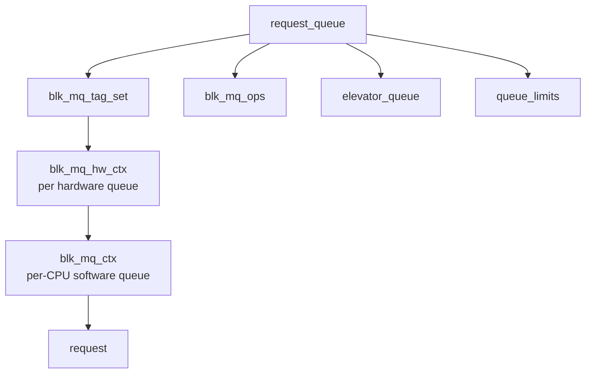
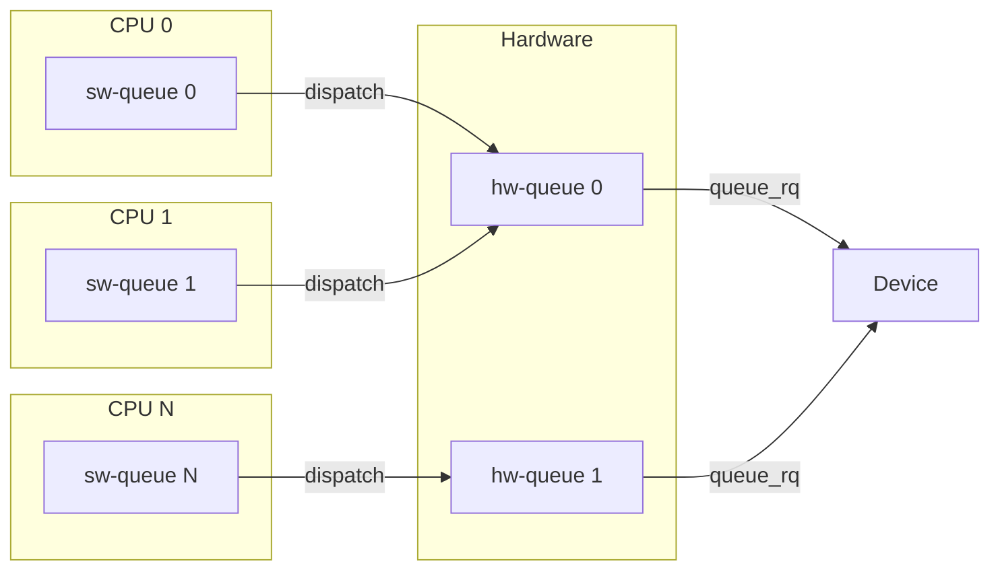
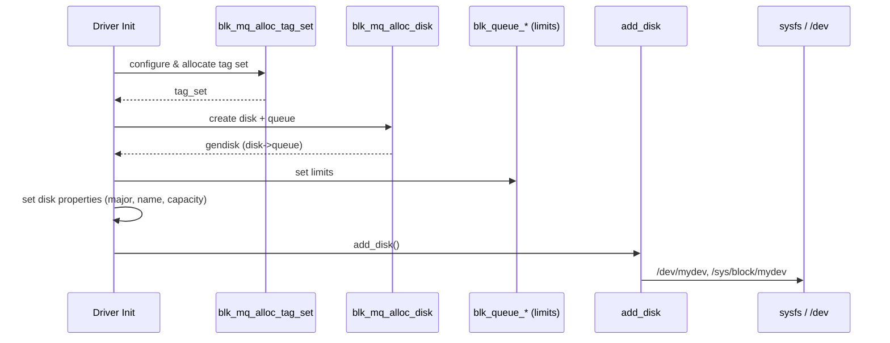
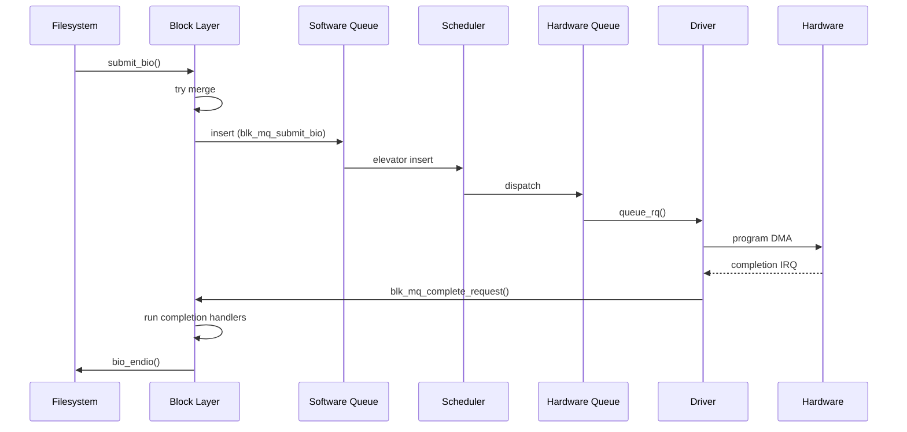

# Request Queues

The **request queue** (`request_queue`) is the central data structure
that connects block device drivers to the block layer. It manages the
lifecycle of I/O requests from creation through scheduling, dispatch,
and completion. In modern Linux, all request queues use the **blk-mq**
(multi-queue) infrastructure.

---

## 1. `request_queue` Structure

```c
struct request_queue {
    struct blk_mq_tag_set   *tag_set;     /* shared tag set */
    struct blk_mq_ops       *mq_ops;      /* driver callbacks */
    struct elevator_queue   *elevator;     /* active scheduler */
    struct request          *last_merge;   /* hint for merging */
    struct queue_limits     limits;        /* device limits */
    unsigned int            nr_requests;   /* max queued requests */
    unsigned long           queue_flags;   /* QUEUE_FLAG_* */
    spinlock_t              queue_lock;
    /* ... */
};
```

### Key Relationships



---

## 2. blk-mq Architecture

### 2.1 Tag Sets

A **`blk_mq_tag_set`** is shared across all request queues that belong
to the same hardware device. It defines the driver's capabilities:

```c
struct blk_mq_tag_set {
    const struct blk_mq_ops *ops;
    unsigned int    nr_hw_queues;    /* number of HW dispatch queues */
    unsigned int    queue_depth;     /* max tags (in-flight requests) */
    unsigned int    reserved_tags;   /* tags reserved for internal use */
    unsigned int    cmd_size;        /* per-request driver data size */
    int             numa_node;       /* NUMA affinity */
    unsigned int    flags;           /* BLK_MQ_F_* flags */
    void            *driver_data;    /* driver private pointer */
    /* ... */
};
```

### 2.2 Hardware Dispatch Queues (`blk_mq_hw_ctx`)

Each hardware queue maps to one or more device submission queues. For
NVMe, each hardware queue corresponds to a submission/completion queue
pair. For SATA (which has one hardware queue), there's only one
`blk_mq_hw_ctx`.

### 2.3 Software Queues (`blk_mq_ctx`)

One per CPU. Bio submissions land in the local CPU's software queue.
When the queue is flushed (unplug), requests are dispatched from
software queues to hardware queues.



---

## 3. Setting Up a Request Queue

### 3.1 Define the Tag Set

```c
static struct blk_mq_tag_set my_tag_set;

my_tag_set.ops = &my_mq_ops;
my_tag_set.nr_hw_queues = num_online_cpus();  /* or device's queue count */
my_tag_set.queue_depth = 256;
my_tag_set.numa_node = NUMA_NO_NODE;
my_tag_set.cmd_size = sizeof(struct my_request_data);
my_tag_set.flags = BLK_MQ_F_SHOULD_MERGE;
my_tag_set.driver_data = my_dev;
```

### 3.2 Allocate the Queue + Disk

```c
struct gendisk *disk = blk_mq_alloc_disk(&my_tag_set, my_private);
if (IS_ERR(disk))
    return PTR_ERR(disk);

struct request_queue *q = disk->queue;
```

### 3.3 Configure Queue Limits

```c
blk_queue_logical_block_size(q, 512);
blk_queue_physical_block_size(q, 4096);
blk_queue_max_hw_sectors(q, 1024);        /* max I/O in sectors */
blk_queue_max_segments(q, 128);           /* max SG segments */
blk_queue_max_segment_size(q, 65536);     /* max single segment */
blk_queue_dma_alignment(q, 511);          /* DMA alignment mask */
```

### 3.4 Full Setup Sequence



---

## 4. `blk_mq_ops` — Driver Callbacks

```c
static const struct blk_mq_ops my_mq_ops = {
    .queue_rq       = my_queue_rq,
    .complete       = my_complete,
    .init_request   = my_init_request,
    .exit_request   = my_exit_request,
    .timeout        = my_timeout,
    .map_queues     = my_map_queues,
};
```

### 4.1 `queue_rq` — The Core Dispatch Callback

Called by the block layer to issue a request to hardware:

```c
static blk_status_t my_queue_rq(struct blk_mq_hw_ctx *hctx,
                                const struct blk_mq_queue_data *bd)
{
    struct request *rq = bd->rq;

    blk_mq_start_request(rq);   /* mark request as in-flight */

    /* Program hardware... */
    struct my_request_data *d = blk_mq_rq_to_pdu(rq);
    d->cookie = submit_to_hw(rq);

    return BLK_STS_OK;
}
```

### 4.2 `complete` — Request Completion

Called from IRQ context when hardware signals completion:

```c
static void my_complete(struct request *rq)
{
    blk_status_t status = hw_error(rq) ? BLK_STS_IOERR : BLK_STS_OK;
    blk_mq_end_request(rq, status);
}
```

### 4.3 `timeout` — Request Timeout

Called when a request exceeds its timeout:

```c
static enum blk_eh_timer_return my_timeout(struct request *rq,
                                           bool reserved)
{
    pr_err("request timed out!\n");
    /* Try to recover or reset the device */
    return BLK_EH_RESET_TIMER;  /* retry */
    // return BLK_EH_DONE;      /* give up */
}
```

### 4.4 `map_queues` — CPU-to-Queue Mapping

Maps software queues to hardware queues. For single-queue devices:

```c
static int my_map_queues(struct blk_mq_tag_set *set)
{
    return blk_mq_map_queues(&set->map[HCTX_TYPE_DEFAULT],
                             NUMA_NO_NODE, 0);
}
```

---

## 5. Request Lifecycle



### Request States

| State | Meaning |
|---|---|
| `MQ_RQ_IDLE` | Request allocated, not yet issued |
| `MQ_RQ_IN_FLIGHT` | `blk_mq_start_request()` called; in driver |
| `MQ_RQ_COMPLETE` | Hardware completed; running end_io |

---

## 6. Per-Request Driver Data

Each request can carry driver-private data at the end of the `request`
structure, sized by `tag_set.cmd_size`:

```c
struct my_request_data {
    dma_addr_t dma_addr;
    struct my_cmd cmd;
};

/* In queue_rq: */
struct my_request_data *d = blk_mq_rq_to_pdu(rq);
d->dma_addr = dma_map_single(...);
```

This avoids allocating separate structures for each in-flight request.

---

## 7. Hardware Dispatch

The **dispatch** path moves requests from the scheduler (or software
queue) to the hardware queue and calls the driver's `queue_rq`:

```c
/* Internal: called by scheduler or flush path */
bool blk_mq_dispatch_rq_list(struct blk_mq_hw_ctx *hctx,
                             struct list_head *list, bool got_budget);
```

### Direct Dispatch

When the scheduler is `none`, or when the request is marked for direct
dispatch (e.g., flush requests), the block layer bypasses the scheduler:

```c
blk_mq_request_issue_directly(rq);
```

### Dispatch Budget

Before dispatching, the hardware queue checks if it has **budget**
(available tags). If not, requests are queued until tags are freed.

---

## 8. Queue Limits in Detail

| Limit | Getter/Setter | Description |
|---|---|---|
| Logical block size | `blk_queue_logical_block_size()` | Minimum I/O unit (usually 512) |
| Physical block size | `blk_queue_physical_block_size()` | Actual hardware sector (often 4096) |
| Max sectors | `blk_queue_max_hw_sectors()` | Maximum I/O size in sectors |
| Max segments | `blk_queue_max_segments()` | Max scatter-gather entries |
| Max segment size | `blk_queue_max_segment_size()` | Max bytes per SG segment |
| Max discard sectors | `blk_queue_max_discard_sectors()` | Max TRIM/UNMAP size |
| Max write zeroes | `blk_queue_max_write_zeroes_sectors()` | Max write-same-zeroes |
| Alignment | `blk_queue_dma_alignment()` | DMA alignment mask |
| Chunk sectors | `blk_queue_chunk_sectors()` | RAID stripe size |
| Virt boundary | `blk_queue_virt_boundary()` | Memory boundary for SG entries |

### Viewing Limits

```bash
$ cat /sys/block/sda/queue/max_sectors_kb
1280
$ cat /sys/block/sda/queue/max_hw_sectors_kb
1280
$ cat /sys/block/sda/queue/logical_block_size
512
$ cat /sys/block/sda/queue/physical_block_size
4096
$ cat /sys/block/sda/queue/max_segments
168
```

---

## 9. Request Completion

### 9.1 Simple Completion

```c
blk_mq_end_request(rq, BLK_STS_OK);
```

This is equivalent to:
1. Set `rq->bio->bi_status`.
2. Call `blk_mq_free_request(rq)`.
3. Invoke each bio's `bi_end_io` callback.

### 9.2 Partial Completion

For requests where only some bytes were transferred:

```c
blk_mq_end_request(rq, BLK_STS_OK);
/* Block layer handles partial bio completion based on residual count */
```

### 9.3 Error Completion

```c
blk_mq_end_request(rq, BLK_STS_IOERR);
```

The filesystem receives the error and translates it to a user-space
errno (`-EIO`).

### 9.4 Completion from IRQ

Drivers typically complete requests from an interrupt handler:

```c
static irqreturn_t my_irq_handler(int irq, void *data)
{
    struct my_dev *dev = data;
    struct request *rq;

    while ((rq = next_completed_request(dev)) != NULL) {
        blk_mq_end_request(rq, rq_status(rq));
    }

    return IRQ_HANDLED;
}
```

---

## 10. Queue Flags

| Flag | Meaning |
|---|---|
| `QUEUE_FLAG_STOPPED` | Queue is stopped |
| `QUEUE_FLAG_DYING` | Queue is being torn down |
| `QUEUE_FLAG_FUA` | Device supports FUA (Force Unit Access) |
| `QUEUE_FLAG_DISCARD` | Device supports TRIM/UNMAP |
| `QUEUE_FLAG_NONROT` | Non-rotational device (SSD) |
| `QUEUE_FLAG_WC` | Write-back caching enabled |

---

## 11. Freezing and Quiescing

The block layer provides mechanisms to pause I/O:

```c
/* Freeze: blocks all new I/O at the queue level */
blk_freeze_queue_start(q);
blk_mq_freeze_queue_wait(q);

/* Unfreeze: resume I/O */
blk_mq_unfreeze_queue(q);

/* Quiesce: drain in-flight requests (lighter than freeze) */
blk_mq_quiesce_queue(q);
/* ... do work ... */
blk_mq_unquiesce_queue(q);
```

Freezing is used during device removal, suspend, and reset paths.

---

## Further Reading

- [Linux kernel docs — blk-mq](https://docs.kernel.org/block/blk-mq.html)
- [Linux kernel docs — request_queue API](https://docs.kernel.org/block/request.html)
- [LWN: The multiqueue block layer](https://lwn.net/Articles/552904/)
- [kernel.org — block/blk-mq.c](https://git.kernel.org/pub/scm/linux/kernel/git/torvalds/linux.git/tree/block/blk-mq.c)
- [kernel.org — include/linux/blk-mq.h](https://git.kernel.org/pub/scm/linux/kernel/git/torvalds/linux.git/tree/include/linux/blk-mq.h)

## Related Topics

- [Block Layer Overview](overview.md) — high-level architecture
- [Bio Structures](bio.md) — the data carried by requests
- [I/O Schedulers](io-schedulers.md) — request reordering
- [Block Devices](devices.md) — gendisk and device registration
- [Device Mapper](device-mapper.md) — stacking request queues
