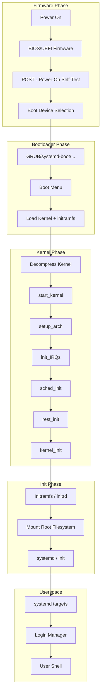
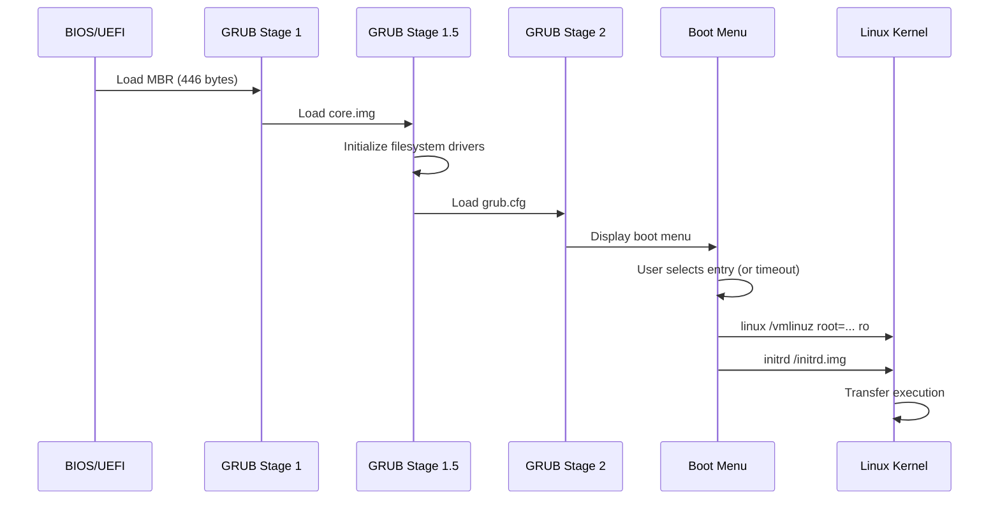
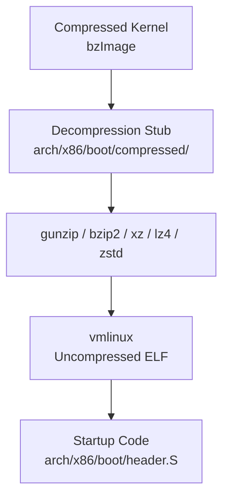
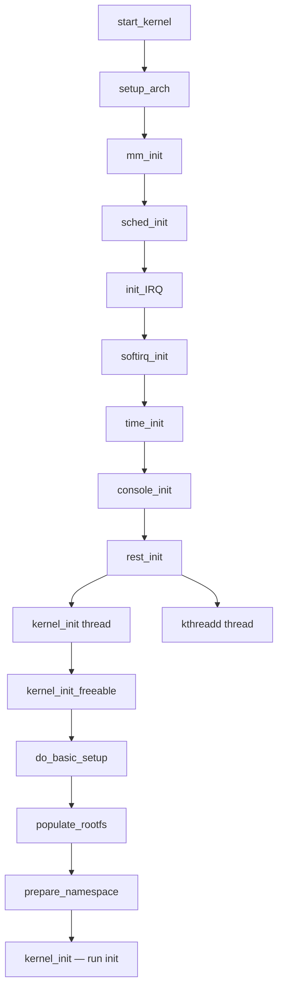
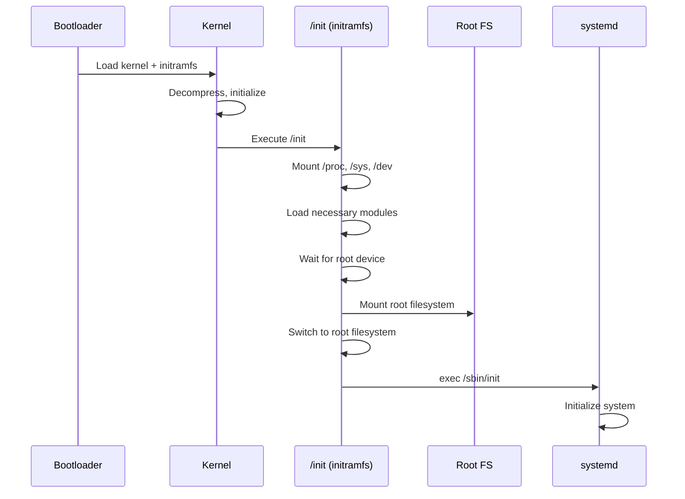
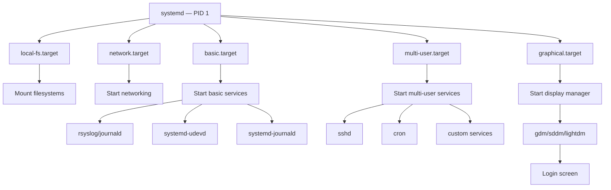

# Linux Boot Process

## Introduction

The Linux boot process is the sequence of events from power-on to a fully operational userspace environment. Understanding this process is essential for debugging boot failures, optimizing boot time, and configuring system behavior.

The boot chain involves multiple stages: firmware initialization, bootloader execution, kernel decompression, kernel initialization, and userspace startup. Each stage hands control to the next, progressively bringing the system to life.

## Boot Chain Overview



## Phase 1: Firmware (BIOS/UEFI)

### Legacy BIOS

The BIOS (Basic Input/Output System) performs:

1. **POST** (Power-On Self-Test): Tests hardware components
2. **Hardware initialization**: Initializes CPU, memory, peripherals
3. **Boot device selection**: Reads boot order from CMOS
4. **MBR loading**: Loads the first 512 bytes (Master Boot Record) of the boot device into memory at address `0x7C00`
5. **Transfer execution**: Jumps to the MBR code

```
MBR Layout (512 bytes):
┌───────────────────────────────────────────────┐
│ Bootstrap Code (446 bytes)                    │
├───────────────────────────────────────────────┤
│ Partition Table (64 bytes, 4 entries × 16B)   │
├───────────────────────────────────────────────┤
│ Boot Signature (0x55AA)                       │
└───────────────────────────────────────────────┘
```

### UEFI

UEFI (Unified Extensible Firmware Interface) is the modern replacement for BIOS:

1. **SEC (Security Phase)**: Initial security checks
2. **PEI (Pre-EFI Initialization)**: Memory and CPU initialization
3. **DXE (Driver Execution Environment)**: Load UEFI drivers
4. **BDS (Boot Device Selection)**: Select and load bootloader
5. **TSL (Transient System Load)**: Load OS bootloader
6. **RT (Runtime)**: Runtime services available to OS

```bash
# Check if system uses UEFI
$ [ -d /sys/firmware/efi ] && echo "UEFI" || echo "BIOS"
UEFI

# View UEFI variables
$ efibootmgr -v
BootCurrent: 0000
Timeout: 2 seconds
BootOrder: 0000,0001,0002
Boot0000* ubuntu	HD(1,GPT,...,0x800,0x100000)/File(\EFI\ubuntu\shimx64.efi)
Boot0001* Windows Boot Manager	HD(1,GPT,...,0x800,0x100000)/File(\EFI\Microsoft\Boot\bootmgfw.efi)
Boot0002* UEFI: USB Drive	USB(...)/File(\EFI\BOOT\BOOTX64.EFI)

# View UEFI boot entries
$ ls /sys/firmware/efi/efivars/
Boot0000-8be4df61-93ca-11d2-aa0d-00e098032b8c
BootOrder-8be4df61-93ca-11d2-aa0d-00e098032b8c
...
```

### EFI System Partition (ESP)

```bash
# ESP is a FAT32 partition containing bootloader files
$ sudo mount /dev/sda1 /mnt
$ tree /mnt/EFI/
/mnt/EFI/
├── BOOT
│   └── BOOTX64.EFI        # Default bootloader
└── ubuntu
    ├── grubx64.efi         # GRUB EFI binary
    ├── shimx64.efi         # Secure Boot shim
    └── mmx64.efi           # MOK manager
```

## Phase 2: Bootloader (GRUB)

### GRUB 2 Architecture

GRUB 2 (GRand Unified Bootloader version 2) is the most common Linux bootloader:

```bash
# GRUB configuration file
$ cat /boot/grub/grub.cfg | head -30
# /boot/grub/grub.cfg - GRUB configuration

set default=0
set timeout=5

menuentry 'GNU/Linux' --class gnu-linux {
    load_video
    insmod gzio
    insmod part_gpt
    insmod ext2
    set root='hd0,gpt2'
    search --no-floppy --fs-uuid --set=root 12345678-1234-1234-1234-123456789abc
    linux /vmlinuz-6.1.0-23-amd64 root=UUID=... ro quiet splash
    initrd /initrd.img-6.1.0-23-amd64
}
```

### GRUB Boot Sequence



### GRUB Configuration

```bash
# Edit GRUB defaults
$ cat /etc/default/grub
GRUB_DEFAULT=0
GRUB_TIMEOUT=5
GRUB_CMDLINE_LINUX_DEFAULT="quiet splash"
GRUB_CMDLINE_LINUX=""
GRUB_TERMINAL="console"

# Add kernel parameters
$ sudo nano /etc/default/grub
# Change: GRUB_CMDLINE_LINUX_DEFAULT="quiet splash nomodeset"

# Regenerate grub.cfg
$ sudo update-grub
# Or on non-Debian systems:
$ sudo grub2-mkconfig -o /boot/grub2/grub.cfg

# Install GRUB to disk
$ sudo grub-install /dev/sda
```

### Alternative Bootloaders

| Bootloader | Description |
|------------|-------------|
| **GRUB 2** | Most common, supports BIOS and UEFI |
| **systemd-boot** | Simple UEFI bootloader, part of systemd |
| **rEFInd** | UEFI boot manager with graphical interface |
| **syslinux** | Lightweight bootloader for removable media |
| **U-Boot** | Primary bootloader for embedded/ARM systems |

## Phase 3: Kernel Decompression

The kernel image is typically compressed. The bootloader loads the compressed image into memory, and a small decompression stub runs first:

### Kernel Image Types

| Image | Description |
|-------|-------------|
| `vmlinux` | Uncompressed ELF kernel (not bootable directly) |
| `bzImage` | Compressed bootable image (x86) |
| `zImage` | Compressed bootable image (ARM, older x86) |
| `Image` | Uncompressed bootable image (ARM64) |
| `Image.gz` | Compressed bootable image (ARM64) |

```bash
# Kernel image on disk
$ ls -la /boot/vmlinuz-*
-rw-r--r-- 1 root root 8234560 Jul 20 10:00 /boot/vmlinuz-6.1.0-23-amd64

# Check kernel image type
$ file /boot/vmlinuz-6.1.0-23-amd64
Linux kernel x86 boot executable bzImage, version 6.1.0-23-amd64

# View compressed kernel sections
$ objdump -h /boot/vmlinuz-6.1.0-23-amd64 | head -10
```

### Decompression Flow



The decompression code supports multiple algorithms:

```bash
# Available decompression methods
$ grep CONFIG_KERNEL_ arch/x86/Kconfig
CONFIG_KERNEL_GZIP=y
# CONFIG_KERNEL_BZIP2 is not set
# CONFIG_KERNEL_LZMA is not set
# CONFIG_KERNEL_XZ is not set
# CONFIG_KERNEL_LZO is not set
# CONFIG_KERNEL_LZ4 is not set
# CONFIG_KERNEL_ZSTD is not set
```

## Phase 4: Kernel Initialization

### start_kernel() — The Main Entry Point

After decompression, the kernel's C entry point is `start_kernel()` in `init/main.c`:

```c
/* init/main.c — start_kernel() (simplified) */
asmlinkage __visible void __init start_kernel(void)
{
    /* Architecture-specific early setup */
    setup_arch(&command_line);

    /* Initialize the console early for debugging */
    console_setup(command_line);

    /* Parse kernel command line */
    parse_early_param();
    parse_args(...);

    /* Initialize subsystems */
    trap_init();           /* Exception handling */
    mm_init();             /* Memory management */
    sched_init();          /* Process scheduler */
    init_IRQ();            /* Interrupt handling */
    time_init();           /* Timekeeping */
    softirq_init();        /* Soft IRQs */
    console_init();        /* Console subsystem */

    /* Print the famous banner */
    pr_notice("%s", linux_banner);

    /* Architecture-specific rest of setup */
    arch_call_rest_init();

    /* Never reached */
}
```

### Initialization Sequence



### The rest_init() Function

```c
/* init/main.c — rest_init() (simplified) */
noinline void __ref rest_init(void)
{
    struct task_struct *tsk;
    int pid;

    /* Create the kernel_init thread (PID 1) */
    pid = kernel_thread(kernel_init, NULL, CLONE_FS);

    /* Create kthreadd (PID 2) — manages kernel threads */
    pid = kernel_thread(kthreadd, NULL, CLONE_FS | CLONE_FILES);

    /* Current thread becomes the idle task (PID 0) */
    cpu_startup_entry(CPUHP_ONLINE);
}
```

### kernel_init() — Finding and Running init

```c
/* init/main.c — kernel_init() (simplified) */
static int __ref kernel_init(void *unused)
{
    /* Wait for kthreadd to be ready */
    wait_for_completion(&kthreadd_done);

    /* Initialize kernel subsystems that need user-space access */
    kernel_init_freeable();

    /* Free __init memory */
    free_initmem();

    /* Mark kernel as fully initialized */
    mark_readonly();

    /* Try to run init from various locations */
    if (ramdisk_execute_command)
        run_init_process(ramdisk_execute_command);  /* /init */

    if (execute_command)
        run_init_process(execute_command);  /* init= parameter */

    /* Default init locations */
    if (!run_init_process("/sbin/init") ||
        !run_init_process("/etc/init") ||
        !run_init_process("/bin/init") ||
        !run_init_process("/bin/sh"))
        return 0;

    panic("No working init found.");
}
```

## Phase 5: initramfs / initrd

### What Is initramfs?

The initramfs (initial RAM filesystem) is a small filesystem loaded into memory by the bootloader. It contains the minimal tools needed to mount the real root filesystem:

```bash
# View initramfs contents
$ lsinitramfs /boot/initrd.img-6.1.0-23-amd64 | head -20
kernel/
kernel/x86/
kernel/x86/microcode/
kernel/x86/microcode/AuthenticAMD.bin
kernel/x86/microcode/GenuineIntel.bin
etc/
etc/modprobe.d/
etc/modprobe.d/amd64-microcode-blacklist.conf
usr/
usr/bin/
usr/bin/busybox
usr/sbin/
usr/sbin/modprobe
init
```

### initramfs vs initrd

| Feature | initramfs | initrd |
|---------|-----------|--------|
| Format | cpio archive | Block device image |
| Mount | Ramfs (no block device) | Loop device |
| Size | Typically smaller | Typically larger |
| Modern | Preferred method | Legacy |

### Boot Flow with initramfs



### The /init Script

The initramfs `/init` script is typically generated by `dracut` or `initramfs-tools`:

```bash
#!/bin/sh
# Simplified initramfs init script

# Mount essential filesystems
mount -t proc proc /proc
mount -t sysfs sysfs /sys
mount -t devtmpfs devtmpfs /dev

# Wait for root device
while [ ! -b /dev/sda2 ]; do
    sleep 0.1
done

# Mount root filesystem
mount -t ext4 /dev/sda2 /root

# Clean up
umount /proc /sys /dev

# Switch to real root
exec switch_root /root /sbin/init
```

### Generating initramfs

```bash
# Debian/Ubuntu — initramfs-tools
$ sudo update-initramfs -u
$ sudo update-initramfs -c -k 6.1.0-23-amd64

# Fedora/RHEL — dracut
$ sudo dracut --force /boot/initramfs-6.1.0.img 6.1.0

# Arch Linux — mkinitcpio
$ sudo mkinitcpio -P

# Manual initramfs creation
$ mkdir initramfs && cd initramfs
$ mkdir -p bin sbin etc proc sys dev
$ cp /bin/busybox bin/
$ ln -s bin/busybox bin/sh
$ find . | cpio -o -H newc | gzip > ../initramfs.cpio.gz
```

### initramfs Debugging

```bash
# Unpack initramfs
$ mkdir /tmp/initrd && cd /tmp/initrd
$ /usr/lib/dracut/skipcpio /boot/initrd.img | zcat | cpio -idmv

# Or
$ unmkinitramfs /boot/initrd.img /tmp/initrd/

# Rebuild with debug output
$ sudo update-initramfs -u -v

# Add break point for debugging
# In GRUB, add: break=premount
# This drops to a shell before mounting root
```

## Phase 6: Userspace Initialization (systemd)

### systemd Boot Sequence

systemd is the most common init system on modern Linux:



### systemd Boot Targets

```bash
# List all targets
$ systemctl list-units --type=target --all

# Check default target
$ systemctl get-default
graphical.target

# View target dependencies
$ systemctl list-dependencies multi-user.target

# Boot into different target
$ sudo systemctl set-default multi-user.target

# View boot process timeline
$ systemd-analyze
Startup finished in 2.345s (firmware) + 1.234s (loader) +
    3.456s (kernel) + 12.789s (userspace) = 19.824s

# Detailed boot time analysis
$ systemd-analyze blame
          10.234s NetworkManager-wait-online.service
           3.456s dev-sda2.device
           2.345s udev-settle.service
           1.234s accounts-daemon.service
           ...

# Critical chain analysis
$ systemd-analyze critical-chain
multi-user.target @12.789s
└─NetworkManager-wait-online.service @2.555s +10.234s
  └─NetworkManager.service @2.345s +210ms
    └─basic.target @2.344s
      └─sockets.target @2.344s
        └─dbus.socket @2.344s
          └─sysinit.target @2.343s
            └─systemd-update-utmp.service @2.342s +1ms
```

### systemd Service Files

```ini
# /etc/systemd/system/my-service.service
[Unit]
Description=My Custom Service
After=network.target
Wants=network-online.target

[Service]
Type=simple
ExecStart=/usr/bin/my-daemon --config /etc/my-daemon.conf
Restart=on-failure
RestartSec=5
StandardOutput=journal
StandardError=journal

[Install]
WantedBy=multi-user.target
```

```bash
# Enable and start the service
$ sudo systemctl enable my-service
$ sudo systemctl start my-service

# Check status
$ systemctl status my-service
```

## Boot Timing Analysis

### Measuring Boot Time

```bash
# systemd-analyze gives overall timing
$ systemd-analyze time
Startup finished in 2.345s (firmware) + 1.234s (loader) +
    3.456s (kernel) + 12.789s (userspace) = 19.824s

# Kernel timing — dmesg timestamps
$ dmesg | head -20
[    0.000000] Linux version 6.1.0-23-amd64
[    0.000000] Command line: BOOT_IMAGE=/vmlinuz-6.1.0-23-amd64 root=... ro
[    0.000000] BIOS-provided physical RAM map:
[    0.000000] BIOS-e820: [mem 0x0000000000000000-0x000000000009fbff] usable
[    0.000000] BIOS-e820: [mem 0x00000000000f0000-0x00000000000fffff] reserved
[    0.004000] tsc: Detected 3000.000 MHz processor
[    0.100000] Calibrating delay loop... 5999.99 BogoMIPS
[    0.200000] Memory: 16384000k/16777216k available

# Print timestamps in human-readable format
$ dmesg -T | head -5
[Mon Jul 21 16:30:00 2024] Linux version 6.1.0-23-amd64

# Show kernel boot timing graphically
$ systemd-analyze plot > boot.svg
```

### Optimizing Boot Time

```bash
# 1. Use faster compression
$ scripts/config --set-val CONFIG_KERNEL_ZSTD y

# 2. Enable parallel module loading
$ scripts/config --enable CONFIG_MODULE_COMPRESS_ZSTD

# 3. Disable unnecessary services
$ sudo systemctl disable NetworkManager-wait-online.service
$ sudo systemctl disable bluetooth.service

# 4. Use kernel command line to skip slow operations
# Add: quiet loglevel=0 fastboot

# 5. Build critical drivers into the kernel (not as modules)
$ scripts/config --enable CONFIG_EXT4_FS  # Built-in, not module

# 6. Use SSD for root filesystem
# 7. Use initramfs with only required modules (dracut --hostonly)
```

## Boot with Different init Systems

### systemd (Default)

```bash
# systemd is PID 1
$ ps -p 1 -o comm=
systemd
```

### SysVinit (Legacy)

```bash
# If using SysVinit, the init is /sbin/init
# Runlevels instead of targets
# 0: halt, 1: single-user, 2-5: multi-user, 6: reboot
```

### OpenRC

```bash
# Common on Gentoo and Alpine Linux
# Init scripts in /etc/init.d/
```

### BusyBox init

```bash
# Minimal init for embedded systems
# Reads /etc/inittab
```

### Custom init

```bash
# You can specify a custom init via kernel command line
# init=/bin/bash   — drops to a shell (recovery)
# init=/usr/lib/systemd/systemd  — explicit systemd
# init=/path/to/custom/init  — your own init
```

## Boot Debugging

### Common Boot Problems

```bash
# 1. Kernel panic — no init found
[    5.123456] Kernel panic - not syncing: No working init found.
# Solution: Check initramfs, root= parameter, init binary

# 2. Root filesystem not found
[    3.456789] VFS: Cannot open root device "sda2" or unknown-block(8,2)
# Solution: Check root= parameter, ensure driver is built-in

# 3. Kernel command line issues
# Check GRUB configuration and kernel parameters
```

### Kernel Debug Boot Parameters

```bash
# In GRUB, press 'e' to edit boot entry and add parameters:

# Enable verbose boot
# Remove "quiet splash" or add:
earlyprintk=vga          # Early console output
loglevel=7               # Maximum kernel log level
debug                    # Enable debug messages

# Break at specific boot stages
# break=premount    — Break before mounting root
# break=mount       — Break after mounting root
# break=bottom      — Break at end of initramfs

# Boot into single-user mode
# single or init=/bin/bash

# Disable specific subsystems
# noapic nolapic     — Disable APIC (interrupt controller)
# acpi=off           — Disable ACPI
# nohz=off           — Disable tickless
```

### Serial Console for Remote Debugging

```bash
# Enable serial console in GRUB
# Add to kernel command line:
console=ttyS0,115200n8

# Or for both video and serial:
console=tty0 console=ttyS0,115200n8

# QEMU with serial console
$ qemu-system-x86_64 \
    -kernel arch/x86/boot/bzImage \
    -append "console=ttyS0 root=/dev/sda2" \
    -nographic \
    -m 2G
```

## Further Reading

- [The Linux Kernel Documentation](https://docs.kernel.org/)
- [LWN.net - Linux and free software news](https://lwn.net/)
- [GNU Project Documentation](https://www.gnu.org/doc/doc.html)
- [GNU Manuals](https://www.gnu.org/manual/manual.html)
- [Free Software Directory](https://directory.fsf.org/wiki/Main_Page)
- [Planet GNU](https://planet.gnu.org/)
- [Free Software Books](https://www.gnu.org/doc/other-free-books.html)

- [Linux kernel boot documentation](https://www.kernel.org/doc/html/latest/admin-guide/booting.html)
- [Boot process overview (kernel.org)](https://www.kernel.org/doc/html/latest/admin-guide/initrd.html)
- [systemd boot documentation](https://www.freedesktop.org/software/systemd/man/bootup.html)
- [UEFI specification](https://uefi.org/specifications)
- [GRUB 2 manual](https://www.gnu.org/software/grub/manual/grub/)
- [kernel.org boot parameters](https://www.kernel.org/doc/html/latest/admin-guide/kernel-parameters.html)
- [Linux boot time optimization](https://elinux.org/Boot_Time)

## Related Topics

- [Kernel Overview](overview.md) — Kernel architecture
- [Kernel Architecture](architecture.md) — Subsystem details
- [Command Line Parameters](cmdline-params.md) — Boot parameters
- [Configuration](configuration.md) — Kernel configuration
- [Kernel Modules](modules.md) — Module loading during boot
